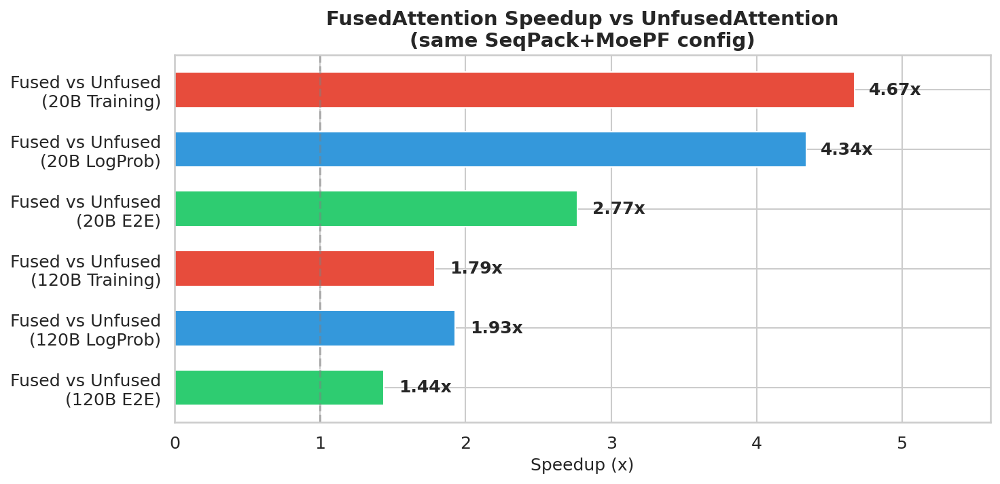
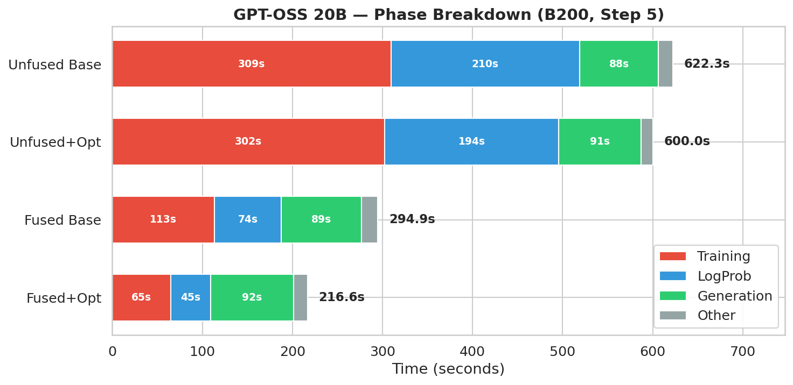
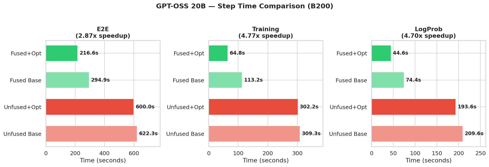
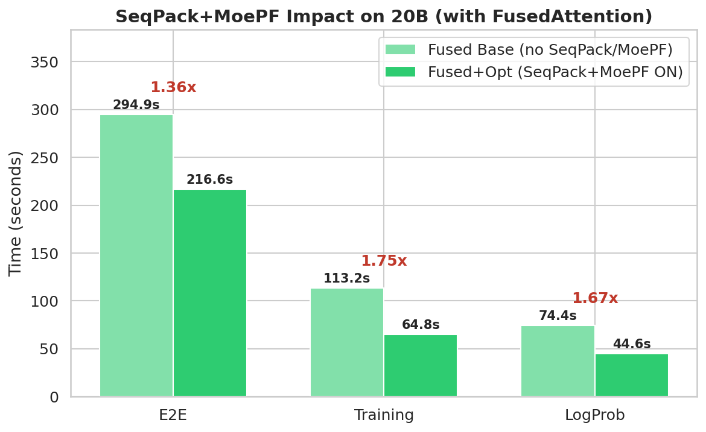
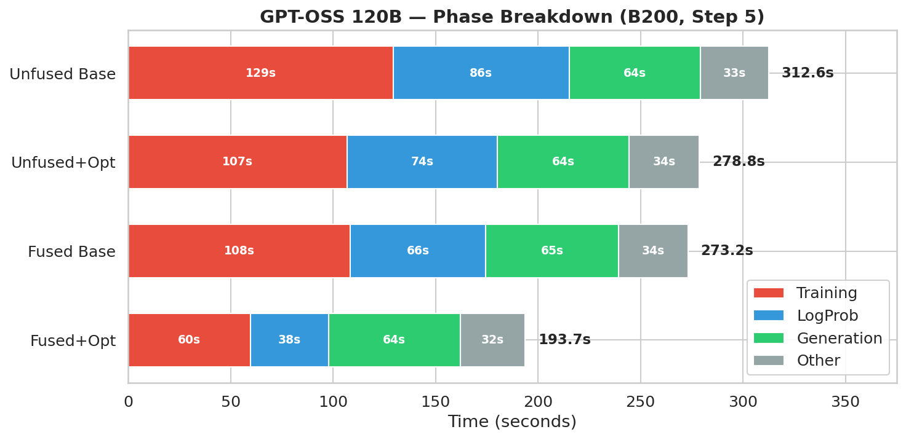
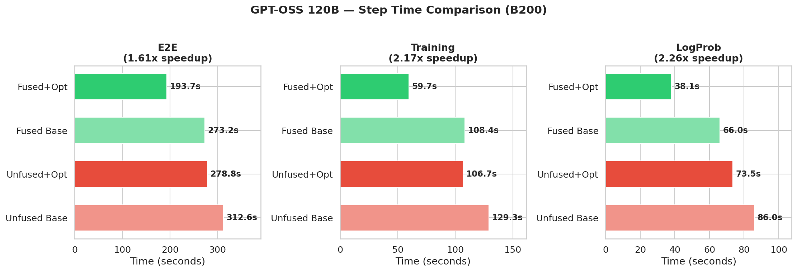
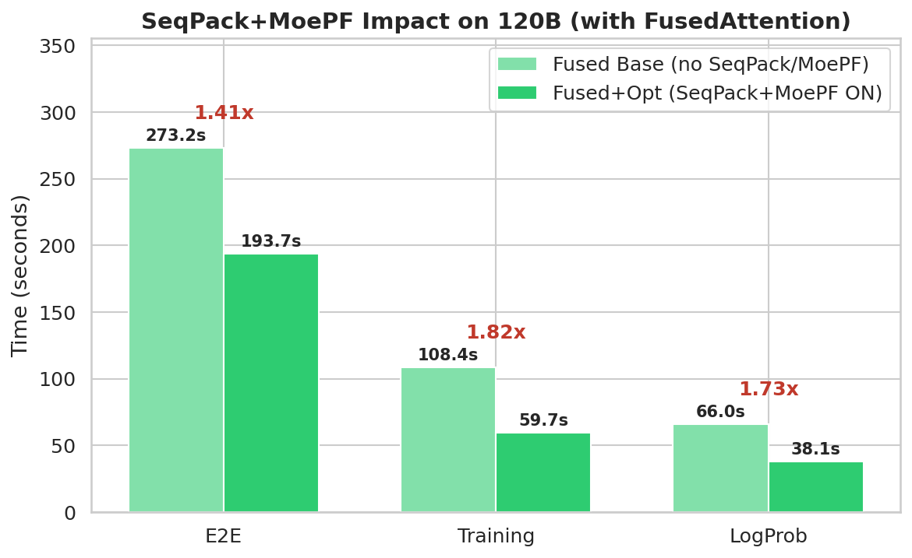

# FusedAttention Performance Comparison on B200

**Hardware**: B200 (sm100) | **Container**: nemo_rl_nightly (TE 2.12.0, cuDNN 9.18.1)
**All runs**: 2048 samples (64×32), 10 steps, alltoall dispatcher, sequence_parallel=true

---

## Speedup Overview

---

## GPT-OSS 20B — 2 Nodes (16 GPUs)

### E2E Step Time (Step 5)

| Config | Attention | SeqPack | MoePF | Step Time | vs Unfused Base |
|--------|-----------|---------|-------|-----------|-----------------|
| **Fused+Opt** | **FusedAttn** | **ON** | **ON** | **216.6s** | **2.87x** |
| Fused Base | FusedAttn | OFF | OFF | 294.9s | 2.11x |
| Unfused+Opt | Unfused | ON | ON | 600.0s | 1.04x |
| Unfused Base | Unfused | OFF | OFF | 622.3s | 1.00x |

### Per-Phase Breakdown (Step 5)

| Phase | Fused+Opt | Fused Base | Unfused+Opt | Unfused Base |
|-------|-----------|------------|-------------|--------------|
| **Training** | **64.8s** | 113.2s | 302.2s | 309.3s |
| **LogProb** | **44.6s** | 74.4s | 193.6s | 209.6s |
| Generation | 91.9s | 89.2s | 91.0s | 87.5s |
| Other | 15.3s | 18.1s | 13.2s | 15.9s |

### Phase Breakdown

### E2E / Training / LogProb Comparison

### Fused Base → Fused+Opt (SeqPack+MoePF Impact)

---

## GPT-OSS 120B — 4 Nodes (32 GPUs)

### E2E Step Time (Step 5)

| Config | Attention | SeqPack | MoePF | Step Time | vs Unfused Base |
|--------|-----------|---------|-------|-----------|-----------------|
| **Fused+Opt** | **FusedAttn** | **ON** | **ON** | **193.7s** | **1.61x** |
| Fused Base | FusedAttn | OFF | OFF | 273.2s | 1.14x |
| Unfused+Opt | Unfused | ON | ON | 278.8s | 1.12x |
| Unfused Base | Unfused | OFF | OFF | 312.6s | 1.00x |

### Per-Phase Breakdown (Step 5)

| Phase | Fused+Opt | Fused Base | Unfused+Opt | Unfused Base |
|-------|-----------|------------|-------------|--------------|
| **Training** | **59.7s** | 108.4s | 106.7s | 129.3s |
| **LogProb** | **38.1s** | 66.0s | 73.5s | 86.0s |
| Generation | 64.3s | 64.9s | 64.3s | 64.1s |
| Other | 31.6s | 33.9s | 34.3s | 33.2s |

### Phase Breakdown

### E2E / Training / LogProb Comparison

### Fused Base → Fused+Opt (SeqPack+MoePF Impact)

---

## Speedup Summary

### 1. FusedAttention vs Unfused (same SeqPack+MoePF=ON)

| Phase | GPT-OSS 20B | GPT-OSS 120B |
|-------|-------------|--------------|
| Training | **4.67x** | **1.79x** |
| LogProb | **4.34x** | **1.93x** |
| E2E Step | **2.77x** | **1.44x** |
| Generation | ~1.0x (no change) | ~1.0x (no change) |

### 2. SeqPack+MoePF Effect (with FusedAttention)

| Phase | GPT-OSS 20B | GPT-OSS 120B |
|-------|-------------|--------------|
| Training | **1.75x** (113→65s) | **1.82x** (108→60s) |
| LogProb | **1.67x** (74→45s) | **1.73x** (66→38s) |
| E2E Step | **1.36x** (295→217s) | **1.41x** (273→194s) |

### 3. Best vs Worst (Fused+Opt vs Unfused Base)

| Phase | GPT-OSS 20B | GPT-OSS 120B |
|-------|-------------|--------------|
| Training | **4.77x** (309→65s) | **2.17x** (129→60s) |
| LogProb | **4.70x** (210→45s) | **2.26x** (86→38s) |
| E2E Step | **2.87x** (622→217s) | **1.61x** (313→194s) |

---

## Conclusion

1. **FusedAttention delivers up to 4.67x training speedup** on GPT-OSS 20B and 1.79x on 120B
2. **sequence_packing + moe_permute_fusion adds 1.75-1.82x training speedup** on top of FusedAttention
3. Combined best config (Fused+Opt) is **2.87x faster E2E** on 20B and **1.61x** on 120B vs baseline
4. Speedup is larger on 20B because attention is a bigger fraction of total compute
5. Generation time (~64-92s) is unaffected — only training and logprob phases benefit
6. **Recommended config**: FusedAttention + sequence_packing=true + moe_permute_fusion=true

### Requirements
- Transformer Engine 2.12.0 (use `NRL_FORCE_REBUILD_VENVS=true` with nightly container)
- cuDNN >= 9.18.1
- GPT-OSS 20B: add `policy.megatron_cfg.sequence_parallel=true` (YAML defaults to false)
