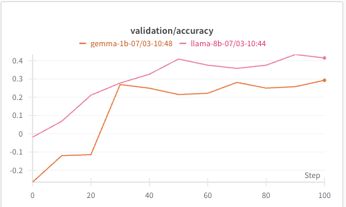

## What I have run so far

- 07/01: successfully run sliding_puzzle example:
```
uv run python examples/run_grpo_sliding_puzzle.py logger.wandb_enabled=True grpo.val_at_start=True policy.train_micro_batch_size=1 cluster.gpus_per_node=8
```

- 07/02: run with new dummy retreival simulator:
Task: env generate and hide a list of integers, LLM agent need to guess how many unique integers are in the list.
Allow LLM to ask for the list of integers by index one by one.

```
uv run python examples/run_grpo_unique_numbers.py
```
or with llama-8b
```
uv run python examples/run_grpo_unique_numbers.py --config examples/configs/grpo_unique_numbers_llama8b.yaml
```

Seems there is some chat render/format issue with gemma-1b, leading to low quality in the beginning. Llama-8b seems to be better?



see full wandb metrics [here](https://wandb.ai/jialeichen777-google/grpo-simulated-retrieval/reports/Dummy-retrival-task-for-llama-8b-and-gemma-1b--VmlldzoxMzQ0OTgyMw)

- 07/15: enabled ADK

example ADK script is here: nemo_rl/environments/simulated_user/adk_utils.py

Intergrated into training:
```
export GOOGLE_GENAI_USE_VERTEXAI=1 && export GOOGLE_API_KEY="xxxxxxxxxxxxxx" && export GOOGLE_CLOUD_PROJECT="xxxxxxx" && export GOOGLE_CLOUD_LOCATION="xxxxxx" 
uv run python examples/run_grpo_unique_numbers.py --config examples/configs/grpo_adk_llama8b.yaml
```

- 07/16: there are 3 issues found:
    1) Gemini endpoint may fail with 500 error sometimes, maybe related to rate limit. Need to understand more.
    2) training is very slow, took ~ 20min for 64x32 samples completing rollout for 1 step on a 8GPU H100 node.
    3) chat format has issue. <- mostly fixed by chat_template and some hacks but not elegent.

    Also added a debug script for samller run
    ```
    uv run python examples/run_grpo_unique_numbers.py --config examples/configs/grpo_adk_llama8b_debug.yaml > llama3.log 2>&1
    ```

    Also added logs for ADK agent convo history printout. Seems to work as expected.