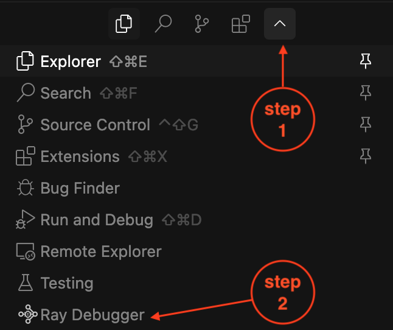
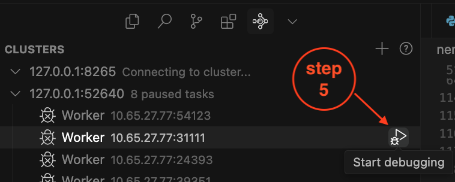

# Debugging in NeMo RL

## Debugging in the Driver Script

You will notice that setting breakpoints in the driver script (outside of `@ray.remote`),
will not pause the program. To enable this behavior, you should set the `RAY_DEBUG` environment
to legacy:

```sh
RAY_DEBUG=legacy uv run ....
```

## Debugging in the Worker/Actors (on SLURM)

Since Ray programs can spawn many workers/actors, we need to use the Ray Distributed Debugger
to properly jump to the breakpoint on each worker.

### Prerequisites
* Install [Ray Debugger VS Code/Cursor extension](https://docs.ray.io/en/latest/ray-observability/ray-distributed-debugger.html).
* Launched [interactive cluster](./cluster.md#interactive-launching) with `ray.sub`
* Launch VS Code/Cursor on the SLURM login node (where `squeue`/`sbatch` is available).

### Port-forwarding from the Head Node

On the login node, we can query the nodes used by the interactive `ray.sub` submission like so:

```sh
teryk@slurm-login:~$ squeue --me
             JOBID PARTITION        NAME     USER ST       TIME  NODES NODELIST(REASON)
           2504248     batch ray-cluster   terryk  R      15:01      4 node-12,node-[22,30],node-49
```

The first node is always the head node, so we need to port forward the dashboard port to the login node:

```sh
# Traffic from the login node's $LOCAL is forwarded to node-12:$DASHBOARD_PORT
# - If you haven't changed the default DASHBOARD_PORT in ray.sub, it is likely 8265 
# - Choose a LOCAL_PORT that isn't taken. If the cluster is multi-tenant, 8265
#   on the login node is likely taken by someone else.
ssh -L $LOCAL_PORT:localhost:$DASHBOARD_PORT -N node-12

# Example chosing a port other than 8265 for the LOCAL_PORT
ssh -L 52640:localhost:8265 -N node-12
```

### Open the Ray Debugger Extension

In VS Code/Cursor, open the Ray Debugger extension by clicking on the Ray icon in the activity bar or by searching for "View: Show Ray Debugger" in the command palette (Ctrl+Shift+P or Cmd+Shift+P).



### Add the Ray Cluster

Click on the "Add Cluster" button in the Ray Debugger panel.


Enter the address and port you set up in the port forwarding step. If you followed the example above using port 52640, you would enter:


### Add a Breakpoint and Run Your Program

All breakpoints that are reached while the program is running will be visible in the Ray Debugger Panel dropdown for the cluster `127.0.0.1:52640`. Click
`Start Debugging` to jump to one worker's breakpoint.

Note that you can jump between breakpoints across all workers with this process.

