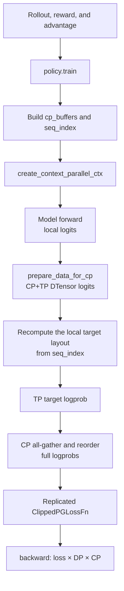
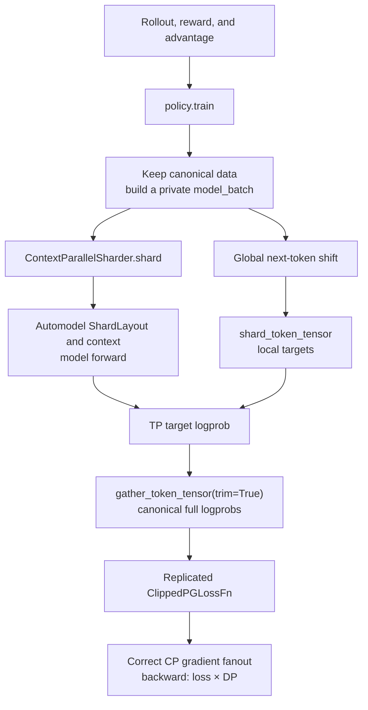
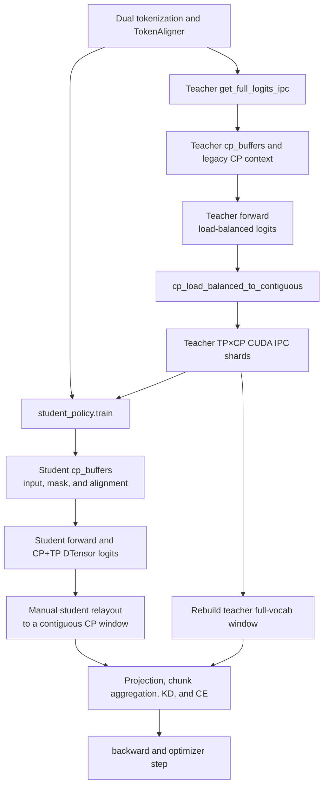
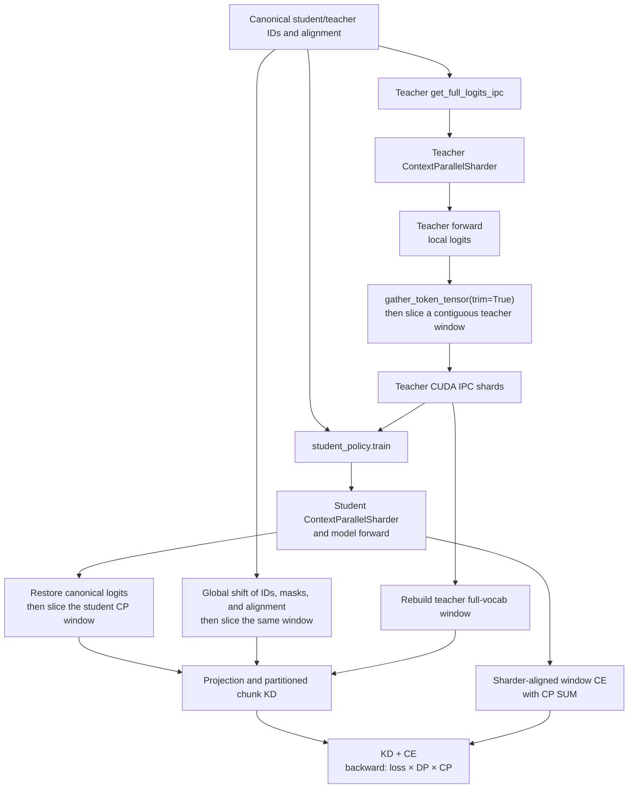

# Automodel r0.6.0 Upgrade and Context-Parallel Integration

This PR updates NeMo-RL for Automodel r0.6.0 and migrates the DTensor v2
context-parallel (CP) path to Automodel's model-owned sharding protocol. The comparison is
based on NeMo-RL commits
[`72d48e7f`](https://github.com/NVIDIA-NeMo/RL/commit/72d48e7ff0cb8d1076520f89e853f3f53aa97472)
and
[`11e14e91`](https://github.com/NVIDIA-NeMo/RL/commit/11e14e91af64f9c4136ab97fa2191a3de5a1af1d).

## 1. Automodel API Updates

The r0.6.0 upgrade consolidates distributed setup and model loading:

| Area | Before | After |
| --- | --- | --- |
| Device mesh | `create_device_mesh(...)` | `MeshContext.build(FSDP2Config, ParallelismSizes, ...)` |
| Model loading | Separate mesh, FSDP, MoE, and activation-checkpointing arguments | One `DistributedSetup` passed to `from_pretrained()` |
| FSDP backend | `FSDP2Config(backend="nccl")` | `backend` removed; mesh setup selects NCCL |
| MoE config import | `components.moe.config` | `components.distributed.config` |

The main upstream change is Automodel
[#2266](https://github.com/NVIDIA-NeMo/Automodel/pull/2266). This PR also updates moved
modules and checkpoint helpers, and removes obsolete local shims and compatibility
workarounds ([#3187](https://github.com/NVIDIA-NeMo/Automodel/pull/3187),
[#1172](https://github.com/NVIDIA-NeMo/Automodel/pull/1172),
[#2289](https://github.com/NVIDIA-NeMo/Automodel/pull/2289),
[#1634](https://github.com/NVIDIA-NeMo/Automodel/pull/1634), and
[#2419](https://github.com/NVIDIA-NeMo/Automodel/pull/2419)).

## 2. CP API Changes and Support Scope

This section covers the Automodel DTensor v2 training path only. Megatron-Core CP is out of
scope. The pre-refactor support summary uses NeMo-RL
[`dd39d384`](https://github.com/NVIDIA-NeMo/RL/commit/dd39d384db8727f95069f33327047740d70e19a9)
as the baseline.

### 2.1 Automodel CP API Changes

Automodel [#2937](https://github.com/NVIDIA-NeMo/Automodel/pull/2937) introduced
`ContextParallelSharder`, making Automodel the single owner of the model's token layout.

| Before | After |
| --- | --- |
| NeMo-RL builds `cp_buffers` and `seq_index` | `ContextParallelSharder.shard()` pads and shards the model batch |
| Workers call `create_context_parallel_ctx()` directly | `shard()` returns the model forward context |
| Loss code assumes the legacy head-tail layout | `ShardLayout` describes the layout selected for this forward |
| NeMo-RL manually shards and gathers token tensors | `shard_token_tensor()` and `gather_token_tensor()` reuse the model layout |

Automodel now owns layout selection, padding, and attention transport. NeMo-RL retains the
canonical RL data, loss semantics, TP vocabulary operations, public outputs, and backward
scaling.

### 2.2 Pre-Refactor CP Support

The legacy implementation supported the following combinations, subject to its fixed
round-robin layout:

| Scope | CP support | Notes |
| --- | --- | --- |
| Text LLM | Supported | Policy forward, loss, logprob, and logits post-processing had CP paths |
| VLM | Not supported | Model setup and batch processing rejected multimodal input with `CP>1` |
| Gemma 3 / Qwen3.5 dense | Not supported | Explicit model guards; Qwen3.5 MoE required its designated backend |
| GRPO / DAPO | Supported | CP-aware logprob and policy loss paths; DTensor CP recipes existed |
| SFT | Supported | Reused the generic policy loss path |
| DPO | Supported | Restored full-sequence policy/reference logprobs before DPO loss |
| Same-tokenizer distillation | Supported | Teacher top-k export and student distillation loss were CP-aware |
| X-token distillation | Supported with a specialized path | Supported heterogeneous teacher/student TP and CP; no sequence packing |
| PPO | Not supported end to end | The actor path supported CP, but the Automodel critic/value path required `CP=1` |
| Reward model training | Not supported | The DTensor RM entry point rejected `CP>1` |

Additional restrictions were `CP + sequence packing`, `CP + DTensor sequence parallel`, and
sequence lengths incompatible with the legacy `2 * cp_size` load-balanced split.

### 2.3 GRPO Workflow Before and After

The GRPO algorithm remains unchanged. The refactor changes how `policy.train()` and
`policy.get_logprobs()` map between canonical RL data and the model's local CP layout.

#### Before

NeMo-RL implemented the layout twice: once for the model input and again for targets and
logprobs. This coupled the loss path to Automodel's legacy round-robin assumptions.

#### After

| Key change | Before | After |
| --- | --- | --- |
| Layout owner | Automodel and NeMo-RL both encoded the layout | Automodel owns `ShardLayout` |
| Data boundary | `cp_buffers` could mutate loss-side tensors in place | Canonical data stays unchanged; only `model_batch` is sharded |
| Target/result mapping | Manual `seq_index` and CP collectives | Sharder token operations |
| Backward scale | Fixed `loss × DP × CP` | CP fanout is removed; GRPO uses `loss × DP` |

For `CP=1`, the worker keeps the direct fast path without constructing a sharder.

### 2.4 X-Token Distillation Workflow Before and After

The outer algorithm is unchanged: tokenize and align fixed text, export teacher full-vocab
logits over CUDA IPC, then compute projection-based KD and student CE. The refactor changes
how teacher and student model layouts are converted into the contiguous windows required by
the IPC and alignment contracts.

#### Before

Teacher export, student relayout, and alignment localization all depended on the fixed legacy
layout.

#### After

| Key change | Before | After |
| --- | --- | --- |
| Teacher IPC window | Manual legacy relayout | Sharder gather, trim, then contiguous slice |
| Student loss window | Rebuilt from CP DTensor assumptions | Restored from the actual `ShardLayout` |
| Alignment | Student fields traveled through `cp_buffers` | Canonical fields are globally shifted, then sliced |
| Preserved x-token logic | CUDA IPC, heterogeneous TP/CP, projection, chunk alignment, and multi-teacher aggregation | Unchanged; these remain NeMo-RL responsibilities |

X-token KD and CE keep a partitioned gradient contract, so `cp_gradient_fanout=1` and the
effective backward scale remains `loss × DP × CP`. This differs from GRPO's replicated
full-sequence loss.

### 2.5 GRPO Test Results

We compared `CP=1/2/4` over 20 GRPO/DAPO steps using `train/reward`,
`train/mean_gen_tokens_per_sample`, and `train/gen_kl_error`. The three CP configurations
show similar short-run trends without a persistent CP-size-dependent shift. These runs check
functional and short-run numerical consistency; they are not long-horizon convergence tests.

#### Gemma 4 E2B (DAPO)

#### Gemma 4 26B (DAPO)

#### Qwen3.5 35B-A3B (GRPO)

