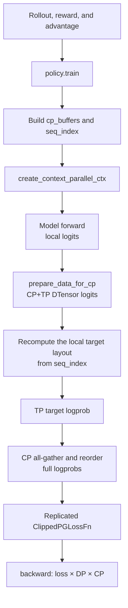
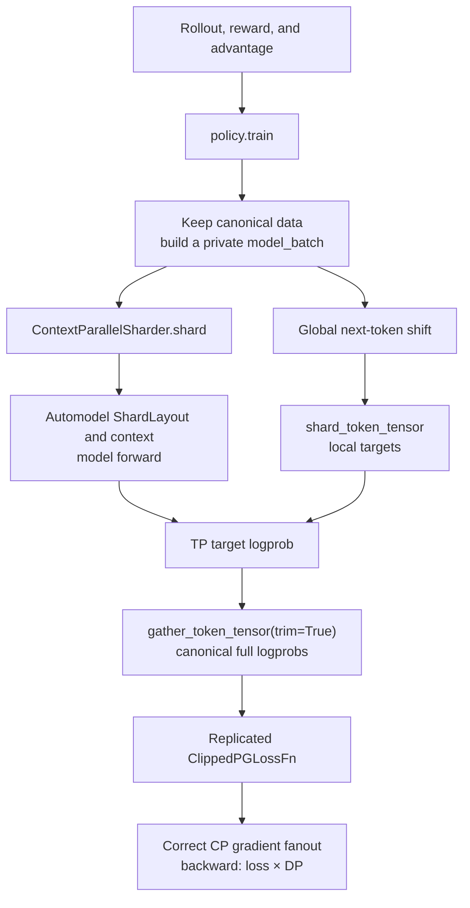
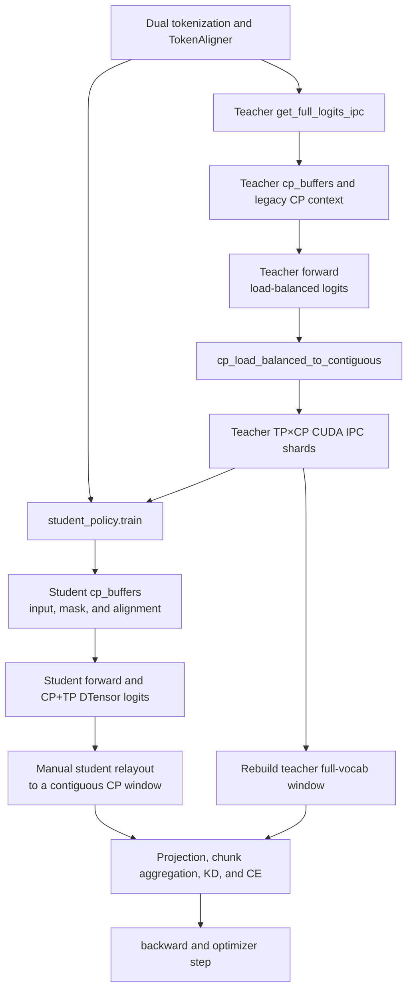
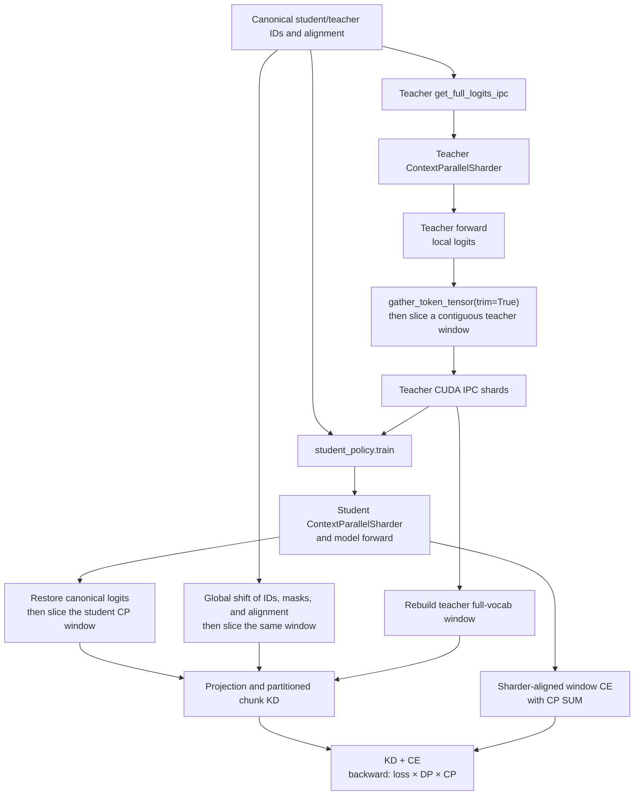
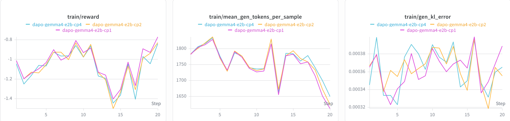
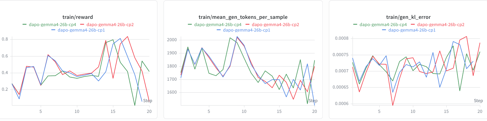
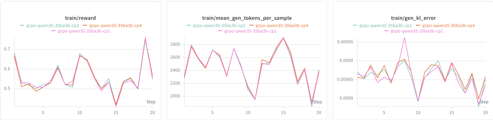
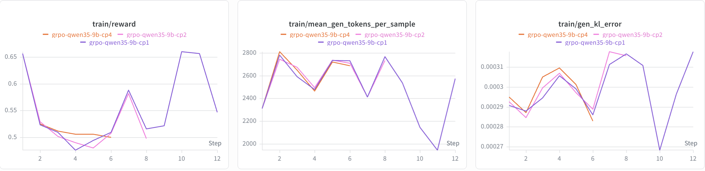

# Automodel r0.6.0 Upgrade and Context-Parallel Integration

This PR updates NeMo-RL for Automodel r0.6.0 and migrates the DTensor v2
context-parallel (CP) path to Automodel's model-owned sharding protocol.

## 1. Automodel r0.6.0 Upgrade

### 1.1 Environment Upgrade

Automodel r0.6.0 requires the following dependency updates in `pyproject.toml`; `uv.lock`
is regenerated accordingly:

| Dependency | Before | After |
| --- | --- | --- |
| Base `transformers` range | `>=5.5.0,<5.9.0` | `>=5.5.0,<5.13.0` |
| Automodel extra | `transformers>=5.5.0,<5.6.0` | `transformers>=5.12.1,<5.13.0` |
| `megatron-fsdp` | No root constraint | Git constraint at [`455389c4`](https://github.com/yuhezhang-ai/Megatron-LM/commit/455389c480af6b3acdca74c7830c68b3274eb083) |

The Transformers update matches Automodel's `transformers==5.12.1` pin. The
`megatron-fsdp` constraint mirrors Automodel's Megatron-LM fork and revision so `uv` can
resolve the transitive URL dependency consistently.

### 1.2 Automodel API Updates

The r0.6.0 upgrade consolidates distributed setup and model loading:

| Area | Before | After |
| --- | --- | --- |
| Device mesh | `create_device_mesh(...)` | `MeshContext.build(FSDP2Config, ParallelismSizes, ...)` |
| Model loading | Separate mesh, FSDP, MoE, and activation-checkpointing arguments | One `DistributedSetup` passed to `from_pretrained()` |
| FSDP backend | `FSDP2Config(backend="nccl")` | `backend` removed; mesh setup selects NCCL |
| MoE config import | `components.moe.config` | `components.distributed.config` |

The simplified call pattern is shown below. The main upstream change is Automodel
[#2266](https://github.com/NVIDIA-NeMo/Automodel/pull/2266).

```python
mesh_context = MeshContext.build(
    fsdp2_config,
    ParallelismSizes(tp_size=tp_size, cp_size=cp_size, ep_size=ep_size),
    world_size=world_size,
)

distributed_setup = DistributedSetup(
    mesh_context=mesh_context,
    strategy_config=fsdp2_config,
    pipeline_config=None,
    moe_parallel_config=moe_config if ep_size > 1 else None,
    activation_checkpointing=activation_checkpointing,
)

model = model_class.from_pretrained(
    model_name,
    distributed_setup=distributed_setup,
    # Other model arguments remain unchanged.
)
```

Other module and checkpoint API changes:

- `BackendConfig` now comes from `components.models.common.utils`
  ([#1172](https://github.com/NVIDIA-NeMo/Automodel/pull/1172)).
- `Checkpointer._should_write_hf_metadata()` became the module-level
  `_should_write_hf_metadata(config)`, and `save_consolidated` now uses enum semantics.
  Call `_normalize_save_consolidated()` after updating checkpoint configuration through
  `setattr` ([#2289](https://github.com/NVIDIA-NeMo/Automodel/pull/2289)).

The upgrade also removes three compatibility workarounds:

- Use Automodel's exported `NeMoAutoModelForTokenClassification` directly instead of the
  local NeMo-RL shim ([#1634](https://github.com/NVIDIA-NeMo/Automodel/pull/1634)).
- Remove the `_restore_loaded_model_dtype()` monkeypatch; Automodel now preserves an
  explicitly requested FP32 parameter dtype
  ([#2419](https://github.com/NVIDIA-NeMo/Automodel/pull/2419)).
- Remove the Gemma 4 KV-sharing `use_cache=True` workaround. This is enabled by the newer
  Transformers version used with r0.6.0, rather than by an Automodel API change
  ([Transformers #45312](https://github.com/huggingface/transformers/pull/45312)).

## 2. CP API Changes and Support Scope

This section covers the Automodel DTensor v2 training path only.

### 2.1 Automodel CP API Changes

Automodel [#2937](https://github.com/NVIDIA-NeMo/Automodel/pull/2937) unifies CP handling
across models and attention backends through `ContextParallelSharder`. A basic call is:

```python
cp_sharder = ContextParallelSharder(model, device_mesh, batch)
train_ctx, sharded_batch = cp_sharder.shard(batch)

with train_ctx():
    output = model(**sharded_batch)
```

`shard()` selects the model-specific layout, pads and shards the batch, and returns the
forward context required by the attention backend. Its `ShardLayout` records the global
position of each local token and the sequence lengths before and after padding. Callers
therefore consume the actual layout used by the forward instead of assuming how tokens
were partitioned.

This creates a clear ownership boundary: Automodel manages the CP layout and communication
for model inputs, while NeMo-RL reuses that layout to compute RL losses and restore public
outputs such as logprobs and top-k logits.

### 2.2 Pre-Refactor CP Support

The legacy implementation supported the following combinations, subject to its fixed
round-robin layout:

| Scope | CP support | Notes |
| --- | --- | --- |
| Text LLM | Supported | Policy forward, loss, logprob, and logits post-processing had CP paths |
| VLM | Not supported | Model setup and batch processing rejected multimodal input with `CP>1` |
| Gemma 3 / Qwen3.5 dense | Not supported | Explicit model guards; Qwen3.5 MoE required its designated backend |
| GRPO / DAPO | Supported | CP-aware logprob and policy loss paths; DTensor CP recipes existed |
| SFT | Supported | Reused the generic policy loss path |
| DPO | Supported | Restored full-sequence policy/reference logprobs before DPO loss |
| Same-tokenizer distillation | Supported | Teacher top-k export and student distillation loss were CP-aware |
| X-token distillation | Supported with a specialized path | Supported heterogeneous teacher/student TP and CP; no sequence packing |
| PPO | Not supported end to end | The actor path supported CP, but the Automodel critic/value path required `CP=1` |
| Reward model training | Not supported | The DTensor RM entry point rejected `CP>1` |

Additional restrictions were `CP + sequence packing`, `CP + DTensor sequence parallel`, and
sequence lengths incompatible with the legacy `2 * cp_size` load-balanced split.

### 2.3 GRPO Workflow Before and After

The GRPO algorithm remains unchanged. The refactor changes how `policy.train()` and
`policy.get_logprobs()` map between canonical RL data and the model's local CP layout.

#### Before



NeMo-RL implemented the layout twice: once for the model input and again for targets and
logprobs. This coupled the loss path to Automodel's legacy round-robin assumptions.

#### After



| Key change | Before | After |
| --- | --- | --- |
| Layout owner | Automodel and NeMo-RL both encoded the layout | Automodel owns `ShardLayout` |
| Data boundary | `cp_buffers` could mutate loss-side tensors in place | Canonical data stays unchanged; only `model_batch` is sharded |
| Target/result mapping | Manual `seq_index` and CP collectives | Sharder token operations |
| Backward scale | Fixed `loss × DP × CP` | CP fanout is removed; GRPO uses `loss × DP` |

For `CP=1`, the worker keeps the direct fast path without constructing a sharder.

### 2.4 X-Token Distillation Workflow Before and After

The outer algorithm is unchanged: tokenize and align fixed text, export teacher full-vocab
logits over CUDA IPC, then compute projection-based KD and student CE. The refactor changes
how teacher and student model layouts are converted into the contiguous windows required by
the IPC and alignment contracts.

#### Before



Teacher export, student relayout, and alignment localization all depended on the fixed legacy
layout.

#### After



| Key change | Before | After |
| --- | --- | --- |
| Teacher IPC window | Manual legacy relayout | Sharder gather, trim, then contiguous slice |
| Student loss window | Rebuilt from CP DTensor assumptions | Restored from the actual `ShardLayout` |
| Alignment | Student fields traveled through `cp_buffers` | Canonical fields are globally shifted, then sliced |
| Preserved x-token logic | CUDA IPC, heterogeneous TP/CP, projection, chunk alignment, and multi-teacher aggregation | Unchanged; these remain NeMo-RL responsibilities |

X-token KD and CE keep a partitioned gradient contract, so `cp_gradient_fanout=1` and the
effective backward scale remains `loss × DP × CP`. This differs from GRPO's replicated
full-sequence loss.

### 2.5 GRPO Test Results

We compared `CP=1/2/4` in short GRPO/DAPO runs using `train/reward`,
`train/mean_gen_tokens_per_sample`, and `train/gen_kl_error`. The three CP configurations
show similar short-run trends without a persistent CP-size-dependent shift. These runs check
functional and short-run numerical consistency; they are not long-horizon convergence tests.

#### Gemma 4 E2B (DAPO)



#### Gemma 4 26B (DAPO)



#### Qwen3.5 35B-A3B (GRPO)



#### Qwen3.5 9B (GRPO)


