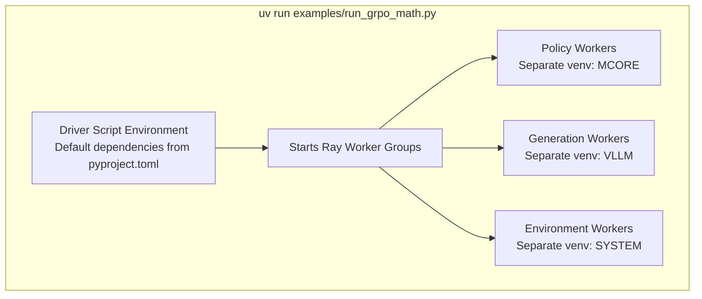
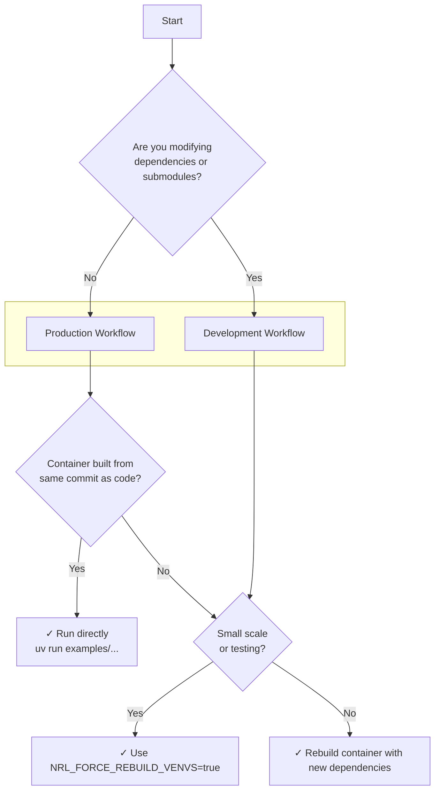

# Dependency Management

NeMo RL's dependency management system supports both production and development workflows through a flexible virtual environment architecture. This document explains how NeMo RL manages Python dependencies and when to use each workflow.

## Workflows Overview

NeMo RL supports two distinct workflows based on your use case:

### Production Workflow

A **production workflow** is when you run NeMo RL out-of-the-box (OOTB) without modifying dependencies. This is the typical scenario for:
- Running NeMo RL with pre-built Docker containers
- Using released versions without local modifications
- Executing examples with default dependencies

In a production workflow, the container's dependencies are aligned with your NeMo RL code version, and you can run applications directly without rebuilding environments.

> [!NOTE]
> This workflow is similar to how other machine learning projects work: the Docker image is static, and there's an assumption that the code works with the container's pre-installed dependencies. However, NeMo RL goes further by providing mechanisms to align container dependencies dynamically, offering more flexibility than traditional static containers.

### Development Workflow

A **development workflow** is when you actively modify dependencies, submodules, or work with code that has different dependency requirements than the container. Common scenarios include:

- **Version mismatch**: Using a container built from commit A, but your local NeMo RL code is at commit B, where B has different submodule versions or Python dependencies than A
- **Dependency changes**: Actively developing new features that require updated Python packages
- **Submodule modifications**: Working with modified versions of Megatron-LM, NeMo-Automodel, or other submodules

> [!WARNING]
> If your container was built from commit `abc123` which used `vllm==0.9.0`, but your local checkout is at commit `def456` which requires `vllm==0.10.0`, you are in a development workflow. The container's cached environments won't match your code's requirements.

## How `uv run` Works

When you execute a NeMo RL application, such as:

```bash
uv run examples/run_grpo_math.py
```

This command actually performs several steps behind the scenes:

```bash
uv lock + uv sync + source .venv/bin/activate + python examples/run_grpo_math.py
```

Let's break down each component:

### 1. `uv lock`

Resolves all dependencies specified in [`pyproject.toml`](https://github.com/NVIDIA-NeMo/RL/blob/main/pyproject.toml#L21-L54) and generates a lock file (`uv.lock`) that pins exact versions of all packages. This ensures reproducible builds across different environments.

### 2. `uv sync`

Synchronizes your local virtual environment with the locked dependencies. It installs or updates packages as needed to match the lock file.

The virtual environment location depends on your runtime environment:
- **Bare metal**: The venv defaults to `.venv/` local to your NeMo RL clone
- **Container**: The container sets [`UV_PROJECT_ENVIRONMENT=/opt/nemo_rl_venv`](https://github.com/NVIDIA-NeMo/RL/blob/main/docker/Dockerfile#L67), so the environment is synced to `/opt/nemo_rl_venv`. Note that this location is ephemeral to the container instance.

### 3. `source .venv/bin/activate`

Activates the virtual environment, setting up the Python path and environment variables so your script runs with the correct dependencies.

### 4. `python examples/run_grpo_math.py`

Executes your driver script within the activated environment.

## Multi-Environment Architecture



The driver script (`examples/run_grpo_math.py`) runs with the [default dependencies specified in `pyproject.toml`](https://github.com/NVIDIA-NeMo/RL/blob/main/pyproject.toml#L21-L54) (without optional extras like `mcore` or `vllm`). However, the application creates multiple worker groups, each potentially requiring different Python environments.

### Worker Groups and Virtual Environments

Within the driver script, NeMo RL starts multiple [`RayWorkerGroup`](https://github.com/NVIDIA-NeMo/RL/blob/main/nemo_rl/distributed/worker_groups.py#L303-L313) instances. Each worker group manages a set of Ray actors that execute tasks in parallel. These workers may have specialized dependency requirements:

- **Policy workers** (e.g., using Megatron-Core): Require `mcore` dependencies
- **Generation workers** (e.g., vLLM): Require `vllm` dependencies  
- **Environment workers** (e.g., math evaluation): Use system/base dependencies

Each worker type is mapped to a specific Python executable configuration in the [`ACTOR_ENVIRONMENT_REGISTRY`](https://github.com/NVIDIA-NeMo/RL/blob/main/nemo_rl/distributed/ray_actor_environment_registry.py#L27-L46). This registry defines which virtual environment should be used for each actor type:

```python
ACTOR_ENVIRONMENT_REGISTRY: dict[str, str] = {
    "nemo_rl.models.generation.vllm.vllm_worker.VllmGenerationWorker": VLLM_EXECUTABLE,
    "nemo_rl.models.policy.megatron_policy_worker.MegatronPolicyWorker": MCORE_EXECUTABLE,
    "nemo_rl.environments.math_environment.MathEnvironment": PY_EXECUTABLES.SYSTEM,
    # ... more mappings
}
```

> [!NOTE]
> For more details on how workers define and use their Python executables, see the [UV Documentation](uv.md#worker-configuration).

## Container Pre-caching

When a [release container](../docker.md#release-image) is built, it pre-caches:

1. **Virtual environments**: All worker virtual environments are created and stored in the container
2. **UV cache**: Python packages are pre-downloaded into the UV cache directory

This pre-caching significantly speeds up application startup in production workflows, as workers can immediately use their required environments without downloading or compiling packages.

### When Pre-cached Environments Are Sufficient

If your local NeMo RL checkout has the **same** Python dependencies and submodules as the container was built with, the pre-cached environments work seamlessly. You can simply run:

```bash
uv run examples/run_grpo_math.py
```

The workers will use the pre-cached virtual environments, and your application starts quickly.

## Handling Dependency Changes

When your local code has **different** dependencies than the container (development workflow), you have two options:

### Option 1: Force Rebuild Environments

Set the `NRL_FORCE_REBUILD_VENVS` environment variable to rebuild all worker virtual environments on every node:

```bash
export NRL_FORCE_REBUILD_VENVS=true
uv run examples/run_grpo_math.py
```

This approach works on both single-node and multi-node setups. On multi-node runs, each node will independently rebuild its virtual environments.

> [!TIP]
> This approach is convenient for local development and small-scale experiments. It automatically rebuilds environments to match your current dependency specifications without requiring a container rebuild.

> [!WARNING]
> On large-scale distributed runs (e.g., >=32 nodes), rebuilding environments on all ranks can add significant overhead. Consider rebuilding the container for these large runs

### Option 2: Rebuild the Container

For production deployments or large-scale runs, rebuild the container to pre-cache the new dependencies:

```bash
docker buildx build --target release -f docker/Dockerfile --tag my-registry/nemo-rl:custom .
```

> [!TIP]
> Rebuilding the container is recommended when:
> - Running a job with many nodes (>=32 nodes)
> - Dependencies have changed significantly
> - You need reproducible, fast startup times
> - Multiple team members need the same environment

The rebuilt container will have all virtual environments pre-cached with your updated dependencies, eliminating runtime overhead.

## Decision Guide

Use this flowchart to determine which workflow applies to you:



## Summary

NeMo RL's dependency management balances flexibility and performance:

- **Production workflows** leverage pre-cached environments for fast, reliable startup
- **Development workflows** can dynamically rebuild environments as needed (this works on multi-node setups as well)
- **Container rebuilds** provide the best performance for large-scale production runs
- **`NRL_FORCE_REBUILD_VENVS`** offers flexibility for development without container rebuilds

Choose the approach that best fits your scale and development velocity. For most users, the production workflow with pre-built containers will provide the optimal experience.

