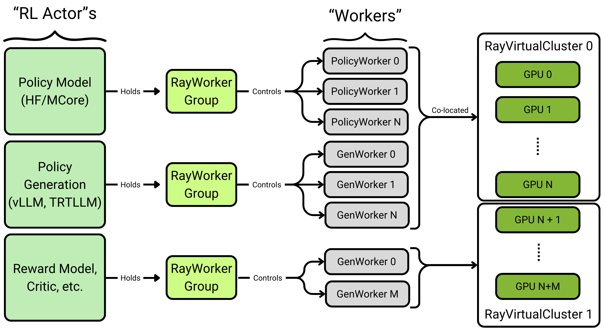

# Design and Philosophy

This section introduces the NeMo RL APIs, configuration patterns (Pydantic `BaseModel` for user-facing config, `@dataclass` for internal classes, and `TypedDict` for legacy config still being migrated), and addresses the challenges of online Reinforcement Learning (RL). Coordinating various software components, known as RL Actors, requires effective resource allocation, isolation, coordination, and communication. Our design philosophy focuses on creating modular abstractions for these tasks, ensuring scalability from one GPU to thousands, regardless of the RL Actor's implementation.

## Motivation

Online RL demands the coordination of a wide range of software components and models, for example:
- Policy Model/Training Framework
- Fast Inference Framework (vLLM, SGLANG, TRT-LLM)
- Reward Environments, Critics, etc.

We refer to each of these pieces of software as an **RL Actor**.

Fundamentally, managing these RL Actors requires four key capabilities:
- Resource them (provide GPUs/CPUs).
- Isolate them: RL Actors need isolated process environments with configurable dependencies to avoid global variable or dependency conflicts.
- Coordinate them (control).
- Communicate between them (data).

## Design

We create composable and hackable abstractions for each layer of the tasks above
- Resourcing: {py:class}`RayVirtualCluster <nemo_rl.distributed.virtual_cluster.RayVirtualCluster>`
- Isolation: {py:class}`RayWorkerGroup <nemo_rl.distributed.worker_groups.RayWorkerGroup>`
- Coordination: A Single-Process Controller using Ray
- Communication: Data flows through one of the following:
  - the single controller 
  - a communication scheme set-up by the controller such as
    - NCCL Collectives
    - Multiprocess Queues

By creating a common interface for these four tasks, the RL algorithm code can scale seamlessly from 1 to 1000 GPUs and remain independent of the specific RL Actor (such as Megatron, Hugging Face, or abstract components like a grad student with pen and paper).



### {py:class}`RayVirtualCluster <nemo_rl.distributed.virtual_cluster.RayVirtualCluster>`
VirtualCluster provides a basic abstraction on top of Ray Placement Groups that allow you to section off a part of your compute resources for WorkerGroups to run on as though they had their own cluster. They support running just one WorkerGroup on each VirtualCluster, or *colocation*, where multiple WorkerGroups share resources (i.e running policy training(hf) and generation(vllm) on the same GPUs in-turn).

```python
class RayVirtualCluster:
"""
    Creates a virtual distributed cluster using Ray placement groups.

    This class simplifies distributed training setup by:
    - Creating placement groups that represent logical compute nodes.
    - Allocating GPU and CPU resources for distributed workers.
    - Managing communication between distributed processes.

    - Bundle: A resource allocation unit (ex: 4 GPUs on a single node).
    - Worker: A process that performs computation (model training/inference).
    - Node: A physical or virtual machine containing multiple bundles.
"""
    def __init__(self, bundle_ct_per_node_list: List[int], {other args}):
        """
        Initialize a virtual cluster using Ray placement groups.

        Args:
            bundle_ct_per_node_list: List specifying GPU bundles per node
                                    (e.g., [2,2] creates 2 nodes with 2 GPU bundles each)
        """
    def get_placement_groups(self):
        """
        Returns a list of placement groups that have at least one bundle, filtering out empty nodes.
        This represents the "virtual cluster" - only nodes that are actually being used.

        Returns:
            List of placement groups that have at least one bundle.
        """
```

### {py:class}`RayWorkerGroup <nemo_rl.distributed.worker_groups.RayWorkerGroup>`
All work is done by "Worker Processes" (Ray Actors) that run on a small unit of resources (usually 1 CPU or 1 CPU+GPU). These workers are managed by the *RayWorkerGroup*.
```python
class RayWorkerGroup:
    """
    Manages a group of distributed Ray worker/actor processes that execute tasks in parallel.

    This class creates and manages Ray actor instances that run on resources
    allocated by a RayVirtualCluster. It handles:
    - Worker creation and placement on specific GPU resources.
    - Setting up distributed training environment variables (rank, world size, etc.).
    - Executing methods across all workers in parallel.
    - Collecting and aggregating results.
    - Support for tied worker groups where multiple workers process the same data.
    """
```
`RayWorkerGroup` provides functions like `run_all_workers_single_data` and `run_all_workers_multiple_data` to control and communicate to individual worker processes.


### Single-Controller and Execution Diagram

We control the RL Actors using a single-process head controller. Using the aforementioned abstractions, this allows us to represent the main loop of Group Relative Policy Optimization (GRPO) as though we were working on 1 GPU.

```python
# data processing/transformations between each step omitted
def grpo_train(
    policy: PolicyInterface,
    policy_generation: GenerationInterface,
    environment: EnvironmentInterface,
    dataloader: Iterable[BatchedDataDict[DatumSpec]],
):
    loss_fn = GRPOLossFn()
    for batch in dataloader:
        batch.repeat_interleave(num_generations_per_prompt) # repeat for GRPO
        generations = policy_generation.generate(batch) 
        rewards = environment.step(generations)

        logprobs = policy.get_logprobs(generations)
        reference_logprobs = policy.get_reference_logprobs(generations)

        training_data = calculate_grpo_training_data(generations, logprobs, reference_logprobs, rewards)
        policy.train(generations, logprobs, reference_logprobs, GRPOLossFn)
```
For a complete implementation of GRPO, including validation, checkpointing, memory movement, and the data processing steps not detailed here, see [grpo_train](../../nemo_rl/algorithms/grpo.py).


### Configuration Schema: BaseModel, dataclass, and TypedDict

In NeMo RL, we use YAML files for configuration and load them with `omegaconf` into a recursive `dict`. Within the codebase, that `dict` is described by typed schemas so static type checkers can flag undocumented attributes or incompatible types.

We are **incrementally migrating** the config schema from `typing.TypedDict` (v1) to `pydantic.BaseModel` (v2). Both styles currently coexist; the migration is tracked by `tests/unit/test_config_v2.py` against the reference configs in `tests/unit/reference_configs/`, which will be removed once the migration is complete.

**v2 — the new conventions (use these for all new code):**

- **`pydantic.BaseModel` — v2, user-facing config (the new default).** Any class a user touches via YAML — currently the top-level `MasterConfig` of each algorithm and a few shared schemas like `ClippedPGLossConfig` — is declared as a `BaseModel` with `extra="allow"`. The `extra="allow"` flag preserves the original motivation behind picking `TypedDict`: users can keep using older configuration files with obsolete or user-defined keys without load-time errors. New user-facing configs should be `BaseModel`, and existing `TypedDict`s should be migrated as the codebase moves.
- **`@dataclass` — v2, internal classes, *not* loaded from YAML.** Process-local data containers (worker metadata, datum specs, internal state passed between Python components) use `@dataclass`. They are not config and should not pretend to be.

**v1 — legacy, being migrated away:**

- **`typing.TypedDict` — v1, legacy user-facing config still being migrated.** Most nested sub-configs (e.g. `GRPOConfig`, `RewardScalingConfig`) remain `TypedDict` for now and continue to follow the same default-handling rules below until they are migrated to `BaseModel`. Do not add new `TypedDict`-based config classes.

We follow a few design principles regarding configuration:

1. **New code follows the v2 convention directly.** Any newly added user-facing config class must be a `pydantic.BaseModel` (with `extra="allow"` when appropriate), and any newly added internal (non-YAML-loaded) class must be a `@dataclass`. Do not introduce new `TypedDict`-based config classes — only edits to existing, not-yet-migrated `TypedDict`s are expected.
2. **Defaults must not be scattered at call sites.** A default for a config value must live in exactly one place; readers should never have to grep through algo code to find what value was actually used. *Where* that one place is depends on the schema:
    * **v2 (BaseModel, user config):** the default lives on the BaseModel field as a Python value — the BaseModel class is the centralized source of truth for user-facing defaults, and the exemplar YAML serves as documentation / override examples. E.g. `disable_ppo_ratio: bool = False` on `ClippedPGLossConfig`.
    * **v1 (TypedDict, legacy user config):** the default lives only in the exemplar YAML — no class-level default, and the Python code reads the value without supplying a fallback.
    * **`@dataclass` (internal class, not loaded from YAML):** usually no defaults at all — fields are populated by the producing code path.
    * Forbidden examples (any schema type — they all hide defaults at the call site):
        * `grpo_config.get("num_prompts_per_step", 32)`
        * `policy_config.get("model_name", "meta-llama/Llama-3.1-8B-Instruct")`
        * `def build_policy(policy_cfg, precision: str = "bfloat16"): ...`
    * Acceptable examples:
        * Reading a required attribute directly: `master_config.policy.precision` (v2) or `policy_cfg["precision"]` (v1).
        * If an attribute is typed `typing.NotRequired[...]` (TypedDict) or `Optional[...] = None` (BaseModel), it is okay for the code to check for absence/`None`, e.g., `assert "milestones" in scheduler_cfg` or `if "milestones" in scheduler_cfg`.
3. All configs under [examples/configs/*.yaml](https://github.com/NVIDIA-NeMo/RL/tree/main/examples/configs) are exemplars and should contain the defaults for required or optional attributes, along with accompanying documentation.
   * All configs under [examples/configs/recipes/**/*.yaml](https://github.com/NVIDIA-NeMo/RL/tree/main/examples/configs/recipes) do not require documentation and are snapshots of functional configurations.
4. All configs under [examples/configs/**/*.yaml](https://github.com/NVIDIA-NeMo/RL/tree/main/examples/configs) should adhere to their `BaseModel`/`TypedDict` subclass configuration. Unit tests in [tests/unit/test_config_validation.py](https://github.com/NVIDIA-NeMo/RL/blob/main/tests/unit/test_config_validation.py) validate schema compliance, and [tests/unit/test_config_v2.py](https://github.com/NVIDIA-NeMo/RL/blob/main/tests/unit/test_config_v2.py) guards the in-progress v1→v2 migration against accidental new defaults.
