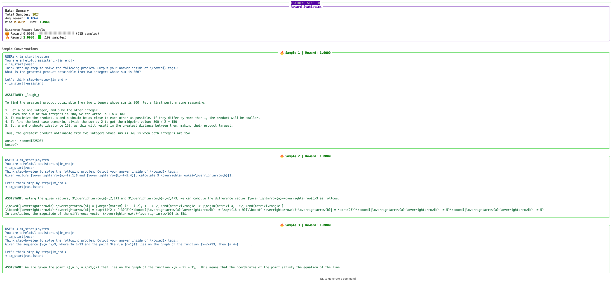

# Logger

The logger is designed to track key training metrics (including distributed metrics with reductions and timing), as well as providing integration with logging backends like WandB and Tensorboard.

## Requirements

* Tracking distributed metrics with specified reductions (mean, max, etc.)
* Tracking distributed timing with (usually) 'max' reduction across ranks
* Logging:
   * WandB
   * Tensorboard

## Overall Design

Since there is a single controller, the single process running the main training loop will gather the metrics and do the logging.

To handle multiple logger backends, we will have a {py:class}`LoggerInterface <nemo_rl.utils.logger.LoggerInterface>` interface that the {py:class}`TensorboardLogger <nemo_rl.utils.logger.TensorboardLogger>` and {py:class}`WandbLogger <nemo_rl.utils.logger.WandbLogger>` will implement:

```python
class LoggerInterface(ABC):
    """Abstract base class for logger backends."""

    @abstractmethod
    def log_metrics(self, metrics: Dict[str, Any], step: int, prefix: Optional[str]: "") -> None:
        """Log a dictionary of metrics."""
        pass

    @abstractmethod
    def log_hyperparams(self, params: dict[str, Any]) -> None:
        """Log dictionary of hyperparameters."""
        pass
```

A {py:class}`Logger <nemo_rl.utils.logger.Logger>` wrapper class will also implement {py:class}`LoggerInterface <nemo_rl.utils.logger.LoggerInterface>` and maintain a list of loggers to which it delegates writing logs. This will be the main class the user uses in the training loop. Usage example:

```python
# Initialize logger with both wandb and tensorboard enabled
logging_config = {
    "wandb_enabled": True,
    "tensorboard_enabled": False,

    "wandb": {
        "project": "grpo-dev",
        "name": "grpo-dev-logging",
    },
    "swanlab": {
        "project": "nemo-rl",
        "name": "grpo-dev-logging",
    },
    "tensorboard": {
        "log_dir": "logs",
    },
}
logger = Logger(
    cfg=logger_config,
)

# Log metrics, will go to both wandb and tensorboard
logger.log_metrics({
    "loss": 0.123,
}, step=10)
```

## Validation Pretty Logging

The logger supports pretty-formatted logging of validation samples to help visualize model outputs during training. This feature is controlled by the `num_val_samples_to_print` configuration parameter.

```python
logger:
  wandb_enabled: false
  swanlab_enabled: false
  tensorboard_enabled: false
  num_val_samples_to_print: 10
```

When `num_val_samples_to_print` is set to a value greater than 0, the logger will generate well-formatted text outputs for the specified number of validation samples. This is particularly useful for:

1. Quickly inspecting model generation quality during training.
2. Comparing inputs and outputs side-by-side.
3. Tracking validation sample performance over time.

### Example Output

When enabled, the pretty logging will generate formatted text similar to:



## GPU Metric Logging

NeMo RL monitors GPU memory and utilization through [system metrics](https://docs.ray.io/en/latest/ray-observability/reference/system-metrics.html#system-metrics) exposed by Ray nodes. While Ray makes these metrics available for tools like Prometheus, NeMo RL directly polls GPU memory and utilization data and logs them to TensorBoard and/or WandB.

This approach allows us to offer the same GPU metric tracking on all loggers (not just Wandb) and simplifies the implementation greatly.

This feature is enabled with the `monitor_gpus` configuration parameter. The frequency of data collection and flushing to the loggers is controlled by the `gpu_collection_interval` and `gpu_flush_interval` parameters, both specified in seconds.

```python
logger:
  wandb_enabled: false
  swanlab_enabled: false
  tensorboard_enabled: false
  monitor_gpus: true
  gpu_monitoring:
    collection_interval: 10
    flush_interval: 10
```

:::{note}
While it is feasible to monitor using remote workers, the implementation requires careful attention to details to ensure:
* Logs sent back to the driver do not introduce significant overhead.
* Metrics remain clear and interpretable, avoiding issues like double counting caused by colocated workers.
* Workers can gracefully flush their logs in case of failure.
* Logging behaves consistently across TensorBoard and Wandb.
* Workers that spawn other workers accurately report the total resource usage of any grandchild workers.

Due to these complexities, we opted for a simpler approach: collecting metrics exposed by the Ray metrics server from the driver.
:::
