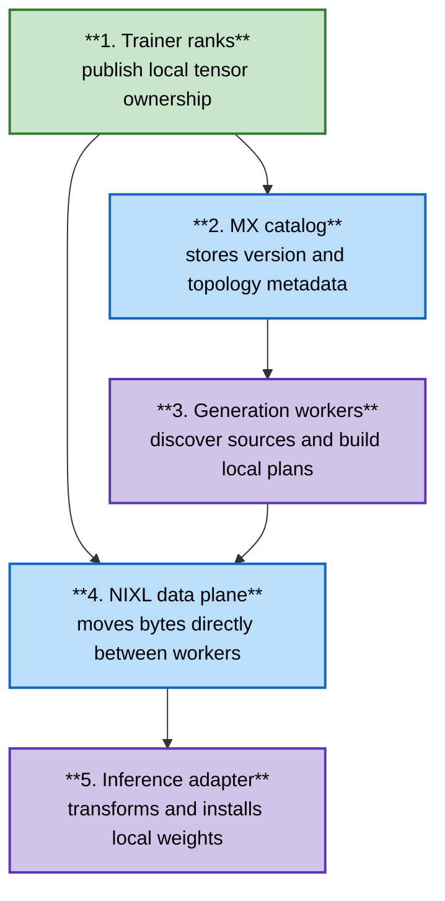

# ModelExpress Weight Refit

## Problem

NeMo RL periodically updates generation workers with policy weights produced by
trainer workers. A non-colocated deployment needs to move those weights across
different process groups and may use different parallel layouts for training
and generation.

ModelExpress (MX) provides source discovery and topology-aware transfer
planning for this exchange. The NVIDIA Inference Xfer Library (NIXL) can move
the resulting byte ranges directly between worker memory. The MX server stores
metadata and lifecycle state; it does not carry model weights.

## Recommended design

Each trainer rank publishes the tensor shards it already owns. Generation
workers discover a complete source set for one policy version, request the
ranges required by their local layout, and install the received tensors through
an inference-engine adapter.

NeMo RL remains responsible for selecting the policy version, invoking the
weight synchronizer, and deciding when the generation fleet is ready. MX owns
source metadata, transfer planning, and the transport/installer boundary.

## Trainer publication

The trainer publisher describes:

- model version and numerical format;
- Tensor Parallelism (TP), Pipeline Parallelism (PP), and Expert Parallelism
  (EP) coordinates;
- each tensor's global shape and locally owned range;
- expert ownership where applicable; and
- the Megatron-to-Hugging Face name mapping required by receiver-side
  translation.

DTensor publication uses `DTensor.to_local()` and records its single sharded
axis. Partial placements and tensors sharded across multiple mesh axes fail
before publication. Megatron publication classifies native fused, replicated,
and expert parameters without gathering a full model on rank zero.

## NeMo RL integration boundary

The shared `WeightSynchronizer` abstraction owns the complete refit lifecycle.
A future `ModelExpressWeightSynchronizer` will call
`publish_weights_for_model_express()` on the policy, coordinate generation-side
discovery and apply, and report completion through the same interface used by
the existing synchronizers.

This change adds only the policy publication operation. It does not add a
second synchronization lifecycle to algorithm code.

## Current status

**Partially aligned:** trainer-side rank-local publication and metadata
construction are implemented for the existing DTensor worker and the Megatron
worker. Focused unit tests cover DTensor shard ranges, unsupported placements,
replicated-tensor ownership, fused QKV classification, and global expert IDs.

Generation-side discovery, transfer, translation, installation, and
end-to-end GPU validation are follow-up work. The AutoModel-based
`DTensorPolicyWorkerV2` does not yet implement MX publication. Existing NeMo RL
weight synchronizers remain unchanged.

## Assumptions

- Published tensor storage remains valid until the corresponding update
  completes.
- Trainer and generation adapters agree on global tensor names or provide an
  explicit translation map.
- The MX publisher exposes a public `reset_tensors()` lifecycle method.
- A selected generation backend supports the requested source and target
  layouts.

## Tradeoffs

- Rank-local publication avoids a trainer-side full-model gather, but requires
  explicit ownership metadata.
- Receiver-side planning supports different trainer and generation layouts,
  but adds a metadata and planning stage before transfer.
- Lazy ModelExpress imports keep the standard NeMo RL installation independent
  of MX, but configuration errors appear when the MX backend is initialized.

## Failure modes

- Unsupported DTensor placement fails before metadata publication.
- Missing ModelExpress APIs fail when the trainer publisher first initializes.
- Incomplete source coverage must fail planning; a generation worker must not
  install a partial model.
- A failed trainer or generation rank causes the global NeMo RL weight update
  to fail rather than advancing only part of the fleet.

## Open questions

- Final user-facing configuration for `ModelExpressWeightSynchronizer`.
- Rank-local publication for `DTensorPolicyWorkerV2`.
- The common install-plan contract between MX reshard planning and the
  inference adapter.
- Retention and read-lease behavior for trainer buffers during long updates.
- Supported behavior for topology changes between policy versions.

## Implementation references

- Trainer helpers: `nemo_rl/distributed/mx_helpers.py`
- Megatron tensor classification:
  `nemo_rl/distributed/mx_megatron_helpers.py`
- Policy interface: `nemo_rl/models/policy/interfaces.py`
- DTensor worker:
  `nemo_rl/models/policy/workers/dtensor_policy_worker.py`
- Megatron worker:
  `nemo_rl/models/policy/workers/megatron_policy_worker.py`
