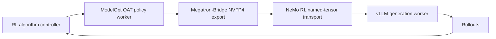

# ModelOpt Real-Quant Refit Architecture

NeMo RL supports deployment-style NVFP4 rollout generation while a Megatron
policy is trained with ModelOpt quantization-aware training. During each
policy refit, Megatron-Bridge exports packed quantized tensors and NeMo RL
loads them into a vLLM generation model without rebuilding the model or its
CUDA graphs.

## Relationship to the overall NeMo RL design

Real-quant refit extends the standard NeMo RL policy-generation workflow. The
algorithm controller continues to coordinate independent policy and generation
workers through the existing interfaces. ModelOpt changes the representation
used by the policy, while this design changes only how a policy update is
exported and installed in the vLLM generation worker.

This design builds on:

- [Design and Philosophy](design-and-philosophy.md), which defines NeMo RL's
  controller, worker, isolation, and communication model;
- [Generation Interface](generation.md), which defines generation backends and
  their weight-update lifecycle; and
- [Quantization-Aware RL](../guides/quantization-aware-rl.md), which documents
  the user workflow, configuration, and supported recipes.

The real-quant path preserves those abstractions: algorithms still call the
same policy and generation interfaces, and non-quantized and fake-quantized
weight updates continue to use their existing paths.

## Component responsibilities

| Component | Responsibility |
|---|---|
| ModelOpt | Quantization configuration, calibration, QAT state, NVFP4 packing, and scale derivation |
| Megatron-Bridge | Megatron-to-Hugging-Face conversion, distributed TP/PP/EP handling, and NVFP4 export |
| NeMo RL | Mode validation, refit scheduling, named-tensor transport, and vLLM reload orchestration |
| vLLM | Checkpoint loading, runtime-layout conversion, kernel selection, stable tensor placement, and KV-cache scale processing |

NeMo RL delegates quantization math and runtime-kernel conversion to ModelOpt,
Megatron-Bridge, and vLLM. Its vLLM integration is limited to the
format-specific adapters required to connect their public interfaces.



## Quantization modes

Both modes use block-16 E2M1 NVFP4 weights with E4M3 block scales.

| Mode | Deployment algorithm | Weights | Activations |
|---|---|---|---|
| W4A4 | `NVFP4` | NVFP4 | NVFP4 with per-projection input scales |
| W4A16 | `W4A16_NVFP4` | NVFP4 | Native model dtype |

The policy and generation workers must use quantization recipes that resolve
to the same mode. Unsupported or mismatched formats fail during setup.

Example routed-expert recipes are provided at:

- [`examples/modelopt/quant_configs/nvfp4_experts.yaml`](../../examples/modelopt/quant_configs/nvfp4_experts.yaml) for W4A4;
- [`examples/modelopt/quant_configs/nvfp4_experts_weightonly.yaml`](../../examples/modelopt/quant_configs/nvfp4_experts_weightonly.yaml) for W4A16.

## Refit lifecycle

Every real-quant refit follows the same lifecycle:

1. NeMo RL validates the policy and generation quantization modes.
2. Megatron-Bridge exports named NVFP4 weights and scale tensors.
3. NeMo RL starts vLLM's layerwise reload lifecycle for the affected
   quantized modules.
4. The normal vLLM model loader consumes the exported tensors.
5. vLLM performs post-load conversion and copies the converted tensors into
   the existing runtime storage.
6. NeMo RL finalizes the reload and synchronizes the device before the
   transport buffer can be reused.

This lifecycle is shared by collective and CUDA IPC transports. vLLM retains
ownership of runtime tensor layouts and preserves tensor addresses referenced
by CUDA graphs.

## vLLM compatibility adapters

NeMo RL registers ModelOpt NVFP4 extensions through vLLM's quantization
registry. The adapters cover:

- W4A16 dense and fused-MoE execution;
- fused-MoE input-scale loading for W4A4;
- rank-local padding required by W4A16 MoE kernels; and
- preservation of runtime kernel references during repeated refits.

Native vLLM processing remains responsible for checkpoint-layout restoration,
post-load conversion, kernel construction, and stable-storage copy-back. The
adapters do not define a separate reload implementation.

## Fused-MoE transport

Megatron-Bridge exports fused expert projections as expert-batched W13 and W2
tensors. Each family contains the packed weight, block scale, and global scale.
W4A4 additionally includes one input scale for each projection.

The receiving adapter validates that each tensor family is complete and maps
it to the checkpoint names accepted by the vLLM model loader. Gated experts
use two W13 shards; non-gated experts use one.

Fused-MoE refit currently requires every vLLM rank to own the full expert set.
Megatron expert parallelism remains supported because Megatron-Bridge gathers
the exported payload before the vLLM refit.

## CUDA IPC buffer lifetime

Layerwise loading may temporarily retain a view of an incoming tensor until a
layer has received its complete payload. NeMo RL ensures that no retained view
aliases a reusable CUDA IPC staging buffer before acknowledging that buffer.
The final acknowledgment is sent only after vLLM finalization and device
synchronization.

## KV-cache behavior

W4A4 and W4A16 weight refit do not enable KV-cache quantization. KV-cache
precision remains controlled by vLLM's `kv_cache_dtype` configuration.

When FP8 KV cache is selected, vLLM owns its scale creation, loading, and
post-load processing. The ModelOpt real-quant adapter does not replace the
vLLM KV-cache processing method or process an attention layer a second time.

## Configuration

Set the same quantization recipe for the policy and generation worker, and
enable real-quant generation:

```yaml
policy:
  quant_cfg: examples/modelopt/quant_configs/nvfp4_experts.yaml

  generation:
    quant_cfg: examples/modelopt/quant_configs/nvfp4_experts.yaml
    real_quant: true
```

Layer selection belongs in a purpose-specific quantization recipe. Existing
shared configs should not be changed to carry experiment-specific exclusions.
Accuracy-driven exclusions should be supported by reproducible sensitivity or
AutoQuant results; exclusions required by an unsupported tensor or operator
contract should be documented in the corresponding recipe.

## Current limitations

- Real-quant rollout generation requires vLLM.
- Policy export currently uses the Megatron policy path and Megatron-Bridge.
- Supported real-quant formats are dynamic block-16 NVFP4 W4A4 and W4A16.
- Fused-MoE vLLM expert parallelism is not supported during refit.
- Model support is recipe-specific and requires end-to-end validation.
