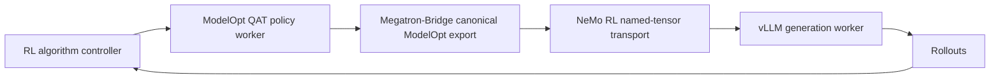

# ModelOpt Real-Quant Refit Architecture

NeMo RL supports deployment-style NVFP4 rollout generation while a Megatron
policy is trained with ModelOpt quantization-aware training. During each
policy refit, Megatron-Bridge exports packed quantized tensors and NeMo RL
loads them into a vLLM generation model without rebuilding the model or its
CUDA graphs.

## Relationship to the overall NeMo RL design

Real-quant refit extends the standard NeMo RL policy-generation workflow. The
algorithm controller continues to coordinate independent policy and generation
workers through the existing interfaces. ModelOpt changes the representation
used by the policy, while this design changes only how a policy update is
exported and installed in the vLLM generation worker.

This design builds on:

- [Design and Philosophy](design-and-philosophy.md), which defines NeMo RL's
  controller, worker, isolation, and communication model;
- [Generation Interface](generation.md), which defines generation backends and
  their weight-update lifecycle; and
- [Quantization-Aware RL](../guides/quantization-aware-rl.md), which documents
  the user workflow, configuration, and supported recipes.

The real-quant path preserves those abstractions: algorithms still call the
same policy and generation interfaces, and non-quantized and fake-quantized
weight updates continue to use their existing paths.

## Component responsibilities

| Component | Responsibility |
|---|---|
| ModelOpt | Quantization configuration, calibration, QAT state, quantized-weight packing, scale derivation, and deployment config generation |
| Megatron-Bridge | Megatron-to-Hugging-Face conversion, distributed TP/PP/EP handling, and canonical ModelOpt export |
| NeMo RL | Policy-first initialization, refit scheduling, named-tensor transport, and public vLLM lifecycle orchestration |
| vLLM | Checkpoint loading, runtime-layout conversion, kernel selection, stable tensor placement, and KV-cache scale processing |

NeMo RL delegates quantization math and runtime-kernel conversion to ModelOpt,
Megatron-Bridge, and vLLM. It passes the policy-derived ModelOpt deployment
config and canonical checkpoint tensors without a second format resolver.


```mermaid
flowchart LR
    A[RL algorithm controller] --> B[ModelOpt QAT policy worker]
    B --> C[Megatron-Bridge canonical ModelOpt export]
    C --> D[NeMo RL named-tensor transport]
    D --> E[vLLM generation worker]
    E --> F[Rollouts]
    F --> A
```

## Quantization modes

Both modes use block-16 E2M1 NVFP4 weights with E4M3 block scales.

| Mode | Deployment algorithm | Weights | Activations |
|---|---|---|---|
| W4A4 | `NVFP4` | NVFP4 | NVFP4 with per-projection input scales |
| W4A16 | `W4A16_NVFP4` | NVFP4 | Native model dtype |

The policy quantizer graph is the source of truth. NeMo RL derives the vLLM
deployment config from that initialized graph; a duplicate generation recipe
is not required for real quantization.

Example routed-expert recipes are provided at:

- [`examples/modelopt/quant_configs/nvfp4_experts.yaml`](../../examples/modelopt/quant_configs/nvfp4_experts.yaml) for W4A4;
- [`examples/modelopt/quant_configs/nvfp4_experts_weightonly.yaml`](../../examples/modelopt/quant_configs/nvfp4_experts_weightonly.yaml) for W4A16.

## Refit lifecycle

Every real-quant refit follows the same lifecycle:

1. NeMo RL initializes the policy and obtains its ModelOpt deployment config.
2. vLLM initializes its native ModelOpt loader from that config.
3. Megatron-Bridge exports canonical named weights and scale tensors.
4. NeMo RL starts vLLM's public layerwise reload lifecycle.
5. The normal vLLM model loader consumes the exported tensors.
6. vLLM performs post-load conversion and copies the converted tensors into
   the existing runtime storage.
7. NeMo RL finalizes the reload and synchronizes the device before the
   transport buffer can be reused.

This lifecycle is shared by collective and CUDA IPC transports. vLLM retains
ownership of runtime tensor layouts and preserves tensor addresses referenced
by CUDA graphs.

## Native vLLM integration

NeMo RL supplies ModelOpt's canonical `quantization_config` through vLLM's HF
overrides and lets vLLM select its native W4A4 or W4A16 implementation. It uses
vLLM's public `start_weight_update` and `finish_weight_update` methods around
the existing NeMo RL IPC/NCCL tensor stream. NeMo RL does not register custom
quantization methods or call private layerwise-reload helpers.

## Fused-MoE transport

Megatron-Bridge converts experts to the same canonical Hugging Face checkpoint
names and layouts that ModelOpt's offline exporter produces. Each projection
contains the packed weight, block scale, and global scale; W4A4 additionally
contains its input scale. vLLM consumes those names directly, with no NeMo-only
MoE payload rewrite.

Fused-MoE refit currently requires every vLLM rank to own the full expert set.
Megatron expert parallelism remains supported because Megatron-Bridge gathers
the exported payload before the vLLM refit.

## CUDA IPC buffer lifetime

Layerwise loading may temporarily retain an incoming tensor until a layer has
received its complete payload. Real-quant refit gives vLLM-owned storage to
each received batch so retained tensors cannot alias a reusable NeMo RL
transport buffer. The final acknowledgment is sent only after vLLM
finalization and device synchronization.

## KV-cache behavior

W4A4 and W4A16 weight refit do not enable KV-cache quantization. KV-cache
precision remains controlled by vLLM's `kv_cache_dtype` configuration.

When FP8 KV cache is selected, vLLM owns its scale creation, loading, and
post-load processing. The ModelOpt real-quant adapter does not replace the
vLLM KV-cache processing method or process an attention layer a second time.

## Configuration

Set the policy quantization recipe and enable real-quant generation:

```yaml
policy:
  quant_cfg: examples/modelopt/quant_configs/nvfp4_experts.yaml

  generation:
    real_quant: true
```

Layer selection belongs in a purpose-specific quantization recipe. Existing
shared configs should not be changed to carry experiment-specific exclusions.
Accuracy-driven exclusions should be supported by reproducible sensitivity or
AutoQuant results; exclusions required by an unsupported tensor or operator
contract should be documented in the corresponding recipe.

## Current limitations

- Real-quant rollout generation requires vLLM.
- Policy export currently uses the Megatron policy path and Megatron-Bridge.
- Supported real-quant formats are dynamic block-16 NVFP4 W4A4 and W4A16.
- Fused-MoE vLLM expert parallelism is not supported during refit.
- Model support is recipe-specific and requires end-to-end validation.
