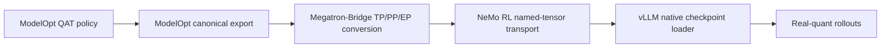

# ModelOpt Real-Quant Refit Architecture

NeMo RL can train a Megatron policy with ModelOpt fake quantization while
running rollout generation with the deployment representation supported by
ModelOpt and vLLM. The integration transports ModelOpt's canonical Hugging Face
tensors and configuration; NeMo RL does not derive a deployment format or
implement quantization math.

## Component responsibilities

| Component | Responsibility |
|---|---|
| ModelOpt | Quantizer state, deployment configuration, packing, and scale derivation |
| Megatron-Bridge | Megatron-to-Hugging-Face conversion and distributed TP/PP/EP export |
| NeMo RL | Policy-first startup, named-tensor transport, and refit scheduling |
| vLLM | Deployment-config interpretation, checkpoint loading, runtime layout, and kernels |

The boundary is intentionally format-independent. ModelOpt returns an opaque
deployment configuration and named tensor family. Megatron-Bridge preserves
those canonical names while handling model parallelism. NeMo RL passes both to
vLLM unchanged.


```mermaid
flowchart LR
    A[ModelOpt QAT policy] --> B[ModelOpt canonical export]
    B --> C[Megatron-Bridge TP/PP/EP conversion]
    C --> D[NeMo RL named-tensor transport]
    D --> E[vLLM native checkpoint loader]
    E --> F[Real-quant rollouts]
```

## Startup

The vLLM runtime layout depends on the calibrated policy graph, so real-quant
startup is policy-first:

1. Initialize the Megatron policy and ModelOpt quantizers.
2. Ask Megatron-Bridge for ModelOpt's deployment configuration on every policy
   rank and verify that all ranks agree.
3. Add that configuration to
   `vllm_kwargs.hf_overrides.quantization_config`.
4. For colocated execution, offload the policy while vLLM is constructed, then
   restore it for training.
5. Initialize vLLM through its normal Hugging Face quantization-config path.

No NeMo RL quantization class or vLLM registry override is involved.

## Refit lifecycle

Every update uses the existing IPC or collective named-tensor transport:

1. Recompute the policy deployment configuration and reject the update if its
   runtime layout differs from startup.
2. Megatron-Bridge exports ModelOpt's canonical named tensors.
3. NeMo RL starts vLLM's full-model layerwise reload lifecycle.
4. vLLM's normal checkpoint loader consumes the canonical Hugging Face names.
5. vLLM finalizes the model and NeMo RL synchronizes the device before the
   transport can reuse its buffers.

CUDA IPC batches are reusable staging buffers. vLLM may retain an incoming
tensor until the rest of a layer arrives, so the real-quant worker clones each
incoming tensor before passing it to the loader. The clone is the only
real-quant-specific load behavior.

## Distributed export

ModelOpt captures the export state for one quantized weight and owns how that
state becomes deployment tensors. Megatron-Bridge owns distribution:

- TP state is synchronized before packing.
- PP ranks exchange the prepared state needed by their local conversion tasks.
- EP experts are packed independently before canonical expert tensors are
  gathered or stacked.

Packing before expert stacking avoids assuming that a quantization format is
linear across experts. NeMo RL receives only the final canonical Hugging Face
names and tensors.

## Configuration

```yaml
policy:
  quant_cfg: /absolute/path/to/modelopt-recipe.yaml

  generation:
    backend: vllm
    quant_cfg: null
    real_quant: true
    vllm_cfg:
      enforce_eager: true
      kv_cache_dtype: auto
```

`policy.quant_cfg` defines the policy graph. `generation.quant_cfg` must be
`null` because vLLM is configured from the policy-produced deployment
descriptor, not a second fake-quant recipe. Layer exclusions belong in the
ModelOpt recipe and therefore remain consistent between packed tensors and the
deployment configuration.

## Current scope

- The policy must use Megatron and the generation backend must be vLLM.
- Only the default IPC or collective refit transport is supported.
- CUDA graph execution, speculative decoding, non-default KV-cache dtypes, and
  checkpoint-engine refit are outside the initial integration.
- A format works only when the pinned ModelOpt canonical export API and pinned
  vLLM checkpoint loader both support it. The initial implementation covers
  dynamic block-16 NVFP4 W4A4 and W4A16 without encoding those formats in
  NeMo RL or Megatron-Bridge.
