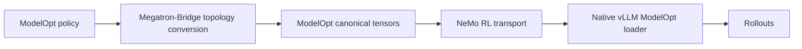

# ModelOpt Real-Quant Refit Architecture

NeMo RL can train a ModelOpt-quantized Megatron policy while vLLM runs native
real-quant kernels for rollout generation. Each refit exports the current policy
into ModelOpt's canonical Hugging Face schema and loads those tensors into the
existing vLLM engine without writing an intermediate checkpoint.

## Relationship to NeMo RL

Real-quant refit extends the standard policy-generation workflow. Algorithms
continue to use the existing policy and generation interfaces. BF16 and
fake-quantized weight updates keep their existing behavior.

This design builds on:

- [Design and Philosophy](design-and-philosophy.md), which defines NeMo RL's
  controller, worker, isolation, and communication model;
- [Generation Interface](generation.md), which defines generation backends and
  their weight-update lifecycle; and
- [Quantization-Aware RL](../guides/quantization-aware-rl.md), which documents
  configuration and validated recipes.

## Canonical Contract

The online path emits the same artifacts as ModelOpt Hugging Face export:

- canonical Hugging Face parameter names;
- packed weight tensors;
- format-owned sidecar tensors; and
- a canonical `quantization_config`.

The sidecar schema is open-ended. NeMo RL and Megatron-Bridge do not maintain a
format-specific list of scale names or packing rules.

| Component | Responsibility |
|---|---|
| ModelOpt | Quantizer state, packing, scales, sidecars, and canonical quantization configuration |
| Megatron-Bridge | TP/PP/EP topology, fused-weight decomposition, logical Hugging Face weights, and parameter names |
| NeMo RL | Policy-first startup, configuration transfer, tensor transport, and refit lifecycle |
| vLLM | Native ModelOpt loading, runtime layouts, post-load processing, and kernel selection |


```mermaid
flowchart LR
    A[ModelOpt policy] --> B[Megatron-Bridge topology conversion]
    B --> C[ModelOpt canonical tensors]
    C --> D[NeMo RL transport]
    D --> E[Native vLLM ModelOpt loader]
    E --> F[Rollouts]
```

## Startup

Real quantization requires policy-first startup:

1. Construct and calibrate the Megatron policy.
2. Build the canonical ModelOpt Hugging Face quantization configuration.
3. Verify that policy ranks produced the same configuration.
4. Pass it to vLLM through `hf_overrides.quantization_config`.
5. Construct vLLM with its native ModelOpt loader.

The configuration is immutable for the lifetime of the vLLM engine. Changing
the quantization recipe requires rebuilding the engine.

## Refit

For each refit, Megatron-Bridge reconstructs one logical Hugging Face weight
from its distributed Megatron representation. ModelOpt captures current
quantizer state, applies the same merge or selection operation as the weight,
and emits the packed weight plus its sidecars. NeMo RL transports those named
tensors without interpreting their format.

Real-quant parameters have already been transformed into inference layouts, so
IPC and collective refits use vLLM's native layerwise reload lifecycle:

1. `initialize_layerwise_reload()` restores loadable checkpoint-form state.
2. The native vLLM model loader consumes the canonical tensors.
3. `finalize_layerwise_reload()` rebuilds runtime layouts and kernels.
4. NeMo RL synchronizes before transport storage can be reused.

Initialization invalidates the previous runtime layout. A failed native reload
therefore makes that generation worker unusable. Deferred loader tensors are
detached only when they still alias a reusable transport buffer.

## Formats

The architecture is format-neutral. Runtime support is the intersection of:

1. formats exported by ModelOpt's functional export API; and
2. canonical ModelOpt formats accepted by the pinned vLLM version.

This permits mixed real-quant and unquantized leaves, and mixed real-quant
formats when vLLM supports the complete fused-layer combination. Unsupported
formats fail rather than being translated or silently loaded as BF16.

NVFP4 W4A4 and W4A16 are supported recipe examples, not downstream mode
branches. See [Quantization-Aware RL](../guides/quantization-aware-rl.md) for
their current validation status.

## Configuration

`policy.quant_cfg` is the only source of the real-quant rollout schema. Do not
set a generation-side fake-quant recipe:

```yaml
policy:
  quant_cfg: examples/modelopt/quant_configs/nvfp4_a16_mlp_only.yaml

  generation:
    backend: vllm
    quant_cfg: null
    real_quant: true
```

## Limitations

- Real-quant rollout requires a Megatron policy and vLLM generation.
- Runtime support remains recipe-, model-, and pinned-vLLM-version specific.
- IPC and collective transports are supported. NIXL, custom checkpoint
  engines, `nccl_reshard`, and sparse-delta refit bypass the native layerwise
  lifecycle and are rejected.
- Real-quant KV-cache export and refit are outside this design.
- A partial refit requires generation-worker restart.
