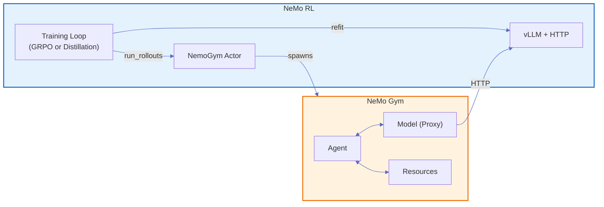
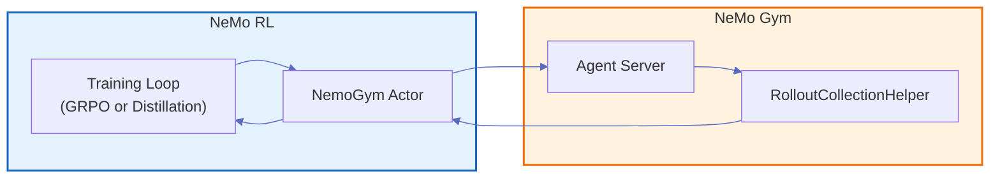
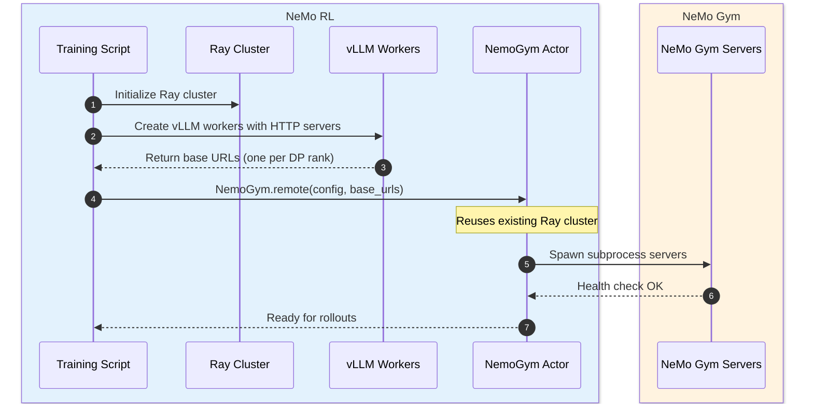
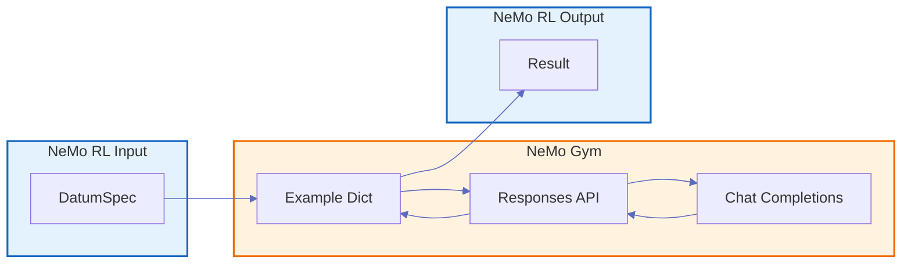

# NeMo Gym Integration

This document describes how NeMo RL integrates with [NeMo Gym](https://docs.nvidia.com/nemo/gym/v0.2.1/index.html) for multi-step and multi-turn rollout collection. NeMo Gym rollouts are supported by GRPO and on-policy distillation.

## Overview

NeMo Gym provides HTTP-based training environments for LLMs. **NeMo Gym is CPU-only**—it runs no inference engines and holds no GPU memory. NeMo RL exposes its vLLM generation engine as an OpenAI-compatible HTTP server, which NeMo Gym calls during rollouts, enabling:

- **Decoupled architecture**: Environments don't need direct access to model internals
- **Multi-step/multi-turn support**: Agents can orchestrate complex interactions with tools
- **Refit compatibility**: NeMo RL's weight synchronization works transparently

The same NeMo Gym rollout path is used by GRPO and on-policy distillation when `env.should_use_nemo_gym` is enabled. Distillation uses the generated NeMo Gym conversations as the student on-policy samples before computing teacher logits and the distillation loss.

For on-policy distillation, NeMo Gym controls the rollout turn count from its environment and agent configuration. The standard distillation `distillation.max_rollout_turns` setting is not used by the NeMo Gym rollout path.

## Configuration

To enable NeMo Gym integration, add the following to your NeMo RL config:

```yaml
policy:
  generation:
    backend: vllm
    vllm_cfg:
      async_engine: true          # Both required for HTTP server support:
      expose_http_server: true    # async_engine enables the async worker; expose_http_server starts the server

env:
  should_use_nemo_gym: true       # Enables NeMo Gym integration
  nemo_gym:
    # NeMo Gym config paths and settings
    config_paths:
      - resources_servers/math/configs/math.yaml
      - responses_api_agents/simple_agent/configs/simple_agent.yaml

logger:
  wandb:
    # Optional debugging aid. Keep disabled for normal training because complete
    # result payloads can produce many large W&B Table artifacts.
    log_nemo_gym_full_result_tables: false
```

When `log_nemo_gym_full_result_tables` is `false`, NeMo RL does not construct
the per-agent `full_result` Tables. This prevents those payloads from entering
the async replay buffer and avoids uploading them to W&B. Numeric per-agent
rollout metrics are unaffected. Set the flag to `true` only when the complete
Gym result payloads are needed for a short debugging run.

For complete examples, see `examples/nemo_gym/run_grpo_nemo_gym.py`, `examples/nemo_gym/run_distillation_nemo_gym.py`, and their associated configs under `examples/nemo_gym/`.

### Version Requirements

NeMo Gym runs as a Ray actor within NeMo RL's Ray cluster, so the same Ray and Python versions must be used in both environments.

## Architecture Overview



**Color coding**:
- Blue = NeMo RL code (`nemo_rl/`)
- Orange = NeMo Gym code (`3rdparty/Gym-workspace/Gym/nemo_gym/`)

## The NemoGym Actor

The integration is handled by the `NemoGym` Ray actor at `nemo_rl/environments/nemo_gym.py`:

1. **Created by NeMo RL** during training setup via `NemoGym.remote(config)`
2. **Joins the existing Ray cluster** that NeMo RL already initialized
3. **Spawns NeMo Gym servers** as OS subprocesses (Head, Agent, Model, Resources)
4. **Injects vLLM base URLs** so NeMo Gym's Model Server knows where to proxy requests
5. **Exposes `run_rollouts()`** as the entry point for the training loop to call



The flow is:
1. The GRPO or distillation rollout layer starts a streaming `run_rollouts` call on the NemoGym Actor
2. Actor sends `POST /run` to the Agent Server
3. Agent Server orchestrates the rollout via RolloutCollectionHelper
4. Completed examples return to the Actor
5. Actor post-processes and streams each completed example back with its original row index
6. The rollout layer emits a prompt group after all generations for that prompt are complete; synchronous callers drain the stream and retain full-batch behavior

## vLLM HTTP Server

**NeMo Gym does not run its own vLLM engine.** The Model Server is purely an HTTP proxy:

| Aspect | NeMo RL vLLM Worker | NeMo Gym Model Server |
|--------|---------------------|----------------------|
| **Engine** | Runs actual vLLM `AsyncLLM` | No engine - HTTP proxy only |
| **GPU** | Holds model weights | No GPU required |
| **Endpoints** | `/v1/chat/completions`, `/tokenize` | `/v1/responses` |
| **Role** | Inference | API translation, forwards requests |

Data parallel vLLM workers each expose their own HTTP server. NeMo Gym's Model Server load-balances requests across them.

## Initialization Sequence



## Training Loop Control Flow

```mermaid
%%{init: {'theme': 'default', 'themeVariables': { 'lineColor': '#5c6bc0', 'primaryTextColor': '#333'}}}%%
sequenceDiagram
    autonumber
    box rgb(227, 242, 253) NeMo RL
        participant Loop as Training Loop
        participant Policy as Policy Workers
        participant vLLM as vLLM HTTP
        participant Bridge as NemoGym Actor
    end
    box rgb(255, 243, 224) NeMo Gym
        participant Agent as Agent Server
        participant Model as Model Server
        participant Resource as Resource Server
    end
    
    Loop->>Policy: Refit (trigger weight sync)
    Policy->>vLLM: Sync weights to vLLM
    Loop->>Bridge: streaming run_rollouts(batch)
    Bridge->>Agent: POST /run
    Agent->>Model: POST /v1/responses
    Model->>vLLM: POST /v1/chat/completions
    vLLM-->>Model: Response
    Model-->>Agent: Responses API format
    Agent->>Resource: Execute tool / compute reward
    Resource-->>Agent: Tool result / reward
    Agent-->>Bridge: Completed example + reward
    Bridge-->>Loop: Stream row index, token IDs, logprobs, reward
    Note over Loop,Bridge: Async GRPO emits each complete prompt group;<br/>sync paths drain all rows before continuing
    Loop->>Policy: Compute loss and train
```

> **NeMo Gym server types** (see [Core Components](https://docs.nvidia.com/nemo/gym/v0.2.1/about/concepts/core-components/)):
> - **Agent Server**: Orchestrates the rollout loop
> - **Model Server**: HTTP proxy to vLLM; translates Responses API ↔ Chat Completions
> - **Resource Server**: Provides tools and rewards

### Key Steps

| Step | Location | Description |
|------|----------|-------------|
| **Refit** | NeMo RL | Synchronizes policy weights to vLLM workers. For async RL, refit timing may differ—see {doc}`generation` for details. |
| **Streaming `run_rollouts()`** | NeMo RL | Ray generator call from the rollout layer to the NemoGym actor; rows can arrive out of input order |
| **POST /run** | NeMo RL → NeMo Gym | HTTP request from NemoGym actor to Agent Server subprocess |
| **Rollout orchestration** | NeMo Gym | Agent calls Model Server and Resources Server via HTTP |
| **POST /v1/chat/completions** | NeMo Gym → NeMo RL | Model Server proxies to NeMo RL's vLLM HTTP endpoint |
| **Result processing** | NeMo RL | NemoGym actor extracts token IDs, logprobs, rewards |

### Async Result Processing

The NemoGym actor and NeMo RL rollout layer use an **as-completed** pattern to overlap waiting, post-processing, and downstream collection:

1. **Completed examples return out of order**: Full rollout examples complete at different times depending on conversation length and tool calls. The actor processes and streams each example as soon as it completes, tagged with its original row index.

2. **Immediate post-processing**: As each rollout completes, the actor immediately extracts token IDs and logprobs. This overlaps CPU work with network I/O from slower rollouts still in flight.

3. **Prompt-group buffering**: Async GRPO groups the streamed rows by prompt and emits a group as soon as all of that prompt's generations have arrived. A slow prompt therefore does not prevent already-complete prompt groups from entering the replay buffer. Synchronous GRPO, PPO, and distillation use the same stream but drain the complete batch before continuing.

4. **Stable ordering where required**: Each example carries a row index. Prompt groups preserve their input slices, and full-batch synchronous callers restore input order before returning.

This pattern maximizes throughput by keeping the CPU busy while waiting for network responses.

### Async GRPO Collector Invariants

The async GRPO collector uses the same prompt-group contract for Gym and native environments:

- One batch worker owns each reserved target weight until all expected prompt groups are buffered or the batch fails.
- Gym prompts receive a monotonic `_ng_task_index`. The counter is checkpointed, restored, and cross-checked against buffered trajectories so task identities are not reused after restart.
- A partial Gym stream can be retried without duplicating groups that were already accepted by the replay buffer.
- Native rollouts still execute as one batch. Their per-sample metrics are aggregated separately for each prompt group before buffering, so batch-level metrics are not duplicated across groups.
- Gym rows are validated for range, uniqueness, completeness, and single-agent grouping. Results are restored to input order within a prompt group before post-processing.

## Data Format Translation



**Formats**:
- **DatumSpec** (NeMo RL): Training-focused format with `prompt`, `prompt_token_ids`, and task metadata
- **Example Dict** (NeMo Gym): Environment-focused format containing `responses_create_params` and `expected` answer
- **Responses API** (NeMo Gym): OpenAI Responses API format with `input`, `tools`, and multi-turn conversation
- **Chat Completions** (vLLM): OpenAI Chat Completions format for the actual inference call

**Data flow**: DatumSpec is converted to Example Dict, which passes through to the Responses API with generation parameters (`temperature`, `top_p`) added for on-policy sampling. The Model Server translates Responses API ↔ Chat Completions (converting message formats, extracting reasoning content, attaching token IDs). Results flow back with token IDs and logprobs extracted into the final Result.

## Tokenization and On-Policy Corrections

Token IDs are extracted at the NeMo RL vLLM layer via the `/tokenize` endpoint. This ensures:
- Tokenization matches the exact model and tokenizer used for generation
- No re-tokenization drift between generation and training

For details on on-policy token ID handling, see {doc}`../guides/environments` and the [NeMo Gym on-policy corrections documentation](https://docs.nvidia.com/nemo/gym/v0.2.1/contribute/rl-framework-integration/openai-compatible-http-server-on-policy-correction.html).
