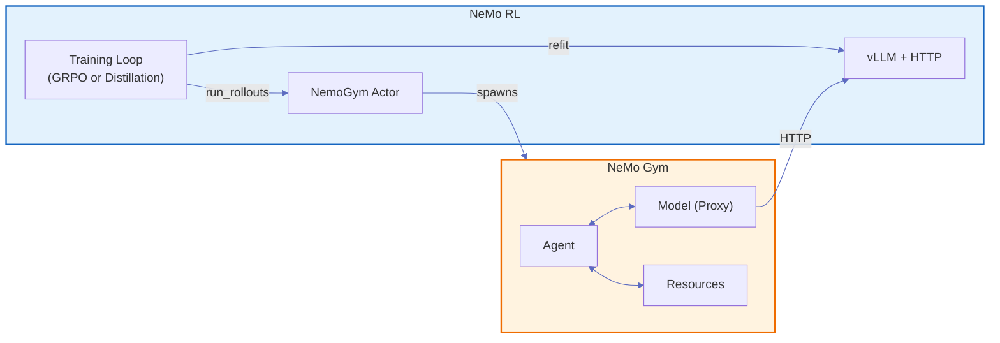
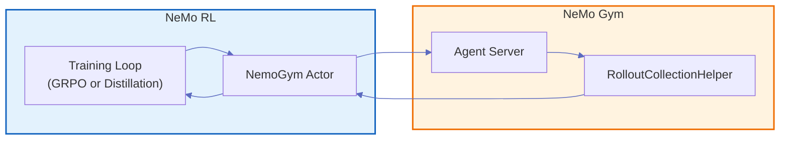
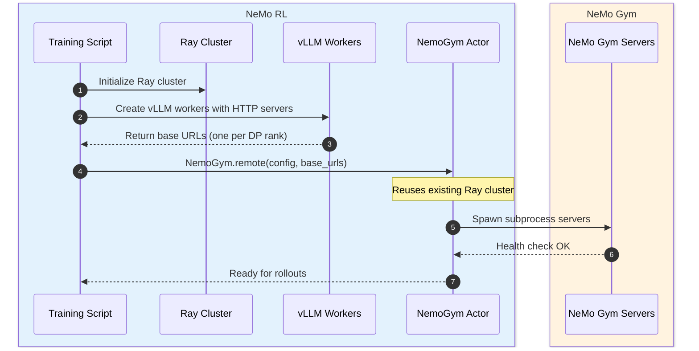
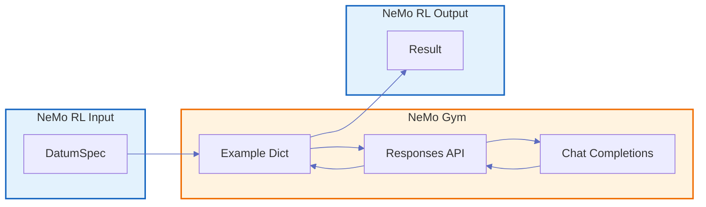

# NeMo Gym Integration

This document describes how NeMo RL integrates with [NeMo Gym](https://docs.nvidia.com/nemo/gym/v0.2.1/index.html) for multi-step and multi-turn rollout collection. NeMo Gym rollouts are supported by GRPO and on-policy distillation.

## Overview

NeMo Gym provides HTTP-based training and evaluation environments for LLMs. **NeMo Gym is CPU-only**—it runs no inference engines and holds no GPU memory. NeMo RL exposes its vLLM generation engine as an OpenAI-compatible HTTP server, which NeMo Gym calls during rollouts, enabling:

- **Decoupled architecture**: Environments don't need direct access to model internals
- **Multi-step/multi-turn support**: Agents can orchestrate complex interactions with tools
- **Refit compatibility**: NeMo RL's weight synchronization works transparently

The same NeMo Gym rollout path is used by GRPO, on-policy distillation, and standalone evaluation when `env.should_use_nemo_gym` is enabled. Distillation uses the generated NeMo Gym conversations as the student on-policy samples before computing teacher logits and the distillation loss.

For on-policy distillation, NeMo Gym controls the rollout turn count from its environment and agent configuration. The standard distillation `distillation.max_rollout_turns` setting is not used by the NeMo Gym rollout path.

## Configuration

To enable NeMo Gym integration, add the following to your NeMo RL config:

```yaml
policy:
  generation:
    backend: vllm
    vllm_cfg:
      async_engine: true          # Both required for HTTP server support:
      expose_http_server: true    # async_engine enables the async worker; expose_http_server starts the server

env:
  should_use_nemo_gym: true       # Enables NeMo Gym integration
  nemo_gym:
    # NeMo Gym config paths and settings
    config_paths:
      - resources_servers/math/configs/math.yaml
      - responses_api_agents/simple_agent/configs/simple_agent.yaml

logger:
  wandb:
    # Optional debugging aid. Keep disabled for normal training because complete
    # result payloads can produce many large W&B Table artifacts.
    log_nemo_gym_full_result_tables: false
```

When `log_nemo_gym_full_result_tables` is `false`, NeMo RL does not construct
the per-agent `full_result` Tables. This prevents those payloads from entering
the async replay buffer and avoids uploading them to W&B. Numeric per-agent
rollout metrics are unaffected. Set the flag to `true` only when the complete
Gym result payloads are needed for a short debugging run.

For complete examples, see `examples/nemo_gym/run_grpo_nemo_gym.py`, `examples/nemo_gym/run_distillation_nemo_gym.py`, and their associated configs under `examples/nemo_gym/`.

### Rollout Benchmark Through the Eval Flow

Use the dedicated converter entrypoint to run an existing GRPO NeMo Gym recipe
as a rollout-only benchmark:

```bash
uv run examples/nemo_gym/run_grpo_rollout_benchmark.py \
  --config examples/nemo_gym/grpo_workplace_assistant_nemotron_nano_v2_9b.yaml
```

The entrypoint validates the source as a GRPO config, converts it to the
standard eval schema, and then calls the same eval implementation as
`examples/run_eval.py`. The GRPO recipe remains the only source of rollout
sampling configuration:

- `grpo.num_generations_per_prompt` controls trajectories per prompt.
- `grpo.num_prompts_per_step` controls prompts in each 1-based `eval_step`.
- `policy.generation` supplies `max_new_tokens`, `temperature`, `top_p`,
  `top_k`, stop settings, and the vLLM configuration.

The converter also flattens `data.default` plus `data.validation`, copies the
NeMo Gym, logger, cluster, tokenizer, and full policy configuration, and removes
legacy trajectory-collection control fields before Gym starts. Do not add an
`eval` block or a second generation block to the GRPO recipe. Results and
telemetry use the normal eval outputs: `nemo_gym_eval_results.jsonl`,
`generation_metrics.jsonl`, W&B `eval_step`, rollout metrics, generation
metrics, and Ray system metrics.

### Standalone Evaluation

`examples/run_eval.py` supports NeMo Gym datasets and agents through the same
`env.should_use_nemo_gym` switch. A complete configuration is available at
`examples/nemo_gym/eval_workplace_assistant_nemotron_nano_v2_9b.yaml`:

```bash
uv run examples/run_eval.py \
  --config examples/nemo_gym/eval_workplace_assistant_nemotron_nano_v2_9b.yaml
```

The example uses Gym's checked-in workplace-assistant split. Gym eval supports
`mean_reward` and `pass@k`; use `eval.num_tests_per_prompt` for multiple
trajectories per prompt. It uses the HTTP-serving vLLM or Megatron rollout
engine selected by `generation.backend`.

Each completed batch is a 1-based W&B `eval_step`. Eval, rollout, generation,
and (when `logger.monitor_gpus=true`) Ray system metrics share that axis. Raw
results and generation time series are written to
`nemo_gym_eval_results.jsonl` and `generation_metrics.jsonl`.

Standard eval can construct vLLM, SGLang, or Megatron from
`generation.backend`. NeMo Gym eval supports the same HTTP rollout engines as
the GRPO Gym flow: vLLM and Megatron.

### Version Requirements

NeMo Gym runs as a Ray actor within NeMo RL's Ray cluster, so the same Ray and Python versions must be used in both environments.

## vLLM Router and Prometheus monitoring

NeMo RL can place an owned [vLLM Router](https://github.com/vllm-project/vllm-router)
between NeMo Gym and the data-parallel vLLM HTTP servers. Monitoring follows the
same per-replica registration model used by
[verl's RL-Insight integration](https://verl.readthedocs.io/en/latest/advance/rl_insight.html):
the Router target and every backend target are registered separately. Router
metrics are not treated as an aggregation of backend metrics.

```yaml
env:
  should_use_nemo_gym: true
  nemo_gym:
    vllm_router:
      enabled: true
      policy: consistent_hash  # or cache_aware
      cache_metrics_mode: native
      cache_threshold: 0.3
    prometheus:
      enabled: true
      required: true
      # If omitted, use RL_INSIGHT_SERVER_URL.
      server_url: http://rl-insight-host:18080
      job_name: nemo_rl_vllm
      # If omitted, use NEMO_RL_RUN_ID, SLURM_JOB_ID, or the Ray job ID.
      run_id: phase2-consistent-hash-repeat-01
      request_timeout_s: 10
      readiness_timeout_s: 30
      # This declaration must match the dedicated Prometheus configuration.
      # One second preserves at least 10 points for the short Gym benchmark.
      scrape_interval_s: 1
      # RL-Insight 0.2.1 merges targets and has no TTL/unregister API. Formal
      # required mode therefore accepts only a per-run dedicated instance.
      target_lifecycle: dedicated
      # Retain at least one scrape before and after measured model calls.
      initial_scrape_wait_s: 2
      final_scrape_wait_s: 2
```

Supported Router policies are `random`, `round_robin`, `cache_aware`,
`power_of_two`, `consistent_hash`, and `rendezvous_hash`. A direct arm uses
`vllm_router.enabled: false`. NeMo RL passes `X-Session-ID` through the Gym
model proxy when the owned Router is enabled, which supplies the stable key
needed to audit repeated-session affinity.

The owned Router always keeps its native exporter on an internal loopback port
and exposes a remotely reachable metrics adapter. The adapter preserves every
native metric, but also normalizes Router 0.1.15's lazily registered operational
counters into stable `nemo_rl_vllm_router_*` series. It exports bounded native
metric-presence and adapter-provenance gauges, so a zero observation is distinct
from a metric family the native exporter never exposed. Stable per-worker
series cover routing decisions, processed requests, circuit-breaker
state/outcomes, and worker health; worker-health provenance records whether it
came from the adapter's per-backend `/health` probes alone or was conservatively
combined with native health. The adapter probes the same endpoint as Router
0.1.15 and takes the minimum when native health exists, so registry membership
cannot mask an unhealthy backend.

Router 0.1.15 declares `vllm_router_worker_load`, but its production paths do
not update that gauge, and `vllm_router_running_requests` is updated only by the
cache-aware request path. The Phase 2 report therefore does not synthesize
either missing Router series. It maps each independently scraped backend
`vllm:num_requests_running` series from its stable replica label to the exact
Router worker URL using the archived target manifest, and records
`backend_prometheus_num_requests_running` as the load source. Native absence
remains visible in the adapter's metric-presence evidence.

The pinned vLLM Router 0.1.15 also declares
`vllm_router_cache_hits_total` and `vllm_router_cache_misses_total`, but its
cache-aware request path does not increment them. For a cache-aware run that
needs Router cache evidence, set `cache_metrics_mode: debug_log_compat`. When
the native cache counters are absent, the same adapter reconstructs only those
two cumulative counters from the Router's archived DEBUG decision records using
the configured `cache_threshold`. It also exports
`nemo_rl_vllm_router_cache_metrics_info`, the threshold, and the number of
parsed observations so the report can verify provenance and numerator /
denominator consistency. If both native counters appear in a future Router
version, the adapter uses them without adding duplicates. A partial native pair
or an unparseable decision record makes the endpoint unhealthy.

`debug_log_compat` is accepted only with `policy: cache_aware` and adds DEBUG
logging plus per-scrape log parsing overhead. Keep the default `native` cache
mode for other policies; the operational metrics adapter remains enabled for
every owned Router policy.

All NeMo Gym actor environments include the pinned `vllm-router` dependency,
even when `vllm_router.enabled` is false. This is an intentional product
tradeoff: it keeps one deterministic Gym runtime and lockfile rather than
creating conditional actor environments. Users who do not enable the Router
still incur its install and dependency-resolution cost.

### Registered targets and failure behavior

Each target is registered through RL-Insight's
`POST /api/v1/prometheus/targets` API with these bounded labels:

- `run_id`
- `component`, either `vllm_router` or `vllm_backend`
- `replica`, using `router` or the stable backend DP rank
- `routing_policy`
- `model`

Loopback, `localhost`, and unspecified addresses are rejected because a remote
Prometheus server cannot scrape them. Request IDs, prompts, and session IDs are
never Prometheus labels.

With `required: true`, startup fails unless `target_lifecycle: dedicated` is
declared, both scrape waits cover at least one configured scrape interval,
every `/metrics` endpoint is ready, RL-Insight confirms target registration,
and RL-Insight confirms that Prometheus reloaded. With `required: false`, NeMo
RL warns and writes the failed registration to the manifest. Use required mode
for formal comparisons.

RL-Insight target registration currently has no unregister or TTL operation.
Its registration store merges new addresses into an existing job, so merely
reusing the same `job_name` does not replace old targets. Use a dedicated
RL-Insight instance for each formal run; otherwise stale targets from a shared
server make the result ambiguous.

For the short Gym workload, start the per-run instance with the supplied
1-second Prometheus configuration. `PHASE2_RL_INSIGHT_ROOT` must be a new run
directory, and `PHASE2_PROMETHEUS_BIN` must point to the audited Prometheus
binary (RL-Insight 0.2.1 normally installs Prometheus 2.54.1):

```bash
export PHASE2_RL_INSIGHT_ROOT="$RUN_DIR/rl-insight"
export PHASE2_PROMETHEUS_BIN=/path/to/prometheus-2.54.1/prometheus
rl-insight server start \
  --config examples/nemo_gym/rl_insight_phase2/config.yaml \
  --detach
# After the report query is complete:
rl-insight server stop \
  --config examples/nemo_gym/rl_insight_phase2/config.yaml
```

The example disables Grafana and Tempo because Phase 2 only needs the target
registration API and Prometheus. The runtime, TSDB, state, and logs remain
inside the run-specific root for audit and cleanup.

### Correlated request evidence

Enabling Prometheus monitoring also enables NeMo Gym's existing model-call
capture and stores it below `logger.log_dir/nemo_gym_monitoring/model_call_capture`.
The correlated `ng_trajectory.model_calls` records provide exact model-call and
session timing, response/error status, token usage, and provider-reported cached
tokens. This capture has storage and serialization overhead, so leave monitoring
disabled for runs that do not need an auditable Phase 2 report.

NeMo RL writes the following discovery evidence under
`logger.log_dir/nemo_gym_monitoring`:

- `prometheus-targets.json`, including labels, readiness, registration response,
  component versions, Router log paths, backend evidence paths, and the model-call
  capture directory;
- `vllm_router/router.stdout.log` and `router.stderr.log` for owned Router runs;
- `backends/replica-<rank>.log`, one metrics-readiness record per vLLM backend.

### Generate an auditable Phase 2 report

After the final scrape wait and clean shutdown, query the Prometheus instance
managed by RL-Insight and build the report into a new, empty directory:

```bash
python tools/nemo_gym_phase2_report.py \
  --prometheus-targets "$LOG_DIR/nemo_gym_monitoring/prometheus-targets.json" \
  --driver-log "$RUN_DIR/driver.log" \
  --eval-results "$LOG_DIR/nemo_gym_eval_results.jsonl" \
  --workload-file "$RUN_DIR/validation.jsonl" \
  --warmup-workload-file "$RUN_DIR/warmup.jsonl" \
  --workload-seed 42 \
  --repeat-id repeat-01 \
  --command-file "$RUN_DIR/command.txt" \
  --experiment-metadata "$RUN_DIR/phase2-experiment.json" \
  --config "$RUN_DIR/resolved-config.yaml" \
  --version rl_insight=0.2.1 \
  --prometheus-url http://rl-insight-host:19090 \
  --range-step-s 1 \
  --output-dir "$RUN_DIR/phase2-report"
```

The local component versions come from `prometheus-targets.json`; specify the
remote RL-Insight deployment version explicitly. The experiment metadata file
must declare a faithful replay, a fresh launch identity, completed warmup,
NeMo RL commit and container digest, model/tokenizer/chat-template revisions,
TP/DP topology, sampling/concurrency/token limits, and backend scheduler/batch
settings. Its workload and warmup hashes and record counts are checked against
the supplied files. See
`examples/nemo_gym/phase2_experiment_metadata.example.json` for the schema.
The driver log must also contain exactly one auditable warmup marker:

```text
PHASE2_WARMUP_RESULT_JSON={"status":"completed","requests":1,"results":1,"workload_sha256":"...","model_call_capture_reset":true,"settle_seconds":4}
```

The report checks this executed request count and SHA-256 against the metadata,
requires the warmup-only model-call capture to have been reset, and requires the
settle interval to cover the initial query buffer plus one scrape period. This
keeps warmup deltas outside the measured Prometheus counter window instead of
trusting a `warmup.completed` declaration alone.
Instead of a live query, use `--prometheus-query-results` to reproduce a report
from an archived query file.

The declared `scrape_interval_s` must match the dedicated RL-Insight
Prometheus configuration. A formal report requires at least ten scrape periods
inside the actual model-call window and a range-query step no larger than the
scrape interval. RL-Insight's 10-second default is therefore too coarse for an
approximately 18-second Gym rollout; use a 1-second scrape for this benchmark.

The report computes Router routing-cache hit rate as
`hits / (hits + misses)` and backend prefix-cache hit rate as the global
`sum(hits) / sum(queries)`. It never averages per-replica hit rates. It also
reports per-replica requests/tokens/concurrency, TTFT/ITL/E2E/queue latency,
request and session tails, throughput, response completeness, natural
termination, truncation, context-limit events, and binary-reward accuracy. For
vLLM Router 0.1.15, a general Router queue gauge is not exported; the report
records `not_exposed_by_router_version` and retains the raw Router logs instead
of silently treating it as zero. It also fails the formal gate on stale scrape
samples or any observed Router/backend counter reset, and archives those raw
queries for restart/reset audit.

The report writes machine-readable gates in `summary.json` and exits nonzero if
any gate fails. A single run is not the Phase 2 exit: use fresh engines and the
same workload, warmup, seed, and `(prompt_index, generation_index)` coverage for
repeated direct, `cache_aware`, and `consistent_hash` arms.

After producing every per-run report, validate the repeated matrix and create
the paired exit report:

```bash
python tools/nemo_gym_phase2_compare.py \
  --run "$RUNS/direct-repeat-01" \
  --run "$RUNS/cache-aware-repeat-01" \
  --run "$RUNS/consistent-hash-repeat-01" \
  --run "$RUNS/direct-repeat-02" \
  --run "$RUNS/cache-aware-repeat-02" \
  --run "$RUNS/consistent-hash-repeat-02" \
  --output-dir "$RUNS/phase2-comparison"
```

The comparison requires the exact three-arm `repeat_id` matrix, at least two
repeats, matching workload and warmup identities, matching paired outcome
coverage, unique fresh-engine launch identities, and passing gates for every
source run. It also checks that model, topology, sampling, backend configuration,
software versions, and monitoring settings are identical within each repeat. It
reports pooled accuracy/cache numerators and denominators, exact McNemar p-values,
deterministic paired-bootstrap confidence intervals, and within-repeat changes
in p99, makespan, throughput, backend cache hit rate, and load skew. It exits
nonzero when any matrix gate fails. More repeats may be needed before drawing a
performance conclusion.

## Architecture Overview


```mermaid
%%{init: {'theme': 'default', 'themeVariables': { 'lineColor': '#5c6bc0', 'primaryTextColor': '#333'}}}%%
flowchart LR
    subgraph RL["NeMo RL"]
        Loop["Training Loop<br/>(GRPO or Distillation)"]
        vLLM["vLLM + HTTP"]
        Bridge["NemoGym Actor"]
    end
    
    subgraph Gym["NeMo Gym"]
        Agent["Agent"]
        Model["Model (Proxy)"]
        Resources["Resources"]
    end
    
    Loop -->|refit| vLLM
    Loop -->|run_rollouts| Bridge
    Bridge -->|spawns| Gym
    Agent <--> Model
    Agent <--> Resources
    Model -->|HTTP| vLLM

    style RL fill:#e3f2fd,stroke:#1565c0,stroke-width:2px
    style Gym fill:#fff3e0,stroke:#ef6c00,stroke-width:2px
```

**Color coding**:
- Blue = NeMo RL code (`nemo_rl/`)
- Orange = NeMo Gym code (`3rdparty/Gym-workspace/Gym/nemo_gym/`)

## The NemoGym Actor

The integration is handled by the `NemoGym` Ray actor at `nemo_rl/environments/nemo_gym.py`:

1. **Created by NeMo RL** during training setup via `NemoGym.remote(config)`
2. **Joins the existing Ray cluster** that NeMo RL already initialized
3. **Spawns NeMo Gym servers** as OS subprocesses (Head, Agent, Model, Resources)
4. **Injects vLLM base URLs** so NeMo Gym's Model Server knows where to proxy requests
5. **Exposes `run_rollouts()`** as the entry point for the training loop to call


```mermaid
%%{init: {'theme': 'default', 'themeVariables': { 'lineColor': '#5c6bc0', 'primaryTextColor': '#333'}}}%%
flowchart LR
    subgraph RL["NeMo RL"]
        Loop["Training Loop<br/>(GRPO or Distillation)"]
        Actor["NemoGym Actor"]
    end
    
    subgraph Gym["NeMo Gym"]
        RCH["RolloutCollectionHelper"]
        Agent["Agent Server"]
    end
    
    Loop --> Actor
    Actor --> Agent
    Agent --> RCH
    RCH --> Actor
    Actor --> Loop

    style RL fill:#e3f2fd,stroke:#1565c0,stroke-width:2px
    style Gym fill:#fff3e0,stroke:#ef6c00,stroke-width:2px
```

The flow is:
1. The GRPO or distillation rollout layer starts a streaming `run_rollouts` call on the NemoGym Actor
2. Actor sends `POST /run` to the Agent Server
3. Agent Server orchestrates the rollout via RolloutCollectionHelper
4. Completed examples return to the Actor
5. Actor post-processes and streams each completed example back with its original row index
6. The rollout layer emits a prompt group after all generations for that prompt are complete; synchronous callers drain the stream and retain full-batch behavior

## vLLM HTTP Server

**NeMo Gym does not run its own vLLM engine.** The Model Server is purely an HTTP proxy:

| Aspect | NeMo RL vLLM Worker | NeMo Gym Model Server |
|--------|---------------------|----------------------|
| **Engine** | Runs actual vLLM `AsyncLLM` | No engine - HTTP proxy only |
| **GPU** | Holds model weights | No GPU required |
| **Endpoints** | `/v1/chat/completions`, `/tokenize` | `/v1/responses` |
| **Role** | Inference | API translation, forwards requests |

Data parallel vLLM workers each expose their own HTTP server. NeMo Gym's Model Server load-balances requests across them.

## Initialization Sequence


```mermaid
%%{init: {'theme': 'default', 'themeVariables': { 'lineColor': '#5c6bc0', 'primaryTextColor': '#333'}}}%%
sequenceDiagram
    autonumber
    box rgb(227, 242, 253) NeMo RL
        participant RL as Training Script
        participant Ray as Ray Cluster
        participant vLLM as vLLM Workers
        participant Bridge as NemoGym Actor
    end
    box rgb(255, 243, 224) NeMo Gym
        participant Servers as NeMo Gym Servers
    end
    
    RL->>Ray: Initialize Ray cluster
    RL->>vLLM: Create vLLM workers with HTTP servers
    vLLM-->>RL: Return base URLs (one per DP rank)
    RL->>Bridge: NemoGym.remote(config, base_urls)
    Note over Bridge: Reuses existing Ray cluster
    Bridge->>Servers: Spawn subprocess servers
    Servers-->>Bridge: Health check OK
    Bridge-->>RL: Ready for rollouts
```

## Training Loop Control Flow

```mermaid
%%{init: {'theme': 'default', 'themeVariables': { 'lineColor': '#5c6bc0', 'primaryTextColor': '#333'}}}%%
sequenceDiagram
    autonumber
    box rgb(227, 242, 253) NeMo RL
        participant Loop as Training Loop
        participant Policy as Policy Workers
        participant vLLM as vLLM HTTP
        participant Bridge as NemoGym Actor
    end
    box rgb(255, 243, 224) NeMo Gym
        participant Agent as Agent Server
        participant Model as Model Server
        participant Resource as Resource Server
    end
    
    Loop->>Policy: Refit (trigger weight sync)
    Policy->>vLLM: Sync weights to vLLM
    Loop->>Bridge: streaming run_rollouts(batch)
    Bridge->>Agent: POST /run
    Agent->>Model: POST /v1/responses
    Model->>vLLM: POST /v1/chat/completions
    vLLM-->>Model: Response
    Model-->>Agent: Responses API format
    Agent->>Resource: Execute tool / compute reward
    Resource-->>Agent: Tool result / reward
    Agent-->>Bridge: Completed example + reward
    Bridge-->>Loop: Stream row index, token IDs, logprobs, reward
    Note over Loop,Bridge: Async GRPO emits each complete prompt group;<br/>sync paths drain all rows before continuing
    Loop->>Policy: Compute loss and train
```

> **NeMo Gym server types** (see [Core Components](https://docs.nvidia.com/nemo/gym/v0.2.1/about/concepts/core-components/)):
> - **Agent Server**: Orchestrates the rollout loop
> - **Model Server**: HTTP proxy to vLLM; translates Responses API ↔ Chat Completions
> - **Resource Server**: Provides tools and rewards

### Key Steps

| Step | Location | Description |
|------|----------|-------------|
| **Refit** | NeMo RL | Synchronizes policy weights to vLLM workers. For async RL, refit timing may differ—see {doc}`generation` for details. |
| **Streaming `run_rollouts()`** | NeMo RL | Ray generator call from the rollout layer to the NemoGym actor; rows can arrive out of input order |
| **POST /run** | NeMo RL → NeMo Gym | HTTP request from NemoGym actor to Agent Server subprocess |
| **Rollout orchestration** | NeMo Gym | Agent calls Model Server and Resources Server via HTTP |
| **POST /v1/chat/completions** | NeMo Gym → NeMo RL | Model Server proxies to NeMo RL's vLLM HTTP endpoint |
| **Result processing** | NeMo RL | NemoGym actor extracts token IDs, logprobs, rewards |

### Async Result Processing

The NemoGym actor and NeMo RL rollout layer use an **as-completed** pattern to overlap waiting, post-processing, and downstream collection:

1. **Completed examples return out of order**: Full rollout examples complete at different times depending on conversation length and tool calls. The actor processes and streams each example as soon as it completes, tagged with its original row index.

2. **Immediate post-processing**: As each rollout completes, the actor immediately extracts token IDs and logprobs. This overlaps CPU work with network I/O from slower rollouts still in flight.

3. **Prompt-group buffering**: Async GRPO groups the streamed rows by prompt and emits a group as soon as all of that prompt's generations have arrived. A slow prompt therefore does not prevent already-complete prompt groups from entering the replay buffer. Synchronous GRPO, PPO, and distillation use the same stream but drain the complete batch before continuing.

4. **Stable ordering where required**: Each example carries a row index. Prompt groups preserve their input slices, and full-batch synchronous callers restore input order before returning.

This pattern maximizes throughput by keeping the CPU busy while waiting for network responses.

### Async GRPO Collector Invariants

The async GRPO collector uses the same prompt-group contract for Gym and native environments:

- One batch worker owns each reserved target weight until all expected prompt groups are buffered or the batch fails.
- Gym prompts receive a monotonic `_ng_task_index`. The counter is checkpointed, restored, and cross-checked against buffered trajectories so task identities are not reused after restart.
- A partial Gym stream can be retried without duplicating groups that were already accepted by the replay buffer.
- Native rollouts still execute as one batch. Their per-sample metrics are aggregated separately for each prompt group before buffering, so batch-level metrics are not duplicated across groups.
- Gym rows are validated for range, uniqueness, completeness, and single-agent grouping. Results are restored to input order within a prompt group before post-processing.

## Data Format Translation


```mermaid
%%{init: {'theme': 'default', 'themeVariables': { 'lineColor': '#5c6bc0', 'primaryTextColor': '#333'}}}%%
flowchart LR
    subgraph RL1["NeMo RL Input"]
        Datum["DatumSpec"]
    end
    
    subgraph Gym["NeMo Gym"]
        Example["Example Dict"]
        ReqResp["Responses API"]
        ReqChat["Chat Completions"]
    end
    
    subgraph RL2["NeMo RL Output"]
        Result["Result"]
    end
    
    Datum --> Example
    Example --> ReqResp
    ReqResp --> ReqChat
    ReqChat --> ReqResp
    ReqResp --> Example
    Example --> Result

    style RL1 fill:#e3f2fd,stroke:#1565c0,stroke-width:2px
    style RL2 fill:#e3f2fd,stroke:#1565c0,stroke-width:2px
    style Gym fill:#fff3e0,stroke:#ef6c00,stroke-width:2px
```

**Formats**:
- **DatumSpec** (NeMo RL): Training-focused format with `prompt`, `prompt_token_ids`, and task metadata
- **Example Dict** (NeMo Gym): Environment-focused format containing `responses_create_params` and `expected` answer
- **Responses API** (NeMo Gym): OpenAI Responses API format with `input`, `tools`, and multi-turn conversation
- **Chat Completions** (vLLM): OpenAI Chat Completions format for the actual inference call

**Data flow**: DatumSpec is converted to Example Dict, which passes through to the Responses API with generation parameters (`temperature`, `top_p`) added for on-policy sampling. The Model Server translates Responses API ↔ Chat Completions (converting message formats, extracting reasoning content, attaching token IDs). Results flow back with token IDs and logprobs extracted into the final Result.

## Tokenization and On-Policy Corrections

Token IDs are extracted at the NeMo RL vLLM layer via the `/tokenize` endpoint. This ensures:
- Tokenization matches the exact model and tokenizer used for generation
- No re-tokenization drift between generation and training

For details on on-policy token ID handling, see {doc}`../guides/environments` and the [NeMo Gym on-policy corrections documentation](https://docs.nvidia.com/nemo/gym/v0.2.1/contribute/rl-framework-integration/openai-compatible-http-server-on-policy-correction.html).
