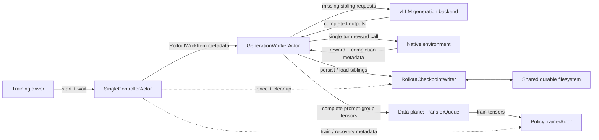

# Milestone 1: Completed-Generation Recovery

- **Status:** Draft
- **Milestone model:** 1 of 3
- **Target:** Native, single-turn GRPO under `SingleControllerActor`
- **Estimate:** 8–13 engineer-weeks; approximately 6–8 calendar weeks with two engineers

## Summary

Milestone 1 adds the correctness foundation and first user-visible recovery
boundary for partial rollout checkpointing. A completed GRPO sibling is
persisted independently. If its rollout-orchestration actor fails, a
replacement loads the completed siblings for the same prompt group and invokes
vLLM only for missing generation indexes.

In this document, a **completed generation** means a complete native,
single-turn sibling after assistant generation and reward/environment
post-processing. It is a training-ready `Completion`, not merely the raw token
stream returned by vLLM.

The exit scenario is intentionally concrete:

1. SingleController dispatches one prompt group with four generations.
2. Generations 0, 1, and 2 complete and receive durable acknowledgements.
3. The rollout-orchestration actor is killed before generation 3 completes.
4. SingleController terminates and fences the old attempt, creates a
   replacement, and redispatches the same logical work.
5. The replacement loads generations 0, 1, and 2, invokes vLLM only for
   generation 3, and publishes the complete group once to the data plane.

Milestone 1 combines the former foundation and completed-sibling milestones.
It does not support controller or full-job restart, token-prefix recovery,
stateful multi-turn recovery, or NeMo Gym/SWE restoration.

## Three-milestone context

| Milestone | Outcome | Recovery boundary |
|---|---|---|
| **1. Completed-generation recovery** | Stable identity, durable writer, attempt fencing, and reuse of completed native single-turn GRPO siblings | Rollout-orchestration actor failure; one complete sibling |
| **2. NeMo-RL rollout and job recovery** | Controller/job recovery, token prefixes, and native multi-turn phase recovery | Full-job, bounded-token, and assistant/environment boundaries |
| **3. External environment and production recovery** | NeMo Gym/SWE session and sandbox recovery plus production hardening | External environment loss and production-scale failures |

This document is authoritative for Milestone 1. The broader
[`partial-rollout-checkpointing-mvp.md`](partial-rollout-checkpointing-mvp.md)
draft remains useful background but uses the older milestone numbering.

## Goals

Milestone 1 must:

1. assign stable group and sample identity before rollout execution;
2. pin one policy version and one input/config fingerprint to a prompt group;
3. persist each completed sibling independently;
4. acknowledge a sibling only after an atomic durable commit;
5. make duplicate writes idempotent and conflicting writes fail loudly;
6. keep rollout payloads out of `SingleControllerActor`;
7. maintain a metadata-only in-flight ledger in SingleController memory;
8. detect rollout-orchestration actor failure and terminate the old attempt;
9. durably fence the old attempt before redispatch;
10. load earlier durable siblings without invalidating them when an attempt is
    fenced;
11. generate only missing sibling indexes and preserve generation order;
12. publish the complete group directly through the data plane under stable
    sample IDs; and
13. provide deterministic failure injection, recovery metrics, and a Ray
    end-to-end test.

## Non-goals

Milestone 1 does not:

- resume inside a vLLM decode;
- checkpoint KV cache or RNG state;
- survive `SingleControllerActor`, Ray-cluster, or Slurm-job restart;
- persist the controller dispatch ledger or dataloader position;
- make TransferQueue durable;
- support stateful multi-turn environments or NeMo Gym;
- guarantee recovery of arbitrary external side effects;
- run two concurrent attempts for the same group; or
- shard the checkpoint writer.

Setup must reject unsupported combinations. The initial mode supports native
single-turn GRPO with `max_rollout_turns == 1`. Environments used in this mode
must be side-effect-free or explicitly safe to rerun before a sibling becomes
durable.

## Current state and gaps

| Area | Reusable implementation | Milestone 1 gap |
|---|---|---|
| SingleController | The development branch has rollout, train, and weight-sync pumps plus a TQ-backed replay buffer | It is not on `main`; `RolloutManager` currently lives in the controller process; actor recovery and checkpointing are absent |
| Policy-version coordination | The controller has a rollout dispatch gate and tracks trainer version | The in-flight drain before weight synchronization is currently disabled; Milestone 1 must prevent mixed-version siblings |
| RolloutManager | Native siblings run concurrently and produce `Completion` objects | `run_rollout()` returns only after the whole group; it needs a per-sibling completion/persistence seam |
| vLLM async path | The generation backend yields completed samples independently | No vLLM token-loop change is required for this milestone |
| Current sync rollout actor | It already tensorizes complete groups and writes them to TQ | It creates UUIDs after rollout completion, which is too late for retry-stable identity |
| Data plane | Stable-key put/get/clear APIs and TQ-backed training reads exist | Same-key retry semantics must be verified; no transient write may overwrite a different logical payload |
| Training checkpoints | Model, optimizer, dataloader, and async replay-buffer checkpointing exist | Coordinated full-job recovery belongs to Milestone 2 |
| Rollout persistence | None | Record schema, codec, atomic store, writer actor, fencing, retention, and fault harness are new |

Two prerequisite integration decisions therefore sit on the critical path:

1. rebase and stabilize the SingleController development branch; and
2. move rollout payload ownership behind a passive rollout-orchestration actor
   so the controller handles metadata only.

## Design invariants

1. **SingleController is the only recovery coordinator.** The writer and
   rollout actor execute commands but never decide which work to retry.
2. **Payloads bypass SingleController.** Token IDs, message logs, rewards,
   logprobs, and TQ tensors remain in the rollout, writer, data-plane, and
   trainer paths.
3. **Logical identity is stable across attempts.** Retrying does not create a
   new training sample.
4. **Attempt fencing protects new effects, not prior durable facts.** A new
   fence rejects delayed writes from an old attempt, while siblings committed
   before the fence remain reusable.
5. **A prompt group uses one policy version.** Weight synchronization cannot
   occur while work for the current version can still be recovered.
6. **Only an acknowledged record is recoverable.** An in-memory completed
   sibling is useful for retry/backfill but is not advertised as durable.
7. **No concurrent attempts in Milestone 1.** On timeout or suspected hang,
   SingleController must kill and confirm termination of the old rollout actor
   before redispatch. Fencing alone does not make a direct TQ publish atomic.
8. **Stable TQ IDs do not excuse conflicting payloads.** Same-key retries must
   contain the same logical data or fail.

## Target architecture



`GenerationWorkerActor` is a CPU rollout-orchestration actor. It owns
`RolloutManager` and handles to the generation backend, writer, native
environment, and data plane. The vLLM worker group remains the model-serving
implementation behind the generation interface; it is not the checkpoint
writer and does not own recovery policy.

If the orchestration actor fails but the vLLM worker group remains healthy, a
replacement actor reuses the generation handle. If generation workers are
also lost, SingleController must recreate/refit them to the pinned policy
version before redispatch. Because Milestone 1 drains in-flight work before a
weight update, the trainer still owns that version.

## Component ownership

| Component | Milestone 1 responsibility |
|---|---|
| Training driver | Constructs TQ, trainer, generation backend, writer, rollout actors, and SingleController; waits on `controller.run()` |
| `SingleControllerActor` | Assigns identity and policy version; tracks metadata-only in-flight work; gates weight sync; detects and terminates failed attempts; fences, replaces, and redispatches; directs cleanup |
| `GenerationWorkerActor` | Owns `RolloutManager`; loads completed siblings; runs only missing siblings; retains bounded unacknowledged completions for retry; assembles the group; writes tensors to the data plane |
| vLLM generation backend | Produces requested completions; remains checkpoint-unaware in Milestone 1 |
| Native environment | Computes the single-turn reward/result; must be side-effect-free or retry-safe in this scope |
| `RolloutCheckpointWriter` | Passively validates, serializes, checksums, atomically commits, deduplicates, loads, fences new writes, and deletes records |
| Shared durable filesystem | Preserves committed sibling files and attempt fences outside actor memory |
| Data plane / TQ | Receives the complete group under stable sample IDs and serves tensors to the trainer; remains transient |
| `PolicyTrainerActor` | Reads tensors through the data plane, trains, and returns metadata to SingleController |

## Work identity

SingleController creates identity before dispatch:

```python
@dataclass(frozen=True)
class RolloutWorkItem:
    run_id: str
    group_id: str
    prompt_id: str
    dispatch_sequence: int
    target_step: int | None
    attempt_id: int
    policy_version: int
    prompt_fingerprint: str
    sampling_fingerprint: str
    tokenizer_fingerprint: str
    num_generations: int
    prompt_ref: Any
```

`prompt_ref` is a small control reference, object reference, or dataset key. It
must not contain generated rollout tensors.

Per-sibling sample IDs are deterministic:

```text
sample_id = "{group_id}:g{generation_index}"
```

`attempt_id` is excluded from `sample_id`. A retry is another attempt to
produce the same logical training sample.

For Milestone 1, `group_id` only needs to remain stable while the live
SingleController survives. Milestone 2 will persist this identity in the
controller sidecar.

## Completed-sibling record

```python
@dataclass(frozen=True)
class CompletedSiblingRecord:
    schema_version: int
    run_id: str
    group_id: str
    generation_index: int
    attempt_id: int
    policy_version: int
    prompt_fingerprint: str
    sampling_fingerprint: str
    tokenizer_fingerprint: str
    phase: Literal["SIBLING_COMPLETE"]
    completion: Completion
    sample_metrics: dict[str, Any]
```

The `Completion` contains the training-relevant single-turn result, including
the message log/token IDs, generation logprobs already produced by the current
path, reward, truncation flag, and environment extras. All tensors move to CPU
before serialization.

The file envelope carries two integrity values: a raw serialized-payload
checksum that is verified before deserialization, and a semantic record
checksum over the canonical representation of the record. The semantic
checksum is returned in `PersistAck` rather than stored as a field in the
record itself. The configured checkpoint directory is trusted; the initial
codec may use a versioned dictionary with `torch.save`. A schema-native
non-pickle codec is deferred unless cross-version or untrusted loading becomes
a Milestone 1 requirement.

## Attempt and policy-version semantics

### Attempt fencing

The writer stores a monotonically increasing minimum accepted attempt for each
group. `persist_completed()` rejects new writes whose `attempt_id` is lower
than the current fence.

Fencing does **not** invalidate siblings committed by earlier attempts. A
replacement loads any previously committed sibling that matches the logical
identity, policy version, and input fingerprints. The earlier `attempt_id`
remains provenance.

For Milestone 1, SingleController follows this recovery order:

1. stop dispatch for the affected group;
2. kill the old rollout actor and confirm termination;
3. increment `attempt_id`;
4. durably advance the writer fence;
5. create/rebind the replacement actor; and
6. redispatch the same `group_id`.

If termination cannot be confirmed, the group fails explicitly. Milestone 1
does not permit speculative concurrent attempts because the direct TQ publish
path does not yet expose an atomic compare-and-publish fence.

### Policy version

`policy_version` is the generation weight version owned by SingleController at
dispatch time. All siblings in a group must match it.

The first implementation uses the simplest safe rule: pause new rollout
dispatch and drain or recover every in-flight group before synchronizing new
weights into the generation backend. A replacement generation backend is
refit from the trainer before the trainer advances beyond the pinned version.

## Writer and store interfaces

The durable logic should be implemented as a normal Python class with a thin
Ray wrapper so most behavior is unit-testable outside Ray:

```python
class RolloutCheckpointStore:
    def persist_completed(
        self, record: CompletedSiblingRecord
    ) -> PersistAck: ...

    def load_completed(
        self, work: RolloutWorkItem
    ) -> dict[int, CompletedSiblingRecord]: ...

    def fence(self, run_id: str, group_id: str, min_attempt_id: int) -> int: ...

    def validate_attempt(
        self, run_id: str, group_id: str, attempt_id: int
    ) -> None: ...

    def delete_group(self, run_id: str, group_id: str) -> None: ...


@ray.remote  # pragma: no cover
class RolloutCheckpointWriter:
    ...
```

The idempotency key is:

```text
(run_id, group_id, generation_index)
```

Writer behavior:

| Condition | Result |
|---|---|
| Key absent and attempt accepted | Atomically commit and acknowledge |
| Key present with the same checksum | Return the prior acknowledgement |
| Key present with a different checksum | Raise `CheckpointConflictError` |
| New write is older than the group fence | Raise `StaleAttemptError` |
| Record checksum or schema is invalid | Raise a specific corruption or incompatibility error |

## Storage layout and atomic commit

Milestone 1 uses one immutable file per completed sibling:

```text
{root_dir}/
  {run_id}/
    {group_id}/
      g00000.pt
      g00001.pt
      ...
      fence.json
```

Commit sequence:

1. serialize to a uniquely named temporary file in the destination directory;
2. flush and `fsync` the file;
3. atomically rename it to the deterministic sibling filename; and
4. `fsync` the parent directory when required by the supported filesystem.

Incomplete temporary files are ignored and eventually removed. A sibling is
recoverable only after the final path exists, deserialization succeeds, and
schema, logical identity, policy version, fingerprints, phase, and checksum
all validate.

The storage dependency is a shared POSIX-like filesystem visible from the
writer and every rollout node. Setup must probe that the path is writable and
cross-node visible. A local-disk fallback would incorrectly acknowledge data
that a replacement actor cannot read and is therefore forbidden.

## Persistence without blocking generation

Persistence is asynchronous across siblings, but durability remains explicit:

1. a sibling completes and is copied into an immutable CPU record;
2. GenerationWorker submits `persist_completed.remote(record)`;
3. other siblings may continue generating while the acknowledgement is
   pending;
4. outstanding records and RPCs are bounded by a semaphore/queue; and
5. the complete group is not published to TQ until every sibling has a durable
   acknowledgement.

The writer runs synchronous store calls with bounded threaded concurrency.
The store uses reference-counted locks keyed by `(run_id, group_id)`: writes
for different prompt groups may encode and `fsync` concurrently, while a
group's writes, fence updates, loads, and deletion remain ordered. Record
encoding occurs before acquiring the group lock. Lock entries are removed when
the last active or waiting operation leaves, so the registry does not grow with
the number of completed groups. The writer must not be configured with
unbounded concurrency; its thread limit and the GenerationWorker's pending-RPC
limit are separate backpressure controls.

If the writer is unavailable, GenerationWorker retains completed records in a
bounded in-memory backfill buffer, replaces/reconnects to the writer when
directed, and retries with the same idempotency keys. A record in this buffer
is not recoverable if GenerationWorker also fails.

When retry count, timeout, or buffer capacity is exhausted, the work item
fails and SingleController decides whether to replace the writer and retry the
group or abort. Generation must never hang indefinitely behind an
unacknowledged writer RPC, and the system must never silently publish a group
whose sibling records are not durable.

## Normal workflow

1. SingleController selects one prompt and creates a stable
   `RolloutWorkItem` with attempt 0 and the current policy version.
2. It adds a metadata-only ledger entry and dispatches the work to a
   `GenerationWorkerActor`.
3. GenerationWorker loads valid durable siblings; the first attempt normally
   finds none.
4. `RolloutManager` schedules only the missing generation indexes.
5. Each sibling runs assistant generation followed by the supported
   single-turn native reward/environment operation.
6. As each sibling becomes complete, GenerationWorker constructs a CPU
   `CompletedSiblingRecord` and submits it to the writer.
7. The writer validates the attempt, atomically commits the file, and returns
   `PersistAck`.
8. GenerationWorker waits for all sibling acknowledgements, assembles
   completions in generation-index order, and validates one policy version.
9. It tensorizes the complete `PromptGroupRecord` and writes it directly to
   the TQ-backed data plane under stable sample IDs.
10. It returns `KVBatchMeta` and status metadata—not tensors—to
    SingleController.
11. The trainer reads tensors from the data plane and returns train metadata.
12. After successful consumption and the configured retention window,
    SingleController directs idempotent checkpoint cleanup.

## Rollout-actor recovery

1. A `RayActorError`, confirmed process death, or explicit fault injection
   identifies the failed rollout actor.
2. SingleController pauses the affected group and confirms the old actor has
   terminated. A timeout alone is not sufficient for concurrent redispatch.
3. It increments the attempt and durably advances the writer fence.
4. It creates a new CPU rollout actor and reuses the healthy generation
   backend, or recreates/refits that backend to the pinned policy version.
5. It redispatches the same work identity with the new attempt.
6. The replacement loads completed siblings, validates their fingerprints,
   and schedules only missing indexes.
7. After all siblings are durable, it publishes the group once to the data
   plane and returns metadata to SingleController.

An old-attempt write that reaches the replacement writer after fencing is
rejected. Siblings committed before fencing remain loadable.

## Data-plane handoff and cleanup

The tensor path is:

```text
GenerationWorkerActor -> DataPlaneClient/TransferQueue -> PolicyTrainerActor
```

SingleController receives only `KVBatchMeta`, sample IDs, counts, versions,
and status.

The implementation must add a focused test for repeated `put_samples()` under
the same stable IDs. If TQ cannot guarantee that a retry with identical data is
safe and a retry with different data is rejected, Milestone 1 must either add
a guarded publisher layer or treat an ambiguous publish as fatal. Stable keys
alone are not sufficient conflict detection.

Because TQ and the controller ledger remain transient in Milestone 1,
checkpoint records are retained through successful training consumption plus
a configurable step/TTL safety window. Milestone 2 replaces this rule with a
coordinated controller/data-plane/trainer commit.

## Failure taxonomy

| Failure | Default action |
|---|---|
| `StaleAttemptError` | Discard the delayed effect and report a fenced-write metric |
| `CheckpointConflictError` | Fail the logical group; never choose one payload silently |
| `CorruptCheckpointError` | Quarantine/ignore the corrupt record and regenerate only when logical side effects are known to be safe |
| `IncompatibleCheckpointError` | Reject recovery and fail setup/work explicitly |
| `StorageUnavailableError` | Retry with bounded backoff; replace writer if needed; fail/abort after exhaustion |
| Lost persist acknowledgement | Retry the same idempotency key; writer returns the prior acknowledgement |
| Rollout actor loss | Terminate/confirm, fence, replace, and redispatch |
| Generation backend loss | Recreate/refit to the pinned policy version before redispatch |
| Ambiguous TQ publish | Reconcile only if backend semantics prove payload identity; otherwise fail |

Exception handlers should catch these specific conditions around the smallest
possible operation. Unsupported configuration must fail during setup rather
than silently disabling checkpointing.

## Configuration

New user-facing configuration uses a Pydantic `BaseModel`; defaults live on
the model and are reflected in the exemplar YAML:

```python
class RolloutCheckpointingConfig(BaseModel, extra="allow"):
    enabled: bool = False
    mode: Literal["completed_generations"] = "completed_generations"
    root_dir: Path | None = None
    writer_concurrency: int = 8
    max_pending_writes: int = 64
    persist_timeout_s: float = 60.0
    max_persist_retries: int = 3
    retry_backoff_s: float = 1.0
    completed_step_retention: int = 2
```

Setup validation requires:

- `root_dir` when enabled;
- native single-turn GRPO;
- one supported writer actor;
- cross-node filesystem visibility;
- policy-version drain/refit capability;
- stable TQ sample IDs; and
- successful verification of the selected data-plane retry contract.

The feature remains disabled by default.

## Observability

Every event includes `run_id`, `group_id`, `generation_index` when applicable,
`attempt_id`, and `policy_version`.

Required metrics include:

- in-flight groups and pending writer RPCs;
- completed, durably acknowledged, backfilled, reused, and regenerated
  siblings;
- writer bytes and p50/p95 acknowledgement latency;
- writer queue depth, backpressure time, retries, and failures;
- stale writes, duplicate acknowledgements, conflicts, and corrupt records;
- actor termination, fencing, replacement, and recovery latency;
- TQ publish retries/ambiguity; and
- retained bytes and oldest checkpoint age.

## Test plan

### Unit tests

- record and codec round-trip with CPU tensors, message logs, and logprobs;
- atomic commit never exposes a partial final file;
- same-key/same-checksum retry returns the previous acknowledgement;
- same-key/different-checksum retry raises a conflict;
- fencing rejects new old-attempt writes but preserves earlier committed
  siblings for loading;
- corrupt, incomplete, incompatible, and fingerprint-mismatched records are
  rejected;
- missing indexes are scheduled exactly once and assembled in order;
- bounded writer/backfill queues apply backpressure and time out; and
- retention and deletion are idempotent.

### SingleController tests

Use passive fakes for actor handles to verify:

- identity is assigned once and reused across retry;
- only metadata enters SingleController;
- weight sync waits for in-flight work;
- failure transitions work from `DISPATCHED` to `RECOVERING`;
- actor termination is confirmed before redispatch;
- fencing completes before the new attempt is dispatched;
- a replacement generation backend is refit before use when necessary; and
- disabled checkpointing preserves the existing path.

### Data-plane contract test

Write, retry, read, and clear stable sample IDs against each supported TQ
backend. Verify identical retries are safe and conflicting retries are either
rejected or explicitly unsupported. This test is an implementation gate, not
an assumption.

### Ray fault-injection test

For `num_generations_per_prompt = 4`:

1. persist and acknowledge siblings 0, 1, and 2;
2. kill the rollout actor before sibling 3 is acknowledged;
3. verify SingleController terminates/confirms, fences, replaces, and
   redispatches;
4. verify the replacement invokes vLLM only for sibling 3;
5. verify four stable logical samples are published once to TQ;
6. verify the trainer can consume the group; and
7. verify a delayed old-attempt writer call is rejected.

Ray-decorated definitions carry `# pragma: no cover`; their non-remote
implementations contain most unit-tested logic.

### Performance test

Measure record size, writer throughput, p50/p95 acknowledgement latency,
queue/backpressure time, and end-to-end rollout overhead on the actual shared
filesystem. Milestone 1 does not set a universal throughput target before this
measurement.

## High-level implementation plan

| Work package | Deliverables | Dependencies | Estimate |
|---|---|---|---:|
| **WP0: Architecture integration** | Rebase SingleController; select rollout actor boundary; restore weight-sync drain; define policy version, identity, and TQ retry contract | SingleController branch and representative TQ environment | 1–2 weeks |
| **WP1: Durable foundation** | Dataclasses, fingerprints, codec, atomic filesystem store, exception taxonomy, local fault harness, unit tests | Shared filesystem decision | 2–3 weeks |
| **WP2: Passive writer and sibling seam** | Ray writer wrapper, bounded async RPCs/backfill, per-sibling RolloutManager callback, stable IDs, data-plane publication | WP0 identity; WP1 store | 2–3 weeks |
| **WP3: Controller recovery** | In-memory ledger, actor termination/replacement, attempt fencing, generation backend reuse/refit, policy-version drain | WP0; WP2 APIs | 2–3 weeks |
| **WP4: Integration and release gate** | TQ contract test, Ray kill test, metrics, config/exemplar updates, retention, filesystem benchmark, docs | WP1–WP3 | 1–2 weeks |

WP0 and WP1 can proceed in parallel. WP2 begins once identity and the rollout
actor boundary are frozen. WP3 depends on the writer and worker interfaces.
WP4 is the release gate.

### Suggested pull-request sequence

1. **Contracts and local store:** schemas, fingerprints, codec, atomic store,
   exceptions, and unit tests.
2. **Writer actor and configuration:** passive Ray wrapper, bounded persistence,
   fault injection, Pydantic config, and exemplar YAML.
3. **SingleController and rollout actor boundary:** rebase, stable pre-dispatch
   identity, metadata ledger, and weight-sync drain.
4. **Sibling persistence and data-plane handoff:** per-sibling seam, recovery
   load, stable sample IDs, ordered assembly, and TQ contract tests.
5. **Recovery and release gate:** termination/fencing/replacement flow, Ray
   fault test, metrics, retention, and shared-filesystem benchmark.

Each PR should leave checkpointing disabled by default and preserve the
existing non-checkpointed path.

## Dependencies and decisions

The following decisions are required before WP2 begins:

| Decision | Recommended Milestone 1 choice |
|---|---|
| Authoritative policy version | SingleController's monotonically increasing generation-weight version, pinned at dispatch |
| Rollout actor boundary | CPU `GenerationWorkerActor` owns `RolloutManager`; vLLM remains a separate generation backend |
| Shared storage | One supported shared POSIX-like filesystem with atomic rename and cross-node probe |
| Initial codec | Versioned trusted `torch.save` payload with canonical checksum |
| Concurrent attempts | Disallow; kill and confirm the old actor before redispatch |
| Policy update | Drain/recover all in-flight groups before generation weight sync |
| TQ retry behavior | Verify experimentally; add a guarded publisher or fail on ambiguity if backend guarantees are insufficient |
| Cleanup | Successful train consumption plus two completed steps by default, configurable on the Pydantic model |
| Environment scope | Native single-turn, side-effect-free or explicitly retry-safe reward environments only |

## Exit criteria

Milestone 1 is complete only when all of the following hold:

- stable work and sample IDs are assigned before generation;
- records round-trip and atomic commit never exposes a partial final record;
- duplicates are idempotent; conflicts, stale writes, corruption, and
  incompatibility are rejected;
- rollout payloads and TQ tensors bypass SingleController;
- weight synchronization cannot mix policy versions within a group;
- writer failure is bounded and observable rather than an indefinite hang;
- the data-plane retry contract is tested for every enabled backend;
- the four-sibling Ray fault test generates only the missing fourth sibling;
- the trainer consumes exactly one logical group;
- disabled mode preserves current behavior; and
- representative shared-filesystem measurements show acceptable overhead or
  document a clear follow-up before enablement.

## Forward compatibility

Milestone 2 can extend the same identity and writer contracts with cumulative
token prefixes, versioned native `_EpisodeState`, phase markers, a durable
controller sidecar, and coordinated controller/data-plane/trainer recovery.

Milestone 3 can add Gym session handles, operation IDs, snapshot/replay
references, sandbox artifacts, writer sharding, retention/compaction, and
production SLOs without moving recovery coordination out of SingleController.
