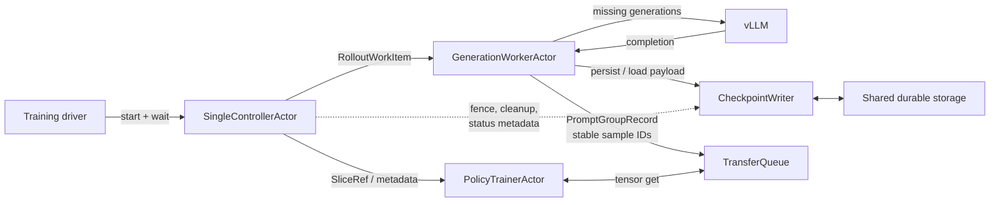

# Partial Rollout Checkpointing with SingleController

**Status:** Draft

**First implementation:** Completed-generation recovery for native single-turn GRPO
**Architecture:** `SingleControllerActor` + passive workers + TransferQueue + passive checkpoint writer

## Decision summary

Partial rollout checkpointing is part of the SingleController design. It does
not introduce a second recovery coordinator.

- `SingleControllerActor` owns rollout work identity, policy version,
  `attempt_id`, liveness detection, fencing, and redispatch.
- `GenerationWorkerActor` loads completed siblings, invokes vLLM for missing
  siblings, persists completion payloads, and pushes a complete
  `PromptGroupRecord` directly to TransferQueue (TQ).
- `RolloutCheckpointWriter` is a passive Ray actor. It provides durable,
  idempotent storage but makes no scheduling or recovery decisions.
- `PolicyTrainerActor` reads tensors directly from TQ.
- SingleController sees metadata and actor handles only. Token IDs, logprobs,
  message logs, and other tensors never pass through it.
- The training driver starts the actors and waits on
  `SingleControllerActor.run()`. It does not coordinate recovery.

The first implementation checkpoints completed GRPO siblings. If three of four
generations are durable when a generation worker fails, the replacement worker
generates only the fourth. Mid-token, multi-turn, NeMo Gym, and full-job
recovery are later milestones.

## Why start at the completed-generation boundary

Completed-generation checkpointing fixes a meaningful loss mode without
modifying vLLM's token loop:

- one durable write per completed generation rather than per token;
- no KV-cache or RNG restoration;
- no Gym session-restoration dependency;
- no new tensor path through SingleController; and
- early validation of stable IDs, idempotent writes, fencing, actor recovery,
  and TQ deduplication.

The same contracts extend to token-prefix and multi-turn checkpointing later.

## Delivery milestones

| Milestone | Capability | Recovery boundary | Exit criterion |
|---|---|---|---|
| M0: Contracts and fault harness | Stable work identity, versioned schema, filesystem store, writer API, metrics, and deterministic failure injection | None yet | Records round-trip; duplicates are safe; corrupt and stale writes are rejected |
| M1: Completed GRPO siblings | SingleController redispatches failed work; replacement GenerationWorker reuses completed siblings | One complete generation | With four siblings, killing the worker after three durable acknowledgements causes exactly one new generation |
| M2: Controller and job restart | Reconstruct controller work from its checkpoint sidecar, writer index, TQ snapshot, and trainer/model checkpoint | Completed generations across SingleController, Ray, or Slurm restart | Restart resumes from one authoritative training step without duplicate or skipped samples |
| M3: Single-turn token prefixes | Persist cumulative output-token prefixes on an interval | Bounded token interval | A decode failure loses at most the configured interval; no KV cache is required |
| M4: Multi-turn boundaries | Persist `_EpisodeState` and an explicit phase before and after environment calls | Assistant/environment boundary | Recovery invokes the correct next component after failure on either side of a boundary |
| M5: NeMo Gym and SWE state | Reattach a durable session or restore from a snapshot/replay recipe | Environment and sandbox state | A supported long-running SWE episode survives Gym actor loss and full job restart |
| M6: Scale and hardening | Sharded writers, batching, backpressure, retention, compaction, quotas, and dashboards | Production scale | Fault-injection and soak tests meet agreed throughput, recovery-time, and storage SLOs |

M0 and M1 form the first user-visible increment.

## First implementation scope

### Goals

M1 must:

1. have SingleController assign stable work and sample IDs before generation;
2. persist each completed generation independently;
3. acknowledge completion only after the writer reports a durable commit;
4. keep an in-memory SingleController ledger of dispatched work;
5. detect generation-worker failure, fence the prior attempt, restart/refit the
   worker, and redispatch the same logical work;
6. load completed siblings in the replacement GenerationWorker;
7. generate only missing sibling indexes;
8. preserve generation-index ordering in the assembled prompt group;
9. push the complete group directly from GenerationWorker to TQ under stable
   sample IDs; and
10. reject incompatible, corrupt, conflicting, or stale checkpoint records.

### Non-goals

M1 does not:

- resume within a vLLM decode;
- persist or restore KV cache;
- support NeMo Gym or multi-turn environments;
- recover a Gym `session_id` or sandbox;
- survive SingleController, Ray-cluster, or Slurm restart;
- continue a rollout with a different policy version;
- provide exact stochastic replay; or
- make the current TQ data plane durable.

Setup must reject unsupported combinations, including NeMo Gym and
`max_rollout_turns != 1`.

## Component ownership

| Component | Responsibility |
|---|---|
| Training driver | Start TQ, GenerationWorker, Gym actors where applicable, PolicyTrainer, CheckpointWriter, and SingleController; then wait on `controller.run()`. No rollout-recovery decisions. |
| `SingleControllerActor` | Own the rollout, train, and weight pumps; create `RolloutWorkItem`; track metadata-only in-flight work; detect failures; pause dispatch; fence attempts; restart/refit workers; redispatch work; coordinate TQ consumption and retention cleanup. |
| `GenerationWorkerActor` | Execute one prompt-group work item; query/load completed siblings; call vLLM for missing siblings; persist completed generation records; assemble the group; put tensors directly into TQ; return metadata/acknowledgement to SingleController. |
| vLLM engine/worker | Generate completions requested by GenerationWorker. It is checkpoint-unaware in M1. |
| `RolloutCheckpointWriter` | Passive storage service: serialize, atomically persist, checksum, deduplicate, fence stale attempts, load records for GenerationWorker, expose status metadata, and apply controller-directed cleanup. |
| Shared durable storage | Hold records outside Ray actor memory. M1 uses a shared filesystem visible to controller and generation nodes. |
| TransferQueue | Receive complete prompt-group payloads directly from GenerationWorker under stable IDs. TQ remains transient in M1. |
| `PolicyTrainerActor` | Read tensors directly from TQ, train, and return `TrainStepResult` metadata to SingleController. |

## Target architecture



The solid tensor/data path bypasses SingleController. SingleController only
dispatches work and handles metadata.

## SingleController state

M1 extends the controller's existing metadata state with an in-flight work
ledger:

```python
@dataclass(frozen=True)
class InflightRollout:
    work: RolloutWorkItem
    worker_id: str
    dispatched_at: float
    status: Literal["DISPATCHED", "RECOVERING", "PUSHED_TO_TQ"]


class SingleControllerState:
    inflight_work: dict[str, InflightRollout]  # keyed by group_id
    next_attempt_by_group: dict[str, int]
```

This state contains no tensors. For M1 it is in controller memory, so
SingleController crash remains out of scope. M2 persists the dispatch ledger
alongside trainer version, training step, and dataloader state.

## Identity model

SingleController assigns identity before dispatch:

```python
@dataclass(frozen=True)
class RolloutWorkItem:
    run_id: str
    step_id: int
    rollout_batch_id: str
    group_id: str
    attempt_id: int
    policy_version: str
    prompt_hash: str
    sampling_config_hash: str
    tokenizer_hash: str
    num_generations: int
    prompt_ref: Any
```

`prompt_ref` is a small control-plane reference or identifier, not the rollout
tensor payload.

Per-generation sample IDs are deterministic:

```text
sample_id = "{group_id}_g{generation_index}"
```

`attempt_id` is deliberately excluded from `sample_id`: retrying failed work
must not create a new training sample. SingleController increments the attempt
and calls the writer fence before redispatch. Writer and GenerationWorker then
reject delayed effects from older attempts.

## Normal workflow

1. `_rollout_pump` selects a prompt, creates `RolloutWorkItem`, and records it
   in `inflight_work`.
2. SingleController dispatches
   `GenerationWorkerActor.generate_and_push(work, tq_handle, writer_handle)`.
3. GenerationWorker asks the writer to load valid completed records for the
   group.
4. GenerationWorker invokes vLLM only for missing generation indexes.
5. As each generation completes, GenerationWorker creates a
   `CompletedGenerationRecord` and awaits `persist_completed()`.
6. The writer atomically commits the record and returns `PersistAck`.
7. GenerationWorker assembles recovered and new siblings in generation-index
   order.
8. GenerationWorker puts the complete `PromptGroupRecord` directly into TQ
   under the stable sample IDs.
9. GenerationWorker returns row IDs/status metadata to SingleController.
10. SingleController changes the ledger entry to `PUSHED_TO_TQ`; `_train_pump`
    later selects the rows and calls PolicyTrainer using `SliceRef` metadata.

## Generation-worker recovery

Generation-worker failure follows the SingleController failure-handling
pattern:

1. A liveness check, call-site `RayActorError`, or timeout identifies the
   failed worker.
2. SingleController clears the rollout-dispatch gate and marks affected work
   `RECOVERING`.
3. SingleController increments `attempt_id` and durably fences the prior
   attempt through CheckpointWriter.
4. SingleController restarts/replaces GenerationWorker and refits the required
   policy version because a new worker does not retain weights.
5. SingleController redispatches the same `group_id` with the new attempt.
6. Replacement GenerationWorker loads completed sibling payloads from the
   writer and generates only missing indexes.
7. After the complete group is in TQ, SingleController resumes normal dispatch.

If the original worker was only hung and later returns, the writer fence and
stable TQ sample IDs prevent its older attempt from publishing a conflicting
result.

## SingleController and full-job recovery

This is M2, not M1. A restarted SingleController must reconstruct work instead
of resetting all in-flight rollouts to zero.

The reconstruction inputs are:

- controller checkpoint sidecar: trainer version, train step, dataloader state,
  and dispatch ledger;
- CheckpointWriter index: durable generation-completion metadata;
- TQ metadata or TQ snapshot: groups already pushed or consumed;
- latest trainer/model/optimizer checkpoint; and
- live actor handles from Ray/GCS.

The replacement controller reconciles these inputs, fences old attempts, and
redispatches only groups that are neither durably consumed nor complete in TQ.
The complete checkpoint-commit ordering must be defined before enabling this
mode.

## Completed-generation record

M1 stores a complete generation rather than a token prefix:

```python
@dataclass(frozen=True)
class CompletedGenerationRecord:
    schema_version: int
    run_id: str
    step_id: int
    group_id: str
    generation_index: int
    attempt_id: int
    policy_version: str
    prompt_hash: str
    sampling_config_hash: str
    tokenizer_hash: str
    phase: Literal["GENERATION_COMPLETE"]
    message_log: list[dict[str, Any]]
    env_extras: dict[str, Any] | None
    reward: float
    truncated: bool
    sample_metrics: dict[str, Any]
    payload_checksum: str
```

The payload includes token IDs and generation logprobs already produced by the
current rollout path. Token-prefix checkpointing may omit logprobs and
recompute them later, but M1 preserves a completed training sample without
changing its semantics. All tensors move to CPU before persistence.

SingleController never loads this record. Only GenerationWorker and the writer
handle its payload.

## Writer API

The writer is passive and exposes separate metadata and payload operations:

```python
class RolloutCheckpointWriter:
    def fence(self, group_id: str, attempt_id: int) -> None: ...

    def list_completed(
        self, work: RolloutWorkItem
    ) -> list[CompletedGenerationMetadata]: ...

    def load_completed(
        self, work: RolloutWorkItem
    ) -> dict[int, CompletedGenerationRecord]: ...

    def persist_completed(
        self, record: CompletedGenerationRecord
    ) -> PersistAck: ...

    def delete_group(self, run_id: str, step_id: int, group_id: str) -> None: ...
```

SingleController may call `list_completed()` for reconciliation, but
`load_completed()` is called by GenerationWorker so payloads bypass the
controller.

The idempotency key is:

```text
(run_id, group_id, generation_index)
```

Writer behavior:

- missing key: commit and acknowledge;
- same key and checksum: return the previous acknowledgement;
- same key and different checksum: raise checkpoint conflict;
- attempt older than the current fence: reject as stale; and
- incompatible schema or fingerprint: reject before recovery.

This covers the ambiguous case where persistence succeeds but the producer
does not receive the acknowledgement.

## Storage and atomicity

M1 uses one immutable file per completed generation:

```text
{root_dir}/
  {run_id}/
    step-{step_id}/
      {group_id}/
        g{generation_index}.pt
        fence.json
```

The initial codec may use a versioned plain dictionary serialized with
`torch.save`, because the payload contains PyTorch tensors and is loaded only
from the configured trusted checkpoint directory. A schema-native non-pickle
codec should be evaluated before cross-version or long-retention support.

Commit sequence:

1. serialize to a temporary file in the destination directory;
2. flush and `fsync` the file;
3. atomically rename to `g{generation_index}.pt`; and
4. `fsync` the parent directory when required by the filesystem.

There is no two-file payload/manifest transaction in M1. The deterministic
filename is the lookup index.

One writer actor is sufficient initially because M1 writes once per completed
generation. M6 can shard by `hash(group_id)` and add batching after measuring
the shared-storage backend.

## Validity checks

A saved generation is recoverable only when all of these match:

- supported schema version;
- run, step, and group identity;
- valid generation index;
- exact policy version;
- prompt hash;
- sampling-config hash;
- tokenizer hash;
- `GENERATION_COMPLETE` phase; and
- payload checksum.

Mismatch for the same `group_id` is a hard error. The controller must create a
new group for intentionally new logical work. Mixing siblings from different
policy versions would invalidate the GRPO group.

## TQ handoff and cleanup

GenerationWorker writes directly to TQ. It returns only row IDs and status
metadata to SingleController. The controller then uses `SliceRef` metadata to
instruct PolicyTrainer; tensors move directly between TQ and PolicyTrainer.

The current TQ-backed data plane is transient. Therefore, M1 does not delete a
generation checkpoint immediately after `tq.put()`.

Initial cleanup rule:

- keep records while their group is in flight or resident in TQ;
- after a successful train step and controller-directed TQ pop, mark the group
  eligible for cleanup; and
- retain a configurable number of completed steps or use a TTL sweeper to
  tolerate lost acknowledgements.

M2 replaces this with a coordinated commit point covering controller state,
trainer/model checkpoint, and durable TQ snapshot.

Stable TQ sample IDs are required. The implementation must verify that putting
the same keys and identical payload twice is idempotent. If not, GenerationWorker
must query production status before retrying the handoff.

## Persistence failure policy

Persistence is a correctness boundary:

- GenerationWorker retries transient writer/filesystem failures with bounded
  exponential backoff;
- the writer uses bounded queues and exposes backpressure;
- exhaustion fails the work item and is reported to SingleController;
- SingleController decides whether to retry, replace the writer, or abort; and
- a generation is never considered recoverable without a durable
  acknowledgement.

Exceptions should distinguish validation, conflict, stale-attempt, corruption,
storage-unavailable, and retry-exhausted failures. A worker must not catch a
generic exception and publish a partially durable group.

## Proposed configuration

New user-facing configuration should use a Pydantic `BaseModel`; defaults live
on the model and are reflected in the exemplar YAML.

```yaml
rollout_checkpointing:
  enabled: false
  mode: completed_generations
  root_dir: null
  writer_replicas: 1
  max_persist_retries: 3
  completed_step_retention: 2
```

Setup requires `root_dir` when enabled and verifies that controller and
generation nodes can reach it. M1 rejects unsupported mode, multiple writer
replicas, NeMo Gym, and multi-turn rollout configuration.

## Observability

SingleController metrics:

- in-flight groups and attempts;
- failure detection and recovery latency;
- fenced and redispatched work;
- groups pushed to TQ; and
- retry success/failure by reason.

GenerationWorker/writer metrics:

- writes, bytes, and acknowledgement latency;
- duplicate acknowledgements;
- write retries and failures;
- loaded/reused and regenerated siblings;
- checkpoint conflicts, corruption, and stale-attempt rejection; and
- retained bytes and oldest-record age.

Every event includes `run_id`, `step_id`, `group_id`, `generation_index` where
applicable, `attempt_id`, and `policy_version`.

## Test plan

### Unit tests

- codec round-trip with CPU tensors and message logs;
- atomic write never exposes a partial record;
- duplicate key and checksum is successful;
- duplicate key with different payload raises conflict;
- old attempts are rejected after fencing;
- corrupt payloads and fingerprint mismatches are rejected;
- GenerationWorker schedules only missing indexes; and
- recovered/new completions assemble in index order.

### SingleController tests

Use passive fake actor handles to verify:

- work identity is created once and reused across retry;
- liveness/call-site failure moves work to `RECOVERING`;
- the old attempt is fenced before redispatch;
- replacement worker is refit before work resumes;
- SingleController receives only metadata; and
- checkpointing disabled preserves the existing controller flow.

### Ray fault-injection test

For `num_generations_per_prompt = 4`:

1. SingleController dispatches one prompt-group work item;
2. GenerationWorker persists generations `0`, `1`, and `2`;
3. kill GenerationWorker before generation `3` is acknowledged;
4. SingleController detects failure, fences the attempt, restarts/refits the
   worker, and redispatches the same work item;
5. assert that replacement GenerationWorker invokes vLLM only for generation
   `3`;
6. assert that all four stable sample IDs are present once logically in TQ; and
7. assert that an old-attempt write is rejected.

Ray actor definitions added for this feature carry `# pragma: no cover`; their
non-remote implementations should contain most unit-tested behavior.

### Performance test

Measure bytes, writer throughput, p50/p95 acknowledgement latency, and rollout
overhead for representative generation counts. Set a production threshold only
after benchmarking the shared filesystem; do not assume one writer scales to
every deployment.

## Implementation sequence

1. Add internal dataclasses, fingerprints, codec, filesystem store, and unit
   tests.
2. Add passive CheckpointWriter actor, fencing, idempotency, metrics, and fault
   injection.
3. Extend SingleController with stable work identity and the metadata-only
   in-flight ledger.
4. Add checkpoint load/persist and stable TQ sample IDs to
   GenerationWorker/RolloutManager.
5. Add generation-worker restart, policy refit, fence, and redispatch flow.
6. Add the four-generation Ray fault-injection test.
7. Add configuration, exemplar YAML updates, setup validation, and cleanup.

If implementation lands before the SingleController path is the default, the
current `SyncRolloutActor` may use a thin compatibility adapter. It must not
become the long-term owner of IDs, recovery, or cleanup.

The feature remains disabled by default until fault-injection and TQ
idempotency tests pass.

## Decisions required before implementation

1. What is the authoritative `policy_version` exposed to SingleController?
2. Does GenerationWorker own `RolloutManager`, or is there another passive
   actor boundary in the selected SingleController implementation?
3. Which shared filesystem is guaranteed on every controller and generation
   node in supported Slurm deployments?
4. Does TQ guarantee idempotent replacement for the same sample ID and
   identical payload?
5. Should M1 use trusted `torch.save`, or introduce a schema-native tensor
   codec immediately?
6. Which worker failures can be retried after refit, and which require job
   termination?
7. What exact event marks a group safe for retention cleanup?
8. What fields must be added to the SingleController checkpoint sidecar in M2,
   and how are they committed relative to trainer and TQ snapshots?

## Later milestones

M3 stores cumulative token prefixes with a monotonic token offset. Replaying
the same prefix is idempotent. Resume prefills prompt plus saved output tokens
and regenerates the suffix; exact stochastic continuation is not required
unless RNG state becomes an explicit goal.

M4 promotes `_EpisodeState` to a versioned schema and adds phases such as
`GENERATING`, `ASSISTANT_COMMITTED`, `GYM_RESULT_COMMITTED`, and `COMPLETE`.
The saved phase—not inference from message history—determines whether
GenerationWorker invokes vLLM or the environment next.

M5 treats a Gym `session_id` as a handle, not as durable state. Full-job
recovery requires an explicit Gym contract for reattachment, snapshots, or
deterministic replay, including idempotency for environment calls with external
side effects.
