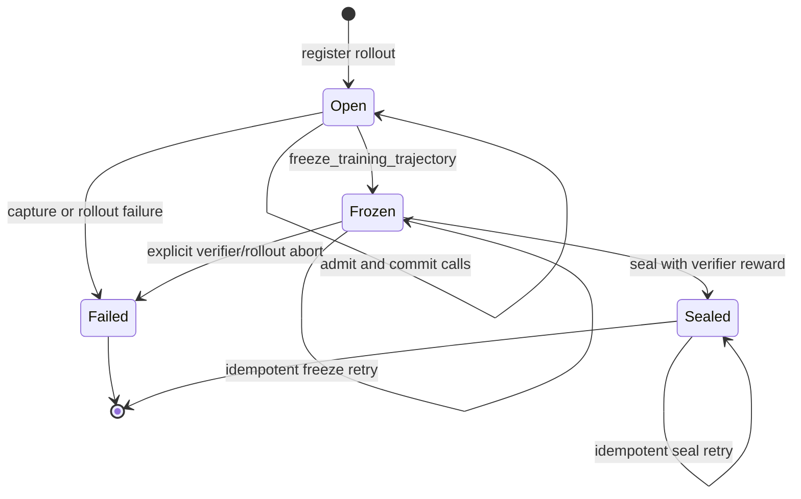

# Freeze the Training Trajectory Before Verification

Status: Proposal

## Summary

Token-capture rollouts need an explicit boundary between model generation and
reward verification. The boundary must identify the exact committed model call
whose ancestry becomes the training trajectory, and it must be durable before
the verifier is allowed to run.

Add a `freeze_training_trajectory` transition to the Gym capture gate. The
trusted agent harness invokes it after the main agent stops and before the
verifier can consume the generated answer or patch. The gate atomically:

1. verifies that every admitted model call has reached a terminal capture
   state;
2. resolves the harness-provided terminal logical request to a committed model
   call;
3. validates the terminal call's parent chain;
4. records an immutable `GenerationBoundary`; and
5. rejects any later training-capture admission for the rollout.

Verification runs only after the gate acknowledges that boundary. After the
verifier returns a reward, the existing seal operation produces a token-free
`RolloutReceipt` using the already-frozen terminal model call. The finalizer
continues to fetch deltas from TransferQueue (TQ), verify them, and linearize
only the terminal call's ancestry.

This makes the training trajectory deterministic without relying on TQ row
order, wall-clock timestamps, completion-file modification times, or whichever
model call happened to finish last globally.

## Terminology

- **Model call**: one request admitted by the capture gate and assigned a
  `model_call_id`.
- **Logical request**: the harness-visible identity for a model request. It is
  mapped one-to-one to a model call within a rollout.
- **Main trajectory**: the agent session whose result is submitted to the
  verifier and whose ancestry is eligible for training.
- **Sibling call**: a committed call in the same rollout that is not an
  ancestor of the selected terminal call, such as a subagent or abandoned
  branch.
- **Generation boundary**: the durable gate record that freezes the terminal
  model call before verification.
- **Seal**: the post-verification transition that binds the reward to the
  frozen trajectory and returns a `RolloutReceipt`.

"Terminal" does not mean the last call to finish across all concurrent agent
sessions. It means the last call in the selected main trajectory. Concurrent
subagent calls may finish later, but they must not replace the main terminal or
enter its parent chain.

## Current behavior

The current branch has strong per-call attribution:

- NeMo RL assigns a unique `rollout_id` to each generation.
- Gym assigns a `model_call_id` to every correlated model request.
- The worker stages each delta under the deterministic TQ key
  `<rollout_id>/<model_call_id>`.
- Staged rows and receipt records carry `rollout_id`, `model_call_id`,
  `parent_call_id`, lengths, weight version, and integrity digests.
- The finalizer starts at `RolloutReceipt.terminal_model_call_id` and follows
  only its parent ancestry to build the training row.

The SWE harness currently derives `terminal_logical_request_id` from the
`response.id` in the newest copied completion artifact for the main session.
NeMo RL passes that value to the gate when it seals the rollout after Gym has
already run the verifier.

This selects a terminal chain deterministically in the normal SWE path, but it
does not prove a generation/verification boundary:

- TQ rows have identity but no authoritative execution order.
- The gate does not record when generation ended or verification began.
- The terminal is selected from a persisted artifact rather than handed off
  directly at the agent-to-verifier transition.
- The gate remains open to new training-capture calls until the post-verifier
  seal request arrives.
- `seal_rollout` can verify that no calls are currently in flight, but it
  cannot prove that the selected call was frozen before verification started.

Manifest order must not be used as a substitute. Calls can execute
concurrently, and insertion or commit order does not identify the main
trajectory.

## Required invariants

The implementation must enforce the following invariants.

### Identity

1. A logical request maps to at most one model call within a rollout.
2. The frozen terminal logical request resolves to exactly one committed model
   call.
3. Every record in the selected ancestry belongs to the same rollout.
4. Every non-root record names a committed parent whose cumulative length
   equals the child's `prev_len`.

### Boundary ordering

1. The main agent has stopped issuing calls before the freeze request.
2. The gate acknowledges the freeze before verification begins.
3. No training-capture call is admitted after the freeze.
4. A freeze fails while any admitted call is still committing or otherwise
   lacks a known terminal capture outcome.

### Training selection

1. The terminal model call is immutable after the freeze.
2. The reward is attached only to that frozen terminal and its ancestry.
3. Sibling calls never enter the training row.
4. Missing or ambiguous terminal attribution fails closed; it never falls back
   to manifest order or a timestamp.

### Retry safety

1. An identical freeze retry returns the same boundary.
2. Reusing the freeze operation ID with a different terminal is rejected.
3. An identical seal retry returns the same receipt.
4. A seal request cannot change the frozen terminal.

## Proposed protocol

### Lifecycle



The verifier is outside the gate state machine, but its ordering is strict:

```text
agent calls complete
    -> freeze_training_trajectory (durable ACK)
    -> verifier starts
    -> seal(reward, boundary_id)
    -> finalizer verifies TQ rows and publishes the training row
```

### Structured terminal handoff

The trusted harness must produce a structured generation result directly from
the completed main session:

```python
GenerationOutcome(
    rollout_id=...,
    trajectory_id=...,
    terminal_logical_request_id=...,
    terminal_turn_index=...,
)
```

`terminal_logical_request_id` must come from the live model response or from a
logical request ID generated before dispatch and echoed by the response. It
must not be inferred by scanning files after verification.

`trajectory_id` identifies the main session when the harness supports
subagents. `terminal_turn_index` is a monotonically increasing main-session
turn number used for validation and diagnostics. It is not a global ordering
across sibling sessions.

Persisted completion files can remain observability artifacts. During
migration, an adapter may recover a terminal ID from them, but strict mode must
require the direct structured handoff.

### Call admission metadata

For the gate to validate which terminal is eligible, each admitted call should
carry optional trajectory metadata:

```python
CallAttribution(
    trajectory_id=...,
    trajectory_role="main" | "subagent" | "other",
    turn_index=...,
)
```

The gate enforces uniqueness of `(trajectory_id, turn_index)` within a rollout.
For the main trajectory, the frozen terminal must:

- have `trajectory_role == "main"`;
- match the `trajectory_id` in `GenerationOutcome`; and
- have the highest committed `turn_index` in that main trajectory.

The parent graph remains the token authority. Turn indices help reject an
incorrect terminal selection but are not used to concatenate tokens.

Harnesses that cannot yet provide trajectory metadata may use a compatibility
mode that validates only the logical request and parent chain. Such rollouts
should expose a metric showing that the stronger main-session check was not
available.

### Freeze request

Add an authenticated control operation:

```http
POST /training-token-capture/control/rollouts/{rollout_id}/freeze
```

```json
{
  "owner_id": "...",
  "operation_id": "...",
  "trajectory_id": "...",
  "terminal_logical_request_id": "...",
  "terminal_turn_index": 17
}
```

The request is valid only while the rollout is `Open`. Under the rollout's
atomic state transaction, the gate:

1. authenticates the boundary caller;
2. rejects any calls in `admitted` or `committing` state;
3. rejects a rollout with a failed or poisoned call;
4. resolves `terminal_logical_request_id` through the rollout's logical-request
   index;
5. requires the resolved call to be committed and staged;
6. validates trajectory metadata when present;
7. validates the terminal call's complete, acyclic parent chain;
8. computes a digest over the selected call IDs and their immutable manifest
   records;
9. persists a `GenerationBoundary`; and
10. changes the rollout state to `Frozen` before returning success.

The response is token-free:

```python
GenerationBoundary(
    schema_version=1,
    boundary_id=...,
    rollout_id=...,
    trajectory_id=...,
    terminal_logical_request_id=...,
    terminal_model_call_id=...,
    terminal_turn_index=...,
    terminal_commit_sequence=...,
    selected_call_ids=(...),
    selected_manifest_digest=...,
)
```

`terminal_commit_sequence` is a gate-assigned monotonic sequence useful for
audit and metrics. It does not define the trajectory; the explicit terminal
and parent links do.

`boundary_id` should be a deterministic digest of the immutable request and
selected manifest, so an identical retry returns the same value.

The digest input is canonical and domain-separated:

```text
SHA-256(
    "nemo-gym-generation-boundary-v1"
    || rollout_id
    || trajectory_id
    || terminal_logical_request_id
    || terminal_model_call_id
    || terminal_turn_index
    || each selected CallRecord in root-to-terminal order
)
```

Strings and records use the same length-delimited canonical encoding on every
producer and verifier. JSON serialization, dictionary insertion order, and
timestamps are not digest inputs.

### Admission after freeze

Once a rollout is `Frozen`, the training-capture route rejects new model calls
before inference dispatch. This is the enforcement that the current
post-verifier seal cannot provide.

If verification itself needs an LLM, it must use one of the following:

- an uncorrelated evaluation endpoint;
- a separately registered verification rollout; or
- a capability explicitly scoped to non-training capture.

Verifier calls must never share the frozen rollout's training data capability.

### Seal request

After verification, NeMo RL seals using the boundary identity:

```http
POST /training-token-capture/control/rollouts/{rollout_id}/seal
```

```json
{
  "owner_id": "...",
  "operation_id": "...",
  "boundary_id": "...",
  "reward": 1.0
}
```

The gate verifies that:

- the rollout is `Frozen`;
- `boundary_id` matches the stored boundary;
- the selected manifest still matches its frozen digest; and
- no capture failure was recorded.

The receipt's `terminal_model_call_id` is copied from the boundary. The seal
request cannot supply or replace it.

For one compatibility release, `seal` may continue accepting
`terminal_logical_request_id`, but it must exactly match the stored boundary.
Calling `seal` on an unfrozen rollout should be allowed only behind an explicit
legacy compatibility flag and should increment a metric.

### Receipt extension

The sealed receipt embeds the complete token-free boundary because the
finalizer does not have access to live gate state:

```python
RolloutReceipt(
    rollout_id=...,
    reward=...,
    terminal_model_call_id=...,
    manifest=[...],
    generation_boundary=GenerationBoundary(...),
    capture_poisoned=False,
    failure_reason=None,
)
```

Receipt validation requires:

- `generation_boundary.rollout_id == receipt.rollout_id`;
- `generation_boundary.terminal_model_call_id ==
  receipt.terminal_model_call_id`;
- every `selected_call_id` is present exactly once in `manifest`; and
- recomputing the boundary digest from the receipt manifest yields the embedded
  `boundary_id`.

This lets any finalizer validate terminal selection without trusting the
component that transported the receipt.

## TransferQueue and finalization

The minimal protocol does not require ordering fields in TQ. Each staged row
already has the identity and parent link required to verify a selected chain.
The boundary belongs in gate or ledger state because it describes rollout
lifecycle, not token payload storage.

The finalizer should additionally validate that:

1. the receipt contains a supported generation-boundary schema version;
2. `terminal_model_call_id` matches the boundary terminal;
3. the recomputed selected call-ID sequence and manifest digest match the
   boundary; and
4. the linearized row contains exactly the frozen terminal ancestry.

The initial implementation can keep the current receipt manifest containing
all committed calls. The finalizer will verify all rows but train only the
terminal chain. A later wire revision may split this into:

- a selected-chain manifest used for training; and
- a cleanup manifest for unselected sibling staging keys.

That split would prevent an unselected sibling's missing row from invalidating
an otherwise sound main trajectory, but it is not required to establish the
verification boundary.

## Authorization and secret custody

The model-calling agent sandbox currently receives a rollout-local data
capability. It must not receive authority to freeze or seal the rollout.
Otherwise untrusted agent code could end generation early or choose its own
training terminal.

The freeze operation therefore needs a boundary capability held only by the
trusted Gym orchestration process. Two implementation options are acceptable:

1. issue a rollout-scoped boundary capability at registration and pass it only
   to the trusted agent wrapper; or
2. give the trusted Gym server a server-to-server credential scoped to freeze
   operations.

The preferred option is a rollout-scoped boundary capability because it limits
the effect of credential disclosure. Its plaintext value must not be written
to completion files, `params.json`, logs, the agent container, receipts, or TQ
tags. Gate state stores only its digest.

The existing NeMo RL owner remains responsible for register, fail, and seal.

## Integration with the capture ledger proposal

This protocol works with both the current `GateStateStore` and the proposed
per-rollout [capture ledger](token-capture-ledger.md).

With the current store, add the boundary and lifecycle state to
`GateRolloutState` and retain it in the seal tombstone.

With `CaptureLedger`, add one event:

```python
GenerationFrozen(
    operation_id=...,
    boundary=GenerationBoundary(...),
)
```

The event is appended and fsynced under the rollout lock. Later `CallStarted`
events are invalid. `RolloutSealed` references the boundary ID and reward. The
ledger fold can reproduce both the boundary and receipt for idempotent retries.

The generation-boundary contract should be implemented independently of the
gate-storage migration so the correctness guarantee does not depend on which
state backend lands first.

## Failure handling

| Failure | Required outcome |
| --- | --- |
| Main agent exits without a terminal logical request | Freeze fails; rollout is non-trainable and staged rows are cleaned up |
| Terminal logical request is unknown | Freeze fails closed; never select another manifest row |
| Terminal call was admitted but did not commit | Freeze fails while the call is in flight; after timeout, mark the rollout failed |
| Any call is still committing | Return a retryable conflict; do not start verification |
| Terminal trajectory metadata does not match | Freeze fails closed |
| Parent is missing, cyclic, or length-inconsistent | Freeze fails closed |
| Freeze response is lost | Retry with the same operation ID and receive the identical boundary |
| A call arrives after freeze | Reject before inference dispatch |
| Verifier crashes | The boundary remains frozen; policy decides whether to seal with a failure reward or fail the rollout |
| Seal response is lost | Retry with the same operation ID and boundary ID |
| Gate process crashes after freeze | Recover the durable boundary and continue verification/seal retry |
| Boundary capability leaks to the agent | Treat as a security incident; scoped capability limits exposure to one rollout |

Ambiguous capture outcomes remain non-trainable. The boundary must not turn a
missing acknowledgement into evidence that a call did not execute.

## Metrics and observability

Add the following gate metrics:

- `generation_freeze_succeeded`
- `generation_freeze_retries`
- `generation_freeze_conflicts`
- `generation_freeze_missing_terminal`
- `generation_freeze_invalid_terminal`
- `generation_freeze_pending_calls`
- `post_freeze_calls_rejected`
- `legacy_unfrozen_seals`
- `trajectory_metadata_compatibility_mode`

Logs should include rollout ID, boundary ID, terminal model-call ID, selected
call count, and rejection category. They must not include capability values or
token arrays.

For end-to-end diagnosis, expose these non-authoritative timestamps:

- main agent stopped;
- freeze requested;
- freeze committed;
- verifier started;
- verifier completed; and
- seal committed.

Correctness uses state transitions, not timestamp comparisons.

## Compatibility and configuration

Use one centralized user-facing setting:

```yaml
token_capture:
  generation_boundary_mode: compat  # off | compat | required
```

- `off`: retain the current post-verifier terminal selection. Intended only as
  an emergency rollback mode.
- `compat`: use the boundary when the harness supplies one, otherwise use the
  legacy seal path and increment `legacy_unfrozen_seals`.
- `required`: do not start verification without a durable boundary, and reject
  receipts that do not embed one.

The first release can default existing configurations to `compat` while the
SWE capture recipes explicitly set `required`. After all supported capture
harnesses implement the boundary, change the centralized schema default to
`required` and remove the legacy terminal argument in a later wire revision.

No call site may silently substitute a mode. The default belongs in the
user-facing config schema and exemplar YAML, consistent with NeMo RL config
conventions.

## Expected code changes

| Repository path | Change |
| --- | --- |
| Gym `nemo_gym/token_id_capture/staging/records.py` | Add versioned `CallAttribution` and `GenerationBoundary` wire models; extend `RolloutReceipt` |
| Gym `nemo_gym/token_id_capture/gate_store.py` | Add rollout lifecycle, boundary-capability digest, frozen boundary, and retry tombstone state |
| Gym `nemo_gym/token_id_capture/gate.py` | Implement atomic freeze, graph validation, boundary digest, post-freeze admission rejection, and boundary-bound seal |
| Gym `nemo_gym/token_id_capture/control_routes.py` | Add the authenticated freeze route and typed request/response models |
| Gym capture middleware and model adapter | Carry trajectory attribution and reject frozen-rollout calls before engine dispatch |
| Gym `responses_api_agents/swe_agents/app.py` | Split agent completion from verification, retain the direct terminal logical ID, freeze, then unblock evaluation |
| NeMo RL `nemo_rl/environments/nemo_gym.py` | Configure boundary mode, distribute scoped credentials, and seal with `boundary_id` |
| NeMo RL `nemo_rl/experience/blackbox_finalizer.py` | Validate the embedded boundary and exact selected ancestry before publishing |
| NeMo RL token-capture config and exemplar YAMLs | Define the centralized boundary mode and strict SWE recipe posture |

The SWE runner currently starts the evaluation container early and lets it wait
for the model patch. That optimization can remain, but the patch or other
verifier input must stay unavailable until the freeze acknowledgement is
durable. A prestarted process does not violate the boundary as long as it
cannot begin verification work.

## Implementation plan

### Phase 1: Gate boundary

1. Add `Open`, `Frozen`, and terminal rollout state to the current Gym gate.
2. Add `GenerationBoundary` and the authenticated freeze route.
3. Reject training-capture admission after freeze.
4. Change seal to consume a boundary ID and copy the frozen terminal.
5. Preserve boundary information in sealed tombstones for retry recovery.

### Phase 2: Trusted harness handoff

1. Have the model-client adapter retain the main session's terminal logical
   request ID directly.
2. Add main-trajectory identity and turn indices where agent frameworks expose
   them.
3. Freeze after the agent process exits and before making its patch or answer
   available to the verifier.
4. Keep completion-file extraction only as an explicitly measured compatibility
   path.
5. Ensure subagent sessions cannot overwrite the main terminal.

### Phase 3: NeMo RL integration

1. Register or distribute the rollout-scoped boundary capability without
   exposing it to the sandbox.
2. Carry `boundary_id` in the token-free Gym result.
3. Seal with `boundary_id` and reward.
4. Reject receipt-mode results that lack a boundary when strict mode is
   enabled.
5. Validate boundary identity during black-box finalization.

### Phase 4: Ledger backend

1. Add `GenerationFrozen` to `CaptureLedger`.
2. Reproduce boundary and seal retry behavior by folding ledger events.
3. Remove duplicate boundary state when the gate-store migration completes.

## Required tests

### Gate unit tests

- Freeze resolves a logical request to the expected model call.
- Freeze stores the terminal chain and rejects a sibling as terminal when it is
  not part of the main trajectory.
- Concurrent main and subagent branches freeze the main terminal regardless of
  completion order.
- Freeze fails with admitted or committing calls.
- Freeze fails for failed, poisoned, unknown, or uncommitted calls.
- Freeze validates an acyclic, length-consistent parent graph.
- Identical freeze retries return an identical boundary.
- Conflicting freeze retries are rejected.
- New call admission is rejected after freeze.
- Seal cannot change the terminal and requires the correct boundary ID.
- State-store restart preserves freeze and seal retry behavior.

### Harness tests

- The main session's direct response ID is selected without an mtime scan.
- The freeze acknowledgement occurs before the verifier is unblocked.
- Subagent completion files and later sibling completions cannot change the
  terminal.
- The boundary capability is absent from sandbox mounts, persisted parameters,
  completion files, logs, and returned metadata.
- Missing direct terminal attribution fails closed in strict mode.

### NeMo RL tests

- Receipt-mode postprocessing requires a boundary ID in strict mode.
- Seal forwards the boundary ID and reward without choosing a terminal.
- The finalizer rejects a receipt/boundary terminal mismatch.
- The finalizer linearizes exactly the frozen ancestry.
- A rejected or missing boundary produces the existing masked placeholder and
  preserves GRPO group shape.

### End-to-end tests

- A SWE rollout stages multiple turns, freezes, verifies, seals, and trains the
  exact main terminal chain.
- A concurrent subagent finishes after the main terminal but is excluded from
  training.
- A verifier that attempts to reuse the training capture route is rejected.
- Gate-worker restart between freeze and seal preserves the selected
  trajectory.
- Lost freeze and seal responses are recovered through idempotent retries.

## Alternatives considered

### Select the final manifest row

Rejected. Manifest order reflects admission or storage behavior, not the main
trajectory, and concurrent calls make it ambiguous.

### Select the greatest timestamp or sequence number

Rejected as the trajectory definition. A later subagent or verifier call could
win. Gate sequence numbers remain useful only for audit after the main
trajectory is explicitly identified.

### Keep selecting the newest completion file

Rejected as the strict contract. File modification time is not an atomic
generation boundary and cannot stop later capture admissions. It remains a
temporary compatibility adapter.

### Seal before verification

Rejected because the current seal includes the reward and terminates rollout
state. Splitting terminal freeze from reward seal preserves the useful
post-verification receipt contract while establishing the boundary earlier.

### Let the agent sandbox freeze its own trajectory

Rejected. The sandbox is part of the evaluated workload and must not control
which of its calls becomes training data.

## Recommendation

Implement `freeze_training_trajectory` as a distinct, durable transition and
make verifier startup depend on its acknowledgement. Use an explicit main
trajectory terminal from the live model-call path, reject later
training-capture admissions, and allow the post-verification seal to attach
only the reward.

This is the smallest protocol change that turns the current trusted terminal
hint into an enforceable guarantee that the exact pre-verification trajectory
is the one used for training.
