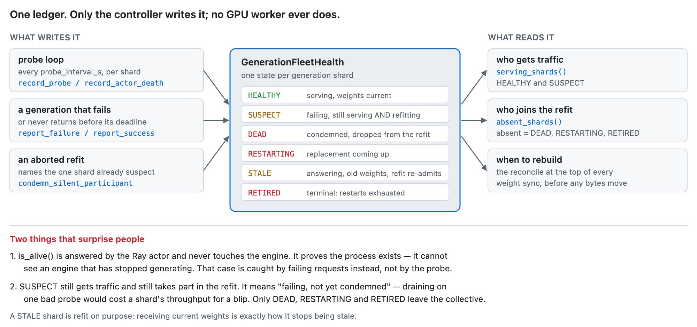
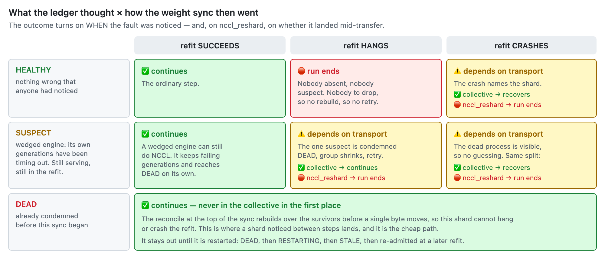

# Generation Fault Tolerance (SingleController)

A generation shard can die or wedge mid-run. Without help, the next weight sync blocks
forever inside NCCL — a collective needs every rank, and it does not care that you stopped
sending the dead one traffic. This feature notices the loss, rebuilds the refit
communicator over whoever is left, and keeps training. It can also restart the dead shard
and let it rejoin at a later refit, so a long run does not simply shrink.

It is **off by default**. Set `async_rl.generation_fleet_health.enabled: true` to turn it
on. Restarting a dead shard is a second switch on top of that —
`async_rl.generation_fleet_health.restart_dead_shards: true` — off by default, because
recreating a vLLM worker mid-run is the most invasive thing this feature does. With it
off, the fleet only ever shrinks.

## What is supported

Know these limits before enabling it.

**Weight-sync transports** — only the two that own an NCCL world can rebuild one:

| `policy.generation.refit_transport` | Drops a lost shard | Re-admits a restarted one |
|---|---|---|
| `collective` (packed broadcast) | ✅ full | ✅ at the next refit |
| `nccl_reshard` | ⚠️ only between syncs — any fault mid-transfer ends the run, fast and with a named cause. See [A mid-sync fault on nccl_reshard](#a-mid-sync-fault-on-nccl_reshard-is-different) | ✅ at the next refit |
| colocated IPC, HTTP, checkpoint-engine, `vllm_remote_sparse` | ❌ no communicator to rebuild | ❌ |

Re-admission works on both NCCL transports because each compares the membership it wants
against the one it last built, rather than asking "is anything absent". A shard leaving
and a shard coming back are the same comparison in opposite directions.

**Generation backends** — only vLLM implements the fleet-health hooks:

| `policy.generation.backend` | Supported |
|---|---|
| `vllm` | ✅ |
| `sglang` | ❌ refuses at setup with `NotImplementedError` |
| Megatron, TensorRT-LLM, Dynamo | ❌ not accepted by SingleController |

Restart is vLLM-only for the same reason: `restart_shard` is defined on `VllmGeneration`
and the supervisor calls it by name.

Trainer ranks are **never** excluded. Losing one changes the parallelism the model was
sharded for, so there is nothing to recover onto. This feature is about generation shards.

## Who watches what

One ledger, `GenerationFleetHealth`, holds a state per shard. It lives in the
SingleController process, and no GPU worker ever writes to it.



## What happens when a shard fails

Two things decide the outcome: what the ledger already thought of the shard when the sync
began, and how the sync then went.



| Shard state | Refit | Outcome | Why |
|---|---|---|---|
| `HEALTHY` | succeeds | ✅ continues | The ordinary step. |
| `HEALTHY` | hangs | 🛑 run ends | Every process is alive and nothing was suspect, so there is nobody to drop. Guessing would condemn a healthy shard and leave the real culprit in the group. |
| `HEALTHY` | crashes | ⚠️ depends | The crash names the shard: mark it dead, rebuild without it, retry once. Works on `collective`; ends the run on `nccl_reshard`. |
| `SUSPECT` | succeeds | ✅ continues | A wedged engine can still do NCCL. It keeps failing generations and reaches `DEAD` on its own. |
| `SUSPECT` | hangs | ⚠️ depends | The one suspect is condemned, the group shrinks, retry once. Works on `collective`; ends the run on `nccl_reshard`. |
| `SUSPECT` | crashes | ⚠️ depends | The dead process is visible, so no attribution is needed. Same split: works on `collective`; ends the run on `nccl_reshard`. |
| `DEAD` | any | ✅ continues | Already excluded before the collective started, so it cannot affect this refit at all. With `restart_dead_shards` it is also queued for a restart. |
| `RESTARTING` | any | ✅ continues | Absent, same as `DEAD` — a replacement engine is coming up and cannot join a collective. |
| `STALE` | succeeds | ✅ continues, and the shard rejoins | Present but not serving. This refit is exactly what gives it current weights and returns it to `HEALTHY`. |
| `RETIRED` | any | ✅ continues | Terminal: restarts exhausted, or the node is gone for good. |

Recovery is **rebuild, then retry once** — and the rebuild needs a shard to drop. That is
why a crash can recover and a hang only recovers when the ledger already held a suspect.
Retrying without shrinking would rebuild over the same fleet and hang on the same silent
rank. On `nccl_reshard` there is a second requirement: the fault must land outside the
bulk transfer — see below.

A second failure during the retry ends the run: at that point it is a fault, not a
membership problem.

### A mid-sync fault on `nccl_reshard` is different

On `nccl_reshard`, any fault while the bulk transfer is in flight — a crash *or* a wedge —
cannot be recovered in-process. Aborting a communicator does not retire CUDA work already
queued on a stream, and on that transport the orphaned kernels sit on the **trainers'**
devices — so nothing done to the failed shard retires them, and no communicator can be
rebuilt on a device in that state. The run detects this (the abort carries a dedicated
marker) and ends in seconds with a message naming the limit, rather than stalling or
wedging in a rebuild that cannot complete.

A fault that lands **between** syncs is fine on both transports: the shard is dropped
before the next collective starts, which is the `DEAD` row above. On `collective` the
mid-sync cases recover too.

This is a known and accepted limit of `nccl_reshard`, not a bug: if a wedged engine must
be survivable mid-sync, use the `collective` transport.

## Bringing a shard back

With `restart_dead_shards: true`, a condemned shard is not the end of it. The supervisor
picks up `DEAD` shards on each fleet-health tick and walks them through:

```
DEAD --(restart starts)--> RESTARTING --(engine up)--> STALE --(next refit)--> HEALTHY
```

- `RESTARTING` is **absent** from collectives, so a rebuild that lands mid-restart
  correctly leaves the shard out.
- `STALE` is **present** in the collective but takes no traffic. That is what lets the
  next refit write current weights into it before it serves again — a restarted engine
  holds only whatever it loaded from disk.
- A restart that fails goes back to `DEAD` and is retried, up to
  `max_restart_attempts_per_shard` (default 5). After that the shard is `RETIRED`, which
  is terminal: never restarted, never re-admitted.
- The restarted engine binds a **new port**, and the ledger is updated with it, so the
  NeMo-Gym router stops publishing the dead one.

The restart is not awaited. Reloading a model takes minutes, and the loop that starts it
also drives the rollout pump, the watchdog and the refit — so the survivors keep training
throughout.

Turning restarts on does **not** raise the `min_healthy_shards` floor. `DEAD` and
`RESTARTING` are both non-serving, so a run can still stop for having too few serving
shards while a restart is in flight.

### A dead engine has to be reaped first

A vLLM worker runs its EngineCore as a plain multiprocessing child: no `setsid`, not a
daemon. Every cleanup path that exists runs *inside* the dying process, so a SIGKILLed
worker leaves the EngineCore behind still holding the GPU — and the replacement then has
nowhere to load. Measured on 4xGB200: 114.95 GiB still held after one shard was killed,
and that number did not move across five restart attempts over 370s.

The fix is Ray's `RAY_process_group_cleanup_enabled=1`, which puts each worker in its own
process group so the raylet can kill the orphan on worker death.

**This variable is read by the raylet, so it has to be set before `ray start`, not by the
driver.** On a multi-node job the raylets are already running by the time any Python in
your entrypoint executes, so setting it there has no effect. Export it in your cluster
launch script alongside `ray start --head` and `ray start --address`, and in the head and
worker pod environment of a Kubernetes RayCluster.

Two consequences worth knowing:

- It is applied with `setdefault`, so an explicit `RAY_process_group_cleanup_enabled=0`
  in your environment is honoured — and in practice that disables restart, because the
  GPU never comes free.
- This matters even with `restart_dead_shards` off: any shard loss leaks that GPU for the
  rest of the run, restart or no restart.

## Configuration

```yaml
async_rl:
  generation_fleet_health:
    enabled: true                     # off by default
    probe_interval_s: 5.0             # how often each shard is probed
    probe_timeout_s: 2.0              # must be < probe_interval_s
    unhealthy_threshold: 3            # consecutive failures before a shard is condemned
    healthy_threshold: 2              # successes before a suspect shard is trusted again
    min_healthy_shards: 1             # below this the run stops
    refit_timeout_s: 300.0            # deadline for one refit collective
    restart_dead_shards: false        # restart a dead shard and re-admit it at the next refit
    max_restart_attempts_per_shard: 5 # then the shard is RETIRED for good
```

`refit_timeout_s` is what makes recovery possible at all when a shard fails **during** a
refit: it is the only thing that can release ranks already blocked inside NCCL, and a
blocked worker cannot service the rebuild call either. Setting it to `null` disarms the
watchdog and leaves the refit path unchanged from before this feature existed. A healthy
refit takes seconds, so the default leaves a wide margin.

## Related

- [Single-Controller (Async GRPO)](../guides/single-controller.md) — the surrounding execution model
- [Weight Refit](../guides/refit.md) — choosing a refit transport
