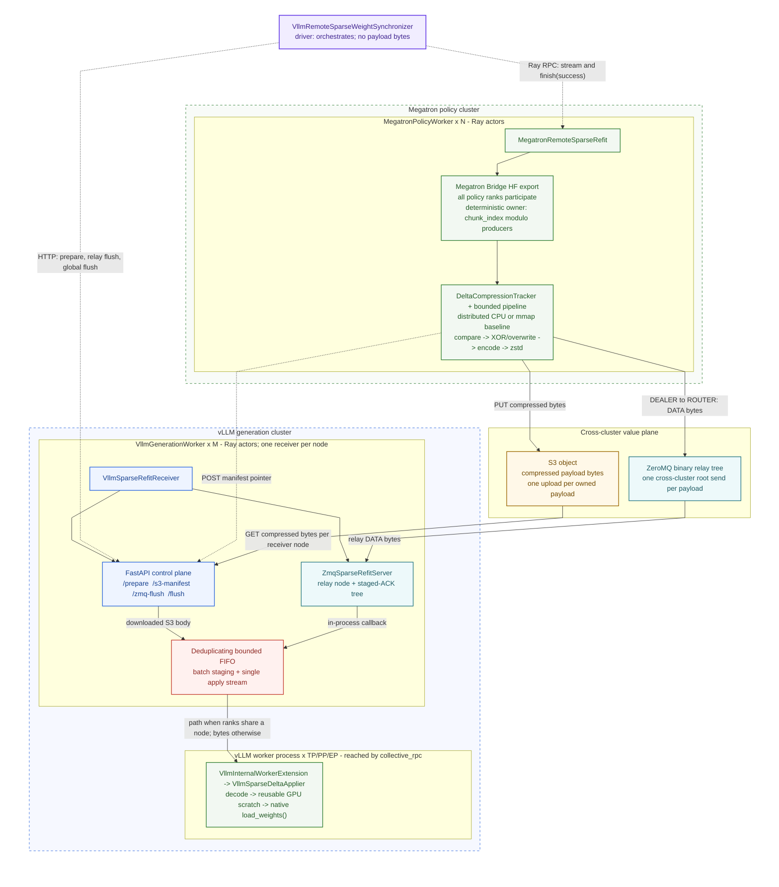
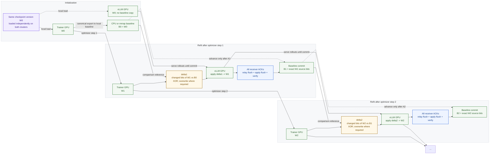
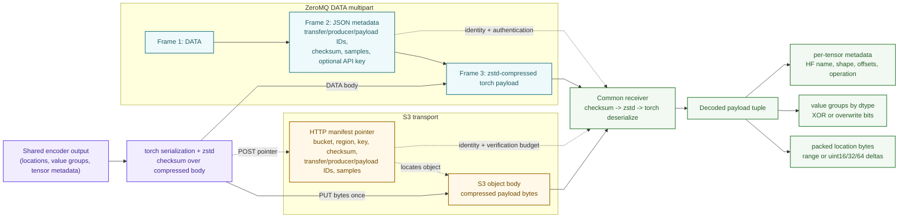

# Remote Sparse-Delta vLLM Refit

Remote sparse refit updates non-colocated vLLM workers without transferring a
full checkpoint after every optimizer step. Megatron Bridge exports canonical
Hugging Face (HF) tensors, and the policy workers compare their assigned export
chunks against one distributed canonical CPU baseline. S3 and ZeroMQ share the
codec, streaming pipeline, receiver, native-loader apply path, and commit
protocol.

The feature is opt-in and does not change existing NCCL, CUDA IPC, or packed
refit behavior.

## Supported scope

Remote sparse refit requires:

- a non-colocated Megatron policy and vLLM generation backend;
- the same initial HF checkpoint on both clusters;
- BF16 or FP16 unquantized rollout weights;
- `kv_cache_dtype: auto`; and
- `refit_transport: vllm_s3_sparse` or `vllm_zmq_sparse`.

Validation rejects `quant_cfg`, `real_quant`, colocated or non-Megatron
deployments, FP8 rollout weights, and FP8 KV-cache scales. The codec and
overwrite apply path retain FP8 bit patterns, but they do not generate block
scales or KV-cache scales, so that alone is not end-to-end FP8 support.
Synchronous and asynchronous vLLM engines are supported, but the weight-version
transition remains synchronous: generation pauses until every payload is
applied and the global flush completes.

The coordinator is currently integrated only with GRPO. PPO and distillation
reject `refit_transport` during setup; extending them is tracked in
[#3275](https://github.com/NVIDIA-NeMo/RL/issues/3275).

## Architecture



*Figure 1. Dashed links are control messages or S3 pointers; solid links carry
payload bytes or invoke the node-local apply path. Amber components are S3,
teal components are ZeroMQ, and both transports share the sender pipeline,
receiver queue, native-loader apply path, verification, and baseline commit.*

| Path | Cross-cluster transfer | Receiver handoff |
|---|---|---|
| S3 | One object upload per owned payload; each receiver gets a small manifest pointer and downloads the object | FastAPI callback -> deduplicating FIFO -> `collective_rpc` |
| ZeroMQ | One producer-to-root DATA send followed by binary-tree relay fanout | In-process relay callback -> the same FIFO -> `collective_rpc` |
| Within one node | No S3 or ZeroMQ hop | Staged path when ranks share storage; serialized bytes otherwise; no CUDA IPC |

| Responsibility | Implementation |
|---|---|
| Coordinate one transfer and commit | [`vllm_remote_sparse_weight_synchronizer.py`](../../nemo_rl/weight_sync/vllm_remote_sparse_weight_synchronizer.py) |
| Export canonical tensors and own the source tracker | [`megatron_remote_sparse_refit.py`](../../nemo_rl/models/policy/workers/megatron_remote_sparse_refit.py) |
| Track baselines and encode deltas | [`weight_transfer_sparse_codec.py`](../../nemo_rl/utils/weight_transfer_sparse_codec.py) |
| Run the shared pipeline and S3 transport | [`weight_transfer_stream.py`](../../nemo_rl/utils/weight_transfer_stream.py) |
| Share HTTP control-plane utilities | [`weight_transfer_http.py`](../../nemo_rl/utils/weight_transfer_http.py) |
| Run the ZeroMQ transport and relay | [`weight_transfer_zmq.py`](../../nemo_rl/utils/weight_transfer_zmq.py) |
| Queue receiver work and expose endpoints | [`vllm_sparse_refit.py`](../../nemo_rl/models/generation/vllm/vllm_sparse_refit.py) |
| Apply canonical updates through native loaders | [`vllm_sparse_delta.py`](../../nemo_rl/models/generation/vllm/vllm_sparse_delta.py) |

The baseline advances only after the receiver version is globally committed:



*Figure 2. One refit follows each configured training cadence, but only changed
canonical bytes cross the refit value plane. No full checkpoint is transferred
by this protocol at initialization or periodically. Every policy rank still
participates in the intra-cluster Megatron Bridge export.*

## Protocol

### Baseline and ownership

The policy initialization task starts baseline construction as soon as its
workers are ready, while the independent vLLM model load continues.
`VllmRemoteSparseWeightSynchronizer.init_communicator()` discovers the receiver
endpoints and then joins the prelaunched baseline before setup returns. The
first rollout therefore does not enter a redundant weight sync or race an
unfinished snapshot with policy training.

Every policy rank participates in Megatron Bridge's normal
`export_hf_weights()` conversion. The bounded output chunks are assigned by
`chunk_index % shard_count`, so only one producer snapshots, compares, encodes,
and sends each canonical chunk. Across all producers, persistent baseline
storage is approximately one full HF checkpoint, not one copy per producer.
Skipped chunks are still produced transiently because Bridge collectives and
conversion must run on every participating rank.

Ownership is deterministic for a fixed canonical export order, tensor shapes,
export chunk limit, and producer count. It is recomputed rather than stored in a
manifest, so changing any of those inputs can move a chunk to another producer;
within one transfer, every chunk still has exactly one owner.

This deliberately keeps one representation and one tracker. There is no MCore
policy-local baseline, conversion-task detector, affine projection, stable-name
residual partition, or model-specific mapping logic in NeMo RL. QKV, MoE,
Mamba, padded or tied weights, grouped exports, adapters, and custom Bridge
postprocessing all follow Bridge's canonical export semantics.

Baselines use file-backed `torch.from_file` tensors by default;
`refit_cfg.sparse.baseline.in_memory: true` keeps them in RAM. File backing
reduces anonymous resident-memory pressure but does not reduce logical baseline
bytes.

Baseline initialization also returns each canonical tensor's name, shape, and
dtype. The synchronizer merges that metadata and asks every vLLM worker to
reserve one reusable GPU byte buffer large enough for the largest canonical
tensor. This does not export HF values or mutate vLLM weights, and it removes
scratch allocation from the first timed refit.

On a fresh run, vLLM already holds the shared checkpoint, so the redundant
initial full sync is skipped. On resume, both clusters must still start from
the same HF weight version; sparse refit does not reconstruct a rollout
baseline from an arbitrary training checkpoint.

### Compare and encode

Each producer compares only its assigned canonical export chunks bytewise
through an integer view with the same element width. The payload contains only
changed locations and values. Let `H` be the full canonical checkpoint bytes,
`W` the producer count, and `s` the changed element fraction. Aggregate
persistent baseline, comparison, and wire volumes are approximately:

```text
per-producer baseline and compare ~= H / W
aggregate baseline and compare    = H
aggregate wire                    = codec_metadata + changed_indices + sH
```

The unavoidable leading cost is still `Bridge_export(H)`: every rank must
participate in TP/EP gathers, PP communication, and conversion before chunk
ownership can discard unassigned output. Sparse refit therefore makes wire and
receiver work proportional to `s`, but not Bridge export communication. The
reported changed percentage is computed once from the assigned canonical chunks
and aggregated across producers.

`DeltaCompressionTracker` finds changed flat locations through the equal-width
integer view. During receiver prewarm, the generic apply context observes each
native loader's tensor copies. A name remains XOR-compatible only when every
source is a same-dtype view of the canonical scratch storage and destination
copies do not overlap. The receiver returns the union of incompatible names;
the producer emits XOR for all other names and absolute overwrite values for
that opaque set. This runtime classification contains no model-family or tensor
layout rules. The pending source baseline always records the exact new source
bits regardless of the wire operation.

The producer pulls bounded export chunks and compares them in parallel. A
separate bounded stage coalesces encoded chunks up to
`sparse_bucket_size_bytes`, serializes them, and applies zstd level 1 before the
transport executor. The measured S3 default keeps 64 MiB compare chunks smaller
than the recommended 512 MiB wire bucket, preserving D2H/scan parallelism while
reducing object and manifest count. ZeroMQ retains 256 MiB export chunks and
uses the same 512 MiB wire-bucket default, producing 482 payloads across the
current 32-producer topology while tree delivery overlaps later export chunks.

Payload N can transfer while later chunks are compared and encoded. Source
baselines do not commit until the complete transfer and all transport and
receiver completion barriers succeed. Pipeline errors cancel outstanding local
futures and propagate to the synchronizer.

### Transport and apply

| Property | S3 | ZeroMQ |
|---|---|---|
| Value plane | AWS CRT multipart `PUT_OBJECT` | DEALER to ROUTER relay |
| Producer completion | HTTP object manifest accepted by every receiver | Relay registers payload and returns a staged ACK |
| Retry identity | Object key + checksum | Transfer + producer + payload IDs + checksum |
| Completion barrier | Receiver flush | Relay-tree flush, then receiver flush |
| Cleanup | Delete after receiver replies; retry leftovers at stream end | Close producer sockets after sends; seal the transfer at flush |

S3 uses 64 MiB multipart parts, a 2 GiB CRT client memory limit, and a 10 Gbps
throughput target. ZeroMQ assigns each producer to one inference-cluster relay.
That root applies the payload locally and forwards it through a balanced binary
relay tree, so each payload crosses the inter-cluster boundary once rather than
once per generation replica. The relay calls the same receiver decode/apply
queue as S3 directly, without a loopback HTTP data hop.

Each ZeroMQ relay validates and deduplicates `(transfer_id, producer_id,
payload_id)`, submits its local apply and at most two child forwards to bounded
executors, and acknowledges once that work is registered. The producer can then
export and send later payloads while earlier tree delivery continues. After
every producer finishes, the synchronizer calls `/nemo-rl/refit/zmq-flush` on
all relays and checks that their staged payload count matches the
producer-reported payload total. Only after all tree and apply futures succeed
does it call the normal receiver flush. Tree delivery therefore overlaps the
producer stream, but its remaining tail is still on the final critical path.

The generic streamer accepts a `SparseRefitTransport` with `send()` and
`cleanup()` methods. It owns export, compare, encode, serialization,
backpressure, timing, and transfer concurrency. S3 and ZeroMQ only construct
their transport state and call that streamer. Cleanup runs on each transfer
worker after all sends finish, so failed S3 deletion retries and ZeroMQ socket
closure occur on the same worker that created the resource.

The receiver deduplicates payload identities and applies bounded batches on one
FIFO worker thread. Each generation replica downloads a transport payload once.
When its vLLM ranks share a node, the compact serialized payload is written
directly under `/dev/shm` as soon as it arrives, without waiting for the batch
to fill. Staging futures feed the serial collective apply worker, so download,
decompression, staging, and earlier GPU applies can overlap. Queue depth limits
submitted work to 32 batches by default; with batches of eight, that is roughly
256 payloads plus the current partial batch.

Locations use `int32` unless a single canonical tensor exceeds the signed
32-bit index range; values remain grouped by dtype. For shared-node workers the
collective RPC passes only staged file paths, and each rank uses
`torch.load(..., mmap=True)`. The mmap is not a second baseline: it lets ranks
share the compact payload's page cache instead of materializing independent CPU
copies. Each worker decodes locations lazily while feeding the native loader.
When ranks do not share a node, the receiver sends the same serialized bytes
through one collective RPC and each worker decodes its copy.

There is deliberately no TP/EP source plan. Every vLLM worker sees canonical
sparse entries, scatters them into its reusable dense source buffer, and calls
the model's native `load_weights()`. Native loaders own QKV, MoE, Mamba, TP, and
EP placement; NeMo RL stores no route model or family-specific placement
formulas and does not patch vLLM. This trades canonical-tensor scratch
initialization and duplicated sparse H2D across ranks for independence from vLLM
internals. Measure that cost on the target TP/EP topology; H2D no longer scales
only with the worker-local sparse subset.

During the untimed metadata prewarm, one no-op native-loader pass records names
that issue no model-storage copy on a fixed rank and identifies loaders for
which XOR cannot preserve copy semantics. Later refits skip rank-local names
that the loader explicitly omitted and use overwrite for the incompatible
union. The cache contains names only; it stores no placement offsets, tensor
routes, or model-family rules.

For ZeroMQ, the relay flush first drains every staged tree delivery. The final
`/nemo-rl/refit/flush` then drains every receiver batch, synchronizes CUDA, and
checks optional delta samples. Only after both barriers succeed does the source
commit exact pending baseline bits in background CPU threads.

> **Failure boundary:** source baseline commit is transactional, but receiver
> writes are in place and are not rolled back. If a transfer fails after a
> receiver accepts any payload, reload that receiver from a known-good weight
> version before retrying. This is mandatory for XOR, because replaying an
> already-applied XOR reverts those bits. Replaying overwrite is safe.
> The synchronizer records this state as poisoned and rejects subsequent syncs
> with recovery instructions. In-place recovery is tracked in
> [#3274](https://github.com/NVIDIA-NeMo/RL/issues/3274).

## Payload and native apply

Each serialized payload is:

```text
(packed_location_bytes, packed_value_groups, tensor_metadata)
```



*Figure 3. S3 separates the object body from its control-plane manifest;
ZeroMQ carries equivalent identity and body data as multipart frames. Both
decode into the same codec tuple.*

Contiguous locations use a range encoding. Other sorted locations are
delta-encoded into the smallest lossless unsigned width among 16, 32, and 64
bits. Metadata carries the HF name and shape, dtype, value offsets, location
encoding, XOR or overwrite operation, and optional verification sample budget.

HF coordinates are the canonical wire format because Megatron Bridge defines
the training-to-HF mapping while vLLM owns the packed and sharded destination.
For each item, the receiver resets its resident largest-tensor scratch buffer,
scatters sparse values, and calls the model's native `load_weights()`.

A storage-scoped PyTorch dispatch mode changes only copies into model parameter
or buffer storage; it never encodes QKV, MoE, Mamba, TP, or EP geometry. For
XOR, unchanged scratch bits are zero and target copies become bitwise XOR. The
source must remain a view of scratch storage, dtypes must match, and overlapping
destination copies fail closed. For overwrite, unchanged entries are NaN
sentinels. The dispatch mode propagates the first sparse mask through subsequent
native copies and writes only selected destination entries. It keeps no target
backup because a partial batch already requires receiver reload. This supports
native pointwise transforms and dtype casts without model-specific formulas.
One-byte FP8 overwrite uses an exact bit sentinel and therefore requires a
non-transforming loader; end-to-end quantized rollout refit remains out of
scope.

Native-loader return values distinguish an explicit skip from an unsupported
apply. An empty loaded set is accepted, matching vLLM's handling of pipeline or
expert ownership and checkpoint-only parameters such as inactive MTP weights.
Loader exceptions propagate. A loader that reports a weight loaded without a
supported target copy fails closed. There is no layout fallback, cached loader
trace, or route model. NeMo RL's only integration point is the native model's
public `load_weights()` behavior.

## Configuration

Configure the feature under `policy.generation`:

```yaml
policy:
  generation:
    backend: vllm
    refit_transport: vllm_s3_sparse  # or vllm_zmq_sparse
    refit_cfg:
      sparse:
        delta_compression:
          encoding: xor  # overwrite is selected automatically for opaque loaders
        storage:
          s3_bucket: my-refit-bucket  # required only for vllm_s3_sparse
          s3_region: us-east-1
        baseline:
          in_memory: false
        verify_samples_per_payload: 0
    colocated:
      enabled: false
    vllm_cfg:
      async_engine: false  # true is also supported
      precision: bfloat16
      kv_cache_dtype: auto
      http_refit_api_key_env_var: NRL_REFIT_API_KEY
      http_refit_server_port: 8081
      zmq_refit_server_port: null
```

`refit_cfg.sparse` is optional; its Pydantic model resolves and logs all
defaults. S3 fails during setup unless
`refit_cfg.sparse.storage.s3_bucket` is nonempty. Its region and key prefix
default to `us-east-1` and `nemo-rl-refit`. ZeroMQ requires
routable TCP access to the relay port. The HTTP and ZeroMQ servers are
plaintext, so use a trusted or encrypted network. When
`http_refit_api_key_env_var` is set, the named variable must contain the same
nonempty token on producers and receivers. Binding either server to all
interfaces without a key emits a warning.

| Control | Default |
|---|---:|
| `refit_cfg.sparse.delta_compression.encoding` | `xor` |
| `refit_cfg.sparse.storage.s3_bucket` | none; required for S3 |
| `refit_cfg.sparse.storage.s3_region` | `us-east-1` |
| `refit_cfg.sparse.baseline.in_memory` | `false` |
| `refit_cfg.sparse.verify_samples_per_payload` | `0` |

Export chunks are capped by `sparse_bucket_size_bytes` and the packed tensor
limit. The S3 defaults were selected by balanced 120B sweeps. Increase one
concurrency control at a time; excess parallelism moves the bottleneck into
host memory, Bridge export, relay-tree forwarding, or receiver apply.

Run the checked-in ZeroMQ recipe with:

```bash
uv run python examples/run_grpo.py \
  --config examples/configs/recipes/llm/grpo-qwen3-30ba3b-4n8g-megatron-zmq-deltaweight-noncolocated.yaml
```

For a diagnostic run, enable bounded transmitted-delta sampling through the
logged config:

```bash
uv run python examples/run_grpo.py \
  --config examples/configs/recipes/llm/grpo-qwen3-30ba3b-4n8g-megatron-zmq-deltaweight-noncolocated.yaml \
  policy.generation.refit_cfg.sparse.verify_samples_per_payload=32
```

## Metrics and profiling

| Signal | Meaning |
|---|---|
| `REFIT_BASELINE_INIT` | Baseline export and snapshot time |
| `REFIT_RECEIVER_PREWARM` | GPU scratch reservation and rank-local native skip discovery |
| `REFIT_{S3,ZMQ}_TIMING` | Producer wall time, stage service times, payloads, bytes, and density |
| `REFIT_{S3,ZMQ}_DELTA_CHANGE` | Global changed and total element counts |
| `REFIT_RECEIVER_TIMING` | Receiver staging span/wait, batches, apply, and verification |
| `REFIT_{S3,ZMQ}_DELTA_VERIFY` | Sampled transmitted-delta accuracy |
| `REFIT_ZMQ_RELAY_FLUSH` | Relay-flush wall time and aggregate fanout service time |
| `REFIT_{S3,ZMQ}_GLOBAL_COMMIT` | Successful global flush |

`total_s` is producer wall time. Stage fields such as `encode_s`, `s3_put_s`,
and `zmq_send_s` are sums across concurrent tasks and can exceed `total_s`; do
not add them as serial phases. Receiver responses also expose node
decode/staging, worker deserialization, and native-loader apply time. These are
concurrent sums as well, so compare them with receiver wall time rather than
adding them. `refit/transfer/relay_flush_s` is the coordinator's ZeroMQ flush
wall time; `fanout_service_s` is an aggregate concurrent service sum.

Chunk counts include every canonical export chunk; changed and total elements
include only the chunks assigned to that producer. Synchronizer metrics appear
under `refit/delta/*`, `refit/delta_verify/*`, and `refit/transfer/*` in W&B and
other configured loggers. End-to-end latency is
`timing/train/prepare_for_generation/transfer_and_update_weights`.

Nsight ranges cover baseline creation, policy streaming, and vLLM sparse apply.
Relevant thread names start with `nrl-refit-`, `nrl-zmq-`, or
`nrl-vllm-sparse-refit`.

## Development and validation

Keep transport changes behind the shared `stream_sparse_delta_payloads()`
pipeline. A `SparseRefitTransport` provides `name`, `transfer_workers`,
`send(body, payload_id, verification_candidates)`, and worker-local `cleanup()`
only; it must not
duplicate export, baseline tracking, encoding, backpressure, receiver queue, or
apply logic. Retries must preserve payload identity and bytes, fan out to every
required replica, and require a successful global flush before source commit.
Never retry XOR after an uncertain or partial receiver apply.

Do not add model-specific placement math or a persistent placement cache. New
layouts must work through their native vLLM weight loader and the generic
storage-scoped operation context. Tests should cover split, merged, transposed,
overlapping, transformed, skipped, and dtype-cast copy behavior without naming
model families. FP8 bit overwrite, contiguous ranges, and explicit locations
also require coverage. Unknown names, transformed XOR, and overlapping XOR
copies must fail closed.

Codec changes must update encoder and decoder together, preserve 64-bit-safe
locations, and commit exact source bits only after global success. Receiver
changes must preserve FIFO application, bounded memory, error propagation,
flush, CUDA synchronization, and clean shutdown.

Do not reintroduce an MCore-local baseline, Bridge mapping duplication, or
model-family projection formulas. Tests must cover complete canonical export,
deterministic chunk ownership, transactional baseline updates, transport
cleanup on success and failure, and unchanged producer/receiver overlap. Do not
modify Megatron Bridge for a transport-specific hook.

On the target topology, verify the exact commit, image digest, and checkpoint
revision; validate fresh starts and same-version resumes; compare two balanced
repetitions with an equivalent NCCL or full control; and require the requested
changed density, one global commit, no traceback, and zero sampled mismatches.
After failure injection, confirm that the source baseline does not commit and
reload the receiver before retrying.

## Refit bandwidth calculator

[`refit_bandwidth_calculator.py`](../../tools/refit_bandwidth_calculator.py) is a
projection of the latest zstd S3 and ZeroMQ measurements against a measured
H100 NCCL envelope. It is not a general fabric or topology simulator.

The sparse side uses the current 247.2 GB canonical-HF XOR results with a
512 MiB sparse bucket. Both S3 and ZeroMQ have matched measured 3% and 5%
anchors. End-to-end time and wire bytes scale linearly by indexed model bytes.
Other model sizes and densities outside the measured points are explicit
projections. Because the sparse values are end-to-end measurements rather than
a link model, `--candidate-ethernet-gbps` does not rescale S3 or ZeroMQ. Text
output reports the 512 MiB calibration, and JSON includes
`sparse_bucket_size_bytes: 536870912`.

| Transport | 3% | 5% |
|---|---:|---:|
| S3 | 20.234 s measured | 25.790 s measured |
| ZeroMQ tree fanout | 24.095 s measured | 33.776 s measured |

The measured anchors already include full Bridge export on every participating
rank, deterministic chunk ownership, one aggregate checkpoint-sized canonical
comparison across producers, transport work, and all completion barriers.
Do not multiply comparison bytes by the producer count. The ZeroMQ anchor also
includes its staged-ACK tree flush; the calculator does not model relay
forwarding as an independent bandwidth term.

The NCCL side interpolates `_NCCL_ANCHORS` in log model-size space. Those
anchors were measured at 400 Gbps per rank and are projected onto the requested
Ethernet rate as:

```text
T_ethernet = T_H100_IB * 400 / candidate_ethernet_gbps
```

`--candidate-ethernet-gbps` is raw bandwidth per rank, not aggregate node or
cluster bandwidth. This makes NCCL and candidate Ethernet refer to the same
per-rank link while leaving the independently measured sparse path unchanged.

```bash
uv run python tools/refit_bandwidth_calculator.py \
  --model-size-gb 247.2 \
  --changed-pct 3 \
  --candidate-ethernet-gbps 25
```

The output reports the reference and projected NCCL envelopes, sparse latency,
estimated wire bytes, and per-rank Ethernet crossover. Below the lower
crossover sparse refit beats the complete NCCL envelope; above the upper
crossover NCCL wins; between them the measured range has no single winner.
`--json` emits the same fields for scripts.

The production transport applies zstd level 1 to every payload, so the
calculator intentionally has no synthetic raw-compression arm. Treat every
model size other than 247.2 GB, density outside 3%-5% for either transport, and
any different topology or parallel mapping as a projection rather than a
performance claim.

## Failure guide

| Symptom | Action |
|---|---|
| Baseline is missing a tensor | Check baseline completion, checkpoint equality, and Bridge name mappings. |
| No refit endpoint is found | Check worker startup, fixed ports, routing, and network policy. |
| Every worker reports a tensor unloaded | Verify the canonical HF name and native loader; do not add placement formulas. |
| A payload ID is reused with different bytes | Start a new transfer or resend the original payload unchanged. |
| Changed percentage rises unexpectedly | Correlate `DELTA_CHANGE` with `GLOBAL_COMMIT` and baseline commit completion. |
| Apply queue stalls | Inspect receiver timing; reduce producer or relay concurrency. |
| A transfer fails after payload acceptance | Reload the receiver from a known-good checkpoint before retrying. |
