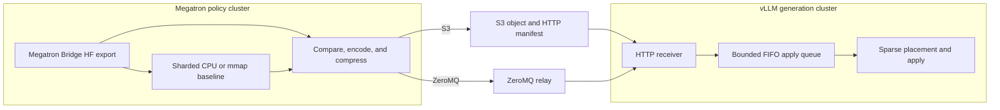

# Remote Sparse-Delta vLLM Refit

Remote sparse-delta refit updates non-colocated vLLM workers without sending a
full checkpoint after every optimizer step. Megatron workers export Hugging
Face (HF) weights, compare them with a sharded CPU baseline, and send changed
locations and deltas through S3 or ZeroMQ. vLLM maps those HF coordinates into
its local TP and EP layouts and applies the updates in place.

The feature is opt-in. Its synchronizer, codec, transports, receiver queue, and
placement engine are separate from existing NCCL, CUDA IPC, and packed refit
paths.

## Supported scope

Remote sparse refit requires:

- a non-colocated Megatron policy and vLLM generation backend;
- the same initial HF checkpoint on both clusters;
- BF16 or FP16, unquantized rollout weights;
- `kv_cache_dtype: auto`; and
- a `delta_compression` configuration.

Configuration validation rejects FP8 weights, FP8 KV-cache scales,
`quant_cfg`, `real_quant`, colocated inference, and non-Megatron policies.
Synchronous and asynchronous vLLM engines are supported, but the weight-version
transition is synchronous: generation pauses until all payloads are applied and
the global flush completes.

## Architecture



*Figure 1. S3 and ZeroMQ share the exporter, codec, receiver, placement engine,
and commit protocol.*

| Responsibility | Implementation |
|---|---|
| Coordinate one transfer and commit | [`vllm_remote_sparse_weight_synchronizer.py`](../../nemo_rl/weight_sync/vllm_remote_sparse_weight_synchronizer.py) |
| Adapt Megatron workers | [`megatron_remote_sparse_refit.py`](../../nemo_rl/models/policy/workers/megatron_remote_sparse_refit.py) |
| Track baselines and encode deltas | [`weight_transfer_sparse_codec.py`](../../nemo_rl/utils/weight_transfer_sparse_codec.py) |
| Run the shared pipeline and S3 transport | [`weight_transfer_remote_sparse.py`](../../nemo_rl/utils/weight_transfer_remote_sparse.py) |
| Run the ZeroMQ transport and relay | [`weight_transfer_zmq.py`](../../nemo_rl/utils/weight_transfer_zmq.py) |
| Queue receiver work and expose endpoints | [`vllm_sparse_refit.py`](../../nemo_rl/models/generation/vllm/vllm_sparse_refit.py) |
| Map HF coordinates into vLLM tensors | [`vllm_sparse_delta.py`](../../nemo_rl/models/generation/vllm/vllm_sparse_delta.py) |

## Refit protocol

### Initialize the baseline

`VllmRemoteSparseWeightSynchronizer.init_communicator()` starts baseline
construction on every policy worker and then discovers the vLLM HTTP endpoints.
Each worker participates in the HF export but stores only chunks assigned by
`chunk_index % shard_count`. The baseline is therefore sharded across policy
workers. It uses file-backed `torch.from_file` tensors by default;
`NRL_REFIT_BASELINE_IN_MEMORY=1` keeps it in RAM.

On a fresh run, vLLM already holds the shared checkpoint. Baseline construction
starts early and can overlap initial generation, so the redundant initial full
sync is skipped. On resume, both clusters must still start from the same HF
weight version; sparse refit does not reconstruct a rollout baseline from an
arbitrary training checkpoint.

### Export and encode deltas

Every refit still traverses `MegatronBridge.export_hf_weights()`. Sharding the
baseline avoids duplicate baseline storage and payload production, but it does
not remove Bridge export or the full CPU comparison. Low changed density mainly
reduces encoded and transferred bytes.

For each assigned chunk, `DeltaCompressionTracker` finds changed flat
locations and encodes deltas in the configured dtype. The pending baseline is
updated to the value the receiver will hold after wire-dtype rounding:

```text
expected = previous_baseline + delta.to(baseline_dtype)
```

The producer overlaps export, encoding, `torch.save` serialization, zstd level
1 compression, and transfer with fixed-size executors. Source baselines do not
commit until the entire transfer succeeds.

### Transfer and apply

| Behavior | S3 | ZeroMQ |
|---|---|---|
| Value plane | AWS CRT `PUT_OBJECT` | DEALER to ROUTER relay |
| Receiver notification | HTTP object manifest | Relay HTTP fanout |
| Retry identity | Object key and checksum | Transfer, producer, payload IDs, and checksum |
| Lifetime | Delete after all receivers respond | No persistent object |

S3 uses 64 MiB multipart parts, a 2 GiB client memory limit, and a 10 Gbps CRT
throughput target. ZeroMQ assigns each producer to one relay; that relay fans
the compressed payload out to every generation replica. Both transports use
the same receiver endpoints and checksum validation.

The receiver deduplicates payload identities, batches them in a bounded FIFO
queue, and applies batches on one worker thread. When all vLLM ranks share a
node, payloads are staged under `/dev/shm` and passed to collective RPC by file
path. Otherwise, the serialized batch is sent through one collective RPC.

The final `/nemo-rl/refit/flush` drains the queue, synchronizes CUDA, and checks
optional delta samples. Only then does the source commit pending baseline
updates in background CPU threads.

> **Failure boundary:** source baseline commit is transactional, but receiver
> updates are in place and are not rolled back. If a transfer fails after a
> receiver accepts any payload, reload that receiver from a known-good weight
> version before retrying.

## Payload and placement

Each serialized payload is:

```text
(packed_location_bytes, packed_delta_values, tensor_metadata)
```

Contiguous locations use a range encoding. Other sorted locations are
delta-encoded into the smallest lossless unsigned width among 16, 32, and 64
bits. Metadata carries the HF name and shape, value offsets, location encoding,
and optional verification samples.

HF coordinates are the canonical wire format because Megatron Bridge already
defines the training-to-HF mapping while vLLM owns a different packed and
sharded layout. On first use, the receiver runs vLLM's native `load_weights()`
against metadata-only tensors while a PyTorch dispatch mode records the source
and destination views of each `copy_`. It caches those mappings and applies
later sparse deltas directly with `index_add_`, without materializing a dense HF
tensor or duplicating QKV, MoE, Mamba, or TP placement rules.

The tracer accepts affine tensor views and the Mamba `A_log` transform. An
element-expanding copy, unknown transform, or unplaced
non-expert tensor fails before any payload update. There is no dense fallback
for an unknown layout.

## Configuration

Configure the feature under `policy.generation`:

```yaml
policy:
  generation:
    backend: vllm
    refit_transport: vllm_s3_sparse  # or vllm_zmq_sparse
    delta_compression:
      dtype: bf16
      sparse_bucket_size_bytes: 268435456
    colocated:
      enabled: false
    vllm_cfg:
      async_engine: false  # true is also supported
      precision: bfloat16
      kv_cache_dtype: auto
      http_refit_api_key_env_var: NRL_REFIT_API_KEY
      http_refit_server_port: 8081
      zmq_refit_server_port: null
```

S3 requires `NRL_REFIT_S3_BUCKET`; region and key prefix default to
`us-east-1` and `nemo-rl-refit`. ZeroMQ requires routable TCP access to the
relay port. The HTTP and ZeroMQ servers are plaintext, so use a trusted or
encrypted network. When `http_refit_api_key_env_var` is set, the named variable
must contain the same nonempty token on producers and receivers.

| Control | Default |
|---|---:|
| `NRL_REFIT_S3_EXPORT_CHUNK_BYTES` | 256 MiB |
| `NRL_REFIT_ZMQ_EXPORT_CHUNK_BYTES` | 1 GiB |
| `NRL_REFIT_{S3,ZMQ}_ENCODE_WORKERS` | 2-8 from CPU count |
| `NRL_REFIT_S3_UPLOAD_WORKERS` | 4-32 from CPU count |
| `NRL_REFIT_ZMQ_SEND_WORKERS` | 4 |
| `NRL_REFIT_ZMQ_RELAY_PAYLOAD_WORKERS` | 16 |
| `NRL_REFIT_ZMQ_RELAY_FANOUT_WORKERS` | 8-32 from replica count |
| `NRL_REFIT_APPLY_QUEUE_DEPTH` / `NRL_REFIT_APPLY_BATCH_SIZE` | 2 / 8 |
| `NRL_REFIT_{S3,ZMQ}_ZSTD_THREADS` | 0 |
| `NRL_REFIT_VERIFY_SAMPLES_PER_PAYLOAD` | 0 |

Export chunks are also capped by `sparse_bucket_size_bytes` and the packed
tensor limit. Increase one concurrency control at a time; excessive parallelism
can move the bottleneck into host memory, collective export, relay fanout, or
receiver apply.

## Metrics and profiling

| Signal | Meaning |
|---|---|
| `REFIT_BASELINE_INIT` | Baseline export and snapshot time |
| `REFIT_{S3,ZMQ}_TIMING` | Producer wall time, stage service time, payloads, bytes, and changed density |
| `REFIT_{S3,ZMQ}_DELTA_CHANGE` | Global changed and total element counts |
| `REFIT_RECEIVER_TIMING` | Receiver batches, apply time, and verification counts |
| `REFIT_{S3,ZMQ}_DELTA_VERIFY` | Sampled transmitted-delta accuracy |
| `REFIT_{S3,ZMQ}_GLOBAL_COMMIT` | Successful transfer flush |

`total_s` is producer wall time. Stage fields such as `encode_s`, `s3_put_s`,
and `zmq_send_s` are sums across concurrent tasks and can exceed `total_s`; do
not add them as serial phases.

The synchronizer returns metrics under `refit/delta/*`,
`refit/delta_verify/*`, and `refit/transfer/*` when GRPO logs them. These are
available to W&B and other configured loggers. End-to-end refit latency is
reported as `timing/train/prepare_for_generation/transfer_and_update_weights`.

For Nsight Systems, use the existing baseline, policy stream, and vLLM
sparse-apply NVTX ranges. Producer and receiver thread names begin with
`nrl-refit-`, `nrl-zmq-`, or `nrl-vllm-sparse-refit`.

## Development and validation

Keep transport changes behind the shared `stream_sparse_delta_payloads()`
pipeline. A transport should provide payload delivery and timing only; it must
not duplicate the baseline tracker, codec, receiver queue, or placement logic.
Retries must preserve payload identity and bytes, fan out to every required
replica, and require a successful global flush before baseline commit.

Do not add model-specific placement math. New layouts should work through their
native vLLM weight loader; extend the tracer only for a general loader operation
and fail closed for transformed or broadcasting copies. Tests must invoke the
real vLLM loader at nonzero TP ranks and cover replicated KV heads, packed
columns, local and remote experts, segmented views, contiguous ranges, and
explicit locations. Incorrect in-range `index_add_` locations silently corrupt
weights, so assert exact mapped indices and values.

Codec changes must update encoder and decoder together, preserve 64-bit-safe
locations, and retain wire-dtype rounding in pending baseline updates. Receiver
changes must preserve FIFO application, bounded memory, deferred-error
propagation, flush, CUDA synchronization, and clean shutdown.

Run the focused suite:

```bash
uv run --extra vllm pytest -q \
  tests/unit/utils/test_weight_transfer_remote_sparse.py \
  tests/unit/models/policy/test_megatron_remote_sparse_refit.py \
  tests/unit/models/generation/test_vllm_sparse_refit.py \
  tests/unit/weight_sync/test_vllm_remote_sparse_weight_synchronizer.py

uv run --extra vllm pytest -q -m vllm \
  tests/unit/models/generation/test_vllm_sparse_delta.py

uv run ruff check \
  nemo_rl/utils/weight_transfer_{remote_sparse,sparse_codec,zmq}.py \
  nemo_rl/models/generation/vllm/vllm_{sparse_refit,sparse_delta}.py \
  nemo_rl/weight_sync/vllm_remote_sparse_weight_synchronizer.py \
  tools/refit_bandwidth_calculator.py
```

On the target topology, verify the exact commit, image digest, and checkpoint
revision; validate fresh starts and same-version resumes; compare two balanced
repetitions with an equivalent NCCL or full control; and require the requested
changed density, one global commit, no traceback, and zero sampled mismatches.
After failure injection, confirm the source baseline does not commit and reload
the receiver before retrying.

## Refit bandwidth calculator

[`refit_bandwidth_calculator.py`](../../tools/refit_bandwidth_calculator.py) is a
benchmark-specific estimator for the current S3 and ZeroMQ implementation. It
is not a general fabric or topology model.

The sparse side embeds July 2026 end-to-end latency fits from 32 GB300 sender
GPUs in `us-east-2` to 64 H100 receiver GPUs in `us-east-1`. Measurements cover
63.2-1121.0 GB of indexed BF16 weights, S3 and ZeroMQ, raw and zstd payloads,
and 3% and 5% changed density. Any positive `--changed-pct` is accepted; values
outside 3-5% use an extrapolated power curve through the two measured-density
fits. Estimated wire bytes use the measured raw or zstd payload ratio.
The coefficients in `_SPARSE_LATENCY_FITS` implement
`fixed_seconds + seconds_per_1000_GB * model_size_GB / 1000`; they are latency
regressions, not bandwidth measurements.

The NCCL side uses these measured generation-EP H100 refit envelopes on 400
Gbps/rank InfiniBand:

| Indexed BF16 | NCCL refit envelope |
|---:|---:|
| 63.2 GB | 0.84-1.60 s |
| 247.2 GB | 1.46-1.74 s |
| 470.2 GB | 2.31-2.73 s |
| 1342.0 GB | 3.27-3.46 s |

The calculator interpolates these anchors in log model-size space, then
projects the full measured NCCL latency onto the candidate Ethernet rate:

```text
T_ethernet = T_H100_IB * 400 / candidate_ethernet_gbps
```

`--candidate-ethernet-gbps` is raw bandwidth per rank. It changes only the NCCL
projection; it does not rescale the measured S3 or ZeroMQ fit. Do not pass
aggregate node or cluster bandwidth.

```bash
uv run python tools/refit_bandwidth_calculator.py \
  --model-size-gb 247.2 \
  --changed-pct 3 \
  --compression zstd \
  --candidate-ethernet-gbps 25
```

The output reports the original H100 IB envelope, projected NCCL latency,
estimated sparse latency and wire bytes, and an Ethernet crossover range. Below
the lower crossover, sparse refit beats the complete NCCL envelope; above the
upper crossover, NCCL wins; between them, the measured NCCL range does not give
one winner. `--json` emits the same data for scripts.

The production transport currently applies zstd level 1 to every payload.
`--compression raw` selects a historical uncompressed benchmark fit for
analysis; it is not a runtime switch for the current transport. Treat model
sizes outside the measured range, changed densities outside 3-5%, and different
parallel mappings as experiment targets rather than performance claims.

## Failure guide

| Symptom | Action |
|---|---|
| Baseline is missing a tensor | Check baseline completion, checkpoint equality, and Bridge name mappings. |
| No refit endpoint is found | Check worker startup, fixed ports, routing, and network policy. |
| No direct target plan exists | Add and unit-test the layout; do not silently fall back to dense loading. |
| A payload ID is reused with different bytes | Start a new transfer or resend the original payload unchanged. |
| Changed percentage rises unexpectedly | Correlate `DELTA_CHANGE` with `GLOBAL_COMMIT` and baseline commit completion. |
| Apply queue stalls | Inspect receiver timing and reduce source or relay concurrency. |
| A transfer fails after payload acceptance | Reload the receiver from a known-good checkpoint before retrying. |
