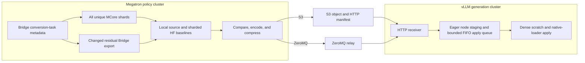

# Remote Sparse-Delta vLLM Refit

Remote sparse-delta refit updates non-colocated vLLM workers without sending a
full checkpoint after every optimizer step. Megatron workers compare every
uniquely owned MCore tensor against a policy-local CPU baseline. Exact affine
mappings emit sparse Hugging Face (HF) coordinates directly; only changed tasks
whose conversion is not affine traverse Megatron Bridge. S3 or ZeroMQ carries
the resulting payloads, and each native vLLM weight loader applies its canonical
HF update to the local TP or EP destination.

The feature is opt-in. Its synchronizer, codec, transports, receiver queue, and
native-loader apply engine are separate from existing NCCL, CUDA IPC, and
packed refit paths.

## Supported scope

Remote sparse refit requires:

- a non-colocated Megatron policy and vLLM generation backend;
- the same initial HF checkpoint on both clusters;
- BF16 or FP16, unquantized rollout weights;
- `kv_cache_dtype: auto`; and
- a `delta_compression` configuration.

Configuration validation rejects FP8 weights, FP8 KV-cache scales,
`quant_cfg`, `real_quant`, colocated inference, and non-Megatron policies.
Synchronous and asynchronous vLLM engines are supported, but the weight-version
transition is synchronous: generation pauses until all payloads are applied and
the global flush completes.

## Architecture



*Figure 1. S3 and ZeroMQ share the exporter, codec, receiver, native-loader
apply engine, and commit protocol.*

| Responsibility | Implementation |
|---|---|
| Coordinate one transfer and commit | [`vllm_remote_sparse_weight_synchronizer.py`](../../nemo_rl/weight_sync/vllm_remote_sparse_weight_synchronizer.py) |
| Adapt Megatron workers | [`megatron_remote_sparse_refit.py`](../../nemo_rl/models/policy/workers/megatron_remote_sparse_refit.py) |
| Track baselines and encode deltas | [`weight_transfer_sparse_codec.py`](../../nemo_rl/utils/weight_transfer_sparse_codec.py) |
| Run the shared pipeline and S3 transport | [`weight_transfer_remote_sparse.py`](../../nemo_rl/utils/weight_transfer_remote_sparse.py) |
| Run the ZeroMQ transport and relay | [`weight_transfer_zmq.py`](../../nemo_rl/utils/weight_transfer_zmq.py) |
| Queue receiver work and expose endpoints | [`vllm_sparse_refit.py`](../../nemo_rl/models/generation/vllm/vllm_sparse_refit.py) |
| Apply canonical updates through native loaders | [`vllm_sparse_delta.py`](../../nemo_rl/models/generation/vllm/vllm_sparse_delta.py) |

## Refit protocol

### Initialize the baseline

The policy initialization task starts baseline construction as soon as its
workers are ready, while the independent vLLM model load continues.
`VllmRemoteSparseWeightSynchronizer.init_communicator()` discovers the receiver
endpoints and then joins the prelaunched baseline before setup returns. The
first rollout therefore does not enter a redundant weight sync or race an
unfinished snapshot with policy training. Conversion tasks are split into two
deterministic paths without changing Megatron Bridge:

- Every conversion task keeps its source baseline in MCore layout. A stable name
  hash assigns replicated dense tensors across their combined DP/CP and TP
  replicas, and expert tensors across their expert-DP replicas. TP, PP, EP, and
  ETP still contribute their unique shards. This keeps exactly one source copy
  while sharing baseline scans and uploads across equivalent ranks.
- Exact direct, column, row, replicated, and gated mappings use that baseline
  to produce HF-coordinate deltas without Bridge export. The decision is based
  on the resolved Bridge mapping type, not a model name or weight suffix.
- Tasks with a transform also keep a canonical HF baseline, sharded across
  workers by a stable hash of the HF name. Stable ownership is required because
  later refits export only changed residual tasks and therefore have a different
  chunk sequence.

The local baselines contain one copy of each unique source element across the
policy workers, rather than a full HF copy per DP replica. Residual tasks have
one additional canonical HF copy distributed across the workers. Baselines use
file-backed `torch.from_file` tensors by default;
`NRL_REFIT_BASELINE_IN_MEMORY=1` keeps them in RAM. Local snapshotting and the
residual Bridge export run concurrently.

Baseline initialization also returns each canonical tensor's name, shape, and
dtype. The synchronizer merges that metadata and asks every vLLM worker to
reserve one reusable GPU byte buffer large enough for the largest canonical
tensor. This does not export HF values or mutate vLLM weights, and it removes
scratch allocation from the first timed refit.

On a fresh run, vLLM already holds the shared checkpoint. Baseline construction
starts early and can overlap initial generation, so the redundant initial full
sync is skipped. On resume, both clusters must still start from the same HF
weight version; sparse refit does not reconstruct a rollout baseline from an
arbitrary training checkpoint.

### Compare and encode deltas

Every uniquely owned local tensor is copied to CPU and compared bytewise. For
an affine mapping, changed flat locations are mapped into the unsharded HF
tensor using the TP or ETP rank, shard dimension, and EP-global expert number.
This covers more than FFNs: attention output projections, Mamba affine weights,
norms, routers, shared experts, and other exact mappings use the same path.

For non-affine tasks, one integer flag per conversion task is reduced across the
policy world. Bridge exports only globally changed tasks, after which the
canonical HF tracker computes the sparse payload. If one member of a grouped
export changes, the complete group is exported. A model-specific Bridge
postprocessor can have undeclared cross-task dependencies, so such bridges keep
the full residual task set whenever any residual task changes. Compound QKV,
Mamba packing, permutations, grouped or fused exports, padded or tied
embeddings, and other custom transformations therefore retain Bridge semantics.

Policy-local comparison removes full-tensor TP/EP gathers and PP broadcasts for
directly projectable weights, but comparison itself is still proportional to
model size: every unique local element is copied to CPU and scanned. Let `P` be
directly projectable bytes, `R` residual source bytes, `R_changed` the residual
HF tensors selected by the task flags, and `s` the element change fraction. The
leading work is approximately:

```text
old: Bridge(P + R) + HF D2H/scan(P + R) + wire(s(P + R))
new: local D2H/scan(P + R) + Bridge(R_changed) + HF scan(R_changed)
     + wire(s(P + R)) + one O(number_of_tasks) flag all-reduce
```

When Adam changes at least one element in every residual tensor,
`R_changed` approaches `R`; the gain then comes from removing Bridge work for
`P`, not from task filtering. It helps less when local D2H or CPU scanning is
the bottleneck, most bytes use custom transformations, or `s` is high. The
reported changed percentage is computed from unique policy-local source
elements, so the extra detector does not inflate it with a second HF scan.

For each assigned chunk, `DeltaCompressionTracker` finds changed flat
locations through an integer view with the same element width. It encodes
either the absolute new bits (`overwrite`) or new bits XOR baseline bits
(`xor`). Both encodings are dtype-blind and preserve FP8 bit patterns in
the codec, although end-to-end FP8 rollout refit is outside the supported scope.
`overwrite` is idempotent and recommended. `xor` can compress better, but it
requires an exact same-dtype receiver baseline and exactly-once application.
Selecting `xor` enables mixed operation: directly projected, bitwise-compatible
policy shards use XOR, while Bridge residuals and the full-HF compatibility
path use overwrite. A payload batch may therefore contain both operations. The
receiver validates direct-loader compatibility and fails closed on a transform,
dtype cast, or overlapping mapping; use `overwrite` for models with any such
direct loader. The pending source baseline always records the exact new source
bits.

The producer pulls bounded export chunks and compares them in parallel. A
separate bounded stage coalesces encoded chunks up to
`sparse_bucket_size_bytes`, serializes them, and applies zstd level 1 before the
transport executor. Separating the 256 MiB S3 compare chunk from the 1 GiB wire
bucket preserves D2H/scan parallelism while reducing object and manifest count.
The stages run concurrently, so payload N transfers while later chunks are
compared and encoded. Source baselines do not commit until the entire transfer
succeeds. Worker errors are reported only after every rank drains its Bridge
export iterator; stopping early can strand peers in a conversion collective.

### Transfer and apply

| Behavior | S3 | ZeroMQ |
|---|---|---|
| Value plane | AWS CRT `PUT_OBJECT` | DEALER to ROUTER relay |
| Receiver notification | HTTP object manifest | Relay HTTP fanout |
| Retry identity | Object key and checksum | Transfer, producer, payload IDs, and checksum |
| Lifetime | Delete after all receivers respond | No persistent object |

S3 uses 64 MiB multipart parts, a 2 GiB client memory limit, and a 10 Gbps CRT
throughput target. ZeroMQ assigns each producer to one relay; that relay fans
the compressed payload out to every generation replica. Both transports use
the same receiver endpoints and checksum validation.

The receiver deduplicates payload identities and applies bounded batches on one
FIFO worker thread. Each generation replica downloads a transport payload
once. When its vLLM ranks share a node, decode and flat-file staging under
`/dev/shm` begin as soon as each payload arrives, without waiting for the batch
to fill. Staging futures then feed the serial collective apply worker, so
download, decompression, staging, and earlier GPU applies can overlap. Queue
depth provides backpressure; the default depth and batch size bound the pending
window at 256 payloads.

Locations use `int32` unless a single canonical tensor exceeds the signed
32-bit index range; values remain grouped by dtype. The collective RPC passes
only file paths, and workers use `torch.load(..., mmap=True)`. The mmap is not
a second baseline: it lets colocated ranks share the staged file's page cache
instead of materializing independent CPU copies. The staged format flattens
locations into one `int32` and one `int64` tensor; it does not serialize one
tensor object per model parameter. If ranks do not share a node, the receiver
still decodes once and sends that flat representation through one collective
RPC.

There is deliberately no TP/EP source plan. Every worker sees the canonical
sparse entries, scatters them into its reusable dense source buffer, and lets
the native loader select the local destination. This removes persistent vLLM
placement knowledge from NeMo RL, at the cost of canonical-tensor GPU
initialization and duplicated sparse H2D across ranks. Measure that cost on the
target TP/EP topology; H2D no longer scales only with the worker-local sparse
subset.

During the existing untimed metadata prewarm, one no-op native-loader pass
records names that issue no model-storage copy on that fixed rank. Later refits
skip scratch construction for those explicit pipeline/expert/MTP skips. The
cache contains names only; it stores no placement offsets, tensor routes, or
model-family rules.

The final `/nemo-rl/refit/flush` drains the queue, synchronizes CUDA, and checks
optional delta samples. Only then does the source commit pending baseline
updates in background CPU threads.

> **Failure boundary:** source baseline commit is transactional, but receiver
> updates are in place and are not rolled back. If a transfer fails after a
> receiver accepts any payload, reload that receiver from a known-good weight
> version before retrying. This is mandatory for `xor`, because replaying an
> already-applied XOR reverts those bits. Replaying `overwrite` is safe.

## Payload and native apply

Each serialized payload is:

```text
(packed_location_bytes, packed_value_groups, tensor_metadata)
```

Contiguous locations use a range encoding. Other sorted locations are
delta-encoded into the smallest lossless unsigned width among 16, 32, and 64
bits. Metadata carries the HF name and shape, value offsets, location encoding,
the `xor` or `overwrite` operation, and an optional verification sample budget.

HF coordinates are the canonical wire format because Megatron Bridge defines
the training-to-HF mapping while vLLM owns the packed and sharded destination.
For each item, the receiver resets the resident largest-tensor scratch buffer,
scatters the sparse values, and calls the model's native `load_weights()`.
A storage-scoped PyTorch dispatch mode changes only copies into model parameter
or buffer storage; it never encodes QKV, MoE, Mamba, TP, or EP geometry.

For XOR, unchanged scratch bits are zero and target copies become bitwise XOR.
The source must remain a view of the scratch storage, dtypes must match, and
overlapping destination copies fail closed. For overwrite, unchanged entries
are NaN sentinels. The dispatch mode propagates the first sparse mask through
subsequent native copies and writes only selected destination entries. It keeps
only those entries for per-item rollback rather than cloning the full target.
This supports native pointwise transforms and dtype casts without model-specific
formulas. One-byte FP8 overwrite uses an exact bit sentinel and therefore
requires a non-transforming native loader; end-to-end quantized rollout refit
remains out of scope.

Native-loader return values distinguish an explicit skip from an unsupported
apply. An empty loaded set is accepted, matching vLLM's existing handling of
pipeline/expert ownership and checkpoint-only parameters such as inactive MTP
weights. Loader exceptions propagate. A loader that reports a weight loaded but
does not issue a supported target copy fails closed. There is no layout fallback
and no cached loader trace or route model. NeMo RL does not patch vLLM or encode
any vLLM layout: its only integration point is the model's public
`load_weights()` behavior.

## Configuration

Configure the feature under `policy.generation`:

```yaml
policy:
  generation:
    backend: vllm
    refit_transport: vllm_s3_sparse  # or vllm_zmq_sparse
    delta_compression:
      encoding: overwrite  # xor requires bitwise-compatible direct vLLM loaders
      sparse_bucket_size_bytes: 1073741824
    colocated:
      enabled: false
    vllm_cfg:
      async_engine: false  # true is also supported
      precision: bfloat16
      kv_cache_dtype: auto
      http_refit_api_key_env_var: NRL_REFIT_API_KEY
      http_refit_server_port: 8081
      zmq_refit_server_port: null
```

S3 requires `NRL_REFIT_S3_BUCKET`; region and key prefix default to
`us-east-1` and `nemo-rl-refit`. ZeroMQ requires routable TCP access to the
relay port. The HTTP and ZeroMQ servers are plaintext, so use a trusted or
encrypted network. When `http_refit_api_key_env_var` is set, the named variable
must contain the same nonempty token on producers and receivers.

| Control | Default |
|---|---:|
| `NRL_REFIT_S3_EXPORT_CHUNK_BYTES` | 256 MiB |
| `NRL_REFIT_ZMQ_EXPORT_CHUNK_BYTES` | 256 MiB |
| `NRL_REFIT_{S3,ZMQ}_ENCODE_WORKERS` | 2-8 from CPU count |
| `NRL_REFIT_S3_UPLOAD_WORKERS` | 4-32 from CPU count |
| `NRL_REFIT_ZMQ_SEND_WORKERS` | 4 |
| `NRL_REFIT_ZMQ_RELAY_PAYLOAD_WORKERS` | 16 |
| `NRL_REFIT_ZMQ_RELAY_FANOUT_WORKERS` | 8-32 from replica count |
| `NRL_REFIT_APPLY_QUEUE_DEPTH` / `NRL_REFIT_APPLY_BATCH_SIZE` | 32 / 8 |
| `NRL_REFIT_PARTITION_WORKERS` | 2-8 from CPU count |
| `NRL_REFIT_{S3,ZMQ}_ZSTD_THREADS` | 0 |
| `NRL_REFIT_VERIFY_SAMPLES_PER_PAYLOAD` | 0 |

Export chunks are capped by `sparse_bucket_size_bytes` and the packed tensor
limit, but they intentionally remain smaller than the recommended S3 wire
bucket. Increase one concurrency control at a time; excessive parallelism can
move the bottleneck into host memory, collective export, relay fanout, or
receiver apply.

## Metrics and profiling

| Signal | Meaning |
|---|---|
| `REFIT_BASELINE_INIT` | Baseline export and snapshot time |
| `REFIT_RECEIVER_PREWARM` | GPU scratch reservation and rank-local native skip discovery |
| `REFIT_{S3,ZMQ}_TIMING` | Producer wall time, stage service time, payloads, bytes, and changed density |
| `REFIT_{S3,ZMQ}_DELTA_CHANGE` | Global changed and total element counts |
| `REFIT_RECEIVER_TIMING` | Receiver staging span/wait, batches, apply time, and verification counts |
| `REFIT_{S3,ZMQ}_DELTA_VERIFY` | Sampled transmitted-delta accuracy |
| `REFIT_{S3,ZMQ}_GLOBAL_COMMIT` | Successful transfer flush |

`total_s` is producer wall time. Stage fields such as `encode_s`, `s3_put_s`,
and `zmq_send_s` are sums across concurrent tasks and can exceed `total_s`; do
not add them as serial phases. Receiver responses additionally expose node
decode/staging, worker deserialization, scratch preparation, and native-loader
apply time.
These are also concurrent sums; compare them with receiver wall time rather
than adding them. The `partition` field is `none` for uniquely owned
policy-local shards, `names` for stable name-sharded residual exports, and
`chunks` for the full-HF compatibility path.

Benchmark and profiler reports are dated artifacts under `profiles/`. They must
record the exact commit, image, topology, model revision, changed density,
payload settings, per-stage overlap, and sampled correctness. Do not copy an
older report's fitted values into this document as current results.

The synchronizer returns metrics under `refit/delta/*`,
`refit/delta_verify/*`, and `refit/transfer/*` when GRPO logs them. These are
available to W&B and other configured loggers. End-to-end refit latency is
reported as `timing/train/prepare_for_generation/transfer_and_update_weights`.

For Nsight Systems, use the existing baseline, policy stream, and vLLM
sparse-apply NVTX ranges. Producer and receiver thread names begin with
`nrl-refit-`, `nrl-zmq-`, or `nrl-vllm-sparse-refit`.

## Development and validation

Keep transport changes behind the shared `stream_sparse_delta_payloads()`
pipeline. A transport should provide payload delivery and timing only; it must
not duplicate the baseline tracker, codec, receiver queue, or apply logic.
Retries must preserve payload identity and bytes, fan out to every required
replica, and require a successful global flush before baseline commit. Never
retry XOR after an uncertain or partial receiver apply.

Do not add model-specific placement math or a persistent placement cache. New
layouts must work through their native vLLM weight loader and the generic
storage-scoped operation context. Tests should cover packed QKV/MLP columns,
local and remote experts, segmented Mamba views, native transforms, dtype casts,
FP8 bit overwrite, contiguous ranges, and explicit locations. Unknown names,
transformed XOR, and overlapping XOR copies must fail closed.

Codec changes must update encoder and decoder together, preserve 64-bit-safe
locations, and commit exact source bits only after global success. Receiver
changes must preserve FIFO application, bounded memory, deferred-error
propagation, flush, CUDA synchronization, and clean shutdown.

Every conversion task must remain represented by a unique local baseline unless
the complete policy-local path is disabled for FP8 parameters, quantization, or
custom FSDP. Those configurations retain the canonical full-HF baseline path.
Direct payload mappings must be rectangular affine shards of the exact HF
tensor. Tests must cover column and row offsets, gated splits, replicated
ownership, nonzero TP/ETP ranks, EP-global expert naming, DP/CP and expert-DP
ownership, transactional baseline updates, global changed-task agreement,
stable residual ownership under filtering, grouped-task expansion, and fallback
for transformed mappings. Do not infer an unknown mapping from its parameter
suffix, drop Bridge task dependencies, or modify Megatron Bridge to expose a
transport-specific hook.

Run the focused suite:

```bash
uv run --extra vllm pytest -q \
  tests/unit/utils/test_weight_transfer_remote_sparse.py \
  tests/unit/models/policy/test_megatron_remote_sparse_refit.py \
  tests/unit/models/generation/test_vllm_sparse_refit.py \
  tests/unit/weight_sync/test_vllm_remote_sparse_weight_synchronizer.py

uv run --extra vllm pytest -q -m vllm \
  tests/unit/models/generation/test_vllm_sparse_delta.py

uv run ruff check \
  nemo_rl/utils/weight_transfer_{remote_sparse,sparse_codec,zmq}.py \
  nemo_rl/models/generation/vllm/vllm_{sparse_refit,sparse_delta}.py \
  nemo_rl/weight_sync/vllm_remote_sparse_weight_synchronizer.py \
  tools/refit_bandwidth_calculator.py
```

On the target topology, verify the exact commit, image digest, and checkpoint
revision; validate fresh starts and same-version resumes; compare two balanced
repetitions with an equivalent NCCL or full control; and require the requested
changed density, one global commit, no traceback, and zero sampled mismatches.
After failure injection, confirm the source baseline does not commit and reload
the receiver before retrying.

## Refit bandwidth calculator

[`refit_bandwidth_calculator.py`](../../tools/refit_bandwidth_calculator.py) is a
calibrated comparison of the checked-in S3 and ZeroMQ measurements against a
measured H100 NCCL envelope. It is not a general fabric or topology simulator.

The sparse side evaluates the latency fits in `_SPARSE_LATENCY_FITS` for the
requested model size, transport, compression, and any positive
`--changed-pct`. The 3% and 5% fits are measured calibration points; other
densities are explicit extrapolations. The coefficients model end-to-end
latency, not transport bandwidth, so `--candidate-ethernet-gbps` does not
rescale S3 or ZeroMQ.

The NCCL side interpolates `_NCCL_ANCHORS` in log model-size space. Those
anchors were measured at 400 Gbps per rank and are projected onto the requested
Ethernet rate as:

```text
T_ethernet = T_H100_IB * 400 / candidate_ethernet_gbps
```

`--candidate-ethernet-gbps` is raw bandwidth per rank, not aggregate node or
cluster bandwidth. This makes NCCL and the candidate Ethernet refer to the same
per-rank link while leaving the independently measured sparse path unchanged.

```bash
uv run python tools/refit_bandwidth_calculator.py \
  --model-size-gb 247.2 \
  --changed-pct 3 \
  --compression zstd \
  --candidate-ethernet-gbps 25
```

The output reports the reference and projected NCCL envelopes, sparse latency,
estimated wire bytes, and the per-rank Ethernet crossover. Below the lower
crossover sparse refit beats the complete NCCL envelope; above the upper
crossover NCCL wins; between them the measured range has no single winner.
`--json` emits the same fields for scripts.

The production transport currently applies zstd level 1 to every payload.
`--compression raw` selects the checked-in uncompressed calibration for
analysis; it is not a runtime switch. Production payloads use zstd level 1.
Treat values outside the calibration range, or a different topology and
parallel mapping, as experiment inputs rather than performance claims. Update
the constants only from a balanced profile matrix and keep the source artifact
under `profiles/`.

## Failure guide

| Symptom | Action |
|---|---|
| Baseline is missing a tensor | Check baseline completion, checkpoint equality, and Bridge name mappings. |
| No refit endpoint is found | Check worker startup, fixed ports, routing, and network policy. |
| Every worker reports a tensor unloaded | Verify the canonical HF name and native loader; do not add model-specific placement math. |
| A payload ID is reused with different bytes | Start a new transfer or resend the original payload unchanged. |
| Changed percentage rises unexpectedly | Correlate `DELTA_CHANGE` with `GLOBAL_COMMIT` and baseline commit completion. |
| Apply queue stalls | Inspect receiver timing and reduce source or relay concurrency. |
| A transfer fails after payload acceptance | Reload the receiver from a known-good checkpoint before retrying. |
