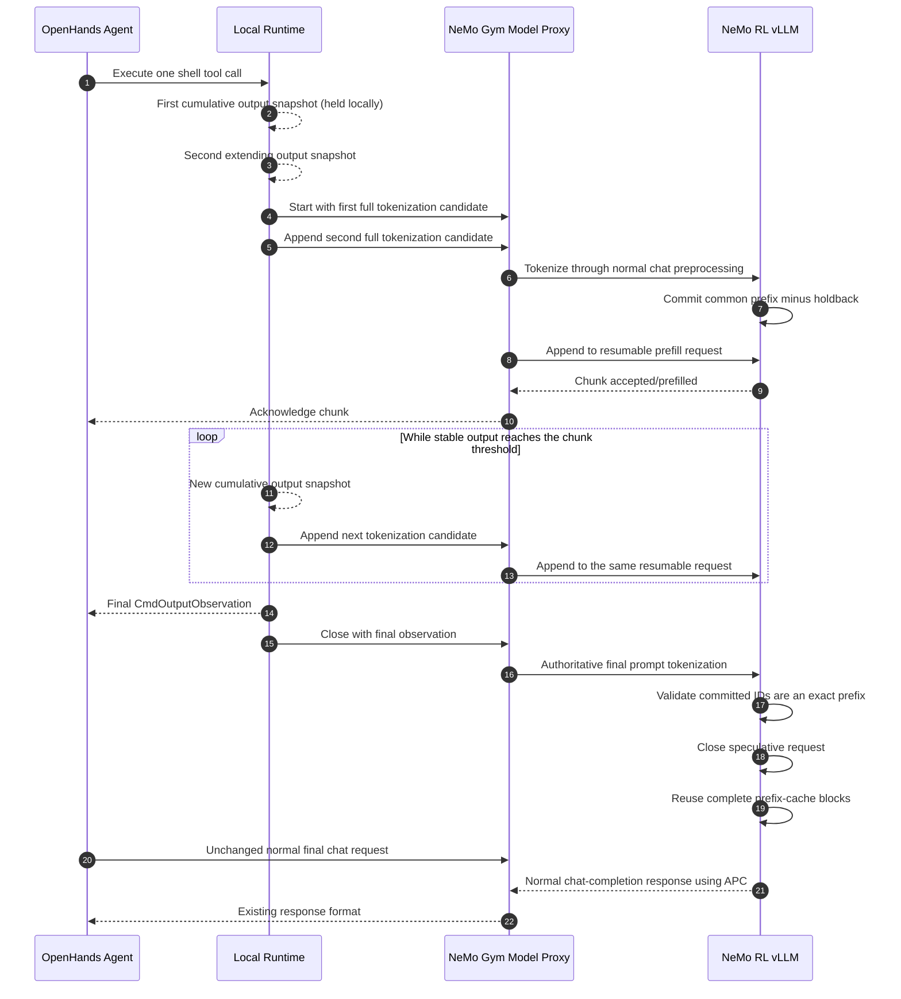

# Streaming Tool Call Prefill

Status: Implemented behind a disabled-by-default flag; validation in progress

## Implementation Status

The initial hybrid path is implemented across NeMo RL, NeMo Gym, and the
OpenHands checkout used by the SWE harness:

- `BashSession` publishes revisioned cumulative output snapshots without
  changing the final `CmdOutputObservation`.
- `LocalRuntime` polls snapshots only for eligible single `CmdRunAction` tool
  calls and treats every streaming failure as a baseline fallback.
- The Gym model proxy tokenizes every candidate through the same preprocessing
  as normal chat completions and preserves its existing sticky client cookie.
- The vLLM worker commits only the longest token prefix proven stable by two
  consecutive candidates, minus a configurable token holdback.
- Active sessions are admission-paused and fully cancelled before weight
  updates or cache resets. Sleep keeps admission paused until wake-up.
- Tool completion closes the speculative request after exact final-prefix
  validation. The next model turn still uses the unchanged normal chat endpoint.

The OpenHands integration is stored as
`responses_api_agents/swe_agents/patches/streaming_tool_call.patch` in the Gym
submodule. The setup path applies it to both new and cached compatible
OpenHands checkouts.

## Summary

SWE agents currently wait for a tool to finish before tokenizing its observation
and prefilling the next model request. Long-running commands therefore leave an
opportunity to overlap tool execution with model prefill.

This design introduces *streaming tool call prefill*: stable portions of a
running tool's output are tokenized incrementally and submitted to vLLM as
prefill chunks. The model does not produce the next agent response until the
tool has finished and the final observation has been constructed.

The first implementation should use a hybrid approach:

1. Use one resumable vLLM request for intermediate prefill chunks.
2. At tool completion, construct and tokenize the normal authoritative prompt.
3. Validate that all speculatively committed token IDs are an exact prefix of
   the authoritative prompt.
4. Close or cancel the resumable request.
5. Issue the existing `/v1/chat/completions` request and let automatic prefix
   caching reuse the completed full KV-cache blocks.

Keeping final generation on the existing endpoint preserves current tool and
reasoning parsing, prompt token IDs, generated token IDs, log probabilities,
and training-trajectory semantics. Generating directly from the last streaming
chunk can be considered later after the hybrid implementation is validated.

## Goals

- Overlap shell-tool execution with prefill for the following model turn.
- Reduce tool-completion-to-first-model-token latency for commands with long
  outputs.
- Preserve the exact final OpenHands observation, prompt token IDs, generated
  token IDs, log probabilities, and trainable trajectory.
- Add no work to the disabled path.
- Prevent speculative work from delaying final model generation or materially
  reducing rollout throughput.
- Fall back to the existing path on any unsupported or ambiguous condition.

## Non-goals

- Streaming the model's tool-call generation to the runtime. Model-output
  streaming does not overlap execution of the selected tool with the next
  prefill.
- Changing OpenHands observation formatting or truncation behavior.
- Exposing intermediate prefill tokens as agent messages or training data.
- Supporting every OpenHands tool and runtime in the first version.
- Replacing vLLM's internal chunked-prefill scheduler.

## Current Flow

The SWE rollout path currently has a blocking boundary at every stage:

1. `CodeActAgent.step()` builds the complete message list and waits for
   `NemoGymClient.model_call()`.
2. `NemoGymClient` waits for the complete `/v1/chat/completions` response before
   parsing tool calls.
3. `LocalRuntime.execute_action()` sends a blocking `/execute_action` request to
   the OpenHands action-execution server.
4. `BashSession.execute()` polls the tmux pane while the command is running, but
   returns only the final `CmdOutputObservation`.
5. The next agent step formats the final tool observation and sends another
   complete chat-completion request.
6. The NeMo Gym vLLM model proxy performs generation and then a separate
   `/tokenize` request to recover prompt token IDs.

The relevant implementation surfaces are:

- `openhands/agenthub/nemo_gym_client.py`
- `openhands/agenthub/codeact_agent/codeact_agent.py`
- `openhands/runtime/impl/local/local_runtime.py`
- `openhands/runtime/action_execution_server.py`
- `openhands/runtime/utils/bash.py`
- `responses_api_models/vllm_model/app.py`
- `nemo_rl/models/generation/vllm/vllm_worker_async.py`
- `nemo_rl/environments/nemo_gym.py`

## Proposed Architecture



The data-plane protocol exposes four ordered operations:

- `start`: create a bounded, expiring prefill session.
- `append`: submit one ordered full-prompt tokenization candidate and return an
  acknowledgement after any newly proven stable prefix is prefetched. A retry
  with the same sequence and candidate is idempotent.
- `close`: stop the session and make completed blocks available for prefix
  reuse.
- `abort`: cancel the session and discard its uncommitted state.

Each operation must carry the rollout/session identity and be routed to the
same NeMo Gym model client and vLLM data-parallel replica. The existing
`VLLMModel._resolve_client()` session mapping provides the required replica
stickiness.

## vLLM Execution Strategy

vLLM 0.17.1 accepts an `AsyncGenerator[StreamingInput, None]` and represents
each input chunk as a continuation of one resumable request. Prompt token IDs
from later chunks are appended to the active session, allowing their KV state
to remain resident without starting an independent request for every chunk.

The public sampling validation requires `max_tokens >= 1`. Intermediate chunks
must therefore use deterministic greedy sampling with `max_tokens=1`. vLLM
discards the last sampled token when it resumes the request with the next input
chunk. Intermediate sampled tokens must be drained and must never be returned
to OpenHands, included in metrics as policy output, or advance a stochastic
sampling RNG.

The following restrictions apply to the initial implementation:

- `n` must equal one.
- Stop strings are unsupported for the resumable request.
- Output kind cannot be `FINAL_ONLY`.
- Intermediate chunks use no detokenization and no logprob collection.
- The normal final request remains responsible for output text, tool parsing,
  generated token IDs, and log probabilities.

The intermediate dummy decode is a performance cost. Chunk sizes must be large
enough to amortize it. If profiling shows that the dummy decode materially
reduces throughput, the preferred follow-up is an upstreamable vLLM
prefill-only continuation that pauses without sampling. Creating many
independent shadow requests is a fallback, not the preferred architecture.

vLLM's own chunked-prefill scheduling remains enabled. Application chunks are
availability and correctness boundaries; `max_num_batched_tokens` continues to
control the amount of work scheduled in each engine iteration.

## Authoritative Prompt and Token Invariants

The final request must continue through the existing NeMo RL chat preprocessing
path. In particular, `_replace_prefix_tokens()` preserves the exact token IDs
generated by previous model turns rather than accepting potentially different
retokenization of the same text.

Let `committed_token_ids` be the IDs submitted through the streaming prefill
session, and let `final_prompt_token_ids` be produced by the unchanged final
chat preprocessing. Reuse is valid only if:

```python
final_prompt_token_ids[: len(committed_token_ids)] == committed_token_ids
```

If this condition is false, the speculative session must be aborted and the
normal request must run without depending on its KV state. No approximate text
or token comparison is acceptable.

Intermediate chunks are infrastructure state, not conversation turns. They
must never appear in:

- OpenHands event history,
- NeMo Gym response output,
- `prompt_token_ids` or `generation_token_ids` as separate messages,
- policy logprob accounting, or
- NeMo RL's trainable message log.

The monotonic-token assertion in `NemoGym._postprocess_nemo_gym_to_nemo_rl_result()`
must continue to pass without modification.

## Incremental Tokenization

### Why raw append-only tokenization is unsafe

Shell output and tokenizer state can revise a recent suffix:

- Carriage returns and progress displays rewrite terminal lines.
- tmux polling returns cumulative screen snapshots rather than an immutable byte
  stream.
- BPE tokenization can merge text across an arbitrary transport chunk boundary.
- `CmdOutputObservation` truncates content over 30,000 characters by preserving
  the first 15,000 and last 15,000 characters with a marker between them.
- Working directory, interpreter, exit code, and observation prefix/suffix are
  added only when the tool completes.

### State maintained per tool call

The incremental tokenizer maintains:

- the latest cumulative observation snapshot,
- the last observed common prefix,
- the committed text frontier,
- committed token IDs,
- the previous full candidate tokenization,
- a configurable token stability holdback,
- the number and IDs of acknowledged prefill chunks, and
- a terminal fallback reason, if any.

### Commit algorithm

The correctness-first implementation handles every new cumulative snapshot as
follows:

1. Compute its longest common text prefix with the previous snapshot.
2. If the changed region crosses the committed text frontier, stop streaming
   and mark the session for baseline fallback.
3. Tokenize the candidate through the same Gym and vLLM chat preprocessing used
   for the final request, including `_replace_prefix_tokens()`.
4. Compute the token longest-common-prefix with the previous candidate.
5. Verify that the common prefix still contains every committed token.
6. Hold back the configured number of trailing common-prefix tokens and commit
   only the older stable prefix.
7. Emit a chunk only after the minimum-token or maximum-delay threshold is met.
8. Retain any smaller suffix for the next snapshot.

Because current observation truncation retains the head and tail, streaming
must not commit beyond the first retained half of command output. Once output
could exceed the truncation limit, the rolling tail and truncation marker stay
mutable until final observation construction.

At completion, the normal full prompt is tokenized once. This full pass is the
authoritative validation and is equivalent to work already performed by the
baseline. An incremental-only final tokenization can be considered later, but
is not required for the first version.

## Runtime Output Streaming

OpenHands already defines `BaseRuntime.subscribe_to_shell_stream()`, while the
local action server uses a blocking `/execute_action` request. The initial
implementation adds a lightweight `/shell_stream_snapshot` endpoint and polls
it concurrently from `LocalRuntime`. `BashSession.execute()` publishes changed,
cumulative command-output snapshots from its existing polling loop and still
returns the identical final observation. A push transport can replace polling
later without changing the prefill protocol.

The callback must receive observation-like content, not raw PTY bytes. This
keeps the incremental tokenizer aligned with the formatting that will
eventually reach `ConversationMemory`. Completion metadata remains final-only
and is included by authoritative final tokenization.

The non-streaming `/execute_action` endpoint and all disabled behavior remain
unchanged.

## Eligibility and Fallback

The initial version is eligible only when all of the following are true:

- The feature flag is enabled.
- The active runtime is `LocalRuntime`.
- The model response contains exactly one tool call.
- That tool call maps to one `CmdRunAction`.
- The configured tokenizer and chat template support the incremental renderer.
- vLLM prefix caching and the async engine are enabled.
- Sampling uses one output sequence and no stop strings.

Fallback to the existing path is required for:

- multiple tool calls or queued actions,
- non-shell tools,
- unsupported runtimes, tokenizers, or templates,
- a rewrite before the committed frontier,
- an overlap-token mismatch,
- final-prefix validation failure,
- request timeout or disconnection,
- session eviction or replica-routing failure,
- model-weight epoch change,
- context-length exhaustion, or
- any internal streaming exception.

Fallback is a normal operating mode and must not fail the rollout.

## Backpressure and Scheduling

Speculative prefill must remain subordinate to ordinary decoding:

- Allow at most one append request in flight per tool call.
- Keep a bounded, latest-snapshot-only queue and coalesce superseded snapshots.
- Enforce a global maximum number of sessions and pending tokens per replica.
- Hold the first non-empty cumulative candidate locally. Admit a remote session
  only after a second distinct snapshot extends it and cumulative output reaches
  `min_chunk_chars`, then send the held candidate as `start` and the latest
  candidate as `append`. Commands that complete with one output snapshot pay no
  tokenization, HTTP, or vLLM session setup overhead, and a below-threshold
  command is never admitted remotely. `flush_interval_seconds` applies only to
  later appends after admission.
- Stop appending when KV-cache use, engine queue depth, or prefill latency
  crosses a configured high-water mark.
- At tool completion, cancel outstanding speculative work rather than waiting
  for a long chunk before starting final generation.
- Apply a TTL and cleanup task to every session.

Initial chunk thresholds should be conservative, for example 256-512 minimum
stable tokens with a 1,024-token maximum chunk. Exact defaults must be selected
from benchmarks and stored in YAML as the single source of truth.

## Weight Updates and Cache Validity

Async GRPO can update vLLM weights while rollout threads remain active. The
current configuration can intentionally retain stale KV caches when
`recompute_kv_cache_after_weight_updates` is false.

Streaming tool prefill must not expand this behavior by computing tool-output
KV with one weight version and silently treating it as speculative work for a
later version.

When a refit begins or the epoch changes:

1. Atomically pause new streaming-session admission.
2. Cancel all affected sessions and wait for their engine tasks to exit.
3. Perform the weight update or cache lifecycle transition.
4. Resume admission only after the transition completes. Sleep remains paused
   until wake-up.
5. Let affected final requests follow the existing baseline cache semantics.

This guard is required before enabling the feature during async training.

## Configuration

Configuration defaults belong in the relevant exemplar YAML and must be
represented in the vLLM configuration `TypedDict`. A proposed shape is:

```yaml
policy:
  generation:
    vllm_cfg:
      streaming_tool_call: &streaming_tool_call
        enabled: false
        max_sessions: 256
        session_ttl_seconds: 900
        stability_margin_tokens: 8
        min_chunk_chars: 256
        flush_interval_seconds: 0.25
        request_timeout_seconds: 60

env:
  nemo_gym:
    streaming_tool_call: *streaming_tool_call
```

The YAML anchor is the one source of truth shared by the worker and Gym. Missing
keys do not gain separate hidden defaults in Python.

## Observability

Record at least the following metrics:

- eligible and enabled tool calls,
- fallback count and reason,
- received shell snapshots and bytes,
- incremental-tokenizer CPU time,
- stable, committed, acknowledged, and discarded token counts,
- chunk count and size distribution,
- intermediate dummy-decode count,
- prefill request queue and execution time,
- tool execution time overlapped by prefill,
- tool-completion-to-first-model-token latency,
- final APC cached-token count,
- KV-cache utilization and eviction count,
- cancellation and TTL cleanup count, and
- session model-weight epoch.

## Testing Plan

### Unit tests

- Incremental tokenization equals full tokenization for normal append-only text.
- Unicode and tokenizer merge boundaries across every possible transport split.
- Carriage-return and progress-line rewrites remain inside the mutable suffix.
- Rewrites before the committed frontier cause fallback.
- Observation truncation, prefix, suffix, working directory, interpreter, and
  exit-code formatting remain unchanged.
- Latest-only queue coalescing, per-session ordering, TTL, cancellation, and
  idempotent cleanup.
- The final request never waits for an optional speculative chunk.

### vLLM integration tests

- One resumable request accepts multiple prompt-token deltas.
- Each intermediate chunk produces exactly one discarded greedy token.
- Closing or aborting a session makes complete KV blocks available to APC.
- A normal final request reports the expected number of cached tokens.
- Baseline and enabled requests have identical final prompt and generated token
  IDs for deterministic sampling.
- Log probabilities match within the existing numerical tolerance.
- Session invalidation works across cache reset and weight updates.
- The disabled path creates no streaming sessions or additional requests.

### OpenHands and NeMo Gym tests

- `LocalRuntime` streams snapshots and returns the same final observation.
- NeMo Gym cookies and session IDs keep all operations on one model client.
- Single command tool calls use streaming; multiple and unsupported tool calls
  fall back cleanly.
- Intermediate tokens do not appear in response output or the NeMo RL message
  log.

### End-to-end tests

Use `examples/swe_bench/run_grpo_swe2_scale_gen.sh` for paired baseline and
enabled runs. Validate generation-only behavior before testing async training
and in-flight refit.

Set `STREAMING_TOOL_CALL=0` for baseline and `STREAMING_TOOL_CALL=1` for the
enabled arm. The launcher adds `-streamtool` to the default enabled run name and
overrides both the vLLM and Gym copies of the feature flag.

## Performance Acceptance Criteria

The feature should not be enabled by default until all of these proposed gates
pass:

- Disabled-path overhead is below 1%.
- Short-tool rollout throughput remains within 2% of baseline.
- Long-output tool-completion-to-first-token latency improves by at least 20%.
- End-to-end samples per second are non-inferior at the target SWE concurrency.
- Prompt and generated token IDs retain deterministic parity.
- Rewards and successful-trajectory counts show no correctness regression.

Measurements must include tokenizer CPU, HTTP overhead, dummy decodes, engine
queueing, KV-cache pressure, and cache evictions. A latency improvement that
reduces aggregate rollout throughput is not sufficient.

### Current validation evidence

On 2026-06-30, the generation-only SWE entrypoint was run with four vLLM
replicas, eight rollouts, temperature zero, and one GRPO step through the
documented `sbatch` + `ray.sub` path:

| Arm | Slurm job | Rollout time | Reward / resolved | Streaming activity |
| --- | --- | ---: | ---: | --- |
| Disabled baseline | `13242887` | 881.9 s | 0 / 0 | All counters zero |
| Enabled before lazy admission | `13242283` | 1048.6 s | 0 / 0 | 432 sessions; 322.4 s request overhead |
| Enabled, two-snapshot admission | `13244211` | 887.1 s | 0.125 / 0.125 | No sessions admitted |
| Enabled, progressive admission | `13245446` | 817.3 s | 0 / 0 | 20 sessions; 75 requests; 2 completed chunks |

The progressive-admission run prefetched 1,158,614 tokens, produced and
discarded two dummy tokens, and recorded 27.5 seconds of aggregate client-side
streaming request time. It was 7.3% faster than the paired baseline while
matching its reward and resolved metrics; every sample produced a patch in both
arms. This is one small asynchronous smoke test, not a statistically conclusive
throughput or accuracy result. Repeated temperature-zero runs produced different
trajectories, so exact generated-token parity cannot be inferred from this
comparison. The feature remains disabled by default pending larger repeated
accuracy and performance runs.

## Implementation Phases

### Phase 0: vLLM feasibility spike

Use a tiny model to validate resumable input, intermediate dummy-token
discarding, cancellation, APC reuse after close, and weight-epoch invalidation.
This phase decides whether the existing vLLM API is sufficient.

### Phase 1: OpenHands runtime stream

Implement cumulative shell snapshots for `LocalRuntime` and prove exact final
observation parity independently of model prefill.

### Phase 2: Hybrid streaming prefill

Implement incremental tokenization, the session protocol, Gym sticky proxying,
final-prefix validation, cancellation, and the unchanged normal final model
call.

### Phase 3: Performance tuning

Tune lazy-start and chunk thresholds, global concurrency, cache high-water
marks, and scheduler interaction using the SWE benchmark entrypoint.

### Phase 4: Optional direct final generation

Only after parity and performance are established, evaluate using the final
`StreamingInput` chunk for real sampling. This requires isolating intermediate
dummy output from vLLM detokenizer and logprob state while preserving the
existing OpenAI-compatible tool and reasoning parsers.

## References

- [vLLM `AsyncLLM` streaming-input API](https://docs.vllm.ai/en/v0.17.1/api/vllm/v1/engine/async_llm/)
- [vLLM sampling parameters](https://docs.vllm.ai/en/v0.17.1/api/vllm/sampling_params/)
- [vLLM automatic prefix caching](https://docs.vllm.ai/en/v0.17.1/features/automatic_prefix_caching/)
- [vLLM prefix-caching design](https://docs.vllm.ai/en/v0.17.1/design/prefix_caching/)
- [vLLM scheduler configuration](https://docs.vllm.ai/en/v0.17.1/api/vllm/config/scheduler/)
- {doc}`nemo-gym-integration`
- {doc}`generation`
