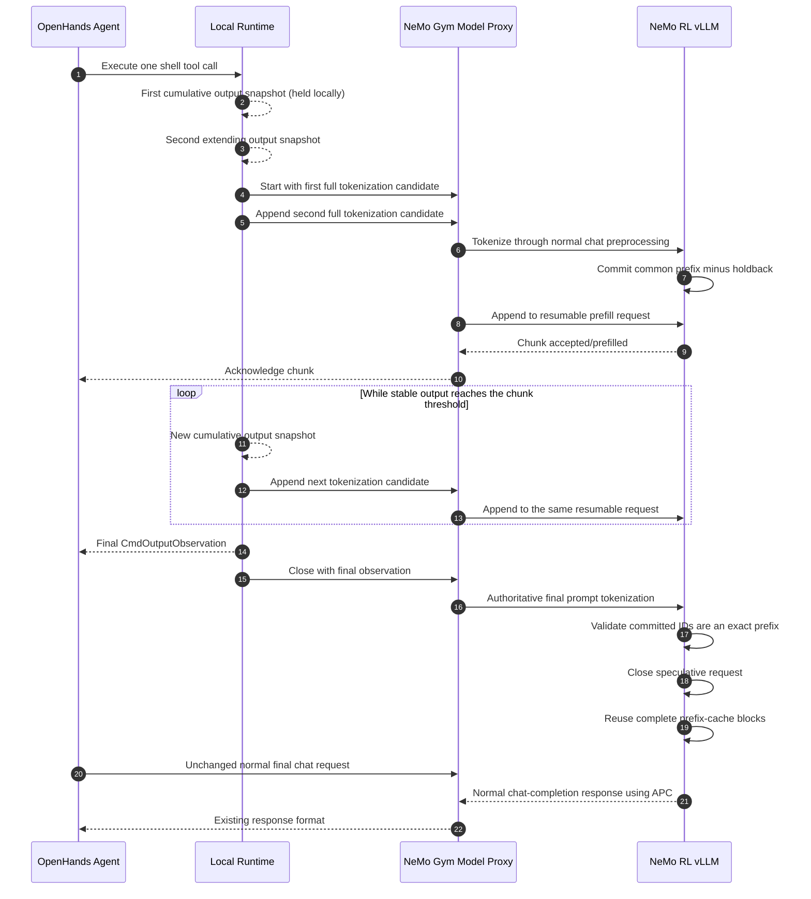

# Streaming Tool Call Prefill

Status: Implemented v1 behind a disabled-by-default flag; validation and
follow-up optimization are in progress

## Implementation Status

The v1 hybrid path is implemented across NeMo RL, NeMo Gym, and the
OpenHands checkout used by the SWE harness:

- `BashSession` publishes revisioned cumulative output snapshots without
  changing the final `CmdOutputObservation`.
- `LocalRuntime` polls snapshots only for eligible single `CmdRunAction` tool
  calls. It holds the first non-empty snapshot locally and starts remote work
  only after a second extending snapshot reaches `min_chunk_chars`.
- `LocalRuntime` requires strict append-only snapshot growth. A terminal-screen
  rewrite or any streaming exception falls back to the baseline path.
- The Gym model proxy fully retokenizes every cumulative candidate through the
  same preprocessing as normal chat completions and preserves its existing
  sticky client cookie.
- The vLLM worker commits only the longest token prefix proven stable by two
  consecutive candidates, minus a configurable token holdback.
- Each session has serialized appends, a one-item engine input queue, a global
  session-count limit, request timeouts, and lazy TTL expiration when a new
  session starts.
- Active sessions are admission-paused and fully cancelled before weight
  updates or cache resets. Sleep keeps admission paused until wake-up.
- Tool completion closes the speculative request after exact final-prefix
  validation. The next model turn still uses the unchanged normal chat endpoint.

The OpenHands integration is stored as
`responses_api_agents/swe_agents/patches/streaming_tool_call.patch` in the Gym
submodule. The setup path applies it to both new and cached compatible
OpenHands checkouts.

The following items from the broader design are not implemented in v1:

- tokenizer state that incrementally encodes only new text,
- suffix-revision handling through a mutable text frontier,
- a global pending-token limit or KV-cache/queue high-water admission control,
- a maximum application chunk size or background TTL cleanup task,
- cancellation of an already in-flight HTTP prefill request when the tool
  finishes, and
- the complete planned observability and deterministic-parity test matrix.

## Summary

With the feature disabled, SWE agents wait for a tool to finish before
tokenizing its observation and prefilling the next model request. Long-running
commands therefore leave an opportunity to overlap tool execution with model
prefill.

This design introduces *streaming tool call prefill*: cumulative candidates for
a running tool's output are fully tokenized, and newly proven stable token
prefixes are incrementally submitted to vLLM as prefill chunks. The model does
not produce the next agent response until the tool has finished and the final
observation has been constructed.

The implemented v1 uses a hybrid approach:

1. Use one resumable vLLM request for intermediate prefill chunks.
2. At tool completion, construct and tokenize the normal authoritative prompt.
3. Validate that all speculatively committed token IDs are an exact prefix of
   the authoritative prompt.
4. Close or cancel the resumable request.
5. Issue the existing `/v1/chat/completions` request and let automatic prefix
   caching reuse the completed full KV-cache blocks.

Keeping final generation on the existing endpoint preserves current tool and
reasoning parsing, prompt token IDs, generated token IDs, log probabilities,
and training-trajectory semantics. Generating directly from the last streaming
chunk can be considered later after the hybrid implementation is validated.

## Goals

- Overlap shell-tool execution with prefill for the following model turn.
- Reduce tool-completion-to-first-model-token latency for commands with long
  outputs.
- Preserve the exact final OpenHands observation, prompt token IDs, generated
  token IDs, log probabilities, and trainable trajectory.
- Add no work to the disabled path.
- Prevent speculative work from delaying final model generation or materially
  reducing rollout throughput.
- Fall back to the existing path on any unsupported or ambiguous condition.

## Non-goals

- Streaming the model's tool-call generation to the runtime. Model-output
  streaming does not overlap execution of the selected tool with the next
  prefill.
- Changing OpenHands observation formatting or truncation behavior.
- Exposing intermediate prefill tokens as agent messages or training data.
- Supporting every OpenHands tool and runtime in the first version.
- Replacing vLLM's internal chunked-prefill scheduler.

## Baseline Flow

With the feature disabled, the SWE rollout path has a blocking boundary at
every stage:

1. `CodeActAgent.step()` builds the complete message list and waits for
   `NemoGymClient.model_call()`.
2. `NemoGymClient` waits for the complete `/v1/chat/completions` response before
   parsing tool calls.
3. `LocalRuntime.execute_action()` sends a blocking `/execute_action` request to
   the OpenHands action-execution server.
4. `BashSession.execute()` polls the tmux pane while the command is running, but
   returns only the final `CmdOutputObservation`.
5. The next agent step formats the final tool observation and sends another
   complete chat-completion request.
6. The NeMo Gym vLLM model proxy performs generation and then a separate
   `/tokenize` request to recover prompt token IDs.

The relevant implementation surfaces are:

- `openhands/agenthub/nemo_gym_client.py`
- `openhands/agenthub/codeact_agent/codeact_agent.py`
- `openhands/runtime/impl/local/local_runtime.py`
- `openhands/runtime/action_execution_server.py`
- `openhands/runtime/utils/bash.py`
- `responses_api_models/vllm_model/app.py`
- `nemo_rl/models/generation/vllm/vllm_worker_async.py`
- `nemo_rl/environments/nemo_gym.py`

## Implemented v1 Architecture



The data-plane protocol exposes four ordered operations:

- `start`: create a bounded, lazily expiring prefill session.
- `append`: submit one ordered full-prompt tokenization candidate and return an
  acknowledgement after any newly proven stable prefix is prefetched. A retry
  with the same sequence and candidate is idempotent.
- `close`: stop the session and make completed blocks available for prefix
  reuse.
- `abort`: cancel the session and discard its uncommitted state.

Each operation must carry the rollout/session identity and be routed to the
same NeMo Gym model client and vLLM data-parallel replica. The existing
`VLLMModel._resolve_client()` session mapping provides the required replica
stickiness.

## vLLM Execution Strategy

vLLM 0.17.1 accepts an `AsyncGenerator[StreamingInput, None]` and represents
each input chunk as a continuation of one resumable request. Prompt token IDs
from later chunks are appended to the active session, allowing their KV state
to remain resident without starting an independent request for every chunk.

The public sampling validation requires `max_tokens >= 1`. Intermediate chunks
must therefore use deterministic greedy sampling with `max_tokens=1`. vLLM
discards the last sampled token when it resumes the request with the next input
chunk. Intermediate sampled tokens must be drained and must never be returned
to OpenHands, included in metrics as policy output, or advance a stochastic
sampling RNG.

The v1 resumable prefill request is fixed as follows:

- Sampling is greedy with one output sequence and `max_tokens=1`.
- No stop strings or logprobs are requested.
- Output kind is `DELTA`.
- Intermediate output text is ignored; only generated token IDs acknowledge
  submitted chunks and contribute to dummy-token accounting.
- The normal final request remains responsible for output text, tool parsing,
  generated token IDs, and log probabilities.

The intermediate dummy decode is a performance cost. Chunk sizes must be large
enough to amortize it. If profiling shows that the dummy decode materially
reduces throughput, the preferred follow-up is an upstreamable vLLM
prefill-only continuation that pauses without sampling. Creating many
independent shadow requests is a fallback, not the preferred architecture.

vLLM's own chunked-prefill scheduling remains enabled. Application chunks are
availability and correctness boundaries; `max_num_batched_tokens` continues to
control the amount of work scheduled in each engine iteration.

## Authoritative Prompt and Token Invariants

The final request must continue through the existing NeMo RL chat preprocessing
path. In particular, `_replace_prefix_tokens()` preserves the exact token IDs
generated by previous model turns rather than accepting potentially different
retokenization of the same text.

Let `committed_token_ids` be the IDs submitted through the streaming prefill
session, and let `final_prompt_token_ids` be produced by the unchanged final
chat preprocessing. Reuse is valid only if:

```python
final_prompt_token_ids[: len(committed_token_ids)] == committed_token_ids
```

If this condition is false, the speculative session must be aborted and the
normal request must run without depending on its KV state. No approximate text
or token comparison is acceptable.

Intermediate chunks are infrastructure state, not conversation turns. They
must never appear in:

- OpenHands event history,
- NeMo Gym response output,
- `prompt_token_ids` or `generation_token_ids` as separate messages,
- policy logprob accounting, or
- NeMo RL's trainable message log.

The monotonic-token assertion in `NemoGym._postprocess_nemo_gym_to_nemo_rl_result()`
must continue to pass without modification.

## Cumulative Retokenization and Incremental Prefill

### Why raw append-only tokenization is unsafe

Shell output and tokenizer state can revise a recent suffix:

- Carriage returns and progress displays rewrite terminal lines.
- tmux polling returns cumulative screen snapshots rather than an immutable byte
  stream.
- BPE tokenization can merge text across an arbitrary transport chunk boundary.
- `CmdOutputObservation` truncates content over 30,000 characters by preserving
  the first 15,000 and last 15,000 characters with a marker between them.
- Working directory, interpreter, exit code, and observation prefix/suffix are
  added only when the tool completes.

### State maintained per tool call

`LocalRuntime` maintains the first locally held candidate, the last remotely
sent cumulative text, the last snapshot revision, the request sequence number,
and client-side counters. The vLLM manager maintains committed token IDs, the
previous full candidate tokenization, the last idempotent result, a configurable
token stability holdback, acknowledged chunk and dummy-token counts, and any
terminal engine error.

### Implemented commit algorithm

V1 handles every new cumulative snapshot as follows:

1. Require the new snapshot text to extend the locally held or last remotely
   sent text with `startswith()`. Any terminal-screen rewrite causes fallback.
2. Hold the first non-empty snapshot locally without creating an HTTP or vLLM
   session.
3. When a second distinct snapshot extends it and cumulative output reaches
   `min_chunk_chars`, send the held snapshot as `start` and the latest snapshot
   as `append`.
4. For every `start`, `append`, and `close`, fully tokenize the cumulative chat
   candidate through the normal Gym and vLLM chat preprocessing path, including
   `_replace_prefix_tokens()`.
5. Compute the token longest common prefix between the previous and current
   full candidate tokenizations.
6. Verify that this token prefix still contains every committed token. A
   mismatch causes fail-open fallback.
7. Hold back `stability_margin_tokens` from the common prefix and append only
   the newly proven stable token suffix to the resumable vLLM request.
8. Acknowledge a submitted chunk after its deterministic dummy token is drained.
   Empty stable suffixes advance the sequence without engine work.
9. At tool completion, fully tokenize the authoritative final observation and
   require committed token IDs to be its exact prefix before closing the
   speculative request.

`BashSession` applies the existing observation truncation to every published
snapshot. If truncation or terminal rendering rewrites already observed text,
the strict append-only check falls back rather than trying to maintain a mutable
head/tail frontier.

True incremental tokenizer state that encodes only a new suffix, including BPE
boundary repair, is future work. V1 performs incremental prefill, not
incremental encoding. The normal final model call remains authoritative and
unchanged.

## Runtime Output Streaming

OpenHands already defines `BaseRuntime.subscribe_to_shell_stream()`, while the
local action server uses a blocking `/execute_action` request. V1 adds a
lightweight `/shell_stream_snapshot` endpoint and polls
it concurrently from `LocalRuntime`. `BashSession.execute()` publishes changed,
cumulative command-output snapshots from its existing polling loop and still
returns the identical final observation. A push transport can replace polling
later without changing the prefill protocol.

The callback must receive observation-like content, not raw PTY bytes. This
keeps cumulative tokenization candidates aligned with the formatting that will
eventually reach `ConversationMemory`. Completion metadata remains final-only
and is included by authoritative final tokenization.

The non-streaming `/execute_action` endpoint and all disabled behavior remain
unchanged.

## Eligibility and Fallback

V1 is eligible only when all of the following are true:

- The feature flag is enabled.
- The active runtime is `LocalRuntime`.
- The model response contains exactly one tool call.
- That tool call maps to one visible, non-static, non-input `CmdRunAction`.
- The model response ID and tool-call context survive OpenHands event
  serialization.

The reference recipe also enables vLLM automatic prefix caching and the async
engine. Those settings are required for the intended reuse and overlap benefit,
but v1 does not add a separate runtime eligibility check for them.

Fallback to the existing path is required for:

- multiple tool calls or queued actions,
- non-shell tools,
- unsupported runtimes, tokenizers, or templates,
- any rewrite of the locally held or remotely sent cumulative text,
- a committed token-prefix mismatch,
- final-prefix validation failure,
- request timeout or disconnection,
- session expiration or replica-routing failure,
- a model lifecycle transition that invalidates active sessions,
- context-length exhaustion, or
- any internal streaming exception.

Fallback is a normal operating mode and must not fail the rollout.

## Backpressure and Scheduling

V1 implements the following controls:

- `LocalRuntime` awaits at most one prefill request per tool call. Polling reads
  only the latest snapshot revision, naturally coalescing intermediate revisions
  while a request is in flight.
- Each manager session has a serialized append lock and a one-item engine input
  queue.
- Each replica enforces `max_sessions`; capacity errors fail open.
- Hold the first non-empty cumulative candidate locally. Admit a remote session
  only after a second distinct snapshot extends it and cumulative output reaches
  `min_chunk_chars`, then send the held candidate as `start` and the latest
  candidate as `append`. Commands that complete with one output snapshot pay no
  tokenization, HTTP, or vLLM session setup overhead, and a below-threshold
  command is never admitted remotely. `flush_interval_seconds` applies only to
  later appends after admission.
- HTTP work is bounded by `request_timeout_seconds` and any error returns the
  unchanged baseline action response.
- Stale sessions are expired lazily before admitting a new session. Weight,
  cache, sleep, and shutdown transitions pause admission and invalidate active
  sessions.

V1 does not yet enforce a global pending-token limit, maximum application chunk
size, KV-cache/queue/prefill-latency high-water mark, or background TTL cleanup.
It also awaits an already in-flight HTTP prefill request if the tool completes
during that request. These are follow-up controls required before considering
default enablement at larger scale.

## Weight Updates and Cache Validity

Async GRPO can update vLLM weights while rollout threads remain active. The
current configuration can intentionally retain stale KV caches when
`recompute_kv_cache_after_weight_updates` is false.

Streaming tool prefill must not expand this behavior by computing tool-output
KV with one weight version and silently treating it as speculative work for a
later version.

When a refit begins or the epoch changes:

1. Atomically pause new streaming-session admission.
2. Cancel all affected sessions and wait for their engine tasks to exit.
3. Perform the weight update or cache lifecycle transition.
4. Resume admission only after the transition completes. Sleep remains paused
   until wake-up.
5. Let affected final requests follow the existing baseline cache semantics.

This guard is implemented and remains required whenever the feature is used
during async training.

## Configuration

Configuration defaults belong in the relevant exemplar YAML and must be
represented in the vLLM configuration `TypedDict`. V1 uses:

```yaml
policy:
  generation:
    vllm_cfg:
      streaming_tool_call: &streaming_tool_call
        enabled: false
        max_sessions: 256
        session_ttl_seconds: 900
        stability_margin_tokens: 8
        min_chunk_chars: 256
        flush_interval_seconds: 0.25
        request_timeout_seconds: 60

env:
  nemo_gym:
    streaming_tool_call: *streaming_tool_call
```

The YAML anchor is the one source of truth shared by the worker and Gym. Missing
keys do not gain separate hidden defaults in Python.

## Observability

V1 exports these per-sample metrics through the SWE agent result and W&B:

- sessions started,
- prefill requests and accepted prefill tokens,
- completed chunks and discarded dummy tokens,
- final committed-prefix matches,
- fail-open fallbacks, and
- aggregate client-side streaming request time.

The vLLM metrics logger also separates streaming prefill and dummy-token work
from ordinary generation token accounting.

The following planned observability is not implemented yet:

- eligible and enabled tool calls,
- fallback count and reason,
- received shell snapshots and bytes,
- cumulative-tokenizer CPU time,
- stable and committed token distributions,
- chunk size distribution,
- prefill request queue and execution time,
- tool execution time overlapped by prefill,
- tool-completion-to-first-model-token latency,
- final APC cached-token count,
- KV-cache utilization and eviction count,
- cancellation and TTL cleanup count, and
- session model-weight epoch.

## Testing Status and Remaining Plan

### Implemented manager tests

- Monotonic token candidates prefill only the newly proven stable suffix.
- Duplicate sequences are idempotent; reordered or changed retries fail.
- Candidate and final committed-prefix mismatches are rejected or reported.
- Capacity, abort, missing-session, lazy TTL, pause/resume, and lifecycle
  invalidation behavior is covered.
- Close cancels an in-flight manager append without waiting for engine output.
- Engine failures reach the waiting append, and stability holdback is enforced.

### Implemented OpenHands and Gym tests

- `BashSession` publishes cumulative snapshots without changing the final
  observation.
- `LocalRuntime` sends ordered `start`, `append`, and `close` operations and
  returns the original final action response.
- A below-threshold or single-snapshot command creates no HTTP client or remote
  session.
- The loop-local HTTP session preserves sticky model cookies without reusing
  NeMo Gym's event-loop-bound global client.
- The Gym proxy uses the selected sticky client and normal chat tokenization.
- The disabled path creates no streaming sessions or additional requests.

### End-to-end evidence

The paired generation-only SWE runs below prove the live path can create a
resumable request, append and acknowledge prefill chunks, close it, and continue
through the unchanged normal final model call. They also verify that disabled
metrics remain zero and that streaming failures fail open.

### Remaining tests

- Report final APC cached-token reuse for a controlled prompt.
- Compare final prompt IDs, generated IDs, and log probabilities against a
  deterministic baseline within existing tolerances.
- Add true incremental-encoding tests for Unicode and BPE split boundaries if
  incremental tokenizer state is implemented.
- Exercise async training, in-flight refit, cache reset, sleep/wake, and shutdown
  under active sessions.
- Run larger repeated accuracy and throughput comparisons.

### Reproducing the end-to-end smoke

Use `examples/swe_bench/run_grpo_swe2_scale_gen.sh` for paired baseline and
enabled runs. Validate generation-only behavior before testing async training
and in-flight refit.

Set `STREAMING_TOOL_CALL=0` for baseline and `STREAMING_TOOL_CALL=1` for the
enabled arm. The launcher adds `-streamtool` to the default enabled run name and
overrides both the vLLM and Gym copies of the feature flag.

For a full run with real training and in-flight weight refit, use the wrapper:

```bash
bash examples/swe_bench/run_streaming_tool_call_full.sh
```

It defaults to one training step at the exact 16-node reproduction shape
(`NUM_VLLM_REPLICAS=32`, 8 generation nodes, 8 training nodes, and 64
rollouts). Useful overrides are:

```bash
# Smallest valid full-training shape: 8 total nodes and 32 rollouts.
NUM_VLLM_REPLICAS=16 bash examples/swe_bench/run_streaming_tool_call_full.sh

# Use the recipe's uncapped training duration.
MAX_NUM_STEPS=all bash examples/swe_bench/run_streaming_tool_call_full.sh

# Submit the matching non-streaming full baseline.
STREAMING_TOOL_CALL=0 bash examples/swe_bench/run_streaming_tool_call_full.sh

# Validate derived resources without submitting.
DRY_RUN=1 bash examples/swe_bench/run_streaming_tool_call_full.sh
```

## Performance Acceptance Criteria

The feature should not be enabled by default until all of these proposed gates
pass:

- Disabled-path overhead is below 1%.
- Short-tool rollout throughput remains within 2% of baseline.
- Long-output tool-completion-to-first-token latency improves by at least 20%.
- End-to-end samples per second are non-inferior at the target SWE concurrency.
- Prompt and generated token IDs retain deterministic parity.
- Rewards and successful-trajectory counts show no correctness regression.

Measurements must include tokenizer CPU, HTTP overhead, dummy decodes, engine
queueing, KV-cache pressure, and cache evictions. A latency improvement that
reduces aggregate rollout throughput is not sufficient.

### Current validation evidence

On 2026-06-30, the generation-only SWE entrypoint was run with four vLLM
replicas, eight rollouts, temperature zero, and one GRPO step through the
documented `sbatch` + `ray.sub` path:

| Arm | Slurm job | Rollout time | Reward / resolved | Streaming activity |
| --- | --- | ---: | ---: | --- |
| Disabled baseline | `13242887` | 881.9 s | 0 / 0 | All counters zero |
| Enabled before lazy admission | `13242283` | 1048.6 s | 0 / 0 | 432 sessions; 322.4 s request overhead |
| Enabled, two-snapshot admission | `13244211` | 887.1 s | 0.125 / 0.125 | No sessions admitted |
| Enabled, progressive admission | `13245446` | 817.3 s | 0 / 0 | 20 sessions; 75 requests; 2 completed chunks |

The disabled baseline is
[W&B run `3umuz7g6`](https://wandb.ai/nvidia/swe-benchmark/runs/3umuz7g6).
The last three arms are successive enabled implementations, not repeated
measurements of the same implementation:

- **Before lazy admission**
  ([W&B run `tp3ju5vo`](https://wandb.ai/nvidia/swe-benchmark/runs/tp3ju5vo))
  opened a remote session as soon as an eligible command produced output. Across
  eight samples this created 432 sessions and 517 start/append
  requests, reported 1,729,849 accepted prefill tokens, and spent 322.4 seconds
  in client-side streaming requests. Of the sessions, 402 passed the final
  committed-prefix check and 30 fell back, but no engine chunk completed and no
  dummy token was produced. A match against an empty committed prefix is valid,
  so the 402 matches are not evidence that useful KV state was created. This arm
  was 18.9% slower than the disabled baseline and exposed the cost of eagerly
  admitting short or fast commands.
- **Two-snapshot admission**
  ([W&B run `l4hqi8vt`](https://wandb.ai/nvidia/swe-benchmark/runs/l4hqi8vt))
  held the first non-empty snapshot locally and required the next distinct,
  append-only snapshot to reach the 256-character admission threshold.
  That initial pair was the only admission opportunity for an action. No command
  qualified in this run, so all streaming counters were zero: there was no
  streaming HTTP, tokenization, or vLLM work. Its 887.1-second rollout time was
  0.6% above the baseline and is consistent with a nearly free disabled path.
  One of eight samples resolved, but streaming cannot explain that result because
  it never admitted a session.
- **Progressive admission**
  ([W&B run `p3x2fwqy`](https://wandb.ai/nvidia/swe-benchmark/runs/p3x2fwqy))
  retained the pending first snapshot and continued evaluating later append-only
  revisions until the cumulative output reached the threshold. Six
  samples still admitted no sessions; the other two admitted ten each. In total,
  the arm issued 75 start/append requests across 20 sessions, reported 1,158,614
  accepted prefill tokens, recorded two final prefix matches and 20 fail-open
  fallback events, completed two engine chunks, and produced and discarded two
  dummy tokens. Client-side streaming request time fell to 27.5 seconds: 91.5%
  less than the eager arm, with 95.4% fewer sessions and 85.5% fewer requests.
  This is the first arm that both filtered short commands and demonstrated live
  prefill completion.

The progressive arm was 7.3% faster than the paired baseline while matching its
reward and resolved metrics; every sample produced a patch in both arms. This is
one small asynchronous smoke test, not a statistically conclusive throughput or
accuracy result. Repeated temperature-zero runs produced different trajectories,
so the timing difference and exact generated-token parity cannot be attributed
to streaming from this comparison alone. The feature remains disabled by
default pending larger repeated accuracy and performance runs.

The live runs also exposed teardown noise. NeMo Gym's process-global aiohttp
client can report a pre-existing cross-event-loop close error. With admitted
streaming sessions, abort or cleanup requests can additionally race vLLM
endpoint shutdown and log `ConnectionRefusedError` after reward processing.
The measured jobs still exited successfully, but shutdown ordering should be
cleaned up before default enablement.

## Implementation Phases

### Phase 0: vLLM feasibility spike

Status: partially complete. Unit and live SWE runs validate resumable input,
dummy-token draining, cancellation, and lifecycle invalidation. A controlled
test that reports exact APC cached-token reuse remains.

### Phase 1: OpenHands runtime stream

Status: complete for `CmdRunAction` on `LocalRuntime`. Cumulative snapshots and
unchanged final action responses are covered by tests.

### Phase 2: Hybrid streaming prefill

Status: v1 complete with cumulative full-candidate retokenization. The session
protocol, Gym sticky proxying, final-prefix validation, cancellation, and
unchanged normal final model call are implemented. True incremental encoding is
still future work.

### Phase 3: Performance tuning

Status: in progress. Progressive two-snapshot admission removed the measured
short-command regression and produced a faster eight-sample smoke, but global
pending-token limits, cache high-water admission, and larger repeated benchmarks
remain.

### Phase 4: Optional direct final generation

Status: not started. Only after parity and performance are established, evaluate
using the final `StreamingInput` chunk for real sampling. This requires isolating
intermediate
dummy output from vLLM detokenizer and logprob state while preserving the
existing OpenAI-compatible tool and reasoning parsers.

## References

- [vLLM `AsyncLLM` streaming-input API](https://docs.vllm.ai/en/v0.17.1/api/vllm/v1/engine/async_llm/)
- [vLLM sampling parameters](https://docs.vllm.ai/en/v0.17.1/api/vllm/sampling_params/)
- [vLLM automatic prefix caching](https://docs.vllm.ai/en/v0.17.1/features/automatic_prefix_caching/)
- [vLLM prefix-caching design](https://docs.vllm.ai/en/v0.17.1/design/prefix_caching/)
- [vLLM scheduler configuration](https://docs.vllm.ai/en/v0.17.1/api/vllm/config/scheduler/)
- {doc}`nemo-gym-integration`
- {doc}`generation`
