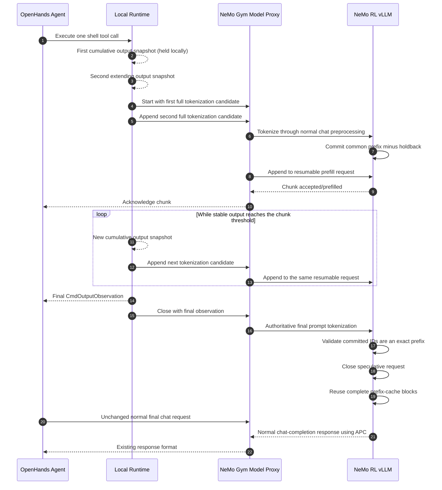
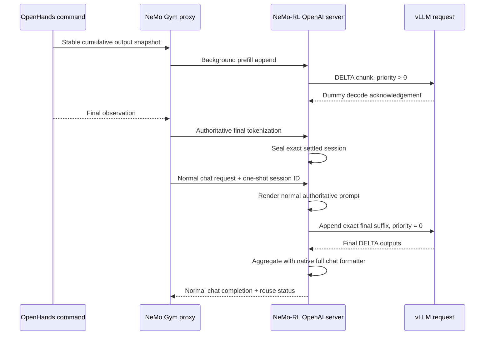
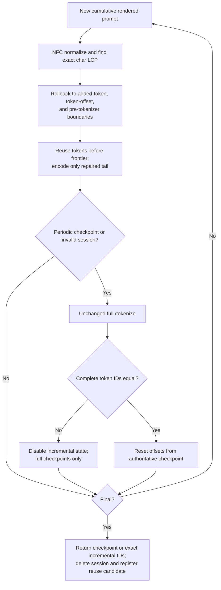
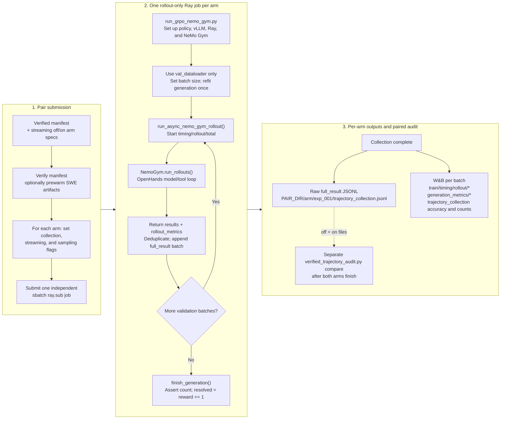

# Streaming Tool Call Prefill

Status: Implemented v1 behind a disabled-by-default flag; validation and
follow-up optimization are in progress

## Implementation Status

The v1 hybrid path is implemented across NeMo RL, NeMo Gym, and the
OpenHands checkout used by the SWE harness:

- `BashSession` publishes revisioned cumulative output snapshots without
  changing the final `CmdOutputObservation`.
- `LocalRuntime` polls snapshots only for eligible single `CmdRunAction` tool
  calls. With stable-first admission it starts remote work when the first
  snapshot reaches `initial_chunk_chars`; the legacy two-snapshot path holds
  the first snapshot until a second extending snapshot reaches
  `min_chunk_chars`.
- `LocalRuntime` requires strict append-only snapshot growth. A terminal-screen
  rewrite or any streaming exception falls back to the baseline path.
- The Gym model proxy preserves its existing sticky client cookie. Legacy
  prefill/tokenizer-only mode fully retokenizes cumulative candidates; exact
  incremental mode routes ordered candidates to backend tokenizer state.
- The vLLM worker commits only the longest token prefix proven stable by two
  consecutive candidates, minus a configurable token holdback.
- Each session has serialized appends, a one-item engine input queue, a global
  session-count limit, request timeouts, lazy expiration on admission, and an
  event-loop timer that proactively cancels the session at its idle TTL even
  when no later session is admitted. Normal close/abort cancels that timer.
- Active sessions are admission-paused and fully cancelled before weight
  updates or cache resets. Sleep keeps admission paused until wake-up.
- Tool completion closes the speculative request after exact final-prefix
  validation. The next model turn still uses the unchanged normal chat endpoint.
- In tokenizer-only mode, tool completion stores exact final prompt tokens as
  a bounded one-shot candidate. Legacy mode obtains them from `/tokenize`;
  exact incremental mode obtains them from the incremental encoder unless a
  checkpoint is due. The next matching model turn consumes those token IDs for
  generation and prompt logging, without a speculative prefill or another
  tokenizer encode.
- Exact incremental-tokenizer mode keeps bounded, ordered state in the NeMo-RL
  vLLM HTTP server. It re-encodes only the final mutable pre-tokenizer segment
  and changed normalized-text tail between full-tokenizer checkpoints.
- Sequence zero and every configured checkpoint interval use the unchanged
  full tokenizer. Finalization checkpoints only when its sequence is due or the
  session is already invalid; otherwise it returns the encoder's exact token
  IDs and removes the session. Any checkpoint mismatch permanently disables
  incremental work for that action.
- The tokenizer request retains only the newest assistant token-logging triplet
  so NeMo-RL's authoritative historical-prefix replacement still runs. A
  separate canonical comparison copy removes all token-logging fields.
- An optional diagnostic repeats authoritative full tokenization after a
  checkpoint-free exact finalization, records its server-side duration and
  token count, and verifies exact equality. It is disabled by default because
  it deliberately adds work and invalidates E2E performance comparisons.
- An optional final-only exact tokenizer mode starts sequence zero from an
  empty tool output while the command runs, skips snapshot polling, and sends
  the authoritative final output as sequence one. It covers every eligible
  command without issuing generation or prefill work.
- Optional deferred continuation prefill waits for the first non-empty output
  bucket, seeds exact tokenizer state from the previous model call's
  authoritative token IDs, and keeps the prefill session open for later
  buckets. Stable-first mode can prove useful tokens in that first snapshot
  instead of waiting for a second snapshot.
- Optional background completion returns after the first continuation chunk is
  enqueued and leaves engine completion under manager ownership. Final close
  cancels unfinished work without a grace wait and reports completion,
  cancellation, failure, and dynamic-token counters exactly once.
- Optional same-request final decode can seal the exact token prefix already
  submitted to vLLM even when its transition dummy has not yet arrived. The
  next model call verifies the independently rendered authoritative prompt,
  appends only its exact suffix to that live request, restores foreground
  priority and ordinary sampling, and suppresses any speculative dummy.
- Background completion enables vLLM priority scheduling. Ordinary foreground
  model requests retain priority zero; only speculative background prefill uses
  the configured positive `background_prefill_priority` (default 1).
- Every non-final continuation tokenizer/prefill request races command
  completion. If the command wins, OpenHands cancels the HTTP task, sends the
  combined tokenizer/prefill abort, and uses the unchanged normal final model
  path instead of adding post-command speculative latency.

The OpenHands integration is stored as an ordered patch chain in
`responses_api_agents/swe_agents/patches/`, ending with
`streaming_tool_call_cached_token_metrics.patch`. The setup path
applies the compatible missing suffix to a new or cached checkout without
forcing a venv rebuild.

The following items from the broader design are not implemented in v1:

- a global pending-token limit or KV-cache/queue high-water admission control,
- a maximum application chunk size,
- the complete planned observability and deterministic-parity test matrix.

## Summary

With the feature disabled, SWE agents wait for a tool to finish before
tokenizing its observation and prefilling the next model request. Long-running
commands therefore leave an opportunity to overlap tool execution with model
prefill.

This design introduces *streaming tool call prefill*: cumulative candidates for
a running tool's output are fully tokenized, and newly proven stable token
prefixes are incrementally submitted to vLLM as prefill chunks. The model does
not produce the next agent response until the tool has finished and the final
observation has been constructed.

The implemented v1 uses a hybrid approach:

1. Use one resumable vLLM request for intermediate prefill chunks.
2. At tool completion, construct and tokenize the normal authoritative prompt.
3. Validate that all speculatively committed token IDs are an exact prefix of
   the authoritative prompt.
4. Close or cancel the resumable request.
5. Issue the existing `/v1/chat/completions` request and let automatic prefix
   caching reuse the completed full KV-cache blocks.

Keeping final generation on the existing endpoint preserves current tool and
reasoning parsing, prompt token IDs, generated token IDs, log probabilities,
and training-trajectory semantics. Generating directly from the last streaming
chunk can be considered later after the hybrid implementation is validated.

## Goals

- Overlap shell-tool execution with prefill for the following model turn.
- Reduce tool-completion-to-first-model-token latency for commands with long
  outputs.
- Preserve the exact final OpenHands observation, prompt token IDs, generated
  token IDs, log probabilities, and trainable trajectory.
- Add no work to the disabled path.
- Prevent speculative work from delaying final model generation or materially
  reducing rollout throughput.
- Fall back to the existing path on any unsupported or ambiguous condition.

## Non-goals

- Streaming the model's tool-call generation to the runtime. Model-output
  streaming does not overlap execution of the selected tool with the next
  prefill.
- Changing OpenHands observation formatting or truncation behavior.
- Exposing intermediate prefill tokens as agent messages or training data.
- Supporting every OpenHands tool and runtime in the first version.
- Replacing vLLM's internal chunked-prefill scheduler.

## Baseline Flow

With the feature disabled, the SWE rollout path has a blocking boundary at
every stage:

1. `CodeActAgent.step()` builds the complete message list and waits for
   `NemoGymClient.model_call()`.
2. `NemoGymClient` waits for the complete `/v1/chat/completions` response before
   parsing tool calls.
3. `LocalRuntime.execute_action()` sends a blocking `/execute_action` request to
   the OpenHands action-execution server.
4. `BashSession.execute()` polls the tmux pane while the command is running, but
   returns only the final `CmdOutputObservation`.
5. The next agent step formats the final tool observation and sends another
   complete chat-completion request.
6. The NeMo Gym vLLM model proxy performs generation and then a separate
   `/tokenize` request to recover prompt token IDs.

The relevant implementation surfaces are:

- `openhands/agenthub/nemo_gym_client.py`
- `openhands/agenthub/codeact_agent/codeact_agent.py`
- `openhands/runtime/impl/local/local_runtime.py`
- `openhands/runtime/action_execution_server.py`
- `openhands/runtime/utils/bash.py`
- `responses_api_models/vllm_model/app.py`
- `nemo_rl/models/generation/vllm/vllm_worker_async.py`
- `nemo_rl/environments/nemo_gym.py`

## Implemented v1 Architecture



The data-plane protocol exposes four ordered operations:

- `start`: create a bounded, lazily expiring prefill session.
- `append`: submit one ordered full-prompt tokenization candidate and return an
  acknowledgement after any newly proven stable prefix is prefetched. A retry
  with the same sequence and candidate is idempotent.
- `close`: stop the session and make completed blocks available for prefix
  reuse.
- `abort`: cancel the session and discard its uncommitted state.

Each operation must carry the rollout/session identity and be routed to the
same NeMo Gym model client and vLLM data-parallel replica. The existing
`VLLMModel._resolve_client()` session mapping provides the required replica
stickiness.

## vLLM Execution Strategy

The currently validated vLLM 0.20.0 runtime accepts an
`AsyncGenerator[StreamingInput, None]` and represents
each input chunk as a continuation of one resumable request. Prompt token IDs
from later chunks are appended to the active session, allowing their KV state
to remain resident without starting an independent request for every chunk.

The public sampling validation requires `max_tokens >= 1`. Intermediate chunks
must therefore use deterministic greedy sampling with `max_tokens=1`. vLLM
discards the last sampled token when it resumes the request with the next input
chunk. Intermediate sampled tokens must be drained and must never be returned
to OpenHands, included in metrics as policy output, or advance a stochastic
sampling RNG.

The v1 resumable prefill request is fixed as follows:

- Sampling is greedy with one output sequence and `max_tokens=1`.
- No stop strings or logprobs are requested.
- Output kind is `DELTA`.
- Intermediate output text is ignored; only generated token IDs acknowledge
  submitted chunks and contribute to dummy-token accounting.
- By default, the normal separate final request remains responsible for output
  text, tool parsing, generated token IDs, and log probabilities. The optional
  same-request extension below preserves those responsibilities through the
  same native formatter while continuing the existing engine request.

The intermediate dummy decode is a performance cost. Chunk sizes must be large
enough to amortize it. If profiling shows that the dummy decode materially
reduces throughput, the preferred follow-up is an upstreamable vLLM
prefill-only continuation that pauses without sampling. Creating many
independent shadow requests is a fallback, not the preferred architecture.

vLLM's own chunked-prefill scheduling remains enabled. Application chunks are
availability and correctness boundaries; `max_num_batched_tokens` continues to
control the amount of work scheduled in each engine iteration.

### Same-request final-decode extension

Automatic prefix caching only exposes complete physical cache pages to a new
request. Short tool outputs can therefore complete a valid streaming session
without making any additional KV reusable by the default separate final
request. When `same_request_final_decode=true`, the authoritative decode
continues the already-live resumable engine request instead:



`seal` is a zero-wait operation. It succeeds after at least one exact prefill
prefix has entered the resumable vLLM input stream and no later chunk remains
in its application queue. The transition dummy does not need to be observed:
the manager stores every submitted token ID and engine prompt boundary, so it
can distinguish an in-flight acknowledgement from unsubmitted work. It stores
the authoritative final prompt token IDs but leaves the vLLM request live. The
next model call independently renders the normal chat request and must produce
exactly the sealed token IDs. The manager then appends only the suffix after
the submitted prefix and streams the authoritative decode. If vLLM suppresses
the discarded transition dummy, observing output at the sealed final boundary
acknowledges that preceding prefill without exposing a speculative token.

The final continuation uses the request's ordinary sampling parameters with
`RequestOutputKind.DELTA`. DELTA outputs are aggregated and passed through
vLLM's native non-streaming chat formatter, preserving reasoning/tool parsing,
generated token IDs, logprobs, usage, and finish reasons. Intermediate dummy
outputs remain manager-private and never enter that aggregate.

Background prefill starts at a lower scheduler priority. Two guarded vLLM 0.20
compatibility patches update the live request's `max_tokens` and priority from
each continuation chunk, so the final suffix restores foreground priority and
the full output-token budget. The multi-file priority patch validates every
expected source snippet under one feature lock before writing any file. If
either compatibility patch is unavailable, same-request mode refuses to start;
ordinary generation remains available.

Same-request continuation does not require a complete APC page: partial-page
KV remains owned by the live engine request. This mode therefore disables only
the physical cache-page crossing admission gate. Character thresholds, stable
prefix proof, token holdback, bounded session count, prompt-length checks,
background scheduling, and fail-open behavior remain unchanged. The default
separate-final-request mode retains the page-crossing gate.

The extension is currently restricted to non-streaming, single-sequence,
non-beam requests without stop strings, structured output, LoRA, or routed
data-parallel rank selection. Missing/expired sessions, unsettled background
work, prompt mismatch, unsupported parameters, engine errors, and unexpected
integration exceptions abort the old session and execute the unchanged normal
request. `asyncio.CancelledError` is not swallowed.

The response reports one of `used`, `fallback_missing`,
`fallback_incompatible`, `fallback_engine_error`, or `fallback_error`.
OpenHands and NeMo-RL aggregate attempts, successes, fallbacks, per-status
counts, and model-call count/time/token totals for used versus fallback calls.

## Authoritative Prompt and Token Invariants

The final request must continue through the existing NeMo RL chat preprocessing
path. In particular, `_replace_prefix_tokens()` preserves the exact token IDs
generated by previous model turns rather than accepting potentially different
retokenization of the same text.

Let `submitted_token_ids` be the IDs already yielded through the resumable
vLLM input stream, let `committed_token_ids` be the acknowledged subset, and
let `final_prompt_token_ids` be produced by the unchanged final chat
preprocessing. Same-request reuse is valid only if:

```python
final_prompt_token_ids[: len(submitted_token_ids)] == submitted_token_ids
```

If this condition is false, the speculative session must be aborted and the
normal request must run without depending on its KV state. No approximate text
or token comparison is acceptable.

Intermediate chunks are infrastructure state, not conversation turns. They
must never appear in:

- OpenHands event history,
- NeMo Gym response output,
- `prompt_token_ids` or `generation_token_ids` as separate messages,
- policy logprob accounting, or
- NeMo RL's trainable message log.

The monotonic-token assertion in `NemoGym._postprocess_nemo_gym_to_nemo_rl_result()`
must continue to pass without modification.

## Cumulative Retokenization and Incremental Prefill

### Why raw append-only tokenization is unsafe

Shell output and tokenizer state can revise a recent suffix:

- Carriage returns and progress displays rewrite terminal lines.
- tmux polling returns cumulative screen snapshots rather than an immutable byte
  stream.
- BPE tokenization can merge text across an arbitrary transport chunk boundary.
- `CmdOutputObservation` truncates content over 30,000 characters by preserving
  the first 15,000 and last 15,000 characters with a marker between them.
- Working directory, interpreter, exit code, and observation prefix/suffix are
  added only when the tool completes.

### State maintained per tool call

`LocalRuntime` maintains the first locally held candidate, the last remotely
sent cumulative text, the last snapshot revision, the request sequence number,
and client-side counters. The vLLM manager maintains committed token IDs, the
previous full candidate tokenization, the last idempotent result, a configurable
token stability holdback, acknowledged chunk and dummy-token counts, and any
terminal engine error.

### Implemented commit algorithm

V1 handles every new cumulative snapshot as follows:

1. Require the new snapshot text to extend the locally held or last remotely
   sent text with `startswith()`. Any terminal-screen rewrite causes fallback.
2. Hold the first non-empty snapshot locally without creating an HTTP or vLLM
   session.
3. When a second distinct snapshot extends it and cumulative output reaches
   `min_chunk_chars`, send the held snapshot as `start` and the latest snapshot
   as `append`.
4. For every `start`, `append`, and `close`, fully tokenize the cumulative chat
   candidate through the normal Gym and vLLM chat preprocessing path, including
   `_replace_prefix_tokens()`.
5. Compute the token longest common prefix between the previous and current
   full candidate tokenizations.
6. Verify that this token prefix still contains every committed token. A
   mismatch causes fail-open fallback.
7. Hold back `stability_margin_tokens` from the common prefix and append only
   the newly proven stable token suffix to the resumable vLLM request.
8. Acknowledge a submitted chunk after its deterministic dummy token is drained.
   Empty stable suffixes advance the sequence without engine work.
9. At tool completion, fully tokenize the authoritative final observation and
   require committed token IDs to be its exact prefix before closing the
   speculative request.

`BashSession` applies the existing observation truncation to every published
snapshot. If truncation or terminal rendering rewrites already observed text,
the strict append-only check falls back rather than trying to maintain a mutable
head/tail frontier.

The original tokenizer-only implementation fully retokenized each admitted
cumulative prompt. The optional exact incremental mode described below now
replaces that intermediate work with mutable-tail repair and passes the exact
incrementally constructed final IDs to one-shot prompt reuse. A periodic or
invalid-session final revision still uses the authoritative full tokenizer. By
default it does not issue speculative generation or prefill requests.

### Final-only exact tokenizer path

Snapshot admission is useful for speculative prefill, but it unnecessarily
limits tokenizer-only coverage. In two July 10 first-16 runs, 2,571 of 3,201
eligible command actions (80.3%) exposed only one non-empty snapshot before
completion. Only 11 actions (0.34%) reached multiple snapshots but remained
below 256 characters. Lowering `min_chunk_chars` therefore cannot materially
raise tokenizer-only coverage.

The optional
`streaming_tool_call.final_only_incremental_tokenizer=false` path removes the
snapshot gate while retaining the exact tokenizer and unchanged generation
request:

1. OpenHands starts the command request as an asynchronous task.
2. It immediately starts sequence 0 of an exact tokenizer session with an empty
   tool output. This full checkpoint contains the system prompt, conversation,
   assistant tool call, empty tool message, and next-assistant template suffix.
3. The command and sequence-0 tokenization run concurrently. OpenHands does not
   read `shell_stream_snapshot` in this mode.
4. When the authoritative `CmdOutputObservation` returns, OpenHands applies the
   same `max_message_chars` truncation used by conversation memory and sends it
   directly as final sequence 1.
5. The backend repairs the changed prompt frontier and re-encodes only the
   mutable tail. Sequence 1 is not checkpoint-due at the default interval of
   eight, so a valid session returns exact incremental token IDs.
6. The resulting one-shot `reuse_id` follows the existing canonical prompt and
   complete-token equality gates on the next normal model request.

This path sends exactly two tokenizer requests per eligible action and zero
snapshot requests. With `final_only_prefill=false`, it sends zero
generation/prefill requests. It does not stream intermediate command output;
“final-only” describes the update cadence, while the tokenizer-only performance
opportunity comes from overlapping the initial full prompt tokenization with
command execution and avoiding the later full final encode.

### Optional final-only prefill

`streaming_tool_call.final_only_prefill=false` adds one speculative vLLM engine
request to sequence 0 without changing the authoritative final request:

1. The model proxy keeps the exact token IDs returned by the sequence-0
   incremental-tokenizer checkpoint.
2. It starts the existing resumable-prefill manager with those IDs, then sends
   the identical candidate as sequence 1. Two identical candidates prove all
   but `stability_margin_tokens` stable and submit that prefix to one vLLM
   `StreamingInput` request.
3. After the manager acknowledges the chunk and drains its single dummy token,
   the proxy closes the speculative session against the same exact candidate.
4. The request runs while the command is in flight. The final sequence-1
   tokenizer revision and one-shot prompt reuse remain unchanged.

This does not hand speculative KV state directly to the final generation.
Instead, it primes vLLM automatic prefix caching. The empty-output and final
prompts may diverge at the tool-content boundary; APC reuses only identical
full prefix blocks and cannot consume the divergent suffix. The exact final
tokenizer's `reused_tokens` value gives a stronger client-side bound:

```text
final_only_prefill_reused_tokens = min(prefill_tokens, final_reused_tokens)
```

A prefill counts as valid only when a chunk completed, the speculative close
matched, this final reusable-token bound is positive, and no prefill operation
failed. A prefill HTTP failure is caught in the model proxy, the speculative
session is aborted, and the exact tokenizer result is still returned. Thus a
prefill failure does not disable final prompt reuse or change the command
observation.

### Deferred continuation and stable-first snapshot prefill

`prefill_after_admission=true` changes final-only prefill from an empty-output
prime into bucketed continuation. OpenHands waits for
`initial_chunk_chars`, sends that first non-final snapshot as sequence zero,
and sends later snapshots only after another `min_chunk_chars`. The final
authoritative prompt and sampling request remain unchanged.

If the command completes before the first bucket is admitted, OpenHands
returns the ordinary observation immediately. It does not remotely tokenize
the completed prompt and does not register one-shot prompt reuse, because no
streaming prefill could benefit from that work. The next ordinary model call
remains the authoritative tokenizer fallback. Once a session is admitted, the
final exact incremental update and reuse registration are still mandatory.

The original deferred start used the prior model tokens as the manager's
initial candidate. That admits a session, but its first engine request usually
contains no new tool-prompt tokens: the longest common token prefix ends at the
authoritative model prefix and the manager still subtracts
`stability_margin_tokens`. `stable_first_snapshot_prefill=true` provides a
conservative proof for the first non-empty snapshot:

1. Render the real chat request containing the current tool-output snapshot.
2. Render an alternate copy with only the last tool message's content replaced
   by an empty string. All history, tool-call metadata, template options, and
   next-assistant suffix remain identical.
3. Normalize both strings with the tokenizer's actual normalizer. Find their
   common character prefix and a non-overlapping common suffix. The suffix
   identifies the chat-template text following the mutable tool output.
4. Treat the end of the real string before that suffix as the next possible
   mutation frontier. `_repair_start()` moves it backward across partial added
   tokens, the containing pre-tokenizer segment, and any token whose offset
   crosses that segment boundary.
5. `_retained_token_count()` returns only token IDs ending before the repair
   frontier. Unmapped historical model IDs are retained only while the mapped
   suffix proves that the frontier cannot cross them.
6. Give the prefill manager this proven prefix plus up to
   `stability_margin_tokens` following tokens. Those following tokens are
   sacrificial holdback: the manager subtracts the same margin, so it commits
   no token beyond the exact tokenizer proof.
7. If the alternate render has no distinct output, no shared template suffix,
   or crosses an unsupported mapped boundary, fall back to the prior
   authoritative-prefix candidate.

This prevents streamed tokens from changing after commitment in three layers:
the offset-aware tokenizer excludes the mutable pre-token segment, the prefill
manager holds back the configured margin and rejects any later candidate that
changes a committed token, and finalization still requires the committed IDs
to prefix-match the authoritative final prompt. Periodic complete checkpoints
remain the independent equality guard for incremental tokenization.

Every non-final continuation request also races `post_task`, which owns command
execution. A request that finishes first contributes its metrics and may admit
another bucket. If `post_task` finishes first, OpenHands starts a deferred
`/incremental_tokenize/abort` request concurrently with cancelling the losing
HTTP request. It waits only for the local cancellation drain and the Gym abort
acknowledgement. Gym removes the compact tokenization context before returning
that acknowledgement and schedules the vLLM tokenizer/prefill cleanup as a
FastAPI background task. The tokenizer and prefill managers retain bounded
abort tombstones, so a late sequence-zero request cannot recreate the cancelled
session. Remote cleanup therefore remains mandatory without placing the vLLM
abort round trip on the command-to-final-generation critical path.

The race timers deliberately separate three different quantities:

- `streaming_tool_call_prefill_race_cancelled_request_seconds` is the age of
  the losing request from creation until cancellation. Most of this interval
  overlaps command execution and is diagnostic, not additive overhead.
- `streaming_tool_call_prefill_race_cancel_drain_seconds` is the time spent
  after `Task.cancel()` waiting for the local task to settle.
- `streaming_tool_call_prefill_race_abort_seconds` is the time to receive the
  deferred Gym acknowledgement; it excludes server-owned background cleanup.

Only cancellation drain plus abort acknowledgement are added to
`streaming_tool_call_overhead_seconds`. Counting the whole cancelled-request
age would double-count work already hidden under the command.

If start, finalization, exact-tail repair, HTTP transport, or prompt reuse fails,
the existing broad action-level fallback aborts the session and returns the
unchanged command observation. The next model request then performs ordinary
full preprocessing. A failed optimization therefore cannot remove or alter a
tool result.

## Implemented Tokenizer-Only Prompt Reuse

At tool completion, `LocalRuntime` reconstructs the unchanged authoritative
`CmdOutputObservation`, sends one final tokenizer-only request, and receives a
one-shot `reuse_id`. In legacy mode that request runs ordinary `/tokenize`. In
exact incremental mode the stateful backend returns its current exact IDs,
unless the revision is checkpoint-due or the session has fallen back. The Gym
vLLM model proxy stores the exact preprocessed prompt fields, token IDs, sticky
backend-client identity, and expiry time. The final request carries the
YAML-configured `max_sessions` and
`session_ttl_seconds`; candidates are lazily expired, bounded by that shared
limit, and consumed at most once.

The next OpenHands model call attaches only the opaque `reuse_id`. The proxy
re-runs its ordinary request preprocessing and builds two views:

```text
model + messages + tools + chat_template_kwargs
```

The tokenize view keeps only the most recent assistant message containing all
three of `prompt_token_ids`, `generation_token_ids`, and
`generation_log_probs`; it removes older copies. This is required because the
NeMo-RL vLLM `/tokenize` endpoint uses the newest prompt and generation IDs to
replace a chat-template reconstruction with the exact historical model-token
prefix. The comparison view removes all three fields from every message. It is
small, and it makes candidate/request equality insensitive to OpenHands'
intentional cleanup of old logging metadata.

The fast path requires the comparison dictionary and selected sticky vLLM
client to match the stored candidate. If the dictionary differs, the proxy
tokenizes the actual request once and accepts the candidate only when the two
complete token-ID sequences are equal; this is the `token_equivalent` safety
path. A true token mismatch, missing/expired ID, changed tool observation, or
different replica silently follows the original full tokenization path.
Provider-only null/default assistant fields are removed when the streaming
context is created so the candidate uses the same message shape that OpenHands
will serialize on its next request.

On a match, the proxy forwards `required_full_prompt_token_ids` to the NeMo-RL
vLLM HTTP server. The server still renders the conversation for response
formatting, reasoning, tool parsing, multimodal metadata, context-length
validation, and max-output-token clamping, but supplies the stored tokens to
the renderer instead of calling tokenizer encode. Gym also uses the same IDs
for logged `prompt_token_ids`, eliminating its previous second `/tokenize`
request. Legacy tokenizer-only mode therefore uses one authoritative final
tokenization in place of the generation encode plus Gym's duplicate logging
encode. Exact incremental mode also removes that final full encode when no
checkpoint is due.

For legacy tokenizer-only mode, this handoff cannot change trajectory tokens
when either gate is obeyed: the token IDs came from the same backend
`/tokenize` endpoint, and the fast gate requires canonical prompt equality
while the fallback gate requires complete token equality. Exact incremental
mode instead relies on the exact offset-repair algorithm below, with periodic
full-token checkpoints and fallback. It never trusts an approximate string
prefix or a client-provided token list. The direct vLLM field is internal to
the trusted Gym-to-worker request and is never exposed as an arbitrary
OpenHands token override. The unchanged NeMo-RL monotonic-token assertion
guards historical model-token continuity; rollout accuracy and fixed-trace
token equality remain required gates for checkpoint-free final IDs.

```mermaid
sequenceDiagram
    participant O as OpenHands runtime
    participant G as Gym vLLM proxy
    participant V as NeMo-RL vLLM HTTP server

    O->>G: final tokenizer-only request(authoritative observation)
    alt legacy or checkpoint-due final
        G->>V: /tokenize(exact final chat)
        V-->>G: prompt_token_ids
    else valid exact-incremental final
        G->>V: incremental finalize(exact final chat)
        V-->>G: exact incremental prompt_token_ids
    end
    G-->>O: opaque one-shot reuse_id
    O->>G: next chat completion + reuse_id
    G->>G: canonical prompt + sticky-client comparison
    alt canonical exact match
        G->>V: chat completion + required_full_prompt_token_ids
        V->>V: render conversation; skip tokenizer encode
        V-->>G: completion
        G->>G: log reused prompt IDs; skip duplicate /tokenize
    else canonical mismatch
        G->>V: /tokenize(actual next request)
        alt complete token equality
            G->>V: chat completion + required_full_prompt_token_ids
        else true token mismatch
            G->>V: unchanged baseline chat completion
        end
    else missing candidate
        G->>V: unchanged baseline chat completion
    end
```

## Implemented Exact Incremental Tokenizer

Status: implemented behind
`streaming_tool_call.exact_incremental_tokenizer=false` and under repeated
rollout validation.

The tokenizer cannot prevent a recent token suffix from changing when more
characters arrive. Byte-level BPE merges, Unicode normalization, the
pre-tokenizer, and the chat-template closing suffix can all revise recent token
boundaries. Correctness therefore depends on preventing any *possibly mutable*
token from entering the committed vLLM KV prefix.

### Placement and interface

The NeMo-RL vLLM HTTP server owns the state because it owns the exact fast
tokenizer, chat renderer, and `_replace_prefix_tokens()` preprocessing. The Gym
model proxy uses its existing sticky client cookie to route every action to the
same data-parallel server. OpenHands continues to send cumulative snapshots and
makes no token-boundary decisions.

The backend exposes one stateful session per admitted tool action:

```text
start(sequence_no=0, rendered_prompt, authoritative_token_ids)
append(sequence_no, rendered_prompt, optional_authoritative_token_ids)
finalize(sequence_no, rendered_prompt, optional_authoritative_token_ids)
abort(reason)
```

The session records:

- the last normalized rendered prompt, exact token IDs, and token offsets;
- authoritative historical-prefix tokens whose offsets are intentionally
  unmapped and may never be crossed by a repair frontier;
- exact backend pre-tokenizer offsets for the rendered text;
- the last accepted sequence, prompt, idempotent result, and expiry time; and
- encoded-character/token, reused-token, rollback-token, checkpoint-token, and
  checkpoint-mismatch counters.

Sessions are bounded by `max_sessions`, expire lazily after
`session_ttl_seconds`, accept ordered sequences, and return the previous result
for an identical same-sequence retry. A changed retry or sequence gap fails
open.

### Append and commit algorithm

For each distinct cumulative snapshot:

1. Render the same complete chat request as `/tokenize` and normalize it with
   the tokenizer backend. Qwen uses NFC; any other non-empty normalizer is
   rejected at session construction.
2. Find the exact normalized-character longest common prefix between the
   previous and new rendered prompts. This deliberately handles an appended
   Unicode combining character changing already-normalized text.
3. Move the repair frontier left to the start of the pre-tokenizer segment that
   contains the change. Also move it left across any partial added-token string
   such as a split `<|im_end|>`.
4. Align the frontier to the first affected tokenizer offset. If that token
   starts inside an earlier pre-tokenizer segment, move left again until both
   token and pre-token boundaries agree. Crossing an unmapped authoritative
   historical token is forbidden and triggers fallback.
5. Retain every token whose mapped end offset is at or before the final repair
   frontier. Encode only `new_normalized_prompt[repair_start:]`, offset its
   mappings back into the full prompt, and concatenate it with the retained
   authoritative token prefix.
6. On sequence zero and every
   `incremental_tokenizer_checkpoint_interval` appends, run ordinary `/tokenize`
   and compare the complete token-ID list. A mismatch increments the mismatch
   counter and permanently switches that action to full checkpoints; it never
   trusts the incremental list again.
7. On finalization, run ordinary `/tokenize` only if that sequence is
   checkpoint-due or the session is invalid. Otherwise return a copy of the
   encoder's current token IDs to Gym for the one-shot prompt-reuse candidate.
   Delete the session in either case. The IDs reach generation only after the
   existing canonical prompt and sticky-backend reuse gates pass.



### Finalization and correctness invariant

Tool completion always constructs the unchanged authoritative final
`CmdOutputObservation`. Let `I` be the incrementally constructed token list and
`F` the full-tokenizer result for the same rendered prompt. Correctness requires:

```python
I == F
```

Tentative-tail changes are expected and repaired. Every configured periodic
checkpoint evaluates this invariant. Any inequality is a hard invariant
violation for optimization state: mark the action invalid, increment
mismatch/fallback counters, and use only ordinary full-tokenizer results
thereafter.

A checkpoint-free final revision does not evaluate `I == F` at runtime; doing
so was the redundant critical-path work this optimization removes. Its safety
therefore comes from the exact normalization, pre-tokenizer, added-token, and
token-offset repair rules plus prior checkpoints—not from a final comparison.
This is a deliberate performance/correctness tradeoff: production-tokenizer
fixed traces must prove final equality, checkpoint mismatches must remain zero,
and repeated rollout reward must stay within the predeclared accuracy gate. A
regression in the algorithm after the last checkpoint could otherwise change
the supplied final IDs. Consequently, zero runtime checkpoint mismatch is
necessary but not sufficient evidence for checkpoint-free final correctness.

### Supported tokenizers and fallback

The implementation explicitly requires a fast Hugging Face tokenizer with
backend offsets, a backend pre-tokenizer, and either NFC or no normalizer. It is
validated against the production Qwen byte-level BPE tokenizer.
Unsupported normalization, template mutation, offset ambiguity, tokenizer
fingerprint change, sequence gap, or context-length exhaustion falls back to
the existing cumulative-retokenization path. No heuristic fixed-size byte or
token window is allowed to commit KV without an exact checkpoint.

### Complexity and acceptance tests

Full cumulative retokenization processes roughly
`sum(len(prompt_at_revision))` input, which becomes quadratic as a command grows.
The implemented path processes mutable-tail repairs plus periodic checkpoints.
Full chat rendering, normalization, and HTTP serialization remain. Periodic
full checkpoints remain, but normal finalization no longer adds an
unconditional full tokenization. The optimization removes repeated BPE
encoding of the stable prefix and, on a fast final, its last redundant full
encode. Snapshot coalescing remains, so a 50 ms poll does not imply one
tokenizer or HTTP request.

Required tests include Unicode split points, byte fallback, whitespace and
regex pre-tokenizer boundaries, adversarial BPE merges, terminal rewrites,
30,000-character observation truncation, chat-template finalization, randomized
chunk boundaries, checkpoint mismatch, and exact equality with one-shot final
tokenization. Runtime checkpoint failures remain fail-open;
production-tokenizer fixed traces and rollout accuracy are the independent
gates for a checkpoint-free final revision.

## Runtime Output Streaming

OpenHands already defines `BaseRuntime.subscribe_to_shell_stream()`, while the
local action server uses a blocking `/execute_action` request. V1 adds a
lightweight `/shell_stream_snapshot` endpoint and polls
it concurrently from `LocalRuntime`. `BashSession.execute()` publishes changed,
cumulative command-output snapshots from its existing polling loop and still
returns the identical final observation. A push transport can replace polling
later without changing the prefill protocol.

OpenHands currently produces snapshots every 50 ms. The consumer's
`snapshot_poll_interval_seconds` is separately configurable: the production
default remains 100 ms to preserve the original request rate, while 50 ms is
the only faster setting worth evaluating with the current producer. Polling
below 50 ms cannot discover new producer snapshots and only adds redundant
HTTP reads. This cadence is deliberately independent of
`flush_interval_seconds`, which controls later streaming appends rather than
the first admission decision.

The callback must receive observation-like content, not raw PTY bytes. This
keeps cumulative tokenization candidates aligned with the formatting that will
eventually reach `ConversationMemory`. Completion metadata remains final-only
and is included in the final rendered prompt before either full-checkpoint or
exact incremental encoding.

The non-streaming `/execute_action` endpoint and all disabled behavior remain
unchanged.

## Eligibility and Fallback

V1 is eligible only when all of the following are true:

- The feature flag is enabled.
- The active runtime is `LocalRuntime`.
- The model response contains exactly one tool call.
- That tool call maps to one visible, non-static, non-input `CmdRunAction`.
- The model response ID and tool-call context survive OpenHands event
  serialization.

The reference recipe also enables vLLM automatic prefix caching and the async
engine. Those settings are required for the intended reuse and overlap benefit,
but v1 does not add a separate runtime eligibility check for them.

Fallback to the existing path is required for:

- multiple tool calls or queued actions,
- non-shell tools,
- unsupported runtimes, tokenizers, or templates,
- any rewrite of the locally held or remotely sent cumulative text,
- a committed token-prefix mismatch,
- final-prefix validation failure,
- request timeout or disconnection,
- session expiration or replica-routing failure,
- a model lifecycle transition that invalidates active sessions,
- context-length exhaustion, or
- any internal streaming exception.

Fallback is a normal operating mode and must not fail the rollout.

## Backpressure and Scheduling

V1 implements the following controls:

- `LocalRuntime` awaits at most one prefill request per tool call. Polling reads
  only the latest snapshot revision, naturally coalescing intermediate revisions
  while a request is in flight.
- Each manager session has a serialized append lock and a one-item engine input
  queue.
- Each replica enforces `max_sessions`; capacity errors fail open.
- Hold the first non-empty cumulative candidate locally. Admit a remote session
  only after a second distinct snapshot extends it and cumulative output reaches
  `min_chunk_chars`, then send the held candidate as `start` and the latest
  candidate as `append`. This is the legacy proof path. With stable-first
  admission, render the real and empty-tool prompts to prove the immutable
  prefix, then admit the first snapshot at `initial_chunk_chars`; later appends
  require `min_chunk_chars`. Commands that complete before either path admits
  pay no remote final tokenization, HTTP, reuse-registration, or vLLM session
  overhead. `flush_interval_seconds` applies only to later appends after
  admission.
- HTTP work is bounded by `request_timeout_seconds` and any error returns the
  unchanged baseline action response.
- Stale sessions are expired both lazily before admission and proactively by a
  per-session event-loop timer. The timer sleeps until the current monotonic
  activity deadline and rechecks under the manager lock, so it adds no polling
  or HTTP work to the rollout hot path. Weight, cache, sleep, and shutdown
  transitions pause admission and invalidate active sessions and timers.
- Background completion does not wait for an engine acknowledgement on the
  command path. It uses a lower vLLM scheduler priority than foreground model
  requests, then final close cancels unfinished speculative work immediately.

V1 does not yet enforce a global pending-token limit, maximum application chunk
size, or KV-cache/queue/prefill-latency high-water mark.
The synchronous prefill mode can still await an already in-flight HTTP request
if the tool completes during that request. These are follow-up controls
required before considering default enablement at larger scale.

## Weight Updates and Cache Validity

Async GRPO can update vLLM weights while rollout threads remain active. The
current configuration can intentionally retain stale KV caches when
`recompute_kv_cache_after_weight_updates` is false.

Streaming tool prefill must not expand this behavior by computing tool-output
KV with one weight version and silently treating it as speculative work for a
later version.

When a refit begins or the epoch changes:

1. Atomically pause new streaming-session admission.
2. Cancel all affected sessions and wait for their engine tasks to exit.
3. Perform the weight update or cache lifecycle transition.
4. Resume admission only after the transition completes. Sleep remains paused
   until wake-up.
5. Let affected final requests follow the existing baseline cache semantics.

This guard is implemented and remains required whenever the feature is used
during async training.

## Configuration

Configuration defaults belong in the relevant exemplar YAML and must be
represented in the vLLM configuration `TypedDict`. V1 uses:

```yaml
policy:
  generation:
    vllm_cfg:
      streaming_tool_call: &streaming_tool_call
        enabled: false
        tokenizer_only: false
        exact_incremental_tokenizer: false
        final_only_incremental_tokenizer: false
        final_only_prefill: false
        final_only_prefill_completion_grace_seconds: 0.0
        prefix_seeded_start: false
        prefill_after_admission: false
        stable_first_snapshot_prefill: false
        background_prefill_completion: false
        background_prefill_priority: 1
        compact_request_context: false
        incremental_tokenizer_checkpoint_interval: 8
        counterfactual_full_tokenizer_timing: false
        max_sessions: 256
        session_ttl_seconds: 900
        stability_margin_tokens: 8
        min_chunk_chars: 512
        initial_chunk_chars: 256
        snapshot_poll_interval_seconds: 0.1
        snapshot_long_poll_timeout_seconds: 1.0
        flush_interval_seconds: 0.25
        request_timeout_seconds: 60

env:
  nemo_gym:
    streaming_tool_call: *streaming_tool_call
```

The YAML anchor is the one source of truth shared by the worker and Gym. Missing
keys do not gain separate hidden defaults in Python.

## Observability

V1 exports these per-sample metrics through the SWE agent result and W&B:

- total model function/tool calls (`num_tool_calls`),
- eligible shell actions whose model-response context was recovered,
- eligible actions skipped because no two stable append-only snapshots arrived,
- a snapshot-admission funnel: polls, changed revisions, non-empty snapshots,
  and snapshots at or above `min_chunk_chars`,
- mutually exclusive no-session categories: no output, one snapshot, below the
  character threshold, or tool completion before admission,
- sessions started,
- prefill requests and accepted prefill tokens,
- committed-token high-water mark, dynamic tokens committed beyond the prior
  authoritative model prefix, and effective requests that committed at least
  one such dynamic token,
- stable-first attempts, successes, structural fallbacks, proof time, proven
  stable tokens, committable tokens after holdback, and dynamic candidate
  tokens,
- continuation request/command races, including request-first, command-first,
  cancellation, synchronous existing-session aborts, deferred abort
  acknowledgements, request age at cancellation, local cancellation drain,
  and abort-acknowledgement duration totals,
- valid prefill actions with at least one completed chunk and an exact final
  committed-prefix match,
- exact incremental-tokenizer actions and valid tokenizer-only actions whose
  ordered requests completed without mismatch or fallback,
- final-only incremental-tokenizer attempts and valid final-only actions,
- final-only prefill attempts, valid actions, failures, server-side seconds,
  and the exact final reusable-token bound,
- background scheduled, completed, cancelled, and failed chunks/tokens;
  enqueue and engine-completion seconds; effective chunks and dynamic tokens,
- prompt-token cache details for the next model call, including the required
  authoritative prefix and extra cached tokens attributable to streaming
  prefill. This observed KV metric remains valid when a zero-grace cancellation
  arrives after the engine has already populated automatic prefix cache,
- incremental requests, cumulative full-prompt token counts, actually encoded
  characters/tokens, reused tokens, mutable-tail rollback tokens, checkpoints,
  checkpoint tokens, and checkpoint mismatches,
- separate sequence-0 start and authoritative-final tokenizer request seconds,
- optional counterfactual authoritative full-tokenizer requests, server-side
  seconds, token counts, exact-result mismatches, and failures,
- final tokenizer candidates, next-call reuse requests, canonical exact
  matches, token-equivalent matches, true prompt/token mismatches, and
  missing/expired one-shot candidates,
- completed chunks and discarded dummy tokens,
- final committed-prefix matches,
- fail-open fallbacks, and
- aggregate client-side streaming request time.

The raw trajectory stores the action-level tool, prefill, tokenizer, and prompt
reuse counts. NeMo-RL additionally emits their per-batch sums as
`swe_agent/<metric>/total` under the rollout logger's `train/` prefix. The
strict audit report computes each metric's whole-run `sum` directly from the
raw trajectories, so multi-batch runs do not depend on W&B summary reduction
semantics.

The vLLM metrics logger also separates streaming prefill and dummy-token work
from ordinary generation token accounting. It exports the following cumulative
per-replica timelines through `generation_metrics`:

- `streaming_tool_call_prefill_tokens`,
- `streaming_tool_call_dummy_tokens`,
- `prefix_cache_queries`, and
- `prefix_cache_hits`.

The prefix-cache counters use token units. Compute interval values by
differencing adjacent samples; interval APC hit rate is
`delta(prefix_cache_hits) / delta(prefix_cache_queries)`. The counters include
all vLLM requests on the replica, so they measure aggregate cache behavior and
do not by themselves attribute a hit to one streaming session.

The following planned observability is not implemented yet:

- enabled tool calls by action type,
- fallback reason labels (the aggregate fallback count is implemented),
- snapshot byte distributions,
- tokenizer encode time separated from server-side chat rendering (the
  combined authoritative rendering-plus-tokenization timer and client-side
  incremental request duration are implemented),
- stable and committed token percentile distributions,
- chunk size distribution,
- prefill request queue and execution time,
- tool execution time overlapped by prefill,
- tool-completion-to-first-model-token latency,
- final APC cached-token count,
- KV-cache utilization and eviction count,
- TTL cleanup count, and
- session model-weight epoch.

## Testing Status and Remaining Plan

### Implemented manager tests

- Monotonic token candidates prefill only the newly proven stable suffix.
- Duplicate sequences are idempotent; reordered or changed retries fail.
- Candidate and final committed-prefix mismatches are rejected or reported.
- Capacity, abort, missing-session, lazy and proactive TTL, pause/resume, and lifecycle
  invalidation behavior is covered.
- Close cancels an in-flight manager append without waiting for engine output.
- Engine failures reach the waiting append, and stability holdback is enforced.
- The metrics sampler records vLLM prefix-cache query/hit counters and streaming
  prefill/dummy-token totals, and the generation layer preserves every worker
  metric for W&B logging.
- The OpenHands integration distinguishes eligible shell actions from actions
  skipped because they completed without two stable append-only snapshots.
- Cached OpenHands checkouts apply the base integration and observability patches
  independently, so adding metrics does not force a venv rebuild.
- A worker lifecycle call from a second asyncio loop is marshalled to the
  manager's HTTP-server loop before active sessions are cancelled and awaited.
- Refit preparation failure prevents training and inference weight-transfer
  collectives from starting, and async training failures propagate to the
  process after actor cleanup.

### Implemented OpenHands and Gym tests

- `BashSession` publishes cumulative snapshots without changing the final
  observation.
- `LocalRuntime` sends ordered `start`, `append`, and `close` operations and
  returns the original final action response.
- A below-threshold or single-snapshot command creates no HTTP client or remote
  session.
- The loop-local HTTP session preserves sticky model cookies without reusing
  NeMo Gym's event-loop-bound global client.
- The Gym proxy uses the selected sticky client and normal chat tokenization.
- The disabled path creates no streaming sessions or additional requests.
- Tokenizer-only candidate reuse is one-shot, bounded, and sticky-client
  checked; canonical exact matches skip the next tokenizer call.
- Canonical comparison drops all assistant logging arrays, while the actual
  tokenizer body retains only the newest complete logging triplet so
  authoritative-prefix replacement remains active.
- A canonical mismatch reuses IDs only after complete token equivalence; a true
  mismatch and a missing candidate both fail open.

### End-to-end evidence

The paired generation-only SWE runs below prove the live path can create a
resumable request, append and acknowledge prefill chunks, close it, and continue
through the unchanged normal final model call. They also verify that disabled
metrics remain zero and that streaming failures fail open.

The full-workload run below additionally covers five async training steps and
five in-flight refits with active streaming sessions.

A controlled single-replica live-vLLM test now also measures the final
authoritative request's `RequestOutput.num_cached_tokens`. It verifies cold and
warm controls, then compares immediate and delayed final requests after the
same streaming prefill. This distinguishes actual APC reuse from a prefix check
or TTFT-only inference.

### Current rollout-only SWE evaluation path

The strict rollout-only harness is a trajectory-collection path, not a short
GRPO training run. The paired wrapper
`examples/swe_bench/run_streaming_tool_call_verified_pair.sh` validates the
fixed Verified manifest, optionally prewarms the SWE-bench artifact cache, and
submits one independent arm for streaming-off and one for streaming-on. It
passes `TRAJECTORY_COLLECTION=1` to
`examples/swe_bench/run_grpo_swe2_scale_gen.sh`; the launcher consequently sets
`SKIP_TRAINING=1`, disables checkpoint saving, and invokes the NeMo-Gym entry
point with `env.nemo_gym.is_trajectory_collection=true`.



Rollout-only uses the async NeMo Gym path. The launcher sets the OpenHands
semaphore to `max(GBS * max_trajectory_age_steps, BASE_CONCURRENCY)`, while the
validation dataloader limits each invocation to
`trajectory_collection_batch_size`. Effective concurrent agents for one batch
are therefore bounded by the smaller of the batch size and that semaphore;
they are distributed across the configured sticky vLLM replicas. The current
16-sample diagnostic uses batch size 16, `BASE_CONCURRENCY=16`, and four vLLM
replicas, so at most 16 OpenHands agents run concurrently (about four active
sessions per replica under even routing).

The collector calls `refit_policy_generation()` once so that the generation
workers use the configured policy weights, but it does not enter `grpo_train`:
there are no advantage calculations, loss/backward calls, optimizer updates,
weight-version changes, or checkpoints. Although the pair launcher passes the
same manifest as train and validation data for recipe compatibility, rollout
collection iterates only `val_dataloader`.

Each completed validation batch is durable because its `full_result` entries
are appended immediately. The collector verifies unique `instance_id` values,
requires the expected count, computes `resolved` as `reward == 1`, and logs the
final aggregate accuracy. For each batch, the collector keeps `full_result` in
the raw JSONL while logging the remaining rollout metrics under the same
`train/*` namespace used by GRPO. It therefore records
`train/timing/rollout/total` as batch E2E together with the other rollout
metrics. When the vLLM metrics logger and W&B are enabled, it also clears and
collects one isolated `generation_metrics/*` timeline per batch. The historical
256-prompt rollout-only runs predate this logging path and still have no
recoverable W&B batch-E2E series; the new metrics are available only in future
runs.

### Remaining tests

- The production vLLM 0.17.1 Qwen3-0.6B HTTP integration now verifies that a
  full prompt reused through `required_full_prompt_token_ids` generates the
  same deterministic first token as the normal HTTP path, prefix-replacement
  path, and internal `generate_async` path.
- Compare complete generated IDs and log probabilities against a deterministic
  baseline within existing tolerances.
- Add true incremental-encoding tests for Unicode and BPE split boundaries if
  incremental tokenizer state is implemented.
- Exercise cache reset, sleep/wake, and shutdown under active sessions in a live
  workload.
- Run larger repeated accuracy and throughput comparisons.

### Reproducing the end-to-end smoke

Run the controlled APC check on an allocated GPU node with the same vLLM and
FlashAttention environment as the production recipe:

```bash
uv run examples/swe_bench/verify_streaming_tool_call_apc.py
```

The script defaults to Qwen3-0.6B, a 4,097-token final prompt, 512-token
candidates, an eight-token stability margin, and one deterministic dummy token
per engine acknowledgement. It exits nonzero unless the cold and warm controls
behave correctly, the committed prefix is immediately reusable, and adding a
100 ms cleanup delay does not change the cached-token count. It also enables
the production `PrometheusStatLogger` and reports the prefix-cache query/hit
counter delta for each case.

Use `examples/swe_bench/run_grpo_swe2_scale_gen.sh` for paired baseline and
enabled runs. Validate generation-only behavior before testing async training
and in-flight refit.

Set `STREAMING_TOOL_CALL=0` for baseline and `STREAMING_TOOL_CALL=1` for the
enabled arm. The launcher adds `-streamtool` to the default enabled run name and
overrides both the vLLM and Gym copies of the feature flag.

For a full run with real training and in-flight weight refit, use the wrapper:

```bash
bash examples/swe_bench/run_streaming_tool_call_full.sh
```

It defaults to one training step at the exact 16-node reproduction shape
(`NUM_VLLM_REPLICAS=32`, 8 generation nodes, 8 training nodes, and 64
rollouts). Useful overrides are:

```bash
# Smallest valid full-training shape: 8 total nodes and 32 rollouts.
NUM_VLLM_REPLICAS=16 bash examples/swe_bench/run_streaming_tool_call_full.sh

# Use the recipe's uncapped training duration.
MAX_NUM_STEPS=all bash examples/swe_bench/run_streaming_tool_call_full.sh

# Submit the matching non-streaming full baseline.
STREAMING_TOOL_CALL=0 bash examples/swe_bench/run_streaming_tool_call_full.sh

# Validate derived resources without submitting.
DRY_RUN=1 bash examples/swe_bench/run_streaming_tool_call_full.sh
```

## Performance Acceptance Criteria

The feature should not be enabled by default until all of these proposed gates
pass:

- Disabled-path overhead is below 1%.
- Short-tool rollout throughput remains within 2% of baseline.
- Long-output tool-completion-to-first-token latency improves by at least 20%.
- End-to-end samples per second are non-inferior at the target SWE concurrency.
- Prompt and generated token IDs retain deterministic parity.
- Rewards and successful-trajectory counts show no correctness regression.

Measurements must include tokenizer CPU, HTTP overhead, dummy decodes, engine
queueing, KV-cache pressure, and cache evictions. A latency improvement that
reduces aggregate rollout throughput is not sufficient.

### Current validation evidence

The production Qwen fixed-trace verifier
`examples/swe_bench/verify_incremental_tokenizer.py` checks every intermediate
token list against complete tokenization, including a checkpoint-free final
revision. With 30,000 output characters,
256-character snapshots, and five Unicode/BPE/special-token edge families, it
verified 128 incremental steps. Across 118 main snapshots, suffix-only work
encoded 37,362 versus 1,831,860 cumulative characters and 10,162 versus 532,434
tokens. Three-run mean tokenizer time was 0.2222 versus 0.5337 seconds: 97.96%
fewer encoded characters, 98.09% fewer encoded tokens, and 58.36% less tokenizer
wall time. Fifteen full checkpoints had zero mismatches; the final revision
made no checkpoint and still matched all 8,973 one-shot tokens. This is
tokenizer evidence, not rollout E2E evidence.

On 2026-07-09, the repaired tokenizer-only exact-reuse path completed a
four-trajectory smoke and a 16-trajectory SWE-Verified rollout on two
interactive nodes with four vLLM replicas. Both used temperature zero, top-p
one, 50 ms snapshot polling, a 256-character threshold, no speculative
prefill, and the unchanged strict monotonic-token assertion.

| Run | Result | Candidate / request / match | Exact / token-equivalent / mismatch / missing |
| --- | --- | ---: | ---: |
| Slurm `13590505` / [`og2vh7yq`](https://wandb.ai/nvidia/swe-benchmark/runs/og2vh7yq) | 4/4 trajectories, 15:07 collection | 3 / 3 / 3 | 3 / 0 / 0 / 0 |
| Slurm `13591216` / [`7khlbb9s`](https://wandb.ai/nvidia/swe-benchmark/runs/7khlbb9s) | 16/16 trajectories, 16:44 collection | 25 / 25 / 25 | 25 / 0 / 0 / 0 |

The final run's canonical batch timer was
`train/timing/rollout/total=1007.5938` seconds. Its frozen streaming-off
baseline, Slurm `13580674` / [`8o58r22x`](https://wandb.ai/nvidia/swe-benchmark/runs/8o58r22x),
recorded 1523.9629 seconds on the identical 16-row manifest. Strict accuracy
was 1/16 on versus 2/16 off. The on arm made 1650 model calls and 1563 tool
calls versus 1483 and 1446 off, and no trajectory hashes matched. The timing
delta is now rejected for accuracy and performance comparison: the on
trajectory file contains `AgentRuntimeTimeoutError` in 4/16 rows while off has
zero. STC-009 identified a streaming-only bridge bug that omitted the requested
HTTP timeout. The 25/25 exact handoffs remain mechanical evidence only. The
standalone evaluation and bug reports contain the full evidence.

After the timeout fix, a new frozen first-16 diagnostic completed 16/16 rows in
all three arms with zero synthetic timeout markers. Off, conservative-final,
and fast-final each resolved 2/16. Their canonical batch E2E values were
1816.26, 987.94, and 1002.78 seconds respectively, but the off arm contains one
1801.44-second OpenHands trajectory dominated by 1580.82 seconds in the action
server, so the wall differences are not causal. Fast final reduced checkpoints
per admitted exact action from 1.97 to 1.00, tokenizer seconds per exact action
by 73.4%, checkpoint tokens per action by 79.8%, and post-command tokenizer
tail per eligible action by 85.1%. Repeated fixed first64 validation is
complete at the rollout/W&B level.

The two fixed first64 repetitions each emitted all 64 rows without synthetic
action-timeout or checkpoint-mismatch markers. Per-arm batch E2E was 1971.91 /
1466.24 seconds in repetition 1 and 1633.07 / 1826.51 seconds in repetition 2
(off / fast-final on). The mean change is -8.66%, but the individual deltas
reverse sign (-25.64%, +11.85%) because one tail trajectory controls each
batch. Strict resolved totals are 27/128 off and 23/128 on across two trials of
the same 64 instances, so accuracy parity is not established.

Across both repetitions, the on arms execute 11.01% fewer command actions.
After normalizing by action count, controller command-action seconds increase
6.38% and actual action-server seconds increase 0.53%. Exact incremental
tokenization therefore does not make commands execute faster; historical
aggregate command reductions reflect different agent work and STC-009 in the
invalid runs. Mechanically, 741/12,499 eligible actions are valid (5.93%), all
735 consumed reuse requests are exact matches, and 1,111 checkpoints report
zero mismatch. The standalone evaluation report contains full runtime,
transport, work-count, and admission tables.

On 2026-07-16, the deferred-abort implementation completed the frozen first-16
SWE-Verified validation with a 128-character first bucket. All 306 command-first
cancellations received a deferred Gym acknowledgement, none failed, and the
local cancellation drain totalled 0.268 seconds, or 0.88 ms per cancellation.
The acknowledgement path totalled 49.20 seconds, or 160.8 ms per cancellation;
the prior synchronous-abort arm spent 97.72 seconds across 195 cancellations,
or 501.1 ms each, while waiting through remote cleanup. The new arm reported
49 model calls with observed streaming-prefill KV out of 733 tool calls
(6.68%), compared with 35/615 (5.69%) in the prior arm. It emitted all 16 rows
with zero response, infrastructure, abort-acknowledgement, or background-prefill
failure counters.

Strict resolved was 1/16 deferred versus 0/16 synchronous, and timeout counts
were 12 versus 13. Those differences are not attributable to the optimization:
all 16 trajectory hashes differ and the arms execute different call counts.
The result validates removal of synchronous remote cleanup from the command
critical path, not accuracy parity or model-call latency. The implementation
also passed 51 main streaming/tokenizer tests, two direct Gym abort-endpoint
tests, 12 OpenHands client/runtime tests, and two final patch-chain harness
tests. One main vLLM policy test could not run in the one-GPU diagnostic
allocation because its fixture explicitly requires two GPUs; this is a
resource exclusion rather than a product failure. Full accuracy, runtime, and
metric-semantics details are in the standalone evaluation report.

An earlier canonical attempt removed token-logging fields from both comparison
and tokenizer requests. That made raw prompts compare equal but disabled
vLLM's authoritative-prefix replacement; Slurm `13588713` failed the existing
non-contiguous-message assertion at token 48,277. The repaired split-view
implementation keeps the newest logging triplet only for `/tokenize`. The 20
subsequent smoke/final trajectories passed without weakening that assertion,
and all 28 admitted reuse requests avoided the token-equivalent fallback.

On 2026-07-02, `examples/swe_bench/verify_streaming_tool_call_apc.py` ran on one
interactive GPU node with vLLM 0.17.1, Qwen3-0.6B, prefix caching enabled,
FlashAttention, eager execution, and no concurrent requests:

| Case | Committed tokens | Request cached tokens | Counter queries | Counter hits | TTFT |
| --- | ---: | ---: | ---: | ---: | ---: |
| Direct, cold cache | N/A | 0 | 4,097 | 0 | 85.73 ms |
| Direct, identical warm request | N/A | 4,096 | 4,097 | 4,096 | 11.38 ms |
| Streaming close, immediate final request | 3,576 | 3,568 | 4,601 | 3,568 | 16.92 ms |
| Streaming close, final request after 100 ms | 3,576 | 3,568 | 4,601 | 3,568 | 10.46 ms |

Both streaming cases completed seven chunks and drained seven dummy tokens.
The final prompt passed the exact committed-prefix check, and vLLM reused 3,568
tokens: the 3,576-token committed prefix rounded down to its 16-token cache
block boundary. The immediate case does not call the manager's cleanup-yield
helper. Its cached-token count matching the 100 ms delayed case shows no
explicit cleanup-barrier dependency in this controlled run. TTFT is included as
a sanity check only; this eager small-model experiment is validation of cache
mechanics, not a production performance result. The Prometheus counter deltas
match the request-level cache evidence: cold increments no hits, the identical
warm request increments 4,096 hits, and both streaming cases increment 3,568
hits. The streaming query total also includes the resumable prefill work, which
is why it is 4,601 rather than the 4,097-token final prompt length.

On 2026-07-02, two production-path diagnostic runs used two nodes, four vLLM
replicas, eight rollouts of the same R2E-Gym prompt, temperature zero, top-p one,
and one generation-only GRPO step with streaming enabled:

| Run | Slurm / W&B | Rollout time | Eligible classification | Live streaming | Aggregate APC |
| --- | --- | ---: | --- | --- | ---: |
| Before action-level observability | `13352219` / [`8kxr3jyl`](https://wandb.ai/nvidia/swe-benchmark/runs/8kxr3jyl) | 815.8 s | Not recorded | 0 sessions; 0 requests; 0 prefill tokens | 49,073,760 / 49,481,442 (99.1761%) |
| With action-level observability | `13353745` / [`xg22bezn`](https://wandb.ai/nvidia/swe-benchmark/runs/xg22bezn) | 976.5 s | 709 eligible = 688 no-stable-output + 19 sessions + 2 fallbacks | 38 requests; 1,031,203 prefill tokens; 19 completed chunks | 76,971,504 / 77,323,246 (99.5451%) |

The second run proves the complete production path is active. OpenHands
reported 19 admitted sessions, 19 completed chunks, 19 discarded dummy tokens,
and 19 exact final-prefix matches. The vLLM worker timelines independently
reported the same 1,031,203 prefill tokens and 19 dummy tokens: worker 0 handled
56,434 prefill tokens and two dummy tokens, worker 2 handled 974,769 prefill
tokens and 17 dummy tokens, and the other two workers handled no streaming
prefill. The two fallback events remained fail-open and did not prevent all
eight rollouts or the GRPO step from completing. The driver logged
`Async GRPO training complete!`; the later missing-`server_thread` and aiohttp
cross-loop messages occurred during process teardown.

The classification also explains why a streaming-enabled workload can
legitimately report zero streaming totals. Most eligible shell actions in the
observed workload completed before two stable append-only snapshots reached
the admission threshold: 688 of 709 actions in the instrumented run. The first
run's zero session count therefore was not sufficient evidence of a broken
context or vLLM path. Its aggregate APC hit rate was high, but aggregate APC
includes ordinary model requests and cannot prove streaming reuse on its own.

These two diagnostics are not a performance or accuracy comparison. Although
they used the same prompt and sampling parameters, their trajectories differed:
the first averaged 26,277 generated tokens and 117.4 turns per sample, while the
second averaged 37,140 generated tokens and 157.2 turns. The 160.7-second
rollout-time difference is therefore confounded by substantially more model
work in the second run. Both runs had zero reward and zero resolved samples.
The controlled live-vLLM result above, rather than the aggregate APC rate in
this table, remains the direct evidence that a final request reuses streamed KV
blocks.

### Admission coverage and polling experiment

Final tool-output length is a necessary but insufficient condition for
admission: V1 also needs a second distinct append-only snapshot before the tool
finishes. A July 2026 scan of persisted final outputs illustrates this
distinction. Output is capped by OpenHands' final-observation truncation, so
these are not raw terminal-byte distributions.

| Artifact | Shell outputs | Median chars | Final outputs >=256 chars | Sessions / shell actions | Active trajectories |
| --- | ---: | ---: | ---: | ---: | ---: |
| SWE-Verified 474, streaming on | 53,659 | 326 | 61.07% | 3,431 / 59,839 (5.73%) | 331 / 474 (69.83%) |
| R2E diagnostic, eight rollouts of one prompt | 704 | 267 | 51.14% | 19 / 709 (2.68%) | 2 / 8 (25.00%) |

The R2E row is not a dataset-wide estimate: all eight rollouts use the same
instance. Conditional on becoming active, it has 9.5 sessions per active
trajectory, close to SWE-Verified's 10.4. The observed difference is therefore
primarily the probability that a trajectory encounters progressive command
output, not the number of sessions once it does.

On 2026-07-02, that tuning smoke completed with `min_chunk_chars=256` fixed,
four vLLM replicas, one prompt expanded to eight rollouts, temperature zero,
and top-p one. Both arms used the same R2E instance,
`pandas-dev__pandas-002b2c37f37479532e5186fdb9c97f31630ba5d7`, but the agent
trajectories diverged despite those fixed inputs. It is therefore a mechanism
smoke, not an accuracy or end-to-end performance comparison.

| Arm | Slurm / W&B | Slurm elapsed | Reward / resolved | Eligible actions | Sessions / eligible | Polls / eligible | Revisions / eligible | Non-empty snapshots / eligible | >=256 snapshots / eligible |
| --- | --- | ---: | ---: | ---: | ---: | ---: | ---: | ---: | ---: |
| 100 ms (default) | `13357509` / [`475b8of1`](https://wandb.ai/nvidia/swe-benchmark/runs/475b8of1) | 1,276 s | 1 / 1 | 898 | 5 / 898 (0.557%) | 2.89 | 1.24 | 0.72 | 0.31 |
| 50 ms | `13357510` / [`63x28shr`](https://wandb.ai/nvidia/swe-benchmark/runs/63x28shr) | 1,314 s | 0 / 0 | 585 | 2 / 585 (0.342%) | 5.18 | 1.30 | 0.84 | 0.38 |

The faster consumer did observe more snapshots per eligible action: revisions
increased by 5.1%, non-empty snapshots by 16.3%, and at-or-above-threshold
snapshots by 22.3%. That is the expected mechanical effect of matching the
50 ms producer cadence. It did **not** increase admission in this one-prompt
smoke: the trajectory-dependent session rate was lower, and the two arms had
different action counts and rewards. In both arms every admitted session had a
completed chunk, a discarded dummy token, and an exact final-prefix match
(5/5 at 100 ms; 2/2 at 50 ms).

The default consequently remains 100 ms. The next decision-quality experiment
should replay fixed command-output traces or use a broader fixed evaluation
set, then compare sessions per eligible action, prefix-match rate, streaming
overhead, and final model-call interval. Do not lower the interval below 50 ms
until the producer cadence changes.

The 474-instance SWE-Verified subset whose prior four rollouts did not time out
is available at
`results/swebench_verified/swebench_verified_no_timeout_observed_474.jsonl`.
The verified-pair launcher accepts the backward-compatible arm form
`name:streaming_enabled`, plus an optional per-arm poll interval,
`name:streaming_enabled:poll_seconds`, and an optional per-arm text threshold,
`name:streaming_enabled:poll_seconds:min_chunk_chars`. The following submits a broader
streaming-on 100 ms / 50 ms admission comparison. Each arm uses 32 generation
replicas across nine nodes; it is therefore a `batch`-partition workload rather
than an interactive smoke test.

```bash
RUN_ID="$(date -u +%Y%m%dT%H%M%SZ)-admission-poll474" \
VERIFIED_DATA_PATH=results/swebench_verified/swebench_verified_no_timeout_observed_474.jsonl \
EXPECTED_COUNT=474 \
NUM_VLLM_REPLICAS=32 \
TRAJECTORY_COLLECTION_BATCH_SIZE=128 \
PAIR_ARMS="poll100:1:0.1 poll050:1:0.05" \
SBATCH_ACCOUNT=nemotron_sw_post \
SBATCH_PARTITION=batch \
bash examples/swe_bench/run_streaming_tool_call_verified_pair.sh
```

Use `DRY_RUN=1` first to verify the manifest hash and the derived nine-node
shape without submitting jobs. The launcher keeps `min_chunk_chars=256`; the
only experimental difference between the two arms is the consumer poll interval.

For a lower-cost fixed-sample validation, build a deterministic 256-instance
subset from that same no-timeout manifest before submission. The selection is
hash-ranked by `seed + instance_id`, so both arms receive exactly the same
instances without relying on file ordering:

```bash
uv run examples/swe_bench/verified_trajectory_audit.py subset-manifest \
  --manifest results/swebench_verified/swebench_verified_no_timeout_observed_474.jsonl \
  --output results/swebench_verified/swebench_verified_no_timeout_observed_256.jsonl \
  --expected-count 474 \
  --subset-count 256 \
  --selection-seed streaming-tool-call-admission-256-v1
```

Then replace `VERIFIED_DATA_PATH` with the generated 256-row manifest and set
`EXPECTED_COUNT=256` in the polling-pair command above. The output metadata
pins both the source and subset SHA-256 values, together with the selection
seed and selected-ID digest.

On 2026-06-30, the generation-only SWE entrypoint was run with four vLLM
replicas, eight rollouts, temperature zero, and one GRPO step through the
documented `sbatch` + `ray.sub` path:

| Arm | Slurm job | Rollout time | Reward / resolved | Streaming activity |
| --- | --- | ---: | ---: | --- |
| Disabled baseline | `13242887` | 881.9 s | 0 / 0 | All counters zero |
| Enabled before lazy admission | `13242283` | 1048.6 s | 0 / 0 | 432 sessions; 322.4 s request overhead |
| Enabled, two-snapshot admission | `13244211` | 887.1 s | 0.125 / 0.125 | No sessions admitted |
| Enabled, progressive admission | `13245446` | 817.3 s | 0 / 0 | 20 sessions; 75 requests; 2 completed chunks |

The disabled baseline is
[W&B run `3umuz7g6`](https://wandb.ai/nvidia/swe-benchmark/runs/3umuz7g6).
The last three arms are successive enabled implementations, not repeated
measurements of the same implementation:

- **Before lazy admission**
  ([W&B run `tp3ju5vo`](https://wandb.ai/nvidia/swe-benchmark/runs/tp3ju5vo))
  opened a remote session as soon as an eligible command produced output. Across
  eight samples this created 432 sessions and 517 start/append
  requests, reported 1,729,849 accepted prefill tokens, and spent 322.4 seconds
  in client-side streaming requests. Of the sessions, 402 passed the final
  committed-prefix check and 30 fell back, but no engine chunk completed and no
  dummy token was produced. A match against an empty committed prefix is valid,
  so the 402 matches are not evidence that useful KV state was created. This arm
  was 18.9% slower than the disabled baseline and exposed the cost of eagerly
  admitting short or fast commands.
- **Two-snapshot admission**
  ([W&B run `l4hqi8vt`](https://wandb.ai/nvidia/swe-benchmark/runs/l4hqi8vt))
  held the first non-empty snapshot locally and required the next distinct,
  append-only snapshot to reach the 256-character admission threshold.
  That initial pair was the only admission opportunity for an action. No command
  qualified in this run, so all streaming counters were zero: there was no
  streaming HTTP, tokenization, or vLLM work. Its 887.1-second rollout time was
  0.6% above the baseline and is consistent with a nearly free disabled path.
  One of eight samples resolved, but streaming cannot explain that result because
  it never admitted a session.
- **Progressive admission**
  ([W&B run `p3x2fwqy`](https://wandb.ai/nvidia/swe-benchmark/runs/p3x2fwqy))
  retained the pending first snapshot and continued evaluating later append-only
  revisions until the cumulative output reached the threshold. Six
  samples still admitted no sessions; the other two admitted ten each. In total,
  the arm issued 75 start/append requests across 20 sessions, reported 1,158,614
  accepted prefill tokens, recorded two final prefix matches and 20 fail-open
  fallback events, completed two engine chunks, and produced and discarded two
  dummy tokens. Client-side streaming request time fell to 27.5 seconds: 91.5%
  less than the eager arm, with 95.4% fewer sessions and 85.5% fewer requests.
  This is the first arm that both filtered short commands and demonstrated live
  prefill completion.

The progressive arm was 7.3% faster than the paired baseline while matching its
reward and resolved metrics; every sample produced a patch in both arms. This is
one small asynchronous smoke test, not a statistically conclusive throughput or
accuracy result. Repeated temperature-zero runs produced different trajectories,
so the timing difference and exact generated-token parity cannot be attributed
to streaming from this comparison alone. The feature remains disabled by
default pending larger repeated accuracy and performance runs.

The live runs also exposed teardown noise. NeMo Gym's process-global aiohttp
client can report a pre-existing cross-event-loop close error. With admitted
streaming sessions, abort or cleanup requests can additionally race vLLM
endpoint shutdown and log `ConnectionRefusedError` after reward processing.
The measured jobs still exited successfully, but shutdown ordering should be
cleaned up before default enablement.

### Full-workload refit failure and fix

Two reference-aligned, streaming-enabled full workloads reproduced the same
weight-refit failure:

- Slurm `13268983` failed during its second refit.
- Slurm `13274929`
  ([W&B `jf1wcicz`](https://wandb.ai/nvidia/swe-benchmark/runs/jf1wcicz))
  completed seven training steps and failed during the eighth refit.

In both runs, active streaming sessions were created by FastAPI on the Uvicorn
server thread. Ray invoked the generation worker's weight-update coroutine on a
different asyncio loop. The refit path cancelled the Uvicorn-owned tasks and
then passed them to `asyncio.gather` on the Ray loop, which raised `Future ...
attached to a different loop`. The training ranks had already entered their
weight-broadcast collectives, while that vLLM worker never entered the matching
collective. NCCL watchdogs timed out after 600 seconds and terminated the
Megatron workers.

The implementation now binds the manager to the Uvicorn loop and marshals
worker lifecycle operations to that loop with `asyncio.run_coroutine_threadsafe`.
Refit also performs a streaming-session pause barrier before launching any
training or inference collective. A barrier failure resumes admission and exits
without entering NCCL. These operations occur only during model lifecycle
transitions, so they add no per-token or per-chunk work to the generation hot
path.

The reference-aligned regression workload then passed with the fix. Slurm
`13278330`
([W&B `0y1rovpi`](https://wandb.ai/nvidia/swe-benchmark/runs/0y1rovpi))
ran the 16-node, 128-GPU, 32-vLLM-replica, temperature-1.0 recipe for five
training steps with streaming enabled. It completed with exit code `0:0` in
1:13:27. Every step crossed the pre-refit pause barrier and completed its
weight synchronization:

| Step | Average reward | Loss | Total step time | Weight sync |
| ---: | ---: | ---: | ---: | ---: |
| 1 | 0.0312 | 0.0721 | 107.44 s | 1.06 s |
| 2 | 0.2500 | 0.1262 | 747.32 s | 1.04 s |
| 3 | 0.2500 | 0.0525 | 609.64 s | 1.09 s |
| 4 | 0.0781 | 0.0905 | 830.40 s | 1.05 s |
| 5 | 0.0000 | 0.0000 | 509.38 s | 0.99 s |

The run had no streaming-manager cross-loop exception, NCCL watchdog timeout,
or fatal async-loop error. After `Async GRPO training complete!`, NeMo Gym
logged one cross-loop `ClientSession.close()` warning during teardown; its
trace is the pre-existing process-global aiohttp cleanup issue described above,
not the streaming-manager refit path. The run also encountered six of the
non-terminal 131,073-token context overflows described below. This workload
validates the refit failure fix, but is not a paired streaming-on/off accuracy or
throughput comparison.

The runs exposed two additional non-terminal issues:

- Seven normal `/v1/chat/completions` requests reached 131,073 input tokens for
  a 131,072-token model. Prefix preservation can retain a full-length prior
  generation and append the chat template's EOS suffix. Gym converts the 400
  response to an empty assistant result, but budget-aware termination or
  compaction is still needed to avoid the quality loss without truncating
  authoritative model tokens.
- Async GRPO caught fatal loop exceptions and printed completion, allowing the
  wrapper and W&B run to appear successful. Fatal training-loop and initial
  generation-preparation failures now clean up the collector and replay buffer
  and then propagate to the process.

## Implementation Phases

### Phase 0: vLLM feasibility spike

Status: complete. Unit and live SWE runs validate resumable input, dummy-token
draining, cancellation, and lifecycle invalidation. The controlled single-
replica test additionally confirms exact final-request APC reuse at vLLM cache-
block granularity, including immediate reuse after session close.

### Phase 1: OpenHands runtime stream

Status: complete for `CmdRunAction` on `LocalRuntime`. Cumulative snapshots and
unchanged final action responses are covered by tests.

### Phase 2: Hybrid streaming prefill

Status: v1 complete with cumulative full-candidate retokenization. The session
protocol, Gym sticky proxying, final-prefix validation, cancellation, and
unchanged normal final model call are implemented.

### Phase 2b: Exact incremental tokenizer

Status: implementation, focused correctness tests, fixed-trace equality, and
two repeated first64 rollout/W&B trials and their strict paired audits are
complete. Intermediate BPE encoding uses exact mutable-tail repair, periodic
complete checkpoints, checkpoint-free fast finalization for valid sessions,
and fail-open fallback. Exact final IDs are handed to the unchanged next
generation request through one-shot prompt reuse. The optional final-only
prefill extension primes APC from sequence 0 but never replaces those final
IDs.

The final-only extension is implemented and its focused unit/patch-chain tests
pass. It removes snapshot admission from tokenizer-only mode by performing an
empty-output checkpoint concurrently with the command and one exact final
revision. The frozen first-16 rollout admitted 2,007/2,024 eligible actions
(99.16%), with zero checkpoint mismatch and zero snapshot/prefill request. It
also added 478.18 s of aggregate post-command tail and encountered one
trajectory at 1,801.41 s, so the flag remains disabled while duration-gated
admission or sequence-zero token reuse is evaluated.

The optional final-only prefill extension is implemented behind a second
disabled-by-default flag. Focused Gym tests cover successful start/append/close
and prefill fail-open; patched OpenHands tests cover request propagation,
prefill/tokenizer metric separation, and unchanged final prompt reuse. Its
frozen first-16 rollout admitted 1,490/1,490 eligible actions with zero prefill
or tokenizer-checkpoint failures and produced matching server-side totals of
72,763,148 prefill tokens and 1,490 dummy tokens. The prefill arm executed 450
more tool calls, all 16 trajectories differed, strict accuracy changed from
3/16 to 2/16. Neither arm had an OpenHands trajectory at or above 1,800
seconds. Over the resulting 16-row no-timeout cohort, mean / P50 / P95
OpenHands time changed from 381.28 / 231.76 / 1040.67 seconds to 514.10 /
543.83 / 1093.33 seconds. Those timing and accuracy deltas are path-confounded,
so the flag remains disabled pending a fixed-trace performance test and larger
repeated accuracy evaluation. Batch E2E is retained only as historical
diagnostic evidence; the current performance gate uses timeout-excluded
per-trajectory OpenHands, model-call, command, and tool-call distributions. The
detailed record is in `docs/streaming-tool-call-evaluation.md`.

### Phase 3: Performance tuning

Status: mechanism validated; broader accuracy evaluation remains. Background
completion originally raised observed SWE prefill admission from 1.81% to 6.82%
in one 16-row diagnostic. The current Super TP8 first-16 recipe uses foreground
slack 16 and admits 64/188 eligible actions (34.04%), or 64/384 tool calls
(16.67%), with 18.70 ms of measured streaming overhead per tool call. This is
2.99x the useful eligible-action admission of the foreground-slack-8 run while
reducing overhead per tool call by 13.8%. A controlled Qwen3-30B benchmark
measured about 16--18 ms of model-call TTFT savings for admitted work. Priority
scheduling protects foreground requests from background prefill without a
measurable median penalty in a 20-repeat contention smoke. A later clean
candidate-size sweep found that 16 dynamic tokens did not produce an observable
cache block, 32 did not repay control-plane cost, and 64 won all five paired
model-call measurements. The current experimental recipe therefore starts at
256 output characters (approximately 66 tokens in the measured SWE workload)
and keeps 512 characters for later buckets.

A production-Super replay over 15 common recorded transitions now separates
bucket size from available overlap. With no completed speculative prefill,
same-request finalization regresses mean model-call TTFT by 65 ms at 256
characters, 73 ms at 1024, and 113 ms at 4096. At 250 ms of overlap, when every
speculative dummy has completed, the same cells improve TTFT by 9.8, 13.9, and
26.0 ms respectively. Every one of the nine size/overlap cells passes a
three-repeat modal output contract. Potential recorded-pair coverage falls from
79.08% at 256 characters to 48.91% at 1024 and 15.33% at 4096.

The production handoff therefore requires completed prefill rather than
promoting an unfinished resumable request. An incomplete session is closed
without waiting and the exact tokenizer IDs are sent through the ordinary final
request; a dedicated counter distinguishes this expected fallback from a
prefill failure. This is especially important because the two fused first-16
runs sealed 119 sessions each but completed only zero and two speculative
chunks before finalization. The 256-character threshold remains the best
coverage starting point, while useful admission is defined as completed work
before the final call, not merely a successfully sealed protocol session.

A stronger Super TP8 concurrency test confirms this handoff boundary. When all
16 final chunks wait for the prefill acknowledgement, outputs match 16/16 and
mean TTFT falls from 1.239 to 0.443 seconds. When final chunks are deliberately
queued before acknowledgement, only 9/16 outputs match and mean TTFT regresses
by 4.234 seconds. In-flight promotion must therefore remain disabled.

The first foreground-slack-16 full-flow attempts exposed a separate lifecycle
bug: a healthy final generation could outlive the 900-second session TTL
because the idle timestamp was not refreshed for authoritative output. The
manager now refreshes activity for every final engine output and independently
bounds a true no-output stall by the 60-second request timeout. Slurm
`14262857` validates 16/16 completed trajectories, 64 completed same-request
decodes, zero in-flight promotions, zero same-request fallback, and zero
agent/evaluation timeout. The strict reward is 6/16 versus 7/16 in the frozen
off smoke; because every agent path may diverge and action counts differ, that
small run is safety evidence rather than accuracy-parity proof.

Commands that finish before admission now skip remote final tokenization and
reuse registration. In the corresponding first-16 smoke this removed all 417
previously observed unadmitted final-prefix tokenizations, reduced incremental
tokenizer requests by 83.1%, streaming overhead per tool call by 47.2%, and
post-command tail per tool call by 55.3%. Observed prefill admission also fell
from 10.90% to 5.67% because the first bucket increased from 128 to 256
characters. Every trajectory differed and only 2/16 survived the paired timeout
union, so these are mechanism/overhead results rather than a causal runtime or
accuracy result. Global pending-token limits, cache high-water admission, and
larger repeated accuracy/performance benchmarks remain. Full artifacts and
distribution tables, including the Super TP8 production and controlled-latency
results, are in `docs/streaming-tool-call-evaluation.md`.

### Phase 4: Optional direct final generation

Status: not started. Only after parity and performance are established, evaluate
using the final `StreamingInput` chunk for real sampling. This requires isolating
intermediate
dummy output from vLLM detokenizer and logprob state while preserving the
existing OpenAI-compatible tool and reasoning parsers.

## References

- [vLLM `AsyncLLM` streaming-input API](https://docs.vllm.ai/en/v0.17.1/api/vllm/v1/engine/async_llm/)
- [vLLM sampling parameters](https://docs.vllm.ai/en/v0.17.1/api/vllm/sampling_params/)
- [vLLM automatic prefix caching](https://docs.vllm.ai/en/v0.17.1/features/automatic_prefix_caching/)
- [vLLM prefix-caching design](https://docs.vllm.ai/en/v0.17.1/design/prefix_caching/)
- [vLLM scheduler configuration](https://docs.vllm.ai/en/v0.17.1/api/vllm/config/scheduler/)
- {doc}`nemo-gym-integration`
- {doc}`generation`
