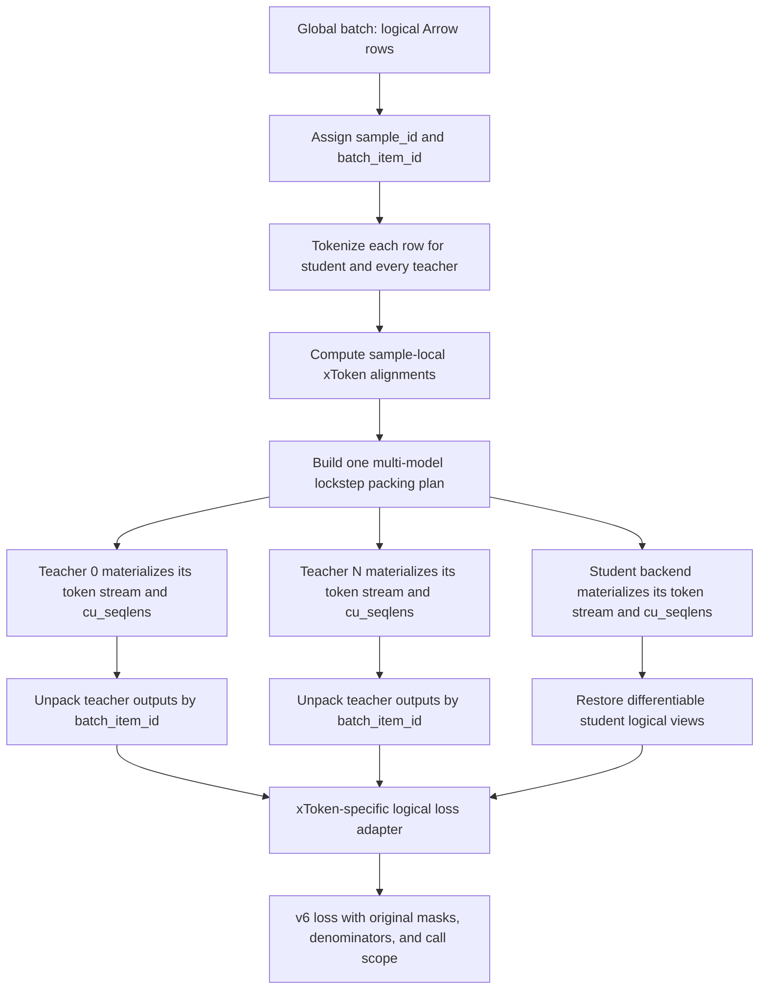

# Lockstep Sequence Packing for xToken Distillation

Status: Proposed

Target: `avenkateshha/xtoken-v6-loss`

Last updated: 2026-08-13

## Decision

xToken sequence packing will use one controller-owned, multi-model packing plan.
Every physical bin contains the same ordered logical samples for the student and
all teachers. Each model still tokenizes and materializes that bin independently,
so student and teacher token offsets, padding, cumulative lengths, and parallel
layouts are never shared.

This design replaces the earlier student-only proposal. It also rejects
independently repacking each teacher: a teacher and the student may have
different token lengths, but they must not silently disagree about which logical
samples a physical bin owns.

This is the authoritative physical-packing plan for the target branch.
Boundary-aware source segmentation is a separate preprocessing problem and is
not a substitute for the lockstep plan defined here.

The design applies to both DTensor V2 and Megatron at the control-plane level.
The two backends require different physical packing, unpacking, and parallelism
adapters. Initial DTensor support is limited to `CP=1`; Megatron `CP>1` is an
explicit acceptance target. DTensor `CP>1` is a later milestone, but its target
layout is still boundary-aware head-tail sharding rather than a contiguous
global split of the packed token stream.

## Why xToken Needs a Shared Plan

Ordinary sequence packing assumes one tokenization per sample. xToken carries
one student tokenization and zero or more different teacher tokenizations, plus
sample-local alignment metadata. Packing independently inside each `Policy`
call is therefore insufficient:

- a first-fit decision based on student lengths can differ from one based on
  teacher lengths;
- the student and teachers can have different data-parallel layouts;
- current CUDA IPC aggregation reconstructs samples positionally;
- the generic packed-loss wrapper assumes every tensor's second dimension is
  the student sequence axis;
- the v6 loss contains nonlinear scaling and optional data-parallel teacher
  scoring whose call scope must not change accidentally.

The current scalar packer in
[`BatchedDataDict.shard_by_batch_size`](../../nemo_rl/distributed/batched_data_dict.py)
is policy-local and accepts only one `input_lengths` vector. Both teacher IPC
entry points in [`Policy`](../../nemo_rl/models/policy/lm_policy.py) explicitly
reject sequence packing. This proposal adds a shared logical control plane and
keeps backend-specific tensor transformations behind `Policy`.

## Goals

1. Treat one original Arrow row as one logical sample.
2. Preserve a durable sample identity and a unique identity for each occurrence
   in a global batch.
3. Pack the same ordered sample membership for the student and every teacher.
4. Enforce every model's real token capacity and backend padding constraints.
5. Prevent attention and next-token targets from crossing logical-sample
   boundaries.
6. Return teacher outputs to the existing per-logical-sample xToken contract.
7. Preserve v6 loss, gradient, normalization, metric, and collective semantics.
8. Support dense and sparse teacher IPC through explicit staged milestones.
9. Support Megatron context parallelism, including a required `CP=2` parity
   gate, without claiming DTensor context-parallel support prematurely.

## Non-goals

- Character-count grouping is not part of physical sequence packing.
- This proposal does not infer sentence boundaries inside a text field.
- This proposal does not split oversized Arrow rows. Oversized rows require a
  separate document-chunking policy before xToken tokenization and alignment.
- It does not make `data.num_packed_rows` greater than one. That collator option
  is a separate data-format feature and remains `1`.
- It does not make dynamic batching compatible with sequence packing.
- It does not introduce a fused xToken loss. The existing packed fused-loss path
  supports `LOGPROB`, while xToken requires logits and independent teacher axes.

## Terminology

- **Source row**: one original Arrow record.
- **Logical sample**: the unit independently tokenized, aligned, masked, and
  scored. In this design it is one source row.
- **`sample_id`**: durable identity of the logical source row.
- **`batch_item_id`**: unique identity of one occurrence in one global batch.
- **Loss cohort**: the logical samples that would have formed one loss call in
  the unpacked run. With the current xToken `train_micro_batch_size=1`, every
  logical sample is its own cohort.
- **Physical bin**: several logical samples concatenated for one model forward.
- **Side**: the student or one teacher. Every side has its own tokenizer,
  capacity, backend, and parallelism constraints.
- **Raw cumulative lengths**: offsets over valid tokens for logical reassembly.
- **Padded cumulative lengths**: offsets over physical packed storage after
  backend-required per-sample padding.

## Dataset Contract

### One Arrow row is one logical sample

The target dataset contract uses the Arrow record boundary as the only known
sample/document boundary. Text inside a row is opaque; punctuation and
paragraphs do not create additional samples.

This contract does not claim that every Arrow row is an unchunked source
document. It uses the only boundary encoded by the input schema.

`characters_per_sample` currently accumulates complete rows until a character
threshold is reached and joins them with newlines in
[`ArrowTextDataset._pack_generator`](../../nemo_rl/data/datasets/response_datasets/arrow_text_dataset.py).
It neither slices a continuous stream into fixed character multiples nor
preserves the constituent row boundaries. Accurate row-aware sequence packing
therefore requires:

```yaml
data:
  num_packed_rows: 1
  train:
    characters_per_sample: null
```

If a source row exceeds any model's individual context capacity, setup or
collation must fail with the offending `sample_id`. Independently truncating the
same text with different tokenizers can retain different source-character
spans, so truncation must not be used to make an overflowing sample appear
packable.

### xToken SFT distillation with different chat templates

For chat or SFT data, one complete conversation row remains one logical sample.
System, user, assistant, and tool turns inside that conversation are not
physical-packing boundaries: assistant tokens must still be able to attend to
the system prompt, user prompt, and earlier turns in the same conversation.
Sample-aware cumulative lengths and position resets therefore occur between
conversations, not between messages.

xToken must retain the raw role/content messages until the cross-tokenizer
collator. The student and every cross-tokenizer teacher independently apply
their own chat template and tokenizer before the shared planner runs. The fully
rendered token lengths, including model-specific headers, role markers,
BOS/EOS/EOT tokens, tool scaffolding, and other template additions, are the
lengths used for capacity checks. A student-rendered string must never be reused
as a teacher's input merely because the models received the same raw messages.
Reuse is valid only when the tokenizer, chat template, and template arguments
are all identical.

For the current xToken path, this means using `kd_data_processor` to preserve
raw messages and `CrossTokenizerCollator` with `mode="chat"`. The ordinary
single-tokenizer `sft_processor` renders and tokenizes earlier in the pipeline;
feeding its output into the xToken chat path would either double-apply a
template or force the student's rendered scaffold onto the teachers.

For a bin containing conversations `A` and `B`, model `m` materializes:

```text
tokens_m:       [ rendered(A, template_m) | rendered(B, template_m) ]
cu_seqlens_m:   [ 0, len_m(A), len_m(A) + len_m(B) ]
position_ids_m: [ 0 .. len_m(A)-1          | 0 .. len_m(B)-1 ]
```

Do not conflate the packed sample base with the start of source content. For
sample `i` in one side, `cu_seqlens_m[i]` is the base of the *complete rendered
conversation*, including its BOS and template prefix. That is the attention and
position-reset boundary. Source content excluding template scaffold is not
generally one contiguous interval in a multi-turn conversation: headers and
end-of-turn markers occur between system, user, assistant, and tool content.
Represent it as per-turn semantic regions instead:

```text
(batch_item_id, turn_index, role, region_name)
    -> side-local rendered token span [start_m, end_m)
    -> packed span [cu_seqlens_m[i] + start_m,
                    cu_seqlens_m[i] + end_m)
```

At minimum, retain assistant-content regions and any explicit EOT target used
by xToken. Tool-call training additionally needs regions for the function name,
arguments, and tool result. Keep alignment metadata in the side-local coordinate
space; use the packed span only to select forward outputs, then restore the
side-local view before loss. These KD regions are separate from the student SFT
supervision mask.

The ordered membership `[A, B]` is shared across all sides, but the cumulative
offsets generally differ because their templates and tokenizers differ. The
student `token_mask` must match the chosen unpacked SFT baseline's assistant
generation mask; `sample_mask` remains one scalar per conversation occurrence.
Teacher prompt and scaffold tokens remain part of the teacher forward context
even when the xToken alignment and KD targets cover only semantic assistant
regions.

The current chat aligner already finds the same assistant content inside the two
different rendered strings, constructs alignment pairs independently for each
assistant message, and translates them to positions in each side's complete
rendered conversation. Template-only role markers and prompt scaffolding remain
unaligned; when detectable on both sides, each side's possibly different EOT
token is added as an explicit paired target. Keep those pairs in
logical-sample coordinates, pack all associated fields by `batch_item_id`, and
restore the logical conversation before next-token shifting and the xToken
loss. No packed-bin-global span or chunk-ID rebasing is required.

The current xToken chat collator builds the student CE mask from raw assistant
content only, while the ordinary SFT path masks the rendered assistant message
chunk. Before claiming SFT parity, make this policy explicit and compare against
the intended unpacked baseline. The recommended representation keeps two
independent products: a template-derived student SFT mask for CE, and
template-free semantic regions for cross-tokenizer KD. Model-specific role
headers need not be cross-token aligned merely because the student trains them;
semantically paired stop/EOT targets can be aligned explicitly.

The current chat collator tokenizes with `truncation=True`. The packed path must
instead obtain exact untruncated post-template lengths for every side and fail
or invoke an explicit upstream conversation-splitting policy when one side
overflows. Tool-aware templates also require each sample's `tools` metadata to
be preserved and passed to every side's `apply_chat_template`; the current
xToken chat collator does not yet do that. Native-thinking region alignment is
likewise a guarded follow-up rather than an implicit consequence of packing.

Tool support is staged but must fail closed:

1. Extend `DatumSpec` with optional `tools` and preserve a defensive copy in
   `kd_data_processor`, together with the structured messages and stable sample
   identity.
2. Pass the same canonical per-row tool schema to the student and every teacher
   `apply_chat_template` call. Each side still uses its own configured template
   and template arguments. Tool-schema/scaffold tokens count toward that side's
   exact capacity and remain attention context, but are not automatically KD
   targets.
3. Preserve message-level `tool_calls` and `tool` responses. Introduce semantic
   target regions for assistant text, tool name, tool arguments, and EOT, then
   map each region into every side's rendered token coordinates before xToken
   alignment.
4. Until step 3 is implemented and tested, reject assistant turns whose target
   exists only in `tool_calls` (for example `content=None`) instead of silently
   producing no CE/KD target. Supplying `tools` only as prompt context remains a
   valid earlier milestone.

### Identity

The current collator carries `idx`, but that value is a post-processing position
and is dropped before teacher export. The packed path needs two identities:

1. `sample_id` is created before filtering/splitting removes source provenance.
   When the source has no explicit ID, derive it deterministically from the
   dataset namespace and stable raw-row ordinal. Preserve an upstream UUID when
   one exists.
2. `batch_item_id` is assigned centrally after global-batch validation padding
   and before packing. It is unique for every occurrence, for example
   `(batch_uid, canonical_slot)` encoded as an integer or fixed record.

Validation-padding copies keep the same `sample_id`, receive distinct
`batch_item_id` values, and carry `sample_mask=0`. Routing and IPC joins use
`batch_item_id`, never `sample_id`, because legitimate repeated examples can
share a semantic identity.

### Masks and boundaries

For a physical bin with `N` logical samples:

- `sample_mask` has `N` values, one per logical sample;
- the student `token_mask` remains on the student token axis;
- every cross-tokenizer teacher retains its own token mask;
- model-specific cumulative lengths provide block-diagonal attention;
- next-token shifting occurs only after restoring logical-sample boundaries.

`sample_mask` is loss metadata. It does not isolate attention. Cumulative
lengths isolate attention, but they do not automatically mask loss numerators.
Every CE, KD, teacher-score, valid-token, valid-chunk, and metric accumulator
must explicitly respect `sample_mask`.

## End-to-End Architecture



The physical forward is packed. The xToken loss continues to reason about
logical samples and sample-local alignment coordinates.

## Shared Packing Plan

### Internal representation

Use typed, immutable internal records rather than dictionaries with implicit
fields:

```python
@dataclass(frozen=True)
class SidePackingPlan:
    side_id: str
    capacity: int
    raw_lengths: tuple[int, ...]
    effective_lengths: tuple[int, ...]
    raw_cu_seqlens_by_bin: tuple[tuple[int, ...], ...]
    padded_cu_seqlens_by_bin: tuple[tuple[int, ...], ...]
    physical_tokens_by_bin: tuple[int, ...]
    rank_bin_indices: tuple[tuple[int, ...], ...]


@dataclass(frozen=True)
class LockstepPackingPlan:
    batch_uid: int
    canonical_batch_item_ids: tuple[int, ...]
    bins: tuple[tuple[int, ...], ...]
    sides: Mapping[str, SidePackingPlan]
```

`bins` is authoritative and stores canonical item ordinals or IDs. Every side
must validate that it materialized exactly those IDs in exactly that order. A
side plan supplies only model-specific geometry; it cannot add, remove, or
repack logical samples.

### Effective token cost

For logical sample `i` and side `m`:

```text
L[i,m] = valid tokens produced by model m's tokenizer
E[i,m] = L[i,m] after model/backend per-sequence rounding
B[m]   = packed token capacity for side m
```

The student uses `sequence_packing.train_mb_tokens`. A teacher logits export
uses that teacher's `sequence_packing.logprob_mb_tokens`.

A candidate bin is feasible only when every side satisfies its complete
physical-size function:

```text
physical_size(m, candidate_items) <= B[m]
```

This is deliberately stronger than `sum(raw_lengths) <= capacity`.
`physical_size` includes:

- the side's `make_sequence_length_divisible_by`;
- backend-required per-sample causal-CP head-tail padding, including Megatron's
  current `2 * CP` rule and the corresponding rule chosen for a future DTensor
  sample-aware CP adapter;
- Megatron TP padding when sequence parallelism is enabled;
- packed-total FP8 or HybridEP divisibility;
- fixed packed-tail sizing required by pipeline parallelism;
- any DTensor packed-total constraint required by TP.

A same-tokenizer teacher may reuse the student's raw token IDs and lengths, but
it still receives its own `SidePackingPlan` because its backend, padding, and
capacity can differ.

### Deterministic multi-dimensional binning

The planner executes once on the controller after all exact token lengths are
known. A correctness-first implementation should be deterministic:

1. Start from canonical logical-sample order within each DP shard.
2. Calculate each sample's normalized pressure
   `max_m(E[i,m] / B[m])`.
3. Use a stable multi-dimensional first-fit-decreasing strategy, or an
   order-preserving strategy when exact loss-call ordering requires it.
4. Place a sample only when every side's `physical_size` remains within budget.
5. Preserve one explicit ordered item list per bin.
6. Recompute and validate every side's raw and padded cumulative lengths.

The initial implementation pins one supported algorithm. It must not reuse the
existing policy-local random or scalar packing choice under the same config
name.

### Concrete tokenizer example

For the first ten rows of the smoke Arrow data, the observed lengths were:

| Row | Characters | Nano3.5 student tokens | Qwen3-30B teacher tokens |
|---:|---:|---:|---:|
| 0 | 3,226 | 585 | 575 |
| 1 | 1,919 | 388 | 382 |
| 2 | 1,655 | 323 | 322 |
| 3 | 1,265 | 375 | 431 |
| 4 | 407 | 106 | 104 |
| 5 | 2,636 | 730 | 770 |
| 6 | 5,613 | 1,226 | 1,175 |
| 7 | 1,335 | 288 | 279 |
| 8 | 2,331 | 436 | 419 |
| 9 | 1,344 | 246 | 239 |

With a 4,096-token capacity on both sides, an order-preserving shared plan can
produce:

```text
bin 0 IDs: [0,1,2,3,4,5,6,7]
student used: 4,021     teacher used: 4,038

bin 1 IDs: [8,9]
student used:   682     teacher used:   658
```

The memberships are identical, but the boundaries are not:

```text
student cu: [0,585,973,1296,1671,1777,2507,3733,4021]
teacher cu: [0,575,957,1279,1710,1814,2584,3759,4038]
```

In this CP=1 example with no additional backend rounding, only the bin tail is
storage padding. Megatron CP/SP and future sample-aware DTensor CP may also
pad each sample before concatenation. In every case, each row remains a
separate attention and loss sample.

## Global Batch Size and Data Parallelism

### GBS counts logical samples

`train_global_batch_size=48` means 48 logical Arrow rows, not 48 physical bins.
Packing may turn those rows into 7, 8, or another number of physical forwards,
but it must not change:

- the optimizer's global batch semantics;
- the global valid-sample count;
- the global valid-token and valid-chunk denominators;
- the number of semantic dataset examples consumed.

For an entity running on 16 GPUs:

```text
DP = 16 / (TP * CP * PP)
```

For example, `TP=4, CP=1, PP=1` gives `DP=4`, so each DP rank owns 12 of
the 48 logical samples before physical packing. `TP=4, CP=2, PP=1` gives
`DP=2`, so each DP rank owns 24 logical samples.

### Schedule bins, not samples

The correctness-first plan first assigns the canonical logical DP shard, then
packs within that shard. This preserves sample ownership, node-local teacher
IPC placement, and the unpacked loss schedule. Every model receives the same
logical DP assignment.

Every rank in one entity must execute the same number of physical bins. Suppose
`DP=4` and per-rank packing initially yields `[2, 2, 2, 1]` bins: the global
count is 7. The controller deterministically splits one multi-sample bin on the
fourth shard, producing `[2, 2, 2, 2]`, or 8 global bins. Splitting is always
capacity-safe because each result is a subset of a previously feasible bin.

If a shard has too few real logical samples to reach the required bin schedule,
the initial implementation fails setup. A later implementation may add an
explicit all-masked dummy bin, but it must never duplicate a valid loss
contribution merely to equalize forward counts.

The split happens once in `LockstepPackingPlan`. If sample `batch_item_id=31`
is removed from a multi-sample bin to form the eighth bin, that same ID is
removed for the student and every teacher. Each side then recomputes its own
cumulative lengths. No `Policy` may independently "take a sequence out" to
repair its local schedule.

Physical bin `k` is routed consistently to the corresponding DP rank for all
policies in the first implementation. The current multi-node CUDA IPC contract
already requires compatible, node-local student/teacher layouts, so Phase 1
requires equal student and teacher DP. Support for differing DP degrees is a
later extension requiring ID-based redistribution and a bin count compatible
with all involved DP grids.

## Backend Materialization

### DTensor V2

The existing Automodel path flattens a microbatch to `[1, T]`, resets position
IDs, and provides packed attention metadata in
[`process_microbatch`](../../nemo_rl/models/automodel/data.py). The xToken
adapter can reuse this representation after replacing policy-local binning with
the supplied side plan.

Initial DTensor scope:

- causal transformer models;
- `CP=1`;
- sequence parallelism disabled initially;
- TP=1 and TP>1 covered by parity tests;
- pipeline parallelism remains unsupported by the DTensor backend.

DTensor currently rejects sequence packing with `CP>1` in
[`automodel/setup.py`](../../nemo_rl/models/automodel/setup.py). DTensor CP
packing is a separate later milestone requiring packing-aware CP sharding,
autograd-safe student reconstruction, raw/padded boundary plumbing, and
attention parity. It is not enabled by weakening the current guard.

The causal-load-balancing rule itself is not Megatron-specific. DTensor V2
enters PyTorch `context_parallel` through AutoModel's
[`create_context_parallel_ctx`](../../3rdparty/Automodel-workspace/Automodel/nemo_automodel/components/distributed/cp_utils.py).
For an ordinary causal sequence, PyTorch's default head-tail load balancer
divides the sequence into `2 * CP` chunks and assigns rank `r` chunks `r` and
`2 * CP - r - 1`. At `CP=2`:

```text
logical order: [C0 | C1 | C2 | C3]
CP rank 0:      [C0 | C3]
CP rank 1:      [C1 | C2]
```

Pairing early, inexpensive queries with late, expensive queries balances
causal-attention work. A contiguous half split would give equal token counts
but unequal causal work.

That existing DTensor path is not sufficient for xToken physical packing. It
removes the explicit attention mask and treats its input as one continuous
causal sequence; it does not consume the logical-sample cumulative lengths.
Removing the setup guard for a packed stream `[A | B]` would therefore permit B
to attend to A. DTensor packed CP must instead use one of these sample-aware
implementations:

1. wire AutoModel's Transformer Engine THD path, which consumes padded
   cumulative lengths and calls `thd_get_partitioned_indices`; or
2. integrate PyTorch's `PerDocumentHeadTailLoadBalancer`/block-mask CP support.

“Document” in that PyTorch API name means an independent causal-attention
segment. Under this design's dataset contract, that segment is exactly one
logical sample (one Arrow row). It does not imply discovering or preserving
sentence, paragraph, or nested-document boundaries inside the row.

Either implementation must use each model's own cumulative lengths, apply the
same indices to tokens, positions, labels, masks, and student-aligned xToken
metadata, and restore differentiable student outputs to logical-sample order.
The contiguous `capacity / CP` packed-stream split is not an accepted fallback.

Nano3.5 requires an additional model-specific phase. The force-HF model must
actually pass packed attention boundaries to its attention kernels, and its
Mamba convolution and SSM paths must receive a sequence identifier that resets
state at every logical boundary. `cu_seqlens` alone cannot isolate recurrent
state when the model ignores it. Until output and gradient isolation tests pass,
DTensor Nano3.5 packing remains disabled.

### Megatron

Megatron is closer to the required physical representation. The existing
[`_pack_sequences_for_megatron`](../../nemo_rl/models/megatron/data.py)
constructs:

- THD packed tensors;
- raw and padded cumulative lengths;
- per-sequence CP padding and CP sharding;
- `PackedSeqParams` for attention;
- `total_tokens`, which allows MCore to construct `seq_idx` for intended Mamba
  state resets.

The shared side plan must feed this existing materializer rather than duplicate
it. Megatron's effective-size calculation must include the padding rules in
`_get_pack_sequence_parameters_for_megatron`.

The current materializer returns raw and padded cumulative lengths separately,
but its `PackedSeqParams` construction uses the padded vector for all q/kv
cumulative-length fields. xToken postprocessing and loss preparation must not
infer raw logical lengths from that object. Phase 3 explicitly preserves both
boundary sets through teacher unpacking and differentiable student
reconstruction.

Megatron rollout order:

1. transformer TP=1, CP=1;
2. TP>1 and sequence parallelism;
3. CP=2 dense-IPC parity, required before declaring Megatron xToken packing
   generally available;
4. pipeline parallelism and its fixed packed-tail size;
5. larger CP values and supported FP8/HybridEP combinations;
6. Mamba/Nano only after numerical state-isolation and gradient tests.

Megatron's existing structure indicates CP and Mamba support, but structure is
not numerical proof. Each topology is guarded until its parity test passes.

## Teacher Forward and IPC Contract

The least disruptive transport contract remains one teacher result per logical
sample.

For each teacher bin:

1. Materialize the packed teacher stream from its `SidePackingPlan`.
2. Run one packed forward.
3. Slice the output with that teacher's padded physical offsets and raw valid
   lengths.
4. Store one per-logical-sample dense or sparse result in persistent IPC
   storage.
5. Attach `batch_item_id` and the existing TP/CP shard metadata.
6. Aggregate TP/CP shards by `batch_item_id`.
7. Canonicalize results to `LockstepPackingPlan.canonical_batch_item_ids` and
   assert that every real item occurs exactly once.

[`aggregate_per_sample_handles`](../../nemo_rl/models/policy/utils.py) currently
assumes sorted DP rank plus local position recreates global order. The packed
path must use explicit IDs instead.

### Dense IPC

Both DTensor and Megatron full-logit postprocessors currently reject packing.
Their packed implementations should mirror the existing top-k unpacking paths:

- use the teacher's own boundaries;
- preserve local vocabulary shards under TP;
- restore the teacher's raw valid length;
- invert the backend-native head-tail/THD permutation to logical order under
  CP, then emit contiguous per-sample IPC slices where the existing schema
  requires them;
- publish stable per-sample handles only after IPC storage is fully allocated.

Variable bin cardinality must not trigger buffer growth after handles have been
published, because reallocation invalidates prior CUDA IPC handles. Preallocate
from the plan's maximum required storage or use a stable per-sample slab.

### Sparse IPC

DTensor sparse packing must unpack values, token IDs, `logZ`, forced-token
membership, and any support masks with exactly the same teacher boundaries.

Megatron sparse IPC is not implemented today. Its non-IPC packed top-k path is
a useful TP/CP reference, but xToken additionally needs globally correct top-k
IDs, `logZ`, forced IDs, and the current sparse handle schema. Sparse Megatron
support is a separate milestone after dense parity.

## Student Forward and xToken Loss Adapter

The generic
[`SequencePackingLossWrapper`](../../nemo_rl/algorithms/loss/wrapper.py) cannot
be used unchanged. It truncates every rank-two-or-higher tensor with the student
length, while xToken carries independent student-token, teacher-token, and
alignment-pair axes.

An xToken-specific adapter must:

1. Slice differentiable student logits using student raw/padded boundaries.
2. Restore logical rows in canonical `batch_item_id` order.
3. Retrieve each teacher's result by `batch_item_id`.
4. Preserve each teacher's `T_teacher` axis and alignment's pair axis.
5. Keep alignment chunk IDs and spans in sample-local coordinates.
6. Apply next-token shifting inside each logical sample.
7. Invoke the v6 loss at its original logical loss-call scope.
8. Aggregate metrics by semantic numerator/denominator, not by summing row
   means.

Any vocabulary preselection that scans a restored `[B, T]` rectangle must mask
padding before choosing columns. Zero-filled padding reconstructed after a
packed forward is not guaranteed to reproduce the logits that an unpacked
padded forward would have produced.

No bin-global alignment rebasing is necessary because packed coordinates are
removed before xToken preparation. This also prevents a final token in sample A
from predicting the first token in sample B.

### v6 loss-call scope

Packing is loss-equivalent only if the loss-call scope is preserved:

- CE and v6 chunk numerators remain additive when divided by the original
  global valid-token and valid-chunk denominators.
- `dynamic_loss_scaling` computes a detached CE/KD ratio per loss call.
- dynamic teacher weights and `select_teacher` perform data-parallel scoring
  collectives.

The current xToken configuration uses logical `train_micro_batch_size=1`.
Phase 1 restores one v6 invocation per original logical sample and retains the
same logical call count on every DP rank. Physical binning changes forwards, not
the semantic loss calls.

For `train_micro_batch_size>1`, the implementation must either keep each
original loss cohort atomic and call v6 once per cohort, or refactor v6 into
additive statistics followed by one nonlinear combine at the original scope.
Until that exists, packing with dynamic loss scaling requires logical MBS=1.

Initial support is restricted to collective-safe modes:

- `kd_loss_mode=sum` with static weights (`sum_weights_metric=null`);
- dynamic loss scaling only with logical MBS=1.

`averaged_logits`, `select_teacher`, and dynamic `sum_weights_metric` remain
guarded until their packed/unpacked parity tests pass. The latter two also need
an identical fixed collective schedule and loss-call cohort on every DP rank.
Full support must not rely on the fact that a particular binning happened to
produce equal row counts.

### Global normalization

`global_valid_seqs`, `global_valid_toks`, and per-teacher
`global_valid_chunks_by_idx` are computed from the original logical DP batch
before packed microbatch iteration. The same values are passed unchanged to
every logical loss call. They are never recomputed from packed tail padding or
the number of physical bins.

Existing DTensor and Megatron CP replication/scaling conventions remain
unchanged. If an adapter changes which tensors are replicated, its denominator
scaling must be re-derived and covered by the corresponding CP parity test.

Masked validation copies contribute to no numerator or denominator. The v6
chunk path must gate `pair_valid` and all derived chunk counts with
`sample_mask`, not only gate the precomputed denominator. Metrics such as
`num_valid_samples` must use `sample_mask.sum()` rather than the rectangular
batch dimension.

## Configuration and Setup Guards

The final feature reuses the existing per-policy `sequence_packing` blocks. No
new `data.num_packed_rows` interpretation is introduced.

When xToken packing is enabled:

1. Student and every teacher must enable sequence packing; mixed enabled and
   disabled policies are rejected.
2. Dynamic batching must be disabled for every side.
3. `characters_per_sample` must be null for the row-as-sample dataset contract.
4. `data.num_packed_rows` must remain `1`.
5. Exact, pre-truncation token lengths must be available for every side.
6. Every single logical sample must fit every side's individual context and
   packed capacity.
7. Every teacher must define the packed export budget used by the planner
   (`sequence_packing.logprob_mb_tokens`).
8. The shared algorithm is selected once by xToken; policies may not select
   different algorithms independently.
9. Multi-node CUDA IPC initially requires equal student/teacher DP and the
   existing node-local compatible model-parallel layout.
10. DTensor requires `CP=1`; sequence parallelism is disabled initially.
11. Megatron enables only topology combinations whose parity gates have passed.
12. `sequence_packing.fuse_loss` remains false for xToken.
13. Unsupported nonlinear teacher modes or logical MBS values fail during
    setup, before workers or clusters are created.

The implementation must fail loudly rather than silently fall back to
independent packing or untracked positional routing.

## Backend Support Matrix

| Capability | DTensor V2 | Megatron |
|---|---|---|
| Shared logical plan and IDs | Required common code | Required common code |
| Transformer packed forward | Existing base path, adapt to supplied plan | Existing THD path, adapt to supplied plan |
| TP | Test TP=1 and TP>1 | Test TP=1 then TP>1 |
| Sequence parallelism | Initially off; validate later for supported transformers | Staged after TP |
| CP=1 | Initial target | Initial target |
| CP>1 | Deferred sample-aware head-tail/THD work; keep current guard | In scope; CP=2 is a required acceptance gate |
| PP | Backend remains PP=1 | Staged after dense CP parity |
| Dense teacher IPC | Packed unpack/routing required | Packed unpack/routing required |
| Sparse teacher IPC | Packed unpack/routing required | New sparse producer/transport required |
| Nano3.5 attention | Boundary plumbing and parity required | Packed attention path intended; prove parity |
| Nano3.5 Mamba | Explicit conv/SSM reset plumbing required | `seq_idx` path intended; prove numerical isolation |
| xToken loss adapter | Required | Required |
| Fused packed loss | Unsupported | Unsupported |

The architecture therefore holds for both backends, but it is not one physical
implementation and it is not initially CP-complete on DTensor.

## Implementation Plan

### Phase 0: Reference semantics and setup guards

- Disable character grouping in a dedicated xToken packing recipe.
- Preserve raw structured chat messages, optional row-level `tools`, and the
  source identity through xToken preprocessing.
- Define the unpacked xToken SFT reference semantics: a student-template SFT
  mask for CE and template-free, sample-local semantic regions for KD.
- Reject tool-call-only assistant targets until their semantic region mapper is
  implemented; do not silently turn them into zero-target samples.
- Preserve or synthesize `sample_id` before dataset split/map operations.
- Add `batch_item_id` after validation padding.
- Add setup checks for uniform packing, oversize rows, dynamic batching, MBS,
  nonlinear loss modes, backend topology, and IPC locality.
- Capture packed-off loss, gradients, metrics, logits, IDs, and denominators as
  deterministic reference fixtures.

Exit criterion: the packed path is still disabled, and every unsupported
configuration fails before cluster creation with a precise message.

### Phase 1: Shared planner and plan-driven sharding

- Add immutable `LockstepPackingPlan` and `SidePackingPlan` records under the
  data-packing package.
- Add deterministic multi-dimensional feasibility and packing.
- Render each chat side with its own template, template arguments, tokenizer,
  and row-level tools before planning; retain per-turn semantic region maps and
  reject side-specific overflow without truncation.
- Preserve canonical DP ownership and equalize physical-bin counts by shared
  bin splitting.
- Add `BatchedDataDict.shard_by_packing_plan` or an equivalent explicit API.
- Pass side plans into teacher IPC calls and student `Policy.train`.
- Reject any worker-side attempt to recompute bin membership.

Exit criterion: CPU tests prove all capacities, identical bin membership/order,
the 7-to-8 split, deterministic routing, and ID coverage.

### Phase 2: DTensor transformer, CP=1

- Materialize supplied student and teacher side plans using the Automodel packed
  representation.
- Add dense packed teacher unpacking and ID-keyed IPC aggregation.
- Add the xToken-specific student loss adapter.
- Validate TP=1 and TP>1 with sequence parallelism off.
- Add sparse packed teacher IPC after dense loss/gradient parity.

Exit criterion: transformer packed/unpacked logit, loss, gradient, metric, and
attention-isolation parity at CP=1 for dense and then sparse teacher export.

### Phase 3: Megatron transformer, including CP=2

- Feed shared side plans into the existing THD materializer.
- Preserve raw and padded cumulative lengths separately through postprocessing
  and loss preparation.
- Implement dense TP/CP teacher unpacking and ID-keyed IPC.
- Validate TP=1, TP>1, sequence parallelism, then CP=2.
- Add PP only after CP dense parity.

Exit criterion: packed/unpacked loss and gradient parity at CP=1 and CP=2;
changing one logical sample cannot change another sample's logits.

### Phase 4: Backend-specific sparse and hybrid-model support

- Implement Megatron sparse IPC, including values, IDs, `logZ`, forced IDs, and
  CP routing.
- Thread packed boundaries through DTensor Nano3.5 attention.
- Thread sequence IDs through DTensor Nano3.5 convolution and SSM paths.
- Numerically validate Megatron Mamba state resets.

Exit criterion: dense and sparse xToken parity plus attention and recurrent-state
isolation for every declared model/backend pair.

### Phase 5: Extended parallelism

- Add Megatron PP and larger CP topology gates.
- Add supported FP8/HybridEP combinations.
- Implement DTensor CP packing with per-logical-sample head-tail partitioning,
  using TE THD or PyTorch sample-aware CP. Apply one permutation consistently
  to tokens, positions, labels, masks, and xToken student-axis metadata, and
  implement its inverse for output reconstruction. Retain the existing guard
  until output, loss, gradient, and isolation parity pass.
- Generalize ID routing to differing student/teacher DP only if transport and
  collective semantics support it.

Exit criterion: each enabled topology has a committed recipe and an end-to-end
nightly test. Untested matrix entries remain rejected.

## Test Plan

### Pure planner tests

- every bin contains the same ordered IDs for all sides;
- every side's complete physical-size function stays within capacity;
- raw and padded cumulative lengths are monotonic and end at the expected size;
- one sample that exceeds any side fails with its `sample_id`;
- deterministic output across repeated runs;
- GBS 48, DP 4, seven initial bins becomes eight by a shared split;
- validation duplicates retain semantic ID, receive unique occurrence IDs, and
  remain masked;
- same-tokenizer sides share raw lengths but retain independent physical plans.
- chat capacity uses each side's complete post-template length, including
  special/template tokens, and rejects side-specific overflow without
  truncation.
- tool schemas reach every side's chat template and change that side's exact
  length without changing shared bin ownership.

### Routing and IPC tests

- arbitrary row and bin permutations reconstruct canonical order by
  `batch_item_id`;
- TP/CP shards for one item assemble exactly once;
- missing, duplicated, stale, or wrong-bin IDs fail;
- dense packed output equals independent per-sample output;
- sparse values, IDs, `logZ`, forced support, and masks equal unpacked output;
- persistent IPC buffer handles remain valid for the complete step.

### Attention and state isolation

- perturbing sample A does not change sample B logits;
- packed logits equal independent forwards over every valid token;
- position IDs restart at every logical boundary;
- chat turns within one conversation retain causal visibility, while tokens in
  another packed conversation remain invisible;
- Megatron attention isolation passes at CP=1 and CP=2;
- deferred DTensor CP=2 tests assert per-sample head-tail membership and inverse
  permutation before comparing packed/unpacked logits and gradients;
- Mamba convolution and SSM state reset at every boundary;
- the same tests compare parameter gradients after the xToken loss.

### Loss and metric parity

- asymmetric `T_student != T_teacher != P` axes survive unpacking;
- packed/unpacked CE and v6 KD loss parity;
- packed/unpacked parameter-gradient parity;
- chat/SFT parity with different student and teacher templates, the intended
  unpacked student SFT mask, sample-local semantic KD regions, and multiple
  assistant turns;
- tool-schema-as-context parity and a fail-closed test for tool-call-only
  assistant targets until semantic tool regions are supported;
- static multi-teacher sum and same-vocab/direct-KL combinations;
- averaged-logits mode where supported;
- dynamic loss scaling parity at logical MBS=1;
- negative setup tests for unsupported MBS and nonlinear teacher modes;
- same-vocabulary top-k or vocabulary-column selection ignores restored padding;
- global valid-token/chunk denominators are invariant to packing;
- `sample_mask=0` removes every CE, KD, scoring, count, and metric contribution;
- metric numerators/counts yield the same reported values independent of bin
  cardinality;
- equal collective call order across DP ranks.

### Backend topology matrix

- DTensor transformer: TP=1 and TP>1, CP=1;
- DTensor future CP=2: validate per-sample head-tail indices, raw/padded
  boundaries, attention isolation, output reconstruction, and gradient parity
  before removing the guard;
- Megatron transformer: TP=1, TP>1/SP, CP=1, CP=2, then PP;
- dense IPC before sparse IPC for every new backend topology;
- mixed backend student/teacher combinations only after each individual side
  passes and node-local IPC constraints are satisfied;
- Nano/Mamba cases only after dedicated state-isolation tests.

## End-to-End Slurm Qualification Gate

The feature is not qualified by unit and parity tests alone. After those tests
pass, run two sequential Slurm smokes with the same production-size model pair:

- student: `meta-llama/Llama-3.1-8B`;
- teacher: `Qwen/Qwen3-14B`;
- 2 nodes x 8 GPUs, GBS 128, logical MBS 1, maximum sequence length 4,096;
- TP=2, CP=2, PP=1 for both sides;
- sequence packing enabled for the student and teacher, with 4,096-token packed
  train/export budgets unless measured memory requires a smaller explicitly
  documented common budget;
- dynamic batching disabled;
- `characters_per_sample=null` and `data.num_packed_rows=1`;
- static v6 teacher aggregation and logical MBS=1 unless a later phase has
  separately qualified broader loss modes.

Preflight the exact deterministic sample stream needed by both runs against
every side's untruncated effective length. The historical Arrow glob contains
some rows that can exceed a 4,096-token context. Do not hide them with tokenizer
truncation or re-enable character grouping. Use one explicit, reproducible
upstream row-splitting or all-side-fit filtering policy, record affected
`sample_id` values, and use the identical resulting stream for the five- and
100-step gates.

The primary CP=2 qualification route is Megatron because CP=2 is a required
Megatron acceptance target in this design. Do not substitute DTensor CP=2 unless
its separate sample-aware CP milestone and parity suite have already passed.

### Partition selection

Immediately before every launch, inspect both `interactive` and `batch_short`
on `cw-dfw`. Check node state and use a non-consuming scheduler preflight such
as `sbatch --test-only` for the exact node/GPU/time request. Select the partition
with the earliest admissible start; if both are immediate, prefer the one whose
time limit safely covers the run. Do not submit duplicate live jobs to race the
partitions, and do not fall back to another partition without user approval.

### Five-step gate and repair loop

Run five optimizer steps first with checkpointing and external logging disabled
unless they are themselves under test. A pass requires all of the following:

1. the resolved configuration proves packing is enabled on both sides, TP=2,
   CP=2, character grouping is null, collator-level row packing is one, and
   dynamic batching is disabled;
2. runtime packing telemetry proves that logical samples were actually combined
   into physical bins—the enabled flag alone is insufficient;
3. the log reaches `Step 5/5` and `Max steps reached` with finite loss, CE, KD,
   and gradient-related values;
4. no traceback, CUDA OOM, device assertion, actor death, fatal NCCL error,
   attention-boundary violation, NaN/Inf, or IPC-handle failure occurs;
5. Slurm/Ray teardown finishes cleanly.

Do not trust the parent Slurm state alone: some Ray launch paths can return zero
after a driver failure. Validate the driver log and semantic completion markers.
If the run fails, wait for the job and Ray workers to terminate, diagnose the
first causal failure, make the smallest correctness-preserving code/config/
launcher fix, run relevant unit tests, and submit a new uniquely named five-step
attempt. Never edit the shared checkout while an attempt is still running and
never repeatedly resubmit an unchanged failure.

### One-hundred-step gate

Only after a five-step attempt satisfies every criterion, run 100 steps with the
same model pair, topology, data, loss settings, and packing settings. Change only
the step/scheduler/checkpoint/logging fields required for the longer run. Save a
mid-run checkpoint when practical and require a finalized `step_100` checkpoint.
A pass requires all 100 finite metric records, semantic max-step completion, a
valid finalized checkpoint, no cross-sample leakage/fatal runtime errors, and
resolved-config plus packing-telemetry artifacts. Apply the same diagnose,
fix, unit-test, and uniquely named rerun loop until it passes or a genuine
external infrastructure blocker is demonstrated.

Record every job ID, partition, exact command/override set, commit and dirty-diff
identity, resolved config, driver/Slurm log paths, checkpoint path, result, and
failure diagnosis in the session experiment ledger.

## Observability

Add controller-side metrics that are independent of backend implementation:

- logical samples per global batch;
- physical bins per side and per DP rank;
- raw and padded tokens per side;
- bin utilization and tail-padding waste per side;
- splits performed only to equalize the DP schedule;
- masked logical samples;
- dense/sparse IPC bytes and reconstruction fallback counts.

Never report physical-bin count as sample count. Packing efficiency should be
reported separately for each side because identical membership can have very
different utilization under different tokenizers.

## Risks and Mitigations

### Shared bins can reduce one side's utilization

The joint constraint may create more bins than independently optimal packing.
Correct sample ownership is the priority. Measure utilization per side before
considering more complex routing.

### Long rows can be hidden by tokenizer truncation

The current collator uses `truncation=True`. Compute exact lengths before the
packing decision and fail or invoke an explicit upstream chunking policy. Do not
silently accept independently truncated tails.

### Nonlinear loss modes can change semantics

Guard unsupported modes until the adapter preserves original cohorts and a
fixed collective schedule. Do not call the complete v6 loss once per physical
bin.

### Packed teacher buffers can invalidate handles

Allocate stable storage before publishing handles and validate buffer generation
metadata during consumption.

### Hybrid models need more than attention boundaries

Mamba convolution and SSM state require explicit resets. Keep Nano/Mamba packing
disabled until perturbation and gradient tests prove isolation.

### Backend support can be overstated

Capability is topology-specific. Setup guards and recipes are removed only for
matrix entries with end-to-end parity coverage.

## Acceptance Criteria

The first generally usable release is complete when:

1. one Arrow row remains one logical sample with durable identity;
2. GBS and all global normalization semantics are unchanged by packing;
3. one authoritative plan controls student and teacher bin membership;
4. the 48-row/7-bin/DP schedule case is deterministic and shared;
5. attention, next-token labels, and hybrid-model state cannot cross samples;
6. teacher dense IPC and the xToken student adapter pass packed/unpacked loss and
   gradient parity;
7. DTensor transformer CP=1 passes TP coverage;
8. Megatron transformer passes CP=1 and CP=2 dense parity;
9. unsupported sparse, nonlinear-loss, Mamba, PP, or DTensor-CP combinations
   fail during setup rather than silently falling back;
10. every enabled backend/topology has a maintained recipe and test.
11. chat/SFT uses exact per-side rendered lengths and preserves semantic content
    regions independently of model-specific template scaffold;
12. row-level tools reach every side's template, while unsupported tool-call
    target alignment fails explicitly rather than silently dropping loss.
13. the packed Qwen3-14B to Llama-3.1-8B TP2/CP2 five-step gate passes, followed
    by a clean 100-step run with a finalized `step_100` checkpoint.

Sparse transport, Nano/Mamba, PP, differing DP, and DTensor CP become supported
only when their own later-phase exit criteria pass.
