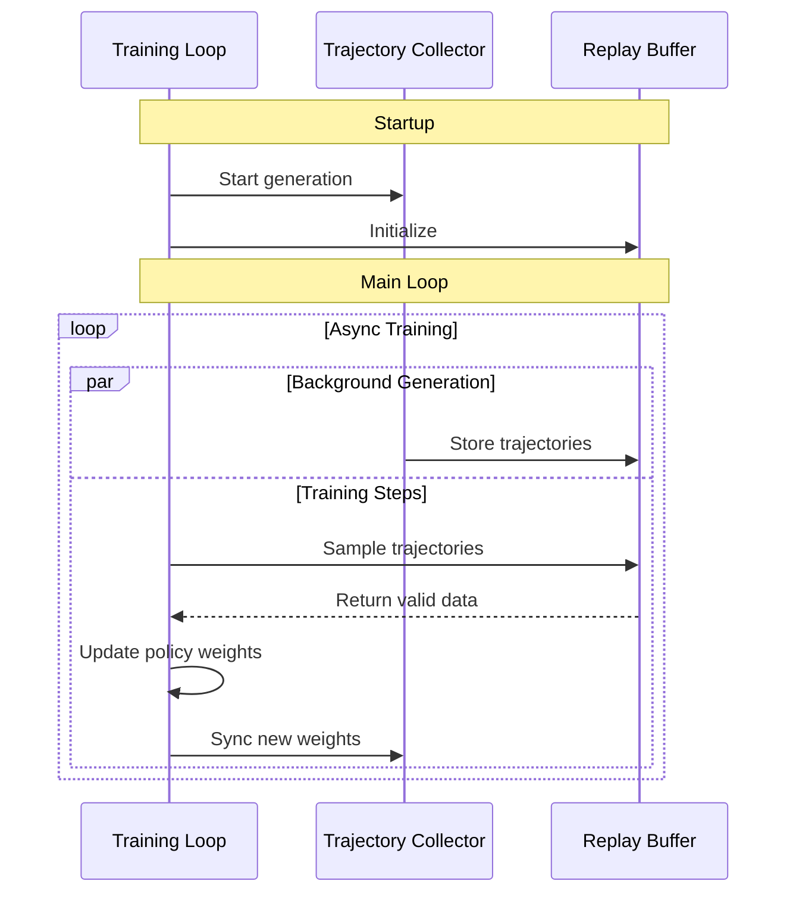

# Train with Async GRPO

Async GRPO is an asynchronous training mode that allows trajectory generation and policy training to run concurrently, improving GPU utilization and throughput compared to synchronous GRPO.

## Configure Async GRPO

This section covers how to configure async GRPO by modifying your settings and includes a complete example configuration.
### Enable Async GRPO

To use async GRPO, make these configuration changes:

1. **Enable vLLM async engine**:
```yaml
policy:
  generation:
    backend: "vllm"
    vllm_cfg:
      async_engine: true
```

2. **Enable importance sampling correction** (required for convergence):
```yaml
loss_fn:
  use_importance_sampling_correction: true
```

3. **Disable colocated inference** (required for async mode):
```yaml
policy:
  generation:
    colocated:
      enabled: false
      resources:
        num_nodes: 1  # or more
        gpus_per_node: 2  # adjust based on your setup
```

4. **Add async GRPO configuration**:
```yaml
grpo:
  async_grpo:
    enabled: true
    max_trajectory_age_steps: 1  # Maximum age, in training steps, for trajectories
    in_flight_weight_updates: false  # Enable for faster weight synchronization
    recompute_kv_cache_after_weight_updates: false # Invalidates kv cache after in-flight-weight-updates
```

### Complete Example Config
```yaml
policy:
  generation:
    backend: "vllm"
    colocated:
      enabled: false
      resources:
        num_nodes: 1
        gpus_per_node: 2
    vllm_cfg:
      async_engine: true

loss_fn:
  use_importance_sampling_correction: true

grpo:
  num_prompts_per_step: 32
  num_generations_per_prompt: 4
  async_grpo:
    enabled: true
    max_trajectory_age_steps: 1
    in_flight_weight_updates: false  # Enable for faster weight synchronization
    recompute_kv_cache_after_weight_updates: false # Invalidates kv cache after in-flight-weight-updates

cluster:
  num_nodes: 2
  gpus_per_node: 4
```

## Implementation Structure
This section covers the internal architecture of async GRPO and includes detailed explanations of how the core components interact.
### Core Components

The async GRPO implementation consists of three main components:

#### 1. Main Training Loop (`async_grpo_train` in `grpo.py`)
- Coordinates overall training process
- Samples trajectories from replay buffer
- Runs policy training steps
- Handles validation and checkpointing
- Manages weight synchronization between training and generation

#### 2. Async Trajectory Collector (`AsyncTrajectoryCollector` in `async_utils/trajectory_collector.py`)
- Runs in background Ray actor
- Continuously generates trajectories using current policy weights
- Manages generation scheduling and weight version tracking
- Handles pause/resume for weight updates and validation
- Coordinates with replay buffer for trajectory storage

#### 3. Replay Buffer (`ReplayBuffer` in `async_utils/replay_buffer.py`)
- Stores generated trajectories with metadata
- Tracks weight versions for both generation and intended training use
- Implements age-based filtering to prevent stale trajectories
- Provides sampling interface for training steps

### Weight Version Tracking

Async GRPO uses a weight versioning system:
- **Generation Weight Version**: The policy weights used to generate a trajectory
- **Target Weight Version**: The training step where the trajectory will be used
- **Max Trajectory Age**: How many steps old a trajectory can be before being discarded

Example with `max_trajectory_age_steps: 1`:
- Trajectory generated with weights v10 can be used for training steps v10 or v11
- At training step v12, trajectories from v10 are too old and discarded

### Coordination Flow

1. **Startup**: Trajectory collector starts generating trajectories in background
2. **Buffer Fill**: Training waits until buffer has sufficient trajectories
3. **Training Step**: 
   - Sample trajectories from buffer
   - Run policy training
   - Update weights and notify collector
4. **Weight Sync**: Collector pauses, waits for weight refit, then resumes
5. **Repeat**: Process continues with updated weights


### Architecture Diagram

The following sequence diagram illustrates the interactions between the three main components:



## Checkpointing

Async GRPO checkpoints the replay buffer alongside the rest of training state so that in-progress trajectory generation is not lost across restarts.

### What is saved

On each checkpoint, a `replay_buffer.pt` file is written next to the other checkpoint artifacts. It contains all trajectories currently in the buffer together with their weight and target versions, and the `last_target_weight_already_generated` watermark.

### Restore behaviour

On resume, the buffer is restored before the trajectory collector starts, then cleaned up as follows:

1. **Past targets dropped** — trajectories whose target step is earlier than the resume step are removed.
2. **Stale trajectories evicted** — if `max_trajectory_age_steps` is set, trajectories too old for their target step are removed.
3. **Incomplete targets kept** — target steps that still lack a full batch are kept in the buffer. The collector will *gap-fill* only the missing trajectories for those targets before moving on.
4. **Buffer truncated** — if the restored count exceeds `max_size`, the buffer is truncated, prioritising entries closest to the resume step.

### Gap-filling after restore

After a restore, `last_target_weight_already_generated` is reset to `current_training_step - 1` so the collector re-evaluates every target from the resume step onward. For each target it queries `get_trajectories_needed` and spawns only the workers required to complete the batch — previously buffered trajectories are reused and the collector does not regenerate them.

### Disabling replay-buffer restore

If no `replay_buffer.pt` file is found in the latest checkpoint directory, training starts with an empty buffer and waits for the collector to fill it before the first training step.

## Usage Tips

1. **Buffer Sizing**: The replay buffer size is automatically calculated as:
   ```
   buffer_size = num_prompts_per_step × max_trajectory_age_steps × 2
   ```

2. **Age Limits**: Start with `max_trajectory_age_steps: 1` and increase if needed for higher throughput

3. **Resource Allocation**: Ensure sufficient GPU memory for both the training and generation clusters

4. **In-Flight Weight Updates**: Enable `in_flight_weight_updates: true` when using `async_engine: true` for updating the weights of vLLM engine during generation. This prevents stalling training pipeline until longest generation finishes and provides significant performance benefits.

5. **Recompute KV Cache After Weight Updates**: While using in-flight weight update, user can choose whether to recompute
KV caches after weight udpate by configuring `recompute_kv_cache_after_weight_update` configuration.

## Why Importance Sampling Correction Is Required for Async

### The GRPO Objective

The standard GRPO loss function (without KL penalty) is:

$$
L(\theta) = E_{x \sim \pi_{\theta_{\text{old}}}} \Big[ \min \Big(\frac{\pi_\theta(x)}{\pi_{\theta_{\text{old}}}(x)}A_t, \text{clip} \big( \frac{\pi_\theta(x)}{\pi_{\theta_{\text{old}}}(x)}, 1 - \varepsilon, 1 + \varepsilon \big) A_t \Big) \Big]
$$

where:
- $\pi_\theta$ is the policy model we are currently optimizing
- $\pi_{\theta_{\text{old}}}$ is the previous policy model (from the beginning of this step)
- $A_t$ is the advantage estimate
- $\varepsilon$ is a clipping hyperparameter

In standard GRPO, we assume trajectories are sampled from $\pi_{\theta_{\text{old}}}$. However, in async GRPO, trajectories are actually sampled from $\pi_{\theta_{\text{generator}}}$, which is the policy weights from N training steps ago (where N ≥ 1 depending on `max_trajectory_age_steps`).

Without importance sampling correction, the GRPO objective becomes fundamentally incorrect:

1. **Incorrect probability ratios**: The ratio $\frac{\pi_\theta(x)}{\pi_{\theta_{\text{old}}}(x)}$ uses $\pi_{\theta_{\text{old}}}$ probabilities that were never actually used to generate the trajectories.

2. **Biased gradient estimates**: Since we're computing gradients based on samples from the wrong distribution, the policy updates become biased and can lead to instability.

When we enable importance sampling correction (`use_importance_sampling_correction: true`), we introduce the corrective term:

$$
\frac{\pi_{\text{training}}(x)}{\pi_{\text{generator}}(x)}
$$

This transforms our loss function to properly account for the distribution mismatch. The corrected objective becomes:

$$
L(\theta) = E_{x \sim \pi_{\theta_{\text{generator}}}} \Big[ \frac{\pi_{\text{training}}(x)}{\pi_{\text{generator}}(x)} \min \Big(\frac{\pi_\theta(x)}{\pi_{\theta_{\text{old}}}(x)}A_t, \text{clip} \big( \frac{\pi_\theta(x)}{\pi_{\theta_{\text{old}}}(x)}, 1 - \varepsilon, 1 + \varepsilon \big) A_t \Big) \Big]
$$

The importance sampling ratio $\frac{\pi_{\text{training}}(x)}{\pi_{\text{generator}}(x)}$ is effectively $\frac{\pi_{\theta_{\text{old}}}(x)}{\pi_{\theta_{\text{generator}}}(x)}$, which corrects for the N-step gap between the generator policy and the policy we assume we're sampling from.

This correction ensures that we have unbiased gradient estimates and stable convergence.
