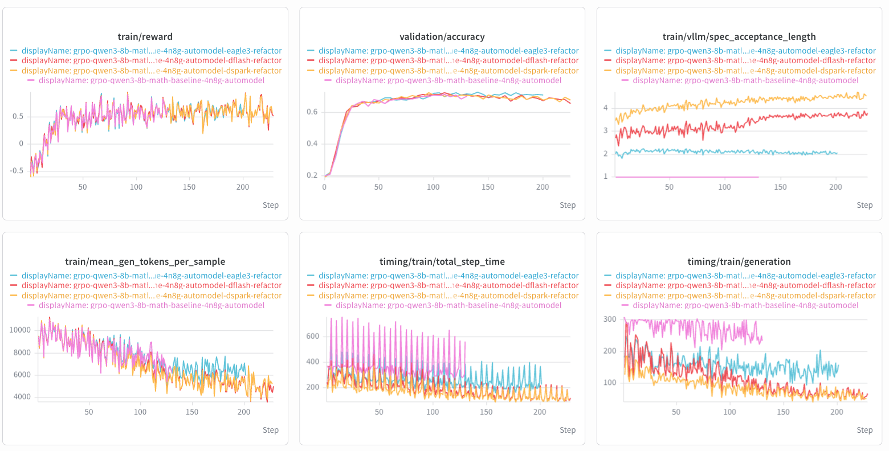
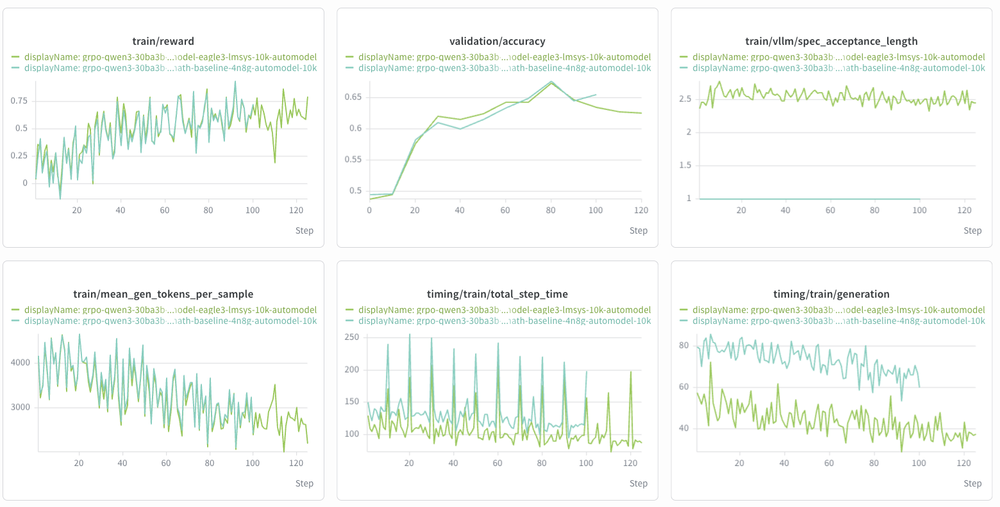

# Speculative Decoding Draft Co-Training on Automodel Backend

This guide covers draft-model co-training on the Automodel (DTensor v2)
backend: training a speculative-decoding drafter alongside the policy so it
tracks the policy's drift during RL, then refitting both into vLLM for
faster rollout generation.

This is the DTensor-v2 counterpart to the
[Eagle3 Speculative Decoding](eagle3-speculative-decoding.md) guide, which
covers the Megatron backend. Concepts (teacher signal, refit, why co-train at
all) are shared between the two guides; this one is specific to the
DTensor-v2 drafters and their config surface. For GRPO fundamentals, see the
[GRPO guide](grpo.md).

## Supported Drafters

| `policy.draft.algo` | Drafter family | Checkpoint examples | Requires |
| --- | --- | --- | --- |
| `"dspark"` | DSpark block drafter (multi-token block proposal) | `deepseek-ai/dspark_qwen3_8b_block7` | `policy.dtensor_cfg.enabled=true`, `policy.dtensor_cfg._v2=true` |
| `"dflash"` | DFlash block drafter (markov-free, confidence-free variant of DSpark) | `RedHatAI/*-speculator.dflash` | same as `dspark` |
| `"eagle3"` | EAGLE3 TTT (test-time-training) drafter | `RedHatAI/*-speculator.eagle3`, SGLang SpecForge native-flat checkpoints (e.g. `lmsys/SGLang-EAGLE3-*`) | DTensor v2 (this guide) **or** Megatron (see the [Eagle3 guide](eagle3-speculative-decoding.md)) |

All three algorithms train alongside the policy on the same rollout batch,
using the policy's own in-flight logits/hidden states as the distillation
teacher (not a separate frozen verifier), and stream `draft.*` weights into
vLLM on every refit so the next rollout speculates with the freshest drafter.

## Background

Speculative decoding needs a small drafter that stays well-aligned with the
serving policy to get useful acceptance rates. A drafter trained once and
never updated drifts out of sync as RL moves the policy's distribution,
degrading acceptance length over training. Co-training closes that loop:
the drafter is trained every step on the same data the policy trains on, and
refit alongside the policy so rollout always speculates with an
up-to-date drafter.

```text
rollout (policy samples responses)
  -> policy training forward pass
       -> hidden states / logits captured mid-forward (detached)
  -> draft forward: cross-attends captured hidden states,
     distills against the captured policy logits
  -> combined loss: policy_loss + loss_weight * draft_loss
  -> backward, optimizer.step (policy and draft param groups,
     each with its own learning rate)
  -> refit: policy.* AND draft.* weights sync to the vLLM
     generation workers together
  -> next rollout speculates with the updated drafter
```

The policy loss path is unaffected -- draft co-training only adds a second
term and captures already-computed intermediate policy tensors along the way.

## Design: What Comes From Automodel vs. NeMo RL

`nemo_rl/models/automodel/draft/` is a thin extension layer over
`nemo_automodel.components.speculative.*` (Automodel r0.6.0). The model
architectures, attention masks, and core loss math for all three drafters
are imported unchanged from Automodel -- they are deterministic,
teacher-agnostic computations, so a pretraining trainer and NeMo RL get
identical results from them. In particular, EAGLE3's network (attention,
decoder layer, embedding, `fc`, `lm_head`) is a direct subclass of
Automodel's `LlamaEagle3DraftModel`; NeMo RL does not reimplement the
attention math.

What stays local to NeMo RL, and why, falls into three groups:

- **RL-shaped teacher signal and normalization.** The draft's teacher is the
  policy's own live logits/hidden states (not a frozen verifier), anchor
  sampling has to respect RL rollout response boundaries instead of
  pretraining-corpus document boundaries, and loss normalization has to match
  NeMo RL's gradient-accumulation / context-parallel conventions rather than
  a standalone trainer's world-size scaling.
- **Training-loop and distributed-topology glue** (`draft/integration.py`):
  hooking into the policy's own forward pass to capture teacher
  hidden states/logits (there is no separate teacher forward pass), keeping
  gradient scaling consistent across microbatches and context parallelism,
  deterministic anchor sampling across TP replicas, coupled
  policy+draft checkpointing, and adapting third-party checkpoint formats
  (speculators, SGLang SpecForge) that a from-scratch drafter trainer has no
  reason to understand.
- **Wiring the RL main loop** (`nemo_rl/models/automodel/{setup,train}.py`,
  `nemo_rl/algorithms/loss/wrapper.py`,
  `nemo_rl/models/policy/{lm_policy,workers/dtensor_policy_worker_v2}.py`):
  building the draft optimizer param group, capturing teacher logits at the
  right point in the forward pass, combining the loss terms, config
  validation, and -- the step that actually makes co-training useful for
  RL -- streaming `draft.*` weights through the same refit path as the
  policy weights so the next rollout uses the updated drafter.

## Usage

Draft co-training requires the DTensor v2 backend:

```yaml
policy:
  dtensor_cfg:
    enabled: true
    _v2: true
```

### DSpark

```yaml
policy:
  draft:
    enabled: true
    model_name: deepseek-ai/dspark_qwen3_8b_block7
    algo: "dspark"
    loss_weight: 1.0
    dspark:
      num_anchors: 32
      learning_rate: 1.0e-04
      ce_loss_alpha: 0.1
      l1_loss_alpha: 0.9
      confidence_loss_alpha: 1.0
      loss_decay_gamma: 4.0
      train_embed_and_head: true
  generation:
    vllm_kwargs:
      speculative_config:
        method: "dspark"
        model: ${policy.draft.model_name}
        num_speculative_tokens: 7
        attention_backend: "FLASH_ATTN"
        draft_sample_method: "probabilistic"
```

### DFlash

Same shape as DSpark (both configure through the `dspark:` sub-block), but
DFlash checkpoints have no confidence head, so `confidence_loss_alpha` must
be `0.0`:

```yaml
policy:
  draft:
    enabled: true
    model_name: RedHatAI/Qwen3-8B-speculator.dflash
    algo: "dflash"
    loss_weight: 1.0
    dspark:
      num_anchors: 32
      learning_rate: 1.0e-04
      ce_loss_alpha: 0.1
      l1_loss_alpha: 0.9
      confidence_loss_alpha: 0.0
      loss_decay_gamma: 4.0
      train_embed_and_head: true
  generation:
    vllm_kwargs:
      speculative_config:
        method: "dflash"
        model: ${policy.draft.model_name}
        num_speculative_tokens: 7
        attention_backend: "FLASH_ATTN"
        draft_sample_method: "probabilistic"
```

### EAGLE3 (DTensor v2)

```yaml
policy:
  draft:
    enabled: true
    model_name: RedHatAI/Qwen3-8B-speculator.eagle3
    loss_weight: 1.0
    eagle3:
      learning_rate: 1.0e-04
      ttt_steps: 3
      ttt_step_loss_decay: 1.0
      train_embed_and_head: true
  generation:
    vllm_kwargs:
      speculative_config:
        method: "eagle3"
        model: ${policy.draft.model_name}
        num_speculative_tokens: 3
```

`algo` defaults to `"eagle3"` when omitted, so it can be left out (as in the
snippet above) unless you want it explicit for readability.

## Config Reference

`policy.draft`:

| Field | Description |
| --- | --- |
| `enabled` | Attach and train a draft model alongside the policy. |
| `model_name` | Pretrained draft checkpoint to start from. Required -- from-scratch draft init is not supported. |
| `algo` | `"eagle3"` (default), `"dspark"`, or `"dflash"`. |
| `loss_weight` | Weight on the auxiliary draft loss term. |

`policy.draft.dspark` (shared by `dspark` and `dflash`):

| Field | Default | Description |
| --- | --- | --- |
| `num_anchors` | `64` | Anchor blocks sampled per sequence each training forward. Draft-side transient memory scales with `num_anchors * block_size * vocab`; co-training shares the GPU with the full policy, so raise this only after confirming headroom (shipped recipes use `32` for larger/MoE runs, `64` for single-node dense runs). |
| `learning_rate` | `1e-4` | Draft param-group learning rate -- needs to be well above the policy's RL learning rate to track policy drift. |
| `ce_loss_alpha` | `0.1` | Cross-entropy weight against the rollout tokens. |
| `l1_loss_alpha` | `0.9` | Total-variation distillation weight against the policy's raw logits. |
| `confidence_loss_alpha` | `1.0` | Confidence-head BCE weight; must be `0.0` for `dflash` (no confidence head). |
| `loss_decay_gamma` | `4.0` | Exponential per-block-position decay on the loss mask. |
| `train_embed_and_head` | `true` | Train the draft's `embed_tokens`/`lm_head` instead of keeping the checkpoint copies frozen. |

`policy.draft.eagle3`:

| Field | Default | Description |
| --- | --- | --- |
| `learning_rate` | `1e-4` | Draft param-group learning rate. |
| `ttt_steps` | `3` | Test-time-training unroll depth. |
| `ttt_step_loss_decay` | `1.0` | Per-unroll-step loss decay factor. |
| `train_embed_and_head` | `true` | Train the draft's `embed_tokens`/`lm_head`. |

Architecture fields (block size, target layer ids, mask token id, aux capture
layers, `draft_vocab_size`, d2t/t2d vocab maps, markov/confidence head
layout, `norm_before_residual`) are always read from the draft checkpoint's
`config.json` -- only training options are set in the recipe.

## Limitations

- Not compatible with `policy.dtensor_cfg.sequence_parallel`,
  `policy.dtensor_cfg.lora_cfg.enabled`, or `policy.sequence_packing.enabled`.

## Recipe Coverage

Recipes for the Qwen3-8B control arm plus its three drafter siblings, and a
Qwen3-30B-A3B-2507-Instruct (EP32) EAGLE3 example, live under
`examples/configs/recipes/llm/`:

| Recipe | Drafter |
| --- | --- |
| `grpo-qwen3-8b-4n8g-automodel.yaml` | none |
| `grpo-qwen3-8b-4n8g-automodel-dspark.yaml` | DSpark |
| `grpo-qwen3-8b-4n8g-automodel-dflash.yaml` | DFlash |
| `grpo-qwen3-8b-4n8g-automodel-eagle3.yaml` | EAGLE3 |
| `grpo-qwen3-30ba3b-2507-instruct-4n8g-automodel.yaml` | none |
| `grpo-qwen3-30ba3b-2507-instruct-4n8g-automodel-eagle3.yaml` | EAGLE3 |

The Qwen3-8B dspark/dflash/eagle3 recipes run nightly
(`tests/test_suites/llm/grpo-qwen3-8b-4n8g-automodel-{dspark,dflash,eagle3}.sh`,
registered in `tests/test_suites/nightly.txt`), asserting on `draft_loss`
staying finite and improving, and on `spec_acceptance_length` reaching a
minimum bar.

## Results

### Qwen3-8B: dspark vs. dflash vs. eagle3 vs. no-draft baseline



`train/reward` and `validation/accuracy` are basically the same across all
four runs, so training a draft alongside the policy isn't costing any policy
quality here. The baseline has no drafter, so its `spec_acceptance_length`
just sits at 1; dspark and dflash land around 3.5-4, eagle3 around 2. The
speedup shows up in `timing/train/generation`: the more of the end-to-end
step time that rollout generation accounts for, the bigger the win from
speculative decoding.

### Qwen3-30B-A3B-2507-Instruct (MoE, EP32): eagle3 vs. no-draft baseline



Same story on the bigger MoE model. Reward and validation accuracy track the
baseline, eagle3's acceptance length settles around 2.3-2.7 against the
baseline's flat 1, and generation time is lower for the eagle3 run -- same
pattern, the speedup comes from generation, and matters more the longer the
response gets.
