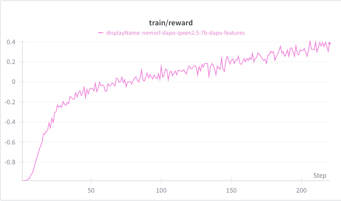
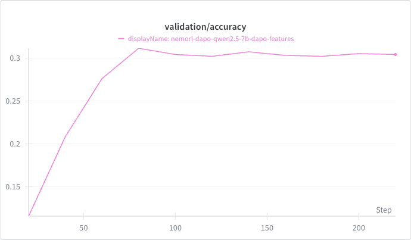

# An in-depth Walkthrough of DAPO in NeMo RL

This guide covers the [Decoupled Clip and Dynamic Sampling Policy Optimization (DAPO)](https://arxiv.org/pdf/2503.14476) implementation in NeMo RL.

DAPO introduces four key improvements over Group Relative Policy Optimization (GRPO):
1. **Clip-Higher**, which promotes the diversity of the system and avoids entropy collapse
2. **Dynamic Sampling**, which improves training efficiency and stability
3. **Token-Level Policy Gradient Loss**, which is critical in long-CoT RL scenarios
4. **Overlong Reward Shaping**, which reduces reward noise and stabilizes training

This document focuses on DAPO-specific features: Dynamic Sampling and Overlong Reward Shaping. For foundational concepts on GRPO including data handling, policy training, generation, and loss functions, see the [GRPO guide](grpo.md).


## Quickstart: Launch a DAPO Run

To get started quickly, use the example configuration [examples/configs/recipes/llm/dapo-qwen2.5-7b.yaml](../../examples/configs/recipes/llm/dapo-qwen2.5-7b.yaml). You can launch this using the same script as GRPO:

```bash
uv run examples/run_grpo_math.py --config examples/configs/recipes/llm/dapo-qwen2.5-7b.yaml {overrides}
```

**Reminder**: Don't forget to set your HF_HOME, WANDB_API_KEY, and HF_DATASETS_CACHE (if needed). You'll need to do a `huggingface-cli login` as well for LLaMA models.

## Dynamic Sampling

Standard GRPO trains on all generated responses, even when they have identical rewards (zero gradient signal) within a prompt group of generations. Dynamic sampling filters to keep only groups with diverse rewards (`std > 0`), and accumulates them across batches until reaching the target batch size. Dynamic sampling can be enabled by setting `use_dynamic_sampling=True` in your configuration. For implementation details, see the [`dynamic_sampling`](../../nemo_rl/algorithms/grpo.py) function. 

**Algorithm**: For each training step:

1. Sample `batch_multiplier × num_prompts_per_step` prompts from the dataset. The default value of `batch_multiplier` is 1.
2. Generate `num_generations_per_prompt` responses per prompt and compute rewards
3. Compute the baseline and standard deviation for each prompt group
4. Filter prompt groups where `std > 0`
5. Store these prompts in a cache until reaching the target training batch size of `num_prompts_per_step × num_generations_per_prompt` samples.
6. Samples are accumulated until the maximum number of allowed batches (`max_num_gen_batches`) is reached. If the cache still does not meet the target rollout batch size at that point, an error is raised. To resolve this, consider adjusting parameters such as `num_prompts_per_step` or `num_generations_per_prompt` to increase sample diversity, or revisit the complexity of your data.
7. Perform training on the collected samples with non-zero standard deviation

### A note on batch_multiplier

`batch_multiplier` (a float ≥ 1.0) controls the initial prompt pool size by sampling `batch_multiplier × num_prompts_per_step` prompts before dynamic sampling. Higher values increase memory and compute requirements, while very low values (e.g., 1.0) may slow the cache accumulation of prompt groups with non-zero standard deviation. The optimal value depends on the dataset, model capacity, and overall training setup.  When **dynamic sampling** is enabled, we also log two additional metrics:

 * `dynamic_sampling_num_gen_batches`: The number of generation rounds needed to reach `num_prompts_per_step * num_generations_per_prompt` many samples with nonzero standard deviation. If this value is consistently high, consider increasing `batch_multiplier`.
 * `dynamic_sampling_num_discarded_valid_samples`: The number of samples with nonzero standard deviation that get discarded because we've already exceeded `num_prompts_per_step * num_generations_per_prompt`. If this value is frequently high (e.g. above `0.5 * num_prompts_per_step * num_generations_per_prompt`) and `dynamic_sampling_num_gen_batches` is consistently 1, this indicates that a large fraction of the dataset is being thrown away unnecessarily. To improve data efficiency, consider decreasing `batch_multiplier`. 

## Reward Shaping
DAPO introduces an overlong reward shaping mechanism to reduce reward noise and stabilize training. This approach penalizes responses that exceed a specified length threshold, helping to prevent the model from generating excessively long outputs while maintaining solution quality.

For a detailed explanation of the overlong reward shaping mechanism, please refer to Section 3.4 of the [DAPO paper](https://arxiv.org/pdf/2503.14476). For implementation details, see the [`apply_reward_shaping`](../../nemo_rl/algorithms/reward_functions.py) function.

## Configuration

```yaml
grpo:
  use_dynamic_sampling: true  # Enable DAPO dynamic sampling
  num_prompts_per_step: 512   # Target number of prompts per training step
  num_generations_per_prompt: 16  # Generations per prompt
  batch_multiplier: 3    # Dataloader batch size = batch_multiplier × num_prompts_per_step
  max_num_gen_batches: 10     # Maximum number of batches to be used for accumulating non-zero std prompts
  reward_scaling:
    enabled: true
    source_min: 0.0
    source_max: 1.0
    target_min: -1.0
    target_max: 1.0
  
  reward_shaping:
    enabled: true
    overlong_buffer_length: 4096     # Threshold before penalties apply (paper uses 4096)
    overlong_buffer_penalty: 1.0     # Penalty per excess token
    max_response_length: 20480       # Hard maximum generation length
```

**Key Parameters:**
- **`use_dynamic_sampling`**: When enabled, activates DAPO's dynamic sampling algorithm to filter and accumulate prompt groups with non-zero standard deviation
- **`batch_multiplier`**: Factor that scales the initial prompt pool size for sampling
- **`max_num_gen_batches`**: Maximum number of batches to be used for accumulating non-zero std prompts
- **`reward_scaling`**: When enabled, clamps each reward in the batch to [source_min, source_max] and linearly rescales it to [target_min, target_max]. Defaults: source_min=0.0, source_max=1.0, target_min=0.0, target_max=1.0.
- **`reward_shaping`**: When enabled, applies the overlong penalty mechanism described in the Reward Shaping section above. Responses exceeding `max_response_length - overlong_buffer_length` receive penalties proportional to their excess length, helping to reduce reward noise and stabilize training.

> [!NOTE]
> When dynamic sampling is enabled, monitor the `filtered_reward` metric to track the average reward of the prompts with std > 0.

> [!NOTE]
> **Clip-Higher** and **Token-Level Policy Gradient Loss** are already supported in NeMo RL and can be configured through the `loss_fn` section of your experiment config:
> - Set `ratio_clip_max` to enable Clip-Higher (e.g., `ratio_clip_max: 0.28`)
> - Set `token_level_loss: true` to enable Token-Level Policy Gradient Loss
> 
> See the full [DAPO example config](../../examples/configs/recipes/llm/dapo-qwen2.5-7b.yaml) for reference.

## Example Training Results
Using the [DAPO example config](../../examples/configs/recipes/llm/dapo-qwen2.5-7b.yaml), you can expect to see intermediate plots such as the training reward curve and validation accuracy on AIME24 for Qwen/Qwen2.5-Math-7B. These plots serve as reference outputs to help verify reproducibility. They are not intended to reflect the best accuracy that can be achieved using DAPO for this model.




## References

- **DAPO Paper**: [Decoupled Clip and Dynamic Sampling Policy Optimization](https://arxiv.org/pdf/2503.14476)
- **GRPO Paper**: [Group Relative Policy Optimization](https://arxiv.org/abs/2402.03300)
- **NeMo RL GRPO Guide**: [grpo.md](grpo.md)