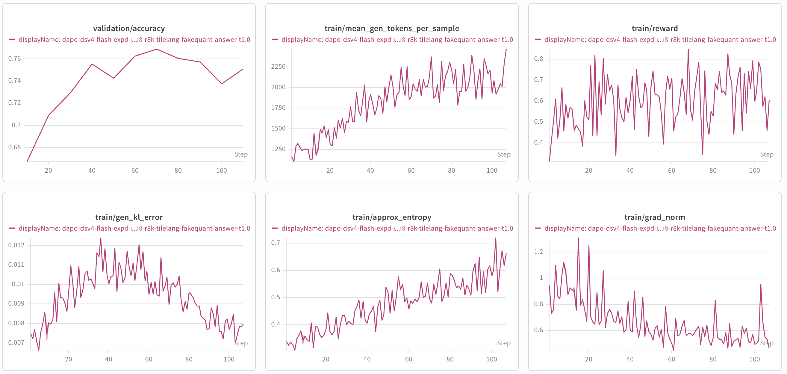
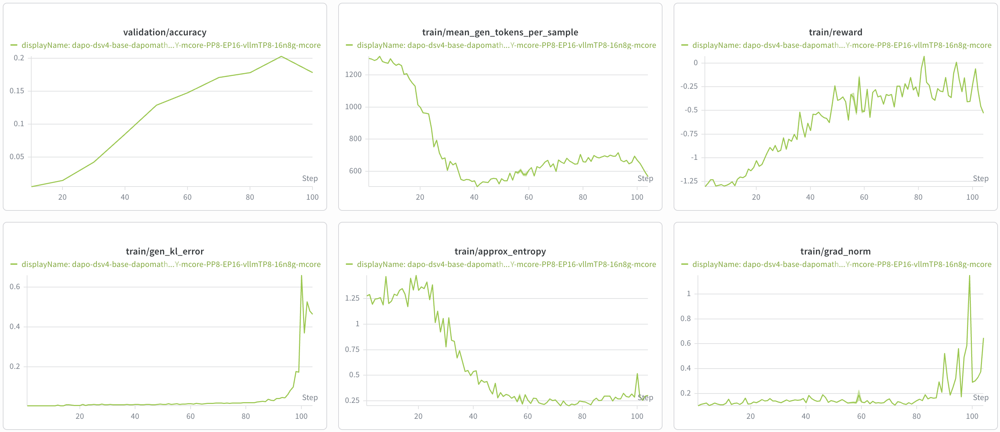

# DeepSeek V4 Support

This guide describes the current state of DeepSeek V4 support in NeMo-RL: what
works today, how to reproduce a reference run, the limitations you should expect,
and what we are working on next.

> [!IMPORTANT]
> **Status: Functional Ready.** DeepSeek V4 Flash is runnable end-to-end on two
> training backends:
> - **AutoModel (DTensor)** — the more validated path. The `DeepSeek-V4-Flash-Base`
>   reference recipe trains through a GRPO run of more than 500 steps with a
>   healthy reward curve, using FP8 fake-quant to keep the train/inference
>   mismatch small. Context Parallel (CP) is now supported here, validated at a
>   **10k** sequence length.
> - **Megatron (Megatron-Bridge / MCore)** — newly functional. Validated with an
>   initial 100-step GRPO run at 3k sequence length. Training is BF16 (no FP8
>   fake-quant yet), so the train/inference mismatch is still significant.
>
> The AutoModel path has demonstrated stable long-run training (500+ steps); the
> 10k-CP and Megatron paths so far have shorter (100-step) validation. Expect the
> known issues described [below](#known-issues). Treat this as an early-access
> integration, not a production recipe.

## Support Status

We track model support in two stages:

| Stage | Meaning |
| --- | --- |
| **Functional Ready** | Runnable end-to-end and numerically validated with an initial training run. |
| **Long-run convergence validated** | Trains stably over a full-length run with a healthy, reproducible reward curve. |

DeepSeek V4 Flash on the **AutoModel** backend has been validated over a **500+
step** GRPO run (3k) with a stable, healthy reward curve, clearing the long-run
**training-stability** bar. The 10k Context-Parallel path and the Megatron path
are **Functional Ready** (initial 100-step validation).

**Reading the curves:** `DeepSeek-V4-Flash` is already a strong model and DAPO
Math offers limited additional learning signal, so absolute reward gains are
modest by design — the meaningful result here is *stable, non-diverging* training
over a long run, not a large reward climb. Full convergence on a higher-signal
dataset is future work (see [What's Next](#whats-next)).

## What's Supported

| Model | Training backend | Parallelism | Training precision | Inference backend | Status |
| --- | --- | --- | --- | --- | --- |
| `deepseek-ai/DeepSeek-V4-Flash-Base` | AutoModel (DTensor) | Expert Parallel (EP) | BF16 + FP8 fake-quant | vLLM (FP8) | ✅ Functional Ready (>500-step) |
| `deepseek-ai/DeepSeek-V4-Flash` | AutoModel (DTensor) | Expert Parallel (EP) + Context Parallel (CP) | BF16 + FP8 fake-quant | vLLM (FP8) | ✅ Functional Ready (10k with CP) |
| `deepseek-ai/DeepSeek-V4-Flash-Base` | Megatron (MCore) | Pipeline Parallel (PP) + Expert Parallel (EP) | BF16 | vLLM (FP8) | ✅ Functional Ready (initial 100-step) |

Current scope and limitations:

- **Training backends**: [NeMo AutoModel](https://github.com/NVIDIA-NeMo/Automodel)
  and [Megatron-Bridge](https://github.com/NVIDIA-NeMo/Megatron-Bridge) (MCore).
  AutoModel is the more validated path; the Megatron path is newly functional.
- **Parallelism**: AutoModel supports Expert Parallel (EP) and, via the manual
  DSV4 context-parallel path, Context Parallel (CP) — validated together at a 10k
  sequence length. The Megatron path adds Pipeline Parallel (PP) on top of EP; CP
  is not yet available there (see [What's Next](#whats-next)).
- **Inference backend**: [vLLM](https://github.com/vllm-project/vllm) only.
- **Precision**: BF16 training weights with FP8 generation in vLLM. On AutoModel,
  FP8 fake-quant is applied on the training side to keep the train/inference
  mismatch small; the Megatron path does not yet apply fake-quant, so its
  mismatch is larger (see [Known Issues](#known-issues)).

## How to Run

### 1. Build the environment

DeepSeek V4 requires newer dependencies (e.g. an updated `transformers` and
vLLM `0.21+`) than the published NeMo-RL containers ship with. **Existing
containers cannot run DeepSeek V4 as-is** — you must rebuild the worker
environments so the pinned dependencies on this branch take effect.

The simplest path is to force a rebuild of the per-worker `uv` virtual
environments at launch time:

```bash
export NRL_FORCE_REBUILD_VENVS=true
```

For large-scale or repeated runs, bake the dependencies into a container instead
of rebuilding on every launch. See
[Dependency Management](../design-docs/dependency-management.md) for how `uv`
environments are resolved and
[Docker Containers](../docker.md) for building an image.

### 2. Reference recipes

There are three reference recipes. All train on DAPO Math (`DAPOMath17K` train /
`DAPOMathAIME2024` val).

**AutoModel (Expert Parallel), 3k** — `DeepSeek-V4-Flash-Base`, validated on
**8× H100 nodes (64 GPUs)**:

```
examples/configs/grpo_dsv4_flash_base_3k_automodel_8n_ep64.yaml
```

Key settings:

- Training: BF16, `expert_parallel_size: 64`, sequence length **3072**
- Train/inference alignment: FP8 fake-quant is enabled on the AutoModel
  (training) side (the `fp8_ds_mla_fake_quant_*` overrides) together with
  `pow2_weight_scaling_factors`, so the training policy matches the FP8
  generation policy and keeps the train/inference mismatch small.

**AutoModel (Expert + Context Parallel), 10k** — `DeepSeek-V4-Flash` (non-base),
validated on **8× H100 nodes (64 GPUs)**:

```
examples/configs/grpo_dsv4_flash_10k_cp8_automodel_8n_ep64.yaml
```

Key settings:

- Training: BF16, `expert_parallel_size: 64`, `context_parallel_size: 8`,
  sequence length **10240**
- CP uses the manual DSV4 context-parallel path (`NRL_DSV4_MANUAL_CP: "1"`): the
  microbatch is seq-sharded and the model all-gathers KV across CP ranks. EP=64
  and CP=8 coexist (they are not multiplicative on this mesh).
- Attention uses the genuine DSV4 TileLang sparse-attention backend
  (`backend.attn: tilelang`).

**Megatron-Bridge / MCore (Pipeline + Expert Parallel)** — validated on **16× H100
nodes (128 GPUs)** with an initial 100-step run:

```
examples/configs/grpo_dsv4_flash_base_3k_megatron_16n_pp8_ep16.yaml
```

Key settings:

- Training: BF16, `pipeline_model_parallel_size: 8`, `expert_model_parallel_size: 16`
- PP>1 requires the explicit `pipeline_model_parallel_layout` in the recipe (the
  hash-MoE layers must sit on the first pipeline stage) and `mtp_num_layers: 1`.
- No FP8 fake-quant on the training side yet, so the train/inference mismatch is
  still significant (see [Known Issues](#known-issues)).

### 3. Launch

DeepSeek V4 Flash uses the standard GRPO entrypoint. Set the usual environment
variables and launch with one of the reference configs above:

```bash
export HF_HOME=<your-hf-cache>
export HF_DATASETS_CACHE=<your-datasets-cache>
export WANDB_API_KEY=<your-wandb-key>
export NRL_FORCE_REBUILD_VENVS=true   # required for the updated dependencies

# AutoModel backend, 3k (8 nodes):
uv run examples/run_grpo.py \
  --config examples/configs/grpo_dsv4_flash_base_3k_automodel_8n_ep64.yaml

# AutoModel backend with Context Parallel, 10k (8 nodes):
uv run examples/run_grpo.py \
  --config examples/configs/grpo_dsv4_flash_10k_cp8_automodel_8n_ep64.yaml

# Megatron-Bridge / MCore backend (16 nodes):
uv run examples/run_grpo.py \
  --config examples/configs/grpo_dsv4_flash_base_3k_megatron_16n_pp8_ep16.yaml
```

For multi-node setup (Ray on Slurm/Kubernetes), follow the standard NeMo-RL
[cluster instructions](../cluster.md) and the [GRPO guide](grpo.md).

### Reference training curves

**AutoModel (3k)** — produced with the 3k AutoModel recipe above (DeepSeek-V4-Flash-Base,
DAPO Math, 8× H100 nodes) over a GRPO run of more than 500 steps:


**AutoModel + Context Parallel (10k)** — produced with the CP recipe above
(DeepSeek-V4-Flash, DAPO Math, 8× H100 nodes) at a 10k sequence length:



**Megatron-Bridge / MCore** — produced with the Megatron recipe above
(DeepSeek-V4-Flash-Base, DAPO Math, 16× H100 nodes) over the initial 100-step run:



### Running the non-base Flash (FP4) checkpoint

The 10k CP recipe above already runs the non-base `deepseek-ai/DeepSeek-V4-Flash`
checkpoint. If you instead adapt one of the `DeepSeek-V4-Flash-Base` recipes (whose
experts are stored in **FP8**) to the non-base checkpoint (experts stored in
**FP4 (mxfp4)**), two settings differ:

- **Set `policy.hf_config_overrides.expert_dtype: fp8`.** This forces vLLM to
  dummy-load the FP8 (base) expert layout so the BF16→FP8 weight refit can write into
  it. Without it, vLLM defaults to FP4 experts and refit fails with a shape/dtype mismatch (packed-`int32` params vs `bfloat16` loaded weights).
- **Do not pin the training-side layout to `base`.** Leave
  `NEMO_AUTOMODEL_DSV4_EXPERT_LAYOUT` unset so AutoModel auto-detects FP4 from the
  checkpoint (or set it explicitly to `flash`); `base` is only for the FP8 checkpoint.

In short: AutoModel loads the FP4 checkpoint (dequantized to BF16 for training), vLLM
serves the FP8/base layout, and the FP8 refit bridges the two each step.

## Known Issues

- **Megatron path: significant train/inference mismatch.** The Megatron (MCore)
  path trains in BF16 without the FP8 fake-quant that the AutoModel path uses, so
  the discrepancy between the training policy and the FP8 vLLM generation policy
  is still large. The 100-step run is functionally healthy, but reducing this
  mismatch is required before
  long-run convergence — see [What's Next](#whats-next).

## What's Next

In rough priority order:

- **Reduce the Megatron train/inference mismatch.** Bring FP8 fake-quant (or an
  equivalent alignment) to the Megatron path so it matches the FP8 generation
  policy, as the AutoModel path already does, and validate long-run convergence.
- **Context Parallel on the Megatron path.** CP is available on AutoModel today;
  extend it to the Megatron backend for longer-context training there too.
- **Convergence on a higher-signal dataset.** DAPO Math gives the already-strong
  Flash checkpoint limited headroom; validate a full convergence run on a dataset
  with more learning signal.
- **DeepSeek V4 Pro.** Extend support to the DeepSeek V4 Pro variant.
