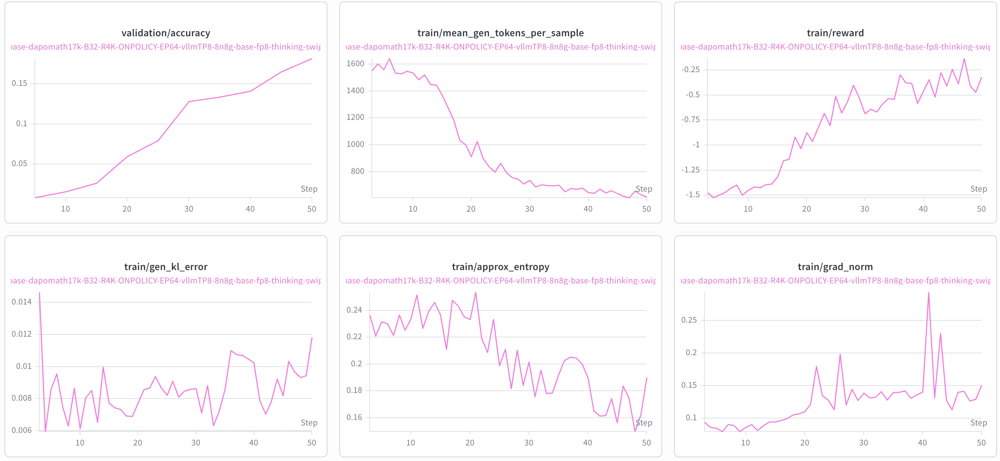

# DeepSeek V4 Support

This guide describes the current state of DeepSeek V4 support in NeMo-RL: what
works today, how to reproduce a reference run, the limitations you should expect,
and what we are working on next.

:::{warning}
**Status: Functional Ready.** DeepSeek V4 Flash Base is runnable and has been numerically
validated with a short run, but it is **not yet validated for long-run
convergence**. Expect the known issues described [below](#known-issues) — in
particular, long runs can crash around step ~100 due to a train/inference
mismatch. Treat this as an early-access integration, not a production recipe.
:::

## Support Status

We track model support in two stages:

| Stage | Meaning |
| --- | --- |
| **Functional Ready** | Runnable end-to-end and numerically validated with a short run. |
| **Long-run convergence validated** | Trains stably over a full-length run with a healthy, reproducible reward curve. |

DeepSeek V4 Flash Base is currently **Functional Ready**. Reaching long-run convergence is
our top priority — see [What's Next](#whats-next).

## What's Supported

| Model | Training backend | Parallelism | Inference backend | Status |
| --- | --- | --- | --- | --- |
| `deepseek-ai/DeepSeek-V4-Flash-Base` | AutoModel (DTensor) | Expert Parallel (EP) only | vLLM (FP8) | ✅ Functional Ready |
| `deepseek-ai/DeepSeek-V4-Flash` | AutoModel (DTensor) | Expert Parallel (EP) only | vLLM (FP8) | 🚧 Expected to work; short run in progress |

Current scope and limitations:

- **Training backend**: [NeMo AutoModel](https://github.com/NVIDIA-NeMo/Automodel)
  only. The Megatron backend is not yet wired up (see [What's Next](#whats-next)).
- **Parallelism**: Expert Parallel (EP) only. Pipeline Parallel (PP), Context
  Parallel (CP), and sequence packing are not yet supported for this model.
- **Inference backend**: [vLLM](https://github.com/vllm-project/vllm) only.
- **Precision**: BF16 training weights with FP8 generation in vLLM.

## How to Run

### 1. Build the environment

DeepSeek V4 requires newer dependencies (e.g. an updated `transformers` and
vLLM `0.21+`) than the published NeMo-RL containers ship with. **Existing
containers cannot run DeepSeek V4 as-is** — you must rebuild the worker
environments so the pinned dependencies on this branch take effect.

The simplest path is to force a rebuild of the per-worker `uv` virtual
environments at launch time:

```bash
export NRL_FORCE_REBUILD_VENVS=true
```

For large-scale or repeated runs, bake the dependencies into a container instead
of rebuilding on every launch. See
[Dependency Management](../design-docs/dependency-management.md) for how `uv`
environments are resolved and
[Docker Containers](../docker.md) for building an image.

### 2. Reference recipe

The reference recipe was validated on **8× H100 nodes (64 GPUs)**:

```
examples/configs/grpo_dsv4_flash_base_3k_automodel_8n_ep64.yaml
```

Key settings in this recipe:

- Model: `deepseek-ai/DeepSeek-V4-Flash-Base`, chat template `deepseek_v4`
- Training: BF16, `expert_parallel_size: 64`, sequence length **3072** (see
  [Known Issues](#known-issues))
- Generation: vLLM FP8
- Dataset: DAPO Math (`DAPOMath17K` train / `DAPOMathAIME2024` val)

### 3. Launch

DeepSeek V4 Flash Base uses the standard GRPO entrypoint. Set the usual environment
variables and launch with the reference config:

```bash
export HF_HOME=<your-hf-cache>
export HF_DATASETS_CACHE=<your-datasets-cache>
export WANDB_API_KEY=<your-wandb-key>
export NRL_FORCE_REBUILD_VENVS=true   # required for the updated dependencies

uv run examples/run_grpo.py \
  --config examples/configs/grpo_dsv4_flash_base_3k_automodel_8n_ep64.yaml
```

For multi-node setup (Ray on Slurm/Kubernetes), follow the standard NeMo-RL
[cluster instructions](../cluster.md) and the [GRPO guide](grpo.md).

### Reference training curve

The following curves were produced with the reference recipe above
(DeepSeek-V4-Flash-Base, DAPO Math, 8× H100 nodes):



## Known Issues

- **Maximum sequence length is constrained by node count and the available
  parallelism.** Because only Expert Parallel is supported today (no Context
  Parallel), activations cannot be sharded along the sequence dimension, so the
  maximum sequence length is bounded by per-GPU memory and can only be raised by
  adding nodes. In practice, **8 nodes** support up to a **3072-token** maximum
  sequence length, and **16 nodes** are required for **4096 tokens**. Adding
  Context Parallel (see [What's Next](#whats-next)) will relax this.
- **Train/inference mismatch.** The discrepancy between the training and
  generation paths is currently significant, and long runs tend to **crash
  around step ~100**. This is our top active workstream — see below.

## What's Next

In rough priority order:

- **Stabilize long runs.** Mitigate the train/inference mismatch so DeepSeek V4 Flash
  can train through a full-length run. We have found that applying FP8 fake
  quantization on the AutoModel (training) side helps reduce the mismatch, and a
  long-run validation is in progress.
- **More parallelism.** Add Context Parallel (CP) to enable longer-context
  training, beyond what EP alone allows today.
- **Megatron backend.** [Megatron-Bridge](https://github.com/NVIDIA-NeMo/Megatron-Bridge)
  already supports DeepSeek V4; we need to bump the dependency on the NeMo-RL
  side and validate the path.
- **DeepSeek V4 Pro.** Extend support to the DeepSeek V4 Pro variant.
