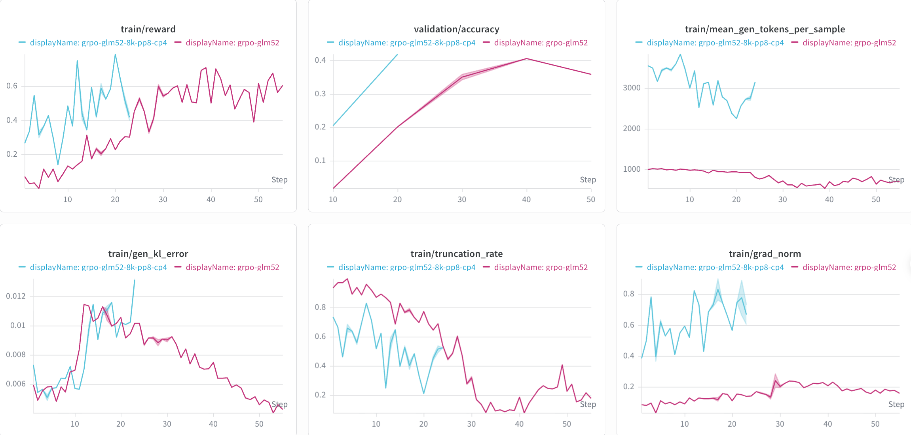

# GLM-5.2 Support

This guide summarizes the current GLM-5.2 support in NeMo RL, including the
validated GRPO configurations, the required AutoModel and vLLM paths, reference
training curves, and known limitations.

> [!IMPORTANT]
> **Status: Functional Ready (early access).** Short GRPO training runs have
> been validated with `zai-org/GLM-5.2` using AutoModel training and colocated
> vLLM generation. The validated topologies cover PP + EP and PP + EP + CP with
> sequence packing. Long-run convergence has not been established.

## Support Status


| Model             | Training backend          | Validated training parallelism | Generation backend               | Precision                                                        | Status                          |
| ----------------- | ------------------------- | ------------------------------ | -------------------------------- | ---------------------------------------------------------------- | ------------------------------- |
| `zai-org/GLM-5.2` | AutoModel (DTensor/FSDP2) | PP8 + EP64; PP8 + EP64 + CP4   | Colocated vLLM with TP32 + EP128 | BF16 model and generation weights; FusedAdam FP32 master weights | Functional Ready (early access) |


Validated scope:

- **Algorithm**: GRPO with the DAPO Math training and validation datasets.
- **Model checkpoint**: `zai-org/GLM-5.2`, with MTP disabled by setting
`policy.hf_config_overrides.num_mtp_modules: 0`.
- **Training backend**: [NeMo AutoModel](https://github.com/NVIDIA-NeMo/Automodel)
with pipeline parallelism (PP), expert parallelism (EP), and optional context
parallelism (CP).
- **Generation backend**: [vLLM](https://github.com/vllm-project/vllm) in
colocated mode. Training TP is not enabled; the TP32 setting belongs only to
the vLLM generation engines.
- **Precision**: BF16 model compute and generation. Transformer Engine
`FusedAdam` keeps FP32 master weights internally and stores both optimizer
moments in BF16 in the reference recipes.


## How to Run


### 1. Prepare the Environment

Use the AutoModel submodule and dependency lock recorded by the NeMo RL
revision that contains this guide. GLM-5.2 depends on recent model-owned
PP/CP/THD handling, so an older AutoModel checkout is not compatible.

From the NeMo RL repository root, run:

```bash
git submodule update --init --recursive
uv sync --locked --extra automodel --extra vllm
```

If Ray worker environments were created by an older checkout, force them to be
rebuilt before launching:

```bash
export NRL_FORCE_REBUILD_VENVS=true
```

The current integration pins Transformers 5.12.1 for AutoModel and vLLM 0.24.0
for generation. Keep `pyproject.toml`, `uv.lock`, and the AutoModel gitlink from
the same NeMo RL revision.

### 2. Choose a Reference Recipe

Both recipes assume 64 nodes with 8 GPUs per node and use colocated vLLM
generation.


| Recipe                                            | Training topology | Sequence limit                                           | Attention and linear backends     | Packing  | Training global batch |
| ------------------------------------------------- | ----------------- | -------------------------------------------------------- | --------------------------------- | -------- | --------------------- |
| `exp/grpo-glm5.2-64n8g-automodel-pp8ep64.yaml`    | PP8 + EP64        | 2,048 total tokens: up to 1,024 prompt + 1,024 generated | SDPA attention + TE linear        | Disabled | 512                   |
| `exp/grpo-glm5.2-64n8g-automodel-pp8ep64cp4.yaml` | PP8 + EP64 + CP4  | 6,144 total tokens: up to 2,048 prompt + 4,096 generated | TileLang attention + torch linear | Enabled  | 128                   |


The CP4 recipe uses packed THD inputs so that GLM-5.2's model-owned context
parallel attention path receives `cu_seqlens` and its CP query indices during
both training and policy-logprob evaluation.

### 3. Launch

From an allocated 64-node distributed environment, launch the standard GRPO
entrypoint with one of the reference recipes:

```bash
export NRL_FORCE_REBUILD_VENVS=true

# PP8 + EP64 baseline
uv run examples/run_grpo.py \
  --config exp/grpo-glm5.2-64n8g-automodel-pp8ep64.yaml

# PP8 + EP64 + CP4 with sequence packing
uv run examples/run_grpo.py \
  --config exp/grpo-glm5.2-64n8g-automodel-pp8ep64cp4.yaml
```


## Reference Training Curves

The following dashboard compares a PP/CP experiment (blue) with the PP/EP
baseline (magenta). It includes reward, validation accuracy, generated tokens
per sample, generation KL error, truncation rate, and gradient norm.



The short runs provide the following integration signals:

- Both runs improve reward and reach approximately 0.4 validation accuracy in
the displayed window.
- Gradient norms remain finite, and generation KL error stays on the order of
`1e-2` during the shown steps.

These curves validate that both distributed paths execute and learn over a
short window. They do not establish long-run stability or final convergence.

## Implementation Requirements

- **CP requires TileLang and sequence packing**: GLM-5.2 owns its CP attention
path and accepts CP only with `backend.attn: tilelang`. Keep
`policy.sequence_packing.enabled: true` for the CP4 recipe.
- **HybridEP token alignment**: Keep
`policy.make_sequence_length_divisible_by: 128`. HybridEP requires its token
buffers to align to a 128-token chunk.


## Known Limitations

- **Long-run convergence**: Validation currently covers short GRPO runs only.


## What's Next

- Validate longer GRPO runs and final convergence.
