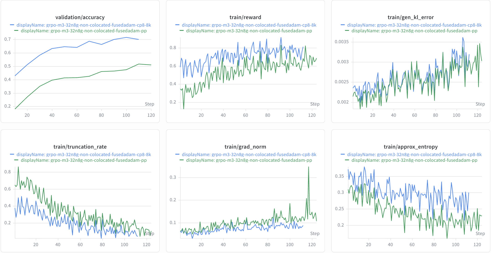

# MiniMax-M3 Support

This guide summarizes the current MiniMax-M3 support in NeMo-RL, including the
validated scope, a reference GRPO recipe, and known limitations.

> [!IMPORTANT]
> **Status: Functional Ready.** MiniMax-M3 is runnable in NeMo-RL, and short GRPO
> training runs have been validated with a BF16 MiniMax-M3 checkpoint. Long-run
> convergence has not been validated yet, so treat this as an early-access
> integration.

## Support Status


| Model                | Training backend    | Training parallelism      | Inference backend | Precision                                       | Status           |
| -------------------- | ------------------- | ------------------------- | ----------------- | ----------------------------------------------- | ---------------- |
| MiniMaxAI/MiniMax-M3 | AutoModel (DTensor) | Expert Parallel (EP) only | vLLM              | BF16 training weights with BF16 vLLM generation | Functional Ready |


Validated scope:

- **Training backend**: [NeMo AutoModel](https://github.com/NVIDIA-NeMo/Automodel).
- **Training parallelism**: Expert Parallel (EP) only.
- **Inference backend**: [vLLM](https://github.com/vllm-project/vllm).
- **Precision**: BF16 training weights and BF16 vLLM generation.

## How to Run

### 1. Build the Environment

MiniMax-M3 currently depends on a specific AutoModel branch and vLLM pull
request. Clone those sources into the `3rdparty` paths used by NeMo-RL's
editable installs.

Sources:

- AutoModel: [https://github.com/NVIDIA-NeMo/Automodel/tree/larkz/minimax_m3](https://github.com/NVIDIA-NeMo/Automodel/tree/larkz/minimax_m3)
- vLLM: [https://github.com/vllm-project/vllm/pull/45381](https://github.com/vllm-project/vllm/pull/45381)

From the NeMo-RL repository root, run:

```bash
mkdir -p 3rdparty/Automodel-workspace 3rdparty/vLLM-workspace

git clone --branch larkz/minimax_m3 --single-branch \
  https://github.com/NVIDIA-NeMo/Automodel.git \
  3rdparty/Automodel-workspace/Automodel

git clone https://github.com/vllm-project/vllm.git \
  3rdparty/vLLM-workspace/vllm

git -C 3rdparty/vLLM-workspace/vllm fetch origin \
  pull/45381/head:minimax-m3-pr-45381
git -C 3rdparty/vLLM-workspace/vllm checkout minimax-m3-pr-45381
```

Published NeMo-RL containers do not yet include the full MiniMax-M3 runtime
environment. Force a rebuild of the per-worker `uv` virtual environments at
launch time so Ray workers pick up the local AutoModel and vLLM sources:

```bash
export NRL_FORCE_REBUILD_VENVS=true
```

### 2. Use the Reference Recipe

The reference recipe is:

```text
exp/grpo-minimax-m3-32n8g-non-colocated.yaml
```

Key settings:

- AutoModel (DTensor) training with `expert_parallel_size: 128`.
- Non-colocated vLLM generation
(`generation.colocated.enabled: false`).
- DAPO Math datasets (`DAPOMath17K` train / `DAPOMathAIME2024` validation).

### 3. Launch

MiniMax-M3 uses the standard GRPO entrypoint:

```bash
export NRL_FORCE_REBUILD_VENVS=true

uv run examples/run_grpo.py \
  --config exp/grpo-minimax-m3-32n8g-non-colocated.yaml
```

### Reference Training Curve

The following curve was produced with the reference recipe above:



## Known Issues

- **Sequence length**: The validated configuration uses EP=128 and a 2k maximum
  sequence length. Longer sequences may OOM and will likely require additional
  parallelism such as Context Parallel (CP) or Pipeline Parallel (PP).
- **Long-run validation**: Current validation covers short training runs only.
  Long-run convergence has not been established.
- **Additional parallelism**: CP, PP, TP, and sequence packing are not part of
  the validated MiniMax-M3 training scope yet.

## What's Next

- Validate long-run MiniMax-M3 training.
- Add and validate more training parallelism, especially CP and PP, to support
  longer contexts.
