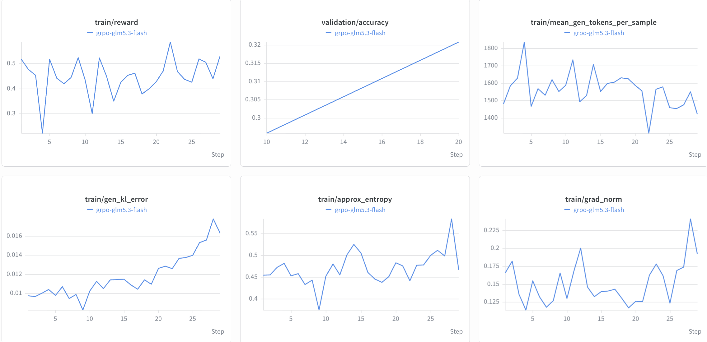

# GLM-5.3-Flash

This guide describes text-only GRPO training of GLM-5.3-Flash with the AutoModel
training backend and vLLM generation. It uses the local experiment configuration
`[exp/grpo-glm-flash.yaml](../../../../exp/grpo-glm-flash.yaml)`.

> [!IMPORTANT]
> **Status: Short-run training results available.** The supplied training curves
> cover approximately 29 steps, with validation measurements at steps 10 and 20.
> They do not establish long-run convergence. This guide documents the experiment
> configuration rather than a registered nightly recipe.

## Support Status


| Model         | Training backend | Training parallelism | Generation backend   | Scope                     |
| ------------- | ---------------- | -------------------- | -------------------- | ------------------------- |
| GLM-5.3-Flash | AutoModel        | TP1 + CP1 + EP72     | vLLM with TP16 + EP1 | Text-only, colocated GRPO |


## Reference Scope

- **Model**: A local GLM-5.3-Flash checkpoint at `/apps/models/GLM-5.3-Flash`.
- **Algorithm**: GRPO with `DAPOMath17K` for training and
`DAPOMathAIME2024` for validation.
- **Training backend**: AutoModel with BF16 training, activation checkpointing,
SDPA attention, Transformer Engine linear layers, `torch_mm` experts, and the
HybridEP dispatcher.
- **Training parallelism**: TP1, CP1, and EP72.
- **Generation backend**: vLLM with FP8 precision, TP16, EP1, and eager execution.
The KV cache dtype inherits `auto` from the base configuration.
- **Sequence length**: Up to 2,048 prompt tokens and 2,048 generated tokens,
with a maximum total sequence length of 4,096.
- **Reference allocation**: 18 nodes with 8 GPUs per node, totaling 144 GPUs.
- **Deployment**: Colocated training and generation on the same GPUs.
- **Modality**: Language-only generation; the vision and audio towers are frozen
during training.
- **MTP**: Disabled with `policy.hf_config_overrides.text_config.num_mtp_modules: 0`.

The experiment YAML and its inherited
`[grpo_math_1B.yaml](../../../../examples/configs/grpo_math_1B.yaml)` are the
source of truth for these settings. The experiment file uses
`defaults: ../examples/configs/grpo_math_1B.yaml`; keep that relative path valid
if copying the configuration.

## How to Run


### 1. Prepare the Environment

Use an environment with GLM-5.3-Flash support in both AutoModel and vLLM,
Transformer Engine, and a HybridEP build that supports multi-node dispatch.
The local experiment launcher uses a custom container with HybridEP installed
under `/opt/hybridep`. A generic environment installation alone does not
establish compatibility with this experiment.

See the [installation guide](../../../about/installation.md),
[Dependency Management](../../../design-docs/dependency-management.md), and
[Cluster Setup](../../../cluster.md) for environment and multi-node Ray setup.
Make the model directory available at the same path on every node, and use a
shared Hugging Face cache for datasets:

```bash
export HF_HOME=<path-to-shared-huggingface-cache>
export WANDB_API_KEY=<your-wandb-api-key>
```

The recipe enables W&B logging. Pass `logger.wandb_enabled=false` if W&B is
not configured.

### 2. Choose the Reference Configuration


| Model         | Algorithm | Backend   | Scale | Configuration                                                |
| ------------- | --------- | --------- | ----- | ------------------------------------------------------------ |
| GLM-5.3-Flash | GRPO      | AutoModel | 18n8g | `[grpo-glm-flash.yaml](../../../../exp/grpo-glm-flash.yaml)` |


This configuration lives under `exp/`, outside the recurring recipe and nightly
test directories. Ensure the experiment file is present in your checkout.

### 3. Launch

From the repository root on the head node of the configured 18-node Ray cluster,
run:

```bash
uv run examples/run_grpo.py --config exp/grpo-glm-flash.yaml
```

To use a different shared model location, override `policy.model_name`:

```bash
uv run examples/run_grpo.py --config exp/grpo-glm-flash.yaml \
  policy.model_name=/path/to/GLM-5.3-Flash
```

The tokenizer name inherits `policy.model_name` from the base configuration.
Review EP72 and TP16 placement before changing the allocation; changing
`cluster.num_nodes` alone is insufficient. See the [GRPO guide](../../grpo.md)
for common algorithm and configuration details.

## Important Recipe Settings

- **Batch size**: 36 prompts per step with 16 generations per prompt produce
576 samples, matching `policy.train_global_batch_size: 576`. Training and
log-probability microbatches are both 1. Sequence packing and dynamic batching
are disabled.
- **Optimizer**: Transformer Engine `FusedAdam` uses a learning rate of `1e-6`,
weight decay of `0.1`, master weights, parameter remainders, and BF16 first
and second moments. The scheduler warms up over 10 steps, then remains constant.
- **GRPO loss**: Reward normalization is enabled, the leave-one-out baseline is
disabled, and reference-policy KL penalty is zero. Token-level loss uses
asymmetric ratio clipping (`0.2` / `0.28`) and truncated importance sampling
correction with an upper ratio of `2.0`.
- **Model backend**: `rms_norm: torch_fp32`, `rope_fusion: false`, and
`enable_hf_state_dict_adapter: true` are part of the experiment settings.
HybridEP shares the token dispatcher and enables FSDP optimizations.
- **Generation**: `language_model_only: true`, `enforce_eager: true`, and
`enable_flashinfer_autotune: false` are explicit overrides. GPU memory
utilization is `0.6` and `max_model_len` is 4,096.
- **Refit**: Keep the GLM-specific weight-cache invalidation in the vLLM backend.
After weight updates, the KDA merged convolution weights and DSA indexer's
cached FP32 projection weights must be rebuilt from the updated parameters.
- **Validation**: Runs every 10 steps with at most 240 validation prompts and
a validation batch size of 240; validation at startup is disabled.
- **Checkpointing**: Saves every 5 steps, retains one checkpoint with
`metric_name: null`, and includes optimizer state. The output directory is
`results/grpo-glm-flash-fix-dsa-cache`. Change it for independent experiments.


## Reference Training Curves

The supplied screenshot shows training reward, validation accuracy, mean
generated tokens per sample, generation KL error, approximate entropy, and
gradient norm for the reference experiment.



Validation accuracy reaches **0.32083 at step 20**. At the highlighted training
step 16, reward is **0.45313**, mean generated length is **1,597.9 tokens**, and
generation KL error is **0.010896**. Generation KL error rises later in the
displayed run, so these curves do not demonstrate resolved train/generation
parity or long-run convergence.

## Known Limitations

- This experiment covers text-only training with frozen vision and audio
towers. Multimodal training and generation are outside the documented scope.
- Training uses BF16 while generation requests FP8. The observed generation
KL error requires further evaluation; the screenshot alone does not isolate
its cause.
- MTP, sequence packing, dynamic batching, and non-colocated deployment are
not exercised by this configuration.
- Only the supplied short-run curves are reported here.
