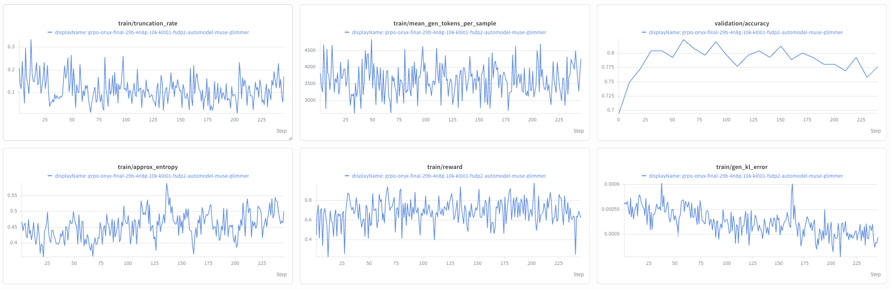
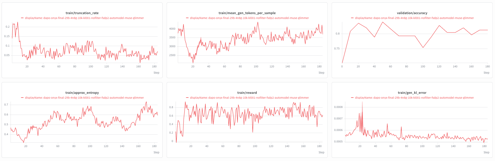

# Muse Glimmer

This page collects NeMo RL guidance for post-training Muse Glimmer, a ~29.8B model
built on the Onyx architecture. Use it to set up the environment, choose a starting
recipe, and understand the settings that are specific to this model.

> [!IMPORTANT]
> **Early access.** Muse Glimmer runs end-to-end in NeMo RL; the KL-anchored 10k
> recipes have been validated to hold a flat validation-accuracy band for 185-245
> steps, but no run has yet been taken to full convergence.

## Support Status

Model support is tracked in two stages:

| Stage | Meaning |
| --- | --- |
| **Functionally Ready** | Runnable end-to-end and numerically validated with an initial training run. |
| **Long-Run Convergence Validated** | Trains stably over a full-length run with a healthy, reproducible reward curve. |

Muse Glimmer is **Functionally Ready**.

## What's Supported

| Model | Modality | Training backend | Parallelism | Inference | Precision |
| --- | --- | --- | --- | --- | --- |
| Muse Glimmer 29B | LLM (text-only path) | AutoModel (DTensor) | FSDP2 + CP | vLLM | BF16 |

Notes:

- **Training** runs on the AutoModel (DTensor) backend. The Megatron backend is not
  supported for this architecture.
- **Context Parallel (CP)** is supported and is what makes long sequences possible;
  see [Choose a Recipe](#choose-a-recipe). Tensor Parallel and Pipeline Parallel are
  not used on the training side — absorb memory pressure into CP and FSDP2 instead.

## Build the Environment

Published NeMo RL containers do not include the Muse Glimmer runtime. AutoModel must
come from a local source; vLLM installs directly from a prebuilt nightly wheel, so no
vLLM source checkout is needed.

### 1. Clone AutoModel into `3rdparty/`

- **AutoModel** — the submodule is pinned to a fixed commit on
  [`huiyingl/feat/muse-glimmer-support`](https://github.com/NVIDIA-NeMo/Automodel/tree/huiyingl/feat/muse-glimmer-support)
  (not tracking the branch tip), so unrelated upstream changes on that branch
  can't break this setup. See the `.gitmodules` note for this submodule for
  how to move the pin once Muse Glimmer support lands on
  [main](https://github.com/NVIDIA-NeMo/Automodel).
- **vLLM** — `pyproject.toml` pins the `vllm` extra directly to the nightly wheel
  built from vLLM main at
  [6adad0876](https://github.com/vllm-project/vllm/commit/6adad08767583f52eb4d2122111af0bf638ed5e6),
  the commit that merged Muse Glimmer support
  ([nightly build directory layout](https://docs.vllm.ai/en/latest/contributing/ci/nightly_builds/#directory-structure)).
  This installs as a regular (non-editable) package — there is nothing to clone.

```bash
git submodule update --init 3rdparty/Automodel-workspace/Automodel
```

### 2. Force a worker-venv rebuild

Ray worker virtual environments are cached, so they will not pick up the local
AutoModel source or a `pyproject.toml` dependency bump unless you ask for a rebuild:

```bash
export NRL_FORCE_REBUILD_VENVS=true

# Multi-node only. Every node's venv builder contends on one lock in the shared
# uv cache while vLLM's metadata is built; uv's default 300 s lock timeout is
# shorter than that takes, and the waiting nodes die with "Failed to acquire
# lock on the distribution cache".
export UV_LOCK_TIMEOUT=3600
```

> [!NOTE]
> The vLLM wheel is fetched from `https://wheels.vllm.ai` during `uv sync`/`uv lock`.
> If compute nodes have no external network, warm the shared `UV_CACHE_DIR` first by
> running `uv sync` (or `uv lock`) once from a node that does have network access —
> subsequent syncs on compute nodes reuse the cached wheel.

## Get the Weights

The recipes default `policy.model_name` and `policy.tokenizer.name` to the released
HF Hub checkpoint, `meta-models/Muse-Glimmer-30B`. To use a local checkpoint instead,
override both keys:

```bash
uv run examples/run_grpo.py \
  --config examples/configs/recipes/llm/grpo-muse-glimmer-30b-4n8g-fsdp2cp4-automodel-6k.yaml \
  policy.model_name=/your/path/to/muse-glimmer-30b \
  policy.tokenizer.name=/your/path/to/muse-glimmer-30b
```

or edit `policy.model_name` and `policy.tokenizer.name` in the YAML directly.

## Example Recipes

All run on DAPO-Math-17K with AIME-2024 validation, AutoModel (DTensor) training
with colocated vLLM generation, on 4 nodes x 8 GPUs. Recipe YAML files under
`examples/configs/recipes/` are the source of truth.

| Algo | Seq | CP | Tokens/rank | `max_new_tokens` | Recipe |
|---|---|---|---|---|---|
| GRPO | 10240 | 4 | 2560 | 8192 | [`grpo-…-fsdp2cp4-automodel-10k.yaml`](../../../examples/configs/recipes/llm/grpo-muse-glimmer-30b-4n8g-fsdp2cp4-automodel-10k.yaml) |
| DAPO | 10240 | 4 | 2560 | 8192 | [`dapo-…-fsdp2cp4-automodel-10k.yaml`](../../../examples/configs/recipes/llm/dapo-muse-glimmer-30b-4n8g-fsdp2cp4-automodel-10k.yaml) |
| GRPO | 6144 | 4 | 1536 | 4096 | [`grpo-…-fsdp2cp4-automodel-6k.yaml`](../../../examples/configs/recipes/llm/grpo-muse-glimmer-30b-4n8g-fsdp2cp4-automodel-6k.yaml) |
| GRPO | 4096 | 1 | 4096 | 2048 | [`grpo-…-fsdp2-automodel-4k.yaml`](../../../examples/configs/recipes/llm/grpo-muse-glimmer-30b-4n8g-fsdp2-automodel-4k.yaml) |

The GRPO recipes use no dynamic sampling, no overlong reward shaping, symmetric
`ratio_clip` at 0.2, and sequence-level loss — the base config `grpo_math_1B.yaml`
already defaults to all of that. The DAPO recipe adds dynamic sampling, Clip-Higher
(`ratio_clip_max: 0.28`), token-level loss, and the soft overlong penalty (with
`overlong_filtering` deliberately off — filtering would zero truncated samples out of
the loss, exempting exactly the samples the penalty exists to shape).

> [!IMPORTANT]
> **Every recipe keeps `loss_fn.reference_policy_kl_penalty: 0.01`** — including the
> DAPO one, even though the DAPO paper drops the KL term. That advice assumes a weak
> starting policy that must travel far from its initialization. Muse Glimmer is a
> heavily post-trained model: without the anchor its validation accuracy rises for
> ~30 steps and then decays (0.83 to 0.55 over 200 steps on GRPO 10k; the same shape
> reproduces on DAPO and at every sequence length tested), driven by length inflation,
> truncation collapse, and behavior drift. `0.001` was tested and is too weak; `0.01`
> holds the curve flat. The penalty requires
> `grpo.skip_reference_policy_logprobs_calculation: false` (~+10% step time).

> [!IMPORTANT]
> `max_new_tokens` is `max_total_sequence_length - data.max_input_seq_length` (2048).
> Keep that relationship if you change the sequence length. If `max_new_tokens` is
> larger than the context leaves room for, vLLM silently caps generation per-sample at
> `max_model_len - input_length`, so the effective budget varies with prompt length
> instead of being uniform.

## Choose a Recipe

**Start with the 10k (cp4) recipes.** Context length is the biggest quality lever for
this model, and the 10k runs are the ones validated deep into training — see
[Reference Results](#reference-results): GRPO holds a 0.78-0.82 validation band
through step 245, DAPO holds 0.79-0.84 through step 185. GRPO steps are ~3x faster
(no dynamic sampling over-generation); DAPO reaches a slightly higher band.

The 6k recipe is the middle ground (0.69 peak). Use the 4k recipe when you want the
shortest context or fewer moving parts — it runs without context parallelism, so
there is no ring-attention communication and no per-CP-step `dq`/`dk`/`dv` copies,
but it is the *tightest* on memory and pays the largest truncation tax.

### Why context length matters here

Muse Glimmer produces long reasoning traces. When the sequence budget binds, the policy
learns to stop early rather than to reason better, and reward decouples from
correctness. `train/truncation_rate` early in training runs around **0.6 at 4k** versus
**0.34 at 6k**, and the accuracy gap follows.

> [!NOTE]
> Diagnose truncation pressure with `train/truncation_rate` and
> `train/mean_gen_tokens_per_sample`, **not** mean generation length alone. When the cap
> binds, mean generation length *falls*, which reads like "the model does not need the
> tokens" and means the opposite.

## Launch

```bash
export NRL_FORCE_REBUILD_VENVS=true

# GRPO 10k, CP4 -- recommended default (pulls meta-models/Muse-Glimmer-30B from HF Hub)
uv run examples/run_grpo.py \
  --config examples/configs/recipes/llm/grpo-muse-glimmer-30b-4n8g-fsdp2cp4-automodel-10k.yaml

# DAPO 10k, CP4 -- dynamic sampling + overlong penalty (keep the KL anchor on)
uv run examples/run_grpo.py \
  --config examples/configs/recipes/llm/dapo-muse-glimmer-30b-4n8g-fsdp2cp4-automodel-10k.yaml

# 6k, CP4 -- middle ground
uv run examples/run_grpo.py \
  --config examples/configs/recipes/llm/grpo-muse-glimmer-30b-4n8g-fsdp2cp4-automodel-6k.yaml

# 4k, no CP -- shortest context, tightest on memory
uv run examples/run_grpo.py \
  --config examples/configs/recipes/llm/grpo-muse-glimmer-30b-4n8g-fsdp2-automodel-4k.yaml
```

On Slurm, keep `cluster.num_nodes` in step with what you request from the scheduler.
A mismatch wedges Ray placement rather than failing cleanly:

```bash
uv run examples/run_grpo.py --config <recipe> cluster.num_nodes=4
```

## Reference Results

### Training curves

All runs use the released checkpoint on 4 nodes x 8 GPUs.

**GRPO 10k, CP4** — the recommended recipe, with the KL anchor
(`reference_policy_kl_penalty: 0.01`).



Validation accuracy rises from 0.70 to ~0.81 by step 30 and **holds a 0.78-0.82 band
through step 245** — no decay. `gen_kl_error` stays flat at ~5e-04, mean generation
length is stable around 3,500-4,000 tokens (8,192 budget), and entropy oscillates in a
healthy 0.4-0.55 band. Without the KL anchor the same recipe peaks at 0.83 by step 30
and decays to 0.55 by step 210.

**DAPO 10k, CP4** — dynamic sampling + soft overlong penalty, same KL anchor.



Validation accuracy reaches ~0.84 by step 20 and **holds 0.79-0.84 through step 185**.
`gen_kl_error` stays flat at ~5.5e-04 and entropy trends gently upward (0.45 to 0.6) —
the policy keeps exploring. Steps are ~3x slower than GRPO because dynamic sampling
over-generates (`batch_multiplier: 3`) to fill each batch with mixed-outcome prompts.

The two curves below cover roughly the first 70 steps of their runs, so they are
**partial runs**, not completed ones.

**6k, CP4** — the middle ground.


Validation accuracy rises from 0.42 to a peak near **0.69** by step 15 and holds
0.63-0.67. `truncation_rate` falls from 0.34 to roughly 0.05-0.15. `gen_kl_error` is
**flat** at ~5.5e-04 throughout. Entropy dips, then recovers to 0.68 around step 43
before settling near 0.47 — the policy keeps exploring rather than collapsing.

**4k, no CP** — shorter context.


Validation accuracy rises from 0.22 to about **0.505** by step 55-60 and then flattens.
`truncation_rate` starts near 0.6 — well above the 6k run — and settles around 0.15.
`gen_kl_error` **climbs** from 5.5e-04 to 1.4e-03, and entropy falls monotonically from
0.38 to 0.15.

## Known Issues

- **No run has been taken to full convergence.** The KL-anchored 10k recipes hold a
  flat validation band for 185-245 steps; evidence beyond that is not yet available.
- **Do not set `loss_fn.reference_policy_kl_penalty` to 0.** Every unanchored run on
  this model — GRPO and DAPO, at 4k, 6k, and 10k — rises for ~30 steps and then
  decays well below its peak. See the note under [Example Recipes](#example-recipes).
