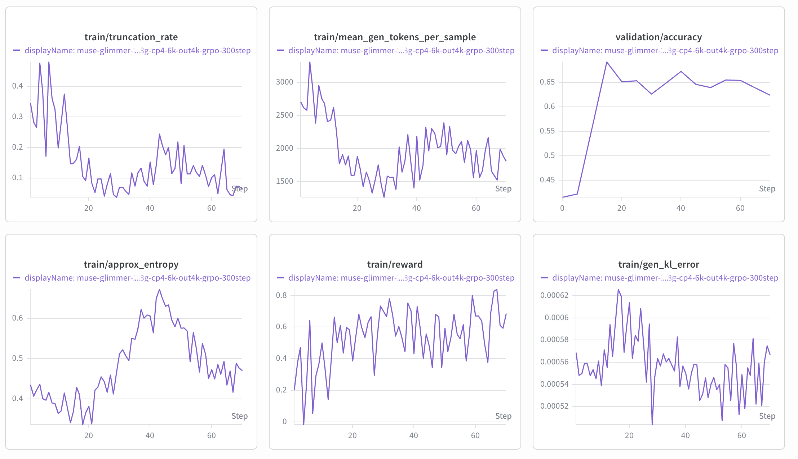
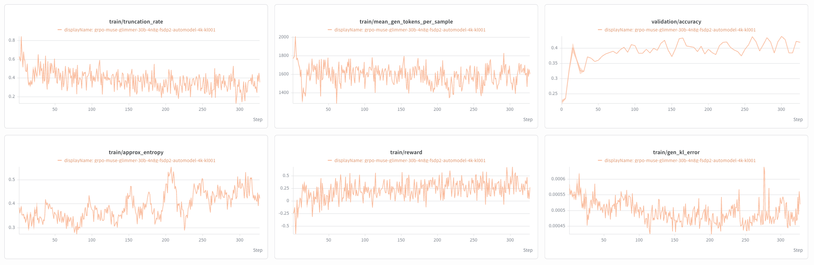

# Muse Glimmer

This page collects NeMo RL guidance for post-training Muse Glimmer, a ~29.8B model
built on the Onyx architecture. Use it to set up the environment, choose a starting
recipe, and understand the settings that are specific to this model.

> [!IMPORTANT]
> **Early access.** Muse Glimmer runs end-to-end in NeMo RL and short GRPO runs
> have been numerically validated, but long-run convergence has not been established.
> The AutoModel dependency is a private repository (see
> [Build the Environment](#build-the-environment)), so this branch is not yet usable
> without access to it.

## Support Status

Model support is tracked in two stages:

| Stage | Meaning |
| --- | --- |
| **Functionally Ready** | Runnable end-to-end and numerically validated with an initial training run. |
| **Long-Run Convergence Validated** | Trains stably over a full-length run with a healthy, reproducible reward curve. |

Muse Glimmer is **Functionally Ready**.

## What's Supported

| Model | Modality | Training backend | Parallelism | Inference | Precision |
| --- | --- | --- | --- | --- | --- |
| Muse Glimmer 29B | LLM (text-only path) | AutoModel (DTensor) | FSDP2 + CP | vLLM | BF16 |

Notes:

- **Training** runs on the AutoModel (DTensor) backend. The Megatron backend is not
  supported for this architecture.
- **Context Parallel (CP)** is supported and is what makes long sequences possible;
  see [Choose a Recipe](#choose-a-recipe). Tensor Parallel and Pipeline Parallel are
  not used on the training side — absorb memory pressure into CP and FSDP2 instead.
- **Generation** runs on vLLM with tensor parallel 4. Onyx has 2 KV heads and vLLM's
  `OnyxAttention` allows `tp_size % num_kv_heads == 0` by replicating KV heads, so
  TP4 is legal even though 4 does not divide 2.
- **The vLLM build is text-only.** It warns and skips the vision tower; the recipes
  set `policy.generation.vllm_kwargs.language_model_only: true` to match, and freeze
  the vision and audio towers on the training side.

## Build the Environment

Published NeMo RL containers do not include the Muse Glimmer runtime. Both AutoModel
and vLLM must come from local sources.

### 1. Clone the sources into `3rdparty/`

Sources:

- **AutoModel** — a git submodule on this branch, pinned to the branch carrying the
  Onyx training path. The repository is private, cloned over SSH; make sure your key
  is loaded (`ssh-add -l`) first. See
  [Experiment with Custom vLLM](../use-custom-vllm.md#ssh-setup-for-private-repositories)
  if you need to set up an agent.
- **vLLM** — [main branch](https://github.com/vllm-project/vllm), where Muse Glimmer
  support is merged.

```bash
git submodule update --init 3rdparty/Automodel-workspace/Automodel

mkdir -p 3rdparty/vLLM-workspace
git clone https://github.com/vllm-project/vllm.git 3rdparty/vLLM-workspace/vllm
```

`pyproject.toml` installs vLLM from `3rdparty/vLLM-workspace/vllm` as an editable
source, so `uv sync` fails if that directory is empty.

If you check out a vLLM revision other than the one `uv.lock` was resolved against,
re-run `uv lock` and keep the `flashinfer-*` and `nvidia-cutlass-dsl` pins in the
`vllm` extra in sync with that revision's `requirements/cuda.txt`.

### 2. Force a worker-venv rebuild

Ray worker virtual environments are cached, so they will not pick up the local
AutoModel and vLLM sources unless you ask for a rebuild:

```bash
export NRL_FORCE_REBUILD_VENVS=true

# Skip vLLM's CUDA build. Without this the editable install runs cmake, whose
# FetchContent step clones cutlass from GitHub -- which fails on compute nodes
# with no external network ("Failed to clone repository"). Stage the wheel on a
# shared filesystem first; a URL only works if the compute nodes can reach it.
export VLLM_USE_PRECOMPILED=1
export VLLM_PRECOMPILED_WHEEL_LOCATION=/path/to/vllm-<version>-cp38-abi3-manylinux_2_28_x86_64.whl

# Multi-node only. Every node's venv builder contends on one lock in the shared
# uv cache while vLLM's metadata is built; uv's default 300 s lock timeout is
# shorter than that takes, and the waiting nodes die with "Failed to acquire
# lock on the distribution cache".
export UV_LOCK_TIMEOUT=3600
```

Skipping the CUDA build is safe because Muse Glimmer support is pure Python on
top of upstream vLLM — `git diff` of `csrc/`, `CMakeLists.txt` and `cmake/`
against the upstream base commit is empty, and that base already requires torch
2.13, so the prebuilt extensions link the same ABI. Take the wheel for the
upstream base commit from `https://wheels.vllm.ai/<commit>/`, and re-stage it
whenever you move the vLLM checkout.

> [!IMPORTANT]
> **The first rebuild is slow on a cold cache, and the venvs belong on
> node-local disk.** This branch is on torch 2.13, which no prebuilt
> `flash-attn` wheel targets, so `flash-attn`, Transformer Engine, `mamba-ssm`,
> `causal-conv1d` and `nv-grouped-gemm` compile from source the first time. On a
> shared filesystem that is pathologically slow: measured throughput on Lustre
> was ~0.4 MB/s, against 257 packages in 16 s on node-local disk. Point
> `NEMO_RL_VENV_DIR` at local disk and keep `UV_CACHE_DIR` on the shared
> filesystem so the built wheels persist across jobs. Inside a writable
> container there is nothing to do: the published images already set
> `NEMO_RL_VENV_DIR=/opt/ray_venvs`, which is node-local. Do not reach for
> `UV_PROJECT_ENVIRONMENT` — `create_local_venv` overwrites it unconditionally
> (`nemo_rl/utils/venvs.py`), so setting it has no effect on where worker venvs
> land. With a warm cache a full 4-node rebuild plus two training steps takes
> about 15 minutes.
>
> Once a run has built the venvs, save the container so later jobs reuse them
> instead of rebuilding — `_env_builder` early-returns when the venv's `python`
> already exists, so a baked container skips this step entirely.

#### Starting from a stock release container

`NRL_FORCE_REBUILD_VENVS` only rebuilds the **worker** venvs. Two things about
the container's own base environment have to line up first, and neither fails in
a way that points at its own cause. Both were confirmed against
`nemo-rl-0.7.0.sqsh`:

- **The container's CPython must satisfy this branch's `requires-python`.** The
  0.7.0 image ships 3.13.13; the branch requires `>=3.13.14`, and a compute node
  cannot download one. `uv run` then dies with `No interpreter found for Python
  3.13.14` before it does any venv work. The driver `srun` also passes
  `--no-container-mount-home`, so uv cannot fall back to the host home's managed
  installs. Stage the interpreter on the shared filesystem and point uv at it:

  ```bash
  export UV_PYTHON_INSTALL_DIR=/path/to/shared/uv-python   # holds cpython-3.13.14-linux-x86_64-gnu
  ```

- **Sync the base venv on every node before Ray starts.** `ray.sub` runs
  `ray start` from the image's baked `/opt/nemo_rl_venv`, but the driver's
  `uv run` re-syncs that same venv (it is `UV_PROJECT_ENVIRONMENT`) to this
  branch's lock. If the branch moved Ray, `ray.init` then fails with
  `Version mismatch: The cluster was started with Ray 2.55.1 / Python 3.13.13,
  this process ... Ray 2.56.1 / Python 3.13.14`. `SETUP_COMMAND` runs on every
  node before `ray start`, so sync there:

  ```bash
  SETUP_COMMAND="cd $PWD && uv sync --locked" \
  CONTAINER=... MOUNTS=... sbatch ... ray.sub
  ```

A container built from this branch needs neither, because its baked base venv
already matches the lock — which is the case the rest of this section assumes.

> [!WARNING]
> Keep the **policy** worker venv on whatever `nemo-automodel` pins for
> `transformers`. It is tempting to force the vLLM build's newer `transformers` into
> every worker venv, but AutoModel's Onyx forward depends on transformers internals;
> a mismatched policy venv produces `gen_kl_error` around 3.5 **before any weight
> update**, which silently destroys the checkpoint over the following steps. The
> vLLM/transformers pairing evidence comes from generation tests, where both live in
> the same venv — it does not transfer to the policy venv.

## Get the Weights

The recipes ship with a placeholder path. Point both keys at your local checkpoint
directory:

```bash
uv run examples/run_grpo.py \
  --config examples/configs/recipes/llm/grpo-muse-glimmer-30b-4n8g-fsdp2cp4-automodel-6k.yaml \
  policy.model_name=/your/path/to/muse-glimmer-30b \
  policy.tokenizer.name=/your/path/to/muse-glimmer-30b
```

or edit `policy.model_name` and `policy.tokenizer.name` in the YAML directly.

## Example Recipes

Both are GRPO on DAPO-Math-17K with AIME-2024 validation, AutoModel (DTensor) training
with colocated vLLM generation, on 4 nodes x 8 GPUs. Recipe YAML files under
`examples/configs/recipes/` are the source of truth.

| Seq | CP | Tokens/rank | `max_new_tokens` | Recipe |
|---|---|---|---|---|
| 6144 | 4 | 1536 | 4096 | [`…-30b-4n8g-fsdp2cp4-automodel-6k.yaml`](../../../examples/configs/recipes/llm/grpo-muse-glimmer-30b-4n8g-fsdp2cp4-automodel-6k.yaml) |
| 4096 | 1 | 4096 | 2048 | [`…-30b-4n8g-fsdp2-automodel-4k.yaml`](../../../examples/configs/recipes/llm/grpo-muse-glimmer-30b-4n8g-fsdp2-automodel-4k.yaml) |

These are GRPO, not DAPO: no dynamic sampling, no overlong reward shaping, symmetric
`ratio_clip` at 0.2, and sequence-level loss. The base config `grpo_math_1B.yaml`
already defaults to all of that, so the recipes mostly just avoid overriding it —
`loss_fn.token_level_loss: false` is the one value they state explicitly.

> [!IMPORTANT]
> `max_new_tokens` is `max_total_sequence_length - data.max_input_seq_length` (2048).
> Keep that relationship if you change the sequence length. If `max_new_tokens` is
> larger than the context leaves room for, vLLM silently caps generation per-sample at
> `max_model_len - input_length`, so the effective budget varies with prompt length
> instead of being uniform.

## Choose a Recipe

**Start with the 6k (cp4) recipe.** It is better than the 4k variant on every measured
axis — see [Reference Results](#reference-results): roughly 0.69 peak validation
accuracy against 0.505, a `gen_kl_error` that stays flat instead of drifting upward,
and entropy that recovers rather than collapsing.

Use the 4k recipe when you want the shorter context or fewer moving parts. It runs
without context parallelism, so there is no ring-attention communication and no
per-CP-step `dq`/`dk`/`dv` copies — but it is the *tighter* of the two on memory.

### Why context length matters here

Muse Glimmer produces long reasoning traces. When the sequence budget binds, the policy
learns to stop early rather than to reason better, and reward decouples from
correctness. `train/truncation_rate` early in training runs around **0.6 at 4k** versus
**0.34 at 6k**, and the accuracy gap follows.

> [!NOTE]
> Diagnose truncation pressure with `train/truncation_rate` and
> `train/mean_gen_tokens_per_sample`, **not** mean generation length alone. When the cap
> binds, mean generation length *falls*, which reads like "the model does not need the
> tokens" and means the opposite.

### Per-rank tokens are the memory budget

The head is unusually memory-hungry: the vocabulary is 202048 entries and the final
soft cap in AutoModel's Onyx `model.py` runs

```python
logits = soft_cap * torch.tanh(logits.float() * multiplier / soft_cap)
```

which materializes roughly four full-vocab fp32 tensors. That is about **3.1 GB at 1024
tokens** and **12.3 GB at 4096** — so per-rank token count, not parameter count, is what
decides whether a configuration fits.

Per-rank load is `max_total_sequence_length / cp_size`, independent of node count; the
node count only sets how much data parallelism sits on top. Two ways to control it:

- **Context parallelism** splits a single sequence across ranks, which FSDP2 cannot do.
  It is **not memory neutral** — Transformer Engine's ring-attention backward keeps
  roughly `cp_size` copies of `dq`/`dk`/`dv` — so budget about half the per-rank tokens
  you would use at `cp=1`. This is how the 6k recipe reaches 1536 tokens/rank.
- **`policy.dynamic_batching.train_mb_tokens`** caps tokens per microbatch directly. It
  defaults to the sequence length, and lowering it is mathematically free: gradient
  accumulation is exact, only the number of microbatches changes. This is how the 4k
  recipe survives at `cp=1`.

CP also constrains the rest of the config: it is rejected for VLMs and for sequence
packing, and it forces `attn_implementation=sdpa`. The recipes already set
`policy.sequence_packing.enabled: false` and `attn_implementation: sdpa`; leave both
alone.

## Launch

```bash
export NRL_FORCE_REBUILD_VENVS=true

# 6k, CP4 -- recommended default
uv run examples/run_grpo.py \
  --config examples/configs/recipes/llm/grpo-muse-glimmer-30b-4n8g-fsdp2cp4-automodel-6k.yaml \
  policy.model_name=/your/path/to/muse-glimmer-30b \
  policy.tokenizer.name=/your/path/to/muse-glimmer-30b

# 4k, no CP -- shorter context, tighter on memory
uv run examples/run_grpo.py \
  --config examples/configs/recipes/llm/grpo-muse-glimmer-30b-4n8g-fsdp2-automodel-4k.yaml \
  policy.model_name=/your/path/to/muse-glimmer-30b \
  policy.tokenizer.name=/your/path/to/muse-glimmer-30b
```

On Slurm, keep `cluster.num_nodes` in step with what you request from the scheduler.
A mismatch wedges Ray placement rather than failing cleanly:

```bash
uv run examples/run_grpo.py --config <recipe> cluster.num_nodes=4
```

## Reference Results

### Training curves

Both runs use the released checkpoint on 4 nodes x 8 GPUs. Each curve covers roughly
the first 70 steps of a 300-step target, so these are **partial runs**, not completed
ones.

**6k, CP4** — the recommended recipe.



Validation accuracy rises from 0.42 to a peak near **0.69** by step 15 and holds
0.63-0.67. `truncation_rate` falls from 0.34 to roughly 0.05-0.15. `gen_kl_error` is
**flat** at ~5.5e-04 throughout. Entropy dips, then recovers to 0.68 around step 43
before settling near 0.47 — the policy keeps exploring rather than collapsing.

**4k, no CP** — shorter context.



Validation accuracy rises from 0.22 to about **0.505** by step 55-60 and then flattens.
`truncation_rate` starts near 0.6 — well above the 6k run — and settles around 0.15.
`gen_kl_error` **climbs** from 5.5e-04 to 1.4e-03, and entropy falls monotonically from
0.38 to 0.15.

## Known Issues

- **Long-run convergence is not validated.** Current evidence covers short runs only.
