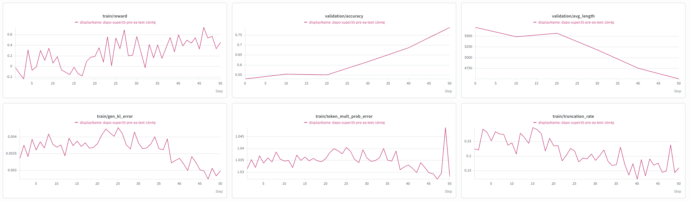
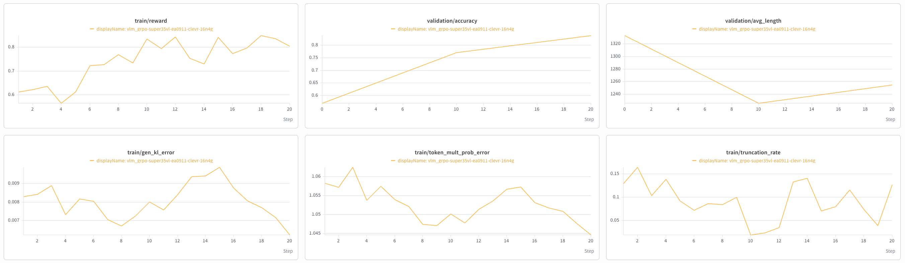

# Nemotron 3.5 Super VL

This page collects NeMo RL guidance for post-training Nemotron 3.5 Super VL
(`NemotronH_Omni_Reasoning_V3`), a hybrid Mamba + Attention MoE model with
512 routed experts (22 active) and a RADIO vision tower, on the AutoModel
(DTensor) backend. Use it to set up the environment, launch the text DAPO and
image GRPO recipes, and understand the settings that are specific to this model.

> [!IMPORTANT]
> **Early access.** Both recipes run end-to-end on 16 x 4-GPU nodes with
> checkpoint resume: the text DAPO recipe reaches 0.79 AIME-2024 accuracy by
> step 50 and the image GRPO recipe (CLEVR-CoGenT) reaches 0.84 validation
> accuracy by step 20 (see [Reference Results](#reference-results)). No run has
> been taken to full convergence yet, and fewer than 16 nodes is not supported;
> see [Known Issues](#known-issues).

## Support Status

| Stage | Meaning |
| --- | --- |
| **Functionally Ready** | Runnable end-to-end and numerically validated with an initial training run. |
| **Long-Run Convergence Validated** | Trains stably over a full-length run with a healthy, reproducible reward curve. |

Nemotron 3.5 Super VL is **Functionally Ready** for both text (DAPO) and image
(GRPO) post-training.

## What's Supported

| Model | Modality | Training backend | Parallelism | Inference | Precision |
| --- | --- | --- | --- | --- | --- |
| Nemotron 3.5 Super VL (120B-A12B) | LLM (text) | AutoModel (DTensor) | FSDP2 + EP | vLLM (Super VL fork) | BF16 compute, FP32 master |
| Nemotron 3.5 Super VL (120B-A12B) | VLM (image) | AutoModel (DTensor) | FSDP2 + EP | vLLM (Super VL fork) | BF16 compute, FP32 master |

Notes:

- **Training** runs on the AutoModel (DTensor) backend with FSDP2 over all
  parameters and expert parallelism (DeepEP) for the routed experts. The Megatron
  backend for this model lives on the `super-v3.5-posttraining` branch and is not
  covered here.
- **Generation** uses a vLLM fork; stock vLLM 0.25.1 does not register the
  `NemotronH_Omni_Reasoning_V3` architecture. See
  [Build the Environment](#build-the-environment).
- The DAPO recipe drives the model text-only (tokenizer path, `is_vlm=false`,
  vLLM never receives images). The image GRPO recipe uses the
  `NemotronH_Omni_Reasoning_V3Processor` via `run_vlm_grpo.py`; for this
  architecture vLLM loads the checkpoint from disk (`load_format=auto`) and the
  language model is refit every step.

## Build the Environment

Published NeMo RL containers do not include the Nemotron 3.5 Super VL runtime.
Both AutoModel and vLLM come from pinned sources in this branch.

### 1. Pinned sources

- **AutoModel** — the submodule is pinned to
  [`9d875a6d`](https://github.com/NVIDIA-NeMo/Automodel/commit/9d875a6d3fafe1d101e2d22c39a80d06b3c2ba5d)
  on `main`, which includes Nemotron 3.5 Super VL support
  ([#3801](https://github.com/NVIDIA-NeMo/Automodel/pull/3801)) and the
  `fc2_latent_proj` dtype fix
  ([#3828](https://github.com/NVIDIA-NeMo/Automodel/pull/3828)) that NeMo RL's
  FSDP mixed-precision policy requires. This pin moves the `automodel` extra to
  `transformers==5.15.1`.
- **vLLM** — `pyproject.toml` installs the `vllm` extra from the
  [`super_vl_rl_v0.25.1`](https://github.com/TomerBN-Nvidia/vllm/tree/super_vl_rl_v0.25.1)
  fork at `33484aad` as a direct git requirement. The fork only changes the
  Python layer (architecture registration, transformers-native RADIO checkpoint
  layout, Mamba prefix-cache fixes), so the build reuses the upstream v0.25.1
  precompiled wheel (`VLLM_USE_PRECOMPILED=1`,
  `VLLM_PRECOMPILED_WHEEL_COMMIT=752a3a50`, the v0.25.1 tag on
  `wheels.vllm.ai`). Nothing to clone.
- **FlashInfer** stays on upstream 0.6.13.

```bash
git submodule update --init 3rdparty/Automodel-workspace/Automodel
```

### 2. Force a worker-venv rebuild

Ray worker virtual environments are cached, so they will not pick up the
AutoModel source or the `pyproject.toml` dependency bump unless you ask for a
rebuild:

```bash
export NRL_FORCE_REBUILD_VENVS=true

# Multi-node only. Every node's venv builder contends on one lock in the shared
# uv cache while vLLM's metadata is built.
export UV_LOCK_TIMEOUT=3600
```

> [!NOTE]
> The precompiled vLLM wheel is fetched from `https://wheels.vllm.ai` during
> `uv sync`/`uv lock`. If compute nodes have no external network, warm the shared
> `UV_CACHE_DIR` once from a node that does, or bake the rebuilt venvs into a
> container image (`enroot`/Pyxis `--container-save`) and launch from that image
> without `NRL_FORCE_REBUILD_VENVS`. After rebuilding inside a container,
> regenerate `/opt/nemo_rl_container_fingerprint` with
> `python tools/generate_fingerprint.py` so the version check passes.

## Example Recipes

AutoModel (DTensor) training with colocated vLLM generation. The recipe YAMLs
under `examples/configs/recipes/` are the source of truth.

| Algo | Data | Seq | Train EP | vLLM TP/EP | `max_new_tokens` | Nodes | Recipe |
|---|---|---|---|---|---|---|---|
| DAPO (text) | DAPO-Math-17K / AIME-2024 | 9216 | 4 | 4 / 4 | 8192 | 16 x 4 GPUs | [`dapo-nemotron3.5-super-vl-120BA12B-16n4g-automodel.yaml`](../../../../examples/configs/recipes/llm/dapo-nemotron3.5-super-vl-120BA12B-16n4g-automodel.yaml) |
| GRPO (image) | CLEVR-CoGenT | 8192 | 4 | 4 / 4 | 4096 | 16 x 4 GPUs | [`vlm_grpo-nemotron3.5-super-vl-120BA12B-clevr-16n4g-automodel.yaml`](../../../../examples/configs/recipes/vlm/vlm_grpo-nemotron3.5-super-vl-120BA12B-clevr-16n4g-automodel.yaml) |

Both recipes are sized for 16 x 4-GPU GB200 nodes: train `expert_parallel_size: 4`
and vLLM `tensor_parallel_size: 4` / `expert_parallel_size: 4` (one vLLM engine
per node). See [Parallelism](#parallelism) for why EP must stay within a node.

The image recipe mirrors the Nano Omni CLEVR recipe
(`vlm_grpo-nemotron-omni-30ba3b-clevr-1n8g-automodel-ep8.v1.yaml`):
`automodel_kwargs.freeze_config` trains the language model and keeps the vision
and audio towers fixed, image tokens are `bad_words`, `limit_mm_per_prompt.image: 2`,
`mm_processor_cache_gb: 0`, the Nemotron Omni CLEVR prompt, and
`train_global_batch_size: 64` (a multiple of the 64-way data parallelism). Launch
it with `examples/run_vlm_grpo.py`.

The text recipe mirrors the Nemotron 3.5 Lightning DAPO recipe: dynamic sampling
(`batch_multiplier: 3`), Clip-Higher (`ratio_clip_max: 0.28`), overlong
filtering and soft overlong reward shaping, `reference_policy_kl_penalty: 0`,
FusedAdam with FP32 master weights, activation checkpointing, and
`moe_parallelizer.ignore_router_for_ac: true` (required with activation
checkpointing on this MoE: the BF16 router top-k is nondeterministic on
recompute).

### Model-specific settings

These are set in the recipe and are required for this model:

| Setting | Value | Why |
|---|---|---|
| `policy.hf_config_overrides.num_nextn_predict_layers` | `0` | The checkpoint ships one MTP layer (`mtp.*` tensors). AutoModel builds it by default; this drops it on the training side. Keep `generation.vllm_kwargs.speculative_config` unset for the same reason. |
| `policy.generation.vllm_cfg.skip_tokenizer_init` | `false` | vLLM's multimodal encoder budget calls the tokenizer during engine init for this architecture; the text-only default (`true`) fails with `You cannot pass text prompts when skip_tokenizer_init=True`. |
| `policy.generation.vllm_kwargs.skip_mm_profiling` | `true` | Skip vLLM's multimodal profiling pass at engine init. The text recipe never sends images; the image recipe's CLEVR inputs (at most two small images per prompt) run without the profiling-based encoder-cache reservation. |
| `policy.generation.vllm_kwargs.mamba_ssm_cache_dtype` | `float32` | Matches the checkpoint's `mamba_ssm_cache_dtype`. |
| `policy.dtensor_cfg.automodel_kwargs.force_hf` | unset | The custom AutoModel implementation and its state-dict adapter are required for EP and per-tensor refit. |
| `policy.dtensor_cfg.env_vars.PYTORCH_CUDA_ALLOC_CONF` | unset | See [Known Issues](#known-issues): `expandable_segments:True` breaks the colocated IPC refit on some clusters. |

### Parallelism

- **Training EP must not exceed the GPUs per node.** The AutoModel DeepEP
  dispatcher (V1 `Buffer` API) assumes an expert-parallel group of up to 8 ranks
  is intranode and exchanges CUDA IPC memory handles. If the group spans nodes
  (for example EP=8 on 4-GPU GB200 nodes), `Buffer` initialization fails with
  `CUDA error ... deep_ep.cpp 'invalid resource handle'`. Both recipes use
  `expert_parallel_size: 4` for 4-GPU nodes.
- **vLLM TP and EP live on the same GPUs.** `expert_parallel_size ==
  tensor_parallel_size` runs one engine per node with dense layers TP-sharded
  and experts EP-sharded (`enable_expert_parallel`). Set both to the GPUs per
  node.
- FSDP2 shards all parameters (including experts) over the full world, so
  persistent memory per GPU does not depend on EP; EP only changes the
  transient unsharded expert weights and all-to-all traffic.

## Launch

Both recipes default to 16 nodes x 4 GPUs.

```bash
export NRL_FORCE_REBUILD_VENVS=true

# Text DAPO (DAPO-Math-17K / AIME-2024)
uv run examples/run_grpo.py \
  --config examples/configs/recipes/llm/dapo-nemotron3.5-super-vl-120BA12B-16n4g-automodel.yaml

# Image GRPO (CLEVR-CoGenT)
uv run examples/run_vlm_grpo.py \
  --config examples/configs/recipes/vlm/vlm_grpo-nemotron3.5-super-vl-120BA12B-clevr-16n4g-automodel.yaml
```

Resume is automatic from the latest checkpoint in `checkpointing.checkpoint_dir`;
chaining Slurm jobs with the same name under `ray.sub`'s
`--dependency=singleton` runs them back to back. On Slurm, keep
`cluster.num_nodes` and `cluster.gpus_per_node` in step with what you request
from the scheduler.

## Reference Results

### Training curves

Both runs use the recipe defaults (16 x 4-GPU GB200 nodes, train EP4, vLLM
TP4/EP4) with the AutoModel (DTensor) backend and colocated vLLM generation,
chained as 4-hour Slurm jobs that resume from the latest checkpoint. Curves are
wandb exports; the x axis is the training step.

**Text DAPO, DAPO-Math-17K / AIME-2024** — the DAPO recipe run on the text-SFT
checkpoint (`nvidia/nemotron-3.5-super-pre-ea-text-08282026`), 50 steps,
`max_new_tokens: 8192`.



AIME-2024 validation accuracy climbs from 0.53 at step 0 to **0.79 at step 50**
(0.55 at step 20, 0.69 at step 40) while the mean validation response length
falls from ~5,700 to ~4,600 tokens and `truncation_rate` drops from ~0.28 to
~0.15: the policy gets both more accurate and more concise. Training reward
rises from around -0.2 to a noisy 0.4-0.7 band. `gen_kl_error` stays in the
0.003-0.004 range and `token_mult_prob_error` in 1.03-1.04 throughout, so the
trainer and vLLM stay in agreement across the refits; the isolated
`token_mult_prob_error` spike at step 49 coincides with a job boundary and
resume.

**Image GRPO, CLEVR-CoGenT** — the image recipe on the early-access VL
checkpoint (`NVIDIA-Nemotron-3.5-Super-EA-09112026`), first 20 steps of the
chain.



CLEVR-CoGenT (valA, 256 samples) accuracy rises from 0.57 at step 0 to 0.77 at
step 10 and **0.84 at step 20**, with training reward moving from ~0.6 to a
0.80-0.85 band by step 10. Mean validation response length stays short
(~1,330 to ~1,250 tokens of the 4,096 budget) and `truncation_rate` falls from
~0.15 to a 0.03-0.13 band. `gen_kl_error` sits at 0.006-0.009 and
`token_mult_prob_error` at 1.045-1.06, both flat, i.e. trainer and vLLM stay
in agreement across the refits. The chain is still running; the curves will be
extended as more steps complete.

Both runs were also exercised for save/resume: the text chain resumed across
five jobs, the image recipe was validated with a 2-step save followed by a
resume to step 4 before the long run.

## Known Issues

- **`expandable_segments:True` breaks the colocated IPC refit on some
  clusters.** With that allocator setting PyTorch exports CUDA IPC handles as
  file descriptors fetched via `pidfd_getfd`; on clusters where that syscall path
  is unavailable the trainer-to-vLLM weight transfer fails with
  `pidfd_getfd: Bad file descriptor` and every key is reported missing. The
  recipe deliberately leaves `PYTORCH_CUDA_ALLOC_CONF` unset (default allocator,
  legacy `cudaIpcMemHandle` sharing).
- **Training EP across nodes is limited by DeepEP V1's 8-peer intranode
  assumption.** Larger EP on 4-GPU nodes needs the `hybridep` or `torch`
  dispatcher (`policy.dtensor_cfg.automodel_kwargs.backend.dispatcher`) or a
  DeepEP build with MNNVL enabled; not validated here.
- **Vision-weight refit requires a vLLM loader that understands the native
  RADIO layout.** Automodel's Omni state-dict adapter keeps the transformers-
  native RADIO names in its per-tensor conversion (Automodel
  [#3924](https://github.com/NVIDIA-NeMo/Automodel/pull/3924), included in the
  pinned commit); it cannot fuse q/k/v into the legacy `attn.qkv` one tensor at
  a time. The pinned vLLM fork maps those names onto its fused qkv as q/k/v
  shards, so refit covers the whole vision tower. Upstream vLLM `radio.py` only
  accepts the legacy `radio_model.*` layout and would silently drop the streamed
  vision weights, so before moving to upstream vLLM either its loader needs the
  native branch or NeMo-RL must convert the vision subtree as a group via
  `to_hf` (and skip refit for frozen vision parameters). The image recipe
  freezes the vision tower and uses `load_format=auto`, so generation uses the
  checkpoint's vision weights regardless.
- **vLLM vision encoder must not use FLASH_ATTN on Blackwell.** With the
  v0.25.1 precompiled wheel, `get_flash_attn_version` selects FA4 (CuTe DSL) on
  SM100, and the wheel's `flash_attn_interface` unpacks four return values from a
  CuTe `_flash_attn_fwd` that returns two. The language model is unaffected (it
  uses FlashInfer), but the RADIO encoder crashes on the first image batch. The
  image recipe sets `vllm_kwargs.mm_encoder_attn_backend: TORCH_SDPA`.
- **Host memory is the limit for node counts below 16.** Per 4-GPU GB200 node
  (942 GB) the colocated run holds ~88 GiB of pinned vLLM sleep backup per TP
  worker plus, while the trainer is offloaded for generation, the sharded
  params + optimizer state of 4 ranks. On 8 nodes the offload copies are not
  returned to the OS after onload (a caching allocator outside glibc keeps
  them), so the node sits at ~880 GB and the first checkpoint save is
  OOM-killed. 16 nodes peak at ~840 GB including the save. The image recipe
  also sets `policy.dtensor_cfg.async_checkpoint_save: false` to avoid the
  extra async staging copy during saves.
