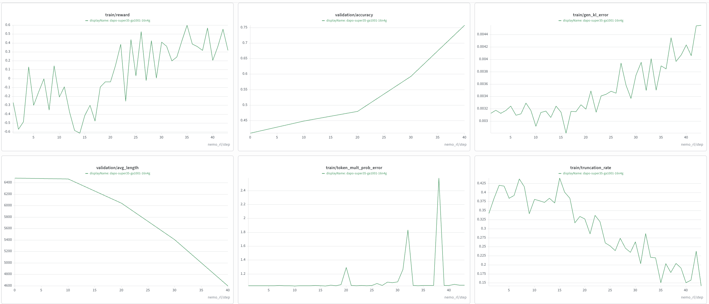
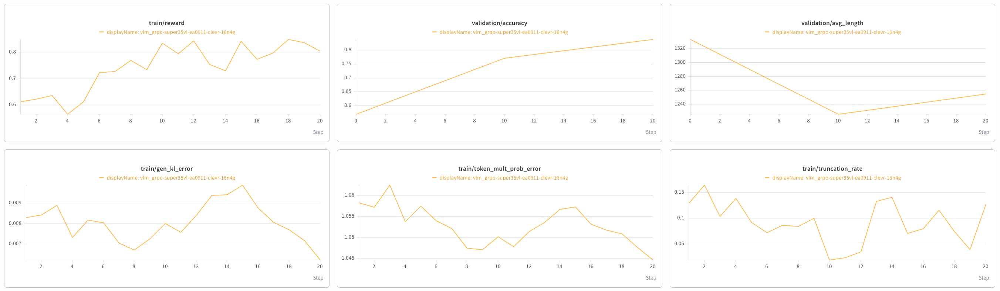

# Nemotron 3.5 Super VL

This page collects NeMo RL guidance for text and image post-training of
Nemotron 3.5 Super VL (`NemotronH_Omni_Reasoning_V3`), a hybrid Mamba +
Attention MoE model with 512 routed experts (22 active) and a RADIO vision
tower, on the AutoModel (DTensor) backend. Use it to launch the text DAPO and
image GRPO recipes and understand the settings that are specific to this model.

## What's Supported

| Model | Modality | Training backend | Parallelism | Inference | Precision |
| --- | --- | --- | --- | --- | --- |
| Nemotron 3.5 Super VL (120B-A12B) | LLM (text) | AutoModel (DTensor) | FSDP2 + EP | vLLM | BF16 compute, FP32 master |
| Nemotron 3.5 Super VL (120B-A12B) | VLM (image) | AutoModel (DTensor) | FSDP2 + EP | vLLM | BF16 compute, FP32 master |

Notes:

- **Training** runs on the AutoModel (DTensor) backend with FSDP2 over all
  parameters and expert parallelism (HybridEP dispatcher) for the routed
  experts.
- **Generation** uses the pinned stock vLLM, which registers
  `NemotronH_Omni_Reasoning_V3` and loads the checkpoint's RADIO weights from
  disk (`load_format=auto`). The language model is refit from the trainer every
  step. Two NeMo RL source patches on vLLM's Nemotron VL model apply
  automatically when the generation workers start: one adds the checkpoint's
  final vision LayerNorm (`vision_projector.vision_final_layernorm.*`, present
  on MTP-trained checkpoints and otherwise dropped by vLLM), the other lets the
  RADIO loader accept the transformers-native weight names the Automodel policy
  streams at refit, so a trained vision tower reaches vLLM.
- The DAPO recipe drives the model text-only: the tokenizer path (no processor)
  is used, so the DTensor worker runs with `is_vlm=false` and vLLM never
  receives images. The image GRPO recipe uses the checkpoint's processor and
  trains the language model with the vision and audio towers frozen
  (`automodel_kwargs.freeze_config`); set `freeze_vision_tower: false` to train
  the vision tower as well.

## Environment

Use the standard NeMo RL environment described in the
[installation guide](../../../about/installation.md). The Automodel submodule
pinned on `main` (`r0.6.0` at `b916107a5` or later) registers
`NemotronH_Omni_Reasoning_V3` and includes the fixes this recipe depends on
(Automodel [#3874](https://github.com/NVIDIA-NeMo/Automodel/pull/3874) and
[#4211](https://github.com/NVIDIA-NeMo/Automodel/pull/4211)); the stock vLLM
pin registers the same architecture for generation. No custom source checkouts
or manual builds are needed. For container and worker-venv details, see
[Dependency Management](../../../design-docs/dependency-management.md).

Both recipes train
[`nvidia/NVIDIA-Nemotron-3.5-Super-VL-120B-A12B-BF16`](https://huggingface.co/nvidia/NVIDIA-Nemotron-3.5-Super-VL-120B-A12B-BF16):
the text recipe on the DAPO-Math-17K training set with AIME-2024 validation,
the image recipe on CLEVR-CoGenT (trainA / valA), all from Hugging Face. Set
`HF_HOME` to a cache visible from every node:

```bash
export HF_HOME=<path-to-shared-huggingface-cache>
export WANDB_API_KEY=<your-wandb-api-key>
```

The recipes enable W&B logging; pass `logger.wandb_enabled=false` if W&B is not
configured.

## Example Recipes

AutoModel (DTensor) training with colocated vLLM generation. The recipe YAMLs
under `examples/configs/recipes/` are the source of truth.

| Algo | Data | Seq | Train EP | vLLM TP/EP | `max_new_tokens` | Nodes | Recipe |
|---|---|---|---|---|---|---|---|
| DAPO (text) | DAPO-Math-17K / AIME-2024 | 9216 | 4 | 4 / 4 | 8192 | 16 x 4 GPUs | [`dapo-nemotron3.5-super-vl-120BA12B-16n4g-automodel.yaml`](../../../../examples/configs/recipes/llm/dapo-nemotron3.5-super-vl-120BA12B-16n4g-automodel.yaml) |
| GRPO (image) | CLEVR-CoGenT | 8192 | 4 | 4 / 4 | 4096 | 16 x 4 GPUs | [`vlm_grpo-nemotron3.5-super-vl-120BA12B-clevr-16n4g-automodel.yaml`](../../../../examples/configs/recipes/vlm/vlm_grpo-nemotron3.5-super-vl-120BA12B-clevr-16n4g-automodel.yaml) |

Both recipes are sized for 16 x 4-GPU GB200 nodes: train `expert_parallel_size: 4`
and vLLM `tensor_parallel_size: 4` / `expert_parallel_size: 4` (one vLLM engine
per node). See [Parallelism](#parallelism) for why EP must stay within a node.

The image recipe mirrors the Nano Omni CLEVR recipe
(`vlm_grpo-nemotron-omni-30ba3b-clevr-1n8g-automodel-ep8.v2.yaml`):
`automodel_kwargs.freeze_config` trains the language model and keeps the vision
and audio towers fixed, image tokens are `bad_words`, `limit_mm_per_prompt.image: 2`,
`mm_processor_cache_gb: 0`, the Nemotron Omni CLEVR prompt, and
`train_global_batch_size: 64` (a multiple of the 64-way data parallelism). Launch
it with `examples/run_vlm_grpo.py`.

The text recipe mirrors the Nemotron 3.5 Lightning DAPO recipe: dynamic sampling
(`batch_multiplier: 3`), Clip-Higher (`ratio_clip_max: 0.28`), overlong
filtering and soft overlong reward shaping, `reference_policy_kl_penalty: 0`,
FusedAdam with FP32 master weights, activation checkpointing, and
`moe_parallelizer.ignore_router_for_ac: true` (required with activation
checkpointing on this MoE: the BF16 router top-k is nondeterministic on
recompute).

### Model-specific settings

These are set in the recipes and are required for this model:

| Setting | Value | Why |
|---|---|---|
| `policy.hf_config_overrides.num_nextn_predict_layers` | `0` | The checkpoint ships one MTP layer (`mtp.*` tensors). AutoModel builds it by default; this drops it on the training side. Keep `generation.vllm_kwargs.speculative_config` unset for the same reason. |
| `policy.generation.vllm_kwargs.skip_mm_profiling` | `true` | Skip vLLM's multimodal profiling pass and its encoder-cache reservation. The text recipe never sends images; the image recipe's CLEVR inputs (at most two small images per prompt) run without the profiling-based reservation. |
| `policy.generation.vllm_kwargs.mm_processor_cache_gb` | `0` | Drop vLLM's default 4 GiB host-side multimodal processor cache; host memory is the tight resource for these recipes. |
| `policy.generation.vllm_kwargs.limit_mm_per_prompt.image` | `1` (text) / `2` (image) | vLLM sizes the encoder budget from this limit, and an unset modality defaults to 999 images per prompt. |
| `policy.generation.bad_words` (image recipe) | `<image>`, ``, `</img>`, `<so_embedding>`, `<so_start>`, `<so_end>` | Keep the policy from emitting image placeholder tokens in its responses. |
| `policy.generation.vllm_kwargs.mamba_ssm_cache_dtype` | `float32` | Matches the checkpoint's `mamba_ssm_cache_dtype`. |
| `policy.generation.vllm_cfg.skip_tokenizer_init` | (automatic) / `false` | vLLM's multimodal encoder budget calls the tokenizer during engine init for this architecture. `NemotronH_Omni_Reasoning_V3` is listed in `TOKENIZER_REQUIRED_ARCHITECTURES`, so NeMo RL keeps the tokenizer regardless of the text-only default; the image recipe inherits `false` from `vlm_grpo_3B.yaml`. |
| `policy.automodel_cfg.automodel_kwargs.force_hf` | unset | The custom AutoModel implementation and its state-dict adapter are required for EP and per-tensor refit. |
| `policy.automodel_cfg.env_vars.PYTORCH_CUDA_ALLOC_CONF` | unset | With `expandable_segments:True` PyTorch exports CUDA IPC handles as file descriptors fetched via `pidfd_getfd`; on clusters where that syscall path is unavailable the colocated trainer-to-vLLM refit fails with `pidfd_getfd: Bad file descriptor`. The default allocator uses legacy `cudaIpcMemHandle` sharing. |

### Parallelism

- **Training EP stays within a node.** The recipe uses `expert_parallel_size: 4`
  on 4-GPU GB200 nodes with the HybridEP dispatcher
  (`policy.automodel_cfg.automodel_kwargs.backend.dispatcher: hybridep`), which
  requires `make_sequence_length_divisible_by: 64`. The DeepEP dispatcher also
  works at EP=4 but its V1 `Buffer` API assumes an expert-parallel group of up to
  8 ranks is intranode; EP=8 on 4-GPU nodes fails with
  `CUDA error ... deep_ep.cpp 'invalid resource handle'`.
- **vLLM TP and EP live on the same GPUs.** `expert_parallel_size ==
  tensor_parallel_size` runs one engine per node with dense layers TP-sharded
  and experts EP-sharded (`enable_expert_parallel`). Set both to the GPUs per
  node.
- FSDP2 shards all parameters (including experts) over the full world, so
  persistent memory per GPU does not depend on EP; EP only changes the
  transient unsharded expert weights and all-to-all traffic.

## Launch

Both recipes default to 16 nodes x 4 GPUs.

```bash
# Text DAPO (DAPO-Math-17K / AIME-2024)
uv run examples/run_grpo.py \
  --config examples/configs/recipes/llm/dapo-nemotron3.5-super-vl-120BA12B-16n4g-automodel.yaml

# Image GRPO (CLEVR-CoGenT)
uv run examples/run_vlm_grpo.py \
  --config examples/configs/recipes/vlm/vlm_grpo-nemotron3.5-super-vl-120BA12B-clevr-16n4g-automodel.yaml
```

For launching on a multi-node Slurm or Kubernetes cluster, see the
[cluster guide](../../../cluster.md); keep `cluster.num_nodes` and
`cluster.gpus_per_node` in step with the allocation. Interrupted runs resume
automatically from the latest checkpoint in `checkpointing.checkpoint_dir`.
See the [GRPO guide](../../grpo.md) for the algorithm and common configuration
details.

## Reference Results

### Training curves

The runs use the recipe defaults (16 x 4-GPU GB200 nodes, train EP4, vLLM
TP4/EP4) with the AutoModel (DTensor) backend and colocated vLLM generation,
chained as 4-hour Slurm jobs that resume from the latest checkpoint. Curves are
wandb exports; the x axis is the training step.

**Text DAPO, DAPO-Math-17K / AIME-2024** — 43 steps, `max_new_tokens: 8192`,
starting from `nvidia/NVIDIA-Nemotron-3.5-Super-VL-120B-A12B-BF16`.



AIME-2024 validation accuracy climbs from 0.41 at step 0 to **0.76 at step 40**
(0.45 at step 10, 0.48 at step 20, 0.59 at step 30) while the mean validation
response length falls from ~6,450 to ~4,600 tokens and `truncation_rate` drops
from ~0.40 to ~0.15: the policy gets both more accurate and more concise.
Training reward rises from a noisy -0.6 to -0.1 band to 0.2-0.6 after step 20.
`gen_kl_error` drifts slowly from ~0.003 to ~0.0045 as the policy sharpens, the
same order as the drift documented for other models; the isolated
`token_mult_prob_error` spikes (steps 20, 32, 38) are single-step outliers and
`token_mult_prob_error` returns to ~1.03 on the next step. The chain ran as five
4-hour Slurm jobs that resumed from the latest checkpoint.

**Image GRPO, CLEVR-CoGenT** — 63 steps, `max_new_tokens: 4096`, starting from
`nvidia/NVIDIA-Nemotron-3.5-Super-VL-120B-A12B-BF16` on stock vLLM 0.29 with
the RADIO source patches described above (vision tower frozen).



CLEVR-CoGenT (valA, 256 samples) accuracy rises from 0.78 at step 0 to **0.90
at step 50** (0.82 at step 10, 0.88 at step 20, 0.90 at steps 30 and 40, 0.90
at step 60) while the mean validation response length falls from ~1,120 to
~800 tokens. Training reward moves from a 0.71-0.87 band in the first ten
steps to 0.86-0.95 after step 30. `gen_kl_error` stays flat at 0.0025-0.0031,
`token_mult_prob_error` at 1.02-1.04 and `truncation_rate` below 0.05: trainer
and vLLM stay in agreement across every refit. Steps take ~8 minutes (16 to
20 minutes when the batch retries generation); the chain ran as three 4-hour
Slurm jobs that resumed from the latest checkpoint (steps 21 and 43).
