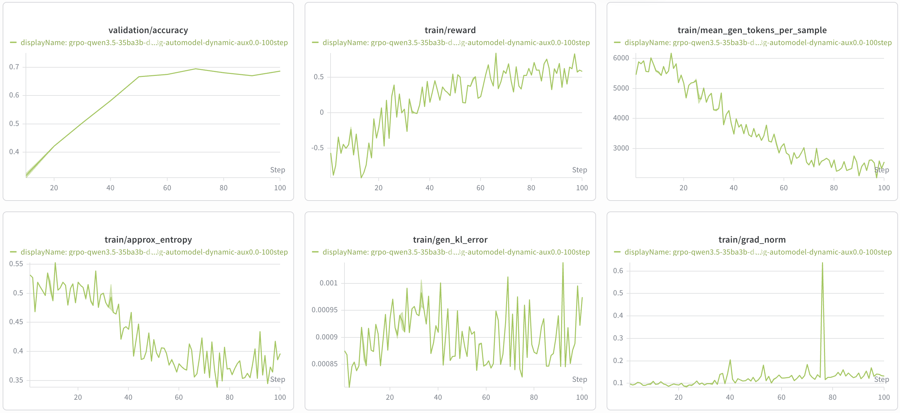

# Qwen3.5

This page collects NeMo RL guidance for Qwen3.5 LLM and VLM post-training. Use it to
choose a starting recipe and understand Qwen3.5-specific setup.

## When to Use This Page

Use this page when training or evaluating Qwen3.5 models, including:

- `Qwen/Qwen3.5-9B-Base`
- `Qwen/Qwen3.5-35B-A3B-Base` (MoE; LLM and VLM)
- `Qwen/Qwen3.5-397B-A17B` (MoE)

For family-wide Qwen guidance, see the [Qwen family hub](index.md). For the full list
of supported models, see [Model Support](../../../about/model-support.md).

## Support Status

Model support is tracked in two stages:

| Stage | Meaning |
| --- | --- |
| **Functionally Ready** | Runnable end-to-end and numerically validated with an initial training run. |
| **Long-Run Convergence Validated** | Trains stably over a full-length run with a healthy, reproducible reward curve. |

The Qwen3.5 family is supported on both the Megatron (MCore) and AutoModel (DTensor)
backends. The specific configurations shipped as [example recipes](#example-recipes)
below are the ones that have been **Long-Run Convergence Validated**. Other variants
and configurations are runnable but have not all been validated for long-run
convergence.

## What's Supported

| Model | Modality | Training backend | Parallelism | Inference |
| --- | --- | --- | --- | --- |
| `Qwen/Qwen3.5-9B-Base` | LLM (dense) | Megatron | TP | vLLM |
| `Qwen/Qwen3.5-35B-A3B-Base` | LLM (MoE) | Megatron | TP + EP + PP + CP | vLLM |
| `Qwen/Qwen3.5-35B-A3B-Base` | LLM (MoE) | AutoModel (DTensor) | EP + CP | vLLM |
| `Qwen/Qwen3.5-35B-A3B-Base` | VLM (MoE) | Megatron | TP + EP + PP + CP | vLLM |
| `Qwen/Qwen3.5-35B-A3B-Base` | VLM (MoE) | AutoModel (DTensor) | EP | vLLM |
| `Qwen/Qwen3.5-397B-A17B` | LLM (MoE) | Megatron | TP + EP + PP + CP | vLLM |

Notes on backends and parallelism:

- **Megatron (MCore)** supports the full parallelism set for Qwen3.5 MoE — Tensor
  Parallel (TP), Expert Parallel (EP), Pipeline Parallel (PP), and Context Parallel
  (CP) for longer sequences — on both the LLM and the VLM (see
  [#2312](https://github.com/NVIDIA-NeMo/RL/pull/2312) for CP).
- **AutoModel (DTensor)** supports Expert Parallel (EP), and Context Parallel for
  the MoE **LLM** only; CP on AutoModel requires the TE backend and
  `flash-linear-attention`. **Dense Qwen3.5 and the VLM do not support Context
  Parallel on AutoModel** (set `cp_size = 1`). See
  [`flash-linear-attention` Performance](#flash-linear-attention-performance).

## Example Recipes

The recipes below are example starting points. Recipe YAML files under
`examples/configs/recipes/` are the source of truth; check the YAML file for the
authoritative settings.

| Model | Modality | Algorithm | Backend | Scale | Recipe |
|---|---|---|---|---|---|
| Qwen3.5-9B-Base | LLM | GRPO | Megatron | 1n8g | [`grpo-qwen3.5-9b-1n8g-megatron.yaml`](../../../../examples/configs/recipes/llm/grpo-qwen3.5-9b-1n8g-megatron.yaml) |
| Qwen3.5-35B-A3B-Base | LLM | GRPO | Megatron | 2n8g | [`grpo-qwen3.5-35ba3b-2n8g-megatron-ep16tp2cp2.yaml`](../../../../examples/configs/recipes/llm/grpo-qwen3.5-35ba3b-2n8g-megatron-ep16tp2cp2.yaml) |
| Qwen3.5-35B-A3B-Base | LLM | GRPO | AutoModel | 2n8g | [`grpo-qwen3.5-35ba3b-2n8g-automodel-ep16.yaml`](../../../../examples/configs/recipes/llm/grpo-qwen3.5-35ba3b-2n8g-automodel-ep16.yaml) |
| Qwen3.5-35B-A3B-Base | LLM | GRPO | AutoModel | 4n8g | [`grpo-qwen3.5-35ba3b-dapo-4n8g-automodel.yaml`](../../../../examples/configs/recipes/llm/grpo-qwen3.5-35ba3b-dapo-4n8g-automodel.yaml) |
| Qwen3.5-397B-A17B | LLM | GRPO | Megatron | 32n8g | [`grpo-qwen3.5-397ba17b-32n8g-megatron.v2.yaml`](../../../../examples/configs/recipes/llm/grpo-qwen3.5-397ba17b-32n8g-megatron.v2.yaml) |
| Qwen3.5-35B-A3B-Base | VLM | GRPO | Megatron | 2n8g | [`vlm_grpo-qwen3.5-35ba3b-geo3k-2n8g-megatron-ep16.yaml`](../../../../examples/configs/recipes/vlm/vlm_grpo-qwen3.5-35ba3b-geo3k-2n8g-megatron-ep16.yaml) |
| Qwen3.5-35B-A3B-Base | VLM | GRPO | AutoModel | 2n8g | [`vlm_grpo-qwen3.5-35ba3b-geo3k-2n8g-automodel-ep16.yaml`](../../../../examples/configs/recipes/vlm/vlm_grpo-qwen3.5-35ba3b-geo3k-2n8g-automodel-ep16.yaml) |

> [!NOTE]
> Qwen3.5 thinking-mode and long-reasoning runs need a large generation budget. If
> `policy.generation.max_new_tokens` (and the matching `policy.max_total_sequence_length`
> or `policy.generation.vllm_cfg.max_model_len`) are too small, the reasoning trace might
> be truncated before the final answer, and evaluation accuracy might appear near zero
> even when training metrics look normal. Use `max_new_tokens >= 8192` for reasoning
> tasks. See [#2725](https://github.com/NVIDIA-NeMo/RL/issues/2725).

## Choose a Recipe

### Small LLM Smoke Run

Use the 9B Megatron recipe to validate the setup, launch mechanics, logging, and
checkpointing.

```sh
uv run examples/run_grpo.py \
  --config examples/configs/recipes/llm/grpo-qwen3.5-9b-1n8g-megatron.yaml
```

### 35B-A3B GRPO (Megatron or AutoModel)

Select the backend you want to validate. Both backends support Context Parallel for
the 35B-A3B LLM; Megatron additionally supports Tensor Parallel.

```sh
# Megatron (EP16 TP2 CP2)
uv run examples/run_grpo.py \
  --config examples/configs/recipes/llm/grpo-qwen3.5-35ba3b-2n8g-megatron-ep16tp2cp2.yaml

# AutoModel (EP16)
uv run examples/run_grpo.py \
  --config examples/configs/recipes/llm/grpo-qwen3.5-35ba3b-2n8g-automodel-ep16.yaml
```

For long-reasoning tasks, override the generation length explicitly:

```sh
uv run examples/run_grpo.py \
  --config examples/configs/recipes/llm/grpo-qwen3.5-35ba3b-2n8g-megatron-ep16tp2cp2.yaml \
  policy.max_total_sequence_length=9216 \
  policy.generation.max_new_tokens=8192 \
  policy.generation.vllm_cfg.max_model_len=9216
```

### Long-Reasoning GRPO (Ready Out of the Box)

The 4n8g `grpo-qwen3.5-35ba3b-dapo-4n8g-automodel` recipe already sets
`max_new_tokens: 8192` and `max_total_sequence_length: 9216`, and serves as a
suitable starting point for long-reasoning runs.

```sh
uv run examples/run_grpo.py \
  --config examples/configs/recipes/llm/grpo-qwen3.5-35ba3b-dapo-4n8g-automodel.yaml \
  grpo.use_dynamic_sampling=true \
  grpo.batch_multiplier=3 \
  grpo.max_val_samples=960 \
  grpo.val_batch_size=960
```

#### 100-Step Long-Run Results

This recipe was validated for long-run convergence with a 100-step run on 4 nodes
(32 GPUs), using the command above: dynamic sampling enabled and the MoE router
auxiliary loss disabled (`router_aux_loss_coef=0.0`). Disabling the auxiliary loss
matters: the AutoModel backend reads `router_aux_loss_coef` from the Hugging Face
config (Qwen3.5 default: 0.001) and silently injects the MoE load-balancing
gradient into the router during RL training, which conflicts with the policy
objective and severely degrades accuracy. Since
[#3169](https://github.com/NVIDIA-NeMo/RL/pull/3169), the shipped Qwen3.5 AutoModel
recipes set `router_aux_loss_coef: 0.0` in their `hf_config_overrides`, so no
manual override is needed.

The run shows healthy convergence behavior:

- **Validation accuracy** climbs from ~0.33 to ~0.69.
- **Training reward** rises steadily from about -0.7 to about 0.5–0.6.
- **Mean generated tokens per sample** decreases from ~5,500 to ~2,500 as the policy
  learns to reason more concisely within the generation budget.
- **Approximate entropy** declines gradually without collapsing, and **generation KL
  error** and **gradient norm** stay low and stable throughout.



### Large MoE (397B-A17B)

The 397B-A17B Megatron recipe targets 32 nodes (256 GPUs) with TP8, PP8, and EP32 and
`max_new_tokens: 8192`.

```sh
uv run examples/run_grpo.py \
  --config examples/configs/recipes/llm/grpo-qwen3.5-397ba17b-32n8g-megatron.v2.yaml
```

### VLM (Geo3K)

The VLM recipes target the Geo3K task. They train the vision tower according to their
`freeze_config` (see [Model Quirks](../../../model-quirks.md)).

```sh
uv run examples/run_grpo.py \
  --config examples/configs/recipes/vlm/vlm_grpo-qwen3.5-35ba3b-geo3k-2n8g-megatron-ep16.yaml
```

## `flash-linear-attention` Performance

Qwen3.5 relies on `flash-linear-attention` (FLA) and `causal-conv1d` kernels for
full speed. There are two distinct cases:

- **Performance fallback on AutoModel and DTensor.** Several `nemo-automodel` kernels
  dispatch to FLA if it is importable and otherwise fall back to slower PyTorch
  implementations. Without FLA, Qwen3.5 (dense or MoE) trains roughly **two times
  slower** on the AutoModel path, without raising an error. The `-megatron` recipes use Megatron Core
  kernels directly and are not affected. See
  [#2722](https://github.com/NVIDIA-NeMo/RL/issues/2722) and
  [#2324](https://github.com/NVIDIA-NeMo/RL/issues/2324).
- **Hard requirement for AutoModel Qwen3.5 MoE and Context Parallel.** When
  `context_parallel_size > 1` for a Qwen3.5 MoE model on the AutoModel backend,
  NeMo RL requires FLA and raises `ImportError` if it is missing (see the `import
  fla` guard in the `nemo_rl/models/automodel/setup.py` file). Context Parallel on
  AutoModel applies to the MoE **LLM** only and also requires the TE backend;
  **neither dense Qwen3.5 nor the VLM supports Context Parallel on AutoModel**
  (set `cp_size = 1`).

> [!NOTE]
> Starting with the v0.7.0 release container, FLA is installed in the AutoModel
> worker virtual environment by default: the `automodel` extra depends on
> `nemo-automodel[moe]`, which includes `flash-linear-attention` and
> `causal-conv1d` (see [Automodel#1894](https://github.com/NVIDIA-NeMo/Automodel/pull/1894),
> previously tracked on the NeMo RL side by [#2324](https://github.com/NVIDIA-NeMo/RL/issues/2324)).
> No manual installation is needed.
