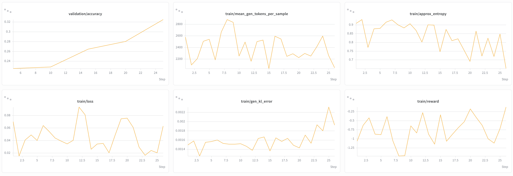

# Qwen3.8-Flash-Next

This page collects NeMo RL guidance for post-training
[Qwen3.8-Flash-Next](https://huggingface.co/Qwen/Qwen3.8-Flash-Next) 180B. Use
it to set up the environment, choose a starting recipe, and understand the
settings that are specific to this model.

> [!IMPORTANT]
> **Early access.** Qwen3.8-Flash-Next 180B runs end-to-end in NeMo RL. The
> documented 4k GRPO configuration has been numerically validated for 182
> training steps and shows improving validation accuracy and reward. This is
> limited convergence evidence at 4k context length; longer context lengths
> have not yet been validated.

## Support Status

Model support is tracked in two stages:

| Stage | Meaning |
| --- | --- |
| **Functionally Ready** | Runnable end-to-end and numerically validated with an initial training run. |
| **Long-Run Convergence Validated** | Trains stably over a full-length run with a healthy, reproducible reward curve. |

Qwen3.8-Flash-Next 180B is **Functionally Ready**, with limited convergence
evidence for the documented 4k configuration.

## What's Supported

| Model | Modality | Training backend | Parallelism | Inference | Precision |
| --- | --- | --- | --- | --- | --- |
| Qwen3.8-Flash-Next 180B | LLM (text-only path) | AutoModel (DTensor) | FSDP2 + EP | vLLM | BF16 |

Notes:

- **Training** runs on the AutoModel (DTensor) backend with TP1 and EP64.
- **Inference** uses eight colocated vLLM TP8/EP8 replicas on the 8-node,
  64-GPU allocation.

## Build the Environment

Use the pinned AutoModel submodule together with the vLLM wheel selected by the
repository lock file. The wheel is built from the upstream Qwen3.8-Flash-Next
support commit, so a separate vLLM source checkout is not required.

### 1. Initialize AutoModel

Sources:

- **AutoModel** — upstream commit
  [`8c954f67`](https://github.com/NVIDIA-NeMo/Automodel/commit/8c954f67d2977b401b06f98ab8b7a218ce07363f),
  pinned by this repository's AutoModel submodule.
- **vLLM** — upstream commit
  [`e126687a`](https://github.com/vllm-project/vllm/commit/e126687a9a828d513c01a07cd69f025f27d63280),
  from [vLLM PR #53896](https://github.com/vllm-project/vllm/pull/53896).

The root `pyproject.toml` pins the official CUDA 13 vLLM wheels built from that
commit for both x86_64 and aarch64.

```bash
git submodule update --init 3rdparty/Automodel-workspace/Automodel
```

The vLLM environment uses FlashInfer 0.6.18. `flashinfer-cubin` is not an
install requirement; FlashInfer uses the pinned 0.6.18 JIT cache instead.

### 2. Refresh the worker environments

Ray worker virtual environments are cached. After updating to this lock file,
refresh stale environments so they pick up the pinned AutoModel source and
vLLM wheel:

```bash
export NRL_FORCE_REBUILD_VENVS=true

# Multi-node only. Every node's venv builder contends on one lock in the shared
# uv cache; uv's default 300 s lock timeout can expire before waiting nodes
# acquire it.
export UV_LOCK_TIMEOUT=3600
```

## Get the Weights

The recipe ships with a placeholder checkpoint path. Point the model and
tokenizer at your local checkpoint directory. The checkpoint must include its
`qwen4_exp` Hugging Face configuration, which vLLM reads directly:

```bash
uv run examples/run_grpo.py \
  --config examples/configs/recipes/llm/grpo-qwen3.8-flash-next-dapo-8n8g-automodel.yaml \
  policy.model_name=/your/path/to/qwen3.8-flash-next-180b \
  policy.tokenizer.name=/your/path/to/qwen3.8-flash-next-180b
```

or edit the checkpoint path in the YAML directly.

## Example Recipes

The recipe is DAPO-style GRPO on DAPO-Math-17K with AIME-2024 validation,
AutoModel (DTensor) training with colocated vLLM generation, on 8 nodes x 8 GPUs.
Recipe YAML files under `examples/configs/recipes/` are the source of truth.

The YAML defaults to the currently validated 4k launch configuration.

| Validated seq | Training EP | Rollout TP/EP | `max_new_tokens` | Recipe |
|---|---|---|---|---|
| 4096 | 64 | 8/8 | 3072 | [`grpo-qwen3.8-flash-next-dapo-8n8g-automodel.yaml`](../../../../examples/configs/recipes/llm/grpo-qwen3.8-flash-next-dapo-8n8g-automodel.yaml) |

This is a DAPO-style recipe with overlong reward shaping, asymmetric clipping,
and token-level loss. Dynamic sampling is disabled in the current recipe.

> [!IMPORTANT]
> In the validated 4k launch, `max_new_tokens` is
> `max_total_sequence_length - data.max_input_seq_length` (4096 - 1024 = 3072).
> Keep that relationship if you change the sequence length. If
> `max_new_tokens` is larger than the context leaves room for, vLLM silently
> caps generation per sample at `max_model_len - input_length`, so the effective
> budget varies with prompt length instead of being uniform.

## Choose a Recipe

Use the 4k, 8-node launch below as the starting point for full-model training.

### Why context length matters here

> [!NOTE]
> Context-length comparisons will be added after reference runs are available.

## Launch

```bash
export NRL_FORCE_REBUILD_VENVS=true

uv run examples/run_grpo.py \
  --config examples/configs/recipes/llm/grpo-qwen3.8-flash-next-dapo-8n8g-automodel.yaml \
  policy.model_name=/your/path/to/qwen3.8-flash-next-180b \
  policy.tokenizer.name=/your/path/to/qwen3.8-flash-next-180b
```

On Slurm, keep `cluster.num_nodes` in step with what you request from the scheduler.
A mismatch wedges Ray placement rather than failing cleanly:

```bash
uv run examples/run_grpo.py --config <recipe> cluster.num_nodes=8
```

## Reference Results

### Training curves

The curves below show 182 training steps from the latest 4k GRPO experiment.
Validation accuracy improves from 0.381 at step 5 to 0.696 at step 180, while
training reward increases from -0.234 to 0.838 and mean generated tokens per
sample decreases from about 2,000 to 1,226. These results extend functional
validation and provide limited convergence evidence for the documented 4k
configuration. Longer context lengths have not yet been validated.



## Known Issues

- **Convergence validation is limited to the documented 4k configuration.**
  Current evidence covers 182 training steps; longer context lengths have not
  yet been validated.
