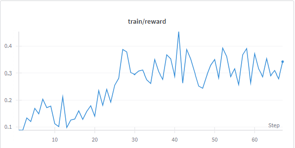
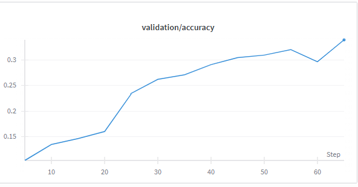
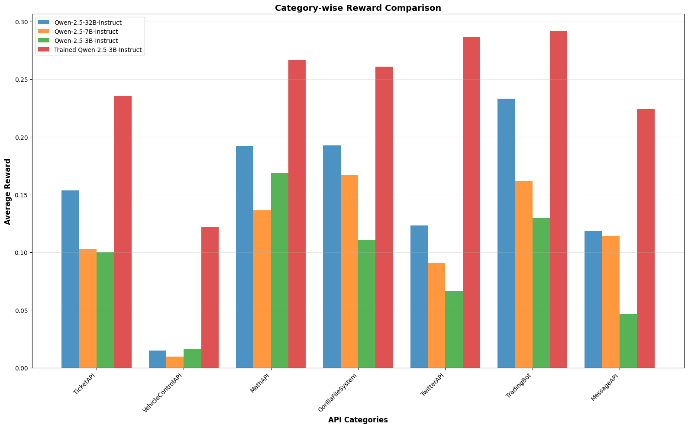

# Multi-Turn Tool Calling with BFCL v3

[BFCL v3 (Berkeley Function Tool Calling)](https://gorilla.cs.berkeley.edu/blogs/13_bfcl_v3_multi_turn.html) is a multi-turn and multi-step function calling dataset, advancing beyond the single-turn conversations in v1 and v2. This guide explains how to use NeMo RL to implement multi-turn tool calling on BFCLv3 with Group Relative Policy Optimization (GRPO). 

We use tool APIs from [this](https://github.com/bespokelabsai/verifiers/tree/main/verifiers/tools/bfcl_tools) repository. We take in these tools and train the model to execute them based on user prompts. We trained [Qwen/Qwen2.5-3B-Instruct](https://huggingface.co/Qwen/Qwen2.5-3B-Instruct) on the BFCL v3 dataset on just 60 steps, and saw significant improvements in all categories. We then show how to use NeMo RL's evaluation scripts to evaluate the trained model on a subset of that dataset. 

## Training the Model

Follow the instructions in the [README](https://github.com/NVIDIA-NeMo/RL?tab=readme-ov-file#prerequisites) for setting up your environment. Use the following command to start training your model: 
You will have to login to wandb/ set you wandb API_KEY to get the logs in wandb.

```bash
uv run python examples/run_grpo_bfclv3.py --config examples/configs/grpo_bfclv3.yaml logger.wandb_enabled=true logger.wandb.project=nemorl_bfcl_qwen_3b logger.wandb.name=nemorl_bfcl_v3
```

Refer to this [doc](https://github.com/NVIDIA-NeMo/RL/blob/main/docs/cluster.md) for Slurm setup instructions.

## Configuration Parameters

The [`examples/configs/grpo_bfclv3.yaml`](../../examples/configs/grpo_bfclv3.yaml) file contains configs for multi-turn training. `max_rollout_turns` flag sets the maximum number of turns per episode. 

```yaml
grpo:
  max_rollout_turns: 4  # Maximum turns per episode (set to 1 for single-turn, >1 for multi-turn)
  max_num_steps: 100  # Total training steps
  max_num_epochs: 20
  num_prompts_per_step: 16  # Batch size for rollouts
  num_generations_per_prompt: 8  # Multiple generations per prompt for GRPO
```

The model will be trained for `(min(max_steps, len(data_loader)))* max_num_epochs` number of steps.

**Environment Configuration:**
```yaml
env:
  bfcl_multiturn:
    enable: true  # Enable BFCL multi-turn environment
    num_workers: 4  # Parallel environment workers
```

**Note:** You can also change training batch size, number of prompts generated per batch and the `max_model_len` to make it more compute optimal.

## Data

We downloaded the data from [here](https://github.com/bespokelabsai/verifiers/blob/main/verifiers/berkeley-function-call-leaderboard/data/BFCL_v3_multi_turn_base.json). We preprocessed the data to convert it into a specific format. Formatting involves adding a system prompt, including tool descriptions and preprocessing it to add metadata/initial environment configs. Adding tool description in system prompt helps in getting quick gains in reward. You can access the preprocessed data at this link: (insert Google Drive link). 

**Example data format:**
```json
[{"role": "system", "content": "You are an expert in composing functions. You are given a question from a user and a set of possible functions. Based on the question, you will need to make one or more function/tool calls to complete the task.\nYou have access to the following tools to help solve the task:\ {tool description added}\nFor each step:\n1. Start with a step-by-step thinking process inside <reasoning> </reasoning> tags to think through the problem.\n2. If needed, use tools by writing one or more JSON commands as a list inside <tool> </tool> tags. Each item in the list should have a name and args key, with args being a dictionary.\n   example: <tool> [{\"name\": func_1_name, \"args\": {\"arg1\": value1, \"arg2\": value2}}, {\"name\": func_2_name, \"args\": {\"arg3\": value3, \"arg4\": value4}}] </tool>\n   Tools expect specific JSON input formats. DO NOT make up tools or arguments that aren't listed.\n3. After you have used the tools, you will see the tool outputs inside <tool_result> </tool_result> tags in the same order from the system.\n4. If you believe the current task is completed and no more tool, summarize your progresses and output <TASK_FINISHED> in the end of your response to terminate the conversation.\n5. Otherwise if you believe the task is not able to be completed, summarize what is problematic and output <TASK_ERROR> in the end of your response to terminate the conversation."}, {"role": "user", "content": "I am alex. Check if the current directory is under my name and list all the visible and hidden contents in the current directory now, please."}
```

`initial_config` helps with configurations to initialize the environment. The `_initialize_episode_metadata` function in [multi_turn_tool_environment.py](../../nemo_rl/environments/multi_turn_tool_environment.py) takes these configs to set up episodes for both ground truth and model execution. `user_question_bank` contains the subsequent user queries that get appended to the conversation. `ground_truth` is the ground truth trajectory of function calls that need to be executed. 

## Multi turn tool calling Environment

[multi_turn_tool_environment.py](../../nemo_rl/environments/multi_turn_tool_environment.py) contains the detailed implementation of environment.


## Training Pipeline

The multi-turn training process using GRPO follows this detailed lifecycle:

### 1. **Data Loading & Initialization**
- First turn extracted from JSONL dataset with `JsonlinesDataset` class
- Each sample contains:
  - Initial user message with system prompt applied via chat template
  - `extra_env_info` containing metadata like `initial_config`, `ground_truth`, `user_question_bank`, etc.

### 2. **Multi-Turn Rollout Process**
The core training happens in `run_multi_turn_rollout()` from `nemo_rl/experience/rollouts.py`:

#### **2.1 Episode Initialization**
- `MultiTurnToolEnvironment._initialize_episode_metadata()` creates two parallel episodes:
  - **Model Episode**: Executes model's tool calling trajectory  
  - **Ground Truth Episode**: Executes the expected ground truth trajectory
- Both episodes initialize with identical `initial_config` state and diverge based on actions taken
- Tool instances are created for both episodes using `ToolManager.initialize_tools()`

#### **2.2 Tool Execution Process**

We have implemented tool APIs from the verifiers repository. You can find the tools in this directory: `./nemo_rl/environments/tools`. This example supports GorillaFileSystem, TwitterAPI and other toolAPIs.

**Model Tool Execution:**
- Model generates responses containing tool calls in `<tool>` JSON format
- `ToolManager.parse_tool_calls()` extracts tool calls from `<tool>...</tool>` tags
- Each tool call validated for proper format: `{'name': 'function_name', 'args': {...}}`
- `ToolManager.execute_tool_call()` maps function names to tool instances and executes them
- Results formatted as `"[ToolName.function_name] result_string"`

**Ground Truth Execution:**
- GT trajectory from `metadata["ground_truth"][current_turn]` contains calls like `"cd(folder='document')"`
- `_execute_gt_call()` parses these strings and executes them on GT tool instances
- Both model and GT tools maintain separate state throughout the episode

#### **2.3 Observation Collection**
- After tool execution, environment observations are generated via `_get_next_observation()`
- Tool results are formatted as: `"<tool_result> [combined_results] </tool_result>"`
- Observations are tokenized and added to `message_log` as environment messages
- Token count tracking ensures conversations don't exceed `max_seq_len`
- If truncation needed, environment observations are shortened first

#### **2.4 Turn Success Determination**
Turn success (`turn_success`) is determined by multiple criteria in `_process_turn()`:

**Success Conditions (ALL must be true):**
- Model response contains `<tool>` tags
- Tool calls can be parsed successfully from JSON
- All parsed tool calls execute without exceptions
- No execution results contain "error" (case-insensitive)
- Arguments are properly formatted as dictionaries

**Failure Scenarios:**
- No `<tool>` tags found → "Function call not found"
- JSON parsing fails → "Invalid tool command. Parsing tool calls failed"
- Tool execution throws exception → Captured and marked as failure
- Result string contains "error" → Turn marked as failed
- Malformed arguments → Turn marked as failed

#### **2.5 Next Turn Determination**
**Continuation Logic:**
- `_should_continue()` checks: `current_turn <= max_turns - 1`
- If continuing AND previous turn was successful (`turn_success=True`):
  - `_append_next_user_question()` in `rollouts.py` adds next question from `user_question_bank[current_turn-1]`
  - Next user question tokenized and appended to message log
  - `current_turn` incremented in metadata

**Termination:**
- Episode ends when `max_turns` reached OR truncation occurs
- Final rewards calculated only on episode completion

### 3. **Reward Calculation**

This example uses a dual-reward mechanism calculated on each turn:

```
Turn Reward = 0.5 × state_score + 0.5 × call_score
Total Episode Reward = (Turn 1 + Turn 2 + ... + Turn N) / max_turns
```

**State Score (0.5 weight):**
- Compares final environment states by examining all non-private tool attributes
- Only considers tools that the model actually invoked during the turn
- Returns proportion of matching tools: `matching_tools / total_used_tools`

**Call Score (0.5 weight):**
- Set-based intersection of model calls vs ground truth calls for the turn
- Full reward (1.0) if model calls exactly match GT calls
- Partial reward: `correct_calls / total_unique_calls` (penalizes extra incorrect calls)

Final rewards calculated only on episode completion, and is aggregated accross turns. We devide the total reward by `max_num_turns` to normalize it, so that the max_reward on getting all turns right is 1.

### 4. **Policy Optimization**
- GRPO algorithm with leave-one-out baseline for variance reduction
- Rewards accumulated across all turns and used for policy gradient updates
- Per-turn metadata stored for analysis: `state_score`, `call_score`, `turn_success`, `tool_results`

## Evaluation

To evaluate your trained checkpoint, you first need to convert it to HuggingFace format before running evaluations.
```
# Example for a GRPO checkpoint at step 170
uv run python examples/converters/convert_dcp_to_hf.py \
    --config results/grpo/step_170/config.yaml \
    --dcp-ckpt-path results/grpo/step_170/policy/weights/ \
    --hf-ckpt-path results/grpo/hf
```

Run the following script to get evaluations on your trained model: 

```python
uv run examples/run_eval.py --config examples/configs/evals/bfcl_eval.yaml generation.model_name=/path/to/hf_checkpoint eval.save_path=/path/to/save/evals
```

Note: Adjust the paths according to your training output directory structure.

You can also pass any model from HuggingFace to run evaluations on this dataset by changing configs in bfcl_eval.yaml.

The following results were obtained when training Qwen 2.5 3B-Instruct for approximately 60 steps on 2×H100 GPUs:





