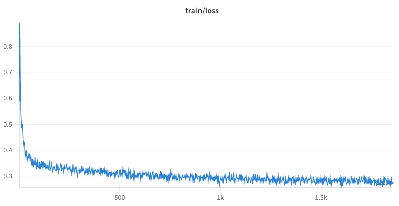

# SFT on OpenMathInstruct-2

This guide explains how to use NeMo RL to run SFT on the [nvidia/OpenMathInstruct-2](https://huggingface.co/datasets/nvidia/OpenMathInstruct-2) math instruction tuning dataset. We then show how to use NeMo RL's evaluation scripts to evaluate the trained model on the [MATH-500 benchmark](https://huggingface.co/datasets/HuggingFaceH4/MATH-500).


## Train the Model
To train the model using NeMo RL, use the `examples/configs/recipes/tutorials/sft/sft_openmathinstruct2.yaml` config file. This file closely matches the experiment settings in the [original OpenMathInstruct-2 paper](https://arxiv.org/abs/2410.01560).

```
uv run examples/run_sft.py --config=examples/configs/sft_openmathinstruct2.yaml
```

### Dataset Splits

The OpenMathInstruct-2 has several versions of different sizes. Configure the version of the dataset via the `data.split` config:

* `train`: full 14 M problem–solution pairs
* `train_1M`, `train_2M`, `train_5M`: fair-downsampled subsets of 1M, 2M, or 5M examples

By default, the config uses the 1M subset (`data.split=train_1M`).

### Training Time
The default config uses 8 GPUs (`cluster.gpus_per_node`) on 1 node (`cluster.num_nodes`), which should complete 1 epoch of training for the train_1M dataset in around 20 hours. For our experiments below, we use 8 nodes to speed up training, completing 1 epoch of training in less than 4 hours.

## Evaluating the Model
Throughout training, the checkpoints of the model will be saved to the `results/sft_openmathinstruct2` folder (specified by `checkpointing.checkpoint_dir`). To evaluate the model, we first need to convert the PyTorch distributed checkpoint to HuggingFace format:

```
uv run examples/convert_dcp_to_hf.py \
    --config=results/sft_openmathinstruct2/step_1855/config.yaml \
    --dcp-ckpt-path=results/sft_openmathinstruct2/step_1855/policy/weights \
    --hf-ckpt-path=results/sft_openmathinstruct2/step_1855/hf
```

Replace `results/sft_openmathinstruct2/step_1855` with the path to the checkpoint you are evaluating. The resulting HuggingFace checkpoint will be saved to `--hf-ckpt-path`.

To evaluate on the [MATH-500 benchmark](https://huggingface.co/datasets/HuggingFaceH4/MATH-500), use the following command:

```
uv run examples/run_eval.py \
    --config=examples/configs/eval.yaml \
    generation.model_name=results/sft_openmathinstruct2/step_1855/hf \
    tokenizer.name=meta-llama/Llama-3.1-8B-Instruct \
    data.dataset_name=HuggingFaceH4/MATH-500 \
    data.dataset_key=test
```

Use `generation.model_name` to specify the path to the HuggingFace checkpoint.

## Results
Using the above instructions to train a Llama-3.1-8B model for 1 epoch on the train_1M version of the OpenMathInstruct-2 dataset, we get the following loss curve:




Evaluating the resulting checkpoint on MATH-500, we get the following result:

```
============================================================
model_name='hf' dataset_name='MATH-500'
max_new_tokens=2048 temperature=0.0 top_p=1.0 top_k=-1

metric='pass@1' num_tests_per_prompt=1

score=0.5020 (251.0/500)
============================================================
```

As a reference, using NeMo-Aligner and NeMo-Skills (as is done in the [original OpenMathInstruct-2 paper](https://arxiv.org/abs/2410.01560)) to train and evaluate the same model on the same dataset achieves the same score of 0.5020 on MATH-500.
