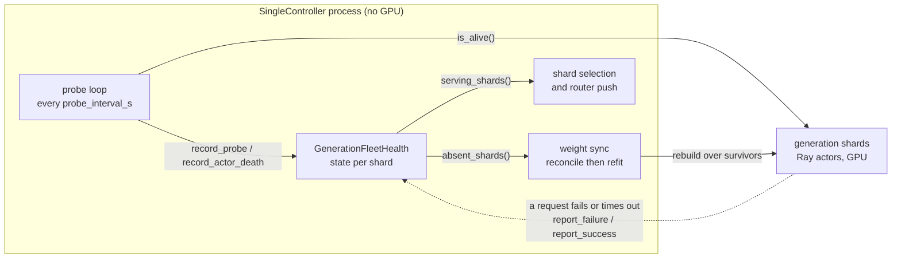

# Generation Fault Tolerance (SingleController)

A generation shard can die or wedge mid-run. Without help, the next weight sync blocks
forever inside NCCL — a collective needs every rank, and it does not care that you stopped
sending the dead one traffic. This feature notices the loss, rebuilds the refit
communicator over whoever is left, and keeps training.

It is **off by default**. Set `async_rl.generation_fleet_health.enabled: true` to turn it on.

## What is supported

Be aware of these limits before enabling it.

**Weight-sync transports** — only the two that own an NCCL world can rebuild one:

| `policy.generation.refit_transport` | Recovers a lost shard |
|---|---|
| `collective` (packed broadcast) | ✅ full |
| `nccl_reshard` | ⚠️ dead process only — see [the wedged case](#a-wedged-engine-is-different) |
| colocated IPC, HTTP, checkpoint-engine, `vllm_remote_sparse` | ❌ no communicator to rebuild |

**Generation backends** — only vLLM implements the fleet-health hooks:

| `policy.generation.backend` | Supported |
|---|---|
| `vllm` | ✅ |
| `sglang` | ❌ refuses at setup with `NotImplementedError` |
| Megatron, TensorRT-LLM, Dynamo | ❌ not accepted by SingleController |

Trainer ranks are **never** excluded. Losing one changes the parallelism the model was
sharded for, so there is nothing to recover onto. This feature is about generation shards.

## Who watches what

One ledger, `GenerationFleetHealth`, holds a state per shard. It lives in the
SingleController process and no GPU worker ever writes to it.



Two things are worth knowing about that picture:

- **`is_alive()` is answered by the Ray actor, not the engine.** It proves the process
  exists. It cannot see an engine that has stopped generating.
- **A shard is dropped from the refit only when its process is gone or restarting.**
  `SUSPECT` (failing, not yet condemned) and `STALE` (restarted, holding old weights) both
  still take part — a `STALE` shard is refit precisely so it stops being stale.

## What happens when a shard fails

Two things decide the outcome: what the ledger already thought of the shard when the sync
began, and how the sync then went.

| Shard state | Refit | Outcome | Why |
|---|---|---|---|
| `HEALTHY` | succeeds | continues | The ordinary step. |
| `HEALTHY` | hangs | **run ends** | Every process is alive and nothing was suspect, so there is nobody to drop. Guessing would condemn a healthy shard and leave the real culprit in the group. |
| `HEALTHY` | crashes | recovers | The crash names the shard. Mark it dead, rebuild without it, retry once. |
| `SUSPECT` | succeeds | continues | A wedged engine can still do NCCL. It keeps failing generations and reaches `DEAD` on its own. |
| `SUSPECT` | hangs | depends | The one suspect is condemned, the group shrinks, retry once. Works on `collective`; ends the run on `nccl_reshard`. |
| `SUSPECT` | crashes | recovers | The dead process is visible, so no attribution is needed. |
| `DEAD` | any | continues | Already excluded before the collective started, so it cannot affect this refit at all. |

Recovery is **rebuild, then retry once** — and the rebuild needs a shard to drop. That is
why a crash recovers and a hang only recovers when the ledger already held a suspect.
Retrying without shrinking would rebuild over the same fleet and hang on the same silent
rank.

A second failure during the retry ends the run: at that point it is a fault, not a
membership problem.

### A wedged engine is different

An engine whose process is alive but which has stopped generating is the hardest case, and
`nccl_reshard` cannot recover from it. Aborting a communicator does not retire CUDA work
already queued on a stream, and on that transport the orphaned kernels sit on the
**trainers'** devices — so nothing done to the wedged shard retires them. The run ends
attributably in seconds rather than stalling. On `collective` the same case recovers.

## Configuration

```yaml
async_rl:
  generation_fleet_health:
    enabled: true                 # off by default
    probe_interval_s: 5.0         # how often each shard is probed
    probe_timeout_s: 2.0          # must be < probe_interval_s
    unhealthy_threshold: 3        # consecutive failures before a shard is condemned
    min_healthy_shards: 1         # below this the run stops
    refit_timeout_s: 300.0        # deadline for one refit collective
```

`refit_timeout_s` is what makes recovery possible at all when a shard fails **during** a
refit: it is the only thing that can release ranks already blocked inside NCCL, and a
blocked worker cannot service the rebuild call either. Setting it to `null` disarms the
watchdog and leaves the refit path unchanged from before this feature existed. A healthy
refit takes seconds, so the default leaves a wide margin.

## Related

- [Single-Controller (Async GRPO)](single-controller.md) — the surrounding execution model
- [Weight Refit](refit.md) — choosing a refit transport
