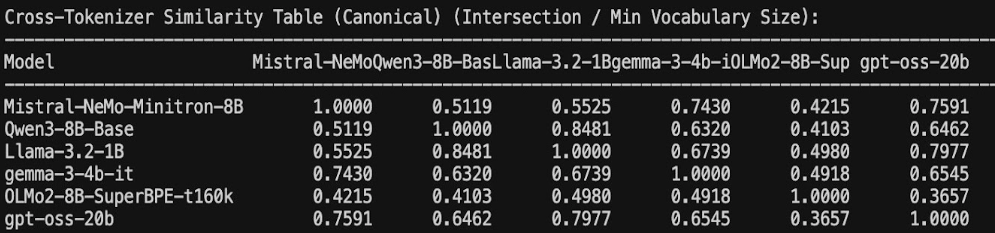
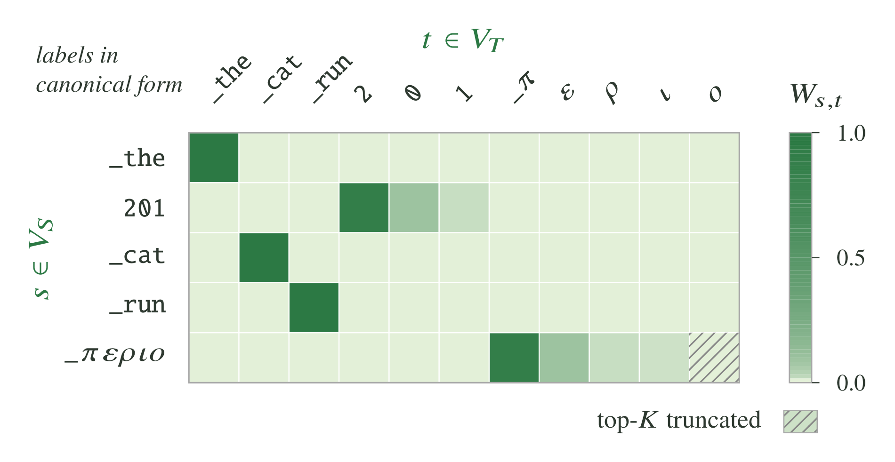
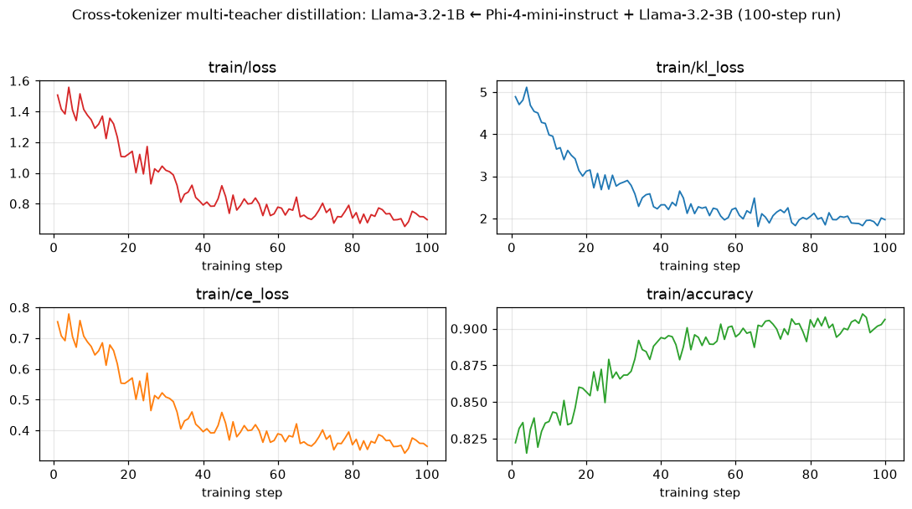

# Cross-Tokenizer (X-Token)

NeMo RL supports off-policy distillation between a student and a teacher that
**do not share a tokenizer** — for example, distilling a Qwen3-4B teacher into
a Llama-3.2-1B student. Cross-tokenizer ("x-token") distillation handles the
vocabulary mismatch by routing student logits through a precomputed
**projection matrix** that maps each student token to the teacher tokens it
most plausibly corresponds to, projecting the student into the teacher's
vocab space so the two distributions can be compared.

Tokenizer vocabularies overlap only partially, which is what makes the
projection necessary. The table below reports the pairwise overlap
(intersection divided by the smaller vocabulary, on canonical token forms)
across several model tokenizers; the off-diagonal entries sit well below
`1.0` — that shared-vocabulary gap is exactly what the projection matrix
bridges.



This guide explains how to:

1. Produce the projection matrix from a (student, teacher) tokenizer pair
2. Launch a distillation run that consumes it

## How it works

A full run has two phases. The three prep steps are *offline data prep* —
small CLI tools you run once per (student, teacher) pair — and the result is a
single `.pt` file. The final step is the actual distillation training loop.

```
                        ┌──────────────────────────────────────────────┐
                        │  Offline projection-matrix preparation       │
                        │                                              │
                        │  ┌────────────────────────────────────┐      │
  (student, teacher)    │  │ 1. minimal_projection_via_         │      │
  tokenizers       ────▶│  │    multitoken.py                   │      │
                        │  │    — multi-token mappings          │      │
                        │  └─────────────────┬──────────────────┘      │
                        │                    │                         │
                        │  ┌─────────────────▼──────────────────┐      │
                        │  │ 2. (optional) reapply_exact_map.py │      │
                        │  │    — pin exact 1-to-1 matches      │      │
                        │  └─────────────────┬──────────────────┘      │
                        │                    │                         │
                        │  ┌─────────────────▼──────────────────┐      │
                        │  │ 3. sort_and_cut_projection_matrix  │      │
                        │  │    .py — trim to runtime top_k     │      │
                        │  └─────────────────┬──────────────────┘      │
                        └────────────────────│─────────────────────────┘
                                             │
                                             ▼  projection_matrix.pt
                        ┌────────────────────────────────────────────────────┐
                        │  4. examples/                                        │
                        │     run_xtoken_off_policy_distillation.py            │
                        │     — align student & teacher tokens, then           │
                        │       teacher forward + student forward,             │
                        │       then x-token KD loss                           │
                        └────────────────────────────────────────────────────┘
```

The projection matrix is a sparse `[V_student, top_k]` tensor that the
training-time loss multiplies against the student logits to project them into
the teacher's vocab space.



Each row of the matrix holds the weights `W_{s,t}` that distribute a student
token `s ∈ V_S` over the teacher tokens `t ∈ V_T` it corresponds to. Tokens
shared by both vocabularies map 1-to-1 (e.g., `_the`, `_cat`, `_run`), while a
student token that the teacher splits into pieces spreads its weight across
those pieces (e.g., `201` → `2`, `0`, `1`). Rows are trimmed to the runtime
`top_k` in Step 3, so low-weight tail entries are dropped (hatched cell).

### Which prep steps are essential?

Of the three prep steps, **Step 1 (multi-token mappings)** and
**Step 3 (sort and trim)** are required — Step 1 builds the cross-vocab
mapping itself, and Step 3 produces the runtime-format `.pt` the training
loss expects. **Step 2 (reapply exact map) is optional** and pins exact
1-to-1 token mappings on top of Step 1, but we found the best results
on this branch by running **Steps 1 → 2 → 3**.

## Quickstart — single command

For the typical case, `tools/x_token/build_projection_matrix.sh` chains
the prep steps with auto-derived intermediate paths:

```bash
./tools/x_token/build_projection_matrix.sh \
    --student-model meta-llama/Llama-3.2-1B \
    --teacher-model Qwen/Qwen3-4B \
    --runtime-top-k 4
```

The wrapper writes the final matrix to
`cross_tokenizer_data/projection_matrix_<student>_<teacher>_top<N>.pt`
(override with `--final-output`). Pass `--skip-exact-map` to skip the
optional Step 2, or `--no-{scale-trick,reverse-pass,special-token-mapping}`
to tweak Step 1 defaults. Run `./tools/x_token/build_projection_matrix.sh
--help` for the full flag list.

The per-step recipes below are for advanced customization (non-default
weight thresholds, hand-picked intermediate filenames, etc.).

## Backend and scope

- **DTensor V2 only.** Set `policy.dtensor_cfg.enabled=true` and
  `policy.dtensor_cfg._v2=true`. The Megatron policy worker is not wired
  for cross-tokenizer distillation.
- **Teacher logits travel via CUDA IPC**, so student and teacher policies must
  be colocated on the same node. No remote-Ray transport for x-token logits.

Future work will ease these requirements — we are actively working on
improving cross-tokenizer distillation support.

## Step 1 — Build multi-token mappings

Many student tokens (e.g., `"12"`) tokenize into multiple teacher tokens
(e.g., `"1"`, `"2"`). `minimal_projection_via_multitoken.py` walks the
student vocab, re-tokenizes each token with the teacher tokenizer, and adds
weighted entries to the projection. With `--enable-reverse-pass` it also
does the symmetric teacher → student walk.

```bash
uv run python -m tools.x_token.minimal_projection_via_multitoken \
    --student-model "meta-llama/Llama-3.2-1B" \
    --teacher-model "Qwen/Qwen3-4B" \
    --top-k 32 \
    --enable-scale-trick \
    --enable-reverse-pass \
    --enable-special-token-mapping
```

Output: `cross_tokenizer_data/projection_map_Llama-3.2_to_Qwen3_multitoken_top_32_double_special.pt`.

Pass `--num-examples 50` to print a sample of student→teacher mappings after
the matrix is built — useful for spot-checking that special tokens, numerals,
and punctuation map to sensible teacher tokens.

## Step 2 (optional) — Reapply exact-token map

Tokenizers built with a similar algorithm (for example, BPE) typically share
a sizable set of identical tokens — common punctuation, single ASCII
characters, and frequent subwords. `reapply_exact_map.py` pins those
overlapping tokens to 1-to-1 mappings with weight 1.0, overwriting whatever
Step 1 produced for them.

```bash
uv run python -m tools.x_token.reapply_exact_map \
    --student-model "meta-llama/Llama-3.2-1B" \
    --teacher-model "Qwen/Qwen3-4B" \
    --initial-projection-path cross_tokenizer_data/projection_map_Llama-3.2_to_Qwen3_multitoken_top_32_double_special.pt
```

Output is written next to the input as `<basename>_exact_map_remapped.pt`.

## Step 3 — Sort and trim to runtime `top_k`

The projection map is very sparse — each student token maps to at most 4–5
teacher tokens. This step sorts each row by weight, trims to the chosen
runtime `top_k`, and stores the result as a sparse `[V_student, top_k]`
representation (per-row indices plus weights). That sparse format is what the
training loss consumes, and it avoids materializing a computationally
expensive dense projection matrix of size `[student_vocab, teacher_vocab]`.

```bash
uv run python -m tools.x_token.sort_and_cut_projection_matrix \
    --initial-projection-path cross_tokenizer_data/projection_map_Llama-3.2_to_Qwen3_multitoken_top_32_double_special_exact_map_remapped.pt \
    --top_k 4 \
    --output_path cross_tokenizer_data/projection_matrix_llama_qwen_top4.pt
```

## Step 4 — Launch x-token distillation

The training entrypoint is `examples/run_xtoken_off_policy_distillation.py` with the
exemplar config at `examples/configs/xtoken_off_policy_distillation.yaml`. The exemplar
defaults to Llama-3.2-1B (student) ← Qwen3-4B (teacher) and the P-KL loss
mode. For data it points `data.train.data_files` at the ungated, CC-BY-4.0
NVIDIA **Nemotron-Pretraining-Specialized-v1.1** corpus
(`Nemotron-Pretraining-Formal-Logic` subset) over `hf://`, so the recipe runs
out of the box with no auth or extra setup. The `projection_matrix_path` below
points at the `cross_tokenizer_data/` directory that Steps 1–3 create, so run
those first (or the `build_projection_matrix.sh` wrapper). Override paths via
Hydra CLI:

```bash
uv run python examples/run_xtoken_off_policy_distillation.py \
    --config examples/configs/xtoken_off_policy_distillation.yaml \
    loss_fn.projection_matrix_path=cross_tokenizer_data/projection_matrix_llama_qwen_top4.pt \
    cluster.gpus_per_node=8 \
    cluster.num_nodes=1
```

The exemplar config keeps only `loss_fn.projection_matrix_path` as `null`, so
the projection matrix must always be supplied at the CLI — this keeps the
config reusable across (student, teacher) pairs. `data.train.data_files`
already points at the default NVIDIA corpus described above; override it only
to train on your own `.arrow`/`.parquet`/`.json`/`.txt` corpus.

### Loss-mode knobs

`loss_fn` has two flags that pick between three behaviors:

| `gold_loss` | `xtoken_loss` | Behavior |
|---|---|---|
| `false` | (inert) | **P-KL** — full-vocab teacher logits; the loss derives a microbatch-global top-k inside, projects the student into teacher vocab via the projection matrix, and chunk-averages KL on the top-k subset. CE term is added. |
| `true` | `false` | **Gold loss** — split the vocab into an *exact-token-mapped* common set (KL) and an *uncommon* tail (sorted L1). |
| `true` | `true`  | **H-KL (gold + xtoken)** — same as gold, but relax the exact-map threshold to `>= 0.6` and allow multi-token projections to count as exact maps via a collision-replacement rule. |

Other relevant fields:

- `loss_fn.temperature` — softmax temperature applied symmetrically to student and teacher logits before KL.
- `loss_fn.vocab_topk` — microbatch-global top-k size for the P-KL path (inert when `gold_loss=true`).
- `loss_fn.uncommon_topk` — cap on the L1 uncommon-tail sort in the gold path (defaults to 8192).
- `loss_fn.reverse_kl` — compute `KL(student || teacher)` instead of `KL(teacher || student)`.

## Results — 100-step multi-teacher run

This run distills a `meta-llama/Llama-3.2-1B` student from two teachers at
once: `microsoft/Phi-4-mini-instruct` (a cross-tokenizer teacher, projected
through its projection matrix) and `meta-llama/Llama-3.2-3B` (which shares the
student's tokenizer, so it contributes a direct full-vocab KL with no
projection). The per-teacher objectives are summed (`loss_fn.kd_loss_mode=sum`,
`loss_fn.kl_type=mixed`). Config: global batch 96, micro-batch 1, sequence
length 2048, 100 steps, 2 nodes (8 GPUs each), on the default
Nemotron-Pretraining-Specialized-v1.1 / Formal-Logic corpus. The distillation
objective converges and the student tracks both teachers more closely over
training:



- **Loss** falls from ≈1.51 to ≈0.70.
- **KL loss** (summed over both teachers) falls from ≈4.89 to ≈1.97. Almost
  all of it comes from the cross-tokenizer Phi-4-mini teacher (≈4.75 → ≈1.76);
  the same-tokenizer Llama-3.2-3B teacher's direct KL is already small and
  stays there (≈0.14 → ≈0.21).
- **CE loss** falls from ≈0.75 to ≈0.35.
- **Top-1 accuracy** rises from ≈0.82 to ≈0.91.

### Downstream evaluation

Benchmark scores of the distilled student against the undistilled
`meta-llama/Llama-3.2-1B` base model:

| Task | Base Llama-3.2-1B | Distilled |
|---|---|---|
| MMLU | 32.05 | 40.24 |
| GSM8K | 5.69 | 5.76 |
| HellaSwag | 65.08 | 62.53 |
| Winogrande | 61.48 | 61.48 |
| MATH | 5.48 | 4.52 |
| **Avg** | **33.96** | **34.91** |

### Throughput and memory

Measured on the same run (per training step, micro-batch 1, sequence length
2048, with the two teachers forwarded serially):

| Metric | Value |
|---|---|
| Mean step time | 6.65 s (min 6.22 s) |
| Teacher forward (both teachers) | 4.94 s mean — the dominant per-step cost |
| Training throughput | ≈29.5k valid tokens/s (196,512 tokens/step ÷ mean step time) |

Each teacher's full-vocab logits stay on-node: the producer publishes a
rank-level `[B_r, T_t, V_t]` bf16 tray and hands the student a CUDA IPC handle
to it, so teacher logits never cross the network even with two teachers in
play.

## Where files live

| Stage | Tool | Default output |
|---|---|---|
| Build multi-token | `tools/x_token/minimal_projection_via_multitoken.py` | `<output_dir>/projection_map_<student>_to_<teacher>_multitoken_top_<N>_double[_special].pt` |
| Reapply exact map | `tools/x_token/reapply_exact_map.py` | `<input>_exact_map_remapped.pt` |
| Sort and trim | `tools/x_token/sort_and_cut_projection_matrix.py` | `<input_dir>/<basename>_top_<N>_sorted[_preservelast].pt` (or `--output_path`) |
| Train | `examples/run_xtoken_off_policy_distillation.py` | per the run's `logger.log_dir` and `checkpointing.checkpoint_dir` |

## Related

Listed in the order they run during a training step:

- Config exemplar: [`examples/configs/xtoken_off_policy_distillation.yaml`](../../examples/configs/xtoken_off_policy_distillation.yaml)
- Trainer module: `nemo_rl/algorithms/xtoken_off_policy_distillation.py`
- KD data processor: `nemo_rl/data/processors.py::kd_data_processor`
- Cross-tokenizer collator: `nemo_rl/data/cross_tokenizer_collate.py::CrossTokenizerCollator`
- Token alignment: `nemo_rl/algorithms/x_token/token_aligner.py::TokenAligner`
- Loss implementation: `nemo_rl/algorithms/loss/loss_functions.py::CrossTokenizerDistillationLossFn`
