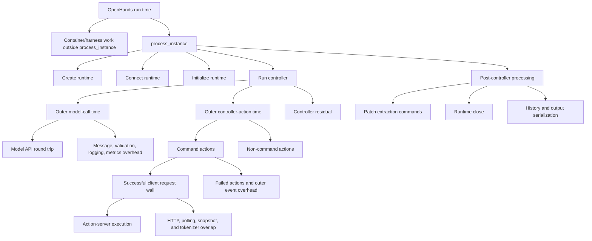

# Streaming Tool Call and Streaming Tokenizer Evaluation

**Scope:** This is the standalone accuracy and performance record for the
streaming tool-call and streaming-tokenizer experiments. It inventories the
persisted experiment families under `results/streaming_tool_call_verified/` as
of 2026-07-16, including complete, partial, and failed attempts. It deliberately
does not describe feature architecture or implementation design.

## Reading the results

- **Strict accuracy** is resolved instances divided by the requested manifest
  size; missing trajectories count as incorrect.
- **OpenHands run time** is the mean end-to-end agent runtime per trajectory.
- **Recovered rollout elapsed / prompt** is the sum of the observed
  `Collecting rollouts` elapsed time for every batch divided by the number of
  prompts. It excludes Slurm setup and teardown and is the best available
  historical rollout-only throughput metric, but it is still narrower than
  the newly logged canonical `timing/rollout/total` boundary.
- **Slurm job wall-clock / prompt** is the top-level Slurm allocation
  `ElapsedRaw` divided by the number of collected prompts. It includes startup,
  rollout, evaluation, and teardown, but excludes time waiting in the Slurm
  queue. It is a launch diagnostic, not rollout E2E.
- **Command time** is the legacy name for the mean outer controller
  action-handling interval. It includes every controller `Action`, not only
  shell commands. The command-only variant still includes client polling,
  tokenization, error handling, and controller overhead around command-server
  execution.
- **Model-call time** is the outer normal model-completion path. It includes
  message preparation, API round trip, response validation, completion-log
  serialization, streaming-context registration, and metric-file updates.
- A delta is always right arm minus left arm, or enabled arm minus disabled
  arm, as stated in the table.

Historical **infra error** columns in this document were produced by the old
audit rule that searched the entire serialized trajectory for error strings.
That rule also counted normal agent command output such as a sandboxed `wget`
reporting `Temporary failure in name resolution`. These values are retained as
legacy marker incidence, not as harness-failure counts. The July 8 runtime
diagnostic below scopes infrastructure classification to explicit top-level or
Responses API errors.

Temperature-zero sampling did not yield identical trajectories in the paired
rollouts. Infrastructure-error counts also differ between many arms. Therefore
these tables compare matched workloads and persisted result sets, not the same
sequence of agent actions; they are not causal per-trajectory latency proofs.

### Rollout batch boundary metric

`train/timing/rollout/total` is the canonical **batch E2E time**. It starts
immediately before per-row NeMo-Gym batch preparation and ends after results,
aggregate metrics, and per-agent metrics are available. It excludes worker
initialization, policy refit, Slurm preparation, and shutdown.

`train/timing/rollout/run_rollouts` is an execution-focused component of batch
E2E: remote `run_rollouts` submission, result wait, and tensorization. It is
useful for attribution, but it is not the primary E2E metric.

| Existing result set | `timing/rollout/total` recorded? | E2E use |
| --- | --- | --- |
| Full-workload reference run `0y1rovpi` | Yes, five rollout steps | Valid batch-E2E baseline |
| July 8 runtime diagnostic and July 9 exact-reuse runs | Yes, one rollout-only batch per run | Valid batch-E2E diagnostics; trajectory divergence still prevents causal attribution |
| Historical rollout-only comparisons in this report | No | Use recovered batch collection elapsed for rollout throughput; do not call it canonical batch E2E |

The full-workload run [`0y1rovpi`](https://wandb.ai/nvidia/swe-benchmark/runs/0y1rovpi)
already recorded this metric. It used 64 rollout samples per step:

| Step | `timing/rollout/total` | `timing/rollout/run_rollouts` | Rollout total / sample |
| ---: | ---: | ---: | ---: |
| 1 | 704.96 s | 704.63 s | 11.02 s |
| 2 | 663.90 s | 663.61 s | 10.37 s |
| 3 | 516.41 s | 516.12 s | 8.07 s |
| 4 | 733.73 s | 733.38 s | 11.46 s |
| 5 | 695.55 s | 695.26 s | 10.87 s |

The historical rollout-only runs did not persist `timing/rollout/*`, but their
Ray driver logs retained the terminal `Collecting rollouts` progress line for
each batch. The report recovers those observed batch elapsed values and
computes `sum(batch elapsed) / prompt count`. This covers rollout submission,
waiting, and nearly all per-result postprocessing; it does not include the
collector's preparation, final batch postprocessing, metric aggregation, or
logging boundary. It is therefore a substantially better throughput measure
than Slurm wall time, but remains a historical proxy rather than the canonical
timer.

The raw trajectory order also recovers batch membership because validation
uses `shuffle=False`, Gym restores asynchronous results by `_rowidx`, and the
collector appends each completed batch in order. The 500-row runs are split
`128 + 128 + 128 + 116`; the 474-row run is split
`128 + 128 + 128 + 90`. However, taking the slowest stored trajectory is not a
valid replacement for batch elapsed. A forensic reconstruction of the pinned
256-row pair uses the absolute `ray_queue_timestamp`, the stored phase
durations, and `response.created_at` from every raw trajectory:

| Arm | Request timestamp spread | Max Ray queue | Max stored queue-inclusive trajectory | Last response ready from first request | Observed batch collection elapsed | Post-response gap |
| --- | ---: | ---: | ---: | ---: | ---: | ---: |
| Streaming off | 3.89 s | 18.75 s | 1815.50 s | 1818.19 s | 3071 s | 1252.81 s |
| Streaming on | 3.48 s | 19.90 s | 1818.25 s | 1821.26 s | 2828 s | 1006.74 s |

This evidence rejects both pre-request admission and Ray scheduling as the
source of the large gap: all 256 server requests established their queue
timestamp within four seconds, and no recorded Ray queue exceeded twenty
seconds. It also rejects the synchronous server work before response
construction: `response.created_at` was at most about 1821 seconds after the
first request, and its lag behind the reconstructed runner completion was at
most 5.12 seconds off and 5.07 seconds on. The historical timestamp has
one-second resolution, which is immaterial to a 1000-second gap.

The missing interval is after the response object is ready and before the
collector finishes consuming it. That data path serializes each response,
transfers and parses its JSON body, then synchronously converts its token arrays
into tensors and decodes strings in NeMo-RL. The server intentionally returns
full cumulative `prompt_token_ids`, `generation_token_ids`, and
`generation_log_probs` for every assistant turn. The client subsequently uses
only the unseen prompt suffix and removes those arrays from the logged result,
so the wire representation repeats prefixes and is larger than the final raw
trajectory. Even after that removal, the pinned raw JSONL files are 6.00 GB off
and 5.50 GB on, averaging 23.44 MB and 21.47 MB per trajectory.

The completion curve confirms a serialized response-materialization tail:

| Completed trajectories | Off elapsed | On elapsed |
| ---: | ---: | ---: |
| 1 | 108 s | 128 s |
| 64 | 397 s | 333 s |
| 128 | 978 s | 765 s |
| 192 | 1880 s | 1560 s |
| 224 | 2423 s | 2116 s |
| 256 | 3071 s | 2828 s |

The historical files cannot separate FastAPI/Pydantic serialization, HTTP body
read plus `orjson` decode, and NeMo-RL token tensorization/decode. Future runs
now persist `timing/rollout/await_results` and
`timing/rollout/postprocess_results`, which separate the final client
postprocessing stage from response wait and transport. A finer trace still
needs timestamps for response-ready, headers received, body-read complete, and
JSON-decode complete. Until that trace is collected, the demonstrated root
cause is the post-run response materialization data path; attributing it to one
serializer or decoder would be speculation.

The rollout-only collector now logs every non-`full_result` rollout metric once
per batch under `train/*`, including
`train/timing/rollout/total`; with the configured vLLM metrics logger it also
records the corresponding `generation_metrics/*` worker timelines. New runs
additionally emit
`train/timing/rollout/batch_e2e_start_time_unix_s`,
`train/timing/rollout/batch_e2e_end_time_unix_s`, and
`train/timing/rollout/batch_prompt_count`. The timestamps audit the same
boundary as `train/timing/rollout/total`; divide that metric by
`train/timing/rollout/batch_prompt_count` for batch-E2E time per prompt. Do not
use Unix timestamp subtraction or Slurm job wall time as the primary E2E
measurement.

The recovered per-batch elapsed values for the two original 500-row pairs are:

| Artifact | Batch index | Prompt count | Streaming off | Streaming on |
| --- | ---: | ---: | ---: | ---: |
| `20260701T040547Z` | 0 | 128 | 1839 s | 1622 s |
|  | 1 | 128 | 1843 s | 1346 s |
|  | 2 | 128 | 1818 s | 1811 s |
|  | 3 | 116 | 1832 s | 1512 s |
| `20260701T132610Z` | 0 | 128 | 1866 s | 1783 s |
|  | 1 | 128 | 1854 s | 1822 s |
|  | 2 | 128 | 1828 s | 1748 s |
|  | 3 | 116 | 1985 s | 2183 s |

## 1. Streaming Tool Call

Streaming Tool Call is the full path: it can create streaming sessions and send
resumable prefill work before the normal final model request. Nonzero prefill
request counts confirm that this path was active.

### Complete SWE-Verified off/on pairs

All four rows below have a complete strict audit: the requested number of
unique trajectories on each side and zero response errors. They are separate
experiments with different dates, manifests, or implementation states, so they
must not be pooled into one accuracy estimate.

| Artifact | N per arm | Strict accuracy, off -> on (delta) | Recovered rollout elapsed / prompt (s) | OpenHands run time, mean (s) | Command time, mean (s) | Model-call time, mean (s) | On prefill requests | Legacy infra-marker hits, off / on |
| --- | ---: | --- | --- | --- | --- | --- | ---: | ---: |
| `20260701T040547Z` | 500 | 7.80% -> 8.60% (+0.80 pp) | 14.66 -> 12.58 (-14.2%) | 546.6 -> 482.0 (-11.8%) | 160.3 -> 102.2 (-36.2%) | 334.5 -> 338.2 (+1.1%) | 10,944 | 80 / 35 |
| `20260701T132610Z` | 500 | 8.00% -> 7.40% (-0.60 pp) | 15.07 -> 15.07 (+0.04%) | 544.7 -> 489.8 (-10.1%) | 155.0 -> 113.0 (-27.1%) | 335.3 -> 322.9 (-3.7%) | 10,321 | 76 / 42 |
| `20260702T032105Z-no-timeout474` | 474 | 8.23% -> 7.38% (-0.84 pp) | 15.54 -> 13.98 (-10.1%) | 533.0 -> 479.7 (-10.0%) | 152.4 -> 106.6 (-30.1%) | 328.9 -> 324.3 (-1.4%) | 7,961 | 75 / 34 |
| `20260706T092103Z-sweverified256-offon-poll050-pinned` | 256 | 18.36% -> 20.70% (+2.34 pp) | 12.00 -> 11.05 (-7.9%) | 698.0 -> 588.9 (-15.6%) | 193.1 -> 101.3 (-47.5%) | 418.7 -> 408.2 (-2.5%) | 3,531 | 38 / 19 |

The final 256-row pair uses manifest
`afcf19d7590f0f796b3c916826aad213e946872fe0bfb13f60060af9f845df56`,
temperature zero, top-p one, and a 50 ms poll interval. Its audit is stored at
`results/streaming_tool_call_verified/20260706T092103Z-sweverified256-offon-poll050-pinned/strict_comparison.json`.

Across these four independent pairs, full streaming lowered mean OpenHands run
time by 10.0--15.6% and command time by 27.1--47.5%. Recovered rollout elapsed
per prompt changed by +0.04% to -14.2%; three pairs improved and one was flat.
The strict-accuracy delta ranged from -0.84 to
+2.34 percentage points, while on-arm legacy infrastructure-marker incidence
was lower in every
pair. That error asymmetry prevents a correctness claim from the historical
comparisons.

### 50 ms text-bucket sweep

The following comparison reuses the same saved 256-row streaming-off baseline
(18.36% strict accuracy; 12.00 s recovered rollout elapsed / prompt; 698.0 s
OpenHands run time; 193.1 s command time; 418.7 s model-call time;
38 legacy infrastructure-marker hits)
and contrasts it with every saved 50 ms full-streaming bucket run. Each
candidate is a separately scheduled rollout, not a contemporaneous replay of
the baseline.

| Full-streaming bucket | Strict accuracy (delta vs off) | Recovered rollout elapsed / prompt (s) | OpenHands run time, mean (s) | Command time, mean (s) | Model-call time, mean (s) | Prefill requests | Legacy infra-marker hits |
| --- | --- | --- | --- | --- | --- | ---: | ---: |
| 64 chars | 18.75% (+0.39 pp) | 12.30 (+2.6%) | 676.8 (-3.0%) | 119.5 (-38.1%) | 471.1 (+12.5%) | 5,726 | 21 |
| 128 chars | 19.92% (+1.56 pp) | 11.92 (-0.7%) | 662.3 (-5.1%) | 133.1 (-31.1%) | 454.3 (+8.5%) | 6,071 | 20 |
| 256 chars, default run | 20.70% (+2.34 pp) | 11.05 (-7.9%) | 588.9 (-15.6%) | 101.3 (-47.5%) | 408.2 (-2.5%) | 3,531 | 19 |
| 256 chars, repeat run | 16.80% (-1.56 pp) | 12.15 (+1.3%) | 644.0 (-7.7%) | 137.3 (-28.9%) | 439.7 (+5.0%) | 5,560 | 20 |
| 512 chars | 18.36% (+0.00 pp) | 15.96 (+33.1%) | 598.8 (-14.2%) | 105.1 (-45.5%) | 420.4 (+0.4%) | 4,361 | 16 |

The recovered batch metric materially changes the bucket conclusion: lower
mean trajectory or command time does not guarantee higher batch throughput.
The 64-character, repeated 256-character, and 512-character runs were slower
than the saved off baseline at the batch boundary; only the 128-character and
default 256-character runs improved.

The independently audited within-sweep pairs are
`bucket064_vs_bucket128_strict_comparison.json` and
`bucket256_vs_bucket512_strict_comparison.json` in their respective result
directories. Both contain 256 rows per arm and zero response errors. They show
that changing the text threshold changes action count, prefill volume, and
trajectory paths; they do not establish that one threshold preserves accuracy.

### Poll-interval tuning

Both arms in this 256-row comparison enabled full streaming with the same
manifest. The generic audit field names mean **left = 100 ms** and **right =
50 ms**, not off/on.

| Poll interval | Strict accuracy | Recovered rollout elapsed / prompt (s) | OpenHands run time, mean (s) | Command time, mean (s) | Model-call time, mean (s) | Prefill requests | Legacy infra-marker hits |
| --- | ---: | ---: | ---: | ---: | ---: | ---: | ---: |
| 100 ms | 5.47% | 11.52 | 610.5 | 123.3 | 426.0 | 5,184 | 19 |
| 50 ms | 9.77% | 11.59 (+0.6%) | 614.4 (+0.6%) | 119.0 (-3.5%) | 429.0 (+0.7%) | 5,517 | 24 |

This is a parameter smoke, not a feature on/off or accuracy conclusion: it has
zero exact trajectory matches and different legacy infrastructure-marker
counts. The
source is
`20260703T181000Z-admission-poll256-batch256/poll100_vs_poll050_comparison.json`.

### Mechanism, diagnostic, and full-workload experiments

These runs are part of the experiment inventory, but they are not valid
accuracy/performance comparisons:

| Experiment | Accuracy / reward evidence | Performance evidence | Why it is not a paired conclusion |
| --- | --- | --- | --- |
| Controlled APC microbenchmark, 2026-07-02 | No agent accuracy | TTFT: cold 85.73 ms; identical warm 11.38 ms; streaming immediate 16.92 ms; streaming after 100 ms 10.46 ms | One GPU, Qwen3-0.6B, no concurrent requests; validates cache mechanics only. |
| Production-path R2E diagnostics, `13352219` / `13353745` | Both 0 reward and 0 resolved across eight rollouts | Slurm job wall / prompt: 156.4 s / 181.4 s | The second run produced more tokens and turns, so elapsed time is confounded. |
| One-prompt R2E poll smoke, `13357509` / `13357510` | 1 / 1 versus 0 / 0 reward/resolved | Slurm job wall / prompt: 159.5 s / 164.3 s | One repeated prompt; different trajectories and action counts. |
| Early eight-rollout implementation evolution, `13242887`, `13242283`, `13244211`, `13245446` | 0/0, 0/0, 1/1, 0/0 resolved | Slurm job wall / prompt: 161.4 s, 185.3 s, 161.1 s, 152.5 s | Baseline, eager admission, two-snapshot admission, and progressive admission are different implementations. |
| Reference-aligned full workload | `13268983` failed at refit 2; `13274929` failed at refit 8; fixed `13278330` completed five steps | `13278330`: 1:13:27 wall time; step times 107.44--830.40 s | Stability/regression test with streaming enabled only; no off arm. |

### July 15 background-completion and priority diagnostics

This diagnostic compares synchronous prefill acknowledgement with server-owned
background prefill completion. Both arms use the same first 16 rows of the
pinned 474-row SWE-Verified manifest, temperature zero, top-p one,
`shuffle=False`, four vLLM replicas, 16 concurrent agents, a 512-character
admission threshold, a 128-character first bucket, 50 ms polling, and one
16-row trajectory-collection batch. The only configured feature difference is
`background_prefill_completion`.

- Sync-ACK W&B: [`hkehlxdg`](https://wandb.ai/nvidia/swe-benchmark/runs/hkehlxdg)
- Background-completion W&B:
  [`01gtijxj`](https://wandb.ai/nvidia/swe-benchmark/runs/01gtijxj)
- Result directory:
  `results/streaming_tool_call_verified/background-completion-first16-retry1-20260715T162200Z`
- Manifest SHA-256:
  `9309be0ea9dce987fc509d47845abef3fd3d28cce524e030a889f9fdef92b82a`

| Metric | Sync ACK | Background completion |
| --- | ---: | ---: |
| Strict resolved | 1/16 (6.25%) | 1/16 (6.25%) |
| Responses API / harness errors | 0 / 0 | 0 / 0 |
| `openhands_run_time >= 1800s` | 12/16 | 14/16 |
| Exact trajectory matches | 0/16 | 0/16 |
| Resolved overlap | 0 both; 1 sync-only | 1 background-only |
| Batch collection elapsed | 2166 s | 2152 s |
| Tool calls | 662 | 704 |
| Model calls | 676 | 705 |
| Summed model-call time | 19,399.11 s | 21,406.95 s |

The equal strict accuracy is not parity evidence: different instances resolved,
all trajectories differed, and the timeout union excludes 15/16 rows. The one
common non-timeout instance changed from 14 to 23 tool calls, so its runtime
change is also not a causal systems comparison. Batch elapsed was effectively
flat (-14 s, -0.6%), while aggregate work changed.

The cached-token instrumentation distinguishes manager acknowledgement from
KV reuse observed by the following model request:

| Admission metric | Sync ACK | Background completion |
| --- | ---: | ---: |
| Tool calls | 662 | 704 |
| Model calls with observed streaming-prefill KV | 12 | 48 |
| Observed admission / tool call | 1.81% | 6.82% |
| Extra cached prompt tokens beyond the required prefix | 3,511 | 10,809 |
| Stable first-snapshot attempts | 19 | 58 |
| Background engine-completed chunks | 0 | 12 |
| Background engine-completed dynamic tokens | 0 | 1,756 |

Background completion increased observed admission 3.8 times, but the absolute
coverage remained 6.82%. The original raw `background_scheduled_chunks=107`
counter was not an attempt count: start responses and final close responses
both reported the same scheduled work, and the trajectory aggregator summed
them. There were 58 start attempts; among the 49 sessions with close metrics,
12 completed and 37 were cancelled. The implementation now reports scheduled
chunks/tokens and enqueue time only at start, while close reports completion,
cancellation, failure, and completion time. This removes the double count.

The production manager originally submitted background and foreground work to
the same vLLM engine at default priority. It now enables vLLM's priority
scheduler whenever background completion is active, keeps ordinary foreground
requests at priority zero, and submits only background prefill at priority one.
Invalid priorities and an explicit conflicting FCFS policy fail before engine
creation.

Two Qwen3-30B TP2 CUDA-graph microbenchmarks isolate the model-call mechanism:

| Direct benchmark | Admission at 10--150 ms overlap | Mean paired TTFT saving | Mean net saving after enqueue/close |
| --- | ---: | ---: | ---: |
| Original FCFS, 5 repeats | 100% | 17.19--19.44 ms | 14.76--16.95 ms |
| Priority scheduler, background priority 1, 5 repeats | 100% | 16.01--17.55 ms | 10.90--14.89 ms |

The priority result is stored at
`results/streaming_tool_call_background_prefill_benchmark/full-priority-contention/background-prefill-20260715T183541Z.json`.
Its additional 20-repeat contention test submits an unrelated 2,048-token
foreground prompt immediately after background admission:

| Foreground TTFT | Equal priority | Background priority 1 |
| --- | ---: | ---: |
| Mean | 28.31 ms | 25.47 ms |
| Median | 25.36 ms | 25.43 ms |
| p95 | 29.76 ms | 26.25 ms |
| Maximum | 82.92 ms | 26.96 ms |
| Paired win rate for priority 1 | N/A | 50% |

Priority protection did not improve the median, but it removed one large
foreground tail event without adding a measurable median penalty. The mean
2.84 ms improvement is driven by that event and is tail-protection evidence,
not a repeatable mean-speedup claim.

The central scale mismatch remains: background attempts in the SWE diagnostic
contained about 216 dynamic tokens on average, and the controlled model
benchmark saved only about 16--18 ms of final-request TTFT. A SWE model call
averaged roughly 30 seconds because it includes queueing and autoregressive
decode. Even perfect admission cannot materially lower that broad model-call
timer for this output-length distribution. Background prefill is mechanically
effective and can protect a small TTFT tail, but the current evidence does not
show a measurable SWE model-call-time reduction.

#### Priority first-16 validation and unadmitted-finalization overhead

The priority implementation was then exercised through the same 16-row
trajectory-collection path. This is a validation run, not a causal performance
pair: every trajectory differed from the preceding background-completion run,
the two runs resolved different instances, and their tool/model-call counts
changed.

- Priority W&B: [`w749ehjh`](https://wandb.ai/nvidia/swe-benchmark/runs/w749ehjh)
- Result directory:
  `results/streaming_tool_call_verified/background-priority-first16-retry2-20260716T010958Z`

| Metric | Background completion | Background priority 1 |
| --- | ---: | ---: |
| Strict resolved | 1/16 (6.25%) | 1/16 (6.25%) |
| `openhands_run_time >= 1800s` | 14/16 | 11/16 |
| Tool calls | 704 | 789 |
| Model calls | 705 | 806 |
| Summed model-call time | 21,406.95 s | 18,954.76 s |
| Summed OpenHands run time | 27,284.82 s | 24,687.84 s |
| Summed command time | 2,756.79 s | 1,485.84 s |
| Streaming sessions started | 58 | 96 |
| Model calls with observed prefill KV | 48 | 86 |
| Observed admission / tool call | 6.82% | 10.90% |
| Extra cached tokens from streaming prefill | 10,809 | 22,234 |
| Background chunks completed / cancelled / failed | 12 / 37 / 0 | 35 / 55 / 0 |

The timeout and aggregate-time changes cannot be assigned to priority because
the workload paths diverged. The run does establish that priority mode
completed all 16 rows with zero response/harness errors and crossed the
timeout-kill path without the prior metrics-file race: there were no `/run`
HTTP 500 responses and no `JSONDecodeError: Expecting value`. Metrics writes
now use a uniquely named temporary file followed by atomic `os.replace()`.

The detailed metrics exposed a separate, deterministic source of overhead. In
the original background run there were 406 final-only tokenizer actions but
only 58 admitted sessions. The remaining 348 commands performed a remote final
prefix tokenization even though they had never admitted prefill and therefore
could not obtain streaming KV benefit. Those commands contributed to 469
incremental-tokenizer requests, 623.24 s of streaming overhead, and 520.46 s
of post-command tail. The priority run showed the same identity at a different
workload size: 513 final-only actions minus 96 sessions equals 417 unadmitted
remote finalizations, within 609 incremental-tokenizer requests.

The implementation now returns the ordinary completed observation immediately
when the command never reaches the initial admission bucket. It does not send
a remote final tokenizer request and does not register prompt reuse for that
command. The following ordinary model call remains the authoritative fallback.
Admitted commands still send their exact final incremental update and close
the background-prefill session. Compute-node validation passed the OpenHands
unadmitted/admitted tests (2/2), the Gym patch-chain tests (2/2), and a reverse
patch check against the installed OpenHands source. The broader focused
regression subsequently passed 54/54 incremental-tokenizer,
streaming-prefill-manager, and trajectory-audit tests, Ruff lint/format checks,
launcher syntax checks, and `git diff --check` in Slurm job `14055135`. Its
cache/resource audit and complete test output are in
`results/streaming_tool_call_background_prefill_benchmark/skip-unadmitted-finalization-test/regression5-14055135.out`.

#### Clean candidate-size sweep

A Qwen3-30B TP2 CUDA-graph sweep reset vLLM's prefix cache between every
paired measurement and repeated each candidate size five times. The control
plane column is enqueue plus close time not overlapped by the simulated 75 ms
command tail. The artifact is
`results/streaming_tool_call_background_prefill_benchmark/candidate-size-sweep/background-prefill-20260716T021209Z.json`.

| Candidate tokens | Observed KV admission | Mean model-call TTFT saving | Mean control plane | Mean net saving |
| ---: | ---: | ---: | ---: | ---: |
| 16 | 0/5 | -0.13 ms | 2.82 ms | -2.95 ms |
| 32 | 5/5 | -0.28 ms | 10.63 ms | -10.90 ms |
| 64 | 5/5 | 9.63 ms | 2.33 ms | 7.30 ms |
| 128 | 5/5 | 9.26 ms | 6.15 ms | 3.11 ms |
| 256 | 5/5 | 10.96 ms | 2.37 ms | 8.60 ms |
| 512 | 5/5 | 12.13 ms | 2.58 ms | 9.55 ms |
| 1,024 | 5/5 | 16.59 ms | 2.69 ms | 13.90 ms |
| 2,048 | 5/5 | 69.58 ms | 2.73 ms | 66.84 ms |

The 32- and 128-token control-plane means contain isolated latency outliers,
so the exact net ordering is not a tuning curve. The robust boundary is that
16 tokens produced no cacheable dynamic block, 32 tokens had no model-call
benefit, and 64 tokens won all five paired model-call measurements. SWE output
in the priority diagnostic averaged 3.86 characters per token, making a
256-character initial bucket approximately 66 tokens. The optimized rollout
therefore uses `initial_chunk_chars=256` while retaining the 512-character
later bucket: it gives up some marginal admission attempts to avoid candidates
that are too small to repay their control-plane cost.

#### Optimized first-16 rollout

The optimized run combines the 256-character initial bucket with the
skip-unadmitted-finalization implementation. All other first-16 protocol fields
match the priority validation: the pinned manifest, temperature zero, top-p
one, `shuffle=False`, four TP2 replicas, 16 concurrent agents, 50 ms polling,
background priority one, and the 1,800-second agent timeout.

- Optimized W&B: [`48drm13h`](https://wandb.ai/nvidia/swe-benchmark/runs/48drm13h)
- Result directory:
  `results/streaming_tool_call_verified/background-priority-skip-unadmitted-initial256-first16-20260716T021500Z`

| Metric | Priority, initial 128 | Optimized, initial 256 | Change |
| --- | ---: | ---: | ---: |
| Strict resolved | 1/16 (6.25%) | 1/16 (6.25%) | 0 pp |
| Response / harness errors | 0 / 0 | 0 / 0 | unchanged |
| `openhands_run_time >= 1800s` | 11/16 | 11/16 | unchanged |
| Exact trajectory matches | 0/16 | 0/16 | no causal parity |
| Tool calls | 789 | 759 | -3.8% |
| Model calls | 806 | 774 | -4.0% |
| Summed model-call time | 18,954.76 s | 21,579.15 s | +13.8% |
| Summed OpenHands run time | 24,687.84 s | 25,352.52 s | +2.7% |
| Summed command time | 1,485.84 s | 1,163.92 s | -21.7% |
| Streaming sessions | 96 | 54 | -43.8% |
| Session admission / tool call | 12.17% | 7.11% | -5.06 pp |
| Model calls with observed prefill KV | 86 | 43 | -50.0% |
| Observed prefill / tool call | 10.90% | 5.67% | -5.23 pp |
| Observed extra cached tokens | 22,234 | 9,248 | -58.4% |
| Incremental-tokenizer requests | 609 | 103 | -83.1% |
| Unadmitted final-prefix tokenizations | 417 | 0 | -100% |
| Streaming overhead | 554.49 s | 281.81 s | -49.2% |
| Streaming overhead / tool call | 0.703 s | 0.371 s | -47.2% |
| Post-command tail | 447.78 s | 192.81 s | -56.9% |
| Post-command tail / tool call | 0.568 s | 0.254 s | -55.3% |
| Background completed / cancelled / failed | 35 / 55 / 0 | 8 / 39 / 0 | fewer admissions |

The mechanism result is strong: remote requests fell 83%, every no-benefit
final-prefix tokenization disappeared, and both broad streaming overhead and
post-command tail roughly halved. The cost is also explicit: the larger first
bucket reduced observed admission from 10.90% to 5.67%. The aggregate runtime
columns are not a feature performance result because all 16 trajectories
differed and the two runs resolved different instances.

Both arms have five independently non-timeout trajectories. The optimized
cohort performs more work--34.8 tool/model calls per trajectory versus 29.4,
an 18.4% increase--so its raw means cannot isolate implementation cost.

| Independently non-timeout metric, n=5/arm | Priority mean / p50 / p95 | Optimized mean / p50 / p95 |
| --- | ---: | ---: |
| OpenHands run time | 964.44 / 1,063.23 / 1,322.74 s | 1,098.57 / 794.81 / 1,786.68 s |
| Model API call time | 772.37 / 887.79 / 1,127.13 s | 877.18 / 575.29 / 1,608.25 s |
| Command time | 38.34 / 35.40 / 72.03 s | 51.21 / 56.64 / 81.22 s |
| Tool/model calls | 29.4 / 28 / 47 | 34.8 / 38 / 56 |

The strict paired timeout rule excludes the union of timeout IDs and retains
only 2/16 trajectories; those two also have different call counts. The audit
therefore reports both the strict union cohort and each arm's independent
non-timeout distribution, but neither supports a causal trajectory-latency
claim at this sample size. The justified conclusion is narrower: the
optimization removes the identified no-admission overhead while preserving a
working prefill path and first-16 accuracy smoke, at a measured reduction in
admission coverage.

#### Initial-bucket 128 versus 192 follow-up

The next fixed-manifest diagnostic compared 128- and 192-character initial
buckets after skip-unadmitted finalization. Both arms otherwise used the same
first 16 SWE Verified rows, temperature zero, top-p one, `shuffle=False`, four
TP2 replicas, concurrency 16, 50 ms polling, background completion, and the
1,800-second timeout.

- Initial 128 W&B: [`7sm68fqn`](https://wandb.ai/nvidia/swe-benchmark/runs/7sm68fqn)
- Initial 192 W&B: [`37k8nnvb`](https://wandb.ai/nvidia/swe-benchmark/runs/37k8nnvb)
- Audit directory:
  `results/streaming_tool_call_verified/prefill-threshold-128-vs192-first16-20260716T044239Z`

| Mechanism metric | Initial 128 | Initial 192 |
| --- | ---: | ---: |
| Strict resolved | 0/16 | 0/16 |
| Response / infrastructure errors | 0 / 0 | 0 / 0 |
| `openhands_run_time >= 1800s` | 13/16 | 13/16 |
| Tool calls / eligible actions | 615 / 595 | 694 / 675 |
| Race attempts: request-first / command-first | 242: 47 / 195 | 237: 36 / 201 |
| Sessions started | 42 | 32 |
| Model calls with observed streaming-prefill KV | 35 | 29 |
| Observed admission / all tool calls | 5.69% | 4.18% |
| Observed extra cached tokens | 7,271 | 6,170 |
| Background scheduled / completed / cancelled | 42 / 9 / 27 | 32 / 13 / 16 |
| Existing sessions found by synchronous abort | 180/195 (92.3%) | 189/201 (94.0%) |
| Abort round-trip time | 97.72 s | 119.93 s |
| Request age at cancellation | 48.69 s | 50.75 s |
| Recorded streaming overhead / tool call | 319.2 ms | 306.3 ms |
| Post-command tail / tool call | 187.0 ms | 189.6 ms |

Only three trajectories per arm were independently non-timeout, and the strict
union cohort retained two. All 16 trajectories differed. Accuracy and runtime
columns therefore cannot select a threshold. The mechanism evidence selects
128 for the next optimization check: it recovered more observed admissions and
cached tokens at essentially the same per-tool control cost. More importantly,
over 92% of command-first races found that the remote session already existed.
The synchronous multi-hop abort was consequently a frequent critical-path cost,
not a rare cleanup fallback. This observation motivates the deferred-abort
implementation evaluated below.

#### Deferred-abort first-16 validation

The deferred-abort candidate repeated the 128-character arm on the identical
frozen first-16 manifest. Its sampling and workload settings remained
temperature zero, top-p one, `shuffle=False`, four TP2 replicas, concurrency
16, 50 ms polling, background completion, and a 1,800-second timeout. Only the
abort path and its overhead accounting changed: OpenHands now cancels its local
request, Gym acknowledges and schedules remote cleanup, and the remote vLLM
abort runs after that acknowledgement.

- Synchronous-abort baseline W&B:
  [`7sm68fqn`](https://wandb.ai/nvidia/swe-benchmark/runs/7sm68fqn)
- Deferred-abort candidate W&B:
  [`o01sz2lm`](https://wandb.ai/nvidia/swe-benchmark/runs/o01sz2lm)
- Candidate Slurm job: `14060471`
- Candidate and audit directory:
  `results/streaming_tool_call_verified/deferred-abort-initial128-first16-20260716T071619Z`

| Correctness and coverage | Synchronous abort | Deferred abort |
| --- | ---: | ---: |
| Strict resolved | 0/16 | 1/16 |
| Response / infrastructure errors | 0 / 0 | 0 / 0 |
| `openhands_run_time >= 1800s` | 13/16 | 12/16 |
| Tool calls / eligible actions | 615 / 595 | 733 / 711 |
| Sessions started | 42 | 62 |
| Model calls with observed streaming-prefill KV | 35 | 49 |
| Observed admission / all tool calls | 5.69% | 6.68% |
| Observed extra cached tokens | 7,271 | 11,445 |
| Valid final prefill actions | 9 | 3 |
| Background scheduled / completed / cancelled / failed | 42 / 9 / 27 / 0 | 62 / 3 / 48 / 0 |

The candidate's one resolved sample is `astropy__astropy-14995`. This is an
accuracy smoke, not evidence of a 6.25-point accuracy gain: all 16 trajectory
hashes differ, only 11 patches match and those 11 are empty timeout patches,
and the two arms execute different numbers of model and tool calls.

| Race and control-path metric | Synchronous abort | Deferred abort |
| --- | ---: | ---: |
| Race attempts: prefill-first / command-first | 242: 47 / 195 | 376: 70 / 306 |
| Abort requests | 195 | 306 |
| Existing remote sessions returned to caller | 180 | 0 |
| Accepted deferred aborts | N/A | 306/306 |
| Abort acknowledgement failures | 0 | 0 |
| Abort call time / command-first cancellation | 501.1 ms | 160.8 ms |
| Local cancel drain / command-first cancellation | Not recorded | 0.88 ms |
| In-flight request age at cancellation | 48.69 s total | 77.18 s total |
| Recorded overhead / tool call | 319.2 ms | 151.2 ms |
| Post-command tail / tool call | 187.0 ms | 94.7 ms |

The 306/306 deferred acknowledgements, zero acknowledgement failures, and
0.88 ms local cancellation drain show that remote cleanup is no longer awaited
by the OpenHands command path. The candidate log contains no abort-failure
traceback; its teardown traceback is a later Ray status query after the Ray
cluster stopped. `request age at cancellation` is deliberately retained as an
overlapped diagnostic and is not added to overhead. The old overhead metric
did include that request age, so the 319.2-to-151.2 ms change combines a metric
semantic correction with the deferred implementation and is not a pure speedup
measurement.

For completeness, the timeout-excluded distributions are:

| Independently non-timeout metric | Synchronous mean / p50 / p95, n=3 | Deferred mean / p50 / p95, n=4 |
| --- | ---: | ---: |
| OpenHands run time | 1,035.25 / 935.98 / 1,435.33 s | 920.59 / 835.85 / 1,275.62 s |
| Model API call time | 685.47 / 786.56 / 827.09 s | 723.69 / 684.41 / 1,127.46 s |
| Command time | 135.37 / 32.53 / 367.11 s | 29.64 / 13.19 / 60.54 s |
| Tool/model calls | 31.33 / 35 / 44 | 22.25 / 21 / 33 |

Deferred abort does not itself change the final model request; it makes a lost
prefill race cheaper. Among model calls tagged with observed prefill reuse, the
baseline recorded 36 calls, 18,351 prompt tokens per call, 276 completion
tokens per call, and 28.60 seconds per call. The candidate recorded 51 calls,
18,331 prompt tokens per call, 357 completion tokens per call, and 33.34
seconds per call. Completion-token throughput is 9.65 versus 10.70 tokens/s,
but request paths and concurrency differ. The causal model-call evidence remains
the fixed-prompt production benchmark later in this report: enough streamed
dynamic tokens reduce final-request TTFT by 299.05 ms, whereas a single 1,016-
token candidate saves only 9.68 ms. The candidate rollout averages only 233.6
observed extra cached tokens per reuse-tagged call, so a large aggregate
model-call reduction is not expected from its current coverage.

These independent cohorts are different samples and the deferred cohort does
29.0% fewer calls per trajectory. The strict union-of-timeouts cohort retains
only 2/16 trajectories, whose paths and call counts also differ. Therefore the
table does not establish a causal improvement in OpenHands, model-call, or
command time. The justified result is narrower but strong: deferred abort
removes the identified synchronous remote-cleanup wait from the command
critical path without introducing response, infrastructure, or abort-ACK
failures in this first-16 validation.

#### Nano3 page-aware prefill first-16 validation

This latest mechanism smoke uses the first 16 rows of the pinned 474-row
SWE-Verified no-observed-timeout manifest. Both arms use
`nvidia/NVIDIA-Nemotron-3-Nano-30B-A3B-BF16`, temperature zero, top-p one,
`shuffle=False`, four TP4 vLLM replicas, 16 concurrent agents, one 16-row
trajectory-collection batch, a 50 ms poll interval, and 256-character initial
and later admission buckets. The on arm enables exact final-only incremental
tokenization, prefix-seeded stable-first page-aware prefill, background
completion at lower priority, and compact request context. vLLM uses CUDA
graphs (`enforce_eager=False`).

The saved on config has
`policy.generation.vllm_cfg.streaming_tool_call.background_prefill_completion=True`
but the mirrored Gym config remained false because the launcher omitted that
one override. The production behavior reads only the vLLM worker setting, and
the nonzero scheduled/cancelled counters below confirm that background work ran;
no Gym or OpenHands code reads the mirrored field. The launcher now writes the
same value to both configs so future artifacts are unambiguous.

- Streaming-off W&B:
  [`bkyw26sd`](https://wandb.ai/nvidia/swe-benchmark/runs/bkyw26sd)
- Page-aware-prefill W&B:
  [`yxcp9aqo`](https://wandb.ai/nvidia/swe-benchmark/runs/yxcp9aqo)
- Slurm jobs: `14091119` off and `14091120` on; both completed with exit code
  zero on `nemotron_sw_post` / `interactive`, two nodes and 16 GPUs
- Result and audit directory:
  `results/streaming_tool_call_verified/nano3-instruct-page-aware-prefill-first16-v7`
- Manifest SHA-256:
  `9309be0ea9dce987fc509d47845abef3fd3d28cce524e030a889f9fdef92b82a`

The strict auditor found all 16 unique rows in both arms, no missing rows, no
Responses API or harness errors, and no trajectory at or above the 1,800-second
timeout threshold.

| Correctness and workload | Streaming off | Page-aware prefill on |
| --- | ---: | ---: |
| Strict resolved | 0/16 (0%) | 0/16 (0%) |
| `openhands_run_time >= 1800s` | 0/16 | 0/16 |
| Exact trajectory matches | 0/16 | 0/16 |
| Exact model-patch matches | 15/16 | 15/16 |
| Tool calls | 17 | 43 |
| Model calls | 1,234 | 1,629 |
| Batch collection progress elapsed | 751 s | 769 s |

Zero resolved samples make this an accuracy-path smoke, not a powered accuracy
comparison. The workload also diverged materially: the on arm executed 26 more
tool calls and 395 more model calls. Consequently, the raw time distributions
below describe the two saved runs but do not estimate the causal streaming
overhead or speedup.

| Non-timeout metric, all 16 rows | Off mean / p50 / p95 | On mean / p50 / p95 |
| --- | ---: | ---: |
| OpenHands run time | 222.27 / 144.88 / 730.05 s | 282.09 / 265.23 / 743.46 s |
| OpenHands model-API time | 161.32 / 105.70 / 672.09 s | 213.62 / 189.44 / 689.58 s |
| Total model-call time | 180.08 / 107.87 / 689.34 s | 238.69 / 217.98 / 701.65 s |
| Outer controller action time | 4.47 / 1.32 / 17.69 s | 7.04 / 4.22 / 19.62 s |
| Tool calls per trajectory | 1.06 / 0 / 7 | 2.69 / 0 / 23 |

Do not compare these jobs by Slurm wall time. Both driver starts rebuilt the
same native uv packages because a stale setup marker suppressed cache merging
and the driver had no post-run writeback. This occurred before the rollout
timer, so it does not explain the trajectory distributions above, but it made
startup non-steady-state. The launcher now merges complete cache entries after
every successful locked sync and again after driver exit without changing the
driver exit status.

The on-arm mechanism counters distinguish successive gates and denominators:

| Page-aware mechanism metric | Count | Fraction |
| --- | ---: | ---: |
| All tool calls | 43 | 100% |
| Eligible command actions | 15 | 34.88% of all tool calls |
| Streaming sessions / valid tokenizer actions | 9 | 20.93% of all; 60.00% of eligible |
| Background prefill chunks scheduled | 3 | 6.98% of all; 33.33% of sessions |
| Following model calls with observed prefill KV | 3 | 6.98% of all; 33.33% of sessions |
| Extra cached prompt tokens attributed to streamed prefill | 557 | across the three observed calls |
| Background completed / cancelled / failed | 0 / 3 / 0 | all scheduled requests were cancelled at close |

The feature-level admission rate requested elsewhere in this report is the
strongest observed numerator: model calls with streamed-prefill KV divided by
all tool calls, or **3/43 = 6.98%**. Session admission is a distinct earlier
gate, **9/43 = 20.93%**. The three cancelled background requests can still
populate complete KV pages before abort; the following requests observed 557
cached tokens, so engine completion count alone would under-report useful
partial progress.

Exact incremental tokenization processed 340,002 cumulative tokens in 18
updates while reusing 336,491 tokens, rolling back 99 tokens, and spending
0.592 seconds in its tokenizer timer. It reported zero checkpoint mismatches
and zero fallbacks. This validates token stability and the page-aware data path
for the admitted subset, but the small number of tool-using trajectories and
the divergent execution paths leave agent-level performance and accuracy open.

Both runs emitted the same post-result `aiohttp.ClientSession.close()` warning
about a future attached to a different event loop. Because it appears in both
arms after `trajectory_collection.jsonl` is logged, while both Slurm jobs exit
zero and both strict audits are complete, it is a shared teardown defect rather
than a streaming-on failure. The subsequent Gym fix closes the global aiohttp
session on the event loop that created it, or detaches it when that loop is
already closed at interpreter shutdown. Its loop-bound regression tests passed
3/3 in Slurm jobs `14094929` and `14095035`.

### Partial and excluded records

The following persisted records are listed for completeness but are excluded
from accuracy/performance comparison tables:

| Artifact family | Outcome | Exclusion reason |
| --- | --- | --- |
| `20260701T025523Z` and `20260702T230000Z-admission-poll256` | 128 trajectories per arm | The requested 256-row manifests were only half collected. |
| `20260703T111754Z` | 27 trajectories per arm | Setup/DNS failures prevented a full pair. |
| `20260702T055426Z` and `20260702T223000Z-admission-poll474` | Launch metadata only | No saved trajectory collection. |
| `20260701T040547Z/infrastructure_retry_*` | Selected 87- and 55-row backfill overlays | Retry overlays are not independent full-manifest experiments. |
| `20260701T132610Z/repeatability_*` | Re-audits of existing raw collections | No new rollout work. |
| July 6 cache/no-invariant/off-on launch attempts and initial tokenizer-only launch | Failed or cancelled before usable collection | No complete pair: `13486572--13486573`, `13487576--13487577`, `13487796--13487797`, and `13494112--13494113`. |
| `nano3-page-aware-prefill-first16-v6` | Complete 16-row files, both 0/16 | Used the Nano3 Base model with an instruction tokenizer; both arms filled the 131K context without useful tool execution, so this is invalid feature evidence. |

## 2. Streaming Tokenizer

Streaming Tokenizer creates no streaming prefill request, starts no streaming
generation session, and retains the ordinary final model request. The
historical implementation repeatedly fully tokenized the cumulative prompt.
The new exact incremental variant re-encodes only the mutable rendered-prompt
tail between authoritative checkpoints. Both have zero prefill requests; the
exact variant is distinguished by explicit encoded/reused/rollback/checkpoint
metrics and mandatory full-token equality at finalization.

### Complete SWE-Verified off/tokenizer-only pairs

All rows use the fixed 256-instance Verified manifest, 32 vLLM replicas,
temperature zero, top-p one, a 50 ms poll interval, and a 256-character text
bucket. Each strict audit has 256 unique rows per arm and zero response errors.

| Artifact | Status | Strict accuracy, off -> tokenizer-only (delta) | Recovered rollout elapsed / prompt (s) | OpenHands run time, mean (s) | Command time, mean (s) | Model-call time, mean (s) | Legacy infra-marker hits, off / tokenizer-only |
| --- | --- | --- | --- | --- | --- | --- | ---: |
| `20260706T142313Z-sweverified256-tokenizer-only-poll050-retry` | Retry; not pooled | 18.75% -> 23.44% (+4.69 pp) | 11.61 -> 10.80 (-7.0%) | 682.7 -> 594.0 (-13.0%) | 200.2 -> 111.2 (-44.5%) | 404.9 -> 409.0 (+1.0%) | 46 / 23 |
| `20260706T153058Z-...-trial1` | Primary repeat 1 | 19.14% -> 17.97% (-1.17 pp) | 11.17 -> 11.74 (+5.1%) | 646.2 -> 630.7 (-2.4%) | 144.2 -> 106.3 (-26.3%) | 423.1 -> 435.0 (+2.8%) | 35 / 22 |
| `20260706T153058Z-...-trial2` | Primary repeat 2 | 17.97% -> 19.92% (+1.95 pp) | 11.75 -> 11.45 (-2.6%) | 680.5 -> 609.7 (-10.4%) | 171.9 -> 113.5 (-33.9%) | 431.9 -> 414.9 (-3.9%) | 35 / 22 |
| `20260706T153058Z-...-trial3` | Primary repeat 3 | 19.14% -> 17.58% (-1.56 pp) | 11.95 -> 11.16 (-6.6%) | 651.0 -> 639.9 (-1.7%) | 152.5 -> 113.0 (-25.9%) | 404.3 -> 417.5 (+3.3%) | 39 / 19 |

### Primary three-repeat aggregate

Only the three primary repeats are aggregated because they use the same
manifest and protocol. Across 768 trajectories, strict accuracy was 144/768
(18.75%) for off and 142/768 (18.49%) for tokenizer-only, a -0.26 percentage
point difference. Mean OpenHands run time fell from 659.2 s to 626.8 s
(-4.9%); mean command time fell from 156.2 s to 111.0 s (-29.0%); and mean
model-call time changed from 419.8 s to 422.5 s (+0.65%). Recovered rollout
elapsed was 11.62 s off versus 11.45 s tokenizer-only per prompt (-1.48%).

Tokenizer-only recorded 87,439 eligible actions, 6,699 tokenizer-only actions
(7.66% of eligible actions), and 15,322 incremental-tokenizer requests. It
recorded zero streaming prefill requests and zero streaming sessions. Exact
trajectory-match count was zero in every repeat. The legacy audit reported 109
off-arm versus 63 tokenizer-only infrastructure-marker hits. The aggregate
therefore shows a repeatable command-interval reduction but does not establish
deterministic parity or an unchanged accuracy rate.

### July 8 OpenHands runtime breakdown diagnostic

This paired diagnostic uses the first 16 rows of the fixed 474-row
SWE-Verified manifest, temperature zero, top-p one, `shuffle=False`, one batch
of 16 concurrent trajectories, four vLLM replicas, a 50 ms poll interval, and
a 256-character threshold. Each arm uses one generation node plus the fixed
rollout-only no-op training node. Streaming prefill is disabled in both arms;
the right arm enables cumulative tokenizer-only requests. Jobs `13575863` and
`13575864` completed successfully with 16 rows each and no Responses API or
harness infrastructure errors.

- Off W&B: [`7ux9bq3b`](https://wandb.ai/nvidia/swe-benchmark/runs/7ux9bq3b)
- Tokenizer-only W&B:
  [`fz1l537p`](https://wandb.ai/nvidia/swe-benchmark/runs/fz1l537p)
- Result directory: `results/streaming_tool_call_verified/20260708T141655Z`
- Manifest SHA-256:
  `9309be0ea9dce987fc509d47845abef3fd3d28cce524e030a889f9fdef92b82a`

An earlier 16-row instrumentation pair, jobs `13572966` and `13572967`, is
excluded from the action-server analysis. The server serialized latency as the
top-level `execution_latency` event field, but the client tried to read a
private attribute after `observation_from_dict()` had discarded that event
metadata. Every server timer was consequently zero. The client now reads the
serialized field before observation reconstruction; a regression test crosses
the same serialization boundary, and the corrected pair records 1034.63 s of
off-arm action-server time instead of zero.

The diagnostic also exposed two reporting defects. The old infrastructure
classifier scanned normal tool output and falsely labeled an agent's failed
`wget` as a harness DNS error; classification is now restricted to explicit
error payloads. In addition, a failed agent command could leave the negative
start sentinel in `generation_apptainer_spinup_time`; the failure path now
sets that unavailable metric to null. The focused compute-node validations
passed 2/2 OpenHands serialization tests, 13/13 audit tests, and 2/2 Gym metric
tests.

#### Batch E2E, accuracy, and workload

`train/timing/rollout/total` is the canonical one-batch E2E measurement. The
right arm completed the batch 14.80 s faster, but its mean trajectory request
was 21.0% slower. This is possible because all 16 trajectories run in
parallel: the maximum request controls the batch tail, while the mean measures
total per-trajectory work.

| Metric, all 16 rows | Off | Tokenizer-only | Change |
| --- | ---: | ---: | ---: |
| Strict resolved | 4/16 (25.00%) | 3/16 (18.75%) | -6.25 pp |
| Exact trajectory matches | 0/16 | 0/16 | no parity evidence |
| `timing/rollout/total` | 1021.90 s | 1007.10 s | -1.45% |
| Batch E2E / prompt | 63.87 s | 62.94 s | -1.45% |
| Transport request span | 1018.57 s | 982.84 s | -3.51% |
| Mean transport request | 462.62 s | 559.70 s | +21.0% |
| Maximum transport request | 1018.57 s | 982.84 s | -3.51% |
| Rollout postprocessing | 119.84 s | 181.38 s | +51.3% |
| Response-body bytes | 305.47 MB | 455.79 MB | +49.2% |
| Mean OpenHands run time | 438.25 s | 533.31 s | +21.7% |
| Normal model calls | 1457 | 1987 | +36.4% |
| Mean outer model-call time | 322.98 s | 415.35 s | +28.6% |
| Successful controller command requests | 1225 | 1818 | +48.4% |
| Mean legacy all-action time | 66.51 s | 62.92 s | -5.4% |
| Mean legacy command-only action time | 64.52 s | 61.91 s | -4.0% |

The reward flips were off-only for `astropy__astropy-12907` and
`astropy__astropy-7166`, and tokenizer-only-only for
`astropy__astropy-13579`. With zero exact trajectories and only 16 examples,
the -6.25 percentage-point accuracy delta is a diagnostic observation, not an
accuracy-regression estimate.

#### Why model call plus command does not equal OpenHands run time

The timers are nested. They should be read as the following containment, not
summed across every row of the diagram:

One tokenizer-only trajectory, `astropy__astropy-7166`, killed its own
OpenHands parent with `kill -9 33`. It therefore has high-level Gym timing but
no completed `process_instance` phase record. The phase equation below uses 16
complete off records and the 15 complete tokenizer-only records so every
column has a consistent denominator.

| Mean phase time | Off, n=16 | Tokenizer-only, n=15 |
| --- | ---: | ---: |
| OpenHands run time | 438.25 s | 552.59 s |
| Outside `process_instance` | 27.19 s | 28.92 s |
| `process_instance` | 411.06 s | 523.67 s |
| Create + connect + initialize | 15.74 s | 15.96 s |
| Run controller | 392.65 s | 504.34 s |
| Outer model calls within controller | 322.98 s | 437.10 s |
| Outer actions within controller | 66.51 s | 59.50 s |
| Controller residual | 3.17 s | 7.74 s |
| Post-controller processing | 2.65 s | 3.36 s |
| Patch extraction within postprocessing | 1.49 s | 1.53 s |
| Runtime close within postprocessing | 0.20 s | 0.20 s |
| History/output work within postprocessing | 0.97 s | 1.63 s |

For model calls, the off arm spent 284.68 s per trajectory in the API round
trip and 38.30 s in outer client work. Across the 15 complete tokenizer-only
records those values were 364.55 s and 72.55 s. The right arm made many more
calls with longer histories; completion-log serialization and other client
work are therefore material. This is one reason `model call + command` cannot
equal the broader OpenHands timer.

#### What the command timers actually show

The corrected action-server timer is captured inside the action-execution
server, before the observation crosses HTTP. The successful request timer is
captured in the client and contains server execution plus transport and any
streaming polling/tokenizer work. The legacy outer timer surrounds the whole
controller event and also includes failed requests, provider-token checks,
error conversion, and event handling.

| Controller command total, all 16 rows | Off | Tokenizer-only | Delta |
| --- | ---: | ---: | ---: |
| Successful request count | 1225 | 1818 | +593 |
| Action-server execution | 954.20 s | 605.93 s | -348.27 s |
| Client overhead inside successful requests | 15.92 s | 134.52 s | +118.59 s |
| Successful request wall | 970.13 s | 740.45 s | -229.68 s |
| Outer work beyond successful requests | 62.14 s | 250.05 s | +187.91 s |
| Legacy outer command-action time | 1032.27 s | 990.50 s | -41.77 s |
| Server seconds / successful command | 0.779 s | 0.333 s | -57.2% |
| Median per-trajectory server seconds / command | 0.374 s | 0.311 s | -16.8% |

These aggregate rates do not compare the same commands. The off arm's
`astropy__astropy-7166` trajectory alone spent 472.29 s in action-server
commands and resolved successfully. It repeatedly ran expensive commands,
including `python setup.py test`, among 70 successful command requests. The
tokenizer-only trajectory took a different path, recorded only 6.19 s of
successful command-server time over 28 requests, then killed the OpenHands
parent and did not produce a patch. Removing this one instance changes the
action-server comparison from a 36.5% decrease to:

| Command metric after excluding `astropy__astropy-7166` from both arms | Off, n=15 | Tokenizer-only, n=15 | Change |
| --- | ---: | ---: | ---: |
| Action-server execution total | 481.91 s | 599.74 s | +24.5% |
| Action-server execution mean / trajectory | 32.13 s | 39.98 s | +24.5% |
| Legacy outer command-action total | 555.70 s | 876.50 s | +57.7% |
| Successful command count | 1155 | 1790 | +55.0% |
| Server seconds / successful command | 0.417 s | 0.335 s | -19.7% |

The historical command-time reduction is therefore not evidence that
tokenization accelerates shell execution. It is primarily an action-mix and
outlier effect; even normalization per command is not causal because command
contents differ.

#### Tokenizer-only work and overlap

The tokenizer-only arm observed 1833 eligible actions, admitted 146 valid
tokenizer actions (7.97%), issued 299 tokenizer requests, and spent 85.00 s in
those requests. It recorded 13,926,795 “incremental tokenizer tokens,” but this
counter sums the full cumulative prompt length returned by every request; it
is not the number of newly tokenized suffix tokens. Snapshot requests consumed
13.86 s and post-command streaming tails consumed 86.38 s. These timers overlap
with command request wall and with one another, so they must not be added.

Most importantly, tokenizer-only currently retains no token IDs or tokenizer
state. Every admitted snapshot constructs the full cumulative chat prompt,
calls `/tokenize`, keeps only `token_count`, and discards the token IDs. The
ordinary model request after the command tokenizes the final prompt again.
There are zero streaming prefill requests and zero KV-cache sessions. The mode
can add polling and tokenizer overhead, but it has no mechanism that can make
the concurrently running command process faster or let final generation reuse
the early tokenization.

This diagnostic overturns the causal interpretation of the historical
`command time -29%` observation. The rigorous result for the present
implementation is: canonical batch E2E changed by -1.45% in one small,
trajectory-divergent pair; mean OpenHands and mean request time worsened; and
the apparent server-command reduction disappears when one unmatched outlier
is removed. A real incremental-tokenizer experiment must preserve a stable
token prefix across snapshots and pass reusable token IDs into the final
generation path before expecting a direct performance benefit.

### July 9 authoritative final-token reuse

**Experiment-integrity correction:** the exact-reuse on arm below contains an
`AgentRuntimeTimeoutError` marker in 4/16 rows, while its frozen off baseline
contains zero. The streaming action bridge passed 300 seconds to its coroutine
wait but omitted that timeout from the underlying HTTP request, allowing the
short session default to terminate valid long commands. The table is retained
as implementation-history evidence only; its accuracy, command-time, and E2E
deltas are not valid feature comparisons. See STC-009 in
`docs/design-docs/streaming-tool-call-bug-report.md`.

The tokenizer-only path now keeps the final `/tokenize` result and hands it to
the immediately following generation request. It still fully retokenizes each
admitted cumulative snapshot; it is not a suffix-only stateful tokenizer. The
new mechanism removes two redundant operations for a matched action: the next
generation request's prompt encode and Gym's post-generation prompt-logging
`/tokenize` request. It does not submit a speculative prefill or start
generation before the command finishes.

The implementation was validated in stages because OpenHands removes old
assistant token-logging fields before each request even though those fields do
not affect the rendered chat text:

| Run | N | Strict resolved | Candidate / request / match | Exact / token-equivalent | Outcome |
| --- | ---: | ---: | ---: | ---: | --- |
| [`0aa7kcy7`](https://wandb.ai/nvidia/swe-benchmark/runs/0aa7kcy7), initial raw-JSON gate | 16 | 1/16 | 24 / 24 / 2 | not separated | Correct fallback, but raw comparison rejected 22 reusable candidates. |
| [`90h0zqzs`](https://wandb.ai/nvidia/swe-benchmark/runs/90h0zqzs), final-observation truncation aligned | 16 | 3/16 | 28 / 28 / 3 | not separated | Fixed observation formatting; old assistant logging fields still caused 25 raw mismatches. |
| [`x2d4z66y`](https://wandb.ai/nvidia/swe-benchmark/runs/x2d4z66y), token-equivalence diagnostic | 4 | diagnostic | 16 / 16 / 16 | 0 / 16 | Proved every raw mismatch tokenized to the same authoritative IDs. |
| [`ff4s71uu`](https://wandb.ai/nvidia/swe-benchmark/runs/ff4s71uu), two-stage gate | 16 | 3/16 | 31 / 31 / 31 | 1 / 30 | Correct and complete, but 30 next-turn fallback tokenizations remained. |
| [`x09hq0qz`](https://wandb.ai/nvidia/swe-benchmark/runs/x09hq0qz), first canonical attempt | incomplete | N/A | N/A | N/A | Rejected: removing every logging field also disabled vLLM authoritative-prefix replacement and triggered the unchanged token-contiguity assertion. |
| [`og2vh7yq`](https://wandb.ai/nvidia/swe-benchmark/runs/og2vh7yq), repaired exact smoke | 4 | 0/4 | 3 / 3 / 3 | 3 / 0 | 4/4 trajectories completed with no mismatch, missing candidate, or continuity failure. |
| [`7khlbb9s`](https://wandb.ai/nvidia/swe-benchmark/runs/7khlbb9s), repaired exact final | 16 | 1/16 | 25 / 25 / 25 | 25 / 0 | Final result: every reused request took the no-extra-tokenize exact path. |

The rejected canonical attempt is useful correctness evidence. The ordinary
NeMo-RL vLLM preprocessing reads the most recent assistant
`prompt_token_ids + generation_token_ids` and replaces a potentially changed
chat-template prefix with those authoritative historical IDs. Removing all
logging fields from the candidate's `/tokenize` request bypassed that repair.
The fixed implementation keeps only the most recent complete logging triplet
for tokenization, drops older triplets, and removes all triplets only from a
separate lightweight comparison copy. The existing strict monotonic-token
assertion remains enabled and passed for all 20 trajectories in the repaired
smoke and final runs.

The affected 16-row run and frozen off baseline use the same first-16 manifest,
SHA-256
`9309be0ea9dce987fc509d47845abef3fd3d28cce524e030a889f9fdef92b82a`,
temperature zero, top-p one, `shuffle=False`, four vLLM replicas, one batch,
50 ms polling, a 256-character threshold, and concurrency 16. The strict audit
is
`results/streaming_tool_call_verified/20260708T205300Z_exact_final/comparison_vs_20260708T162321Z_off.json`.

| Historical affected metric, all 16 rows | Streaming off | Tokenizer-only exact reuse | Change |
| --- | ---: | ---: | ---: |
| Strict resolved | 2/16 (12.50%) | 1/16 (6.25%) | -6.25 pp |
| Paired outcomes | both 1, off-only 1 | on-only 0, neither 14 | diagnostic only |
| `train/timing/rollout/total` | 1523.96 s | 1007.59 s | -33.88% |
| Batch E2E / prompt | 95.25 s | 62.97 s | -33.88% |
| Mean OpenHands run time | 540.25 s | 444.01 s | -17.81% |
| Model calls | 1483 | 1650 | +11.26% |
| Mean outer model-call time / trajectory | 393.59 s | 341.53 s | -13.23% |
| Tool calls | 1446 | 1563 | +8.09% |
| Mean command time / trajectory | 96.57 s | 56.48 s | -41.51% |
| Hermes parser-warning events | 33 | 80 | +47 |
| 131,073-token non-terminal overflows | 3 | 2 | -1 |

The tokenizer-only arm observed 1523 eligible actions and admitted 25 valid
actions (1.64%). Those actions issued 77 cumulative tokenizer requests, or
3.08 per admitted action, and spent 10.57 aggregate seconds in tokenizer
requests. They produced 25 one-shot candidates and 25 next-call requests:
all 25 matched the canonical prompt and sticky backend exactly. There were
zero token-equivalent fallbacks, true prompt mismatches, missing candidates,
prefill requests, or streaming sessions.

The values are measurements of the saved artifacts, but the timeout bug makes
their between-arm deltas unusable. Independently, the on arm made 167 more model
calls and 117 more tool calls, all trajectories differed, and strict reward
flipped on one instance. The 25/25 exact reuse events remain useful mechanical
handoff evidence; this pair does not establish accuracy parity or a speedup.

### July 9 exact suffix-only tokenizer

The suffix-only implementation places bounded ordered state in the NeMo-RL
vLLM HTTP server. Sequence zero and every eighth revision run the ordinary full
tokenizer. A checkpoint mismatch permanently disables incremental work for that
action and falls back to full checkpoints. The initial conservative version
also fully tokenized every final revision; the fast-final version removes that
unconditional critical-path encode and returns the exact incremental IDs when
the final sequence is not checkpoint-due and the session remains valid.

The fixed-trace verifier uses the production Qwen3-30B tokenizer, 30,000 output
characters, 256-character snapshots, and edge cases for NFC composition, BPE
word merges, partial `<|im_end|>`, whitespace/newline boundaries, and Hangul.
It performs 128 exact comparisons, including a checkpoint-free final revision.

| Fixed-trace metric | Full cumulative tokenization | Exact suffix-only | Reduction |
| --- | ---: | ---: | ---: |
| Verified incremental comparisons | N/A | 128/128 | exact equality |
| Main snapshots | 118 | 118 | same trace |
| Encoded characters | 1,831,860 | 37,362 | 97.96% |
| Encoded tokens | 532,434 | 10,162 | 98.09% |
| Three-run mean tokenizer time | 0.5337 s | 0.2222 s | 58.36% |
| Full-token checkpoints | N/A | 15 | final checkpoint count 0 |
| Final tokens | 8,973 | 8,973 | exact equality |

This isolates tokenizer BPE work. It does not include full chat rendering,
normalization, JSON transport, OpenHands runtime, or vLLM generation and is not
an E2E speedup claim. The persisted result is
`results/streaming_tool_call_exact_tokenizer/fast_final_fixed_trace.json`; the
reproducible entry point is
`examples/swe_bench/verify_incremental_tokenizer.py`.

The final compute-node gate passed 10/10 incremental-tokenizer unit tests, the
rollout-only batch-attribution test, 16/16 relevant patched OpenHands tests,
the Gym patch-chain test, the Gym incremental-tokenizer proxy test, Ruff, and
shell syntax checks. A 2-GPU live HTTP test in Slurm `13628327` failed before
starting either HTTP endpoint: both Ray actors stopped in
`torch.cuda.get_device_capability()` because the allocated node exposed driver
version 12020, which is older than the installed PyTorch CUDA build requires.
This is an environment-gate failure, not final-token evidence; the production
Qwen fixed trace and completed rollout arms provide the successful live-path
evidence above and below.

The action-HTTP-timeout fix was then validated on the frozen first-16 manifest
(SHA-256
`9309be0ea9dce987fc509d47845abef3fd3d28cce524e030a889f9fdef92b82a`).
All arms used temperature zero, top-p one, `shuffle=False`, four TP2 vLLM
replicas, concurrency 16, 50 ms polling, and a 256-character threshold. vLLM
eager mode was **not** enabled: startup logs show `enforce_eager=False`,
`VLLM_COMPILE`, `FULL_AND_PIECEWISE` CUDA Graph, capture sizes
`[1, 2, 4, 8, 16, 32, 64]`, prefix caching, and chunked prefill.

| Fixed first-16 diagnostic | Off [`buzltmsj`](https://wandb.ai/nvidia/swe-benchmark/runs/buzltmsj) | Conservative final [`p631zz1o`](https://wandb.ai/nvidia/swe-benchmark/runs/p631zz1o) | Fast final [`16cr0y05`](https://wandb.ai/nvidia/swe-benchmark/runs/16cr0y05) |
| --- | ---: | ---: | ---: |
| Complete trajectories | 16/16 | 16/16 | 16/16 |
| Strict resolved | 2/16 | 2/16 | 2/16 |
| `AgentRuntimeTimeoutError` rows | 0 | 0 | 0 |
| `train/timing/rollout/total` | 1816.26 s | 987.94 s | 1002.78 s |
| Exact incremental actions | 0 | 227 | 29 |
| Full-token checkpoints | 0 | 448 | 29 |
| Checkpoint mismatches | 0 | 0 | 0 |
| Incremental-tokenizer seconds | 0 | 233.41 s | 7.92 s |
| Post-command tokenizer tail | 0 | 228.89 s | 29.06 s |

The off arm's batch wall is dominated by one 1801.44-second OpenHands
trajectory whose action server consumed 1580.82 seconds; model calls consumed
only 69.38 seconds. The three arms also followed different action paths, so the
1816/988/1003-second wall differences are not causal feature speedups. The
useful comparison is mechanical: fast final reduced checkpoints per admitted
exact action from 1.97 to 1.00, tokenizer seconds per exact action by 73.4%,
checkpoint tokens per exact action by 79.8%, and post-command tokenizer tail
per eligible action by 85.1%. Admission itself changed with trajectory path and
must not be compared as feature coverage in this 16-row diagnostic.

Repeated rollout validation uses the frozen first 16 and first 64 rows of the
474-row no-observed-timeout SWE-Verified manifest. The first64 protocol keeps
four ordered batches of 16, four vLLM replicas on one generation node, one
rollout-only no-op training node, concurrency 64, temperature zero, top-p one,
50 ms polling, a 256-character threshold, and checkpoint interval eight. Each
off/on conclusion requires two independent repetitions. Aggregate results are
reported after all four arms complete; paired instance classification is
reported only after its separate audit succeeds. The two earlier
exact-tokenizer first64 on arms are rejected because of STC-009. The fixed
fast-final runs are:

- repetition 1: off Slurm `13621383` / W&B
  [`wuq8xmp0`](https://wandb.ai/nvidia/swe-benchmark/runs/wuq8xmp0), on Slurm
  `13621384` / [`2iyn1lks`](https://wandb.ai/nvidia/swe-benchmark/runs/2iyn1lks);
- repetition 2: off Slurm `13624636` /
  [`1skba83c`](https://wandb.ai/nvidia/swe-benchmark/runs/1skba83c), on Slurm
  `13624637` / [`kmx7dmke`](https://wandb.ai/nvidia/swe-benchmark/runs/kmx7dmke).

All four arms emitted 64/64 rows with zero explicit infrastructure errors and
zero `AgentRuntimeTimeoutError` markers. Both repetitions have complete strict
paired audits generated on interactive compute nodes.

| Metric | Rep 1 off | Rep 1 on | Rep 2 off | Rep 2 on | Two-repetition comparison |
| --- | ---: | ---: | ---: | ---: | ---: |
| Strict resolved | 12/64 | 13/64 | 15/64 | 10/64 | 27/128 vs 23/128 (-3.125 pp) |
| `train/timing/rollout/total` | 1971.91 s | 1466.24 s | 1633.07 s | 1826.51 s | mean -8.66% |
| Mean OpenHands run time | 920.93 s | 616.55 s | 640.90 s | 625.78 s | -20.46% |
| Max OpenHands run time | 1802.17 s | 1402.77 s | 1565.85 s | 1801.47 s | tail direction reversed |
| Tool calls | 7,588 | 6,347 | 7,572 | 6,881 | -12.74% |
| Model calls | 7,548 | 6,360 | 7,725 | 6,936 | -12.94% |
| Command actions | 7,097 | 6,164 | 7,359 | 6,701 | -11.01% |
| Model seconds / call | 6.050 | 4.608 | 3.751 | 3.963 | -12.59% aggregate |
| Command-action seconds / call | 1.006 | 0.971 | 1.081 | 1.239 | **+6.38% aggregate** |
| Command-server seconds / call | 0.937 | 0.829 | 1.013 | 1.120 | **+0.53% aggregate** |
| Response body bytes | 1.629 GB | 1.288 GB | 1.661 GB | 1.378 GB | -18.99% |

| Strict paired outcome | Rep 1 | Rep 2 | Combined repeated observations |
| --- | ---: | ---: | ---: |
| Both resolved | 9 | 7 | 16 |
| Off only | 3 | 8 | 11 |
| On only | 4 | 3 | 7 |
| Neither resolved | 48 | 46 | 94 |

The rep2 audit is persisted as
`results/streaming_tool_call_exact_tokenizer/20260709T193000Z-fast-final-r2-first64/audit.json`;
its per-instance outcomes are in the adjacent `paired.jsonl`.

The batch result is not stable enough for a causal E2E speedup claim. The two
paired E2E changes have opposite signs: -25.64% and +11.85%. The repeated on
arms follow nearly identical completion curves through most of the batch, but
one 1801-second trajectory determines repetition 2's final wall. The two off
arms also differ by 17.2% despite almost identical tool-call counts. Report the
two-repetition mean (-8.66%) as an observation with tail variance, not as an
isolated tokenizer gain.

The command-timer question is now resolved more rigorously. Aggregate command
time falls because the on trajectories execute 11.01% fewer command actions.
After normalization, outer command-action time is 6.38% higher per action and
actual action-server time is 0.53% higher per action. The exact incremental
tokenizer therefore does **not** make command execution faster. Historical
command-time reductions came from different agent work and, in the invalid
arms, STC-009's premature HTTP timeout.

The accuracy direction also changes across repetitions (+1/64, then -5/64).
Across two trials over the same 64 distinct instances, off resolves 27/128
observations and on 23/128. This -3.125 pp observation does not clear an
accuracy-parity gate; the repeated rows are not 128 distinct dataset examples.

#### Fast-final mechanism coverage

| Metric | Rep 1 on | Rep 2 on | Combined |
| --- | ---: | ---: | ---: |
| Eligible command actions | 6,065 | 6,434 | 12,499 |
| Exact incremental actions | 451 | 303 | 754 |
| Valid tokenizer actions | 440 | 301 | 741 (5.93% of eligible) |
| Full-token checkpoints | 577 | 534 | 1,111 (1.47 / exact action) |
| Checkpoint mismatches | 0 | 0 | 0 |
| Prompt-reuse candidates | 440 | 301 | 741 |
| Prompt-reuse requests / exact matches | 435 / 435 | 300 / 300 | 735 / 735 |
| Prompt-reuse mismatches | 0 | 0 | 0 |
| Fallbacks | 44 | 39 | 83 |
| Incremental-tokenizer seconds | 522.84 s | 469.75 s | 992.59 s |
| Post-command tokenizer tail | 399.38 s | 294.08 s | 693.46 s |
| Prefill requests / sessions | 0 / 0 | 0 / 0 | 0 / 0 |

The final path is mechanically healthy: no checkpoint mismatch, all 735 reuse
requests are canonical exact matches, and no prefill work is created. Admission
varies from 7.25% to 4.68% with the action path, so 5.93% combined is a workload
coverage measurement rather than a fixed feature rate.

#### July 10 counterfactual full-tokenizer timing

A disabled-by-default diagnostic now measures the authoritative full-tokenizer
work avoided by a checkpoint-free exact finalization. After the incremental
result is complete, the diagnostic calls vLLM's unchanged tokenization serving
path on the same final chat request, measures its server-side wall time, and
compares every returned token ID with the incremental result. This deliberately
duplicates work. A diagnostic arm's batch E2E is therefore not a feature
performance result.

The timer includes vLLM chat rendering and full tokenization but excludes HTTP
network time. It is a conservative proxy for the full preprocessing operation
that exact final reuse can remove, not a pure BPE-encode timer. The first run
used the frozen first-16 manifest (SHA-256
`9309be0ea9dce987fc509d47845abef3fd3d28cce524e030a889f9fdef92b82a`),
temperature zero, top-p one, `shuffle=False`, four TP2 replicas, concurrency 16,
50 ms polling, a 256-character threshold, and checkpoint interval eight:

- off: Slurm `13658261`, W&B
  [`s5kvchio`](https://wandb.ai/nvidia/swe-benchmark/runs/s5kvchio);
- exact tokenizer plus counterfactual timing: Slurm `13658262`, W&B
  [`0ppcp3xx`](https://wandb.ai/nvidia/swe-benchmark/runs/0ppcp3xx).

| Paired first-16 observation | Off | Exact tokenizer plus diagnostic | Change |
| --- | ---: | ---: | ---: |
| Complete trajectories | 16/16 | 16/16 | same |
| Strict resolved | 2/16 | 2/16 | same two instances |
| Trajectories at or above 1800 s | 0 | 0 | same |
| `train/timing/rollout/total` | 998.94 s | 1110.75 s | +11.19%; diagnostic only |
| Mean OpenHands run time | 476.313 s | 475.751 s | -0.561 s (-0.12%) |
| Max OpenHands run time | 974.165 s | 1073.948 s | +99.783 s |
| Per-instance On faster / slower | N/A | 7 / 9 | both directions observed |
| Tool calls | 1,788 | 1,639 | -149 |
| Model calls | 1,837 | 1,810 | -27 |
| Aggregate model-call time | 5916.18 s | 5911.30 s | -4.88 s |
| Aggregate command time | 865.65 s | 955.12 s | +89.47 s |

The paired trajectory deltas range from On faster by 457.37 s to On slower by
320.80 s. The seven trajectories with any tokenizer admission were **18.49 s
slower on average**; the nine without an admission were 15.38 s faster on
average. The slowest On trajectory had no admission. Consequently neither the
near-zero mean OpenHands delta nor the 111.81-second batch-wall regression can
be attributed to exact tokenizer reuse.

| Counterfactual mechanism metric, On only | Value |
| --- | ---: |
| Tool calls | 1,639 |
| Valid exact tokenizer actions | 85 (5.19% of tool calls) |
| Trajectories with at least one admission | 7/16 |
| Incremental requests / aggregate request time | 255 / 63.53 s |
| Shadow full-tokenizer requests | 85 |
| Shadow full-tokenizer tokens | 4,225,080 |
| Shadow full-tokenizer aggregate time | 15.0576 s |
| Mean shadow request | 49,706.8 tokens / 177.15 ms |
| Mean shadow time per prompt | 0.9411 s |
| Maximum shadow time in one trajectory | 13.6260 s |
| Final token mismatches / failures | 0 / 0 |
| Incremental checkpoint mismatches | 0 |
| Prompt-reuse exact matches | 85/85 |

An independent On-only confirmation used Slurm `13660161` and W&B
[`yvmwvk9g`](https://wandb.ai/nvidia/swe-benchmark/runs/yvmwvk9g). It reused
the populated artifact cache but did not enable strict offline enforcement;
all 16 rows completed without a DNS or infrastructure error. This distinction
does not affect the self-contained vLLM tokenizer timing, but the run is not a
new strict accuracy pair.

| Counterfactual confirmation | First On | Second On | Combined |
| --- | ---: | ---: | ---: |
| Tool calls | 1,639 | 1,676 | 3,315 |
| Valid actions / admission rate | 85 / 5.19% | 85 / 5.07% | 170 / 5.13% |
| Trajectories with an admission | 7/16 | 14/16 | path-dependent |
| Shadow requests | 85 | 85 | 170 |
| Shadow tokens | 4,225,080 | 4,241,009 | 8,466,089 |
| Tokens per shadow request | 49,706.8 | 49,894.2 | 49,800.5 |
| Shadow aggregate time | 15.0576 s | 17.9796 s | 33.0372 s |
| Time per shadow request | 177.15 ms | 211.53 ms | 194.34 ms |
| Shadow time per prompt | 0.9411 s | 1.1237 s | 1.0324 s |
| Final mismatches / failures | 0 / 0 | 0 / 0 | 0 / 0 |
| Prompt-reuse exact matches | 85/85 | 85/85 | 170/170 |
| Incremental checkpoint mismatches | 0 | 0 | 0 |
| Diagnostic `rollout/total` | 1110.75 s | 1010.82 s | not a feature metric |

The 63.53 and 69.75 incremental-request seconds occur while commands are
running and can overlap command execution; the 15.06 and 17.98 shadow seconds
represent final full preprocessing that exact reuse can avoid. These totals
must not be subtracted from one another or added to batch E2E because 16 agents
run concurrently. Even under the optimistic assumption that all incremental
work is hidden, the repeated measurement bounds removable full-tokenizer work
at about 1.03 s per prompt on average.
It cannot explain historical tens-of-seconds command-time or OpenHands-time
changes. Those changes came from different generated action paths, request
batching, and heavy-tail scheduling, not faster shell-command execution.

#### Final-only tokenizer coverage design

The two counterfactual On runs also identify why snapshot-based tokenizer
admission remains low. Their combined funnel contains 3,315 tool calls, 3,201
eligible command actions, and 170 valid exact actions:

| Non-admission category | Run 1 | Run 2 | Combined |
| --- | ---: | ---: | ---: |
| No non-empty snapshot | 217 | 212 | 429 (13.4% of eligible) |
| Exactly one non-empty snapshot | 1,273 | 1,298 | 2,571 (80.3%) |
| Multiple snapshots, all below 256 characters | 8 | 3 | 11 (0.34%) |
| Valid exact action | 85 | 85 | 170 (5.31%) |

The 256-character threshold is therefore not the main coverage constraint.
Even admitting all 11 below-threshold actions would add only about 0.33
percentage points relative to total tool calls. Lowering the consumer interval
below 50 ms also cannot help while OpenHands publishes snapshots at 50 ms.

The new disabled-by-default final-only mode instead starts an exact tokenizer
session from an empty tool output while the command runs, then sends only the
authoritative final observation as sequence 1. It performs no snapshot reads
and creates no generation or prefill request. Its target coverage is every
eligible command action rather than the 5.3% that happen to expose two stable
snapshots.

Correctness gates completed before rollout submission:

- exact manager empty-output-to-final unit test: exact final IDs, no final
  checkpoint, and non-zero stable-token reuse;
- patched OpenHands test: two tokenizer requests, zero snapshot requests,
  valid final-only action, and one-shot prompt reuse;
- Gym patch-chain upgrade test and root/Gym/OpenHands Ruff checks;
- the existing authoritative counterfactual evidence remains 170/170 exact
  final token comparisons and 170/170 canonical prompt-reuse matches.

A fresh frozen first-16 off/on pair completed as Slurm `13664215` / W&B
[`o8axqaz1`](https://wandb.ai/nvidia/swe-benchmark/runs/o8axqaz1) and Slurm
`13664217` / W&B
[`lwo7jhra`](https://wandb.ai/nvidia/swe-benchmark/runs/lwo7jhra). Both use the
same manifest SHA-256, temperature zero, top-p one, `shuffle=False`, four TP2
replicas, concurrency 16, and offline SWE artifact cache. The strict audit is
`results/streaming_tool_call_verified/20260710T032002Z/comparison.json`.

| Frozen first-16 result | Off | Final-only On | Change |
| --- | ---: | ---: | ---: |
| Complete trajectories | 16/16 | 16/16 | same |
| Strict resolved | 2/16 | 2/16 | 0 pp |
| Both / Off-only / On-only resolved | 1 / 1 / 1 | 1 / 1 / 1 | aggregate parity; different instances |
| Trajectory exact matches | N/A | 0/16 | all paths differed |
| `train/timing/rollout/total` | 1042.76 s | 1821.04 s | +74.63% |
| Batch E2E / prompt | 65.17 s | 113.81 s | +48.64 s |
| Trajectories at or above 1800 s | 0 | 1 | `astropy__astropy-14096` |
| Mean OpenHands run time, all rows | 443.21 s | 529.94 s | +19.57% |
| Same 15 instances excluding On timeout | 425.04 s | 445.18 s | +4.74% |
| Tool calls | 1,557 | 2,116 | +35.90% |
| Model calls | 1,648 | 2,133 | +29.43% |

The batch regression is a trajectory-tail result, not evidence that tokenizer
work made one command run for 25 minutes. The On timeout row spent 1,517.89 s
inside command requests and only 26.78 s across 81 final-only tokenizer
attempts (19.80 s start plus 6.98 s final). The corresponding Off trajectory
took 715.75 s and executed 200 tool calls; the On path executed 115. Across the
whole pair, every trajectory differed and the On arm executed 35.9% more tool
calls. Even the same-15 non-timeout mean remains path-confounded.

| Final-only mechanism, On | Value |
| --- | ---: |
| Total tool calls / eligible command actions | 2,116 / 2,024 |
| Session-zero attempts | 2,023 (99.95% of eligible) |
| Valid exact final-only actions | 2,007 (99.16% of eligible; 94.85% of all tool calls) |
| Fail-open actions | 16 (0.79% of eligible) |
| Incremental requests | 4,030 |
| Start / final / total tokenizer request time | 754.05 / 236.27 / 990.31 s |
| Total tokenizer time per attempted action | 489.53 ms |
| Final tokenizer time per valid action | 117.72 ms |
| Post-command tail | 478.18 s (238.26 ms per valid action) |
| Start checkpoints / checkpoint mismatches | 2,023 / 0 |
| Checkpoint tokens | 87,440,079 |
| Incrementally encoded / reused tokens | 436,603 / 86,954,342 |
| Prompt reuse candidates / requests | 2,007 / 1,996 |
| Canonical exact matches / missing / mismatches | 1,995 / 1 / 0 |
| Snapshot / prefill requests | 0 / 0 |

Coverage increased from 5.31% of eligible actions in the snapshot-based pair to
99.16%, so the admission objective is achieved. It is not free: every admitted
action performs a full sequence-zero checkpoint, and only part of its 754.05 s
aggregate start time overlaps command execution. The observed post-command tail
is about 238 ms per valid action. A duration gate or direct reuse of already
known model-request tokens is required before a larger performance claim.

The production Qwen tokenizer fixed trace separately verified a 30,000-character
empty-output-to-final transition. The final-only encoder returned exactly the
same 8,973 token IDs as full tokenization, with zero checkpoint mismatch and no
final checkpoint. It reused 45 stable prefix tokens and encoded the 8,928-token
changed tool-output tail. This proves token equality; it does not offset the E2E
tail result above.

#### Final-only prefill extension

The July 12 extension adds `final_only_prefill=false` as a separate experimental
flag. It keeps the final-only tokenizer's high-coverage sequence-0 admission,
but uses the exact empty-tool-output tokens to prime one vLLM resumable request
while the command runs. The model proxy sends the exact candidate as both
`start` and `append`, which commits all but the configured stability margin,
waits for the one-token dummy decode, and closes the speculative request. The
authoritative final tokenizer candidate and normal next generation request are
unchanged.

The initial and final prompt suffixes need not match. Safety comes from vLLM
automatic prefix caching, which reuses only identical full blocks, while
`streaming_tool_call_final_only_prefill_reused_tokens` records the exact upper
bound shared with the final tokenizer result. A valid final-only prefill
requires a completed chunk, successful speculative close, positive final
reusable-token count, and zero prefill failures.

Focused validation completed on one `interactive` node under account
`nemotron_sw_post`:

- root Ruff, shell syntax, and 11 incremental-tokenizer tests passed;
- Gym Ruff and the OpenHands patch-chain upgrade test passed;
- all eight Gym streaming model-proxy tests passed, including successful
  prefill and a prefill failure that preserves the exact tokenizer result;
- two selected patched OpenHands tests passed, covering sequence-0 prefill
  propagation, metrics, no snapshot polling, and unchanged one-shot final
  prompt reuse.

A controlled frozen first-16 comparison completed with final-only tokenizer as
the baseline and only `final_only_prefill` changed. Both arms used manifest
SHA-256
`9309be0ea9dce987fc509d47845abef3fd3d28cce524e030a889f9fdef92b82a`,
temperature zero, top-p one, `shuffle=False`, four TP2 replicas, concurrency
16, and `enforce_eager=False`:

- baseline: Slurm `13821848`, W&B
  [`q5jg7drx`](https://wandb.ai/nvidia/swe-benchmark/runs/q5jg7drx);
- final-only prefill: Slurm `13823259`, W&B
  [`ow6263i5`](https://wandb.ai/nvidia/swe-benchmark/runs/ow6263i5).

The strict audit is
`results/streaming_tool_call_verified/20260712T124818Z/final_only_prefill_comparison.json`.
Both arms contain all 16 requested trajectories with no infrastructure or
response errors.

| Frozen first-16 result | Final-only tokenizer | + final-only prefill | Change |
| --- | ---: | ---: | ---: |
| Strict resolved | 3/16 (18.75%) | 2/16 (12.50%) | -6.25 pp |
| Both / baseline-only / prefill-only resolved | 2 / 1 / 0 | 2 / 1 / 0 | one baseline-only resolution |
| Exact trajectories / exact final patches | N/A | 0/16 / 3/16 | paths differ |
| Tool calls / model calls | 1,251 / 1,448 | 1,701 / 1,643 | +35.97% / +13.47% |
| Trajectories at or above 1800 s | 0 | 0 | same |

For performance, batch E2E is not the acceptance metric. The primary cohort is
the paired set after excluding the union of trajectories whose
`openhands_run_time >= 1800` seconds. This pair has zero timeout trajectories
in either arm, so all 16 remain. Percentiles use nearest rank. The complete
machine-readable distribution is
`results/streaming_tool_call_verified/20260712T124818Z/final_only_prefill_non_timeout_distribution.json`;
the paired per-trajectory values are in
`final_only_prefill_non_timeout_per_trajectory.jsonl` beside it.

| Baseline, 16 non-timeout trajectories | Mean | P25 | P50 | P75 | P90 | P95 | P99 / max |
| --- | ---: | ---: | ---: | ---: | ---: | ---: | ---: |
| OpenHands run time (s) | 381.28 | 107.98 | 231.76 | 526.53 | 1039.50 | 1040.67 | 1040.67 |
| OpenHands model API time (s) | 252.68 | 63.65 | 140.49 | 278.47 | 826.15 | 1002.80 | 1002.80 |
| OpenHands model API calls | 90.50 | 32 | 60 | 132 | 200 | 200 | 200 |
| Command execution time (s) | 45.93 | 8.90 | 29.09 | 63.57 | 118.86 | 151.56 | 151.56 |
| Tool calls | 78.19 | 24 | 58 | 107 | 200 | 200 | 200 |

| Final-only prefill, 16 non-timeout trajectories | Mean | P25 | P50 | P75 | P90 | P95 | P99 / max |
| --- | ---: | ---: | ---: | ---: | ---: | ---: | ---: |
| OpenHands run time (s) | 514.10 | 134.37 | 543.83 | 738.61 | 1080.90 | 1093.33 | 1093.33 |
| OpenHands model API time (s) | 330.06 | 76.70 | 220.27 | 413.98 | 846.12 | 1055.65 | 1055.65 |
| OpenHands model API calls | 102.69 | 24 | 65 | 200 | 200 | 200 | 200 |
| Command execution time (s) | 77.00 | 9.12 | 57.11 | 133.09 | 178.02 | 218.75 | 218.75 |
| Tool calls | 106.31 | 24 | 59 | 200 | 200 | 324 | 324 |

Per trajectory, values below are `baseline / final-only-prefill`:

| Instance | OpenHands s | Model API s | Model calls | Command s | Tool calls |
| --- | ---: | ---: | ---: | ---: | ---: |
| `astropy__astropy-12907` | 404.69 / 918.39 | 266.40 / 413.98 | 107 / 200 | 63.57 / 218.75 | 107 / 200 |
| `astropy__astropy-13033` | 626.65 / 177.86 | 322.00 / 107.77 | 200 / 47 | 118.86 / 27.33 | 200 / 47 |
| `astropy__astropy-13236` | 372.33 / 89.08 | 211.60 / 45.69 | 132 / 12 | 73.51 / 4.32 | 132 / 12 |
| `astropy__astropy-13398` | 88.08 / 76.75 | 40.48 / 27.85 | 32 / 29 | 8.90 / 9.12 | 32 / 29 |
| `astropy__astropy-13453` | 103.39 / 638.76 | 47.42 / 270.11 | 38 / 200 | 14.53 / 167.67 | 38 / 200 |
| `astropy__astropy-13579` | 174.68 / 707.74 | 83.56 / 296.79 | 58 / 200 | 41.63 / 178.02 | 58 / 200 |
| `astropy__astropy-13977` | 113.57 / 950.28 | 64.23 / 846.12 | 32 / 65 | 10.77 / 57.11 | 32 / 59 |
| `astropy__astropy-14096` | 526.53 / 1080.90 | 278.47 / 799.15 | 179 / 182 | 105.33 / 133.09 | 179 / 324 |
| `astropy__astropy-14182` | 107.98 / 543.83 | 63.65 / 357.65 | 15 / 144 | 5.11 / 76.51 | 15 / 144 |
| `astropy__astropy-14309` | 88.90 / 144.65 | 41.57 / 88.49 | 24 / 38 | 7.94 / 16.11 | 24 / 38 |
| `astropy__astropy-14365` | 174.59 / 88.69 | 98.77 / 40.11 | 60 / 19 | 29.09 / 7.03 | 60 / 19 |
| `astropy__astropy-14369` | 1040.67 / 738.61 | 826.15 / 473.03 | 200 / 200 | 27.22 / 100.60 | 7 / 124 |
| `astropy__astropy-14508` | 1039.50 / 1093.33 | 1002.80 / 1055.65 | 2 / 2 | 0.03 / 0.02 | 0 / 0 |
| `astropy__astropy-14539` | 231.76 / 568.39 | 140.49 / 220.27 | 78 / 200 | 37.61 / 160.54 | 78 / 200 |
| `astropy__astropy-14995` | 733.64 / 134.37 | 380.06 / 76.70 | 200 / 24 | 151.56 / 18.31 | 200 / 24 |
| `astropy__astropy-7166` | 273.57 / 273.94 | 175.20 / 161.62 | 91 / 81 | 39.20 / 57.40 | 89 / 81 |

The candidate was lower on 6/16 OpenHands times, 7/16 model API times,
5/16 command times, and 6/16 tool-call counts. It was higher on 10/16,
9/16, 11/16, and 9/16 respectively; one tool-call count was equal. The
distribution therefore shows broad trajectory-path variation rather than a
uniform per-trajectory prefill speedup.

These raw timing deltas are workload-confounded and are not a causal prefill
performance result. All trajectories changed, and the prefill arm executed 450
more tool calls. The sole reward change, `astropy__astropy-12907`, changed from
a resolved 107-tool-call trajectory to an unresolved trajectory that reached
the 200-turn limit. Even the three exact-final-patch pairs used different tool
counts, so they are not fixed traces. Temperature zero does not make concurrent
vLLM agent rollouts trajectory-deterministic; the earlier repeated tokenizer
runs in this report already show the same limitation. The -6.25 pp observation
therefore neither proves nor clears an accuracy regression gate.

The mechanism itself is active and internally consistent:

| Final-only prefill mechanism | Value |
| --- | ---: |
| Tool calls / eligible actions | 1,701 / 1,490 |
| Prefill attempts / valid actions / failures | 1,490 / 1,490 / 0 |
| Admission vs eligible / all tool calls | 100% / 87.60% |
| Start-plus-append requests / dummy tokens | 2,980 / 1,490 |
| Server-side prefill tokens | 72,763,148 |
| Exact final reusable-token upper bound | 72,758,678 |
| Prefill request time | 186.98 s (125.49 ms per valid action) |
| Prompt-reuse candidates / canonical exact matches | 1,490 / 1,484 |
| Prompt-reuse mismatches / tokenizer checkpoint mismatches | 0 / 0 |
| vLLM prefix-cache hits / queries | 152,383,136 / 152,875,437 (99.6780%) |

The accepted-prefill and dummy-token totals agree between trajectory metrics
and the vLLM generation-metric counters. The reusable-token field is an exact
upper bound, not a direct count of APC hits. The cache counters include both
normal model calls and speculative prefill; because the trajectories differ,
their increase over the baseline cannot be assigned entirely to this feature.

The first prefill attempt, Slurm `13821849` / W&B `ani1jevt`, is invalid and is
excluded. Every prefill request returned HTTP 500 because the sequence-zero
incremental-tokenizer response did not return its authoritative token IDs to
the model proxy, which then failed `assert prompt_token_ids is not None`. The
job was canceled after 7:35. The fix adds an opt-in `return_tokens` request
field and enables it only for prefill, avoiding the large token response in
tokenizer-only mode. Root and Gym Ruff plus three selected Gym streaming tests
passed on Slurm `13823156`; the successful retry above recorded 1,490 valid
prefills and zero failures.

#### Prefix-seeded start and prompt-cap guard

The July 15 experiment isolates the authoritative-prefix seed in the current
final-only prefill path. Both arms include the cancellable speculative-request
implementation and the `max_model_len - 1` prompt-cap guard. They use the same
first-16 manifest, temperature zero, top-p one, `shuffle=False`, four TP2
replicas, concurrency 16, a 50 ms snapshot poll, a 2 s long-poll timeout, a
64-character initial threshold, and a 256-character stable-output threshold.
The only intentional feature difference is `prefix_seeded_start`:

- prefix seed disabled: Slurm `14007867`, W&B
  [`fisyjt67`](https://wandb.ai/nvidia/swe-benchmark/runs/fisyjt67);
- prefix seed enabled: Slurm `14009578`, W&B
  [`pq32d682`](https://wandb.ai/nvidia/swe-benchmark/runs/pq32d682).

The strict audit is
`results/streaming_tool_call_verified/prefill-cancellable-prefixseed-guard-longpoll2-first16-20260715T084817Z/guardprefix/exp_001/guard-prefixoff-vs-prefixon-comparison.json`.
The timeout-excluded distribution and paired rows are beside it as
`guard-prefixoff-vs-prefixon-distribution.json` and
`guard-prefixoff-vs-prefixon-distribution-paired.jsonl`.

Both arms contain all 16 requested trajectories, zero timeouts, zero
infrastructure errors, and zero top-level response errors. No EngineCore,
broadcast-shape, or speculative prompt-cap failure occurred. The prefix-enabled
arm completed rollout collection in 1,095 s versus 1,111 s with prefix seeding
disabled (-1.44%). End-of-run Ray SIGTERM messages are expected teardown, not
engine failures.

| Mechanism metric | Prefix seed disabled | Prefix seed enabled | Change |
| --- | ---: | ---: | ---: |
| Eligible actions | 1,597 | 1,001 | trajectory-dependent |
| Valid tokenizer actions | 1,595 | 1,000 | trajectory-dependent |
| Valid prefill actions / admission | 816 / 51.10% | 459 / 45.85% | -5.24 pp; trajectories differ |
| Prefix-seed attempts / successes / fallbacks | 0 / 0 / 0 | 1,001 / 1,001 / 0 | 100% successful |
| Prefix-seed time | 0 | 19.90 s | 19.88 ms / attempt |
| Authoritative tokenizer checkpoints | 1,598 | 0 | eliminated |
| Authoritative checkpoint tokens | 69,093,623 | 0 | eliminated |
| Server authoritative-tokenizer time | 291.26 s | 0 | eliminated |
| Total streaming overhead | 717.16 s | 130.81 s | -81.76% aggregate |
| Streaming overhead / eligible action | 449.07 ms | 130.68 ms | -70.90% (3.44x lower) |
| Prompt-reuse exact matches / mismatch / missing | 1,586 / 0 / 0 | 993 / 0 / 0 | no correctness fallback |
| Strict resolved | 2/16 (12.50%) | 3/16 (18.75%) | +6.25 pp; not an accuracy conclusion |

This confirms the overhead root cause. Without prefix seeding, sequence zero
authoritatively tokenizes the full cumulative prompt for almost every eligible
action. Seeding the manager from the already authoritative model-request token
prefix removes all 1,598 full-history checkpoints. The remaining 130.81 s is
incremental start/final work, request handling, and HTTP overhead rather than
full-history retokenization. Admission is still about 46% on the enabled arm;
the lower rate than the disabled arm is not attributable from this pair because
all 16 trajectories and their action counts differ.

The non-timeout trajectory distributions are:

| Metric, 16 trajectories | Disabled mean / P50 / P95 | Enabled mean / P50 / P95 |
| --- | ---: | ---: |
| OpenHands run time (s) | 514.48 / 386.98 / 1,048.96 | 379.26 / 220.51 / 1,048.70 |
| OpenHands model API time (s) | 294.47 / 232.31 / 1,010.72 | 251.67 / 119.64 / 989.45 |
| OpenHands model API calls | 108.69 / 85 / 200 | 78.06 / 41 / 200 |
| Command execution time (s) | 107.93 / 71.85 / 535.58 | 44.78 / 24.62 / 146.47 |
| Tool calls | 102.31 / 85 / 200 | 66.25 / 38 / 200 |

The enabled-arm mean model API time is 14.53% lower per trajectory, but it also
executes 28.18% fewer model calls. Per call, model API time is 2.71 s disabled
versus 3.22 s enabled (+19.00%), because the generated completion lengths and
request mix differ. Completion-token-normalized throughput is a less misleading
mechanism check: prefill-reuse calls improve from 116.90 to 121.67 completion
tokens/s (+4.08%), and tokenizer-reuse calls improve from 113.94 to 119.15
tokens/s (+4.57%). These small gains are consistent with effective KV reuse,
but they are not a fixed-trace latency proof.

Accuracy is likewise inconclusive: all 16 trajectories differ; one instance is
resolved by both arms, one only by the disabled arm, and two only by the enabled
arm. The experiment proves checkpoint elimination, zero seed fallback, exact
prompt-reuse matching, bounded overhead, and engine stability. It does not yet
prove accuracy parity or a causal per-trajectory model-call speedup.

#### Stable-first snapshot prefill

The July 15 stable-first experiment moves the first useful prefill to the first
stable incremental-tokenizer snapshot after admission. It isolates
`stable_first_snapshot_prefill`: both arms enable exact final-only incremental
tokenization, final-only prefill, prefix seeding, prefill after admission,
compact request context, a 50 ms poll, a 2 s long poll, a 128-character initial
threshold, and a 512-character later threshold. Both use the same frozen
first-16 SWE-Verified manifest, temperature zero, top-p one, four TP2 replicas,
and concurrency 16.

- control: Slurm `14022103`, W&B
  [`v2udxdge`](https://wandb.ai/nvidia/swe-benchmark/runs/v2udxdge);
- stable-first: Slurm `14022104`, W&B
  [`s1jegu7x`](https://wandb.ai/nvidia/swe-benchmark/runs/s1jegu7x).

The manifest SHA-256 is
`9309be0ea9dce987fc509d47845abef3fd3d28cce524e030a889f9fdef92b82a`.
The strict audit, selected mechanism metrics, canonical prompt-reuse audit, and
timeout-excluded distribution are respectively
`strict_comparison.json`, `selected_metrics.json`, `reuse_metrics.json`, and
`timeout_excluded_distribution.json` under
`results/streaming_tool_call_verified/stablefirst-metricsfix-warm-first16-20260715T2123Z/`.

| Strict first-16 result | Control | Stable-first | Change |
| --- | ---: | ---: | ---: |
| Resolved | 4/16 (25.00%) | 3/16 (18.75%) | -6.25 pp |
| Both / control-only / stable-only resolved | 2 / 2 / 1 | 2 / 2 / 1 | paths differ |
| Exact canonical trajectories | 0/16 | 0/16 | all paths differ |
| Trajectories at or above 1800 s | 1 | 0 | union exclusion retains 15 |

An earlier independent first-16 pair over the same manifest recorded 3/16 for
control and 4/16 for stable-first. Across the two pairs, each arm therefore
resolved 7/32 (21.875%). This balance is useful preliminary evidence, but it is
not an accuracy-parity result: all 32 paired trajectories differ and the sample
is small.

The mechanism funnel is positive and much less ambiguous than E2E timing:

| Mechanism metric | Control | Stable-first | Interpretation |
| --- | ---: | ---: | --- |
| Tool calls / eligible actions | 1,563 / 1,509 | 1,066 / 1,034 | trajectory-dependent denominator |
| Effective prefill actions | 33 (2.19% of eligible) | 111 (10.74%) | 4.91x admission rate |
| Valid after-admission actions | 30 (1.99%) | 98 (9.48%) | 4.76x valid rate |
| Dynamic prefill tokens / eligible action | 6.33 | 29.88 | 4.72x useful token coverage |
| Stable-first attempts / successes / fallbacks | 0 / 0 / 0 | 111 / 111 / 0 | 100% mechanism success |
| Stable-first dynamic tokens | 0 | 29,540 | 266.1 per success |
| Stable-first compute | 0 | 1.959 s | 17.65 ms per success |
| Effective streamed-prefill tool calls / all tool calls | 33 / 1,563 (2.11%) | 111 / 1,066 (10.41%) | all-action coverage remains low |
| Valid final incremental-tokenizer actions / all tool calls | 1,071 / 1,563 (68.52%) | 494 / 1,066 (46.34%) | trajectory-dependent |

Canonical next-request reuse is exact wherever it is observable. Control has
1,071 candidates, 1,067 exact matches, zero mismatches, and four candidates
without a subsequent model request. Stable-first has 494 candidates, 493 exact
matches, zero mismatches, and one candidate without a subsequent model request.
The reused-prompt-token ratios are 7,399,934 / 7,473,831 (99.01%) and
2,583,662 / 2,594,605 (99.58%). Thus the implementation has no observed token
mutation or changed final prompt on a request that actually consumed the
streaming result.

After excluding the paired union of timeouts, the 15-trajectory distributions
are:

| Metric | Control mean / P50 / P95 | Stable-first mean / P50 / P95 |
| --- | ---: | ---: |
| OpenHands run time (s) | 333.80 / 298.49 / 1,048.51 | 347.97 / 292.58 / 938.21 |
| OpenHands model API time (s) | 193.46 / 170.52 / 764.77 | 232.48 / 123.04 / 899.92 |
| Command execution time (s) | 49.89 / 48.90 / 110.74 | 48.84 / 19.48 / 243.19 |
| Tool calls | 95.47 / 101 / 200 | 57.87 / 30 / 200 |

The paired OpenHands delta is +14.18 s at the mean and +6.82 s at P50. These
numbers do not establish a regression or improvement: every trajectory differs,
the stable-first arm executes 39.4% fewer tool calls in the retained cohort,
and the model-call and command distributions have large two-sided tails.

The fixed-prompt production-model benchmark supplies the causal latency result.
It uses Qwen3-30B TP2 in graph mode, a 40,992-token final prompt, a
32,768-token immutable prefix, 8,192 tool-output tokens, 1,024-token chunks,
and ten repeats. With all seven candidate snapshots, direct final-request TTFT
is 443.74 ms and continuation-prefilled TTFT is 144.69 ms: a 299.05 ms
reduction (67.39%) with 10/10 paired wins. The prefill engine work is 644.42 ms,
so at least 53.59% must overlap command execution to win end to end. With only
one candidate and 1,016 dynamic tokens, the mean saving is 9.68 ms (2.28%), the
win rate is 6/10, and the overlap break-even is 92.39%.

This benchmark and the rollout funnel agree: stable-first successfully moves
useful KV work under command execution, but the current rollout averages only
266 dynamic tokens per admitted action and reaches 10.41% of all tool calls.
It is therefore reasonable to infer that its aggregate latency benefit is too
small to resolve in a divergent 16-trajectory agent workload. The next
performance lever is more useful-token coverage per action, not another E2E
claim from these raw distributions.

Both rollout arms unexpectedly compiled for about 103 seconds under
`/root/.cache/vllm_3`: the worker overrode the launcher's advertised persistent
`VLLM_CACHE_ROOT`. This invalidates warm-start comparisons, although compilation
precedes rollout collection and does not alter the mechanism counters above.
The launcher and worker now use a node-local `NRL_VLLM_CACHE_ROOT_BASE`, seed
the actual per-worker directories, and merge complete artifacts back through
`NRL_VLLM_CACHE_WRITEBACK_DIR` under a per-seed lock. Slurm `14026728` validates
the cache helpers and audit path: 18 tests passed, Ruff passed, and the launcher
passed `bash -n` using the warm `uvlock-c63db1454435` cache namespace.

#### Historical batch E2E accounting (not the current acceptance metric)

The new boundary and transport metrics replace the earlier approximation. For
the four arms, `rollout/total - transport/request_span` is only 37.50, 37.08,
43.00, and 18.89 seconds. The larger gap to max OpenHands time includes Gym
wrapper/evaluation work, response serialization and transfer, JSON decode, and
NeMo-RL result conversion. Each arm returns 1.29--1.66 GB.

`postprocess_results` sums 512--679 seconds of CPU work, but it overlaps other
in-flight agents: the collector awaits one completed task, converts it, and
then awaits the next. It must not be added to the slowest trajectory. The
conversion path compares cumulative prompt-token prefixes, creates PyTorch
tensors, extends the historical token list, and fully decodes prompt and
generation IDs for every assistant turn. Large cumulative histories make this
a material non-vLLM cost. In the observed batch wall, most of that work is
hidden behind still-running agents; the transport-span delta above is the net
unhidden remainder.

## Comparison and decision status

| Dimension | Streaming Tool Call | Streaming Tokenizer |
| --- | --- | --- |
| Work performed before final request | Remote resumable prefill; 3,531--10,944 prefill requests in the complete off/on pairs | Exact mutable-tail tokenization plus periodic checkpoints. Tokenizer-only sends no prefill; final-only can prime APC once, while stable-first moves the first useful post-admission snapshot under command execution. |
| Primary performance observation | Recovered rollout elapsed changed by +0.04% to -14.2%; OpenHands run time improved 10.0--15.6%; command time improved 27.1--47.5% across four complete historical off/on pairs | Fixed trace: tokenizer time -58.36%. Prefix seeding removed 1,598 checkpoints and cut overhead per eligible action 70.90%. Stable-first raised effective admission 4.91x and the fixed 6,136-dynamic-token benchmark cut final TTFT 299.05 ms (67.39%); rollout coverage remains only 10.41% of tool calls, and divergent E2E timing is inconclusive. |
| Model-call observation | -3.7% to +1.1% across historical complete pairs | In the prefix-seed experiment, total model API time per trajectory fell 14.53% while model-call count fell 28.18%. Per-call time rose because completions differed; completion-token throughput improved 4.08% for prefill-reuse calls and 4.57% for tokenizer-reuse calls. This is mechanism evidence, not a fixed-trace latency result. |
| Strict-accuracy observation | -0.84 to +2.34 pp across historical complete pairs | Earlier fixed first16 was 2/16 in every arm. Two first64 trials over the same instances: off 27/128, on 23/128 (-3.125 pp). Final-only was 2/16 vs 2/16. Two stable-first pairs aggregate to 7/32 in each arm, but every trajectory differed, so parity is not established. |
| What remains unproven | Accuracy parity and an error-normalized end-to-end gain | Accuracy parity and a causal per-trajectory latency gain. Final-token equality, zero checkpoint mismatches, exact observed prompt reuse, and stable-first 111/111 success with zero fallback are proven; OpenHands/model/command distributions remain path-dependent. |

Neither feature clears an accuracy gate yet. For tokenizer-only, the one-shot
handoff and checkpoint-free final-token equality are mechanically validated.
The repeated fixed runs show that the optimization removes tokenizer work but
does not reduce command-server cost per action; larger predeclared accuracy
trials and a tail-robust E2E statistic are still required.
