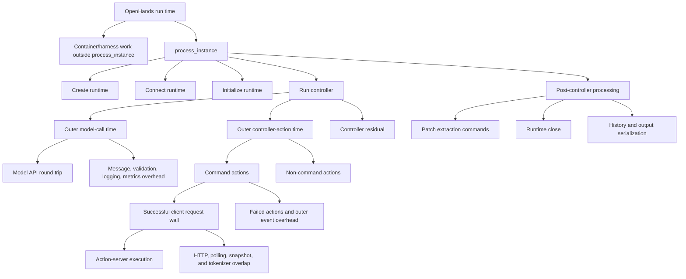

# Streaming Tool Call and Streaming Tokenizer Evaluation

**Scope:** This is the standalone accuracy and performance record for the
streaming tool-call and streaming-tokenizer experiments. It inventories the
persisted experiment families under `results/streaming_tool_call_verified/` as
of 2026-07-09, including complete, partial, and failed attempts. It deliberately
does not describe feature architecture or implementation design.

## Reading the results

- **Strict accuracy** is resolved instances divided by the requested manifest
  size; missing trajectories count as incorrect.
- **OpenHands run time** is the mean end-to-end agent runtime per trajectory.
- **Recovered rollout elapsed / prompt** is the sum of the observed
  `Collecting rollouts` elapsed time for every batch divided by the number of
  prompts. It excludes Slurm setup and teardown and is the best available
  historical rollout-only throughput metric, but it is still narrower than
  the newly logged canonical `timing/rollout/total` boundary.
- **Slurm job wall-clock / prompt** is the top-level Slurm allocation
  `ElapsedRaw` divided by the number of collected prompts. It includes startup,
  rollout, evaluation, and teardown, but excludes time waiting in the Slurm
  queue. It is a launch diagnostic, not rollout E2E.
- **Command time** is the legacy name for the mean outer controller
  action-handling interval. It includes every controller `Action`, not only
  shell commands. The command-only variant still includes client polling,
  tokenization, error handling, and controller overhead around command-server
  execution.
- **Model-call time** is the outer normal model-completion path. It includes
  message preparation, API round trip, response validation, completion-log
  serialization, streaming-context registration, and metric-file updates.
- A delta is always right arm minus left arm, or enabled arm minus disabled
  arm, as stated in the table.

Historical **infra error** columns in this document were produced by the old
audit rule that searched the entire serialized trajectory for error strings.
That rule also counted normal agent command output such as a sandboxed `wget`
reporting `Temporary failure in name resolution`. These values are retained as
legacy marker incidence, not as harness-failure counts. The July 8 runtime
diagnostic below scopes infrastructure classification to explicit top-level or
Responses API errors.

Temperature-zero sampling did not yield identical trajectories in the paired
rollouts. Infrastructure-error counts also differ between many arms. Therefore
these tables compare matched workloads and persisted result sets, not the same
sequence of agent actions; they are not causal per-trajectory latency proofs.

### Rollout batch boundary metric

`train/timing/rollout/total` is the canonical **batch E2E time**. It starts
immediately before per-row NeMo-Gym batch preparation and ends after results,
aggregate metrics, and per-agent metrics are available. It excludes worker
initialization, policy refit, Slurm preparation, and shutdown.

`train/timing/rollout/run_rollouts` is an execution-focused component of batch
E2E: remote `run_rollouts` submission, result wait, and tensorization. It is
useful for attribution, but it is not the primary E2E metric.

| Existing result set | `timing/rollout/total` recorded? | E2E use |
| --- | --- | --- |
| Full-workload reference run `0y1rovpi` | Yes, five rollout steps | Valid batch-E2E baseline |
| July 8 runtime diagnostic and July 9 exact-reuse runs | Yes, one rollout-only batch per run | Valid batch-E2E diagnostics; trajectory divergence still prevents causal attribution |
| Historical rollout-only comparisons in this report | No | Use recovered batch collection elapsed for rollout throughput; do not call it canonical batch E2E |

The full-workload run [`0y1rovpi`](https://wandb.ai/nvidia/swe-benchmark/runs/0y1rovpi)
already recorded this metric. It used 64 rollout samples per step:

| Step | `timing/rollout/total` | `timing/rollout/run_rollouts` | Rollout total / sample |
| ---: | ---: | ---: | ---: |
| 1 | 704.96 s | 704.63 s | 11.02 s |
| 2 | 663.90 s | 663.61 s | 10.37 s |
| 3 | 516.41 s | 516.12 s | 8.07 s |
| 4 | 733.73 s | 733.38 s | 11.46 s |
| 5 | 695.55 s | 695.26 s | 10.87 s |

The historical rollout-only runs did not persist `timing/rollout/*`, but their
Ray driver logs retained the terminal `Collecting rollouts` progress line for
each batch. The report recovers those observed batch elapsed values and
computes `sum(batch elapsed) / prompt count`. This covers rollout submission,
waiting, and nearly all per-result postprocessing; it does not include the
collector's preparation, final batch postprocessing, metric aggregation, or
logging boundary. It is therefore a substantially better throughput measure
than Slurm wall time, but remains a historical proxy rather than the canonical
timer.

The raw trajectory order also recovers batch membership because validation
uses `shuffle=False`, Gym restores asynchronous results by `_rowidx`, and the
collector appends each completed batch in order. The 500-row runs are split
`128 + 128 + 128 + 116`; the 474-row run is split
`128 + 128 + 128 + 90`. However, taking the slowest stored trajectory is not a
valid replacement for batch elapsed. A forensic reconstruction of the pinned
256-row pair uses the absolute `ray_queue_timestamp`, the stored phase
durations, and `response.created_at` from every raw trajectory:

| Arm | Request timestamp spread | Max Ray queue | Max stored queue-inclusive trajectory | Last response ready from first request | Observed batch collection elapsed | Post-response gap |
| --- | ---: | ---: | ---: | ---: | ---: | ---: |
| Streaming off | 3.89 s | 18.75 s | 1815.50 s | 1818.19 s | 3071 s | 1252.81 s |
| Streaming on | 3.48 s | 19.90 s | 1818.25 s | 1821.26 s | 2828 s | 1006.74 s |

This evidence rejects both pre-request admission and Ray scheduling as the
source of the large gap: all 256 server requests established their queue
timestamp within four seconds, and no recorded Ray queue exceeded twenty
seconds. It also rejects the synchronous server work before response
construction: `response.created_at` was at most about 1821 seconds after the
first request, and its lag behind the reconstructed runner completion was at
most 5.12 seconds off and 5.07 seconds on. The historical timestamp has
one-second resolution, which is immaterial to a 1000-second gap.

The missing interval is after the response object is ready and before the
collector finishes consuming it. That data path serializes each response,
transfers and parses its JSON body, then synchronously converts its token arrays
into tensors and decodes strings in NeMo-RL. The server intentionally returns
full cumulative `prompt_token_ids`, `generation_token_ids`, and
`generation_log_probs` for every assistant turn. The client subsequently uses
only the unseen prompt suffix and removes those arrays from the logged result,
so the wire representation repeats prefixes and is larger than the final raw
trajectory. Even after that removal, the pinned raw JSONL files are 6.00 GB off
and 5.50 GB on, averaging 23.44 MB and 21.47 MB per trajectory.

The completion curve confirms a serialized response-materialization tail:

| Completed trajectories | Off elapsed | On elapsed |
| ---: | ---: | ---: |
| 1 | 108 s | 128 s |
| 64 | 397 s | 333 s |
| 128 | 978 s | 765 s |
| 192 | 1880 s | 1560 s |
| 224 | 2423 s | 2116 s |
| 256 | 3071 s | 2828 s |

The historical files cannot separate FastAPI/Pydantic serialization, HTTP body
read plus `orjson` decode, and NeMo-RL token tensorization/decode. Future runs
now persist `timing/rollout/await_results` and
`timing/rollout/postprocess_results`, which separate the final client
postprocessing stage from response wait and transport. A finer trace still
needs timestamps for response-ready, headers received, body-read complete, and
JSON-decode complete. Until that trace is collected, the demonstrated root
cause is the post-run response materialization data path; attributing it to one
serializer or decoder would be speculation.

The rollout-only collector now logs every non-`full_result` rollout metric once
per batch under `train/*`, including
`train/timing/rollout/total`; with the configured vLLM metrics logger it also
records the corresponding `generation_metrics/*` worker timelines. New runs
additionally emit
`train/timing/rollout/batch_e2e_start_time_unix_s`,
`train/timing/rollout/batch_e2e_end_time_unix_s`, and
`train/timing/rollout/batch_prompt_count`. The timestamps audit the same
boundary as `train/timing/rollout/total`; divide that metric by
`train/timing/rollout/batch_prompt_count` for batch-E2E time per prompt. Do not
use Unix timestamp subtraction or Slurm job wall time as the primary E2E
measurement.

The recovered per-batch elapsed values for the two original 500-row pairs are:

| Artifact | Batch index | Prompt count | Streaming off | Streaming on |
| --- | ---: | ---: | ---: | ---: |
| `20260701T040547Z` | 0 | 128 | 1839 s | 1622 s |
|  | 1 | 128 | 1843 s | 1346 s |
|  | 2 | 128 | 1818 s | 1811 s |
|  | 3 | 116 | 1832 s | 1512 s |
| `20260701T132610Z` | 0 | 128 | 1866 s | 1783 s |
|  | 1 | 128 | 1854 s | 1822 s |
|  | 2 | 128 | 1828 s | 1748 s |
|  | 3 | 116 | 1985 s | 2183 s |

## 1. Streaming Tool Call

Streaming Tool Call is the full path: it can create streaming sessions and send
resumable prefill work before the normal final model request. Nonzero prefill
request counts confirm that this path was active.

### Complete SWE-Verified off/on pairs

All four rows below have a complete strict audit: the requested number of
unique trajectories on each side and zero response errors. They are separate
experiments with different dates, manifests, or implementation states, so they
must not be pooled into one accuracy estimate.

| Artifact | N per arm | Strict accuracy, off -> on (delta) | Recovered rollout elapsed / prompt (s) | OpenHands run time, mean (s) | Command time, mean (s) | Model-call time, mean (s) | On prefill requests | Legacy infra-marker hits, off / on |
| --- | ---: | --- | --- | --- | --- | --- | ---: | ---: |
| `20260701T040547Z` | 500 | 7.80% -> 8.60% (+0.80 pp) | 14.66 -> 12.58 (-14.2%) | 546.6 -> 482.0 (-11.8%) | 160.3 -> 102.2 (-36.2%) | 334.5 -> 338.2 (+1.1%) | 10,944 | 80 / 35 |
| `20260701T132610Z` | 500 | 8.00% -> 7.40% (-0.60 pp) | 15.07 -> 15.07 (+0.04%) | 544.7 -> 489.8 (-10.1%) | 155.0 -> 113.0 (-27.1%) | 335.3 -> 322.9 (-3.7%) | 10,321 | 76 / 42 |
| `20260702T032105Z-no-timeout474` | 474 | 8.23% -> 7.38% (-0.84 pp) | 15.54 -> 13.98 (-10.1%) | 533.0 -> 479.7 (-10.0%) | 152.4 -> 106.6 (-30.1%) | 328.9 -> 324.3 (-1.4%) | 7,961 | 75 / 34 |
| `20260706T092103Z-sweverified256-offon-poll050-pinned` | 256 | 18.36% -> 20.70% (+2.34 pp) | 12.00 -> 11.05 (-7.9%) | 698.0 -> 588.9 (-15.6%) | 193.1 -> 101.3 (-47.5%) | 418.7 -> 408.2 (-2.5%) | 3,531 | 38 / 19 |

The final 256-row pair uses manifest
`afcf19d7590f0f796b3c916826aad213e946872fe0bfb13f60060af9f845df56`,
temperature zero, top-p one, and a 50 ms poll interval. Its audit is stored at
`results/streaming_tool_call_verified/20260706T092103Z-sweverified256-offon-poll050-pinned/strict_comparison.json`.

Across these four independent pairs, full streaming lowered mean OpenHands run
time by 10.0--15.6% and command time by 27.1--47.5%. Recovered rollout elapsed
per prompt changed by +0.04% to -14.2%; three pairs improved and one was flat.
The strict-accuracy delta ranged from -0.84 to
+2.34 percentage points, while on-arm legacy infrastructure-marker incidence
was lower in every
pair. That error asymmetry prevents a correctness claim from the historical
comparisons.

### 50 ms text-bucket sweep

The following comparison reuses the same saved 256-row streaming-off baseline
(18.36% strict accuracy; 12.00 s recovered rollout elapsed / prompt; 698.0 s
OpenHands run time; 193.1 s command time; 418.7 s model-call time;
38 legacy infrastructure-marker hits)
and contrasts it with every saved 50 ms full-streaming bucket run. Each
candidate is a separately scheduled rollout, not a contemporaneous replay of
the baseline.

| Full-streaming bucket | Strict accuracy (delta vs off) | Recovered rollout elapsed / prompt (s) | OpenHands run time, mean (s) | Command time, mean (s) | Model-call time, mean (s) | Prefill requests | Legacy infra-marker hits |
| --- | --- | --- | --- | --- | --- | ---: | ---: |
| 64 chars | 18.75% (+0.39 pp) | 12.30 (+2.6%) | 676.8 (-3.0%) | 119.5 (-38.1%) | 471.1 (+12.5%) | 5,726 | 21 |
| 128 chars | 19.92% (+1.56 pp) | 11.92 (-0.7%) | 662.3 (-5.1%) | 133.1 (-31.1%) | 454.3 (+8.5%) | 6,071 | 20 |
| 256 chars, default run | 20.70% (+2.34 pp) | 11.05 (-7.9%) | 588.9 (-15.6%) | 101.3 (-47.5%) | 408.2 (-2.5%) | 3,531 | 19 |
| 256 chars, repeat run | 16.80% (-1.56 pp) | 12.15 (+1.3%) | 644.0 (-7.7%) | 137.3 (-28.9%) | 439.7 (+5.0%) | 5,560 | 20 |
| 512 chars | 18.36% (+0.00 pp) | 15.96 (+33.1%) | 598.8 (-14.2%) | 105.1 (-45.5%) | 420.4 (+0.4%) | 4,361 | 16 |

The recovered batch metric materially changes the bucket conclusion: lower
mean trajectory or command time does not guarantee higher batch throughput.
The 64-character, repeated 256-character, and 512-character runs were slower
than the saved off baseline at the batch boundary; only the 128-character and
default 256-character runs improved.

The independently audited within-sweep pairs are
`bucket064_vs_bucket128_strict_comparison.json` and
`bucket256_vs_bucket512_strict_comparison.json` in their respective result
directories. Both contain 256 rows per arm and zero response errors. They show
that changing the text threshold changes action count, prefill volume, and
trajectory paths; they do not establish that one threshold preserves accuracy.

### Poll-interval tuning

Both arms in this 256-row comparison enabled full streaming with the same
manifest. The generic audit field names mean **left = 100 ms** and **right =
50 ms**, not off/on.

| Poll interval | Strict accuracy | Recovered rollout elapsed / prompt (s) | OpenHands run time, mean (s) | Command time, mean (s) | Model-call time, mean (s) | Prefill requests | Legacy infra-marker hits |
| --- | ---: | ---: | ---: | ---: | ---: | ---: | ---: |
| 100 ms | 5.47% | 11.52 | 610.5 | 123.3 | 426.0 | 5,184 | 19 |
| 50 ms | 9.77% | 11.59 (+0.6%) | 614.4 (+0.6%) | 119.0 (-3.5%) | 429.0 (+0.7%) | 5,517 | 24 |

This is a parameter smoke, not a feature on/off or accuracy conclusion: it has
zero exact trajectory matches and different legacy infrastructure-marker
counts. The
source is
`20260703T181000Z-admission-poll256-batch256/poll100_vs_poll050_comparison.json`.

### Mechanism, diagnostic, and full-workload experiments

These runs are part of the experiment inventory, but they are not valid
accuracy/performance comparisons:

| Experiment | Accuracy / reward evidence | Performance evidence | Why it is not a paired conclusion |
| --- | --- | --- | --- |
| Controlled APC microbenchmark, 2026-07-02 | No agent accuracy | TTFT: cold 85.73 ms; identical warm 11.38 ms; streaming immediate 16.92 ms; streaming after 100 ms 10.46 ms | One GPU, Qwen3-0.6B, no concurrent requests; validates cache mechanics only. |
| Production-path R2E diagnostics, `13352219` / `13353745` | Both 0 reward and 0 resolved across eight rollouts | Slurm job wall / prompt: 156.4 s / 181.4 s | The second run produced more tokens and turns, so elapsed time is confounded. |
| One-prompt R2E poll smoke, `13357509` / `13357510` | 1 / 1 versus 0 / 0 reward/resolved | Slurm job wall / prompt: 159.5 s / 164.3 s | One repeated prompt; different trajectories and action counts. |
| Early eight-rollout implementation evolution, `13242887`, `13242283`, `13244211`, `13245446` | 0/0, 0/0, 1/1, 0/0 resolved | Slurm job wall / prompt: 161.4 s, 185.3 s, 161.1 s, 152.5 s | Baseline, eager admission, two-snapshot admission, and progressive admission are different implementations. |
| Reference-aligned full workload | `13268983` failed at refit 2; `13274929` failed at refit 8; fixed `13278330` completed five steps | `13278330`: 1:13:27 wall time; step times 107.44--830.40 s | Stability/regression test with streaming enabled only; no off arm. |

### Partial and excluded records

The following persisted records are listed for completeness but are excluded
from accuracy/performance comparison tables:

| Artifact family | Outcome | Exclusion reason |
| --- | --- | --- |
| `20260701T025523Z` and `20260702T230000Z-admission-poll256` | 128 trajectories per arm | The requested 256-row manifests were only half collected. |
| `20260703T111754Z` | 27 trajectories per arm | Setup/DNS failures prevented a full pair. |
| `20260702T055426Z` and `20260702T223000Z-admission-poll474` | Launch metadata only | No saved trajectory collection. |
| `20260701T040547Z/infrastructure_retry_*` | Selected 87- and 55-row backfill overlays | Retry overlays are not independent full-manifest experiments. |
| `20260701T132610Z/repeatability_*` | Re-audits of existing raw collections | No new rollout work. |
| July 6 cache/no-invariant/off-on launch attempts and initial tokenizer-only launch | Failed or cancelled before usable collection | No complete pair: `13486572--13486573`, `13487576--13487577`, `13487796--13487797`, and `13494112--13494113`. |

## 2. Streaming Tokenizer

The historical Streaming Tokenizer experiment repeatedly fully tokenizes the
cumulative prompt while the tool action is running. It is a tokenizer-only
instrumentation mode, not the proposed stateful incremental tokenizer: it
creates no streaming prefill request, starts no streaming session, and retains
the ordinary final model request. The zero prefill count distinguishes this
experiment from full Streaming Tool Call.

### Complete SWE-Verified off/tokenizer-only pairs

All rows use the fixed 256-instance Verified manifest, 32 vLLM replicas,
temperature zero, top-p one, a 50 ms poll interval, and a 256-character text
bucket. Each strict audit has 256 unique rows per arm and zero response errors.

| Artifact | Status | Strict accuracy, off -> tokenizer-only (delta) | Recovered rollout elapsed / prompt (s) | OpenHands run time, mean (s) | Command time, mean (s) | Model-call time, mean (s) | Legacy infra-marker hits, off / tokenizer-only |
| --- | --- | --- | --- | --- | --- | --- | ---: |
| `20260706T142313Z-sweverified256-tokenizer-only-poll050-retry` | Retry; not pooled | 18.75% -> 23.44% (+4.69 pp) | 11.61 -> 10.80 (-7.0%) | 682.7 -> 594.0 (-13.0%) | 200.2 -> 111.2 (-44.5%) | 404.9 -> 409.0 (+1.0%) | 46 / 23 |
| `20260706T153058Z-...-trial1` | Primary repeat 1 | 19.14% -> 17.97% (-1.17 pp) | 11.17 -> 11.74 (+5.1%) | 646.2 -> 630.7 (-2.4%) | 144.2 -> 106.3 (-26.3%) | 423.1 -> 435.0 (+2.8%) | 35 / 22 |
| `20260706T153058Z-...-trial2` | Primary repeat 2 | 17.97% -> 19.92% (+1.95 pp) | 11.75 -> 11.45 (-2.6%) | 680.5 -> 609.7 (-10.4%) | 171.9 -> 113.5 (-33.9%) | 431.9 -> 414.9 (-3.9%) | 35 / 22 |
| `20260706T153058Z-...-trial3` | Primary repeat 3 | 19.14% -> 17.58% (-1.56 pp) | 11.95 -> 11.16 (-6.6%) | 651.0 -> 639.9 (-1.7%) | 152.5 -> 113.0 (-25.9%) | 404.3 -> 417.5 (+3.3%) | 39 / 19 |

### Primary three-repeat aggregate

Only the three primary repeats are aggregated because they use the same
manifest and protocol. Across 768 trajectories, strict accuracy was 144/768
(18.75%) for off and 142/768 (18.49%) for tokenizer-only, a -0.26 percentage
point difference. Mean OpenHands run time fell from 659.2 s to 626.8 s
(-4.9%); mean command time fell from 156.2 s to 111.0 s (-29.0%); and mean
model-call time changed from 419.8 s to 422.5 s (+0.65%). Recovered rollout
elapsed was 11.62 s off versus 11.45 s tokenizer-only per prompt (-1.48%).

Tokenizer-only recorded 87,439 eligible actions, 6,699 tokenizer-only actions
(7.66% of eligible actions), and 15,322 incremental-tokenizer requests. It
recorded zero streaming prefill requests and zero streaming sessions. Exact
trajectory-match count was zero in every repeat. The legacy audit reported 109
off-arm versus 63 tokenizer-only infrastructure-marker hits. The aggregate
therefore shows a repeatable command-interval reduction but does not establish
deterministic parity or an unchanged accuracy rate.

### July 8 OpenHands runtime breakdown diagnostic

This paired diagnostic uses the first 16 rows of the fixed 474-row
SWE-Verified manifest, temperature zero, top-p one, `shuffle=False`, one batch
of 16 concurrent trajectories, four vLLM replicas, a 50 ms poll interval, and
a 256-character threshold. Each arm uses one generation node plus the fixed
rollout-only no-op training node. Streaming prefill is disabled in both arms;
the right arm enables cumulative tokenizer-only requests. Jobs `13575863` and
`13575864` completed successfully with 16 rows each and no Responses API or
harness infrastructure errors.

- Off W&B: [`7ux9bq3b`](https://wandb.ai/nvidia/swe-benchmark/runs/7ux9bq3b)
- Tokenizer-only W&B:
  [`fz1l537p`](https://wandb.ai/nvidia/swe-benchmark/runs/fz1l537p)
- Result directory: `results/streaming_tool_call_verified/20260708T141655Z`
- Manifest SHA-256:
  `9309be0ea9dce987fc509d47845abef3fd3d28cce524e030a889f9fdef92b82a`

An earlier 16-row instrumentation pair, jobs `13572966` and `13572967`, is
excluded from the action-server analysis. The server serialized latency as the
top-level `execution_latency` event field, but the client tried to read a
private attribute after `observation_from_dict()` had discarded that event
metadata. Every server timer was consequently zero. The client now reads the
serialized field before observation reconstruction; a regression test crosses
the same serialization boundary, and the corrected pair records 1034.63 s of
off-arm action-server time instead of zero.

The diagnostic also exposed two reporting defects. The old infrastructure
classifier scanned normal tool output and falsely labeled an agent's failed
`wget` as a harness DNS error; classification is now restricted to explicit
error payloads. In addition, a failed agent command could leave the negative
start sentinel in `generation_apptainer_spinup_time`; the failure path now
sets that unavailable metric to null. The focused compute-node validations
passed 2/2 OpenHands serialization tests, 13/13 audit tests, and 2/2 Gym metric
tests.

#### Batch E2E, accuracy, and workload

`train/timing/rollout/total` is the canonical one-batch E2E measurement. The
right arm completed the batch 14.80 s faster, but its mean trajectory request
was 21.0% slower. This is possible because all 16 trajectories run in
parallel: the maximum request controls the batch tail, while the mean measures
total per-trajectory work.

| Metric, all 16 rows | Off | Tokenizer-only | Change |
| --- | ---: | ---: | ---: |
| Strict resolved | 4/16 (25.00%) | 3/16 (18.75%) | -6.25 pp |
| Exact trajectory matches | 0/16 | 0/16 | no parity evidence |
| `timing/rollout/total` | 1021.90 s | 1007.10 s | -1.45% |
| Batch E2E / prompt | 63.87 s | 62.94 s | -1.45% |
| Transport request span | 1018.57 s | 982.84 s | -3.51% |
| Mean transport request | 462.62 s | 559.70 s | +21.0% |
| Maximum transport request | 1018.57 s | 982.84 s | -3.51% |
| Rollout postprocessing | 119.84 s | 181.38 s | +51.3% |
| Response-body bytes | 305.47 MB | 455.79 MB | +49.2% |
| Mean OpenHands run time | 438.25 s | 533.31 s | +21.7% |
| Normal model calls | 1457 | 1987 | +36.4% |
| Mean outer model-call time | 322.98 s | 415.35 s | +28.6% |
| Successful controller command requests | 1225 | 1818 | +48.4% |
| Mean legacy all-action time | 66.51 s | 62.92 s | -5.4% |
| Mean legacy command-only action time | 64.52 s | 61.91 s | -4.0% |

The reward flips were off-only for `astropy__astropy-12907` and
`astropy__astropy-7166`, and tokenizer-only-only for
`astropy__astropy-13579`. With zero exact trajectories and only 16 examples,
the -6.25 percentage-point accuracy delta is a diagnostic observation, not an
accuracy-regression estimate.

#### Why model call plus command does not equal OpenHands run time

The timers are nested. They should be read as the following containment, not
summed across every row of the diagram:

One tokenizer-only trajectory, `astropy__astropy-7166`, killed its own
OpenHands parent with `kill -9 33`. It therefore has high-level Gym timing but
no completed `process_instance` phase record. The phase equation below uses 16
complete off records and the 15 complete tokenizer-only records so every
column has a consistent denominator.

| Mean phase time | Off, n=16 | Tokenizer-only, n=15 |
| --- | ---: | ---: |
| OpenHands run time | 438.25 s | 552.59 s |
| Outside `process_instance` | 27.19 s | 28.92 s |
| `process_instance` | 411.06 s | 523.67 s |
| Create + connect + initialize | 15.74 s | 15.96 s |
| Run controller | 392.65 s | 504.34 s |
| Outer model calls within controller | 322.98 s | 437.10 s |
| Outer actions within controller | 66.51 s | 59.50 s |
| Controller residual | 3.17 s | 7.74 s |
| Post-controller processing | 2.65 s | 3.36 s |
| Patch extraction within postprocessing | 1.49 s | 1.53 s |
| Runtime close within postprocessing | 0.20 s | 0.20 s |
| History/output work within postprocessing | 0.97 s | 1.63 s |

For model calls, the off arm spent 284.68 s per trajectory in the API round
trip and 38.30 s in outer client work. Across the 15 complete tokenizer-only
records those values were 364.55 s and 72.55 s. The right arm made many more
calls with longer histories; completion-log serialization and other client
work are therefore material. This is one reason `model call + command` cannot
equal the broader OpenHands timer.

#### What the command timers actually show

The corrected action-server timer is captured inside the action-execution
server, before the observation crosses HTTP. The successful request timer is
captured in the client and contains server execution plus transport and any
streaming polling/tokenizer work. The legacy outer timer surrounds the whole
controller event and also includes failed requests, provider-token checks,
error conversion, and event handling.

| Controller command total, all 16 rows | Off | Tokenizer-only | Delta |
| --- | ---: | ---: | ---: |
| Successful request count | 1225 | 1818 | +593 |
| Action-server execution | 954.20 s | 605.93 s | -348.27 s |
| Client overhead inside successful requests | 15.92 s | 134.52 s | +118.59 s |
| Successful request wall | 970.13 s | 740.45 s | -229.68 s |
| Outer work beyond successful requests | 62.14 s | 250.05 s | +187.91 s |
| Legacy outer command-action time | 1032.27 s | 990.50 s | -41.77 s |
| Server seconds / successful command | 0.779 s | 0.333 s | -57.2% |
| Median per-trajectory server seconds / command | 0.374 s | 0.311 s | -16.8% |

These aggregate rates do not compare the same commands. The off arm's
`astropy__astropy-7166` trajectory alone spent 472.29 s in action-server
commands and resolved successfully. It repeatedly ran expensive commands,
including `python setup.py test`, among 70 successful command requests. The
tokenizer-only trajectory took a different path, recorded only 6.19 s of
successful command-server time over 28 requests, then killed the OpenHands
parent and did not produce a patch. Removing this one instance changes the
action-server comparison from a 36.5% decrease to:

| Command metric after excluding `astropy__astropy-7166` from both arms | Off, n=15 | Tokenizer-only, n=15 | Change |
| --- | ---: | ---: | ---: |
| Action-server execution total | 481.91 s | 599.74 s | +24.5% |
| Action-server execution mean / trajectory | 32.13 s | 39.98 s | +24.5% |
| Legacy outer command-action total | 555.70 s | 876.50 s | +57.7% |
| Successful command count | 1155 | 1790 | +55.0% |
| Server seconds / successful command | 0.417 s | 0.335 s | -19.7% |

The historical command-time reduction is therefore not evidence that
tokenization accelerates shell execution. It is primarily an action-mix and
outlier effect; even normalization per command is not causal because command
contents differ.

#### Tokenizer-only work and overlap

The tokenizer-only arm observed 1833 eligible actions, admitted 146 valid
tokenizer actions (7.97%), issued 299 tokenizer requests, and spent 85.00 s in
those requests. It recorded 13,926,795 “incremental tokenizer tokens,” but this
counter sums the full cumulative prompt length returned by every request; it
is not the number of newly tokenized suffix tokens. Snapshot requests consumed
13.86 s and post-command streaming tails consumed 86.38 s. These timers overlap
with command request wall and with one another, so they must not be added.

Most importantly, tokenizer-only currently retains no token IDs or tokenizer
state. Every admitted snapshot constructs the full cumulative chat prompt,
calls `/tokenize`, keeps only `token_count`, and discards the token IDs. The
ordinary model request after the command tokenizes the final prompt again.
There are zero streaming prefill requests and zero KV-cache sessions. The mode
can add polling and tokenizer overhead, but it has no mechanism that can make
the concurrently running command process faster or let final generation reuse
the early tokenization.

This diagnostic overturns the causal interpretation of the historical
`command time -29%` observation. The rigorous result for the present
implementation is: canonical batch E2E changed by -1.45% in one small,
trajectory-divergent pair; mean OpenHands and mean request time worsened; and
the apparent server-command reduction disappears when one unmatched outlier
is removed. A real incremental-tokenizer experiment must preserve a stable
token prefix across snapshots and pass reusable token IDs into the final
generation path before expecting a direct performance benefit.

### July 9 authoritative final-token reuse

The tokenizer-only path now keeps the final `/tokenize` result and hands it to
the immediately following generation request. It still fully retokenizes each
admitted cumulative snapshot; it is not a suffix-only stateful tokenizer. The
new mechanism removes two redundant operations for a matched action: the next
generation request's prompt encode and Gym's post-generation prompt-logging
`/tokenize` request. It does not submit a speculative prefill or start
generation before the command finishes.

The implementation was validated in stages because OpenHands removes old
assistant token-logging fields before each request even though those fields do
not affect the rendered chat text:

| Run | N | Strict resolved | Candidate / request / match | Exact / token-equivalent | Outcome |
| --- | ---: | ---: | ---: | ---: | --- |
| [`0aa7kcy7`](https://wandb.ai/nvidia/swe-benchmark/runs/0aa7kcy7), initial raw-JSON gate | 16 | 1/16 | 24 / 24 / 2 | not separated | Correct fallback, but raw comparison rejected 22 reusable candidates. |
| [`90h0zqzs`](https://wandb.ai/nvidia/swe-benchmark/runs/90h0zqzs), final-observation truncation aligned | 16 | 3/16 | 28 / 28 / 3 | not separated | Fixed observation formatting; old assistant logging fields still caused 25 raw mismatches. |
| [`x2d4z66y`](https://wandb.ai/nvidia/swe-benchmark/runs/x2d4z66y), token-equivalence diagnostic | 4 | diagnostic | 16 / 16 / 16 | 0 / 16 | Proved every raw mismatch tokenized to the same authoritative IDs. |
| [`ff4s71uu`](https://wandb.ai/nvidia/swe-benchmark/runs/ff4s71uu), two-stage gate | 16 | 3/16 | 31 / 31 / 31 | 1 / 30 | Correct and complete, but 30 next-turn fallback tokenizations remained. |
| [`x09hq0qz`](https://wandb.ai/nvidia/swe-benchmark/runs/x09hq0qz), first canonical attempt | incomplete | N/A | N/A | N/A | Rejected: removing every logging field also disabled vLLM authoritative-prefix replacement and triggered the unchanged token-contiguity assertion. |
| [`og2vh7yq`](https://wandb.ai/nvidia/swe-benchmark/runs/og2vh7yq), repaired exact smoke | 4 | 0/4 | 3 / 3 / 3 | 3 / 0 | 4/4 trajectories completed with no mismatch, missing candidate, or continuity failure. |
| [`7khlbb9s`](https://wandb.ai/nvidia/swe-benchmark/runs/7khlbb9s), repaired exact final | 16 | 1/16 | 25 / 25 / 25 | 25 / 0 | Final result: every reused request took the no-extra-tokenize exact path. |

The rejected canonical attempt is useful correctness evidence. The ordinary
NeMo-RL vLLM preprocessing reads the most recent assistant
`prompt_token_ids + generation_token_ids` and replaces a potentially changed
chat-template prefix with those authoritative historical IDs. Removing all
logging fields from the candidate's `/tokenize` request bypassed that repair.
The fixed implementation keeps only the most recent complete logging triplet
for tokenization, drops older triplets, and removes all triplets only from a
separate lightweight comparison copy. The existing strict monotonic-token
assertion remains enabled and passed for all 20 trajectories in the repaired
smoke and final runs.

The final 16-row run and frozen off baseline use the same first-16 manifest,
SHA-256
`9309be0ea9dce987fc509d47845abef3fd3d28cce524e030a889f9fdef92b82a`,
temperature zero, top-p one, `shuffle=False`, four vLLM replicas, one batch,
50 ms polling, a 256-character threshold, and concurrency 16. The strict audit
is
`results/streaming_tool_call_verified/20260708T205300Z_exact_final/comparison_vs_20260708T162321Z_off.json`.

| Metric, all 16 rows | Streaming off | Tokenizer-only exact reuse | Change |
| --- | ---: | ---: | ---: |
| Strict resolved | 2/16 (12.50%) | 1/16 (6.25%) | -6.25 pp |
| Paired outcomes | both 1, off-only 1 | on-only 0, neither 14 | diagnostic only |
| `train/timing/rollout/total` | 1523.96 s | 1007.59 s | -33.88% |
| Batch E2E / prompt | 95.25 s | 62.97 s | -33.88% |
| Mean OpenHands run time | 540.25 s | 444.01 s | -17.81% |
| Model calls | 1483 | 1650 | +11.26% |
| Mean outer model-call time / trajectory | 393.59 s | 341.53 s | -13.23% |
| Tool calls | 1446 | 1563 | +8.09% |
| Mean command time / trajectory | 96.57 s | 56.48 s | -41.51% |
| Hermes parser-warning events | 33 | 80 | +47 |
| 131,073-token non-terminal overflows | 3 | 2 | -1 |

The tokenizer-only arm observed 1523 eligible actions and admitted 25 valid
actions (1.64%). Those actions issued 77 cumulative tokenizer requests, or
3.08 per admitted action, and spent 10.57 aggregate seconds in tokenizer
requests. They produced 25 one-shot candidates and 25 next-call requests:
all 25 matched the canonical prompt and sticky backend exactly. There were
zero token-equivalent fallbacks, true prompt mismatches, missing candidates,
prefill requests, or streaming sessions.

The batch and mean-runtime reductions are real measurements of these saved
runs, but they are not a causal speedup estimate. The on arm made 167 more
model calls and 117 more tool calls, all 16 trajectory hashes differed, the
Hermes warning counts differed substantially, and strict reward flipped on one
instance. Temperature zero does not make the asynchronous multi-replica agent
deterministic. With only 25 admitted actions among 1523 eligible actions and 16
trajectories, this run proves the handoff mechanism and shows promising batch
timing; it does not establish accuracy parity or isolate the per-action latency
saved by reuse. A fixed-trace or request-replay microbenchmark is still needed
for causal tokenizer savings, and a substantially larger repeated paired run
is needed for an accuracy gate.

## Comparison and decision status

| Dimension | Streaming Tool Call | Streaming Tokenizer |
| --- | --- | --- |
| Work performed before final request | Remote resumable prefill; 3,531--10,944 prefill requests in the complete off/on pairs | Repeated cumulative full-prompt tokenization only; zero prefill requests and sessions |
| Primary performance observation | Recovered rollout elapsed changed by +0.04% to -14.2%; OpenHands run time improved 10.0--15.6%; command time improved 27.1--47.5% across four complete historical off/on pairs | Historical three-repeat aggregate: recovered rollout elapsed -1.48%, OpenHands -4.9%, command -29.0%. July 8 diagnostic: canonical batch E2E -1.45%. July 9 exact-reuse diagnostic: canonical batch E2E -33.88% and OpenHands -17.81%, with materially different trajectories and work counts. |
| Model-call observation | -3.7% to +1.1% across historical complete pairs | +0.65% in the historical three-repeat aggregate; -13.23% mean time with +11.26% calls in the July 9 exact-reuse run |
| Strict-accuracy observation | -0.84 to +2.34 pp across historical complete pairs | Historical aggregate -0.26 pp; July 9 exact-reuse diagnostic -6.25 pp on 16 examples |
| What remains unproven | Accuracy parity, exact trajectory parity, and an error-normalized end-to-end gain | Accuracy parity and a causal performance gain. Exact final-token reuse is now proven for 25/25 admitted actions, but the encoder still fully retokenizes cumulative snapshots and coverage was only 1.64%. |

Neither feature clears an accuracy or deterministic-parity gate yet. For
tokenizer-only, the final authoritative token result is no longer discarded,
and its one-shot handoff is mechanically validated. The next tests should
separate two remaining questions: use fixed request traces to measure the
latency saved by exact token reuse, and use larger repeated, error-stable
off/on rollouts to evaluate strict accuracy. Suffix-only incremental tokenizer
state remains a separate future optimization.
