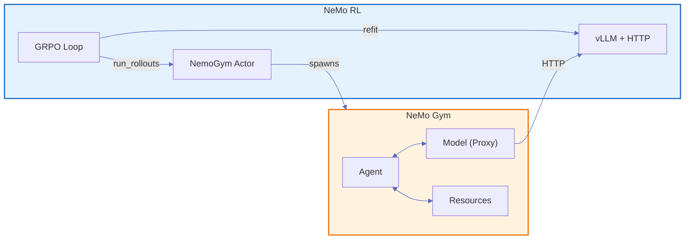
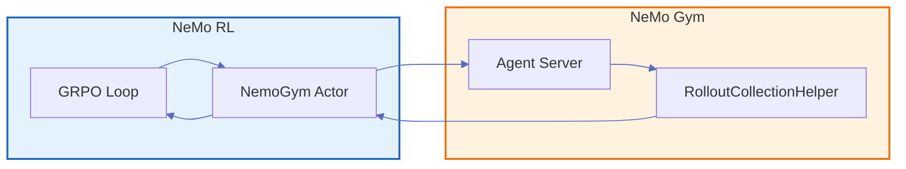
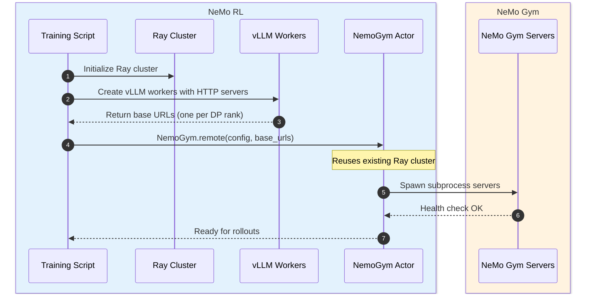
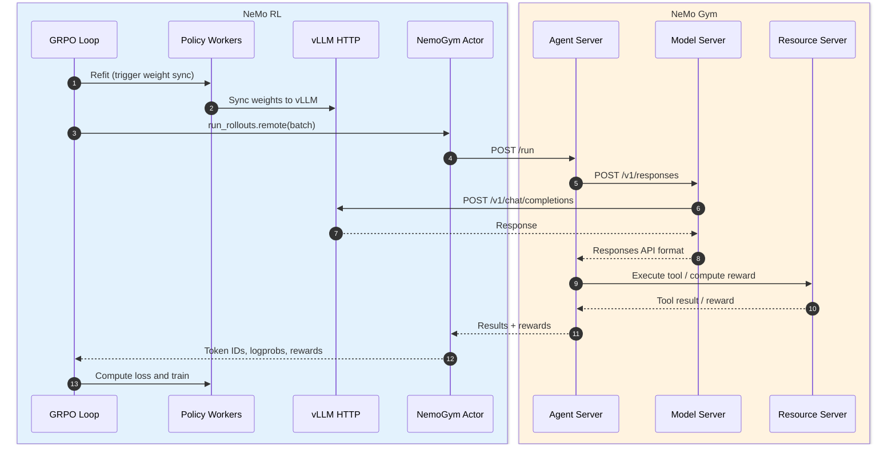
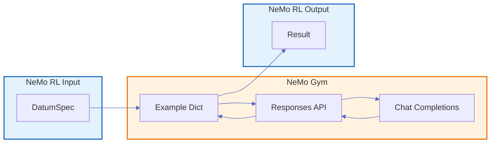

This document describes how NeMo RL integrates with [NeMo Gym](https://docs.nvidia.com/nemo/gym/latest/index.html) for multi-step and multi-turn reinforcement learning training.

## Overview

NeMo Gym provides HTTP-based training environments for LLMs. **NeMo Gym is CPU-only**—it runs no inference engines and holds no GPU memory. NeMo RL exposes its vLLM generation engine as an OpenAI-compatible HTTP server, which NeMo Gym calls during rollouts, enabling:

- **Decoupled architecture**: Environments don't need direct access to model internals
- **Multi-step/multi-turn support**: Agents can orchestrate complex interactions with tools
- **Refit compatibility**: NeMo RL's weight synchronization works transparently

## Configuration

To enable NeMo Gym integration, add the following to your NeMo RL config:

```yaml
policy:
  generation:
    backend: vllm
    vllm_cfg:
      async_engine: true          # Both required for HTTP server support:
      expose_http_server: true    # async_engine enables the async worker; expose_http_server starts the server

env:
  should_use_nemo_gym: true       # Enables NeMo Gym integration
  nemo_gym:
    # NeMo Gym config paths and settings
    config_paths:
      - resources_servers/math/configs/math.yaml
      - responses_api_agents/simple_agent/configs/simple_agent.yaml
```

For a complete example, see `examples/nemo_gym/` and its associated configs.

### Version Requirements

NeMo Gym runs as a Ray actor within NeMo RL's Ray cluster, so the same Ray and Python versions must be used in both environments.

## Architecture Overview



**Color coding**:
- Blue = NeMo RL code (`nemo_rl/`)
- Orange = NeMo Gym code (`3rdparty/Gym-workspace/Gym/nemo_gym/`)

## The NemoGym Actor

The integration is handled by the `NemoGym` Ray actor at `nemo_rl/environments/nemo_gym.py`:

1. **Created by NeMo RL** during training setup via `NemoGym.remote(config)`
2. **Joins the existing Ray cluster** that NeMo RL already initialized
3. **Spawns NeMo Gym servers** as OS subprocesses (Head, Agent, Model, Resources)
4. **Injects vLLM base URLs** so NeMo Gym's Model Server knows where to proxy requests
5. **Exposes `run_rollouts()`** as the entry point for the training loop to call



The flow is:
1. GRPO Loop calls `run_rollouts.remote(batch)` on the NemoGym Actor
2. Actor sends `POST /run` to the Agent Server
3. Agent Server orchestrates the rollout via RolloutCollectionHelper
4. Results return to the Actor
5. Actor returns results to the training loop

## vLLM HTTP Server

**NeMo Gym does not run its own vLLM engine.** The Model Server is purely an HTTP proxy:

| Aspect | NeMo RL vLLM Worker | NeMo Gym Model Server |
|--------|---------------------|----------------------|
| **Engine** | Runs actual vLLM `AsyncLLM` | No engine - HTTP proxy only |
| **GPU** | Holds model weights | No GPU required |
| **Endpoints** | `/v1/chat/completions`, `/tokenize` | `/v1/responses` |
| **Role** | Inference | API translation, forwards requests |

Data parallel vLLM workers each expose their own HTTP server. NeMo Gym's Model Server load-balances requests across them.

## Initialization Sequence



## Training Loop Control Flow



> **NeMo Gym server types** (see [Core Components](https://docs.nvidia.com/nemo/gym/latest/about/concepts/core-components.html)):
> - **Agent Server**: Orchestrates the rollout loop
> - **Model Server**: HTTP proxy to vLLM; translates Responses API ↔ Chat Completions
> - **Resource Server**: Provides tools and rewards

### Key Steps

| Step | Location | Description |
|------|----------|-------------|
| **Refit** | NeMo RL | Synchronizes policy weights to vLLM workers. For async RL, refit timing may differ—see {doc}`generation` for details. |
| **run_rollouts.remote()** | NeMo RL | Ray remote call from GRPO loop to the NemoGym actor |
| **POST /run** | NeMo RL → NeMo Gym | HTTP request from NemoGym actor to Agent Server subprocess |
| **Rollout orchestration** | NeMo Gym | Agent calls Model Server and Resources Server via HTTP |
| **POST /v1/chat/completions** | NeMo Gym → NeMo RL | Model Server proxies to NeMo RL's vLLM HTTP endpoint |
| **Result processing** | NeMo RL | NemoGym actor extracts token IDs, logprobs, rewards |

### Async Result Processing

The NemoGym actor uses an **as-completed** pattern to overlap waiting with post-processing:

1. **Results return out of order**: Single steps of the rollouts (the "assistant" + "tool" turns) complete at different times depending on conversation length and tool calls. Rather than waiting for all results, the actor processes each result as soon as it completes. Note: this is pipelining within NeMo Gym, not asynchronous processing of global batch steps by NeMo RL.

2. **Immediate post-processing**: As each rollout completes, the actor immediately extracts token IDs and logprobs. This overlaps CPU work with network I/O from slower rollouts still in flight.

3. **Reordering at the end**: Each example carries an index. After all results are collected, results are reordered to match the original batch order before returning to the training loop.

This pattern maximizes throughput by keeping the CPU busy while waiting for network responses.

## Data Format Translation



**Formats**:
- **DatumSpec** (NeMo RL): Training-focused format with `prompt`, `prompt_token_ids`, and task metadata
- **Example Dict** (NeMo Gym): Environment-focused format containing `responses_create_params` and `expected` answer
- **Responses API** (NeMo Gym): OpenAI Responses API format with `input`, `tools`, and multi-turn conversation
- **Chat Completions** (vLLM): OpenAI Chat Completions format for the actual inference call

**Data flow**: DatumSpec is converted to Example Dict, which passes through to the Responses API with generation parameters (`temperature`, `top_p`) added for on-policy sampling. The Model Server translates Responses API ↔ Chat Completions (converting message formats, extracting reasoning content, attaching token IDs). Results flow back with token IDs and logprobs extracted into the final Result.

## Tokenization and On-Policy Corrections

Token IDs are extracted at the NeMo RL vLLM layer via the `/tokenize` endpoint. This ensures:
- Tokenization matches the exact model and tokenizer used for generation
- No re-tokenization drift between generation and training

For details on on-policy token ID handling, see {doc}`../guides/environments` and the [NeMo Gym on-policy corrections documentation](https://docs.nvidia.com/nemo/gym/latest/contribute/rl-framework-integration/openai-compatible-http-server-on-policy-correction.html).
