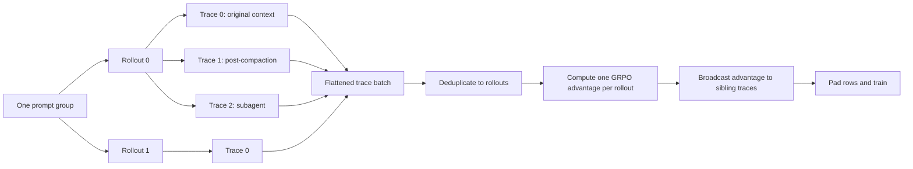
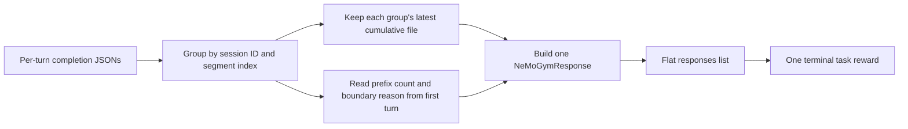

# Multi-trace rollouts in asynchronous GRPO

Compaction and subagents change the relationship between an environment rollout and a training row. One rollout can now contain several independently trainable, on-policy-contiguous traces. The rollout still receives one reward, and every trace from that rollout trains with the same rollout-level advantage.

## Mental model

- A **prompt group** is one source prompt sampled with `num_generations_per_prompt` independent rollouts.
- A **rollout** is one complete environment attempt. It owns one reward.
- A **trace** is one contiguous sequence of model calls. Compaction starts a new trace, and a subagent session can create another trace.
- A **training row** is one trace. Therefore, the rollout count is fixed by configuration while the row count varies.



The important invariant is:

> Reward and advantage belong to a rollout; tokens and loss masks belong to a trace.

## 1. The Gym SWE agent produces `responses`

The producer is [`responses_api_agents/swe_agents/app.py`](3rdparty/Gym-workspace/Gym/responses_api_agents/swe_agents/app.py). Its [`SWEBenchVerifyResponse`](3rdparty/Gym-workspace/Gym/responses_api_agents/swe_agents/app.py#L351) adds a plural `responses` field while preserving the inherited singular `response` field:

```text
SWEBenchVerifyResponse
├── response   main session's last segment; legacy compatibility
├── responses  one NeMoGymResponse per (session, segment), as a flat list
└── reward     one terminal task reward shared by every response
```

The singular field is necessary because the standard [`responses()` endpoint](3rdparty/Gym-workspace/Gym/responses_api_agents/swe_agents/app.py#L3727) must return exactly one `NeMoGymResponse`. It selects the last segment of the main session. The higher-level [`run()` method](3rdparty/Gym-workspace/Gym/responses_api_agents/swe_agents/app.py#L3872) reconstructs all main-session, post-compaction, and subagent trajectories and places them in `SWEBenchVerifyResponse.responses`.

Each plural response contains:

| Data | Meaning |
|---|---|
| `id` | Task, session, and segment identity |
| `output` | Response-API items containing the trainable model calls and their token data |
| `tools` | Tools available in that session/segment |
| `metadata.session_id` | Session that generated the trace |
| `metadata.parent_session_id` | Parent session for a subagent; empty for the main session |
| `metadata.segment_index` | Segment number within that session |
| `metadata.segment_boundary_reason` | Why the segment began, such as post-compaction |

The list is flat rather than a nested session tree. `parent_session_id` preserves the relationship for diagnostics, but NeMo RL trains every entry as a sibling trace of the same environment rollout. The current producer sorts by session ID and segment index for deterministic output; that ordering does not affect reward or advantage grouping.

### How completion dumps become response entries

OpenCode writes cumulative per-turn completion JSON files. [`_openhands_dir_copy_from_host`](3rdparty/Gym-workspace/Gym/responses_api_agents/swe_agents/app.py#L2460) groups them by `(session_id, segment_index)`, rather than session alone:



The latest file supplies the complete contiguous trajectory for that segment. Two values must instead come from the group's first turn:

- `prefix_message_count` is the number of messages in the first live model-call prompt. It marks where replayed or resent history ends and newly generated output begins.
- `segment_boundary_reason` is normally present only on the boundary turn. Reading it from the latest turn would lose it for a multi-turn segment.

[`get_all_session_trajectories_from_completions`](3rdparty/Gym-workspace/Gym/responses_api_agents/swe_agents/app.py#L3055) materializes one entry per group. During `run()`, messages before `prefix_message_count` are excluded from that entry's output. This matters after compaction: the first post-compaction call resends summarized or prior history as prompt context. A role-based split could misclassify that history as new generation and train the same earlier output twice.

The response output retains `prompt_token_ids`, `generation_token_ids`, and `generation_log_probs` from the model calls. Those are the fields consumed by NeMo RL's trace builder. Dumps predating session tagging fall back to a single-element `responses` list containing the legacy `response`.

Finally, the SWE verifier runs once for the task. [`run()`](3rdparty/Gym-workspace/Gym/responses_api_agents/swe_agents/app.py#L3949) sets one binary reward from `metrics.resolved`; there is no separate reward for a compaction segment or subagent session.

## 2. NeMo RL converts responses into traces

The environment may return either:

- legacy `response`: one response, converted into one trace; or
- `responses`: multiple compaction or subagent segments, converted into one trace per trainable response.

[`NemoGym._postprocess_nemo_gym_to_nemo_rl_result`](nemo_rl/environments/nemo_gym.py#L243) returns `list[dict]`, not a single result. Each result contains a trace `message_log`, the initial input log, a `trace_idx`, and the same `full_result` object.

Sharing the exact `full_result` object is deliberate. Reward shaping or a penalty applied through any trace updates the single rollout reward seen by every sibling trace.

When segmented `responses` exist, token arrays are removed from the legacy aggregate `response`. The segmented responses remain the source of training tokens, so retaining the aggregate arrays would only duplicate large data in the replay buffer and logs.

### Token continuity

[`NemoGym._build_trace_message_logs`](nemo_rl/environments/nemo_gym.py#L357) rebuilds each response as alternating user and assistant token blocks. Within one response, every later model-call prompt must start with all tokens previously seen in that response:

```text
next prompt prefix == prior prompt additions + prior generations
```

A mismatch raises immediately. Compaction is valid because it begins a new response and resets the continuity check. A mismatch inside a response means history was rewritten mid-segment; training through it would pair stored generation log probabilities with the wrong token history.

Responses without generation tokens are skipped. If an entire rollout has no trainable generation, conversion emits one dummy pad-token trace with `is_empty_rollout=True`. This keeps the rollout and its reward in the GRPO comparison group while ensuring it produces no gradient.

## 3. Rollout postprocessing flattens traces

[`_postprocess_single_group`](nemo_rl/experience/rollouts.py#L1371) receives this nested shape:

```text
prompt group -> rollouts -> traces
```

It emits a flat trace batch and attaches enough metadata to reconstruct both levels:

| Field | Scope | Meaning |
|---|---|---|
| `rollout_local_idx` | trace | Parent rollout index within the prompt group |
| `trace_in_rollout_idx` | trace | Sibling order; zero identifies the representative trace |
| `total_reward` | rollout, repeated per trace | Shared reward copied onto each training row |
| `is_empty_rollout` | rollout | Marks the dummy trace for a rollout with no generation |
| `mask_sample` | trace | Excludes the row from the gradient when true |
| `loss_multiplier` | rollout, expanded per trace | Parent rollout's loss weight |
| `source_dataset_idx`, `task_name`, `ng_task_index` | rollout, expanded per trace | Provenance retained after flattening |

For example, two configured rollouts can produce three rows:

| Flat row | `rollout_local_idx` | `trace_in_rollout_idx` | Reward | Advantage |
|---:|---:|---:|---:|---:|
| 0 | 0 | 0 | 1.0 | `A0` |
| 1 | 0 | 1 | 1.0 | `A0` |
| 2 | 1 | 0 | 0.0 | `A1` |

Rows 0 and 1 have different token sequences but represent the same rewarded attempt, so they share `A0`.

Reward penalties in [`apply_reward_penalties`](nemo_rl/experience/rollouts.py#L1035) preserve the same boundary. Rollout-wide text checks run only on the representative trace, while token checks may inspect every trace but count and mutate each shared rollout once. Empty dummy traces are ignored by penalty checks.

Metrics also preserve scope: token and turn details can be measured per trace, while reward, total rollout tokens, total turns, and termination are aggregated once per rollout.

## 4. The replay buffer stores one prompt group

[`run_async_nemo_gym_rollout`](nemo_rl/experience/rollouts.py#L1256) treats completion as one completed rollout even when the result contains several traces. The replay-buffer entry for a prompt group therefore has a variable number of rows but still represents exactly `num_generations_per_prompt` rollouts.

The asynchronous training loop backfills older replay-buffer entries that lack `rollout_local_idx`, `trace_in_rollout_idx`, or `is_empty_rollout`. An old entry is interpreted as one trace per rollout, allowing checkpoints created before multi-trace support to resume.

## 5. GRPO computes advantages at rollout level

Prompt-token grouping cannot be used for sibling traces: a compacted segment and a subagent have different prompts even though they belong to the same rollout and prompt group.

The asynchronous loop instead creates positional identifiers in [`grpo.py`](nemo_rl/algorithms/grpo.py#L5177):

```text
trace group id   = prompt-group position in this training step
trace rollout id = group id * num_generations_per_prompt + rollout_local_idx
```

It then verifies the number of unique rollout IDs, rather than the number of trace rows:

```text
unique rollouts == num_prompts_per_step * num_generations_per_prompt
```

At advantage calculation, [`grpo.py`](nemo_rl/algorithms/grpo.py#L5815) performs four operations:

1. Select the first trace for each unique rollout ID.
2. Compute GRPO advantages from one reward per rollout, grouped by prompt-group ID.
3. Map every trace back to its unique rollout.
4. Broadcast the rollout scalar across every token of every sibling trace.

Conceptually, for rollout `r` in prompt group `g`:

```text
A(g, r) = R(g, r) - baseline(g, r)
```

The configured GRPO estimator decides whether the baseline is leave-one-out and whether to divide by the group's reward standard deviation. Multi-trace handling only changes the input unit from trace rows to unique rollouts and then broadcasts the result.

Actual multi-trace batches currently require the GRPO advantage estimator. Reinforce++, OPD, and the synchronous GRPO path are rejected because their existing assumptions do not represent multiple token sequences sharing one rollout reward.

## 6. Variable trace batches are padded safely

The number of traces depends on runtime compaction and subagent behavior, so it may not be divisible by the data-parallel and microbatch requirements.

Before log-probability evaluation and training, [`grpo.py`](nemo_rl/algorithms/grpo.py#L5447) pads to:

```text
data_parallel_size * lcm(train_micro_batch_size, logprob_batch_size)
```

Padding duplicates row zero and its group/rollout IDs, then sets each added row's `sample_mask` to zero. Consequently:

- the duplicate rollout ID does not add a reward observation during deduplication;
- token losses from padded rows are zeroed;
- padding does not change gradient normalization; and
- logs and metrics slice back to the original `num_unpadded_traces` rows.

The policy receives the actual padded trace count as its global batch size, but the entire trace batch still forms one optimizer step.

## 7. Masking is layered

Masking answers two separate questions:

1. Does this rollout participate in GRPO reward comparison?
2. Do this trace's tokens contribute policy gradient?

For real rollouts, masking normally changes only the second answer. The rollout remains in the fixed comparison group, its reward is used to compute the rollout-level baseline and advantage, and its trace rows remain in the batch. A zero mask prevents those rows from contributing to the loss or its normalization.

### `mask_sample` and `sample_mask` have opposite conventions

The similarly named fields are easy to confuse:

- `mask_sample=True` is an environment instruction meaning **exclude this sample from gradient**.
- Training converts that instruction to `sample_mask=0`, where zero means **no loss contribution**.
- A positive `sample_mask` comes from `loss_multiplier`; it can act as a weight rather than only a Boolean mask.

The Gym SWE agent sets its rollout-level mask for max-iteration/context-window failures, evaluation timeouts, agent timeouts, agent OOMs, and evaluation OOMs. See [`app.py`](3rdparty/Gym-workspace/Gym/responses_api_agents/swe_agents/app.py#L3762). Because all traces share the rollout's `instance_config`, [`_postprocess_single_group`](nemo_rl/experience/rollouts.py#L1658) expands this decision to every sibling trace.

### Mask sources and scope

| Source | Scope | Training effect | Reward used for rollout advantage? |
|---|---|---|---:|
| Parent `loss_multiplier` | Rollout | Expanded to every sibling trace; zero disables them and positive values weight them | Yes |
| Environment `mask_sample=True` | Rollout | Sets every sibling trace's eventual `sample_mask` to zero | Yes |
| Empty-rollout dummy | Rollout | Its only trace is forced to zero | Yes |
| Overlong filtering | Trace | Sets only truncated trace rows to zero | Yes |
| Sequence log-probability error threshold | Trace | Sets failing trace rows to zero | Yes |
| Generated-token selection | Token | Enables only generated assistant tokens | Not applicable |
| Data-parallel padding | Artificial row | Sets duplicated padding rows to zero | No new reward observation |

This means one bad compacted segment can be masked while another segment from the same rollout still trains. In contrast, an environment mask or zero parent loss multiplier masks every trace from that rollout.

### How the effective loss mask is built

The asynchronous training loop applies masks in stages in [`grpo.py`](nemo_rl/algorithms/grpo.py#L5363):

1. Start each trace with its expanded parent `loss_multiplier`.
2. If overlong filtering is enabled, set a truncated trace's multiplier to zero.
3. Convert environment `mask_sample=True` to a zero multiplier.
4. Build `token_mask`: one for assistant tokens carrying `generation_logprobs`, zero for prompt, tool/user, non-generated, and sequence-padding tokens.
5. Store the multiplier as numeric `sample_mask`.
6. Add any data-parallel padding rows with `sample_mask=0`.
7. Optionally set a trace to zero when its sequence-level generation/current-policy log-probability error exceeds `seq_logprob_error_threshold`.

The policy-gradient loss combines both levels in [`loss_functions.py`](nemo_rl/algorithms/loss_functions.py#L212):

```text
effective token mask = token_mask * sample_mask[:, None]
```

Therefore, `token_mask=0` removes individual tokens, while `sample_mask=0` removes the entire trace. A masked row can still carry tokens, reward, and a broadcast advantage in memory; multiplying by the effective mask makes its loss and gradient zero.

### Masking does not remove rewards from GRPO grouping

At rollout-level advantage calculation, [`grpo.py`](nemo_rl/algorithms/grpo.py#L5823) deduplicates traces to one reward per rollout without consulting `sample_mask`. It computes the rollout advantages and broadcasts them to all sibling rows, including masked rows. The loss mask is applied afterward.

For example:

| Rollout | Trace | Reason | Reward in baseline | Gradient |
|---:|---:|---|---:|---:|
| 0 | 0 | Valid | Yes | Yes |
| 0 | 1 | Overlong | Same rollout reward, once | No |
| 1 | 0 and 1 | Environment timeout mask | Yes | No for both |
| 2 | Dummy | No generation data | Yes | No |

The first two rows still share one rollout advantage. Masking trace 1 does not create a second reward observation and does not stop trace 0 from training.

Two metrics expose the outcome after all trace-level filters: `multi_trace/masked_trace_fraction` reports the fraction of real, unpadded trace rows with non-positive `sample_mask`, and `multi_trace/fully_masked_rollout_fraction` reports rollouts for which every trace is masked. See [`grpo.py`](nemo_rl/algorithms/grpo.py#L6178).

## 8. Empty rollouts remain in the baseline

An empty rollout can result from an agent failure, timeout, OOM, an overlong first prompt, or an environment result with no model generation.

Its dummy trace has no assistant tokens and is masked from the loss. Its reward is still included when computing the prompt group's rollout-level baseline. Dropping the rollout would change the configured comparison group and could bias training toward only successful executions.

| Empty rollout behavior | Included? |
|---|---:|
| Rollout-count validation | Yes |
| Reward statistics and GRPO baseline | Yes |
| Policy gradient | No |
| Trace-count diagnostics | Yes, as one dummy trace |

## 9. Validation and observability

Validation keeps rewards aligned with trace message logs for inspection, but computes accuracy once per rollout by selecting rows where `trace_in_rollout_idx == 0`. See [`validate`](nemo_rl/algorithms/grpo.py#L4557).

Useful rollout-postprocessing metrics include:

- `traces_per_sample/*`: distribution of trace counts per rollout;
- `turns_per_trace/*`: segment-level turn distribution;
- `empty_rollout_count`: rollouts with no generation data; and
- existing reward/token/termination metrics, aggregated per rollout.

Useful asynchronous training metrics include:

- `multi_trace/num_traces` and `multi_trace/num_rollouts`;
- `multi_trace/traces_per_rollout_mean` and `multi_trace/traces_per_rollout_max`;
- `multi_trace/padding_rows`;
- `multi_trace/masked_trace_fraction` and `multi_trace/fully_masked_rollout_fraction`;
- `multi_trace/zero_std_group_fraction`; and
- `multi_trace/mean_trace_length` and `multi_trace/max_trace_length`.

## Supported configuration

Multi-trace training is supported when all of the following are true:

- asynchronous GRPO is enabled;
- the GRPO advantage estimator is selected; and
- OPD is disabled.

Single-trace and legacy replay-buffer data continue through their existing paths. The stricter restrictions are applied only when at least one rollout actually has more than one trace.

## Code map

- Gym multi-response schema and shared task reward: [`app.py`](3rdparty/Gym-workspace/Gym/responses_api_agents/swe_agents/app.py#L351)
- Completion grouping and first-turn split metadata: [`app.py`](3rdparty/Gym-workspace/Gym/responses_api_agents/swe_agents/app.py#L2460)
- Per-session, per-segment trajectory reconstruction: [`app.py`](3rdparty/Gym-workspace/Gym/responses_api_agents/swe_agents/app.py#L3055)
- Plural response assembly and legacy fallback: [`app.py`](3rdparty/Gym-workspace/Gym/responses_api_agents/swe_agents/app.py#L3872)
- Gym response splitting, shared rollout state, empty-rollout fallback: [`nemo_gym.py`](nemo_rl/environments/nemo_gym.py#L243)
- Trace continuity and token/log-probability construction: [`nemo_gym.py`](nemo_rl/environments/nemo_gym.py#L357)
- Rollout-scoped reward penalties: [`rollouts.py`](nemo_rl/experience/rollouts.py#L1035)
- Async result normalization and group completion: [`rollouts.py`](nemo_rl/experience/rollouts.py#L1256)
- Flattening, metadata expansion, masking, and rollout/trace metrics: [`rollouts.py`](nemo_rl/experience/rollouts.py#L1371)
- Environment, truncation, and generated-token mask construction: [`grpo.py`](nemo_rl/algorithms/grpo.py#L5363)
- Sequence log-probability error masking: [`grpo.py`](nemo_rl/algorithms/grpo.py#L3346)
- Final policy-gradient mask application: [`loss_functions.py`](nemo_rl/algorithms/loss_functions.py#L212)
- Synchronous-path rejection: [`grpo.py`](nemo_rl/algorithms/grpo.py#L3717)
- Validation rollout deduplication: [`grpo.py`](nemo_rl/algorithms/grpo.py#L4557)
- Replay compatibility, positional grouping, count checks, and padding: [`grpo.py`](nemo_rl/algorithms/grpo.py#L5177)
- Rollout-level advantage calculation and trace broadcast: [`grpo.py`](nemo_rl/algorithms/grpo.py#L5815)
- Multi-trace training metrics: [`grpo.py`](nemo_rl/algorithms/grpo.py#L6194)
