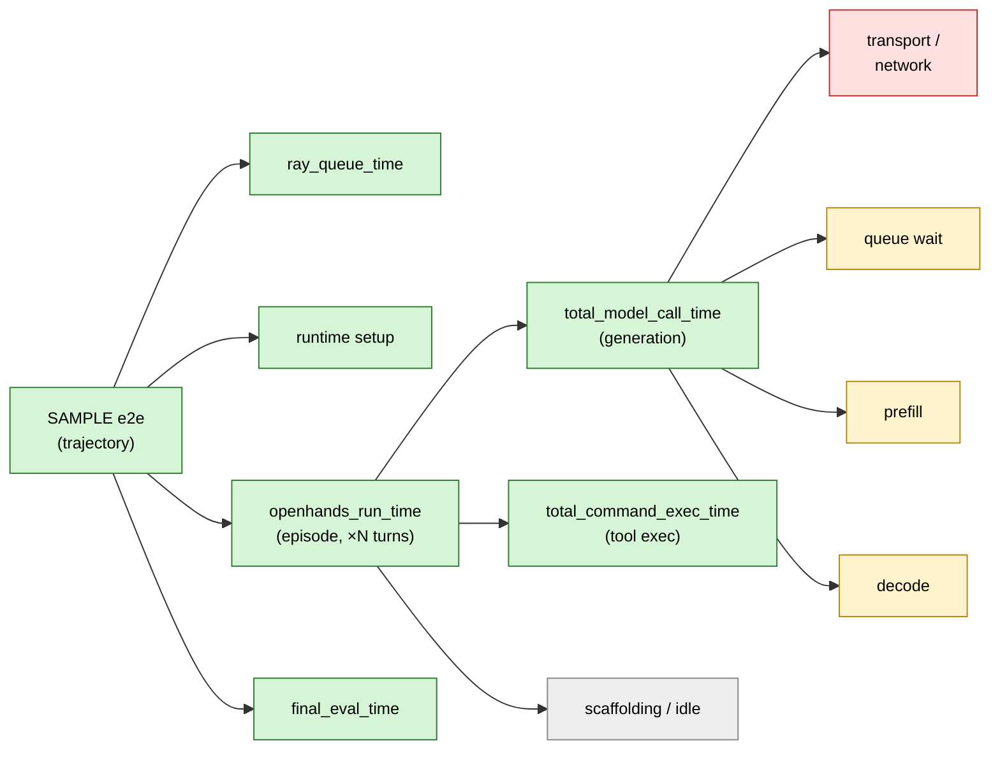
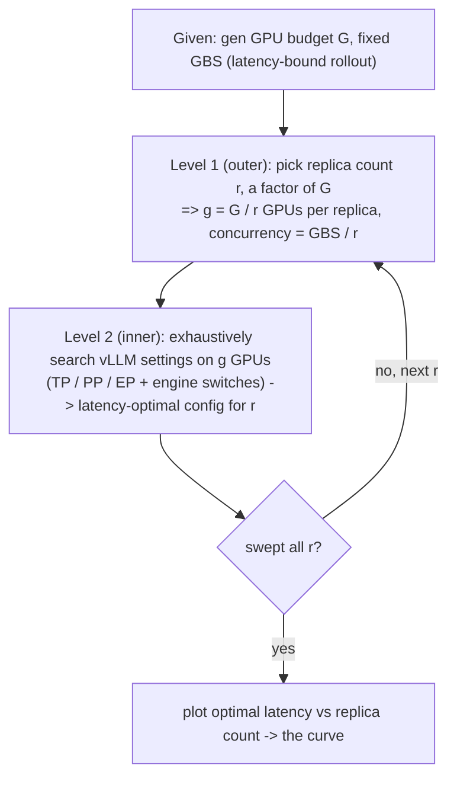

# Rethink Agentic Rollout in NeMo RL

**Author:** Jonas Yang (joyang@nvidia.com)

Working notes for the slide deck. Starting point: **four SWE async-GRPO rollout
workloads** — two *measured* W&B runs and two *recipe profiles* from
`swe_workload_calibration.md` (in the sibling `k8s` repo:
`../k8s/swe_workload_calibration.md`).

The *Ref workload* below comes from the *Ultra RL Goodput Analysis* (in the
[Nemo RL Rollout](https://docs.google.com/document/d/1bm9wU8gGSeeQGCsETluDbMoNgJG1EPqWRBkZhAbTDGo/edit) doc).

## Starting points: four SWE rollout workloads

| Parameter | SWE2-small (run) | SDD-ultra (run) | Ultra recipe (128K) | Ref workload (192K) |
| --- | --- | --- | --- | --- |
| Source | [W&B `q93vig6p`](https://wandb.ai/nvidia/binhu-nemo-rl/runs/q93vig6p) | [W&B `ej1s3h5z`](https://wandb.ai/nvidia/sdd-swe-0415-upload/runs/ej1s3h5z) | recipe `grpo_ultra_swe_e2e.yaml` | `repro_ultra_e2e.sh` (192K override) |
| Model | Qwen3-30B-A3B-thinking (SWE step230) | Ultra-v3 (~235B MoE) step73 | recipe default ckpt | Qwen3-235B-A22B-Instruct-2507-FP8 |
| Context length | 128K (131072) | 192K (196608) | 128K (131072) | 192K (196608) |
| Train parallelism | TP4 / CP4 / EP8 / PP2 | TP8 / CP32 / EP32 / PP1 | TP8 / CP8 / EP32 / PP1 | TP8 / CP32 / EP32 / PP1 |
| Generation (GPP, vLLM) | GPP8, vLLM TP2/PP1 | GPP32, vLLM TP8/PP1 | GPP32, vLLM TP8/PP1 | GPP16–32, vLLM TP8/PP1 |
| Batch (GBS, PPS) | GBS64, PPS8 | GBS512, PPS16 | GBS512, PPS16 | GBS512, PPS16–32 |
| Cluster total GPUs | 128 (16 nodes) | 512 (128 nodes) | 512 (128 nodes) | 1024 (256 nodes) |
| Gen GPUs (nodes) | 64 (8) | 256 (64) | 256 (64) | 256–512 (64–128) |
| Train GPUs | 64 | 256 | 256 | 512 |
| LLM replicas (gen ÷ tp·pp) | 32 | 32 | 32 | 32–64 |
| agent_max_turns | 200 | 200 | 200 | 200 |

**All W&B runs referenced in this doc** (link · owner · date):

| Workload | Run | Project | User | Created | GBS | Per-replica conc | In-flight wt upd | Mean inflight | GPU idle % | Seq len (mean tok) | e2e lat / tok (ms) | Time breakdown % (setup/**gen**/tool/scaf/eval) | Async step span (s) / per-sample |
| --- | --- | --- | --- | --- | --- | --- | --- | --- | --- | --- | --- | --- | --- |
| SWE2-small | [`q93vig6p`](https://wandb.ai/nvidia/binhu-nemo-rl/runs/q93vig6p) | `nvidia/binhu-nemo-rl` | bihu | 2026-05-27 | 64 | 2 | ✓ | 0.30 | 69 | 44.8k | 5.9 | 6/**57**/16/14/6 | 818 / 13 |
| SDD-ultra | [`ej1s3h5z`](https://wandb.ai/nvidia/sdd-swe-0415-upload/runs/ej1s3h5z) | `nvidia/sdd-swe-0415-upload` | sugamdevare | 2026-04-16 | 512 | 16 | ✓ | 3.7 | 32 | 64.7k | 11.1 | 4/**70**/11/9/6 | 2114 / 4 |
| genscale-4 | [`d0x9msbk`](https://wandb.ai/nvidia/swe-benchmark/runs/d0x9msbk) | `nvidia/swe-benchmark` | ruit | 2026-06-04 | 8 | 2 | ✓ | 0.49 | 64 | 58.3k | 6.6 | 4/**61**/20/11/4 | 865 / 108 |
| genscale-8 | [`wwlf0a8d`](https://wandb.ai/nvidia/swe-benchmark/runs/wwlf0a8d) | `nvidia/swe-benchmark` | ruit | 2026-06-04 | 16 | 2 | ✓ | 0.48 | 63 | 54.7k | 6.4 | 5/**63**/17/11/4 | 741 / 46 |
| genscale-16 | [`6thizrb1`](https://wandb.ai/nvidia/swe-benchmark/runs/6thizrb1) | `nvidia/swe-benchmark` | ruit | 2026-06-04 | 32 | 2 | ✓ | 0.42 | 62 | 55.6k | 6.5 | 4/**61**/19/11/5 | 746 / 23 |
| baseline-32 | [`3575kxgs`](https://wandb.ai/nvidia/swe-benchmark/runs/3575kxgs) | `nvidia/swe-benchmark` | ruit | 2026-06-03 | 64 | 2 | ✓ | 0.50 | 57 | 58.4k | 6.1 | 5/**66**/16/10/4 | 821 / 13 |
| genscale-64 | [`h41emd89`](https://wandb.ai/nvidia/swe-benchmark/runs/h41emd89) | `nvidia/swe-benchmark` | ruit | 2026-06-04 | 128 | 2 | ✓ | 0.39 | 64 | 54.7k | 6.3 | 5/**61**/19/11/4 | 960 / 8 |
| 235B-thinking | [`avoqbe8q`](https://wandb.ai/nvidia/swe-benchmark/runs/avoqbe8q) | `nvidia/swe-benchmark` | ruit | 2026-06-08 | 128 | 16 | ✓ | 5.6 | 6 | 29.4k | 16.0 | 5/**59**/3/11/23 | 914 / 7 |

**Config knobs + latency vs trajectory length.** *GBS* = global batch size (samples per step);
*per-replica conc* = GBS ÷ replica count (the scale-invariant knob developed below); *seq len* = mean
realized tokens per trajectory (full sequence:
prompt + generated + tool-result tokens); ***e2e lat / tok*** = Σ(per-trajectory e2e wall-clock) ÷
Σ(trajectory tokens) = effective wall-clock **ms per token** *including* tool / scaffolding / idle,
computed as the ratio of across-step means (≈ Σ/Σ at fixed GBS). The e2e wall-clock here is the
per-trajectory breakdown total (setup + gen + tool + scaffolding + eval), so it matches the breakdown
figures below. *GPU idle* = mean generation-engine idle (inflight==0 share, averaged over workers then
over steps — the engine-idle figures below); *time breakdown %* packs each component's share of that
e2e wall-clock into one cell (setup / gen / tool / scaffolding / eval, ≈100%) — the per-trajectory
breakdown figures below, as ratios.

Reading it: across the **genscale ladder** (same 30B workload, concurrency 2, replicas 4→64) per-token
latency is **flat at ~6.1–6.6 ms/tok** — like inflight and engine-idle, latency-per-token is
**scale-invariant at fixed concurrency**. The two concurrency-16 ~235B runs sit 2–2.7× higher
(SDD-ultra 11.1, 235B-thinking 16.0), but that gap confounds three effects — a bigger model (slower
per-token decode), 192K vs 128K context, and concurrency 16 (batching trades per-request latency for
throughput) — so it is *not* a clean concurrency effect; 235B-thinking's 16.0 is further inflated by its
3-step `eval` outlier (below).

**Engine occupancy + async step time.** *Mean inflight* = mean `num_requests_running`
over all inflight samples (workers × steps, zeros included) — the engine's average occupancy:
**~0.3–0.5 at concurrency 2** (engine usually near-empty, mirroring the ~57–69% idle) vs **3.7 / 5.6 at
concurrency 16** (SDD-ultra / 235B-thinking). Even at concurrency 16 it averages well under the cap — the
engine rarely runs full. *In-flight wt upd* = `grpo.async_grpo.in_flight_weight_updates` (generation keeps
running through the weight refit; **all runs here on**). *Async step span* = the **rollout (generation)
wall-clock per step** — the span of the inflight-batch curve (median over steps of a worker's sample-count ×
0.5 s; the 8 workers run concurrently and span near-identical lengths, so this is the step's *duration*, not
a per-worker sum or a single worker). It tracks the logged `total_step_time` for steady-state steps, and the
median drops warmup / partial steps (e.g. avoqbe8q's 226 s warmup step, whose generation barely ran —
`exposed_generation` 2 s). *Per-sample* = ÷ GBS. **This is deliberately *not* the per-trajectory mean above:**
the GBS trajectories roll out *concurrently*, so a step costs far less than (mean trajectory × GBS) — the two
diverge by the effective parallelism, **4× (genscale-4) to ~170× (SDD-ultra)**. So **mean trajectory latency
does not reflect step time.** The span *itself* is **~scale-invariant (~740–960 s)** across the genscale
ladder (4→64 replicas) even as GBS grows 8→128 — another fixed-concurrency invariant — so per-sample step
cost is just span ÷ GBS, shrinking **108→8 s** with scale. (For training-bound runs like SDD-ultra the
generation curve runs *ahead* of the consumer step — span ~2114 s vs `total_step_time` ~1163 s — so its
~4 s/sample reflects very high rollout parallelism, not one fast step.)

## Core question

These four workloads are only the **starting points** — we have *not* analyzed them yet.
The question this work sets out to answer:

> **Can we build a *scalable* rollout recipe — run experiments at small scale and use them to
> project the real large-scale post-training rollout workload?**

If yes, we calibrate cheaply on a few nodes and forecast a full-scale post-train rollout's
behavior and cost up front — and reason about sharing one large GPU pool across several runs —
without paying for the full run. Finding *what* makes that projection hold is the rest of this work.

## What to hold constant across scales

For a small-scale run to project to a full-scale one, we need a quantity to **hold constant**
across scales — one that captures how the rollout actually *behaves*, not just how big it is.
GPU count and GBS each change with scale and do not transfer on their own.

For **agentic** tasks, the most reasonable such metric is **per-LLM-replica concurrency**:
how many agentic requests each LLM replica serves at once. A rollout engine's behavior is
governed by this concurrency, so holding it fixed makes a few-node run and a full-scale run
comparable.

In NeMo-RL terms:

> **per-LLM-replica concurrency = GBS ÷ (LLM replica count)**

Scale up or down by moving GBS and replica count *together* so this ratio stays fixed.

## The reveal: per-LLM-replica concurrency across the four workloads

Compute the metric for all four:

| | SWE2-small | SDD-ultra | Ultra recipe | Ref workload |
| --- | --- | --- | --- | --- |
| GBS | 64 | 512 | 512 | 512 |
| LLM replicas | 32 | 32 | 32 | 32–64 |
| **per-LLM-replica concurrency** | **2** | **16** | **16** | **8–16** |

They land very differently — SWE2-small at **2**, the others at **16** (Ref 8–16) — even though
SWE2-small and SDD-ultra share the **same replica count (32)** and differ only in GBS. So this is
the knob to match for comparability: when scaling up or down, move GBS and replica count
*together* to keep per-LLM-replica concurrency fixed — not GPU count, not GBS alone. (A few people
sharing ~3K GPUs only get value if each workload keeps its concurrency in band.)

## Verifying comparability across scale

The right test is **not** comparing different workloads (different model/task) — it is the
**same workload at different scales (replica counts)**. Rayen's
[`swe-benchmark`](https://wandb.ai/nvidia/swe-benchmark) *genscale* ladder does exactly this: one workload (qwen3-30b-thinking-swe1, seqlen 131072, 200 turns), **per-LLM-replica
concurrency fixed at 2**, varying only the replica count. The full SWE2 reference run
([`3575kxgs`](https://wandb.ai/nvidia/swe-benchmark/runs/3575kxgs), repro-bihu-swe2 at 32 replicas)
is the **baseline** the ladder must project to.
*Source: W&B [`nvidia/swe-benchmark`](https://wandb.ai/nvidia/swe-benchmark) (Rayen).*

| replicas | run (concurrency = 2) | GBS | mean inflight | samples/sec/gpu | gen-tok/sec/gpu |
| --- | --- | --- | --- | --- | --- |
| 4 | [`d0x9msbk`](https://wandb.ai/nvidia/swe-benchmark/runs/d0x9msbk) | 8 | 0.49 | 0.00055 | 49.4 |
| 8 | [`wwlf0a8d`](https://wandb.ai/nvidia/swe-benchmark/runs/wwlf0a8d) | 16 | 0.48 | 0.00126 | 90.0 |
| 16 | [`6thizrb1`](https://wandb.ai/nvidia/swe-benchmark/runs/6thizrb1) | 32 | 0.42 | 0.00089 | 93.5 |
| **32** | **[`3575kxgs`](https://wandb.ai/nvidia/swe-benchmark/runs/3575kxgs) — baseline (repro-bihu-swe2)** | **64** | **0.50** | **0.00092** | **76.9** |
| 64 | [`h41emd89`](https://wandb.ai/nvidia/swe-benchmark/runs/h41emd89) | 128 | 0.39 | 0.00058 | 74.2 |

Across the full ladder (**4 → 64**, a 16× scale jump at fixed concurrency 2), including the baseline:
- **mean inflight batch size stays in a tight band, 0.39–0.50** — every scale lands on the
  **baseline's ≈0.50**. It does *not* move with scale → the **fair, scale-invariant** metric;
  verify a scaled run against the baseline with it.
- **samples/sec/gpu** (0.00055–0.00126) and **gen-tokens/sec/gpu** (49–93) **scatter ~2×** — they are
  throughput rates, not scale-invariant.

And the run table at the top shows this invariance is **not unique to inflight**: across the same ladder
(4→64 replicas, fixed concurrency 2) **five independent metrics stay flat through the 16× scale jump** —
mean inflight (~0.4–0.5), engine GPU idle (~57–64%), e2e latency-per-token (~6.1–6.6 ms/tok), async step
span (~740–960 s), and the episode-latency p50 (~262–293 s). What *moves* is everything tied to GBS — the
throughput rates above and the per-sample step cost (86→6 s) — which is expected, since GBS scales with
replica count precisely to hold concurrency fixed. Five corroborating invariants is the strongest evidence
yet that **per-replica concurrency — not GPU count, not GBS — is the quantity to match** when projecting a
small run to a large one.

Caveats: most of these are short / failed / crashed runs (incl. the crashed baseline), so the means
are preliminary — but the inflight band holds across all of them. Firm up with completed runs and
compare inflight **distributions** (p50/p95), not just the mean.

## Seeing rollout efficiency: where a trajectory's time goes

Once runs are comparable across scale, the next question is **where the rollout spends its time** —
that is how we find the inefficiency. Break one SWE trajectory's end-to-end latency into its parts
(figure from [`async-grpo-faq.zh.md`](docs/guides/async-grpo-faq.zh.md)):

Legend: 🟩 logged today · 🟨 available in vLLM but **not scraped** · 🟥 derived by subtraction · ⬜ not instrumented.

### What we can see today vs what's missing

| breakdown component | visible today? | to get it |
| --- | --- | --- |
| sample e2e (`openhands_run_time`) | ✅ yes (per-step percentiles missing) | log p50/p90/p95/p99 |
| runtime setup / `final_eval` | ✅ yes | — |
| `total_model_call_time` (generation, total) | ✅ yes | — |
| `total_command_exec_time` (tool, total) | ✅ yes | — |
| model_call → queue / prefill / decode | ❌ no | scrape vLLM per-request latency histograms |
| model_call → transport | ❌ no | vLLM histograms − engine e2e |
| per-turn latency | ❌ no | per-turn timing in the SWE agent |
| single tool-call latency | ❌ no | per-command timing in the SWE agent |
| scaffolding / idle (the remainder) | ⚠️ only as a remainder | agent-side sub-timing |
| engine busy / idle | ⚠️ data exists, not logged as a scalar | log from `inflight_batch_sizes` |

Today we can see the **coarse** split (sample / generation-total / tool-total / setup / eval). The
**fine** split *inside* a model call (queue / prefill / decode / transport), per-turn and
per-tool-call latency, and the engine busy/idle scalar are **not yet logged** — see the
instrumentation plan in `async-grpo-faq.zh.md`.

### Measured: per-trajectory mean breakdown, per run

Every W&B run in this doc that logs per-trajectory SWE timing (`swe_agents_train/*`) lets us draw
the coarse breakdown directly. The story is the same in all of them: **generation (`model_call`) is
the single largest slice — ~57–70% of trajectory wall-clock — tool execution (`command_exec`) is
usually second, and setup / scaffolding / eval are small** (the thinking-model run below is the
exception — its tool time nearly vanishes). Across the genscale ladder (same workload,
replicas 4→64) the split stays ~59–65% generation: the breakdown, like inflight, is **stable across
scale**.

**The two measured workloads:**

[`q93vig6p`](https://wandb.ai/nvidia/binhu-nemo-rl/runs/q93vig6p) — SWE2-small
*Aggregate (mean/trajectory): **262 s** = setup 15 · gen **150 (57%)** · tool 43 (17%) · scaffolding 37 · eval 16.*

[`ej1s3h5z`](https://wandb.ai/nvidia/sdd-swe-0415-upload/runs/ej1s3h5z) — SDD-ultra
*Aggregate (mean/trajectory): **717 s** = setup 24 · gen **505 (70%)** · tool 79 (11%) · scaffolding 63 · eval 45.*

**A different workload shape — Qwen3-235B-Thinking (`avoqbe8q`, concurrency 16):**

[`avoqbe8q`](https://wandb.ai/nvidia/swe-benchmark/runs/avoqbe8q) — 235B-thinking (Qwen3-235B-A22B-Thinking-2507, 192K) · 8 replicas · GBS 128 · concurrency 16
*Aggregate (mean/trajectory): **471 s** = setup 23 · gen **277 (59%)** · tool 13 (3%) · scaffolding 51 · eval 108. This breakdown is **generation-dominated to the extreme**: a thinking model burns its whole budget on long reasoning over only ~11 turns, so tool exec collapses to a trivial **3%** — it is no longer the second slice (vs 11–21% in every other run). The unusually large `eval` is a 3-step artifact, not a steady-state cost: step 2 logged a 231 s eval outlier (a slow / hung eval sandbox — exactly the tail the next section is about), against 69 s / 24 s in steps 1 / 3.*

**The genscale ladder (same workload, concurrency 2, replicas 4→64):**

[`d0x9msbk`](https://wandb.ai/nvidia/swe-benchmark/runs/d0x9msbk) — 4 replicas
*Aggregate (mean/trajectory): **382 s** = setup 15 · gen **233 (61%)** · tool 78 (21%) · scaffolding 40 · eval 15.*

[`wwlf0a8d`](https://wandb.ai/nvidia/swe-benchmark/runs/wwlf0a8d) — 8 replicas
*Aggregate (mean/trajectory): **351 s** = setup 15 · gen **221 (63%)** · tool 61 (17%) · scaffolding 38 · eval 15.*

[`6thizrb1`](https://wandb.ai/nvidia/swe-benchmark/runs/6thizrb1) — 16 replicas
*Aggregate (mean/trajectory): **358 s** = setup 15 · gen **219 (61%)** · tool 70 (20%) · scaffolding 38 · eval 17.*

[`3575kxgs`](https://wandb.ai/nvidia/swe-benchmark/runs/3575kxgs) — 32 replicas (baseline)
*Aggregate (mean/trajectory): **355 s** = setup 15 · gen **234 (66%)** · tool 58 (16%) · scaffolding 36 · eval 13.*

[`h41emd89`](https://wandb.ai/nvidia/swe-benchmark/runs/h41emd89) — 64 replicas
*Aggregate (mean/trajectory): **343 s** = setup 15 · gen **210 (61%)** · tool 65 (19%) · scaffolding 38 · eval 15.*

## A closer look at generation: the engine is mostly idle

Generation is the biggest slice of each trajectory — but is the generation *engine* actually busy
during it? We can answer from vLLM's **existing** telemetry, no new instrumentation: every worker
logs `inflight_batch_sizes` (requests running, sampled every 0.5 s). Count a worker **idle** when
`inflight == 0`, take its idle-sample share, average over workers → a **per-step GPU idle ratio**.

At **concurrency 2 the engine is idle most of the step — ~57–69%** (SWE2-small 69%; genscale ladder
57–64%): in multi-turn SWE it starves in the gaps between requests (tool execution, scaffolding).
Raise per-replica concurrency and the idle collapses — **two independent concurrency-16 workloads idle far less: SDD-ultra 32% and Qwen3-235B-Thinking (`avoqbe8q`) only 6%**.
And across the genscale ladder (same workload, replicas **4→64** at fixed concurrency 2) idle holds at
**~57–64%**: like inflight, GPU idle is **governed by concurrency and ~scale-invariant** at fixed
concurrency. So concurrency is not only the comparability knob — it is the **utilization** knob.

**The two measured workloads:**

[`q93vig6p`](https://wandb.ai/nvidia/binhu-nemo-rl/runs/q93vig6p) — SWE2-small · concurrency 2
*Aggregate: mean GPU idle **69%** (range 46–85% over steps).*

[`ej1s3h5z`](https://wandb.ai/nvidia/sdd-swe-0415-upload/runs/ej1s3h5z) — SDD-ultra · concurrency 16
*Aggregate: mean GPU idle **32%** (range 15–43%).*

[`avoqbe8q`](https://wandb.ai/nvidia/swe-benchmark/runs/avoqbe8q) — 235B-thinking · concurrency 16
*Aggregate: mean GPU idle **6%** (steady steps 2–3; the warmup first step idles 29% as the engine ramps and is excluded — its inflight sampler spans ~2× the others, accumulating pre-step setup). A **second, independent concurrency-16 workload** (different model, different project) lands in the same **busy** regime as SDD-ultra — far below the concurrency-2 ladder's ~57–64%. It idles even less than SDD-ultra (6% vs 32%) precisely because its tool time is trivial (3% above): with almost no tool / scaffolding gaps, the engine has nowhere to starve. So concurrency sets the **regime** (busy at 16, starved at 2); the residual within a regime tracks each workload's gap fraction.*

**The genscale ladder (same workload, concurrency 2, replicas 4→64):**

[`d0x9msbk`](https://wandb.ai/nvidia/swe-benchmark/runs/d0x9msbk) — 4 replicas
*Aggregate: mean GPU idle **64%** (range 36–84%).*

[`wwlf0a8d`](https://wandb.ai/nvidia/swe-benchmark/runs/wwlf0a8d) — 8 replicas
*Aggregate: mean GPU idle **63%** (range 44–100%).*

[`6thizrb1`](https://wandb.ai/nvidia/swe-benchmark/runs/6thizrb1) — 16 replicas
*Aggregate: mean GPU idle **62%** (range 48–78%).*

[`3575kxgs`](https://wandb.ai/nvidia/swe-benchmark/runs/3575kxgs) — 32 replicas (baseline)
*Aggregate: mean GPU idle **57%** (range 42–69%).*

[`h41emd89`](https://wandb.ai/nvidia/swe-benchmark/runs/h41emd89) — 64 replicas
*Aggregate: mean GPU idle **64%** (range 44–74%).*

## Is this enough? The means hide the long tail

The breakdowns above are **means** — they answer "where the *average* trajectory spends its time."
But a rollout step finishes only when its **last** sample does, so step cost is set by the **tail**,
not the mean. And a single sample's tail can come from three *independent* places:

| long-tail source | what it is | not visible today; needs |
| --- | --- | --- |
| **turns** | a trajectory that runs far more turns than the median (the agent loops / struggles) — more sequential model-call + tool-exec | per-turn timing + turn counts (layer 5) |
| **generation request** | one LLM request that decodes much longer than the rest (very long output, or queueing at high concurrency) | per-request queue / decode / e2e latency from vLLM histograms (layer 1) |
| **tool call** | a single tool call that hangs — a blocking command (the gdoc records a request stuck ~2 h on a `cat` / `ls`) | per-tool-call durations (layer 5) |

The mean breakdown collapses all three into one bar, so it cannot tell whether a slow step is *many
turns*, *one slow generation*, or *one stuck tool*. And the existing per-step reducer only emits
mean / median / min / max / stddev — **not p50/p95/p99** (layer 4). Capturing these per-turn,
per-request, and per-tool-call **distributions** is the **next** instrumentation step
(`async-grpo-faq.zh.md`, `harness-instrumentation-spec.md`); until then the *fine* tail (which of the
three sources) is invisible. The **coarse** e2e-latency tail, though, is already partly readable from the
logged per-step median and max:

**Per-trajectory episode latency tail** (`openhands_run_time` — the dominant e2e component; seconds):

| run | p50 | max | max/p50 |
| --- | --- | --- | --- |
| SWE2-small | 193 | 826 | 4.3× |
| SDD-ultra | 614 | 2574 | 4.2× |
| genscale-4 | 293 | 1339 | 4.6× |
| genscale-8 | 262 | 1103 | 4.2× |
| genscale-16 | 269 | 1177 | 4.4× |
| baseline-32 | 266 | 938 | 3.5× |
| genscale-64 | 265 | 862 | 3.3× |
| 235B-thinking | 293 | 1181 | 4.0× |

The tail is **heavy**: the worst trajectory runs **3.3–4.6× the median**. SDD-ultra's worst episode took
**2574 s — 4.2× its 614 s median**. Since a step ends only when its *last* sample returns, **step cost
tracks this tail, not the p50**: SWE2-small waits on ~826 s stragglers while half its trajectories finish
under 193 s. Across the genscale ladder the p50 is ~scale-invariant (262–293, replicas 4→64); only the
single-sample max wanders (862–1339).

*Both columns are **measured**: p50 = the logged per-step median, max = the max over the full GBS
trajectories (`openhands_run_time`, the agent episode — excludes the setup/eval wrappers, so a stuck eval
like avoqbe8q's 231 s step-2 spike lengthens the full-sample tail further). Finer percentiles aren't logged
(the reducer emits only mean/median/min/max/stddev, and the per-step histogram covers just a 32-sample
sub-group) — so p95/p99 still need per-trajectory percentile logging (layer 4), the gap above.*

## What to do next: the replica-count knob

Even from existing data the rollout is **very inefficient** — the generation engine sits idle most of
the step. So what can we actually change? Match how a real workload is pinned: the **generation GPU
budget is fixed**, and we **hold GBS fixed** (oversampling aside). Since per-LLM-replica concurrency =
`GBS / replica_count`, with GBS fixed the only remaining lever is the **replica count** — i.e. *how many
GPUs make up one replica*.

Given a fixed generation GPU budget (say **64 GPUs**), replica count is limited to its factors
(`replica_count × GPUs_per_replica = 64`):

- **Fewer replicas** → more GPUs per replica (a larger intra-replica parallel group, split across TP / PP / EP / ...), **higher** concurrency, lower DP — the engine stays busy.
- **More replicas** → fewer GPUs per replica (down toward a single GPU, minimal intra-replica parallelism), **lower** concurrency (more idle), higher DP — max per-GPU efficiency.

How those GPUs are split *inside* a replica (TP vs PP vs EP, plus engine switches) is itself a free
choice — not just TP/PP. These knobs pull against each other (utilization vs per-GPU efficiency + DP).
**Hypothesis:** rollout
end-to-end latency vs replica count is a downward-opening parabola — best at the extremes (max
concurrency *or* max DP), worst in the middle:

*Schematic / conjecture (concurrency = GBS / replica_count: high at the left, low at the right). The
real shape is exactly the experiment to run next — sweep replica count at fixed gen-GPUs and fixed GBS.*

## A new task: a two-level optimal rollout setup search (Bin Guo)

This is now a concrete task, owned by **Bin Guo**. Given the GPUs, the *vLLM parallel setting* is still
unknown — and from the concurrency framing this is clearly a **latency-bound** inference task. So the
open question is: which **parallel settings and engine switches** minimize inference latency? That
turns into a **two-level search**:

- **Level 1 (outer)** — fix a replica count `r` (a factor of the gen-GPU budget `G`). This fixes the
  GPUs per vLLM instance, `g = G / r` (and the concurrency, `GBS / r`).
- **Level 2 (inner)** — on those `g` GPUs, **exhaustively search** the vLLM settings — the parallel
  split (TP / PP / EP / ...) *and* the engine switches — for the **latency-optimal** config at this `r`.

Iterate Level 1 over every replica count and we trace the latency-vs-replica-count curve above — now
**measured**, not conjectured. Expected **next week**.

## Open question: where does Gym's scaffolding overhead come from?

In every per-trajectory breakdown, `scaffolding / idle` — the remainder
`openhands_run_time − model_call − command_exec` — is a non-trivial slice (**≈36–63 s per trajectory**
in the runs above). We do **not** currently know what is inside it: episode / observation formatting,
the OpenHands control loop, runtime reset, serialization, waiting on the sandbox, etc. It only shows up
as a *remainder*, never measured directly. Pinning it down needs Gym-side timing (instrumentation
layer 5) and a **discussion with the Gym team**.

## Three goals

Everything here serves exactly **three purposes** — observe, optimize, project:

1. **Increase NeMo-RL's rollout observability** — so we can actually see where the rollout spends (and
   wastes) its time. Today we only get coarse means: no tail, no per-turn / per-request / per-tool-call
   detail, no direct scaffolding or engine-idle breakdown.
2. **Extract the most rollout efficiency from a fixed GPU budget** — the generation engine sits idle
   ~57–69% of the step today, so there is a lot to recover. Holding the GPU budget and GBS fixed, tune
   the replica count and the per-replica vLLM setup (the two-level search) for lowest rollout latency.
3. **Make large-scale rollout startable from a small-scale run** — held comparable by per-LLM-replica
   concurrency. A small, scale-faithful rollout lets *us* benchmark and debug cheaply on a few nodes,
   and gives *other inference engines* (SGLang, TRT-LLM, Dynamo, ...) the same comparable workload to
   benchmark and debug against.

## Next steps

Steps 1–2 build goal 1 (observability); step 3 builds goal 2 (efficiency under a fixed GPU budget);
step 4 builds goal 3 (small-scale → large-scale).

1. **See the long tail.** The *coarse* tail is already visible — episode-latency p50 and max are logged,
   and the worst trajectory runs 3.3–4.6× the median. What's missing is the *fine* attribution: per-turn,
   per-generation-request, and per-tool-call **distributions** plus true p95/p99 (instrumentation layers
   1/4/5) — so a slow step can be attributed to *many turns* vs *one slow generation* vs *one stuck tool*.
2. **Explain the scaffolding.** With the Gym team, break down the `scaffolding / idle` remainder and
   find where that per-trajectory overhead actually goes.
3. **Search the optimal rollout setup** (Bin Guo). Per replica count, exhaustively search the vLLM
   parallel split (TP/PP/EP) + engine switches for the latency-optimal config; sweep replica count →
   the measured latency-vs-replica-count curve (next week).
4. **Calibrate small → project large.** Using per-LLM-replica concurrency as the scale-invariant knob,
   confirm the small-scale curve projects the full-scale rollout, then use it to pick the recipe and to
   share one GPU pool across runs by keeping each workload's concurrency in band.
