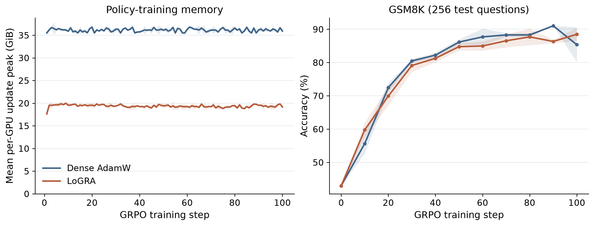
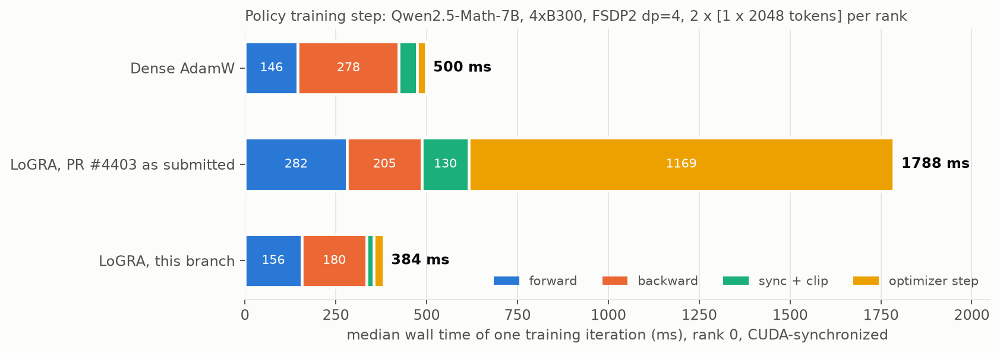
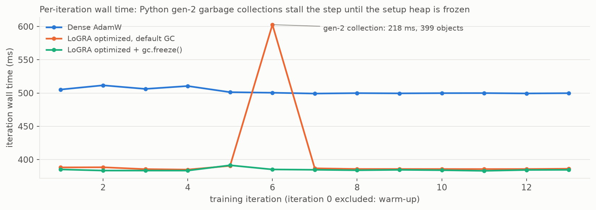

# LoGRA: low-rank gradient sketches for NeMo RL

Independent research worker for **native GRPO**, without predicted-KL step control.
Validated on Qwen2.5-Math-7B with two paired 100-update runs per method.

## What this shows

Direct sketch accumulation during backward; RowAdam or SGD updates; native AdamW
for non-target parameters; ordinary learning-rate scheduling; full-weight rollout
synchronization. Dense mode calls the unmodified native worker's training method.

## Running

From this directory, after preparing the repository's AutoModel/vLLM dependencies:

```bash
uv sync --locked --inexact --group test
uv run run_grpo.py --config configs/grpo_logra_smoke.yaml
uv run run_grpo.py --config configs/grpo_logra_smoke.yaml logra.enabled=false
```

## Scope

Dense HF linear layers, FSDP2, TP=CP=1, synchronous GRPO. No PEFT, MoE,
quantization, or CPU parameter offload. Resume initially requires the same DP size.

## Testing

```bash
uv run --locked --group test pytest tests/unit
uv run --locked --group test python -m torch.distributed.run \
  --standalone --nproc-per-node=2 tests/functional/fsdp_equivalence.py
```

The two-GPU test checks the update against an explicit dense-gradient projection,
including distributed averaging, global clipping and non-target AdamW updates.
The 7B smoke configuration is also used to check save/resume with the same DP size.

## Reproduction

Run both commands from this directory on allocated eight-GPU nodes. Repeat with
`grpo.seed=43` and distinct output directories for the second paired seed.

```bash
uv run --locked run_grpo.py --config configs/grpo_logra_7b.yaml \
  logra.enabled=false grpo.seed=42 \
  logger.log_dir=results/dense-s42 checkpointing.checkpoint_dir=results/dense-s42/checkpoints
uv run --locked run_grpo.py --config configs/grpo_logra_7b.yaml \
  logra.enabled=true grpo.seed=42 \
  logger.log_dir=results/logra-s42 checkpointing.checkpoint_dir=results/logra-s42/checkpoints
```

| Setting | Both methods |
|---|---|
| Model | Qwen2.5-Math-7B |
| Algorithm and reward | Native synchronous GRPO and `hf_math_verify` |
| Training data | GSM8K training split |
| Evaluation | First 256 GSM8K test questions, one response per question, every 10 steps; temperature 1.0, top-p 1.0 |
| Run length | 100 updates, training seeds 42 and 43 |
| Batch | 16 prompts × 8 responses; global batch 128, microbatch 1 |
| Context | 2,048 tokens including the prompt |
| Hardware per run | 8 A100 80GB GPUs: 4 FSDP2 training ranks and 4 rollout workers |
| Precision | FP32 parameter storage, BF16 computation |
| Memory options | Activation checkpointing and sequence packing |
| Learning rate | 5e-6; 50-step linear warmup from 10% of this rate, then constant |
| Regularization | Weight decay 0.01; native reference-policy KL penalty 0.01 |
| Rollout synchronization | Native full-weight synchronization |

Dense uses native AdamW. LoGRA uses rank 256, refreshed Rademacher projections,
projection seed 42, and RowAdam (`beta2=0.95`, `epsilon=1e-8`) on attention and MLP
linear weights. The selected weights are still updated: only their dense autograd
gradient buffers are disabled. Other parameters use native AdamW. This experiment does not enable
predicted-KL step control; the reference-policy KL penalty above belongs to the
native GRPO loss and is identical in both methods.

The validation container uses Python 3.12.3, PyTorch 2.13.0+cu130,
Transformers 5.12.1, vLLM 0.29.0, Ray 2.55.1 and AutoModel commit
`72daceffa54d77783e1f73a5ac165eb39b6b5ea1`. This is a preinstalled validation
environment; it is not the repository's Python 3.13.14 locked environment.
The workspace lock is checked separately with the repository-pinned uv 0.11.28.
`analysis/environment.py` records the actual versions and imported source paths.

## Measured results

Fresh native GRPO runs, seeds 42 and 43, 100 updates each. Values below are
mean ± sample standard deviation across seeds. Earlier smoke tests and historical
implementations are excluded.



Qwen2.5-Math-7B trained for 100 GRPO updates. Lines show the mean across two
seeds; shaded bands show sample standard deviation, without smoothing. Left:
mean per-GPU update peak memory on the policy-training GPUs (rollout GPUs
excluded). Right: accuracy on 256 fixed GSM8K test questions.

| Metric | Native Dense AdamW | Native GRPO + LoGRA |
|---|---:|---:|
| Mean update peak, GiB per training GPU | 36.13 ± 0.03 | 19.36 ± 0.03 |
| Maximum update peak, GiB per training GPU | 37.28 ± 0.19 | 20.15 ± 0.03 |
| Final GSM8K subset accuracy, % | 85.35 ± 5.25 | 88.48 ± 1.93 |

The first memory row averages each update's mean GPU peak over all 100 updates;
the second takes its maximum over updates. These measurements exclude rollout
GPUs and are not time-averaged or whole-node memory. The mean update peak falls
by **46.40%**.

| Training seed | Dense final accuracy, % | LoGRA final accuracy, % |
|---|---:|---:|
| 42 | 89.06 | 87.11 |
| 43 | 81.64 | 89.84 |

Both methods improve from 42.97% initial accuracy. LoGRA's final mean is 3.13
percentage points higher, but two seeds on 256 evaluation questions do not
establish superiority or equivalence. Dense seed 43 falls from 91.02% at step 90
to 81.64% at step 100; Dense's best observed accuracy is higher than LoGRA's in
both seeds. Report the full curves, not only the final point. No smoothing is used.

All 100 training batches match between methods within each seed, and evaluation
questions match across all steps and seeds. Raw results remain outside Git;
the comparison figure is included here for reference. The analysis commands below
regenerate it from native TensorBoard logs.

Validation passed: 11 unit tests; two-GPU FSDP numerical equivalence; 7B save/resume
in both modes; a final-source 7B smoke run; type, lint, format and workspace-lock
checks; and native test-recipe registration checks.

## Update rule

For each target linear weight, backward accumulates a gradient sketch `S` rather
than a full gradient. RowAdam maintains one second-moment value per output row:

```text
v = beta2 * v + (1 - beta2) * mean(S**2, columns)
D = S / (sqrt(v / (1 - beta2**step)) + epsilon)
W = (1 - lr * weight_decay) * W - lr * D @ A
```

`A` is the projection used to collect that step's sketch. It is refreshed only
after the update. This row-wise variant has no first moment and does not restore
the original gradient norm. There is no predicted-KL controller. Non-target
parameters retain native AdamW and remain trainable unless explicitly frozen.
Thus the comparison measures native GRPO before and after enabling LoGRA,
including its row-wise optimizer; it is not an equivalence claim about dense Adam.

## Performance

The training step is measured on a standalone 4-GPU FSDP2 harness (Qwen2.5-Math-7B,
fp32 parameters with bf16 autocast, two microbatches of one 2,048-token sequence per
rank, no Ray or vLLM) so that the optimizer can be profiled in isolation. Medians of
steady-state iterations, rank 0, CUDA-synchronized, on B300 GPUs:

| Variant | forward | backward | sync + clip | step | iteration | peak memory |
|---|---:|---:|---:|---:|---:|---:|
| Dense AdamW | 146 ms | 278 ms | 50 ms | 25 ms | 500 ms | 65.0 GiB |
| LoGRA, initial implementation | 282 ms | 205 ms | 130 ms | 1,169 ms | 1,788 ms | 45.5 GiB |
| LoGRA, current | 156 ms | 180 ms | 19 ms | 29 ms | 384 ms | 45.7 GiB |



LoGRA's backward pass is shorter than dense because the selected weights have no
gradient buffers to compute or reduce-scatter. The remaining work is kept off the
critical path as follows:

- Projections are drawn on the GPU, in place, from a per-layer seed. All ranks hold the
  same matrix; the optimizer checks this once with a fingerprint before the first
  update. Regenerating them on the CPU every step used to cost 1.1 s with the GPU idle.
- All sketches live in one `[total_rows, rank]` buffer, so synchronization, clipping
  and zeroing are one collective or kernel each instead of one per layer.
- The clipping norm uses `||S A||^2 = <S (A A^T), S>` with a `rank x rank` Gram matrix
  per layer; the dense gradient is never reconstructed.
- RowAdam runs once over the flat buffer in place, and each weight shard is updated with
  a single `addmm_` that also applies weight decay.
- Forward hooks reuse a persistent low-precision copy of each projection.
- The worker freezes the Python heap after setup (`gc.freeze()`). Without it a full
  collection fires inside the forward pass every few steps and stalls it by about 200 ms.



In the end-to-end smoke configuration (`configs/grpo_logra_smoke.yaml`, 4 training and
4 rollout GPUs), `timing/train/policy_training` at step 2 is 0.45 s for LoGRA against
0.51 s for the dense control; the initial implementation took 2.23 s.

## Configuration and code map

| File | Responsibility |
|---|---|
| `run_grpo.py` | Native synchronous GRPO setup and loop |
| `logra/policy.py`, `actor_environments.py` | Select and register the research worker |
| `logra/worker.py` | Sketch synchronization, clipping, checkpoint and metrics integration |
| `logra/compression.py` | Direct sketch accumulation and deterministic projections |
| `logra/optimizer.py`, `row_adam.py` | Parameter updates and optimizer state |
| `logra/setup.py` | Rebuild the native learning-rate schedule for optimizer groups |
| `logra/config.py` | Validated project settings |
| `analysis/` | Export raw scalar events and plot paired runs |

Set `logra.enabled=false` for the native Dense AdamW control. Both modes use the
same training loss, native reward verifier, data processing and full-weight
rollout synchronization. `logra.optimizer=sgd` is a numerical-reference option;
only the projected parameters use SGD in that mode.

### Memory measurement

`train/memory/mean_peak_allocated_gib` is the mean, across training GPUs, of each
GPU's maximum PyTorch-allocated memory during one policy training call.
`train/memory/max_peak_allocated_gib` reports the largest of those GPU peaks.
Neither includes the separate rollout GPUs. This is **not** time-averaged GPU
memory. Reserved allocator memory and allocation after the update are also logged.

### Analysis

```bash
uv run analysis/export_events.py /path/to/results --output /path/to/comparison.csv
uv run analysis/plot_comparison.py /path/to/comparison.csv --output /path/to/comparison
uv run analysis/summarize_comparison.py /path/to/comparison.csv --output /path/to/summary.json
```

Plotting uses NumPy and Matplotlib. Raw results remain outside the source tree.
Missing evaluations are left missing; curves are not smoothed. Bands use sample
standard deviation across seeds where multiple seeds are available.

The summary command requires all 100 update measurements and all scheduled evaluations
for both seeds. It reports final accuracy separately from the best observed accuracy
and refuses to compare incomplete runs.
